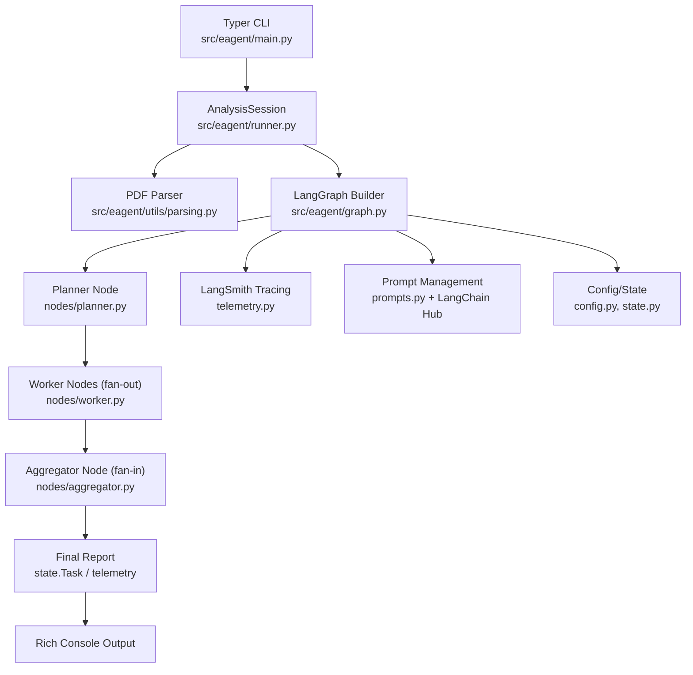

## Literature Agent (LangGraph Example)

This is a parallel Map-Reduce research analysis agent that showcases LangChain Hub prompts, LangSmith tracing, context chunking, node retries, and HITL controls.

### Quickstart
- Install dependencies: `uv sync`. Run `uv sync --extra test` when you also need the testing stack (Docling, pytest plugins, etc.).
- Copy environment variables: `cp .env.example .env`, then set `LANGSMITH_API_KEY`, `LANGSMITH_ENDPOINT`, `LANGSMITH_PROJECT`, and `LANGSMITH_TRACING=true` according to the LangGraph observability docs.
- Run the CLI: `uv run eagent analyze ./sample.pdf`

### Highlights
- LangGraph fan-out/fan-in execution with `interrupt_before` + `MemorySaver` for HITL pauses.
- Worker nodes ship with retries, validation, and placeholder fallbacks so failures do not stop the entire graph.
- LangSmith `@traceable` parsers and key/value evaluation scripts for replayability.
- Parsing pipeline based on `langchain_docling.DoclingLoader`, which reads PDF/DOCX/PPTX files while preserving traceable context.

### Architecture Overview
The diagram below shows how the CLI, LangGraph nodes, telemetry, and evaluation helpers connect end-to-end:

- Typer (`main.py`) powers the CLI, handles command parsing + HITL prompts, and hands execution to `AnalysisSession`.
- `AnalysisSession` calls `parse_pdf_structure` to produce the initial `Task` queue, then uses `graph.build_graph()` with the configured state.
- The planner node breaks the work into dimensions, worker nodes summarize sections in parallel, and failures fall back to placeholders so the aggregator can continue.
- The aggregator combines worker outputs into the final report. Telemetry hooks push traces to LangSmith, and the evaluation harness (`tests/eval.py`) reuses the same graph for dataset playback.
- Docling converts source files into normalized text while logging parsing steps in LangSmith traces for provenance.

### Docling Parsing
- Uses `langchain_docling.DoclingLoader` with `ExportType.DOC_CHUNKS`. Each chunk stores page numbers, bounding boxes, and other metadata before being concatenated into `doc_structure["body"]`.
- If Docling fails or is unavailable, the loader falls back to UTF-8 plain-text ingestion. The trace still records the fallback for diagnostics.
- Installing with `uv sync --extra test` brings in `langchain-docling`; you can also run `uv add langchain-docling` manually. GPU setups can follow Docling’s official guide for faster layout analysis.
