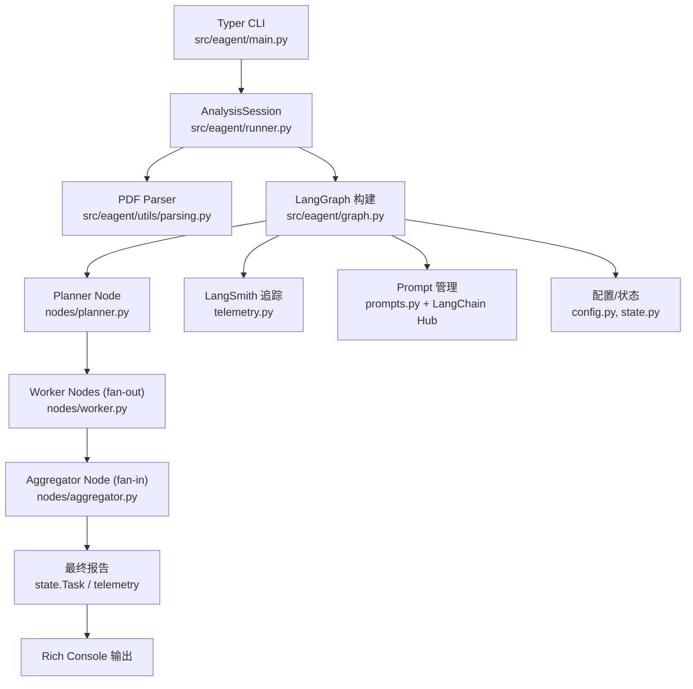

## Literature Agent (LangGraph 示例)

并行 Map-Reduce 架构的文献分析智能体示例，包含 LangChain Hub 提示词、LangSmith 追踪、上下文切片、节点重试与 HITL 控制。

### 快速开始
- 安装依赖：`uv sync`（如需运行测试或评估，额外执行 `uv sync --extra test` 安装测试依赖）。
- 复制环境变量：`cp .env.example .env`，并根据 LangGraph 观察性文档配置 `LANGSMITH_API_KEY`、`LANGSMITH_ENDPOINT`、`LANGSMITH_PROJECT`、`LANGSMITH_TRACING=true`。
- 运行 CLI：`uv run eagent`

### 关键特性
- LangGraph 并行 fan-out/fan-in，支持 interrupt_before + MemorySaver 实现 HITL。
- Worker 节点内置重试、校验与占位回退，避免整体中断。
- LangSmith `traceable` 解析器与 KV 评测脚本。

### 架构概览
下面的模块关系图展示了从 CLI 到 LangGraph 节点以及遥测/评估链路的主要流向：

- CLI 由 Typer (`main.py`) 驱动，负责解析命令、展示 HITL 交互，并通过 `AnalysisSession` 触发分析流程。
- `AnalysisSession` 调用 `parse_pdf_structure` 生成 `Task` 队列，随后利用 `graph.build_graph()` 构建 LangGraph，并注入配置/状态。
- Graph 的 planner 节点拆解任务，worker 节点并发处理章节摘要，失败路径通过回退与占位结果保证 aggregator 可继续运行。
- Aggregator 汇总 worker 结果生成最终报告；过程中 telemetry 钩子会向 LangSmith 推送追踪，评估脚本 (`tests/eval.py`) 可基于相同 graph 运行数据集回放。
