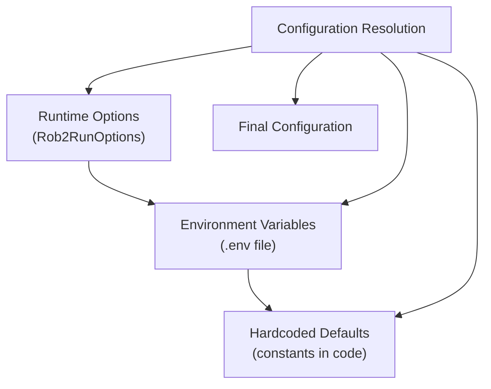
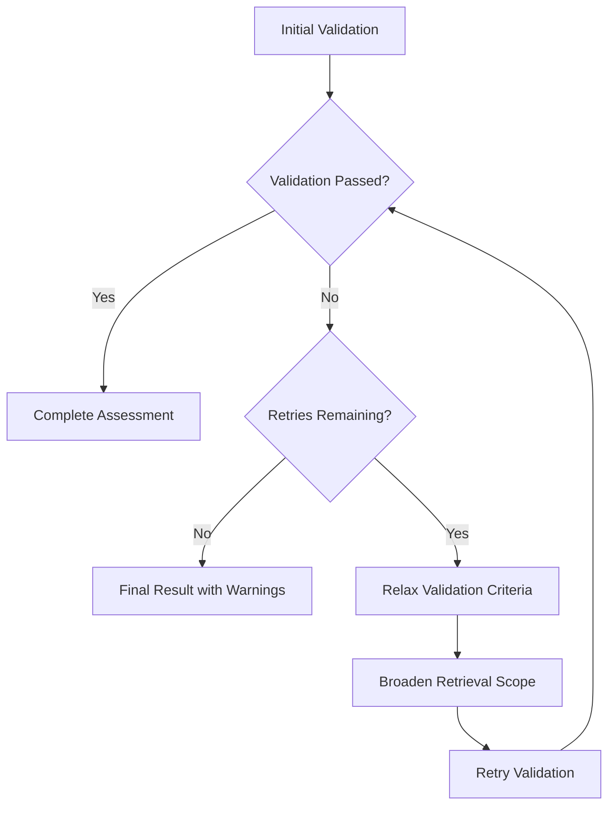

# Advanced Configuration

<cite>
**Referenced Files in This Document**   
- [requests.py](file://src/schemas/requests.py)
- [config.py](file://src/core/config.py)
- [rob2_runner.py](file://src/services/rob2_runner.py)
- [config.py](file://src/cli/commands/config.py)
- [common.py](file://src/cli/common.py)
- [.env.example](file://.env.example)
- [0003-validation-mode-and-completeness-relaxation.md](file://docs/adr/0003-validation-mode-and-completeness-relaxation.md)
- [0002-evidence-fusion-rrf.md](file://docs/adr/0002-evidence-fusion-rrf.md)
- [fusion.py](file://src/evidence/fusion.py)
- [test_rob2_workflow_retry.py](file://tests/integration/test_rob2_workflow_retry.py)
</cite>

## Table of Contents
1. [Introduction](#introduction)
2. [Rob2RunOptions Model](#rob2runoptions-model)
3. [Configuration System Hierarchy](#configuration-system-hierarchy)
4. [Advanced Settings for Workflow Behavior](#advanced-settings-for-workflow-behavior)
5. [Validation Retry Policies](#validation-retry-policies)
6. [Fusion Weights and Retrieval Configuration](#fusion-weights-and-retrieval-configuration)
7. [Domain-Specific Parameters](#domain-specific-parameters)
8. [Configuration Profiles](#configuration-profiles)
9. [Performance and Accuracy Implications](#performance-and-accuracy-implications)
10. [Best Practices](#best-practices)
11. [Security Considerations](#security-considerations)

## Introduction

This document provides comprehensive guidance on advanced configuration options for the ROB2 assessment system. It explains the Rob2RunOptions model, configuration override hierarchy, and advanced settings for fine-tuning workflow behavior. The document covers validation retry policies, fusion weights, domain-specific parameters, and their impact on system performance and accuracy. It also provides configuration profiles for different assessment scenarios, best practices for managing complex configurations, and security considerations for sensitive options.

**Section sources**
- [requests.py](file://src/schemas/requests.py)
- [config.py](file://src/core/config.py)

## Rob2RunOptions Model

The Rob2RunOptions model defines per-run configuration overrides for the ROB2 assessment system. This Pydantic model provides a comprehensive set of parameters that allow fine-grained control over various aspects of the assessment workflow, from preprocessing to domain reasoning and output controls.

The model is designed with optional fields that can be selectively overridden, allowing users to customize specific aspects of the workflow without needing to specify all possible parameters. Each field includes appropriate validation constraints such as minimum values for integers (ge=1) and range constraints for floats (ge=0, le=1).

The Rob2RunOptions model is structured into logical groups:
- Preprocessing (Docling) parameters for document layout analysis and chunking
- Retrieval and fusion settings for candidate evidence gathering
- Validator configurations for relevance, existence, consistency, and completeness checks
- Domain reasoning parameters for D1-D5 assessment domains
- Domain audit settings for evidence patching and final validation
- Output controls for debugging and reporting

This model serves as the primary interface for runtime configuration, allowing users to override default settings and environment variables on a per-run basis.

**Section sources**
- [requests.py](file://src/schemas/requests.py#L24-L166)

## Configuration System Hierarchy

The ROB2 system implements a hierarchical configuration system with three levels of precedence: defaults, environment variables, and runtime options. This hierarchy ensures flexibility while maintaining consistent default behavior.

At the base level, default values are defined in the codebase as constants in the rob2_runner.py module. These defaults provide sensible starting values for all configuration parameters. For example, the default top_k value is 5, rrf_k is 60, and relevance_min_confidence is 0.6.

The second level consists of environment variables defined in the .env file, which are loaded through the Settings class in config.py. These environment variables allow system-wide configuration that persists across runs. The Settings class uses Pydantic's SettingsConfigDict to load values from the .env file with UTF-8 encoding. Environment variables follow a naming convention using uppercase with underscores (e.g., DOCLING_LAYOUT_MODEL, QUERY_PLANNER_MODEL).

The highest precedence level is runtime options provided through the Rob2RunOptions model. These options can be specified via API calls, CLI parameters, or configuration files and override both defaults and environment variables. The configuration resolution occurs in the _build_run_state function in rob2_runner.py, which systematically resolves each parameter by checking the runtime options first, then falling back to environment settings, and finally using hardcoded defaults.

This three-tiered hierarchy enables flexible deployment scenarios: default values ensure the system works out-of-the-box, environment variables allow customization for specific deployment environments, and runtime options provide per-execution control for specialized assessments.

**Diagram sources**
- [rob2_runner.py](file://src/services/rob2_runner.py#L20-L39)
- [config.py](file://src/core/config.py#L186-L190)
- [requests.py](file://src/schemas/requests.py#L24-L166)

**Section sources**
- [rob2_runner.py](file://src/services/rob2_runner.py#L20-L39)
- [config.py](file://src/core/config.py#L186-L190)
- [requests.py](file://src/schemas/requests.py#L24-L166)

## Advanced Settings for Workflow Behavior

The ROB2 system provides numerous advanced settings that allow fine-tuning of workflow behavior across different stages of the assessment process. These settings are organized into logical categories that correspond to the workflow pipeline.

Preprocessing settings control document analysis and chunking behavior. The docling_layout_model parameter specifies which layout analysis model to use, while docling_chunker_model determines the text chunking strategy. The docling_chunker_max_tokens parameter limits the maximum size of text chunks, which affects how content is segmented for processing.

Retrieval and fusion settings govern how evidence is gathered and combined. The top_k parameter controls the number of candidate answers retained per question, while per_query_top_n determines how many candidates are considered during retrieval. The rrf_k parameter is used in the Reciprocal Rank Fusion algorithm to balance the contribution of different retrieval engines.

Validator settings allow customization of evidence quality checks. Each validator (relevance, existence, consistency, completeness) has its own set of parameters that control its behavior. For example, relevance_min_confidence sets the threshold for what constitutes a relevant piece of evidence, while consistency_min_confidence determines the confidence level required for consistency validation.

Domain reasoning settings enable customization of the assessment logic for each of the five domains (D1-D5). Each domain has its own model configuration, allowing different LLMs to be used for different assessment aspects. Temperature parameters control the randomness of model outputs, while timeout and max_tokens settings manage resource usage.

Output controls provide options for debugging and reporting. The debug_level parameter can be set to "none", "min", or "full" to control the amount of diagnostic information included in the output. The include_reports and include_audit_reports flags determine whether detailed validation reports are included in the results.

**Section sources**
- [requests.py](file://src/schemas/requests.py#L27-L162)

## Validation Retry Policies

The ROB2 system implements sophisticated validation retry policies to handle cases where initial evidence validation fails. These policies are controlled by several key parameters in the Rob2RunOptions model and are implemented in the _prepare_validation_retry_node function in rob2_graph.py.

The validation_max_retries parameter sets the maximum number of times the validation process will be retried when evidence quality requirements are not met. This provides a safety net to ensure that assessments can complete even when initial evidence retrieval is insufficient.

The validation_relax_on_retry parameter controls whether the system should relax validation criteria during retry attempts. When enabled (the default), the system progressively lowers the bar for evidence acceptance to increase the likelihood of successful validation. This relaxation strategy includes:
- Reducing the relevance_min_confidence threshold
- Disabling strict quote and text matching requirements
- Forcing completeness_require_relevance to false

The retry process also modifies retrieval parameters to cast a wider net for evidence. On retry attempts, the system increases per_query_top_n (doubling it up to a maximum of 200) and increases top_k (incrementing by 3 up to a maximum of 10). This broader retrieval scope increases the chances of finding sufficient evidence.

The validation_fail_on_consistency parameter determines whether consistency failures should cause the entire validation process to fail. When set to true (the default), any consistency issues will trigger a retry or final failure. When set to false, consistency issues are treated as non-fatal.

These retry policies are designed to balance thoroughness with practicality, ensuring that assessments can complete while maintaining appropriate quality standards. The test_rob2_workflow_retry.py file contains integration tests that verify the retry logic functions as expected.

**Diagram sources**
- [rob2_runner.py](file://src/services/rob2_runner.py#L242-L246)
- [rob2_graph.py](file://src/pipelines/graphs/rob2_graph.py#L248-L271)
- [test_rob2_workflow_retry.py](file://tests/integration/test_rob2_workflow_retry.py)

**Section sources**
- [rob2_runner.py](file://src/services/rob2_runner.py#L242-L246)
- [rob2_graph.py](file://src/pipelines/graphs/rob2_graph.py#L248-L271)
- [test_rob2_workflow_retry.py](file://tests/integration/test_rob2_workflow_retry.py)

## Fusion Weights and Retrieval Configuration

The evidence fusion system in ROB2 uses a sophisticated approach to combine results from multiple retrieval engines, including rule-based, BM25, and SPLADE. The fusion process is based on Reciprocal Rank Fusion (RRF), which combines results based on their relative rankings rather than raw scores, making it robust to differences in scoring scales across engines.

The fusion process is controlled by several key parameters. The rrf_k parameter (default: 60) is a constant used in the RRF formula that determines how quickly the contribution of lower-ranked items diminishes. A higher rrf_k value gives more weight to items with similar rankings across multiple engines.

The fusion_engine_weights parameter allows users to assign custom weights to different retrieval engines. This dictionary maps engine names to floating-point weights, enabling prioritization of certain retrieval methods over others. For example, setting {"rule_based": 2.0, "bm25": 1.0, "splade": 1.5} would give rule-based results twice the weight of BM25 results.

Retrieval configuration includes parameters for each retrieval engine. The query_planner parameter determines whether queries are generated deterministically or using an LLM. When using LLM-based query planning, parameters like query_planner_model, query_planner_temperature, and query_planner_max_tokens control the behavior of the query generation process.

SPLADE-specific parameters include splade_model_id (specifying the model to use), splade_device (CPU, CUDA, or MPS), and performance settings like splade_batch_size and splade_query_max_length. The system automatically detects local SPLADE models in the ./models directory if no model ID is specified.

Reranking can be applied after fusion using the reranker parameter, which can be set to "none" or "cross_encoder". When using cross-encoder reranking, parameters like reranker_model_id, reranker_max_length, and reranker_batch_size control the reranking process.

The use_structure parameter enables or disables structure-aware filtering, which prioritizes content from relevant document sections. When combined with section_bonus_weight, this feature can significantly improve retrieval precision by giving preference to evidence from appropriate sections of the document.

**Section sources**
- [requests.py](file://src/schemas/requests.py#L34-L65)
- [fusion.py](file://src/evidence/fusion.py)
- [0002-evidence-fusion-rrf.md](file://docs/adr/0002-evidence-fusion-rrf.md)

## Domain-Specific Parameters

The ROB2 system provides specialized configuration parameters for each of the five assessment domains (D1-D5), allowing fine-tuning of the evaluation process for different aspects of study quality. These domain-specific parameters enable customization of the reasoning process for randomization (D1), deviations from intended interventions (D2), missing outcome data (D3), measurement of outcomes (D4), and selection of reported results (D5).

Each domain has its own set of LLM configuration parameters, including domain-specific model IDs (d1_model, d2_model, etc.), model providers, temperature settings, timeouts, and token limits. This allows different models to be used for different domains based on their specific requirements. For example, a more conservative model might be used for D1 (randomization) while a more exploratory model could be used for D5 (selective reporting).

The d2_effect_type parameter is a domain-specific setting that determines whether the assessment focuses on assignment or adherence aspects of intervention deviations. This parameter influences the reasoning process in the D2 domain, guiding the model to focus on different aspects of the intervention implementation.

Domain evidence parameters control how evidence is gathered and evaluated within each domain. The domain_evidence_top_k parameter sets the number of evidence items considered for domain-level reasoning, allowing control over the depth of analysis. Higher values provide more comprehensive analysis but increase processing time.

Domain audit parameters provide additional controls for post-domain assessment validation. The domain_audit_mode parameter can be set to "none" or "llm" to enable or disable full-text auditing. When enabled, the system can patch missing evidence and optionally rerun domain assessments with the updated evidence.

These domain-specific parameters work together to create a flexible assessment framework that can be adapted to different types of studies and review requirements. The parameters are resolved in the _build_run_state function, which ensures consistent application of both global and domain-specific settings.

**Section sources**
- [requests.py](file://src/schemas/requests.py#L106-L157)
- [rob2_runner.py](file://src/services/rob2_runner.py#L247-L315)

## Configuration Profiles

The ROB2 system supports different configuration profiles for various assessment scenarios, allowing users to optimize the workflow for specific use cases. These profiles are implemented through combinations of configuration settings that balance accuracy, speed, and resource usage.

For rapid screening scenarios, a lightweight profile can be configured with minimal validation and retrieval overhead. This profile would set relevance_mode, consistency_mode, and domain_audit_mode to "none", disable reranking (reranker="none"), and use lower values for top_k and per_query_top_n. The query_planner can be set to "deterministic" to avoid LLM usage for query generation. This profile prioritizes speed over thoroughness, making it suitable for initial triage of large numbers of studies.

For comprehensive assessment scenarios, a thorough profile maximizes evidence quality and validation rigor. This profile enables all validation modes (relevance_mode="llm", consistency_mode="llm"), uses cross-encoder reranking (reranker="cross_encoder"), and sets higher values for top_k and per_query_top_n. The validation_relax_on_retry parameter is typically disabled to maintain strict quality standards throughout the process.

A balanced profile provides a middle ground between speed and thoroughness. This profile might enable relevance validation but disable consistency checks, use moderate retrieval parameters, and enable domain auditing with conservative settings. The fusion_engine_weights can be tuned to emphasize rule-based and BM25 results over SPLADE when domain expertise suggests certain retrieval methods are more reliable for specific study types.

Specialized profiles can be created for specific domains or study types. For example, a clinical trial profile might emphasize D1 and D2 parameters with stricter validation criteria, while a systematic review profile might focus on D4 and D5 with enhanced auditing capabilities. These profiles can be saved as configuration files (JSON or YAML) and reused across assessments.

The CLI config command provides tools for managing configuration profiles, including exporting current settings, showing differences from defaults, and generating example configuration files. This facilitates sharing and version control of configuration profiles across teams and projects.

**Section sources**
- [config.py](file://src/cli/commands/config.py)
- [common.py](file://src/cli/common.py)
- [.env.example](file://.env.example)

## Performance and Accuracy Implications

Advanced configuration options in the ROB2 system have significant implications for both performance and accuracy, requiring careful consideration when selecting settings for specific use cases.

Performance characteristics are primarily influenced by LLM usage, retrieval scope, and validation thoroughness. Enabling LLM-based components (relevance_mode="llm", consistency_mode="llm", query_planner="llm") substantially increases processing time and computational costs due to API calls or local model inference. Retrieval parameters like top_k, per_query_top_n, and fusion_top_k directly affect the amount of data processed, with higher values requiring more memory and processing time. The reranker setting has a particularly significant impact, as cross-encoder reranking processes all candidate pairs, resulting in quadratic complexity relative to the number of candidates.

Accuracy is influenced by the comprehensiveness of evidence gathering and the strictness of validation criteria. Higher retrieval parameters generally improve accuracy by considering more potential evidence, but with diminishing returns beyond certain thresholds. Validation settings like relevance_min_confidence and consistency_min_confidence control the quality threshold for evidence, with higher values producing more reliable but potentially incomplete assessments. The fusion_engine_weights parameter allows tuning of the evidence combination strategy, which can improve accuracy when domain expertise is incorporated into the weighting scheme.

There is a fundamental trade-off between thoroughness and efficiency in the configuration system. Strict validation with high retrieval parameters and multiple LLM validations produces the most accurate results but at the highest computational cost. Conversely, relaxed settings with minimal validation are much faster but risk missing important evidence or accepting low-quality evidence.

The retry policies introduce additional complexity to the performance-accuracy relationship. While retries can improve accuracy by recovering from initial validation failures, each retry attempt consumes additional resources. The validation_relax_on_retry feature improves completion rates but may reduce evidence quality in subsequent attempts.

Optimal configuration depends on the specific assessment goals, available resources, and tolerance for false negatives versus false positives. For high-stakes decisions, a thorough configuration with multiple validation layers is appropriate despite the performance cost. For large-scale screening, a lighter configuration with targeted validation may be more practical.

**Section sources**
- [rob2_runner.py](file://src/services/rob2_runner.py)
- [requests.py](file://src/schemas/requests.py)
- [test_rob2_workflow_retry.py](file://tests/integration/test_rob2_workflow_retry.py)

## Best Practices

Effective management of advanced configurations in the ROB2 system requires adherence to several best practices to ensure reliable, maintainable, and secure operation.

Use configuration files for complex settings rather than command-line parameters. The system supports both JSON and YAML configuration files, which provide better readability and version control compared to lengthy command-line arguments. Configuration files can be shared across team members and stored in version control systems.

Leverage the configuration hierarchy appropriately by setting organization-wide defaults in environment variables (.env file) and using runtime options only for assessment-specific overrides. This approach ensures consistency while allowing necessary flexibility. The CLI config diff command can help identify deviations from defaults.

Validate configuration changes through testing before deploying to production. The system's modular design allows testing of specific configuration combinations on representative samples. Integration tests like those in test_rob2_workflow_retry.py provide a framework for verifying that configuration changes produce expected behavior.

Document configuration profiles for different use cases, including the rationale for specific settings. This documentation helps ensure consistent application of configurations across different assessments and facilitates onboarding of new team members.

Monitor performance metrics when adjusting configuration parameters, particularly those affecting LLM usage and retrieval scope. Establish baselines for processing time and resource usage to identify configurations that may be too resource-intensive for regular use.

Use the validation retry policies judiciously. While retries can improve assessment completion rates, excessive reliance on relaxed criteria in retry attempts may compromise evidence quality. Consider the trade-offs between thoroughness and practicality based on the specific assessment context.

Implement version control for configuration files to track changes over time. This practice enables rollback to previous configurations if issues arise and provides an audit trail of configuration evolution.

Regularly review and update configurations as new models and features become available. The system's design allows for incremental improvements to configurations without requiring complete rewrites.

**Section sources**
- [config.py](file://src/cli/commands/config.py)
- [common.py](file://src/cli/common.py)
- [test_rob2_workflow_retry.py](file://tests/integration/test_rob2_workflow_retry.py)

## Security Considerations

The ROB2 system's advanced configuration options include several security-sensitive parameters that require careful handling to protect sensitive information and ensure system integrity.

The most critical security consideration involves API keys and authentication tokens, such as SPLADE_HF_TOKEN in the environment variables. These secrets should never be committed to version control systems. The .env.example file provides a template with placeholder values, and actual credentials should be stored securely and excluded from repositories using .gitignore.

Configuration files that may contain sensitive information should be protected with appropriate file system permissions. When sharing configurations, use the CLI config export command with care, ensuring that sensitive values are redacted or encrypted as needed.

The system's support for local model paths (e.g., splade_model_id pointing to local directories) introduces potential security considerations regarding file system access. Ensure that the application runs with minimal necessary privileges and that model directories are protected from unauthorized modification.

When using LLM providers, be aware of data privacy implications. Configuration parameters that specify external LLM endpoints may result in document content being transmitted to third-party services. Review provider data handling policies and consider using local models for sensitive assessments.

The flexibility of the configuration system could potentially be exploited to degrade system performance through resource exhaustion. For example, extremely high values for retrieval parameters or infinite retry loops could be used in denial-of-service attacks. Implement input validation and resource limits in production deployments.

Audit logs should be maintained for configuration changes, particularly in multi-user environments. The configuration system's design allows tracking of which settings were used for each assessment, providing an audit trail for reproducibility and security reviews.

Regular security reviews should include examination of configuration practices, particularly in relation to credential management, data privacy, and access controls. The principle of least privilege should guide configuration decisions, with settings restricted to the minimum necessary for each use case.

**Section sources**
- [.env.example](file://.env.example)
- [config.py](file://src/core/config.py)
- [common.py](file://src/cli/common.py)