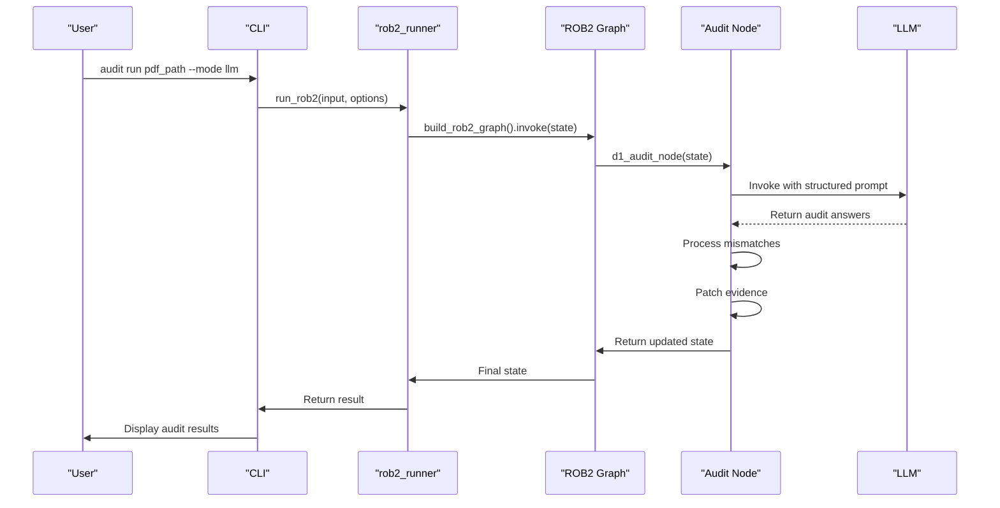

# Audit Command

<cite>
**Referenced Files in This Document**   
- [audit.py](file://src/cli/commands/audit.py)
- [domain_audit.py](file://src/pipelines/graphs/nodes/domain_audit.py)
- [domain_audit_system.md](file://src/llm/prompts/validators/domain_audit_system.md)
- [rob2_runner.py](file://src/services/rob2_runner.py)
- [config.py](file://src/core/config.py)
</cite>

## Table of Contents
1. [Introduction](#introduction)
2. [Command Syntax](#command-syntax)
3. [Input Requirements](#input-requirements)
4. [Output Format](#output-format)
5. [Implementation Details](#implementation-details)
6. [Configuration Options](#configuration-options)
7. [Usage Examples](#usage-examples)
8. [Troubleshooting](#troubleshooting)
9. [Conclusion](#conclusion)

## Introduction

The audit command performs domain-level evidence audits for ROB2 (Risk of Bias 2) assessments. It compares domain agent answers with full-text document analysis to identify evidence gaps and generate audit reports. The command supports both per-domain audits and a final all-domain audit, with capabilities to patch missing evidence and re-run domain assessments.

The audit functionality is implemented as part of a larger ROB2 assessment pipeline, where it serves as a validation mechanism to ensure domain decisions are properly supported by evidence from the full document text. This helps maintain the integrity and accuracy of risk of bias assessments by identifying and correcting potential discrepancies between domain agent reasoning and actual document content.

**Section sources**
- [audit.py](file://src/cli/commands/audit.py#L1-L82)
- [domain_audit.py](file://src/pipelines/graphs/nodes/domain_audit.py#L1-L789)

## Command Syntax

The audit command is executed through the CLI with the following syntax:

```bash
audit run [OPTIONS] PDF_PATH
```

The command requires a PDF path as input and supports various options to control audit behavior:

- `PDF_PATH`: Path to the PDF document to audit (required)
- `--mode`: Audit mode (default: "llm", alternatives: "none")
- `--audit-window`: Evidence patch window size
- `--audit-rerun/--no-audit-rerun`: Whether to re-run domain agents after patching (default: True)
- `--audit-final/--no-audit-final`: Whether to execute final all-domain audit (default: False)
- `--options`: JSON string of Rob2RunOptions
- `--options-file`: Path to JSON/YAML file with Rob2RunOptions
- `--set`: Key=value pairs to override individual options
- `--json`: Output JSON format
- `--table/--no-table`: Output ROB2 table format (default: True)

The command integrates with the ROB2 runner service, passing audit configuration through the Rob2RunOptions object and executing the audit as part of the overall assessment workflow.

**Section sources**
- [audit.py](file://src/cli/commands/audit.py#L24-L81)

## Input Requirements

The audit command requires two primary inputs: validated evidence sets and domain contexts.

### Validated Evidence Sets

The audit process operates on validated evidence candidates stored in the `validated_candidates` state. These candidates represent evidence that has passed previous validation steps (relevance, existence, consistency, and completeness). Each candidate is organized by question ID and contains evidence spans with paragraph identifiers, text content, and metadata.

The evidence must be properly structured with:
- Valid paragraph IDs that correspond to document sections
- Accurate text excerpts from the source document
- Proper metadata including page numbers and section titles

### Domain Contexts

Domain contexts are provided through the `doc_structure` and `question_set` state variables:

- `doc_structure`: Contains the full document structure with paragraph-level spans, each having a unique paragraph_id, title, page number, and text content. This allows the audit to analyze the complete document context.

- `question_set`: Defines the ROB2 signaling questions for each domain (D1-D5), including question IDs, domains, text, answer options, and logical conditions. The audit uses this to understand which questions should be answered for each domain.

The audit also considers domain-specific state information such as `d1_decision`, `d2_decision`, etc., which contain the domain agent answers to compare against the audit findings.

**Section sources**
- [domain_audit.py](file://src/pipelines/graphs/nodes/domain_audit.py#L130-L145)
- [rob2.py](file://src/schemas/internal/rob2.py#L82-L130)
- [documents.py](file://src/schemas/internal/documents.py#L34-L44)

## Output Format

The audit command produces comprehensive output showing audit findings, evidence gaps, and patching recommendations.

### Audit Findings

Audit findings are reported in the `domain_audit_report` and `domain_audit_reports` state variables. Each report contains:

- `domain`: The domain being audited (D1-D5 or "ALL" for final audit)
- `mode`: Audit mode ("llm" or "none")
- `enabled`: Whether auditing is enabled
- `model`: LLM model used for auditing
- `model_provider`: LLM provider
- `audited_questions`: Number of questions audited
- `mismatches`: List of discrepancies between domain agent answers and audit answers
- `patch_window`: Size of the evidence patch window
- `patches_applied`: Number of patches applied per question
- `rerun_enabled`: Whether domain re-running is enabled
- `domain_rerun`: Whether the domain was re-run after patching

### Evidence Gaps

Evidence gaps are identified in the `mismatches` array within audit reports. Each mismatch includes:

- `question_id`: ID of the question with a gap
- `domain`: Domain of the question
- `effect_type`: Effect type (for D2 domain)
- `domain_answer`: Original answer from domain agent
- `audit_answer`: Answer from full-text audit
- `audit_confidence`: Confidence score of the audit answer (0.0-1.0)
- `audit_evidence`: Supporting evidence citations with paragraph_id and quote

### Patching Recommendations

When evidence gaps are found, the audit system generates patching recommendations by extracting relevant evidence from the document and adding it to the validated candidates. The patching process:

1. Identifies evidence citations from the audit response
2. Maps paragraph IDs to document spans
3. Expands the evidence window based on the patch_window parameter
4. Creates new evidence candidates with proper metadata
5. Deduplicates candidates to avoid redundant evidence

The number of patches applied per question is controlled by the `domain_audit_max_patches_per_question` setting.

**Section sources**
- [domain_audit.py](file://src/pipelines/graphs/nodes/domain_audit.py#L220-L230)
- [domain_audit.py](file://src/pipelines/graphs/nodes/domain_audit.py#L619-L678)

## Implementation Details

The audit functionality is implemented across multiple components, with the core logic in the domain_audit.py module.

### Audit Logic Implementation

The audit process follows these steps:

1. **Input Validation**: The system validates that required inputs (doc_structure, question_set, validated_candidates) are present in the state.

2. **Mode Check**: If audit mode is "none", the process exits early with a disabled report.

3. **Question Selection**: Selects questions for the target domain using _select_domain_questions, handling D2 domain effect types appropriately.

4. **Prompt Construction**: Builds a structured prompt containing domain questions and full document spans in JSON format.

5. **LLM Invocation**: Calls the audit LLM with structured output to generate audit answers following the _AuditOutput schema.

6. **Response Parsing**: Extracts JSON from the LLM response and validates it against the expected schema.

7. **Answer Normalization**: Normalizes audit answers to match domain answer options and applies question conditions.

8. **Mismatch Detection**: Compares audit answers with domain agent answers to identify discrepancies.

9. **Evidence Patching**: For each mismatch, extracts evidence citations and creates new evidence candidates.

10. **Domain Re-running**: If enabled and patches were applied, re-runs the domain agent with updated evidence.

The implementation uses a modular design with separate functions for each step, allowing for clear separation of concerns and easier maintenance.

### LLM Prompt Templates

The audit system uses a structured prompt template defined in domain_audit_system.md. The template instructs the LLM to:

- Act as a strict ROB2 audit assistant
- Answer each question using only the provided document
- Choose answers strictly from the provided options
- Provide a rationale for each answer
- Cite evidence with exact paragraph IDs and quotes
- Return only a JSON object with the specified schema

The prompt emphasizes quality requirements:
- No hallucination of paragraph IDs
- Exact quotes from the document text
- Preference for fewer but stronger citations
- Proper handling of NI (No Information) and NA (Not Applicable) cases

The user prompt is dynamically constructed with JSON containing domain_questions and document_spans, ensuring all necessary context is provided to the LLM.



**Diagram sources**
- [domain_audit.py](file://src/pipelines/graphs/nodes/domain_audit.py#L124-L243)
- [rob2_runner.py](file://src/services/rob2_runner.py#L41-L65)
- [rob2_graph.py](file://src/pipelines/graphs/rob2_graph.py#L1-L426)

**Section sources**
- [domain_audit.py](file://src/pipelines/graphs/nodes/domain_audit.py#L1-L789)
- [domain_audit_system.md](file://src/llm/prompts/validators/domain_audit_system.md#L1-L37)

## Configuration Options

The audit command supports various configuration options to control its behavior, available through environment variables, configuration files, or command-line parameters.

### Audit Strictness Configuration

Audit strictness can be configured through several parameters:

- `domain_audit_temperature`: Controls randomness of LLM responses (default: 0.0 for deterministic output)
- `domain_audit_max_retries`: Number of times to retry LLM calls on failure (default: 2)
- `domain_audit_timeout`: Timeout for LLM calls in seconds (default: None)
- `domain_audit_max_tokens`: Maximum tokens for LLM responses (default: None)

These settings allow users to balance between strict, deterministic auditing and more flexible analysis based on their requirements.

### Evidence Patching Configuration

Evidence patching behavior is controlled by:

- `domain_audit_patch_window`: Number of adjacent paragraphs to include when patching evidence (default: 0, meaning only the cited paragraph)
- `domain_audit_max_patches_per_question`: Maximum number of evidence patches to apply per question (default: 3)

The patch window allows for contextual expansion around cited evidence, while the max patches limit prevents excessive evidence accumulation.

### Audit Execution Configuration

Additional execution options include:

- `domain_audit_mode`: Whether to enable auditing ("llm" or "none")
- `domain_audit_model`: LLM model to use for auditing (defaults to D1 model if not specified)
- `domain_audit_model_provider`: Provider for the audit model
- `domain_audit_rerun_domains`: Whether to re-run domain agents after applying evidence patches (default: False)
- `domain_audit_final`: Whether to run a final all-domain audit after individual domain audits (default: False)

These options provide fine-grained control over the audit workflow, allowing users to customize the process for different use cases.

**Section sources**
- [config.py](file://src/core/config.py#L154-L184)
- [rob2_runner.py](file://src/services/rob2_runner.py#L284-L316)
- [audit.py](file://src/cli/commands/audit.py#L33-L44)

## Usage Examples

### Running a Domain Audit

To run an audit for a specific domain:

```bash
audit run document.pdf --mode llm --audit-rerun
```

This command:
1. Loads the PDF document
2. Performs a full-text audit using the LLM
3. Identifies any discrepancies between domain agent answers and audit findings
4. Patches missing evidence into the validated candidates
5. Re-runs the domain agent with updated evidence

### Running a Final All-Domain Audit

To run a comprehensive audit across all domains:

```bash
audit run document.pdf --mode llm --audit-final
```

This performs individual domain audits followed by a final audit that evaluates all domains simultaneously, providing a comprehensive assessment of evidence coverage.

### Configuring Patching Behavior

To control evidence patching with a window of 1 paragraph and maximum 2 patches per question:

```bash
audit run document.pdf --mode llm --audit-window 1 --set domain_audit_max_patches_per_question=2
```

This configuration expands the evidence patch to include adjacent paragraphs, providing more context around cited evidence.

### Disabling Domain Re-running

To perform an audit without re-running domain agents:

```bash
audit run document.pdf --mode llm --no-audit-rerun
```

This is useful for audit-only scenarios where you want to identify gaps without automatically correcting them.

### Using Configuration Files

To use a JSON options file:

```bash
audit run document.pdf --options-file audit_config.json
```

Where audit_config.json contains:
```json
{
  "domain_audit_mode": "llm",
  "domain_audit_patch_window": 1,
  "domain_audit_max_patches_per_question": 5,
  "domain_audit_rerun_domains": true
}
```

### Interpreting Audit Results

After running an audit, results can be interpreted by examining:

1. The audit report for each domain
2. Mismatches between domain answers and audit answers
3. Applied patches and their sources
4. Whether domains were re-run successfully

Key indicators of audit findings:
- High confidence audit answers (0.8+) strongly suggest evidence gaps
- Multiple mismatches in a domain may indicate systemic issues
- Failed patching may suggest citation errors
- Repeated mismatches after re-running may indicate deeper issues

**Section sources**
- [audit.py](file://src/cli/commands/audit.py#L24-L81)
- [domain_audit.py](file://src/pipelines/graphs/nodes/domain_audit.py#L124-L243)

## Troubleshooting

### False Audit Findings

False audit findings can occur when the audit LLM incorrectly identifies evidence gaps. This may happen due to:

- **Overly strict interpretation**: The audit LLM may be too conservative in its evidence requirements. Solution: Review the audit prompt and consider adjusting the strictness.

- **Context fragmentation**: If document spans are too small, the audit LLM may miss relevant context. Solution: Ensure proper document chunking that preserves context around key information.

- **Citation matching issues**: The system may fail to match quotes to paragraphs due to text normalization differences. Solution: Check the _quote_in_text function and ensure consistent text processing.

### Missing Evidence Patches

When evidence patches are not applied despite identified gaps:

- **Invalid paragraph IDs**: Ensure cited paragraph IDs exist in the document structure. The audit LLM must not invent paragraph IDs.

- **Quote matching failures**: The system verifies that quotes exist in the specified paragraphs. If quotes don't match exactly (including whitespace), patches are rejected. Solution: Check text normalization in _quote_in_text.

- **Patch window configuration**: A patch window of 0 only includes the exact cited paragraph. If this paragraph doesn't exist, no patch is created. Solution: Increase the patch window or ensure accurate citations.

### Inconsistent Audit Results

Inconsistent results between audit runs may indicate:

- **LLM variability**: If temperature is not set to 0, the LLM may produce different answers. Solution: Set domain_audit_temperature=0 for deterministic results.

- **State dependency issues**: The audit depends on the current state of validated_candidates and domain decisions. Solution: Ensure consistent input state between runs.

- **Document processing differences**: Variations in document parsing can affect audit results. Solution: Verify consistent document preprocessing.

Additional troubleshooting tips:
- Enable debug output with appropriate debug_level settings
- Check audit reports for detailed information on processing steps
- Validate that the audit LLM is properly configured and accessible
- Verify that document structure contains complete and accurate paragraph IDs
- Ensure sufficient evidence is available in the validated_candidates before auditing

**Section sources**
- [domain_audit.py](file://src/pipelines/graphs/nodes/domain_audit.py#L619-L678)
- [domain_audit.py](file://src/pipelines/graphs/nodes/domain_audit.py#L494-L502)
- [test_domain_audit.py](file://tests/unit/test_domain_audit.py#L62-L162)

## Conclusion

The audit command provides a robust mechanism for validating domain-level evidence in ROB2 assessments. By comparing domain agent answers with full-text document analysis, it identifies evidence gaps and ensures the integrity of risk of bias evaluations. The system's modular design, with clear separation between audit logic, evidence patching, and domain re-evaluation, enables reliable and transparent auditing.

Key strengths of the implementation include:
- Comprehensive evidence validation through structured LLM prompting
- Flexible configuration options for different auditing needs
- Automatic evidence patching and domain re-evaluation
- Detailed reporting of audit findings and actions taken
- Integration with the broader ROB2 assessment workflow

For optimal results, users should:
- Configure audit strictness appropriately for their use case
- Monitor audit reports to understand system behavior
- Validate patching behavior with sample documents
- Use the final all-domain audit for comprehensive validation
- Address any recurring issues through prompt or configuration adjustments

The audit command serves as a critical quality control mechanism, helping ensure that ROB2 assessments are properly grounded in the evidence present in the source documents.
