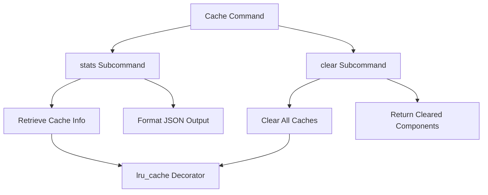
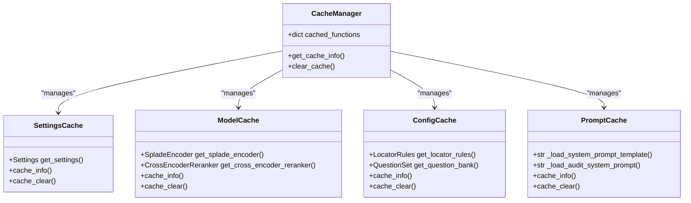
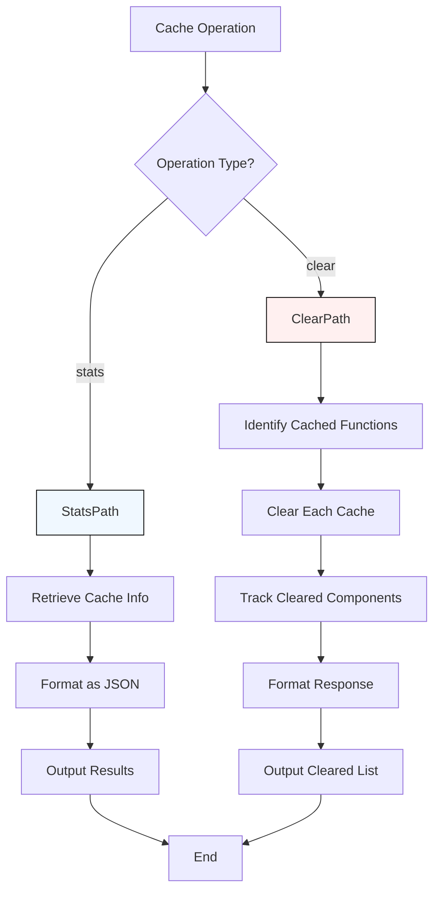
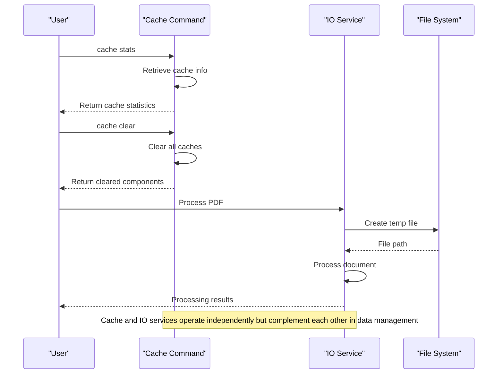

# Cache Command

<cite>
**Referenced Files in This Document**   
- [cache.py](file://src/cli/commands/cache.py)
- [config.py](file://src/core/config.py)
- [io.py](file://src/services/io.py)
- [common.py](file://src/pipelines/graphs/nodes/domains/common.py)
- [domain_audit.py](file://src/pipelines/graphs/nodes/domain_audit.py)
- [splade.py](file://src/retrieval/engines/splade.py)
- [cross_encoder.py](file://src/retrieval/rerankers/cross_encoder.py)
- [locator_rules.py](file://src/rob2/locator_rules.py)
- [question_bank.py](file://src/rob2/question_bank.py)
</cite>

## Table of Contents
1. [Introduction](#introduction)
2. [Cache Command Overview](#cache-command-overview)
3. [Cache Structure and Storage Locations](#cache-structure-and-storage-locations)
4. [Cache Operations and Performance Impact](#cache-operations-and-performance-impact)
5. [Integration with IO Services](#integration-with-io-services)
6. [Cache Maintenance and Optimization](#cache-maintenance-and-optimization)
7. [Common Issues and Troubleshooting](#common-issues-and-troubleshooting)
8. [Conclusion](#conclusion)

## Introduction

The cache command provides essential functionality for managing application caching in the eagent system. This documentation details the subcommands for clearing, inspecting, and configuring the cache, along with comprehensive information about the cache structure, storage locations, and performance implications. The cache system plays a critical role in optimizing performance by storing frequently accessed data and computational results, including processed PDFs, retrieval results, and intermediate workflow states.

**Section sources**
- [cache.py](file://src/cli/commands/cache.py#L1-L58)

## Cache Command Overview

The cache command offers two primary subcommands for managing the application's cache: `stats` and `clear`. These commands provide visibility into the current cache state and enable cache maintenance operations.

The `cache stats` command displays the current status of all cached functions, showing hit rates, miss rates, and current cache sizes. This information is crucial for monitoring cache effectiveness and identifying potential performance bottlenecks. The command outputs JSON-formatted statistics for each cached component, allowing for easy integration with monitoring systems.

The `cache clear` command removes all entries from the application's caches, forcing subsequent requests to regenerate cached data. This operation is essential for ensuring data freshness and resolving issues related to stale cache entries. When executed, the command returns a JSON response listing all cache components that were successfully cleared.

The cache system utilizes Python's `functools.lru_cache` decorator to implement caching across various components, including configuration settings, model encoders, and prompt templates. This approach provides a simple yet effective mechanism for caching function results based on their input parameters.

**Diagram sources**
- [cache.py](file://src/cli/commands/cache.py#L27-L35)
- [cache.py](file://src/cli/commands/cache.py#L38-L55)

**Section sources**
- [cache.py](file://src/cli/commands/cache.py#L1-L58)

## Cache Structure and Storage Locations

The cache system in eagent is designed to store various types of data that are expensive to compute or retrieve, including application settings, model configurations, and document processing results. The cache structure is implemented using Python's built-in `lru_cache` decorator, which provides a least-recently-used caching mechanism that automatically manages cache size and eviction.

The primary cache components include:
- **Application settings**: Configuration values loaded from environment variables and .env files
- **Locator rules**: Validation rules loaded from YAML configuration files
- **Question bank**: ROB2 assessment questions loaded from YAML files
- **Model encoders**: Pre-trained machine learning models for text encoding and retrieval
- **Prompt templates**: System prompts used for domain-specific reasoning

These components are cached based on their initialization parameters, ensuring that identical configurations reuse existing instances rather than creating new ones. The cache is stored in memory and does not persist across application restarts, which ensures that configuration changes take effect immediately upon restart.

The cache does not store processed PDFs or intermediate workflow states directly. Instead, it caches the components used to process these items, such as document converters and chunkers. The actual processed document structures are managed separately by the application's workflow state, while the tools used to create them are cached for performance optimization.

**Diagram sources**
- [cache.py](file://src/cli/commands/cache.py#L27-L35)
- [config.py](file://src/core/config.py#L193-L196)
- [locator_rules.py](file://src/rob2/locator_rules.py#L28-L32)
- [question_bank.py](file://src/rob2/question_bank.py#L36-L40)
- [common.py](file://src/pipelines/graphs/nodes/domains/common.py#L86-L87)
- [domain_audit.py](file://src/pipelines/graphs/nodes/domain_audit.py#L78-L87)
- [splade.py](file://src/retrieval/engines/splade.py#L81-L88)
- [cross_encoder.py](file://src/retrieval/rerankers/cross_encoder.py#L88-L95)

**Section sources**
- [cache.py](file://src/cli/commands/cache.py#L27-L35)
- [config.py](file://src/core/config.py#L193-L196)
- [locator_rules.py](file://src/rob2/locator_rules.py#L28-L32)
- [question_bank.py](file://src/rob2/question_bank.py#L36-L40)
- [common.py](file://src/pipelines/graphs/nodes/domains/common.py#L86-L87)
- [domain_audit.py](file://src/pipelines/graphs/nodes/domain_audit.py#L78-L87)
- [splade.py](file://src/retrieval/engines/splade.py#L81-L88)
- [cross_encoder.py](file://src/retrieval/rerankers/cross_encoder.py#L88-L95)

## Cache Operations and Performance Impact

Cache operations in eagent have significant implications for both performance and disk usage. The caching system is designed to optimize application performance by reducing redundant computations and I/O operations, particularly for expensive operations like model loading and configuration parsing.

The `cache stats` command provides detailed performance metrics for each cached component, including hit count, miss count, maxsize, and current cache size. These metrics enable users to assess the effectiveness of the cache and identify components that may benefit from different caching strategies. A high hit rate indicates that the cache is effectively serving requests without requiring recomputation, while a low hit rate may suggest that the cache size is too small or that the access patterns are not conducive to caching.

The `cache clear` command has immediate performance implications, as it forces all subsequent requests for cached data to regenerate the results. This operation can significantly increase response times temporarily, as the application must reload configurations, reinitialize models, and reprocess data that was previously cached. However, this trade-off is necessary when configuration changes have been made or when stale data is suspected.

Cache operations impact disk usage indirectly through their effect on memory usage and file I/O patterns. While the cache itself resides in memory, clearing the cache can increase disk I/O as the application reads configuration files and model weights from storage. Conversely, an effective cache reduces disk I/O by keeping frequently accessed data in memory.

**Diagram sources**
- [cache.py](file://src/cli/commands/cache.py#L38-L55)

**Section sources**
- [cache.py](file://src/cli/commands/cache.py#L38-L55)

## Integration with IO Services

The cache system integrates with IO services through the application's configuration and data loading mechanisms. While the cache command itself does not directly interact with the IO service module, the cached components rely on IO operations for their initial data loading.

The `temp_pdf` function in the IO service module creates temporary files for PDF processing, which complements the caching strategy by providing temporary storage for input documents. This function works in conjunction with the caching system by ensuring that PDF files are properly managed during processing, while the caching system optimizes the processing components themselves.

Configuration data loaded from files (such as the locator rules and question bank) is cached after the initial IO operation, reducing the need for repeated file reads. This integration creates a two-tier optimization strategy: the IO service handles temporary file management for input data, while the cache system optimizes access to configuration and model data.

Cache invalidation is handled implicitly through application lifecycle events rather than explicit IO triggers. When the application restarts, all caches are cleared automatically, ensuring that any changes to configuration files are picked up. This approach simplifies cache management while ensuring data consistency.

**Diagram sources**
- [cache.py](file://src/cli/commands/cache.py#L38-L55)
- [io.py](file://src/services/io.py#L11-L27)

**Section sources**
- [cache.py](file://src/cli/commands/cache.py#L38-L55)
- [io.py](file://src/services/io.py#L11-L27)

## Cache Maintenance and Optimization

Effective cache maintenance and optimization are critical for ensuring optimal application performance and resource utilization. The cache command provides the primary tools for cache maintenance, enabling users to monitor cache effectiveness and perform cleanup operations when necessary.

Regular cache monitoring using the `cache stats` command helps identify potential optimization opportunities. Components with low hit rates may indicate that the cache size is insufficient for the access patterns, or that the caching strategy needs adjustment. Monitoring cache statistics over time can reveal usage patterns and help determine the optimal cache size for different components.

Cache optimization strategies include:
- Regular monitoring of cache hit rates and miss rates
- Periodic cache clearing to ensure data freshness
- Adjusting application configuration to align with caching behavior
- Restarting the application to clear all caches and reload configurations

The cache system automatically manages memory usage through the LRU (Least Recently Used) eviction policy, which removes the least recently accessed items when the cache reaches its maximum size. This automatic management reduces the need for manual intervention while ensuring that the most frequently accessed data remains in the cache.

For optimal performance, it is recommended to monitor cache statistics regularly and clear the cache when configuration changes are made or when stale data is suspected. The cache clearing operation should be performed during maintenance windows or periods of low activity to minimize the impact on application performance.

**Section sources**
- [cache.py](file://src/cli/commands/cache.py#L38-L55)

## Common Issues and Troubleshooting

Common issues related to the cache system typically fall into three categories: cache corruption, excessive disk usage, and stale cache entries. Understanding these issues and their solutions is essential for maintaining application reliability and performance.

Cache corruption is rare in this implementation since the cache resides in memory and does not persist across application restarts. However, if a cached component becomes inconsistent with the underlying data, restarting the application will resolve the issue by clearing all caches and reloading data from source files.

Excessive disk usage is not typically a direct result of the caching system, as the cache itself uses memory rather than disk storage. However, clearing the cache can temporarily increase disk I/O as the application reads configuration files and model weights. If excessive disk usage is observed, it is more likely related to temporary file management or log files rather than the cache system.

Stale cache entries occur when configuration files are modified but the application continues to use cached values. Since the cache does not automatically detect file changes, the solution is to restart the application or use the `cache clear` command followed by operations that require the updated data. This ensures that the latest configuration is loaded from disk.

Troubleshooting steps for cache-related issues include:
1. Check cache statistics using `cache stats` to understand current cache usage
2. Clear the cache using `cache clear` if stale data is suspected
3. Restart the application to ensure all caches are cleared and configurations reloaded
4. Verify that configuration files are accessible and properly formatted

**Section sources**
- [cache.py](file://src/cli/commands/cache.py#L38-L55)

## Conclusion

The cache command provides essential functionality for managing application caching in the eagent system. By offering commands to inspect and clear the cache, it enables users to optimize performance, ensure data freshness, and troubleshoot issues related to cached data. The caching system plays a vital role in enhancing application efficiency by reducing redundant computations and I/O operations for frequently accessed components.

Understanding the cache structure, operations, and integration with other system components is crucial for effective system administration and performance optimization. Regular monitoring of cache statistics and appropriate maintenance practices help ensure that the application operates at peak efficiency while maintaining data consistency.

The cache system's design balances performance optimization with simplicity, using Python's built-in caching mechanisms to provide effective performance improvements without complex configuration requirements. As the application evolves, continued attention to cache management practices will ensure that the system maintains optimal performance and reliability.