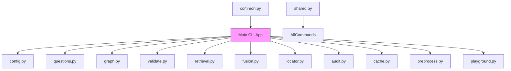

# Command Reference

<cite>
**Referenced Files in This Document**   
- [app.py](file://src/cli/app.py)
- [config.py](file://src/cli/commands/config.py)
- [questions.py](file://src/cli/commands/questions.py)
- [graph.py](file://src/cli/commands/graph.py)
- [validate.py](file://src/cli/commands/validate.py)
- [retrieval.py](file://src/cli/commands/retrieval.py)
- [fusion.py](file://src/cli/commands/fusion.py)
- [locator.py](file://src/cli/commands/locator.py)
- [audit.py](file://src/cli/commands/audit.py)
- [cache.py](file://src/cli/commands/cache.py)
- [playground.py](file://src/cli/commands/playground.py)
- [preprocess.py](file://src/cli/commands/preprocess.py)
- [common.py](file://src/cli/common.py)
- [shared.py](file://src/cli/commands/shared.py)
</cite>

## Table of Contents
1. [Introduction](#introduction)
2. [CLI Architecture](#cli-architecture)
3. [Command Syntax and Usage](#command-syntax-and-usage)
4. [Core Commands](#core-commands)
5. [Input/Output Formats](#inputoutput-formats)
6. [Error Handling and Exit Codes](#error-handling-and-exit-codes)
7. [Advanced Workflows](#advanced-workflows)
8. [Performance Considerations](#performance-considerations)
9. [Best Practices](#best-practices)

## Introduction

The eAgent CLI provides a comprehensive interface for running ROB2 evaluation workflows, including document processing, evidence retrieval, validation, and audit processes. Built on the Typer framework, the CLI offers a modular command structure with subcommands for specific functionality. This documentation covers all available commands, their parameters, options, and usage patterns.

The CLI is designed for both interactive use and integration into automated workflows, supporting JSON input/output for programmatic access. The commands enable users to debug individual components of the evaluation pipeline, inspect configuration, and analyze results at various stages of processing.

**Section sources**
- [app.py](file://src/cli/app.py#L1-L146)

## CLI Architecture

The CLI architecture is based on a hierarchical command structure implemented using Typer. The main application in `app.py` serves as the entry point and registers subcommands from individual modules. Each command module follows a consistent pattern, defining its own Typer application instance that is then added to the main application.

The architecture separates concerns into distinct command groups:
- Configuration management (`config`)
- Question bank operations (`questions`)
- Graph inspection and execution (`graph`)
- Validation debugging (`validate`)
- Retrieval debugging (`retrieval`)
- Evidence fusion (`fusion`)
- Evidence location (`locator`)
- Domain audit (`audit`)
- Cache management (`cache`)
- Preprocessing debug (`preprocess`)
- Interactive tools (`playground`)

The shared functionality between commands is abstracted into the `common.py` and `shared.py` modules, which provide utilities for JSON handling, option parsing, and data loading. This modular design enables independent development and testing of command components while maintaining a consistent user interface.



**Diagram sources**
- [app.py](file://src/cli/app.py#L30-L50)
- [common.py](file://src/cli/common.py#L1-L93)
- [shared.py](file://src/cli/commands/shared.py#L1-L76)

**Section sources**
- [app.py](file://src/cli/app.py#L1-L146)
- [common.py](file://src/cli/common.py#L1-L93)
- [shared.py](file://src/cli/commands/shared.py#L1-L76)

## Command Syntax and Usage

The CLI follows standard Unix command-line conventions with global options, subcommands, and command-specific options. The general syntax is:

```
eagent [GLOBAL OPTIONS] COMMAND [COMMAND OPTIONS] [ARGUMENTS]
```

All commands support `--help` to display usage information. The CLI uses Typer's automatic help generation, providing consistent documentation across all commands. Most commands support JSON output via the `--json` flag, which formats output as pretty-printed JSON for programmatic consumption.

The CLI processes options in the following order of precedence:
1. Command-line `--set` parameters
2. Options file specified by `--options-file`
3. Inline JSON options via `--options`
4. Environment variables and default configuration

This hierarchy allows users to override settings at different levels, from permanent configuration files to temporary command-line overrides.

**Section sources**
- [app.py](file://src/cli/app.py#L30-L39)
- [common.py](file://src/cli/common.py#L15-L91)

## Core Commands

### run Command

The `run` command executes the complete ROB2 evaluation workflow on a PDF document. It processes the document, retrieves evidence, performs validation, and generates assessment results.

**Syntax**
```
eagent run PDF_PATH [OPTIONS]
```

**Parameters**
- `PDF_PATH`: Path to the input PDF document (required)

**Options**
- `--options`: JSON string containing run options
- `--options-file`: Path to JSON/YAML file with run options
- `--set`: Set individual options using key=value syntax (can be repeated)
- `--debug`: Debug level (none|min|full)
- `--include-reports/--no-include-reports`: Include validation reports in output
- `--include-audit-reports/--no-include-audit-reports`: Include audit reports in output
- `--json`: Output JSON results
- `--table/--no-table`: Output ROB2 Markdown table

**Return Values**
- Exit code 0 on success
- Exit code 1 on error
- JSON output with complete evaluation results when `--json` is specified
- Markdown table with assessment summary when `--table` is enabled

**Examples**
```bash
# Run evaluation with default settings
eagent run document.pdf

# Run with custom options from JSON string
eagent run document.pdf --options '{"relevance_mode": "llm", "debug_level": "min"}'

# Run with options from file and override specific setting
eagent run document.pdf --options-file config.json --set "top_k=10" --json
```

**Section sources**
- [app.py](file://src/cli/app.py#L71-L145)

### config Command

The `config` command provides utilities for inspecting and managing configuration settings.

**Subcommands**
- `show`: Display current effective configuration
- `export`: Export configuration as JSON
- `diff`: Show differences from default values
- `options`: List available run options
- `example`: Generate example configuration YAML

**Common Options**
- `--json/--no-json`: Output format for show and diff commands

**Examples**
```bash
# Show current configuration
eagent config show

# Export configuration to file
eagent config export --output config.json

# Generate example configuration
eagent config example --output rob2.options.yaml --force

# List available run options in JSON format
eagent config options --json

# Show configuration schema
eagent config options --schema
```

**Section sources**
- [config.py](file://src/cli/commands/config.py#L1-L355)

### cache Command

The `cache` command manages internal caches used by the application.

**Subcommands**
- `stats`: Display cache status and statistics
- `clear`: Clear all caches

**Examples**
```bash
# View cache statistics
eagent cache stats

# Clear all caches
eagent cache clear
```

**Section sources**
- [cache.py](file://src/cli/commands/cache.py#L1-L59)

### fusion Command

The `fusion` command runs the evidence fusion process, combining results from multiple retrieval methods.

**Syntax**
```
eagent fusion run PDF_PATH [OPTIONS]
```

**Parameters**
- `PDF_PATH`: Path to the input PDF document (required)

**Options**
- `--question-id`: Filter output to specific question ID
- `--top-k`: Number of top candidates to output
- `--per-query-top-n`: Number of candidates to retain per query
- `--rrf-k`: RRF fusion constant
- `--planner`: Query planning strategy
- `--reranker`: Re-ranking strategy
- `--structure/--no-structure`: Enable/disable structure-aware filtering
- `--full`: Output all candidates without limiting
- `--json`: Output JSON format

**Examples**
```bash
# Run fusion and show top 5 candidates for all questions
eagent fusion run document.pdf

# Run fusion for specific question
eagent fusion run document.pdf --question-id q1_1 --top-k 3

# Run fusion with custom parameters
eagent fusion run document.pdf --planner llm --reranker cross_encoder --json
```

**Section sources**
- [fusion.py](file://src/cli/commands/fusion.py#L1-L124)

### graph Command

The `graph` command provides tools for inspecting and executing the LangGraph workflow.

**Subcommands**
- `show`: Display graph structure
- `run`: Execute the graph workflow

**show Options**
- `--format`: Output format (mermaid|ascii|nodes)
- `--output`: File path to write output

**run Options**
- `PDF_PATH`: Input PDF document path
- Standard run options (same as main run command)

**Examples**
```bash
# Show graph structure in Mermaid format
eagent graph show

# Export graph structure to file
eagent graph show --format mermaid --output graph.mmd

# Run the graph workflow
eagent graph run document.pdf --json
```

**Section sources**
- [graph.py](file://src/cli/commands/graph.py#L1-L120)

### locator Command

The `locator` command runs rule-based evidence location.

**Syntax**
```
eagent locator rule PDF_PATH [OPTIONS]
```

**Parameters**
- `PDF_PATH`: Path to the input PDF document (required)

**Options**
- `--question-id`: Filter output to specific question ID
- `--top-k`: Number of top candidates to output
- `--rules-path`: Path to locator rules file
- `--full`: Output all candidates
- `--json`: Output JSON format

**Examples**
```bash
# Run rule-based location
eagent locator rule document.pdf

# Run with specific question filter
eagent locator rule document.pdf --question-id q2_1 --top-k 3

# Use custom rules file
eagent locator rule document.pdf --rules-path custom_rules.yaml --json
```

**Section sources**
- [locator.py](file://src/cli/commands/locator.py#L1-L93)

### questions Command

The `questions` command manages the question bank used in evaluations.

**Subcommands**
- `list`: Display question bank summary
- `export`: Export question bank as JSON

**Options**
- `--path`: Path to question bank YAML file
- `--json`: Output complete question bank in JSON format

**Examples**
```bash
# List question bank summary
eagent questions list

# Export question bank to JSON
eagent questions export --output questions.json

# List with custom question bank
eagent questions list --path custom_questions.yaml --json
```

**Section sources**
- [questions.py](file://src/cli/commands/questions.py#L1-L95)

### validate Command

The `validate` command runs validation processes for evidence quality assessment.

**Subcommands**
- `full`: Run complete validation chain
- `relevance`: Run relevance validation
- `consistency`: Run consistency validation
- `completeness`: Run completeness validation

**Common Options**
- `PDF_PATH`: Input PDF document path
- Various validation-specific options for confidence thresholds, requirements, etc.
- `--json`: Output JSON format

**Examples**
```bash
# Run full validation chain
eagent validate full document.pdf --relevance llm --consistency llm --min-confidence 0.7

# Check relevance for specific question
eagent validate relevance document.pdf --question-id q1_1 --relevance llm

# Check consistency validation results
eagent validate consistency document.pdf --min-confidence 0.6 --json

# Check completeness with strict enforcement
eagent validate completeness document.pdf --enforce --json
```

**Section sources**
- [validate.py](file://src/cli/commands/validate.py#L1-L446)

### retrieval Command

The `retrieval` command runs individual retrieval methods for evidence finding.

**Subcommands**
- `bm25`: Run BM25 retrieval
- `splade`: Run SPLADE retrieval

**Common Options**
- `PDF_PATH`: Input PDF document path
- `--question-id`: Filter to specific question ID
- Retrieval method-specific configuration options
- `--full`: Output all candidates
- `--json`: Output JSON format

**Examples**
```bash
# Run BM25 retrieval
eagent retrieval bm25 document.pdf

# Run SPLADE retrieval with custom model
eagent retrieval splade document.pdf --model-id navneet1995/MiniLM-SPLADE

# Run BM25 for specific question with JSON output
eagent retrieval bm25 document.pdf --question-id q1_1 --json
```

**Section sources**
- [retrieval.py](file://src/cli/commands/retrieval.py#L1-L202)

### audit Command

The `audit` command runs domain audit processes.

**Syntax**
```
eagent audit run PDF_PATH [OPTIONS]
```

**Parameters**
- `PDF_PATH`: Path to the input PDF document (required)

**Options**
- `--mode`: Audit mode (llm|none)
- `--audit-window`: Evidence patching window size
- `--audit-rerun/--no-audit-rerun`: Whether to re-run domains after audit
- `--audit-final/--no-audit-final`: Whether to perform final full audit
- Standard run options

**Examples**
```bash
# Run audit with LLM mode
eagent audit run document.pdf --mode llm

# Run audit with evidence patching
eagent audit run document.pdf --mode llm --audit-window 5 --audit-rerun

# Run audit without final assessment
eagent audit run document.pdf --mode llm --no-audit-final --json
```

**Section sources**
- [audit.py](file://src/cli/commands/audit.py#L1-L82)

### playground Command

The `playground` command provides interactive debugging tools.

**Subcommands**
- `d1`: Launch D1 debugging playground

**Examples**
```bash
# Launch D1 debugging playground
eagent playground d1
```

**Section sources**
- [playground.py](file://src/cli/commands/playground.py#L1-L31)

## Input/Output Formats

### JSON Input Requirements

The CLI accepts configuration options in JSON format through the `--options` parameter or `--options-file`. The JSON structure follows the `Rob2RunOptions` Pydantic model schema.

**Required Structure**
```json
{
  "debug_level": "none",
  "include_reports": false,
  "include_audit_reports": false
}
```

**Configuration Groups**
- Preprocessing (Docling): Layout model, artifacts path, chunker model
- Retrieval and fusion: Top-k, RRF constant, query planning strategy
- Validation: Relevance, consistency, and completeness modes
- Domain reasoning: Model IDs and parameters for D1-D5 domains
- Domain audit: Audit mode, patching window, re-run settings
- Output control: Debug level, report inclusion

The CLI also supports YAML format for options files, providing better readability for complex configurations.

### Output Structures

The CLI produces different output formats based on the command and options:

**Text Output**
- Human-readable summaries
- Tabular data (when applicable)
- Progress and status messages
- Error messages with context

**JSON Output**
When `--json` is specified, commands output structured JSON following consistent patterns:

```json
{
  "command": "result_type",
  "data": {
    "results": [...],
    "metadata": {...},
    "success": true
  }
}
```

The exact structure varies by command but generally includes:
- Command-specific result data
- Metadata about the execution
- Success/failure status
- Timing information (when available)

**Markdown Output**
The `run` command can generate a Markdown table summarizing the ROB2 assessment, which includes domain ratings, risk of bias judgments, and supporting evidence.

**Section sources**
- [app.py](file://src/cli/app.py#L133-L139)
- [common.py](file://src/cli/common.py#L50-L51)
- [config.py](file://src/cli/commands/config.py#L31-L32)

## Error Handling and Exit Codes

The CLI implements comprehensive error handling to provide meaningful feedback to users.

**Exit Codes**
- `0`: Success - Command completed successfully
- `1`: Error - Command failed due to validation, processing, or runtime error
- `2`: Usage Error - Invalid command usage or arguments

**Error Types**
- **Validation Errors**: Invalid input values, missing required arguments, type mismatches
- **File Errors**: Missing files, unreadable files, invalid file formats
- **Configuration Errors**: Invalid JSON/YAML, unsupported options, value constraints
- **Runtime Errors**: Processing failures, model loading issues, memory constraints

**Error Reporting**
Errors are reported with descriptive messages that include:
- Clear description of the problem
- Context about the failing operation
- Suggestions for resolution when possible
- Relevant file paths and line numbers

For JSON output commands, errors are returned in a structured format:
```json
{
  "error": "error_type",
  "message": "descriptive error message",
  "context": "additional context"
}
```

**Section sources**
- [app.py](file://src/cli/app.py#L53-L68)
- [common.py](file://src/cli/common.py#L34-L38)
- [validate.py](file://src/cli/commands/validate.py#L236-L237)

## Advanced Workflows

The CLI supports combining commands for advanced workflows and automation.

**Configuration-Driven Workflows**
Use the config command to create and manage configuration files, then reference them in run commands:

```bash
# Create custom configuration
eagent config example --output my-config.yaml

# Edit configuration file with custom settings
# Then use it in multiple runs
eagent run document1.pdf --options-file my-config.yaml
eagent run document2.pdf --options-file my-config.yaml
```

**Pipeline Debugging**
Use individual component commands to debug specific parts of the pipeline:

```bash
# Check document structure parsing
eagent retrieval bm25 test.pdf --json > retrieval.json

# Analyze fusion results
eagent fusion run test.pdf --json | jq '.fusion_candidates'

# Validate specific question
eagent validate relevance test.pdf --question-id q1_1 --debug full
```

**Automated Processing**
Combine CLI commands with shell scripting for batch processing:

```bash
#!/bin/bash
for pdf in *.pdf; do
  echo "Processing $pdf"
  eagent run "$pdf" --json --include-reports > "${pdf%.pdf}.json"
done
```

**Incremental Analysis**
Use the modular commands to perform incremental analysis:

```bash
# First, check retrieval quality
eagent retrieval bm25 document.pdf --question-id q1_1

# Then, check validation results
eagent validate relevance document.pdf --question-id q1_1

# Finally, run complete evaluation
eagent run document.pdf
```

**Section sources**
- [app.py](file://src/cli/app.py#L80-L130)
- [common.py](file://src/cli/common.py#L15-L31)

## Performance Considerations

The CLI performance depends on several factors, with different commands having varying resource requirements.

**Resource-Intensive Commands**
- `run`: Complete evaluation workflow - highest resource usage
- `validate full`: Full validation chain - high computational cost
- `retrieval splade`: SPLADE retrieval - requires significant memory
- `fusion run`: Evidence fusion - combines multiple retrieval methods

**Optimization Strategies**
- Use `--debug none` for production runs to minimize logging overhead
- Set appropriate `top_k` values to balance quality and performance
- Use `--json` output only when needed for automated processing
- Pre-load models by running a small test first to avoid cold-start delays

**Caching Benefits**
The application uses caching for:
- Configuration settings
- Model loading (SPLADE, cross-encoder)
- Prompt templates
- Rule and question bank loading

Use `eagent cache stats` to monitor cache effectiveness and `eagent cache clear` when configuration changes require cache invalidation.

**Memory Management**
For large documents, consider:
- Using structure-aware retrieval to reduce search space
- Adjusting batch sizes for retrieval methods
- Monitoring memory usage during SPLADE operations

**Section sources**
- [cache.py](file://src/cli/commands/cache.py#L37-L55)
- [retrieval.py](file://src/cli/commands/retrieval.py#L149-L180)
- [fusion.py](file://src/cli/commands/fusion.py#L65-L97)

## Best Practices

Follow these best practices for effective CLI usage:

**Configuration Management**
- Use configuration files for complex settings
- Version control your configuration files
- Use `--set` for temporary overrides rather than modifying config files
- Validate configuration with `eagent config diff` to see effective settings

**Workflow Design**
- Start with `--debug min` or `--debug full` during development
- Use individual component commands for debugging
- Combine successful component tests into full workflow runs
- Use JSON output for automated result processing

**Error Prevention**
- Always validate PDF paths before running commands
- Check available memory before running resource-intensive commands
- Use `--help` to verify command syntax before execution
- Test with small documents first when trying new configurations

**Performance Optimization**
- Warm up the system with a small test run before batch processing
- Use appropriate top-k values for your use case
- Consider the trade-off between retrieval quality and processing time
- Monitor cache effectiveness with `eagent cache stats`

**Security Considerations**
- Avoid storing sensitive API keys in configuration files
- Use environment variables for credentials when possible
- Review configuration files before sharing them
- Keep the application and dependencies updated

**Section sources**
- [config.py](file://src/cli/commands/config.py#L26-L36)
- [common.py](file://src/cli/common.py#L15-L31)
- [app.py](file://src/cli/app.py#L80-L130)
