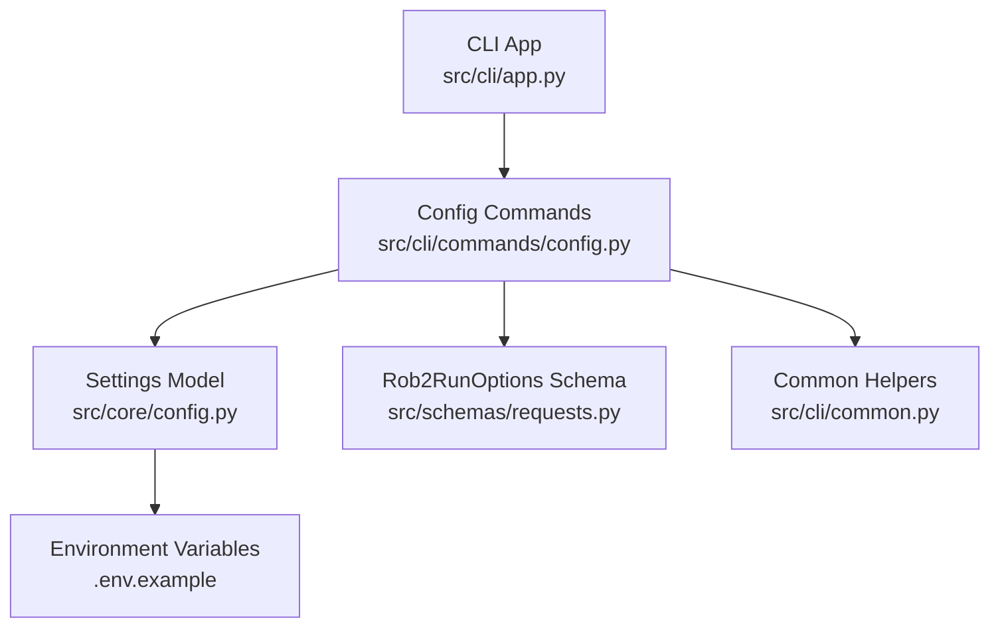
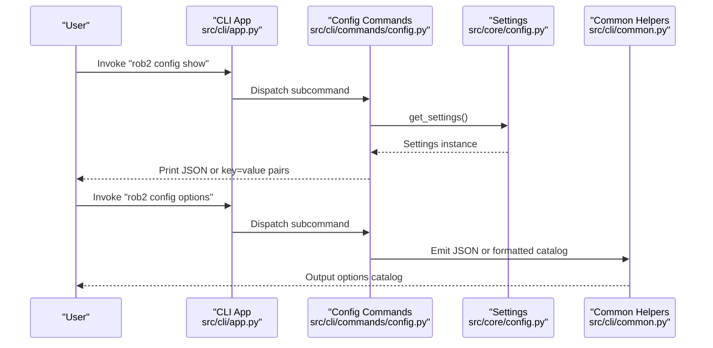
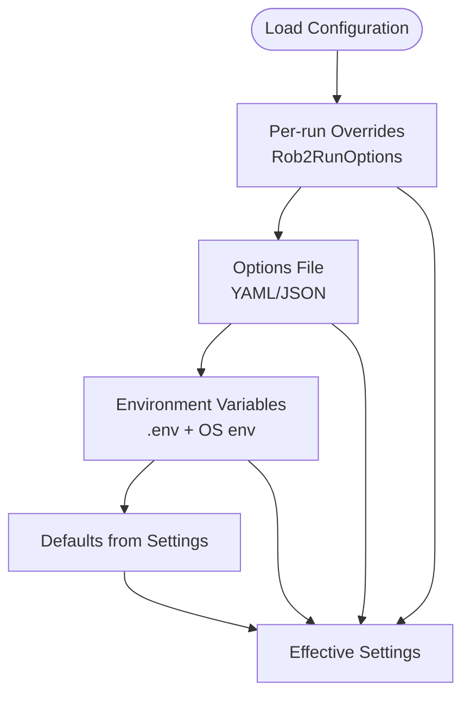
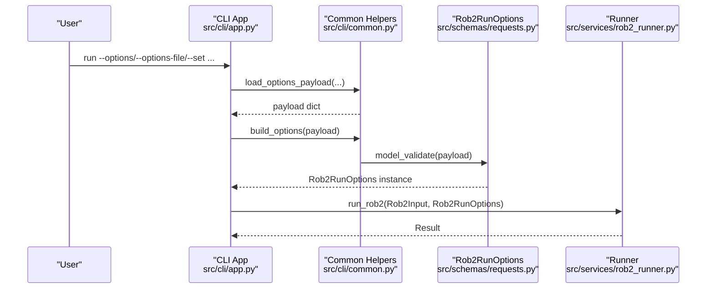
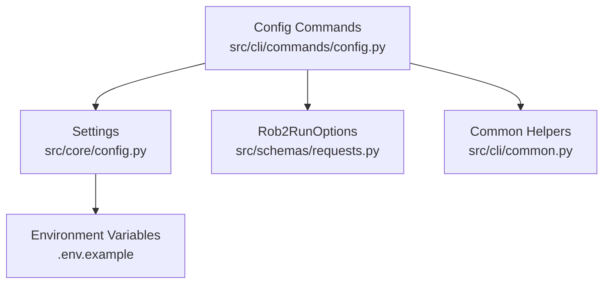

# Config Command

<cite>
**Referenced Files in This Document**
- [config.py](file://src/cli/commands/config.py)
- [core_config.py](file://src/core/config.py)
- [app.py](file://src/cli/app.py)
- [common.py](file://src/cli/common.py)
- [.env.example](file://.env.example)
- [requests.py](file://src/schemas/requests.py)
- [rob2_runner.py](file://src/services/rob2_runner.py)
</cite>

## Table of Contents
1. [Introduction](#introduction)
2. [Project Structure](#project-structure)
3. [Core Components](#core-components)
4. [Architecture Overview](#architecture-overview)
5. [Detailed Component Analysis](#detailed-component-analysis)
6. [Dependency Analysis](#dependency-analysis)
7. [Performance Considerations](#performance-considerations)
8. [Troubleshooting Guide](#troubleshooting-guide)
9. [Conclusion](#conclusion)
10. [Appendices](#appendices)

## Introduction
This document explains the “config” command group that manages application configuration. It covers:
- Subcommands for viewing, exporting, diffing, and cataloging configuration options
- How configuration values are loaded from .env files, environment variables, and runtime overrides
- How configuration values map to Pydantic settings models in core/config.py
- How CLI options relate to the Rob2RunOptions model
- Practical examples for inspecting settings, adjusting retrieval thresholds, relaxing validation requirements, and configuring LLM providers
- Best practices and common pitfalls around precedence, invalid types, and missing required settings

## Project Structure
The config command group is implemented as a Typer subcommand under the main CLI app. It reads from centralized settings and exposes introspection and catalog utilities.

**Diagram sources**
- [app.py](file://src/cli/app.py#L1-L70)
- [config.py](file://src/cli/commands/config.py#L1-L120)
- [core_config.py](file://src/core/config.py#L1-L60)
- [.env.example](file://.env.example#L1-L112)
- [requests.py](file://src/schemas/requests.py#L1-L60)
- [common.py](file://src/cli/common.py#L1-L40)

**Section sources**
- [app.py](file://src/cli/app.py#L1-L70)
- [config.py](file://src/cli/commands/config.py#L1-L120)
- [core_config.py](file://src/core/config.py#L1-L60)
- [.env.example](file://.env.example#L1-L112)
- [requests.py](file://src/schemas/requests.py#L1-L60)
- [common.py](file://src/cli/common.py#L1-L40)

## Core Components
- Config command group: Provides subcommands to show, export, diff, list options, and render example YAML.
- Settings model: Centralized configuration backed by pydantic-settings with environment variable aliases and .env loading.
- Rob2RunOptions: Per-run overrides validated by Pydantic, used to override settings during runtime.
- Common helpers: Parse JSON/YAML, validate overrides, and emit JSON.

Key responsibilities:
- Inspect current effective configuration
- Export configuration to JSON
- Compare current vs. default values
- List available runtime options and their categories
- Render an example YAML with recommended defaults and comments

**Section sources**
- [config.py](file://src/cli/commands/config.py#L1-L120)
- [core_config.py](file://src/core/config.py#L1-L60)
- [requests.py](file://src/schemas/requests.py#L1-L60)
- [common.py](file://src/cli/common.py#L1-L40)

## Architecture Overview
The config command group integrates with the main CLI app and delegates to shared helpers. It reads from Settings and emits either JSON or formatted text. Runtime overrides are handled separately by the run command and Rob2RunOptions.

**Diagram sources**
- [app.py](file://src/cli/app.py#L1-L70)
- [config.py](file://src/cli/commands/config.py#L1-L120)
- [core_config.py](file://src/core/config.py#L1-L60)
- [common.py](file://src/cli/common.py#L1-L40)

## Detailed Component Analysis

### Subcommands Overview
- show: Prints current effective configuration as JSON or key=value pairs.
- export: Writes current effective configuration to a JSON file or stdout.
- diff: Compares current configuration with default values and prints differences.
- options: Lists available runtime keys grouped by functional areas; can also emit a Pydantic JSON schema.
- example: Renders an example YAML with recommended defaults and comments.

These commands rely on:
- Settings model for current values
- Options catalog maintained in the config module
- Shared helpers for emitting JSON and parsing values

**Section sources**
- [config.py](file://src/cli/commands/config.py#L25-L120)
- [config.py](file://src/cli/commands/config.py#L118-L355)

### Configuration Hierarchy and Loading
Configuration resolution order:
1. CLI/API overrides (per-run options)
2. Configuration file (YAML/JSON) overrides
3. Environment variables and .env file
4. Defaults from Settings model

How it maps to code:
- Settings model loads from .env and environment variables using validation aliases.
- Runtime overrides are applied via Rob2RunOptions during run; these take precedence over Settings.
- The config commands read Settings directly to show effective values.

**Diagram sources**
- [core_config.py](file://src/core/config.py#L186-L190)
- [requests.py](file://src/schemas/requests.py#L1-L60)
- [common.py](file://src/cli/common.py#L1-L40)

**Section sources**
- [core_config.py](file://src/core/config.py#L186-L190)
- [requests.py](file://src/schemas/requests.py#L1-L60)
- [common.py](file://src/cli/common.py#L1-L40)

### Settings Model and Environment Mapping
The Settings model defines typed fields with explicit validation aliases. These aliases correspond to environment variable names used in .env files. The model loads from .env and OS environment variables.

Examples of mapped fields:
- Query planner: model, provider, temperature, timeout, max_tokens, max_retries
- Reranker: model_id, device, max_length, batch_size, top_n
- SPLADE: model_id, device, hf_token, query_max_length, doc_max_length, batch_size
- Evidence validators: relevance and consistency modes, models, providers, temperatures, timeouts, max_tokens, retries, confidence thresholds, and selection parameters
- Domain reasoning: D1–D5 models and parameters
- Domain audit: mode, model, provider, temperature, timeout, max_tokens, retries, patch window, max patches per question, rerun domains, final audit
- Docling: layout_model, artifacts_path, chunker_model, chunker_max_tokens
- Output controls: debug_level, include_reports, include_audit_reports

The model also configures .env loading and ignores extra fields.

**Section sources**
- [core_config.py](file://src/core/config.py#L1-L190)

### Relationship Between CLI Options and Rob2RunOptions
Runtime overrides are constructed from:
- JSON string (--options)
- YAML/JSON file (--options-file)
- Key-value pairs (--set key=value)

These are merged and validated against Rob2RunOptions. The run command then merges these overrides with Settings when executing the pipeline.

**Diagram sources**
- [app.py](file://src/cli/app.py#L71-L131)
- [common.py](file://src/cli/common.py#L1-L93)
- [requests.py](file://src/schemas/requests.py#L1-L167)
- [rob2_runner.py](file://src/services/rob2_runner.py#L216-L241)

**Section sources**
- [app.py](file://src/cli/app.py#L71-L131)
- [common.py](file://src/cli/common.py#L1-L93)
- [requests.py](file://src/schemas/requests.py#L1-L167)
- [rob2_runner.py](file://src/services/rob2_runner.py#L216-L241)

### Practical Examples

- Inspect current settings
  - Use the show subcommand to display the effective configuration as JSON or key=value pairs.
  - Use diff to compare current values with defaults and identify non-default settings.

- Adjust retrieval thresholds
  - Modify top_k, per_query_top_n, rrf_k, rerank_top_n, and fusion_* parameters to tune recall and ranking.
  - Use the options subcommand to discover available keys and their descriptions.

- Relax validation requirements
  - Lower relevance_min_confidence and consistency_min_confidence.
  - Disable strict quote requirements where appropriate.
  - Consider enabling validation_relax_on_retry to ease thresholds during retries.

- Configure LLM providers
  - Set model IDs and providers for query planner, relevance validator, consistency validator, and domain reasoning models.
  - Configure provider-specific parameters like temperature, timeout, max_tokens, and max_retries.
  - Use .env variables or OS environment variables to supply credentials and provider endpoints.

- Generate example configuration
  - Use the example subcommand to render a YAML template with recommended defaults and comments.

Notes:
- The example YAML includes a precedence comment indicating that CLI/API overrides take precedence over configuration files, which in turn take precedence over environment variables.
- The options subcommand catalogs keys by functional groups (preprocessing, retrieval/fusion, validation, domain reasoning, domain audit, output controls).

**Section sources**
- [config.py](file://src/cli/commands/config.py#L25-L120)
- [config.py](file://src/cli/commands/config.py#L118-L355)
- [.env.example](file://.env.example#L1-L112)
- [requests.py](file://src/schemas/requests.py#L1-L167)

## Dependency Analysis
The config command group depends on:
- Settings for current effective values
- Rob2RunOptions for option catalog and schema
- Common helpers for JSON emission and parsing

**Diagram sources**
- [config.py](file://src/cli/commands/config.py#L1-L120)
- [core_config.py](file://src/core/config.py#L1-L60)
- [requests.py](file://src/schemas/requests.py#L1-L60)
- [common.py](file://src/cli/common.py#L1-L40)
- [.env.example](file://.env.example#L1-L112)

**Section sources**
- [config.py](file://src/cli/commands/config.py#L1-L120)
- [core_config.py](file://src/core/config.py#L1-L60)
- [requests.py](file://src/schemas/requests.py#L1-L60)
- [common.py](file://src/cli/common.py#L1-L40)
- [.env.example](file://.env.example#L1-L112)

## Performance Considerations
- Settings are cached via an LRU cache to avoid repeated .env and environment parsing.
- The diff operation computes a small dictionary of differences and emits JSON, which is efficient for typical configuration sizes.
- Option catalog rendering is lightweight and suitable for frequent use.

[No sources needed since this section provides general guidance]

## Troubleshooting Guide
Common issues and resolutions:
- Invalid value types
  - Rob2RunOptions enforces strict types and constraints (e.g., integers with minimum bounds, floats in valid ranges). If validation fails, the CLI reports a BadParameter with details.
  - Fix: Correct types and ranges in JSON/YAML or --set values.

- Missing required settings
  - Some fields are optional in Settings but required in downstream components. If a required value is missing, downstream logic may fail.
  - Fix: Provide values via .env, OS environment variables, or per-run overrides.

- Configuration precedence confusion
  - CLI/API overrides take precedence over configuration files, which take precedence over environment variables.
  - Verify effective values using the show and diff subcommands.

- YAML/JSON parsing errors
  - Ensure options files are valid JSON/YAML objects. The loader raises descriptive errors for missing files or unsupported formats.
  - Fix: Validate file contents and ensure correct extension.

- Example YAML generation conflicts
  - The example YAML includes comments and recommended defaults. Use --force to overwrite existing files when regenerating.

**Section sources**
- [common.py](file://src/cli/common.py#L1-L93)
- [config.py](file://src/cli/commands/config.py#L25-L120)
- [config.py](file://src/cli/commands/config.py#L89-L120)

## Conclusion
The config command group provides a robust toolkit for inspecting, exporting, and cataloging configuration. It bridges centralized Settings with per-run Rob2RunOptions, enabling flexible configuration management across environments. By understanding the precedence hierarchy and using the provided subcommands, users can confidently tune retrieval thresholds, relax validation requirements, and configure LLM providers while maintaining reproducibility and clarity.

[No sources needed since this section summarizes without analyzing specific files]

## Appendices

### Appendix A: Configuration Keys by Category
Use the options subcommand to list keys and descriptions. Categories include:
- Preprocessing (Docling): layout_model, artifacts_path, chunker_model, chunker_max_tokens
- Retrieval + Fusion: top_k, per_query_top_n, rrf_k, query_planner, query_planner_model, query_planner_model_provider, query_planner_temperature, query_planner_timeout, query_planner_max_tokens, query_planner_max_retries, query_planner_max_keywords, reranker, reranker_model_id, reranker_device, reranker_max_length, reranker_batch_size, rerank_top_n, use_structure, section_bonus_weight, splade_model_id, splade_device, splade_hf_token, splade_query_max_length, splade_doc_max_length, splade_batch_size, fusion_top_k, fusion_rrf_k, fusion_engine_weights
- Evidence Validation: relevance_mode, relevance_model, relevance_model_provider, relevance_temperature, relevance_timeout, relevance_max_tokens, relevance_max_retries, relevance_min_confidence, relevance_require_quote, relevance_fill_to_top_k, relevance_top_k, relevance_top_n, existence_require_text_match, existence_require_quote_in_source, existence_top_k, consistency_mode, consistency_model, consistency_model_provider, consistency_temperature, consistency_timeout, consistency_max_tokens, consistency_max_retries, consistency_min_confidence, consistency_require_quotes_for_fail, consistency_top_n, completeness_enforce, completeness_required_questions, completeness_min_passed_per_question, completeness_require_relevance, validated_top_k, validation_max_retries, validation_fail_on_consistency, validation_relax_on_retry
- Domain Reasoning (D1–D5): d2_effect_type, domain_evidence_top_k, d1_model, d1_model_provider, d1_temperature, d1_timeout, d1_max_tokens, d1_max_retries, d2_model, d2_model_provider, d2_temperature, d2_timeout, d2_max_tokens, d2_max_retries, d3_model, d3_model_provider, d3_temperature, d3_timeout, d3_max_tokens, d3_max_retries, d4_model, d4_model_provider, d4_temperature, d4_timeout, d4_max_tokens, d4_max_retries, d5_model, d5_model_provider, d5_temperature, d5_timeout, d5_max_tokens, d5_max_retries
- Domain Audit: domain_audit_mode, domain_audit_model, domain_audit_model_provider, domain_audit_temperature, domain_audit_timeout, domain_audit_max_tokens, domain_audit_max_retries, domain_audit_patch_window, domain_audit_max_patches_per_question, domain_audit_rerun_domains, domain_audit_final
- Output Controls: debug_level, include_reports, include_audit_reports

**Section sources**
- [config.py](file://src/cli/commands/config.py#L118-L355)

### Appendix B: Environment-Specific Setup
- Use .env to store provider credentials and default model IDs.
- Override values via OS environment variables for deployment-specific settings.
- Supply per-run overrides via JSON/YAML or --set to quickly experiment without changing persistent configuration.

**Section sources**
- [.env.example](file://.env.example#L1-L112)
- [core_config.py](file://src/core/config.py#L186-L190)