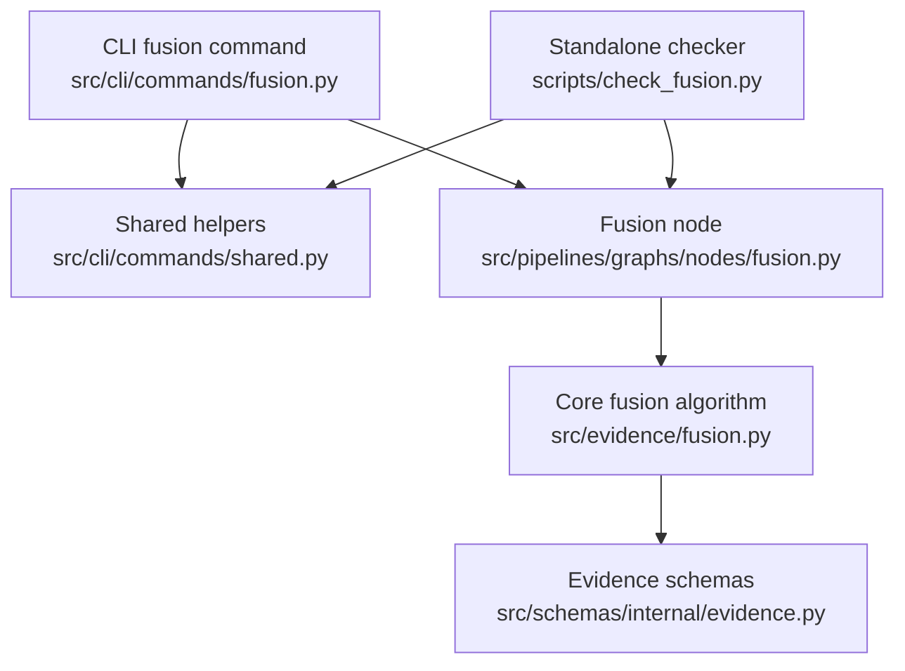
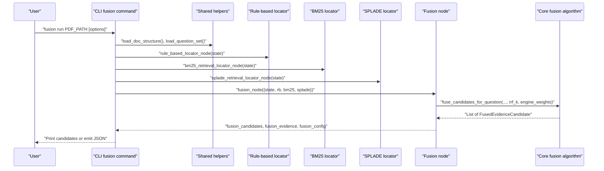
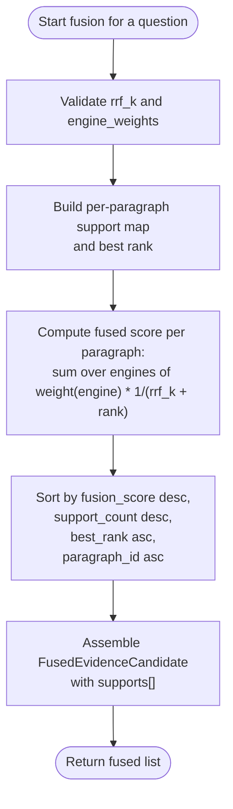
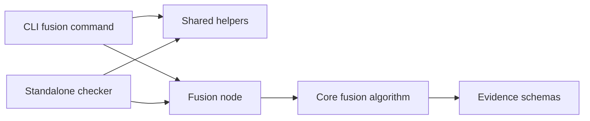

# Fusion Command

<cite>
**Referenced Files in This Document**
- [src/cli/commands/fusion.py](file://src/cli/commands/fusion.py)
- [src/pipelines/graphs/nodes/fusion.py](file://src/pipelines/graphs/nodes/fusion.py)
- [src/evidence/fusion.py](file://src/evidence/fusion.py)
- [src/schemas/internal/evidence.py](file://src/schemas/internal/evidence.py)
- [scripts/check_fusion.py](file://scripts/check_fusion.py)
- [src/cli/commands/shared.py](file://src/cli/commands/shared.py)
- [docs/adr/0002-evidence-fusion-rrf.md](file://docs/adr/0002-evidence-fusion-rrf.md)
- [src/retrieval/engines/fusion.py](file://src/retrieval/engines/fusion.py)
- [tests/unit/test_evidence_fusion.py](file://tests/unit/test_evidence_fusion.py)
</cite>

## Table of Contents
1. [Introduction](#introduction)
2. [Project Structure](#project-structure)
3. [Core Components](#core-components)
4. [Architecture Overview](#architecture-overview)
5. [Detailed Component Analysis](#detailed-component-analysis)
6. [Dependency Analysis](#dependency-analysis)
7. [Performance Considerations](#performance-considerations)
8. [Troubleshooting Guide](#troubleshooting-guide)
9. [Conclusion](#conclusion)
10. [Appendices](#appendices)

## Introduction
This document describes the “fusion” command that tests and demonstrates evidence fusion strategies across multiple retrieval engines. It explains how to combine results from different retrieval strategies using Rank Fusion (Reciprocal Rank Fusion, RRF) and optional engine weights, and how the fused results are produced and consumed downstream. It also documents the input requirements, output format, configuration parameters, and practical guidance for tuning and evaluating fusion quality.

## Project Structure
The fusion command integrates several modules:
- CLI command entrypoint and argument parsing
- Fusion node that orchestrates per-question fusion
- Core fusion algorithm using RRF
- Data schemas for evidence and fused results
- Standalone script for quick checks
- Shared CLI utilities

**Diagram sources**
- [src/cli/commands/fusion.py](file://src/cli/commands/fusion.py#L1-L124)
- [src/pipelines/graphs/nodes/fusion.py](file://src/pipelines/graphs/nodes/fusion.py#L1-L113)
- [src/evidence/fusion.py](file://src/evidence/fusion.py#L1-L112)
- [src/schemas/internal/evidence.py](file://src/schemas/internal/evidence.py#L1-L171)
- [scripts/check_fusion.py](file://scripts/check_fusion.py#L1-L296)
- [src/cli/commands/shared.py](file://src/cli/commands/shared.py#L1-L76)

**Section sources**
- [src/cli/commands/fusion.py](file://src/cli/commands/fusion.py#L1-L124)
- [src/pipelines/graphs/nodes/fusion.py](file://src/pipelines/graphs/nodes/fusion.py#L1-L113)
- [src/evidence/fusion.py](file://src/evidence/fusion.py#L1-L112)
- [src/schemas/internal/evidence.py](file://src/schemas/internal/evidence.py#L1-L171)
- [scripts/check_fusion.py](file://scripts/check_fusion.py#L1-L296)
- [src/cli/commands/shared.py](file://src/cli/commands/shared.py#L1-L76)

## Core Components
- CLI fusion command: parses arguments, prepares state, invokes fusion node, and prints or emits JSON results.
- Fusion node: aggregates candidates from multiple engines per question, applies RRF and optional weights, and produces fused bundles.
- Core fusion algorithm: computes fused scores per paragraph using RRF and sorts by score, support count, and best rank.
- Schemas: define EvidenceCandidate, EvidenceSupport, FusedEvidenceCandidate, and FusedEvidenceBundle.
- Standalone checker: provides a convenient way to run fusion on a PDF with configurable parameters.

Key configuration parameters:
- rrf_k: RRF constant controlling the influence of rank position.
- engine_weights: optional mapping of engine name to weight for boosting or downweighting engines.
- fusion_top_k: number of top fused candidates per question.
- fusion_rrf_k: RRF constant used during fusion (separate from engine-level RRF constants).
- fusion_engine_weights: mapping of engine to weight for fusion scoring.

**Section sources**
- [src/cli/commands/fusion.py](file://src/cli/commands/fusion.py#L27-L124)
- [src/pipelines/graphs/nodes/fusion.py](file://src/pipelines/graphs/nodes/fusion.py#L16-L111)
- [src/evidence/fusion.py](file://src/evidence/fusion.py#L18-L108)
- [src/schemas/internal/evidence.py](file://src/schemas/internal/evidence.py#L10-L171)
- [scripts/check_fusion.py](file://scripts/check_fusion.py#L29-L172)

## Architecture Overview
The fusion command executes a deterministic pipeline:
- Load document structure and question set
- Run rule-based and retrieval engines (BM25, SPLADE) to produce per-question candidate lists
- Invoke fusion node to merge candidates using RRF and optional weights
- Output fused candidates per question and top-k bundles

**Diagram sources**
- [src/cli/commands/fusion.py](file://src/cli/commands/fusion.py#L27-L124)
- [src/pipelines/graphs/nodes/fusion.py](file://src/pipelines/graphs/nodes/fusion.py#L16-L83)
- [src/evidence/fusion.py](file://src/evidence/fusion.py#L18-L108)
- [src/cli/commands/shared.py](file://src/cli/commands/shared.py#L23-L76)

## Detailed Component Analysis

### CLI Fusion Command
- Purpose: Provide a user-friendly entrypoint to run fusion and inspect results.
- Inputs:
  - PDF path (required)
  - Options for planner, reranker, structure-aware filtering, SPLADE model/device/token, and top-K controls
  - Fusion-specific options: rrf_k, fusion_top_k, fusion_rrf_k, fusion_engine_weights
- Behavior:
  - Builds base state with document structure, question set, and options
  - Invokes rule-based and retrieval engines to populate candidate sets
  - Calls fusion node to compute fused results
  - Prints formatted candidates or emits JSON

Important options:
- --question-id: restrict output to a single question
- --top-k: number of candidates to display per question
- --per-query-top-n: number of candidates retained per query before fusion
- --rrf-k: RRF constant for engine-level RRF
- --planner, --planner-model, etc.: configure query planning
- --reranker, --reranker-*: configure optional reranking
- --structure/--no-structure, --section-bonus-weight: structure-aware filtering
- --splade-*: SPLADE model/device/token and tokenization lengths
- --full: print all fused candidates
- --json: emit JSON output

Output:
- Formatted text showing fusion score, supports, paragraph id, page, title, and text preview
- Or JSON containing the same data plus fusion_config

**Section sources**
- [src/cli/commands/fusion.py](file://src/cli/commands/fusion.py#L27-L124)
- [src/cli/commands/shared.py](file://src/cli/commands/shared.py#L23-L76)

### Fusion Node
- Purpose: Merge candidates from multiple engines into a single ranked list per question.
- Inputs:
  - Engine candidate maps keyed by question_id
  - fusion_top_k, fusion_rrf_k, fusion_engine_weights
- Behavior:
  - Validates presence of engines and top_k
  - Orders questions according to the question set when available
  - For each question, validates and converts raw candidates to typed objects
  - Delegates to core fusion algorithm
  - Produces:
    - fusion_candidates: full list per question
    - fusion_evidence: top-k bundles per question
    - fusion_config: engines, top_k, rrf_k, engine_weights

Key validations:
- fusion_top_k must be >= 1
- fusion_engine_weights must be a mapping when provided
- Engine weights must be non-negative

**Section sources**
- [src/pipelines/graphs/nodes/fusion.py](file://src/pipelines/graphs/nodes/fusion.py#L16-L111)

### Core Fusion Algorithm (RRF)
- Purpose: Compute a fused score per paragraph using rank-based RRF and optional engine weights.
- Inputs:
  - question_id
  - candidates_by_engine: mapping of engine name to ordered candidate list
  - rrf_k: RRF constant
  - engine_weights: optional mapping of engine to weight
- Behavior:
  - Aggregates EvidenceSupport entries per paragraph_id
  - Computes fused score as sum over engines of weight(engine) * 1/(rrf_k + rank)
  - Sorts by:
    - Descending fusion_score
    - Descending support_count
    - Ascending best_rank
    - Ascending paragraph_id
  - Produces FusedEvidenceCandidate with supports[], fusion_score, fusion_rank, support_count

Important constraints:
- rrf_k must be >= 1
- Engine weights must be >= 0
- paragraph_id is used as the unique key for deduplication

**Section sources**
- [src/evidence/fusion.py](file://src/evidence/fusion.py#L18-L108)

### Data Models
- EvidenceSupport: engine, rank, score, query
- EvidenceCandidate: question_id, paragraph_id, title, page, text, source, score, engine, engine_score, query, bm25_score, rrf_score, retrieval_rank, reranker, rerank_score, rerank_rank, section_score, keyword_score, matched_keywords, matched_section_priors
- FusedEvidenceCandidate: question_id, paragraph_id, title, page, text, fusion_score, fusion_rank, support_count, supports, relevance, existence
- FusedEvidenceBundle: question_id, items

These schemas define the structure of upstream candidates and the fused outputs.

**Section sources**
- [src/schemas/internal/evidence.py](file://src/schemas/internal/evidence.py#L10-L171)

### Standalone Checker
- Provides a convenient way to run fusion on a PDF with a broad set of options.
- Mirrors the CLI command’s behavior for quick testing and comparison.

**Section sources**
- [scripts/check_fusion.py](file://scripts/check_fusion.py#L1-L296)

### Algorithm Flowchart

**Diagram sources**
- [src/evidence/fusion.py](file://src/evidence/fusion.py#L18-L108)

## Dependency Analysis
- CLI fusion command depends on shared helpers and the fusion node.
- Fusion node depends on core fusion algorithm and schemas.
- Core fusion algorithm depends on schemas for typed inputs and outputs.
- Standalone checker mirrors CLI behavior and depends on fusion node and shared helpers.

**Diagram sources**
- [src/cli/commands/fusion.py](file://src/cli/commands/fusion.py#L1-L124)
- [src/pipelines/graphs/nodes/fusion.py](file://src/pipelines/graphs/nodes/fusion.py#L1-L113)
- [src/evidence/fusion.py](file://src/evidence/fusion.py#L1-L112)
- [src/schemas/internal/evidence.py](file://src/schemas/internal/evidence.py#L1-L171)
- [scripts/check_fusion.py](file://scripts/check_fusion.py#L1-L296)
- [src/cli/commands/shared.py](file://src/cli/commands/shared.py#L1-L76)

**Section sources**
- [src/cli/commands/fusion.py](file://src/cli/commands/fusion.py#L1-L124)
- [src/pipelines/graphs/nodes/fusion.py](file://src/pipelines/graphs/nodes/fusion.py#L1-L113)
- [src/evidence/fusion.py](file://src/evidence/fusion.py#L1-L112)
- [src/schemas/internal/evidence.py](file://src/schemas/internal/evidence.py#L1-L171)
- [scripts/check_fusion.py](file://scripts/check_fusion.py#L1-L296)
- [src/cli/commands/shared.py](file://src/cli/commands/shared.py#L1-L76)

## Performance Considerations
- Memory usage:
  - Per question, the fusion algorithm maintains dictionaries keyed by paragraph_id for supports, best ranks, and best candidates. Memory scales linearly with the number of distinct paragraphs across engines.
  - Sorting fused rows is O(P log P) where P is the number of unique paragraphs; this dominates runtime for large P.
- Large result sets:
  - Use per_query_top_n to limit upstream candidates before fusion to reduce memory and computation.
  - Tune fusion_top_k to control downstream bundle sizes.
- RRF constant:
  - Larger rrf_k reduces sensitivity to rank position and smoothens contributions from lower-ranked hits.
- Engine weights:
  - Use weights to emphasize higher-quality engines or mitigate noisy ones.
- Practical tips:
  - Prefer smaller rrf_k for stricter ranking when upstream candidates are highly ranked.
  - Increase per_query_top_n if upstream engines are underperforming to capture more relevant hits.

[No sources needed since this section provides general guidance]

## Troubleshooting Guide
Common issues and resolutions:
- Unknown question_id:
  - The CLI raises an error if a specified question_id is not present in fusion results. Verify the question exists in the loaded question set and that engines produced candidates for it.
- Invalid fusion_engine_weights:
  - fusion_engine_weights must be a mapping; otherwise, a validation error is raised. Ensure it is a dictionary-like structure.
- fusion_top_k must be >= 1:
  - A ValueError is raised if fusion_top_k is invalid. Set a positive integer.
- Negative engine weights:
  - Engine weights must be non-negative; negative values cause a ValueError. Adjust weights accordingly.
- Missing upstream candidates:
  - If no engines produced candidates, fusion returns empty results. Confirm that engines were executed and that per_query_top_n is sufficient.
- Ranking inconsistencies:
  - If two engines rank the same paragraph differently, the best rank is tracked and influences sorting. Verify upstream ranking stability and consider adjusting rrf_k or weights.

Validation and tests:
- Unit tests demonstrate that multi-engine hits increase support_count and that the top candidate reflects combined support.
- The ADR documents the rationale and trade-offs of rank-based RRF.

**Section sources**
- [src/pipelines/graphs/nodes/fusion.py](file://src/pipelines/graphs/nodes/fusion.py#L37-L83)
- [src/evidence/fusion.py](file://src/evidence/fusion.py#L26-L33)
- [tests/unit/test_evidence_fusion.py](file://tests/unit/test_evidence_fusion.py#L1-L100)
- [docs/adr/0002-evidence-fusion-rrf.md](file://docs/adr/0002-evidence-fusion-rrf.md#L1-L22)

## Conclusion
The fusion command provides a robust, rank-based RRF mechanism to combine evidence from multiple engines into a single, interpretable ranking. By tuning rrf_k and engine weights, and controlling top-K and upstream candidate thresholds, practitioners can improve fusion quality while maintaining predictable performance characteristics. The provided schemas and tests offer a clear contract and validation baseline for integrating fusion into broader pipelines.

[No sources needed since this section summarizes without analyzing specific files]

## Appendices

### Command Syntax and Options
- Command: fusion run PDF_PATH [options]
- Key options:
  - --question-id: Filter output to a single question
  - --top-k: Number of fused candidates to show per question
  - --per-query-top-n: Candidates retained per query before fusion
  - --rrf-k: RRF constant for engine-level RRF
  - --planner, --planner-model, etc.: Query planning configuration
  - --reranker, --reranker-*: Optional reranking configuration
  - --structure/--no-structure, --section-bonus-weight: Structure-aware filtering
  - --splade-*, --splade-model-id, --splade-device, --splade-hf-token, --splade-doc-max-length, --splade-query-max-length, --splade-batch-size: SPLADE configuration
  - --full: Print all fused candidates
  - --json: Emit JSON output

**Section sources**
- [src/cli/commands/fusion.py](file://src/cli/commands/fusion.py#L27-L124)
- [scripts/check_fusion.py](file://scripts/check_fusion.py#L29-L172)

### Output Format
- fusion_candidates: Dictionary mapping question_id to a list of FusedEvidenceCandidate objects.
- fusion_evidence: List of FusedEvidenceBundle objects, each containing up to fusion_top_k items.
- fusion_config: Dictionary containing engines, top_k, rrf_k, and engine_weights used during fusion.

Each FusedEvidenceCandidate includes:
- question_id, paragraph_id, title, page, text
- fusion_score, fusion_rank, support_count
- supports: list of EvidenceSupport with engine, rank, score, query

**Section sources**
- [src/pipelines/graphs/nodes/fusion.py](file://src/pipelines/graphs/nodes/fusion.py#L74-L83)
- [src/schemas/internal/evidence.py](file://src/schemas/internal/evidence.py#L126-L171)

### Implementation Notes and References
- Rank-based RRF rationale and implementation location are documented in the ADR.
- Additional RRF utilities exist for engine-level fusion in retrieval engines.
- Unit tests validate multi-engine support aggregation and top-K bundling.

**Section sources**
- [docs/adr/0002-evidence-fusion-rrf.md](file://docs/adr/0002-evidence-fusion-rrf.md#L1-L22)
- [src/retrieval/engines/fusion.py](file://src/retrieval/engines/fusion.py#L1-L39)
- [tests/unit/test_evidence_fusion.py](file://tests/unit/test_evidence_fusion.py#L1-L100)