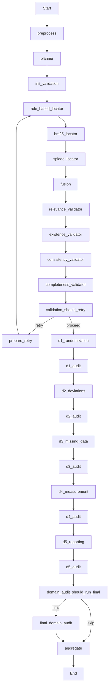
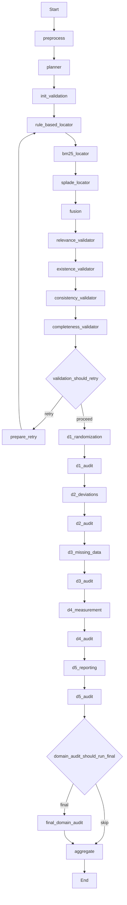
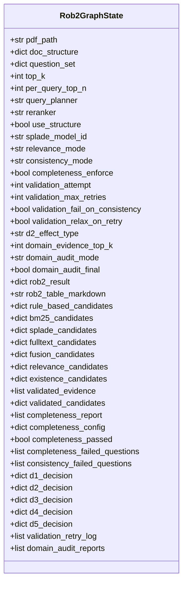
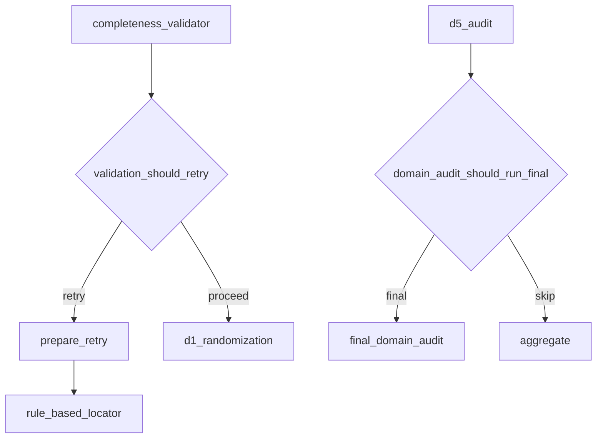

# Graph Command

<cite>
**Referenced Files in This Document**   
- [graph.py](file://src/cli/commands/graph.py)
- [rob2_graph.py](file://src/pipelines/graphs/rob2_graph.py)
- [routing.py](file://src/pipelines/graphs/routing.py)
- [rob2_runner.py](file://src/services/rob2_runner.py)
- [common.py](file://src/cli/common.py)
- [requests.py](file://src/schemas/requests.py)
</cite>

## Table of Contents
1. [Introduction](#introduction)
2. [Graph Command Overview](#graph-command-overview)
3. [Subcommands](#subcommands)
4. [Output Formats](#output-formats)
5. [ROB2 Workflow Visualization](#rob2-workflow-visualization)
6. [State Management and Execution Flow](#state-management-and-execution-flow)
7. [Debugging and Troubleshooting](#debugging-and-troubleshooting)
8. [Integration with LangGraph Components](#integration-with-langgraph-components)
9. [Performance and Optimization](#performance-and-optimization)
10. [Common Issues and Solutions](#common-issues-and-solutions)

## Introduction

The 'graph' command provides comprehensive inspection and debugging capabilities for the LangGraph workflow used in the ROB2 assessment system. This documentation details how to visualize, analyze, and debug the complete workflow graph, including its nodes, edges, and execution paths. The command enables users to understand the complex state transitions, identify bottlenecks, and troubleshoot issues in the assessment pipeline.

**Section sources**
- [graph.py](file://src/cli/commands/graph.py#L1-L120)

## Graph Command Overview

The graph command serves as the primary interface for inspecting and executing the LangGraph workflow that powers the ROB2 assessment system. It provides two main subcommands: 'show' for visualizing the graph structure and 'run' for executing the workflow with detailed output options. The command integrates with the LangGraph framework to provide comprehensive debugging capabilities for the assessment pipeline.

The graph command is implemented as a Typer application, providing a user-friendly CLI interface with proper help text and option validation. It leverages the LangGraph framework's built-in visualization capabilities to render the workflow graph in multiple formats, making it easier to understand the complex relationships between different processing stages in the ROB2 assessment.

**Section sources**
- [graph.py](file://src/cli/commands/graph.py#L15-L22)

## Subcommands

### show

The 'show' subcommand outputs the structure of the ROB2 assessment workflow graph in various formats. It allows users to visualize the complete workflow topology, including all nodes and their connections. The command supports three output formats: mermaid, ascii, and nodes, each providing different levels of detail and visualization capabilities.

The 'show' command accepts two parameters: the output format and an optional output file path. When no output file is specified, the graph representation is printed to stdout. The mermaid format produces a Mermaid.js-compatible diagram that can be rendered in various documentation systems, while the ascii format uses the grandalf library to create a text-based representation of the graph.

**Diagram sources**
- [rob2_graph.py](file://src/pipelines/graphs/rob2_graph.py#L382-L416)

**Section sources**
- [graph.py](file://src/cli/commands/graph.py#L25-L65)

### run

The 'run' subcommand executes the ROB2 assessment workflow and outputs the results. It accepts a PDF path as input and various options to control the execution behavior, including debugging level, output format, and workflow configuration. The command orchestrates the complete assessment pipeline, from document preprocessing to final risk aggregation.

The 'run' command supports multiple output formats, including JSON and Markdown tables, making it suitable for both programmatic integration and human-readable reporting. It also provides extensive debugging capabilities through the debug parameter, which controls the level of detail included in the output. The command integrates with the rob2_runner service to execute the workflow and collect results.

**Section sources**
- [graph.py](file://src/cli/commands/graph.py#L68-L117)

## Output Formats

### Graph Structure Descriptions

The 'show' command provides three formats for visualizing the graph structure: mermaid, ascii, and nodes. The mermaid format generates a Mermaid.js diagram that can be rendered in various documentation systems and web applications. This format is ideal for sharing and embedding in reports and documentation.

The ascii format uses the grandalf library to create a text-based representation of the graph, which is useful for terminal-based workflows and quick inspections. The nodes format provides a simple list of nodes and edges, making it easy to parse programmatically and understand the basic topology of the workflow.

**Diagram sources**
- [rob2_graph.py](file://src/pipelines/graphs/rob2_graph.py#L382-L416)

**Section sources**
- [graph.py](file://src/cli/commands/graph.py#L41-L58)

### Execution Traces

The 'run' command generates execution traces that capture the state of the workflow at various stages. These traces include detailed information about the processing steps, intermediate results, and final outputs. The traces can be output in JSON format for programmatic analysis or as Markdown tables for human-readable reporting.

The execution traces include debugging information that can be controlled through the debug parameter, with levels ranging from 'none' to 'full'. The 'min' level includes basic validation results, while the 'full' level includes the complete state of the workflow, making it invaluable for debugging complex issues.

**Section sources**
- [graph.py](file://src/cli/commands/graph.py#L113-L116)

## ROB2 Workflow Visualization

### Complete Workflow Graph

The ROB2 assessment workflow consists of a complex graph of interconnected nodes that process scientific papers to assess their risk of bias. The workflow begins with document preprocessing and question planning, followed by evidence location, validation, domain reasoning, and final aggregation. The graph includes conditional edges that enable retry mechanisms and optional processing stages.

The complete workflow graph can be visualized using the 'show' command with the mermaid format. This visualization reveals the sequential and conditional relationships between different processing stages, making it easier to understand the overall flow of the assessment pipeline.

**Diagram sources**
- [rob2_graph.py](file://src/pipelines/graphs/rob2_graph.py#L382-L416)

**Section sources**
- [rob2_graph.py](file://src/pipelines/graphs/rob2_graph.py#L288-L422)

### Processing Stage Debugging

The graph command enables detailed debugging of specific processing stages in the ROB2 workflow. By visualizing the graph structure and examining the execution traces, users can identify bottlenecks, understand state transitions, and troubleshoot issues in individual processing stages.

For example, the evidence location stage can be debugged by examining the connections between the rule-based locator, BM25 locator, SPLADE locator, and fusion nodes. The validation stage can be analyzed by tracing the flow from the fusion node through the relevance, existence, consistency, and completeness validators.

**Section sources**
- [rob2_graph.py](file://src/pipelines/graphs/rob2_graph.py#L293-L330)

## State Management and Execution Flow

### State Graph Implementation

The ROB2 workflow is implemented as a StateGraph using the LangGraph framework. The state is defined by the Rob2GraphState TypedDict, which includes all the parameters and intermediate results used throughout the workflow. The state graph manages the flow of data between nodes, ensuring that each processing stage has access to the information it needs.

The state graph implementation includes conditional edges that enable complex control flow, such as retry mechanisms and optional processing stages. The graph is compiled with a high recursion limit to accommodate the retry loop in the validation stage, which may require multiple iterations to achieve satisfactory results.

**Diagram sources**
- [rob2_graph.py](file://src/pipelines/graphs/rob2_graph.py#L46-L210)

**Section sources**
- [rob2_graph.py](file://src/pipelines/graphs/rob2_graph.py#L46-L210)

### Conditional Routing

The workflow includes two key conditional routing mechanisms: validation_should_retry and domain_audit_should_run_final. These routing functions determine the flow of execution based on the current state of the workflow.

The validation_should_retry function routes the workflow to either retry the evidence location stage or proceed to domain reasoning based on the validation results and retry budget. The domain_audit_should_run_final function determines whether to run a final domain audit after processing all domains.

**Diagram sources**
- [routing.py](file://src/pipelines/graphs/routing.py#L28-L57)

**Section sources**
- [routing.py](file://src/pipelines/graphs/routing.py#L28-L57)

## Debugging and Troubleshooting

### Identifying Bottlenecks

The graph command can be used to identify bottlenecks in the ROB2 assessment workflow by visualizing the complete graph and analyzing the execution traces. Common bottlenecks include slow evidence retrieval, validation failures requiring retries, and computationally intensive domain reasoning stages.

By examining the graph structure and execution flow, users can identify stages that may benefit from optimization, such as parallelizing evidence retrieval or adjusting validation thresholds to reduce retry frequency.

**Section sources**
- [rob2_graph.py](file://src/pipelines/graphs/rob2_graph.py#L382-L416)

### Understanding State Transitions

The state transitions in the ROB2 workflow can be understood by examining the Rob2GraphState definition and the connections between nodes. Each node in the workflow updates specific fields in the state, which are then used by subsequent nodes.

For example, the preprocess node updates the doc_structure field, which is then used by the planner node to generate the question_set. The validation nodes update various validation-related fields, which are used by the routing functions to determine the flow of execution.

**Section sources**
- [rob2_graph.py](file://src/pipelines/graphs/rob2_graph.py#L46-L210)

## Integration with LangGraph Components

### Pipeline Integration

The graph command integrates with the LangGraph components in the pipelines/graphs/ module to provide a complete interface for inspecting and executing the ROB2 assessment workflow. The build_rob2_graph function constructs the state graph by adding nodes and edges that represent the various processing stages in the workflow.

The integration includes node overrides that allow for testing and debugging by replacing specific nodes with mock implementations. This capability is useful for isolating issues and testing specific parts of the workflow without executing the entire pipeline.

**Section sources**
- [rob2_graph.py](file://src/pipelines/graphs/rob2_graph.py#L288-L422)

### State Management Patterns

The ROB2 workflow uses several state management patterns to handle complex processing requirements. These include:

- **Retry with state updates**: The validation stage can retry the evidence location process with updated parameters, such as increased retrieval limits or relaxed validation criteria.
- **Conditional execution**: Optional processing stages, such as the final domain audit, are executed based on state conditions.
- **Accumulation**: Certain state fields, such as domain_audit_reports, use the operator.add annotation to accumulate values across multiple executions.

These patterns enable the workflow to handle complex assessment requirements while maintaining a clear and predictable execution flow.

**Section sources**
- [rob2_graph.py](file://src/pipelines/graphs/rob2_graph.py#L216-L285)

## Performance and Optimization

### Recursion Limit Configuration

The ROB2 workflow includes an intentional retry loop in the validation stage, which can lead to deep recursion when combined with downstream processing stages. To prevent false positives from LangGraph's default recursion limit, the compiled graph is configured with a higher recursion limit of 100.

This configuration ensures that the workflow can complete successfully even when multiple retries are required, without triggering recursion limit exceptions. However, it also means that performance should be monitored to ensure that the workflow completes in a reasonable time.

**Section sources**
- [rob2_graph.py](file://src/pipelines/graphs/rob2_graph.py#L422-L422)

### Execution Efficiency

The graph command provides several options for optimizing execution efficiency, including the ability to disable optional processing stages and adjust processing parameters. For example, the domain_audit_final parameter can be set to false to skip the final domain audit, reducing processing time.

Additionally, the validation_relax_on_retry parameter can be used to automatically relax validation criteria on retry, potentially reducing the number of retries needed to achieve satisfactory results.

**Section sources**
- [rob2_graph.py](file://src/pipelines/graphs/rob2_graph.py#L249-L285)

## Common Issues and Solutions

### Circular Dependencies

The ROB2 workflow does not have circular dependencies in the traditional sense, but it does include a retry loop that returns to the evidence location stage from the validation stage. This design is intentional and enables the workflow to improve results by adjusting parameters and retrying failed validations.

To prevent infinite loops, the retry mechanism is controlled by the validation_max_retries parameter, which limits the number of retry attempts. Additionally, the prepare_retry node updates the state to make subsequent attempts more likely to succeed, such as by increasing retrieval limits or relaxing validation criteria.

**Section sources**
- [rob2_graph.py](file://src/pipelines/graphs/rob2_graph.py#L395-L400)

### Missing Node Connections

Missing node connections can occur if required nodes are not properly added to the state graph. The build_rob2_graph function ensures that all necessary nodes are added and connected in the correct order. Each node is added with a specific name that matches the routing functions' expectations.

If a node connection is missing, it can be identified by examining the graph structure with the 'show' command and comparing it to the expected workflow. The issue can then be resolved by ensuring that the node is properly added to the graph and connected to the appropriate predecessor and successor nodes.

**Section sources**
- [rob2_graph.py](file://src/pipelines/graphs/rob2_graph.py#L293-L378)

### State Corruption

State corruption can occur if nodes modify state fields in unexpected ways or if state updates are not properly synchronized. The ROB2 workflow uses a typed state definition (Rob2GraphState) to help prevent state corruption by ensuring that state fields are used consistently.

Additionally, the workflow uses immutable state updates where possible, with each node returning a dictionary of updates rather than modifying the state directly. This approach makes it easier to trace state changes and identify the source of any corruption.

**Section sources**
- [rob2_graph.py](file://src/pipelines/graphs/rob2_graph.py#L46-L210)