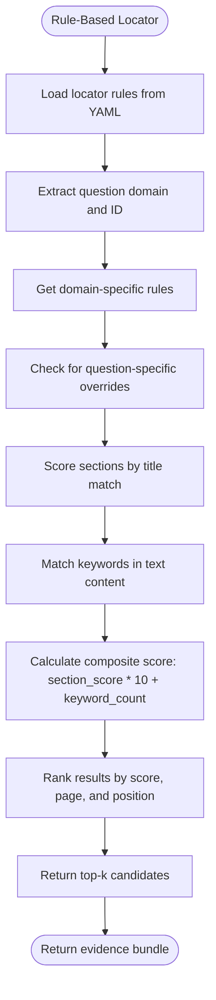

# Locator Command

<cite>
**Referenced Files in This Document**   
- [locator.py](file://src/cli/commands/locator.py)
- [locator_rules.py](file://src/rob2/locator_rules.py)
- [locator_rules.yaml](file://src/rob2/locator_rules.yaml)
- [rule_based.py](file://src/pipelines/graphs/nodes/locators/rule_based.py)
- [retrieval_bm25.py](file://src/pipelines/graphs/nodes/locators/retrieval_bm25.py)
- [retrieval_splade.py](file://src/pipelines/graphs/nodes/locators/retrieval_splade.py)
- [evidence.py](file://src/schemas/internal/evidence.py)
- [locator.py](file://src/schemas/internal/locator.py)
- [rob2_questions.yaml](file://src/rob2/rob2_questions.yaml)
- [test_rule_based_locator.py](file://tests/unit/test_rule_based_locator.py)
- [check_rule_based_locator.py](file://scripts/check_rule_based_locator.py)
</cite>

## Table of Contents
1. [Introduction](#introduction)
2. [Locator Subcommands](#locator-subcommands)
3. [Input Parameters](#input-parameters)
4. [Output Format](#output-format)
5. [Locator Rules Implementation](#locator-rules-implementation)
6. [Custom Locator Rules](#custom-locator-rules)
7. [Performance Considerations](#performance-considerations)
8. [Troubleshooting](#troubleshooting)
9. [Examples](#examples)

## Introduction

The Locator Command is a critical component of the ROB2 assessment system, designed to identify and extract evidence from academic papers to support risk of bias evaluations. This command provides multiple evidence location strategies through different subcommands, enabling both rule-based and retrieval-based approaches to find relevant text passages that answer specific ROB2 assessment questions. The system is structured to support reproducible, auditable evidence gathering with confidence scoring and positional information.

The locator system operates on structured document representations and a predefined question bank, using various strategies to match questions with relevant evidence in the text. It serves as the foundation for subsequent validation and aggregation steps in the ROB2 assessment pipeline, providing the raw evidence that informs domain-level risk judgments.

**Section sources**
- [locator.py](file://src/cli/commands/locator.py#L1-L93)
- [rob2_questions.yaml](file://src/rob2/rob2_questions.yaml#L1-L244)

## Locator Subcommands

The locator command provides three distinct subcommands for different evidence location strategies, each implementing a unique approach to finding relevant evidence in document contexts.

### Rule-Based Locator

The `rule` subcommand implements a deterministic, pattern-matching approach to evidence location. This strategy uses predefined rules based on section titles and keywords to identify relevant passages. The rule-based locator assigns scores based on section title matches (with positional weighting) and keyword occurrences in the text, combining these scores to rank candidates. This approach is highly interpretable and provides consistent results across documents with similar structures.

**Diagram sources**
- [rule_based.py](file://src/pipelines/graphs/nodes/locators/rule_based.py#L49-L219)
- [locator_rules.py](file://src/rob2/locator_rules.py#L15-L35)

### BM25 Locator

The BM25 locator implements a probabilistic information retrieval approach using the BM25 algorithm. This strategy supports multi-query planning, where multiple search queries are generated for each question to improve recall. The results from different queries are fused using Reciprocal Rank Fusion (RRF) to produce a final ranking. The BM25 locator can optionally incorporate structure-aware retrieval by filtering the search space based on section priors defined in the locator rules.

### SPLADE Locator

The SPLADE (SParse Lexical AnD Dense) locator implements a state-of-the-art retrieval approach using sparse vector representations. This strategy encodes both queries and document passages into high-dimensional sparse vectors, capturing lexical matching with term importance weighting. Like the BM25 locator, it supports multi-query planning and RRF fusion, and can leverage section priors for structure-aware retrieval. The SPLADE model provides improved semantic matching compared to traditional keyword-based approaches.

**Section sources**
- [locator.py](file://src/cli/commands/locator.py#L24-L93)
- [retrieval_bm25.py](file://src/pipelines/graphs/nodes/locators/retrieval_bm25.py#L48-L404)
- [retrieval_splade.py](file://src/pipelines/graphs/nodes/locators/retrieval_splade.py#L49-L488)

## Input Parameters

The locator command requires specific input parameters to function effectively, including target questions and document contexts that are processed to extract relevant evidence.

### Target Questions

The locator operates on a predefined set of ROB2 assessment questions, each identified by a unique question ID (e.g., q1_1, q2a_6). These questions are organized by domain (D1-D5) corresponding to different aspects of bias risk in clinical trials. Each question has a specific text and is associated with a domain that determines the appropriate evidence location strategy. The question bank is defined in `rob2_questions.yaml` and loaded into the system at runtime.

### Document Contexts

The document context is derived from a PDF paper that is parsed into a structured format containing section titles, paragraph IDs, page numbers, and text content. This structured representation allows the locator to analyze both the content and the structural context of potential evidence. The document structure is processed by the `parse_docling_pdf` function, which extracts and organizes the content into a hierarchical format that preserves the original document organization.

**Section sources**
- [shared.py](file://src/cli/commands/shared.py#L23-L31)
- [rob2_questions.yaml](file://src/rob2/rob2_questions.yaml#L1-L244)
- [preprocess.py](file://src/pipelines/graphs/nodes/preprocess.py)

## Output Format

The locator command produces a standardized output format that includes located evidence with confidence scores and positional information, enabling consistent processing by downstream components.

### Evidence Candidate Structure

Each evidence candidate contains comprehensive information about the matched passage, including:

- **question_id**: The ID of the ROB2 question being addressed
- **paragraph_id**: A unique identifier for the paragraph within the document
- **title**: The section title containing the evidence
- **page**: The page number where the evidence appears
- **text**: The full text of the evidence passage
- **source**: The locator strategy used ("rule_based" or "retrieval")
- **score**: A composite confidence score indicating the strength of the match
- **matched_keywords**: Keywords from the rules that were found in the text
- **matched_section_priors**: Section priors that matched the passage's title

### Evidence Bundle

For each question, the locator returns an evidence bundle containing the top-k candidates ranked by their confidence scores. The bundle provides a curated set of the most relevant passages, allowing reviewers to focus on the highest-quality evidence. The value of k can be configured via the `top_k` parameter, with a default value defined in the locator rules.

**Diagram sources**
- [evidence.py](file://src/schemas/internal/evidence.py#L21-L68)
- [rule_based.py](file://src/pipelines/graphs/nodes/locators/rule_based.py#L92-L104)

**Section sources**
- [evidence.py](file://src/schemas/internal/evidence.py#L1-L171)
- [rule_based.py](file://src/pipelines/graphs/nodes/locators/rule_based.py#L56-L68)

## Locator Rules Implementation

The rule-based locator relies on a comprehensive set of pattern matching rules defined in `rob2/locator_rules.yaml`, which are implemented in the `rob2.locator_rules` module.

### Rule Structure

The locator rules are organized hierarchically by domain (D1-D5), with each domain having section priors and keywords that guide the evidence location process. Section priors are weighted based on their position in the list, with earlier entries having higher priority. Keywords are used for text content matching, with special handling for short tokens (≤4 characters) that require word boundaries.

The rules support question-specific overrides, allowing fine-tuning of the location strategy for individual questions. These overrides can modify both section priors and keywords, providing flexibility to address unique requirements of specific assessment questions.

### Pattern Matching Logic

The pattern matching logic in `rule_based.py` implements a multi-stage scoring process:

1. **Section scoring**: The section title is normalized and compared against section priors, with a score based on the priority of the first matching prior
2. **Keyword matching**: The text content is searched for keywords, with exact word boundaries enforced for short tokens
3. **Composite scoring**: The final score combines the section score (multiplied by 10) and the keyword match count
4. **Result ranking**: Candidates are ranked by score, then by page number, and finally by position within the document

The implementation includes normalization functions that handle case folding, hyphen variations, and whitespace normalization to improve matching robustness.

**Diagram sources**
- [rule_based.py](file://src/pipelines/graphs/nodes/locators/rule_based.py#L153-L218)
- [locator_rules.py](file://src/rob2/locator_rules.py#L15-L35)

**Section sources**
- [locator_rules.py](file://src/rob2/locator_rules.py#L1-L37)
- [locator_rules.yaml](file://src/rob2/locator_rules.yaml#L1-L161)
- [rule_based.py](file://src/pipelines/graphs/nodes/locators/rule_based.py#L73-L219)

## Custom Locator Rules

Creating custom locator rules allows adaptation of the evidence location system to specific document types or assessment requirements. Custom rules are defined in YAML format and follow the structure specified in the `LocatorRules` Pydantic model.

### Rule Creation Guidelines

When creating custom rules, consider the following guidelines:

1. **Domain-specific section priors**: Identify the most likely sections where evidence for each domain appears, ordering them by expected relevance
2. **Comprehensive keyword lists**: Include synonyms, abbreviations, and common variations of key terms
3. **Question-specific overrides**: Use overrides to fine-tune rules for questions with unique requirements
4. **Version management**: Update the version field when making significant changes to rules

The rules should be validated against a diverse set of documents to ensure robust performance across different writing styles and organizational structures.

### Rule Validation

Custom rules can be validated using the test framework in `test_rule_based_locator.py`, which provides examples of how to construct test cases with mock documents and expected outcomes. The validation process should check that:
- Rules load correctly from YAML
- Expected evidence is prioritized in the results
- Section and keyword scoring works as intended
- Edge cases (e.g., short tokens, hyphenated terms) are handled correctly

**Section sources**
- [locator_rules.yaml](file://src/rob2/locator_rules.yaml#L1-L161)
- [test_rule_based_locator.py](file://tests/unit/test_rule_based_locator.py#L1-L140)

## Performance Considerations

The locator system has been designed with performance efficiency in mind, particularly for the rule-based approach which involves pattern matching across potentially large documents.

### Rule Compilation

The rule-based locator uses LRU caching via the `@lru_cache` decorator on the `get_locator_rules` function, which prevents repeated parsing and validation of the rules file. This caching mechanism significantly improves performance when the locator is called multiple times, as the rules are loaded and validated only once.

### Matching Efficiency

The pattern matching implementation optimizes performance through several techniques:

- **Text normalization caching**: The `_normalize_for_match` function is called once per text passage, with the result reused for multiple keyword searches
- **Early termination**: Sections with no section score and no keyword matches are skipped
- **Efficient data structures**: Sets are used for deduplication of matched keywords, providing O(1) lookup time
- **Precompiled regex patterns**: Regular expressions for non-word characters and whitespace are compiled at module load time

For large documents, the system processes sections sequentially, with memory usage proportional to the number of candidates rather than the document size.

**Section sources**
- [locator_rules.py](file://src/rob2/locator_rules.py#L28-L32)
- [rule_based.py](file://src/pipelines/graphs/nodes/locators/rule_based.py#L14-L15)

## Troubleshooting

Common issues with the locator command typically involve false positives, false negatives, or configuration problems. Understanding these issues and their solutions is essential for maintaining accurate evidence location.

### False Positives

False positives occur when irrelevant passages are incorrectly identified as evidence. This can happen when:
- Keywords are too general and match unrelated content
- Section priors are too broad and match multiple sections
- Short tokens without proper word boundaries match within longer words

To address false positives:
- Refine keyword lists to be more specific
- Add negative keywords or patterns to exclude common false matches
- Adjust section prior ordering to prioritize more specific section titles
- Review and adjust the composite scoring formula if necessary

### False Negatives

False negatives occur when relevant evidence is missed by the locator. Common causes include:
- Missing keywords or synonyms in the rules
- Section titles that don't match the defined priors
- Text variations not accounted for in the normalization process

To address false negatives:
- Expand keyword lists to include synonyms and common variations
- Add additional section priors that match alternative section naming conventions
- Review document parsing to ensure all relevant text is included in the analysis
- Check that text normalization is not over-aggressive in removing meaningful variations

**Section sources**
- [test_rule_based_locator.py](file://tests/unit/test_rule_based_locator.py#L88-L140)
- [check_rule_based_locator.py](file://scripts/check_rule_based_locator.py#L1-L111)

## Examples

The following examples demonstrate how different locators perform on various ROB2 assessment questions, illustrating the strengths and characteristics of each approach.

### Example 1: Randomization Process (q1_1)

For the question "Was the allocation sequence random?", the rule-based locator identifies passages containing keywords like "computer-generated", "random number", and "block random". In a typical paper, this would match methods sections describing the randomization procedure. The BM25 and SPLADE locators would also find these passages, with SPLADE potentially identifying semantically similar content that doesn't contain the exact keywords.

### Example 2: Allocation Concealment (q1_2)

For "Was the allocation sequence concealed until participants were enrolled?", the locator rules include keywords like "allocation conceal", "sealed envelope", and "opaque envelope". The rule-based approach would score highly on sections with titles containing "allocation" or "concealment" that also contain these keywords. Retrieval-based approaches might find additional evidence in supplementary materials or protocol descriptions.

### Example 3: Intention-to-Treat Analysis (q2a_6)

For "Was an appropriate analysis used to estimate the effect of assignment to intervention?", the system looks for terms like "intention to treat", "ITT", and "as randomized". The rule-based locator includes special handling for the short token "ITT" by requiring word boundaries, preventing false matches in words like "sitting". This demonstrates the importance of the token length check in `_is_short_token`.

**Section sources**
- [rob2_questions.yaml](file://src/rob2/rob2_questions.yaml#L4-L18)
- [locator_rules.yaml](file://src/rob2/locator_rules.yaml#L119-L161)
- [test_rule_based_locator.py](file://tests/unit/test_rule_based_locator.py#L21-L86)