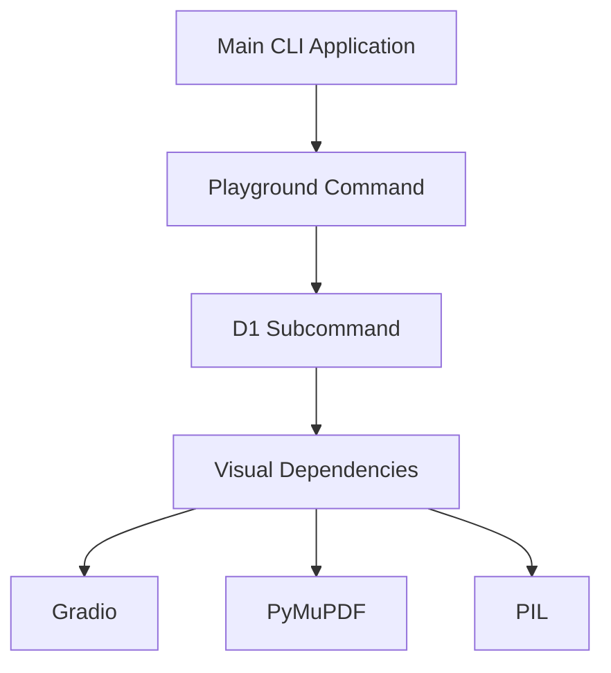
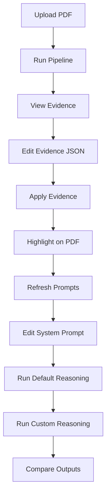
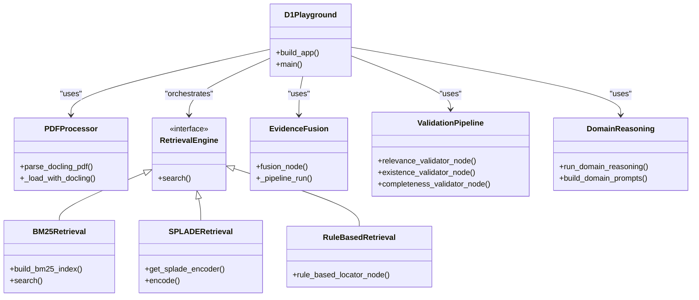

# Playground Command

<cite>
**Referenced Files in This Document**   
- [playground.py](file://src/cli/commands/playground.py)
- [domain_playground.py](file://src/playground/domain_playground.py)
- [d1_randomization.py](file://src/pipelines/graphs/nodes/domains/d1_randomization.py)
- [common.py](file://src/pipelines/graphs/nodes/domains/common.py)
- [fusion.py](file://src/pipelines/graphs/nodes/fusion.py)
- [preprocess.py](file://src/pipelines/graphs/nodes/preprocess.py)
- [bm25.py](file://src/retrieval/engines/bm25.py)
- [splade.py](file://src/retrieval/engines/splade.py)
- [completeness.py](file://src/pipelines/graphs/nodes/validators/completeness.py)
- [existence.py](file://src/pipelines/graphs/nodes/validators/existence.py)
- [relevance.py](file://src/pipelines/graphs/nodes/validators/relevance.py)
- [question_bank.py](file://src/rob2/question_bank.py)
- [d1_system.md](file://src/llm/prompts/domains/d1_system.md)
- [config.py](file://src/core/config.py)
</cite>

## Table of Contents
1. [Introduction](#introduction)
2. [Subcommands and Access](#subcommands-and-access)
3. [Interactive Features](#interactive-features)
4. [Use Cases](#use-cases)
5. [Implementation Architecture](#implementation-architecture)
6. [Effective Usage Guidance](#effective-usage-guidance)
7. [Limitations](#limitations)
8. [Conclusion](#conclusion)

## Introduction

The playground command provides an interactive environment for testing and debugging components of the ROB2 assessment system. It enables developers and researchers to isolate specific workflow stages, experiment with different configurations, and validate component behavior without executing the full pipeline. The primary focus is on the D1 randomization assessment, allowing users to test evidence validation, retrieval strategies, and domain reasoning in a controlled setting. This interactive tool is particularly valuable for rapid prototyping, parameter tuning, and understanding the impact of various configuration options on the assessment outcomes.

**Section sources**
- [playground.py](file://src/cli/commands/playground.py#L1-L30)
- [domain_playground.py](file://src/playground/domain_playground.py#L1-L692)

## Subcommands and Access

The playground command offers subcommands to access different interactive environments, with the primary subcommand being `d1` for the D1 randomization assessment. The `d1` subcommand launches a Gradio-based interactive interface that visualizes the entire D1 assessment workflow from PDF processing to final decision making. To access the D1 playground, users must install the optional visual dependencies using `uv pip install -e '.[visual]'`. This requirement ensures that the necessary visualization components, including Gradio, PyMuPDF, and PIL, are available for rendering PDFs and highlighting evidence. The subcommand structure follows the Typer framework conventions, with the playground command registered as a subcommand in the main CLI application.

**Diagram sources **
- [playground.py](file://src/cli/commands/playground.py#L8-L30)
- [domain_playground.py](file://src/playground/domain_playground.py#L1-L692)

**Section sources**
- [playground.py](file://src/cli/commands/playground.py#L8-L30)
- [domain_playground.py](file://src/playground/domain_playground.py#L1-L692)

## Interactive Features

The D1 playground provides several interactive features that enable real-time feedback and component testing. The interface is divided into two main sections: the evidence and retrieval side, and the prompt and reasoning side. Users can upload a PDF document and run the D1 pipeline to generate initial evidence candidates through multiple retrieval strategies including rule-based, BM25, and SPLADE. The evidence can be manually edited in JSON format, allowing users to add, remove, or modify evidence candidates. The interface provides real-time highlighting of evidence on the PDF pages, enabling visual verification of the selected paragraphs. Users can adjust parameters such as top-k evidence count, per-query top-N candidates, and toggle structured retrieval on or off. The prompt side displays the system and user prompts generated from the evidence, which can be manually edited to test different prompt engineering strategies. Users can run the D1 reasoning with both default and custom prompts, comparing the outputs side by side to evaluate the impact of prompt modifications.

**Diagram sources **
- [domain_playground.py](file://src/playground/domain_playground.py#L562-L682)

**Section sources**
- [domain_playground.py](file://src/playground/domain_playground.py#L562-L682)

## Use Cases

The playground environment supports several key use cases for rapid prototyping and debugging specific workflow stages. For evidence validation testing, users can isolate the validation pipeline to assess how different evidence candidates pass or fail existence, relevance, and completeness checks. This allows for fine-tuning of validation thresholds and rules without running the entire assessment. For retrieval strategy evaluation, the playground enables comparison of different retrieval engines (BM25, SPLADE, rule-based) and their fusion strategies. Users can analyze how varying the top-k and per-query top-N parameters affects the quality of retrieved evidence. Domain reasoning experimentation allows users to test different prompt templates, LLM configurations, and reasoning approaches for the D1 randomization assessment. The ability to manually edit evidence and prompts facilitates A/B testing of different reasoning strategies and helps identify edge cases in the decision logic.

**Section sources**
- [domain_playground.py](file://src/playground/domain_playground.py#L303-L356)
- [d1_randomization.py](file://src/pipelines/graphs/nodes/domains/d1_randomization.py#L1-L48)
- [common.py](file://src/pipelines/graphs/nodes/domains/common.py#L100-L129)

## Implementation Architecture

The playground implementation follows a modular architecture that integrates with the production components while providing an interactive interface. The core of the D1 playground is built on Gradio, which provides the web-based UI for interaction. The architecture consists of several key components: PDF processing, evidence retrieval, evidence fusion, validation pipeline, and domain reasoning. The PDF processing component uses Docling to parse the document structure and extract text with bounding box information. Multiple retrieval strategies are employed, including BM25 for keyword-based search, SPLADE for sparse vector retrieval, and rule-based matching. The fusion component combines results from multiple retrieval engines using Reciprocal Rank Fusion (RRF). The validation pipeline applies a series of checks including existence verification, relevance assessment, and completeness validation. Finally, the domain reasoning component uses an LLM to generate decisions based on the validated evidence. The playground maintains state between interactions, allowing users to modify parameters and see the effects on subsequent stages.

**Diagram sources **
- [domain_playground.py](file://src/playground/domain_playground.py#L1-L692)
- [preprocess.py](file://src/pipelines/graphs/nodes/preprocess.py#L1-L444)
- [bm25.py](file://src/retrieval/engines/bm25.py#L1-L149)
- [splade.py](file://src/retrieval/engines/splade.py#L1-L100)
- [fusion.py](file://src/pipelines/graphs/nodes/fusion.py#L1-L113)
- [relevance.py](file://src/pipelines/graphs/nodes/validators/relevance.py#L1-L207)
- [existence.py](file://src/pipelines/graphs/nodes/validators/existence.py#L1-L107)
- [completeness.py](file://src/pipelines/graphs/nodes/validators/completeness.py#L1-L140)
- [common.py](file://src/pipelines/graphs/nodes/domains/common.py#L1-L516)

**Section sources**
- [domain_playground.py](file://src/playground/domain_playground.py#L1-L692)
- [preprocess.py](file://src/pipelines/graphs/nodes/preprocess.py#L1-L444)
- [bm25.py](file://src/retrieval/engines/bm25.py#L1-L149)
- [splade.py](file://src/retrieval/engines/splade.py#L1-L100)
- [fusion.py](file://src/pipelines/graphs/nodes/fusion.py#L1-L113)
- [relevance.py](file://src/pipelines/graphs/nodes/validators/relevance.py#L1-L207)
- [existence.py](file://src/pipelines/graphs/nodes/validators/existence.py#L1-L107)
- [completeness.py](file://src/pipelines/graphs/nodes/validators/completeness.py#L1-L140)
- [common.py](file://src/pipelines/graphs/nodes/domains/common.py#L1-L516)

## Effective Usage Guidance

To effectively use the playground, users should follow a systematic approach to experiment design and parameter tuning. Start by uploading a representative PDF document and running the default pipeline to establish a baseline. Then, systematically modify one parameter at a time to observe its impact on the results. For retrieval strategy testing, compare the evidence candidates from different engines (BM25, SPLADE, rule-based) and analyze their overlap and differences. When testing evidence validation, focus on edge cases where evidence might be borderline relevant or complete. For domain reasoning experiments, create controlled variations of the evidence set to test specific reasoning patterns. When transferring findings to production, document the parameter configurations and prompt templates that yield the best results. Use the playground to identify failure modes and develop corresponding fixes or improvements. The iterative nature of the playground allows for rapid hypothesis testing and refinement of the assessment pipeline.

**Section sources**
- [domain_playground.py](file://src/playground/domain_playground.py#L303-L356)
- [config.py](file://src/core/config.py#L1-L200)

## Limitations

The playground environment has several limitations compared to full workflow execution. First, it focuses primarily on the D1 randomization assessment and does not provide interactive interfaces for other domains (D2-D5). Second, the playground uses a simplified version of the full pipeline, omitting certain production optimizations and error handling mechanisms. Third, the interactive nature of the playground means that it processes documents sequentially rather than in batch mode, which affects performance characteristics. Fourth, the playground's visualization capabilities are limited to evidence highlighting on PDF pages and do not provide comprehensive analytics or metrics that are available in the full system. Finally, certain advanced features like domain audit and evidence patching are not available in the playground environment, as they require coordination across multiple domains and assessment stages.

**Section sources**
- [domain_playground.py](file://src/playground/domain_playground.py#L1-L692)
- [d1_randomization.py](file://src/pipelines/graphs/nodes/domains/d1_randomization.py#L1-L48)

## Conclusion

The playground command provides a powerful interactive environment for testing and debugging the ROB2 assessment system, with a particular focus on the D1 randomization assessment. By enabling isolated testing of components, real-time feedback, and parameter tuning, the playground facilitates rapid prototyping and experimentation. The integration with production components ensures that findings from the playground can be directly applied to improve the full workflow. While the playground has certain limitations compared to full workflow execution, it remains an essential tool for understanding component behavior, identifying edge cases, and refining the assessment pipeline. Effective use of the playground requires systematic experiment design and careful documentation of findings for transfer to production configurations.