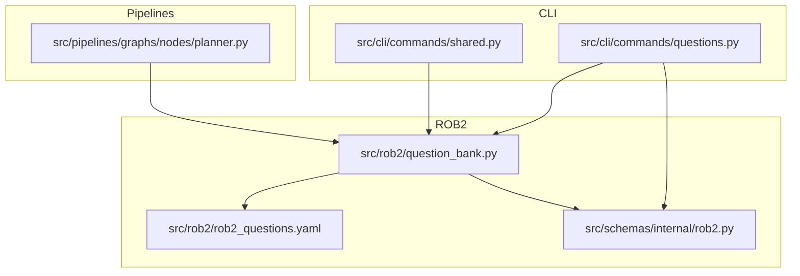
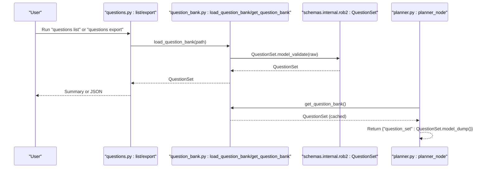
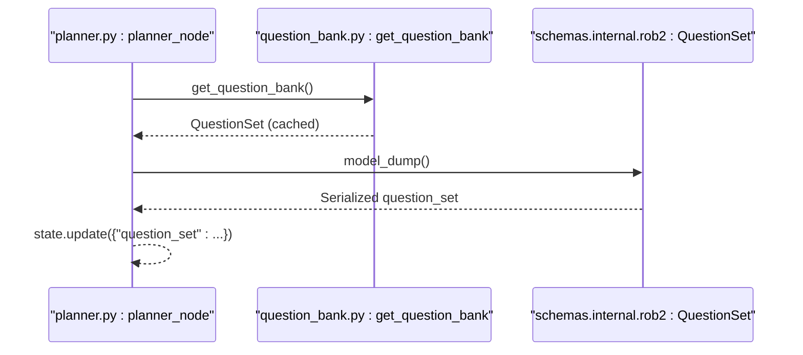
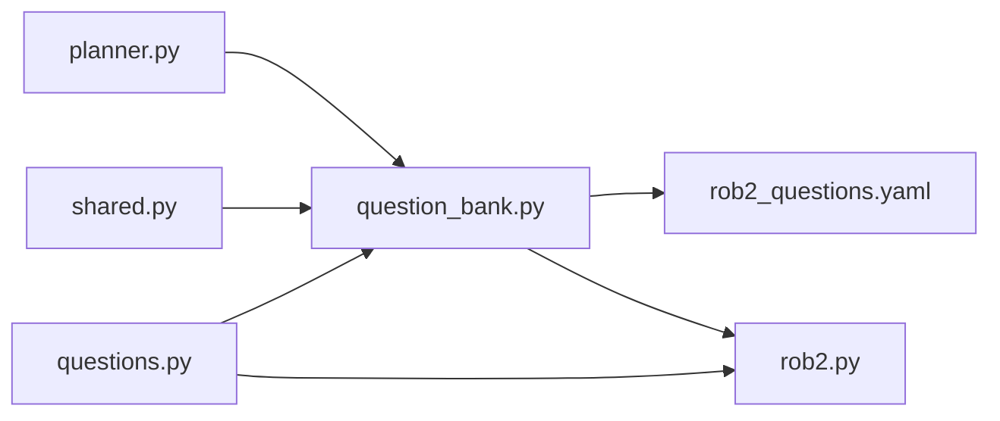

# Questions Command

<cite>
**Referenced Files in This Document**
- [questions.py](file://src/cli/commands/questions.py)
- [question_bank.py](file://src/rob2/question_bank.py)
- [rob2_questions.yaml](file://src/rob2/rob2_questions.yaml)
- [rob2.py](file://src/schemas/internal/rob2.py)
- [planner.py](file://src/pipelines/graphs/nodes/planner.py)
- [check_question_bank.py](file://scripts/check_question_bank.py)
- [decision_rules.py](file://src/rob2/decision_rules.py)
- [shared.py](file://src/cli/commands/shared.py)
</cite>

## Table of Contents
1. [Introduction](#introduction)
2. [Project Structure](#project-structure)
3. [Core Components](#core-components)
4. [Architecture Overview](#architecture-overview)
5. [Detailed Component Analysis](#detailed-component-analysis)
6. [Dependency Analysis](#dependency-analysis)
7. [Performance Considerations](#performance-considerations)
8. [Troubleshooting Guide](#troubleshooting-guide)
9. [Conclusion](#conclusion)
10. [Appendices](#appendices)

## Introduction
This document describes the “questions” command that manages ROB2 assessment questions. It covers:
- Listing available questions and exporting the question bank
- Filtering by domain and generating question sets
- The question bank structure and domain categorization
- Output formats for question texts, domains, and metadata
- Integration with question planning components in the pipeline
- Guidance on extending the question bank, creating custom question sets, and mapping questions to evidence requirements
- Troubleshooting common issues such as missing questions, incorrect domain mappings, and question duplication

## Project Structure
The “questions” command resides in the CLI layer and interacts with the question bank loader and Pydantic schemas. It integrates with the planner node that supplies the standardized question set to downstream pipeline stages.

**Diagram sources**
- [questions.py](file://src/cli/commands/questions.py#L1-L95)
- [question_bank.py](file://src/rob2/question_bank.py#L1-L44)
- [rob2_questions.yaml](file://src/rob2/rob2_questions.yaml#L1-L244)
- [rob2.py](file://src/schemas/internal/rob2.py#L1-L130)
- [planner.py](file://src/pipelines/graphs/nodes/planner.py#L1-L15)
- [shared.py](file://src/cli/commands/shared.py#L1-L76)

**Section sources**
- [questions.py](file://src/cli/commands/questions.py#L1-L95)
- [question_bank.py](file://src/rob2/question_bank.py#L1-L44)
- [rob2_questions.yaml](file://src/rob2/rob2_questions.yaml#L1-L244)
- [rob2.py](file://src/schemas/internal/rob2.py#L1-L130)
- [planner.py](file://src/pipelines/graphs/nodes/planner.py#L1-L15)
- [shared.py](file://src/cli/commands/shared.py#L1-L76)

## Core Components
- CLI command module: Provides subcommands to list and export the question bank, and prints a summary.
- Question bank loader: Loads and validates the YAML question bank into a structured model.
- Pydantic schemas: Define the shape of questions, conditions, and the question set.
- Planner node: Supplies the standardized question set to the pipeline.

Key responsibilities:
- Load YAML and validate structure and semantics
- Enforce domain and option constraints
- Provide cached access for planner reuse
- Emit human-readable summaries and JSON exports

**Section sources**
- [questions.py](file://src/cli/commands/questions.py#L1-L95)
- [question_bank.py](file://src/rob2/question_bank.py#L1-L44)
- [rob2.py](file://src/schemas/internal/rob2.py#L1-L130)
- [planner.py](file://src/pipelines/graphs/nodes/planner.py#L1-L15)

## Architecture Overview
The “questions” command orchestrates loading and summarizing the question bank. The planner node reuses the cached question set to feed downstream domain reasoning and validation nodes.

**Diagram sources**
- [questions.py](file://src/cli/commands/questions.py#L1-L95)
- [question_bank.py](file://src/rob2/question_bank.py#L1-L44)
- [rob2.py](file://src/schemas/internal/rob2.py#L1-L130)
- [planner.py](file://src/pipelines/graphs/nodes/planner.py#L1-L15)

## Detailed Component Analysis

### CLI Subcommands: list and export
- list: Loads the question bank, optionally emits JSON, otherwise prints a summary including version, variant, total questions, and counts for D2 assignment/adherence questions.
- export: Loads the question bank and writes JSON to stdout or a file.

Behavior highlights:
- Uses the default question bank path if none provided
- Emits JSON via a shared helper
- Prints a concise summary for quick inspection

**Section sources**
- [questions.py](file://src/cli/commands/questions.py#L1-L95)

### Question Bank Loader and Validation
- load_question_bank(path): Resolves path, loads YAML, ensures it is a mapping and contains a questions list, assigns implicit order indices, and validates via Pydantic.
- get_question_bank(path): Cached accessor for reuse in planner.

Validation rules enforced by schemas:
- Allowed answer codes are constrained
- QuestionSet enforces uniqueness of question_id and validates dependencies
- D2 questions require effect_type; non-D2 questions must not set effect_type

**Section sources**
- [question_bank.py](file://src/rob2/question_bank.py#L1-L44)
- [rob2.py](file://src/schemas/internal/rob2.py#L1-L130)

### Question Bank YAML Structure
The YAML defines:
- version and variant
- questions array with fields:
  - question_id, rob2_id, domain, effect_type (optional for D2), text, options, conditions, and order (auto-assigned if missing)

Conditions support logical operators and dependencies on other questions’ answers.

**Section sources**
- [rob2_questions.yaml](file://src/rob2/rob2_questions.yaml#L1-L244)

### Output Format and Metadata
- Human-readable summary includes:
  - Question bank path
  - Version and variant
  - Total question count
  - D2 assignment and adherence counts
  - First and last question_id
- JSON export includes the full QuestionSet structure with all question metadata.

**Section sources**
- [questions.py](file://src/cli/commands/questions.py#L1-L95)
- [rob2.py](file://src/schemas/internal/rob2.py#L1-L130)

### Integration with Question Planning
- The planner node retrieves the cached question set and returns it as part of the pipeline state for downstream domain reasoning and validation nodes.
- The planner relies on the cached loader to avoid repeated IO and parsing.

**Diagram sources**
- [planner.py](file://src/pipelines/graphs/nodes/planner.py#L1-L15)
- [question_bank.py](file://src/rob2/question_bank.py#L1-L44)
- [rob2.py](file://src/schemas/internal/rob2.py#L1-L130)

**Section sources**
- [planner.py](file://src/pipelines/graphs/nodes/planner.py#L1-L15)
- [question_bank.py](file://src/rob2/question_bank.py#L1-L44)
- [rob2.py](file://src/schemas/internal/rob2.py#L1-L130)

### Domain Categorization and Risk Mapping
- Domains: D1, D2 (with effect_type assignment/adherence), D3, D4, D5
- Decision rules evaluate answers to produce domain risk assessments
- These rules inform how questions map to evidence requirements and risk scoring

**Section sources**
- [rob2_questions.yaml](file://src/rob2/rob2_questions.yaml#L1-L244)
- [decision_rules.py](file://src/rob2/decision_rules.py#L1-L195)

### Filtering by Domain and Generating Question Sets
- The CLI currently prints a summary and exports the full QuestionSet.
- To generate domain-specific question sets, use the exported JSON and filter by domain and effect_type in your own scripts or tools.
- The planner node provides the full QuestionSet to downstream nodes; domain-specific subsets can be derived from that payload.

**Section sources**
- [questions.py](file://src/cli/commands/questions.py#L1-L95)
- [planner.py](file://src/pipelines/graphs/nodes/planner.py#L1-L15)
- [rob2.py](file://src/schemas/internal/rob2.py#L1-L130)

### Extending the Question Bank and Creating Custom Sets
- Extend the YAML with new questions under the questions array, respecting domain and effect_type rules.
- Maintain unique question_id and ensure options match allowed answer codes.
- Use the shared loader to validate and load your custom YAML.
- Export JSON for downstream consumption by the planner and validators.

**Section sources**
- [question_bank.py](file://src/rob2/question_bank.py#L1-L44)
- [rob2_questions.yaml](file://src/rob2/rob2_questions.yaml#L1-L244)
- [shared.py](file://src/cli/commands/shared.py#L1-L76)

## Dependency Analysis
The CLI depends on the loader and schemas. The planner depends on the loader’s cached accessor. The loader depends on the YAML and schemas.

**Diagram sources**
- [questions.py](file://src/cli/commands/questions.py#L1-L95)
- [question_bank.py](file://src/rob2/question_bank.py#L1-L44)
- [rob2.py](file://src/schemas/internal/rob2.py#L1-L130)
- [rob2_questions.yaml](file://src/rob2/rob2_questions.yaml#L1-L244)
- [planner.py](file://src/pipelines/graphs/nodes/planner.py#L1-L15)
- [shared.py](file://src/cli/commands/shared.py#L1-L76)

**Section sources**
- [questions.py](file://src/cli/commands/questions.py#L1-L95)
- [question_bank.py](file://src/rob2/question_bank.py#L1-L44)
- [rob2.py](file://src/schemas/internal/rob2.py#L1-L130)
- [rob2_questions.yaml](file://src/rob2/rob2_questions.yaml#L1-L244)
- [planner.py](file://src/pipelines/graphs/nodes/planner.py#L1-L15)
- [shared.py](file://src/cli/commands/shared.py#L1-L76)

## Performance Considerations
- The loader caches the question set to avoid repeated YAML parsing and validation in the planner.
- Prefer the cached accessor for repeated reads in long-running pipelines.
- Export JSON once and reuse the payload to minimize IO overhead.

**Section sources**
- [question_bank.py](file://src/rob2/question_bank.py#L1-L44)
- [planner.py](file://src/pipelines/graphs/nodes/planner.py#L1-L15)

## Troubleshooting Guide
Common issues and resolutions:
- Missing question bank file
  - Symptom: FileNotFoundError when path is invalid or file not found
  - Resolution: Provide a valid path or use the default location
- Invalid YAML structure
  - Symptom: ValueError indicating the YAML must be a mapping or must include a questions list
  - Resolution: Ensure the YAML is a mapping and contains a questions list
- Duplicate question_id
  - Symptom: Validation error for duplicate question_id
  - Resolution: Ensure each question_id is unique
- Unknown dependency question_id
  - Symptom: Validation error for unknown dependency
  - Resolution: Reference only existing question_ids in conditions
- Dependency answers not present in target options
  - Symptom: Validation error about dependency answers
  - Resolution: Ensure allowed answers exist in the target question’s options
- D2 questions without effect_type or non-D2 questions with effect_type
  - Symptom: Validation errors for domain/effect_type mismatch
  - Resolution: Set effect_type only for D2; do not set for other domains

Operational checks:
- Use the script-based checker to load and summarize the question bank, including counts for D2 assignment/adherence questions.

**Section sources**
- [question_bank.py](file://src/rob2/question_bank.py#L1-L44)
- [rob2.py](file://src/schemas/internal/rob2.py#L1-L130)
- [check_question_bank.py](file://scripts/check_question_bank.py#L1-L76)

## Conclusion
The “questions” command provides essential tooling to inspect, export, and integrate the ROB2 question bank into the pipeline. The loader and schemas enforce robust validation, while the planner node supplies a cached, standardized question set to downstream components. By following the guidelines here, you can extend the question bank, generate domain-specific sets, and map questions to evidence requirements reliably.

## Appendices

### Example Workflows
- List and export the question bank:
  - List: run the list subcommand to print a summary
  - Export: run the export subcommand to write JSON to stdout or a file
- Generate domain-specific sets:
  - Export JSON and filter by domain and effect_type in your own scripts
- Integrate with the planner:
  - The planner node returns the question set payload for downstream nodes

**Section sources**
- [questions.py](file://src/cli/commands/questions.py#L1-L95)
- [planner.py](file://src/pipelines/graphs/nodes/planner.py#L1-L15)
- [rob2.py](file://src/schemas/internal/rob2.py#L1-L130)