# Retrieval Command

<cite>
**Referenced Files in This Document**   
- [retrieval.py](file://src/cli/commands/retrieval.py)
- [bm25.py](file://src/retrieval/engines/bm25.py)
- [splade.py](file://src/retrieval/engines/splade.py)
- [retrieval_bm25.py](file://src/pipelines/graphs/nodes/locators/retrieval_bm25.py)
- [retrieval_splade.py](file://src/pipelines/graphs/nodes/locators/retrieval_splade.py)
- [rule_based.py](file://src/pipelines/graphs/nodes/locators/rule_based.py)
- [fusion.py](file://src/retrieval/engines/fusion.py)
- [planner.py](file://src/retrieval/query_planning/planner.py)
- [llm.py](file://src/retrieval/query_planning/llm.py)
- [cross_encoder.py](file://src/retrieval/rerankers/cross_encoder.py)
- [shared.py](file://src/cli/commands/shared.py)
- [evidence.py](file://src/schemas/internal/evidence.py)
- [locator_rules.yaml](file://src/rob2/locator_rules.yaml)
- [rob2_questions.yaml](file://src/rob2/rob2_questions.yaml)
</cite>

## Table of Contents
1. [Introduction](#introduction)
2. [Command Overview](#command-overview)
3. [Input Parameters](#input-parameters)
4. [Retrieval Engines](#retrieval-engines)
5. [Output Format](#output-format)
6. [Configuration Options](#configuration-options)
7. [Query Planning](#query-planning)
8. [Structure-Aware Retrieval](#structure-aware-retrieval)
9. [Reranking](#reranking)
10. [Examples](#examples)
11. [Troubleshooting](#troubleshooting)

## Introduction

The retrieval command group provides tools for testing and debugging evidence retrieval components in the system. It supports multiple retrieval strategies including BM25, SPLADE, and rule-based approaches, allowing for comprehensive evaluation of evidence retrieval performance. The commands are designed to help developers and researchers analyze retrieval results, compare different retrieval engines, and optimize retrieval configurations.

**Section sources**
- [retrieval.py](file://src/cli/commands/retrieval.py#L1-L202)

## Command Overview

The retrieval command group consists of three main subcommands:

- `retrieval bm25`: Runs BM25-based retrieval with multi-query planning and Reciprocal Rank Fusion (RRF)
- `retrieval splade`: Runs SPLADE-based retrieval with multi-query planning and RRF
- `retrieval rule-based`: Runs rule-based evidence location using section and keyword heuristics

These commands are implemented as CLI subcommands in the `retrieval.py` module and serve as entry points for testing the evidence retrieval components.

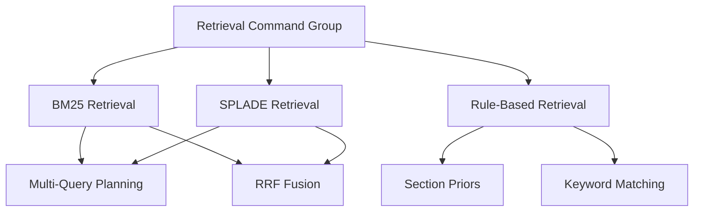

**Diagram sources**
- [retrieval.py](file://src/cli/commands/retrieval.py#L1-L202)

**Section sources**
- [retrieval.py](file://src/cli/commands/retrieval.py#L1-L202)

## Input Parameters

The retrieval commands accept several input parameters that control the retrieval process:

### Required Parameters
- `pdf_path`: Path to the PDF document to analyze (required for all retrieval commands)

### Optional Parameters
- `question_id`: Filter output to show results for a specific question (e.g., q1_1)
- `top_k`: Number of top candidates to output (default: 5)
- `per_query_top_n`: Number of candidates to retain per query before fusion (default: 50)
- `rrf_k`: RRF constant for rank fusion (default: 60)

### Query Planning Parameters
- `planner`: Query planning strategy (deterministic|llm) (default: deterministic)
- `planner_model`: LLM model for query planning
- `planner_provider`: Model provider for LLM query planning
- `planner_temperature`: Temperature for LLM query planning
- `planner_timeout`: Timeout for LLM query planning
- `planner_max_tokens`: Maximum tokens for LLM query planning
- `planner_max_retries`: Maximum retries for LLM query planning
- `planner_max_keywords`: Maximum keywords for LLM query planning

### Reranking Parameters
- `reranker`: Reranking strategy (none|cross_encoder) (default: cross_encoder)
- `reranker_model_id`: Model ID for reranker
- `reranker_device`: Device for reranker (cpu|cuda|mps)
- `reranker_max_length`: Maximum length for reranker tokenizer
- `reranker_batch_size`: Batch size for reranker
- `rerank_top_n`: Number of top candidates to rerank

### Structure-Aware Parameters
- `structure`: Enable structure-aware filtering (default: True)
- `section_bonus_weight`: Weight for section score bonus (default: 0.25)

### SPLADE-Specific Parameters
- `model_id`: SPLADE model ID or local path
- `device`: Device for SPLADE (cpu|cuda|mps)
- `hf_token`: HuggingFace token for gated models
- `doc_max_length`: Maximum length for document encoding
- `query_max_length`: Maximum length for query encoding
- `batch_size`: Batch size for SPLADE encoding

**Section sources**
- [retrieval.py](file://src/cli/commands/retrieval.py#L1-L202)

## Retrieval Engines

The system implements three distinct retrieval strategies, each with its own strengths and use cases.

### BM25 Engine

The BM25 engine provides a lightweight, traditional information retrieval approach based on the BM25 ranking function. It operates over paragraph spans and uses term frequency-inverse document frequency (TF-IDF) weighting with document length normalization.

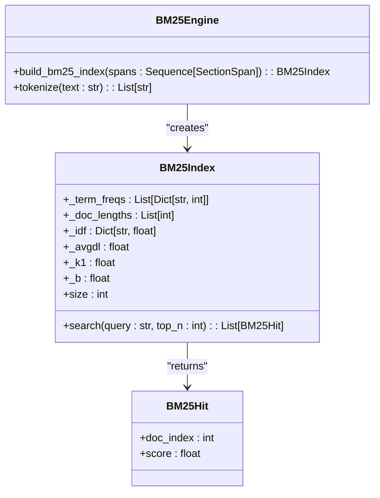

**Diagram sources**
- [bm25.py](file://src/retrieval/engines/bm25.py#L1-L149)

**Section sources**
- [bm25.py](file://src/retrieval/engines/bm25.py#L1-L149)
- [retrieval_bm25.py](file://src/pipelines/graphs/nodes/locators/retrieval_bm25.py#L1-L404)

### SPLADE Engine

The SPLADE engine uses a sparse lexical expansion model based on masked language modeling. It encodes text into sparse vectors that capture both exact term matches and semantic expansions, providing a more sophisticated retrieval approach than traditional BM25.

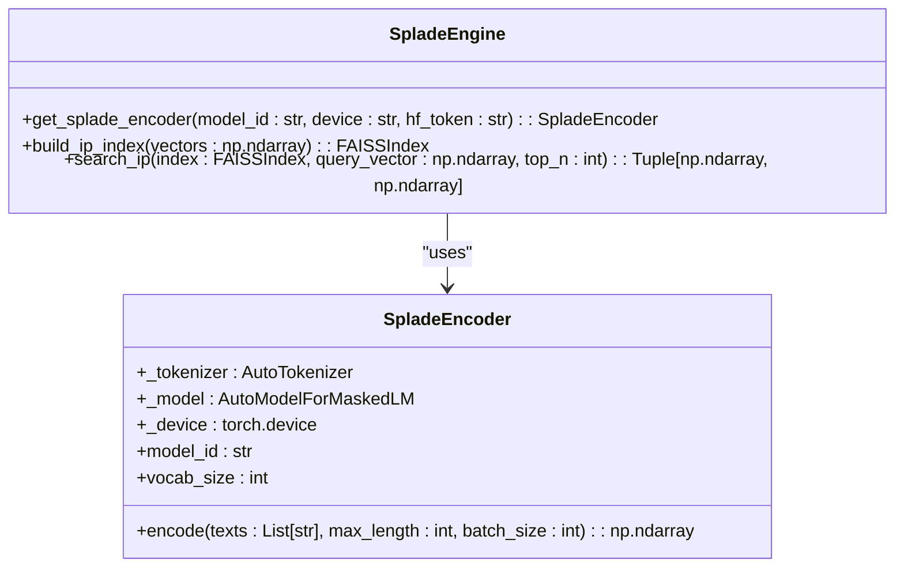

**Diagram sources**
- [splade.py](file://src/retrieval/engines/splade.py#L1-L100)

**Section sources**
- [splade.py](file://src/retrieval/engines/splade.py#L1-L100)
- [retrieval_splade.py](file://src/pipelines/graphs/nodes/locators/retrieval_splade.py#L1-L488)

### Rule-Based Engine

The rule-based engine uses heuristic rules based on section titles and keywords to locate evidence. This approach is deterministic and relies on domain-specific rules defined in configuration files.

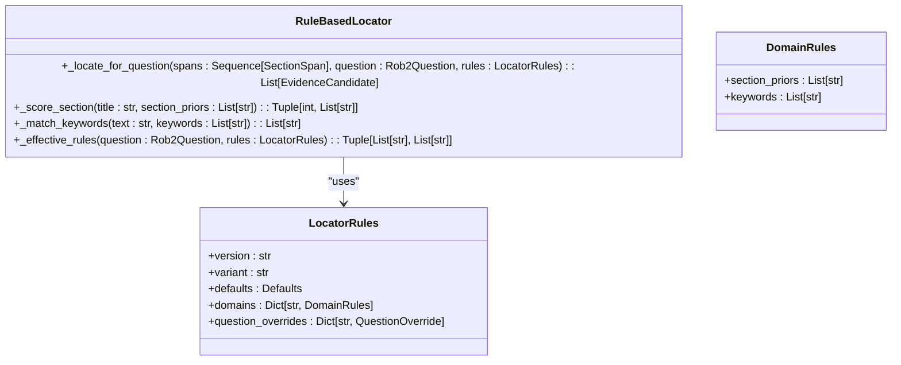

**Diagram sources**
- [rule_based.py](file://src/pipelines/graphs/nodes/locators/rule_based.py#L1-L219)

**Section sources**
- [rule_based.py](file://src/pipelines/graphs/nodes/locators/rule_based.py#L1-L219)
- [locator_rules.yaml](file://src/rob2/locator_rules.yaml#L1-L161)

## Output Format

The retrieval commands produce structured output containing retrieved evidence snippets with scores and source locations. The output format is consistent across different retrieval engines.

### Evidence Candidate Structure

Each retrieved evidence candidate contains the following fields:

| Field | Type | Description |
|-------|------|-------------|
| question_id | string | ID of the question being answered |
| paragraph_id | string | Unique identifier for the paragraph |
| title | string | Section title containing the paragraph |
| page | integer | Page number in the source document |
| text | string | Full text of the evidence snippet |
| source | string | Source of the evidence (retrieval, rule_based, fulltext) |
| score | float | Overall relevance score |
| engine | string | Retrieval engine used (bm25, splade) |
| engine_score | float | Score from the retrieval engine |
| query | string | Best matching query |
| bm25_score | float | BM25 score (if applicable) |
| rrf_score | float | RRF fusion score |
| retrieval_rank | integer | Rank in the retrieval results |
| query_ranks | dict | Ranks for each query |
| section_score | float | Score from section matching |
| matched_section_priors | list | Section priors that matched |

### Output Structure

The complete output includes multiple components:

- `queries`: The queries generated for each question
- `rankings`: Individual rankings from each query
- `candidates`: Fused candidates with complete information
- `evidence`: Top-k evidence bundles
- `config`: Configuration used for retrieval
- `query_planner`: Information about the query planner used
- `reranker`: Information about the reranker used

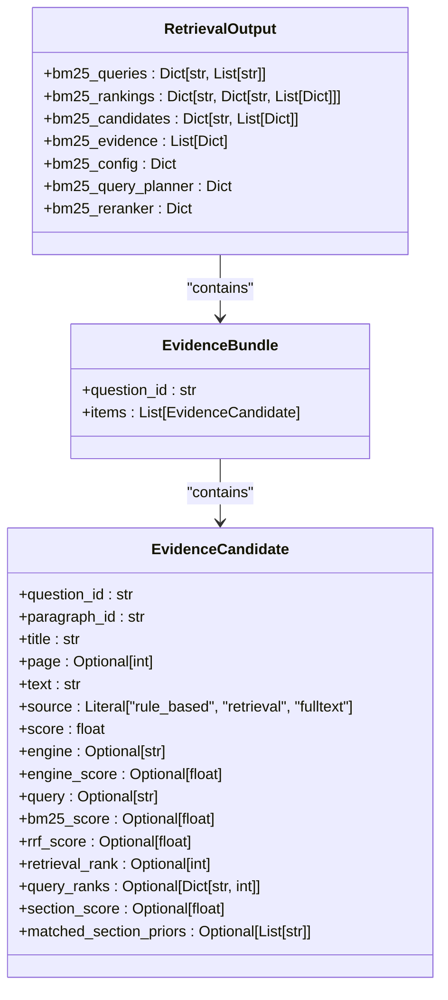

**Diagram sources**
- [evidence.py](file://src/schemas/internal/evidence.py#L1-L171)
- [retrieval_bm25.py](file://src/pipelines/graphs/nodes/locators/retrieval_bm25.py#L1-L404)

**Section sources**
- [evidence.py](file://src/schemas/internal/evidence.py#L1-L171)
- [retrieval_bm25.py](file://src/pipelines/graphs/nodes/locators/retrieval_bm25.py#L1-L404)
- [retrieval_splade.py](file://src/pipelines/graphs/nodes/locators/retrieval_splade.py#L1-L488)

## Configuration Options

The retrieval system supports extensive configuration through both command-line parameters and configuration files.

### Configuration Files

The system uses two main configuration files:

- `locator_rules.yaml`: Defines section priors and keywords for each domain and question
- `rob2_questions.yaml`: Defines the questions and their properties

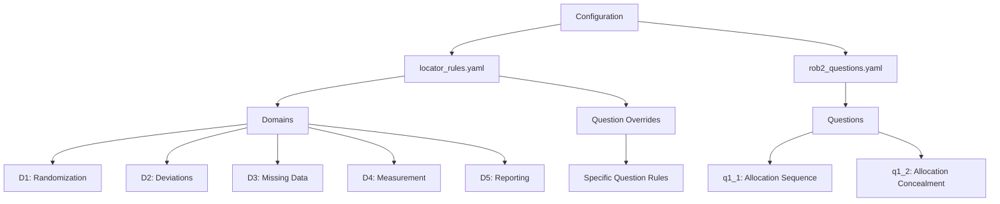

**Diagram sources**
- [locator_rules.yaml](file://src/rob2/locator_rules.yaml#L1-L161)
- [rob2_questions.yaml](file://src/rob2/rob2_questions.yaml#L1-L244)

**Section sources**
- [locator_rules.yaml](file://src/rob2/locator_rules.yaml#L1-L161)
- [rob2_questions.yaml](file://src/rob2/rob2_questions.yaml#L1-L244)

### Environment Variables

The system also supports configuration through environment variables:

- `QUERY_PLANNER_MODEL`: Default model for query planning
- `QUERY_PLANNER_MODEL_PROVIDER`: Default model provider
- `QUERY_PLANNER_TEMPERATURE`: Default temperature
- `QUERY_PLANNER_TIMEOUT`: Default timeout
- `QUERY_PLANNER_MAX_TOKENS`: Default max tokens
- `QUERY_PLANNER_MAX_RETRIES`: Default max retries
- `RERANKER_MODEL_ID`: Default reranker model
- `RERANKER_DEVICE`: Default reranker device
- `RERANKER_MAX_LENGTH`: Default reranker max length
- `RERANKER_BATCH_SIZE`: Default reranker batch size
- `RERANKER_TOP_N`: Default number of candidates to rerank
- `SPLADE_MODEL_ID`: Default SPLADE model

**Section sources**
- [shared.py](file://src/cli/commands/shared.py#L1-L76)
- [retrieval_bm25.py](file://src/pipelines/graphs/nodes/locators/retrieval_bm25.py#L1-L404)

## Query Planning

The retrieval system supports two query planning strategies: deterministic and LLM-based.

### Deterministic Query Planning

The deterministic query planner generates queries based on predefined rules and keyword extraction. It combines the question text with domain-specific keywords and section priors to create multiple search queries.

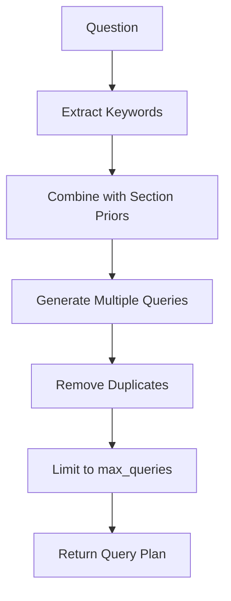

**Diagram sources**
- [planner.py](file://src/retrieval/query_planning/planner.py#L1-L93)

**Section sources**
- [planner.py](file://src/retrieval/query_planning/planner.py#L1-L93)

### LLM-Based Query Planning

The LLM-based query planner uses a language model to generate additional queries beyond the deterministic ones. This approach can produce more sophisticated and context-aware queries.

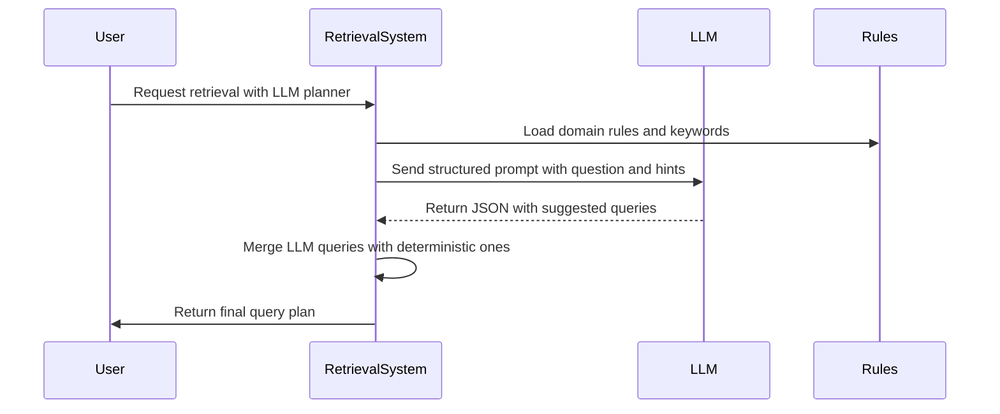

**Diagram sources**
- [llm.py](file://src/retrieval/query_planning/llm.py#L1-L302)

**Section sources**
- [llm.py](file://src/retrieval/query_planning/llm.py#L1-L302)

## Structure-Aware Retrieval

The system supports structure-aware retrieval, which uses document structure to improve retrieval quality.

### Section Prior Filtering

The structure-aware retrieval first filters the document corpus based on section title matches with predefined section priors. This reduces the search space to potentially relevant sections.

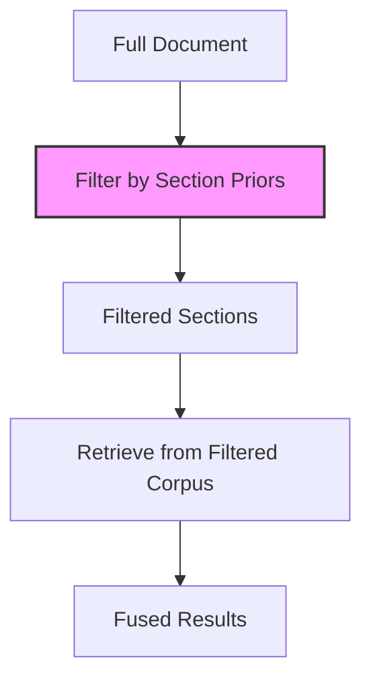

**Diagram sources**
- [retrieval_bm25.py](file://src/pipelines/graphs/nodes/locators/retrieval_bm25.py#L1-L404)
- [retrieval_splade.py](file://src/pipelines/graphs/nodes/locators/retrieval_splade.py#L1-L488)

**Section sources**
- [retrieval_bm25.py](file://src/pipelines/graphs/nodes/locators/retrieval_bm25.py#L1-L404)
- [retrieval_splade.py](file://src/pipelines/graphs/nodes/locators/retrieval_splade.py#L1-L488)

### Section Score Boosting

In addition to filtering, the system applies a section score boost to paragraphs in matching sections. This boosts the ranking of evidence from highly relevant sections.

```python
# Pseudo-code for section score boosting
composite_score = engine_score + section_score * section_bonus_weight
```

The `section_bonus_weight` parameter controls the strength of this boost (default: 0.25).

**Section sources**
- [retrieval_bm25.py](file://src/pipelines/graphs/nodes/locators/retrieval_bm25.py#L1-L404)
- [retrieval_splade.py](file://src/pipelines/graphs/nodes/locators/retrieval_splade.py#L1-L488)

## Reranking

The system supports optional reranking of retrieval results using a cross-encoder model.

### Cross-Encoder Reranker

The cross-encoder reranker uses a transformer model to re-score query-passage pairs, providing more accurate relevance scoring than lexical matching alone.

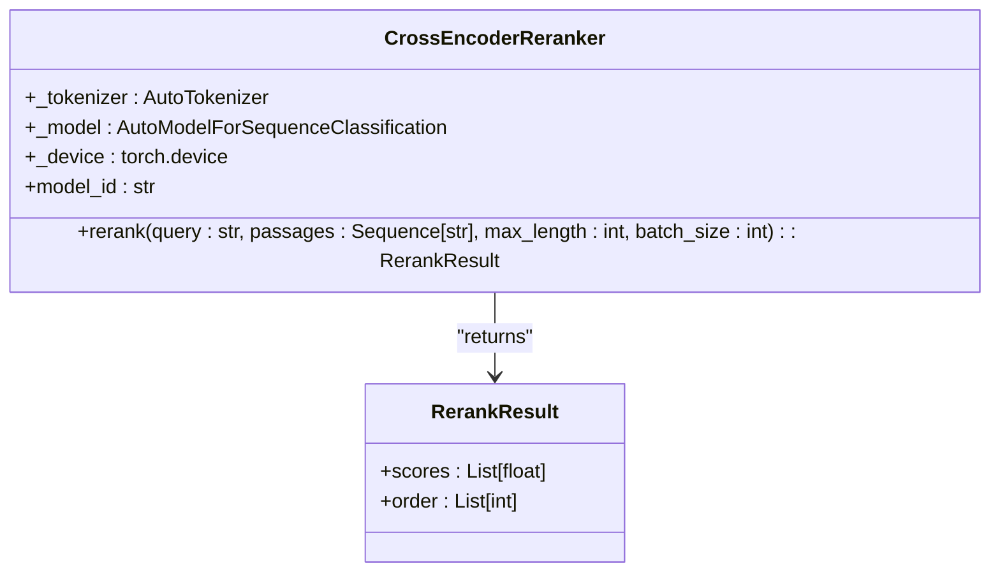

**Diagram sources**
- [cross_encoder.py](file://src/retrieval/rerankers/cross_encoder.py#L1-L125)

**Section sources**
- [cross_encoder.py](file://src/retrieval/rerankers/cross_encoder.py#L1-L125)

### Reranking Process

The reranking process occurs after initial retrieval and fusion:

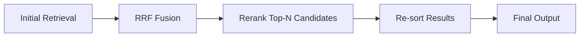

The reranker is applied only to the top-N candidates (controlled by `rerank_top_n`) to balance accuracy and performance.

**Section sources**
- [retrieval_bm25.py](file://src/pipelines/graphs/nodes/locators/retrieval_bm25.py#L1-L404)
- [retrieval_splade.py](file://src/pipelines/graphs/nodes/locators/retrieval_splade.py#L1-L488)

## Examples

### Basic BM25 Retrieval

```bash
python -m src.cli.commands.retrieval bm25 path/to/document.pdf
```

This command runs BM25 retrieval on the specified document using default parameters.

### SPLADE Retrieval with Custom Model

```bash
python -m src.cli.commands.retrieval splade path/to/document.pdf \
  --model-id naver/splade-v3 \
  --device cuda \
  --batch-size 16
```

This command runs SPLADE retrieval using the naver/splade-v3 model on GPU with a batch size of 16.

### Rule-Based Retrieval for Specific Question

```bash
python -m src.cli.commands.retrieval rule-based path/to/document.pdf \
  --question-id q1_1
```

This command runs rule-based retrieval and outputs results only for question q1_1.

### BM25 with LLM Query Planning

```bash
python -m src.cli.commands.retrieval bm25 path/to/document.pdf \
  --planner llm \
  --planner-model openai:gpt-4o-mini \
  --reranker cross_encoder \
  --reranker-model-id ncbi/MedCPT-Cross-Encoder
```

This command runs BM25 retrieval with LLM-based query planning and cross-encoder reranking.

### Structure-Aware SPLADE Retrieval

```bash
python -m src.cli.commands.retrieval splade path/to/document.pdf \
  --no-structure \
  --section-bonus-weight 0.5 \
  --top-k 10
```

This command runs SPLADE retrieval without structure filtering but with a higher section bonus weight, returning the top 10 candidates.

**Section sources**
- [retrieval.py](file://src/cli/commands/retrieval.py#L1-L202)

## Troubleshooting

### Common Issues

#### Low Recall
If retrieval is returning too few relevant results:

1. Check that the document structure is correctly parsed
2. Verify that section priors and keywords in `locator_rules.yaml` are appropriate
3. Try reducing the `per_query_top_n` parameter to retain more candidates
4. Consider using LLM-based query planning to generate more diverse queries
5. Disable structure-aware filtering with `--no-structure` to search the full document

#### Irrelevant Results
If retrieval is returning many irrelevant results:

1. Ensure that section priors are specific enough to filter out irrelevant sections
2. Increase the `section_bonus_weight` to give more weight to section matching
3. Use reranking with a cross-encoder model to improve relevance scoring
4. Review and refine the keywords in `locator_rules.yaml`
5. Consider using query planning to generate more focused queries

#### Engine-Specific Limitations

**BM25 Limitations:**
- Relies on exact term matching, may miss semantically similar terms
- Performance degrades with very long documents
- Limited ability to handle synonyms and paraphrasing

**SPLADE Limitations:**
- Requires significant computational resources
- May be slower than BM25 for large documents
- Performance depends on the quality of the pre-trained model
- Memory intensive for very large vocabularies

**Rule-Based Limitations:**
- Completely dependent on the quality of the rules
- Cannot discover evidence outside of predefined patterns
- Requires manual maintenance of rules as domains evolve

### Performance Optimization

To optimize retrieval performance:

1. **For speed**: Use BM25 instead of SPLADE, reduce `batch_size`, and disable reranking
2. **For accuracy**: Use SPLADE with reranking, enable structure-aware retrieval, and use LLM query planning
3. **For memory efficiency**: Process documents in smaller chunks, reduce `doc_max_length`, and use CPU instead of GPU
4. **For recall**: Increase `per_query_top_n`, use multiple query planning strategies, and broaden section priors

**Section sources**
- [retrieval.py](file://src/cli/commands/retrieval.py#L1-L202)
- [bm25.py](file://src/retrieval/engines/bm25.py#L1-L149)
- [splade.py](file://src/retrieval/engines/splade.py#L1-L100)
- [retrieval_bm25.py](file://src/pipelines/graphs/nodes/locators/retrieval_bm25.py#L1-L404)
- [retrieval_splade.py](file://src/pipelines/graphs/nodes/locators/retrieval_splade.py#L1-L488)
