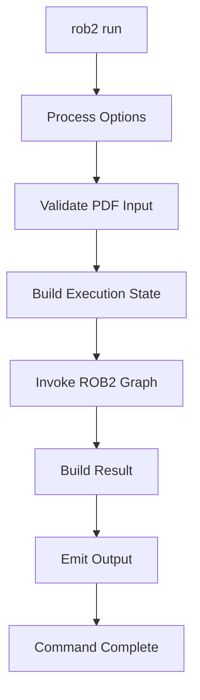
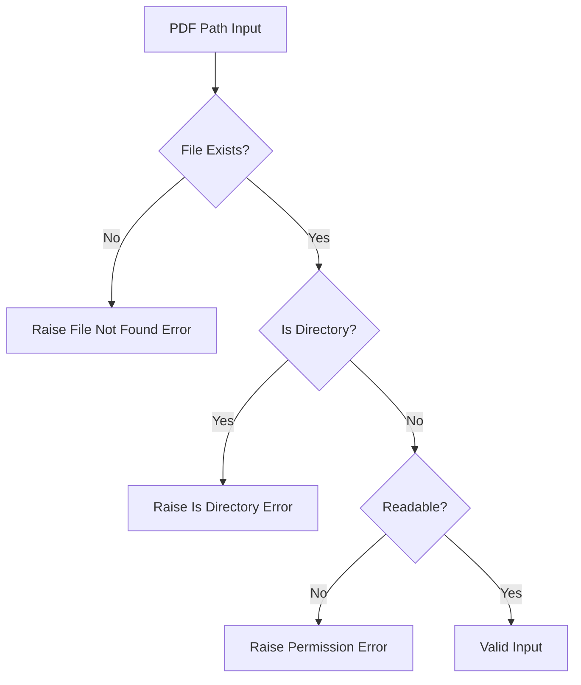
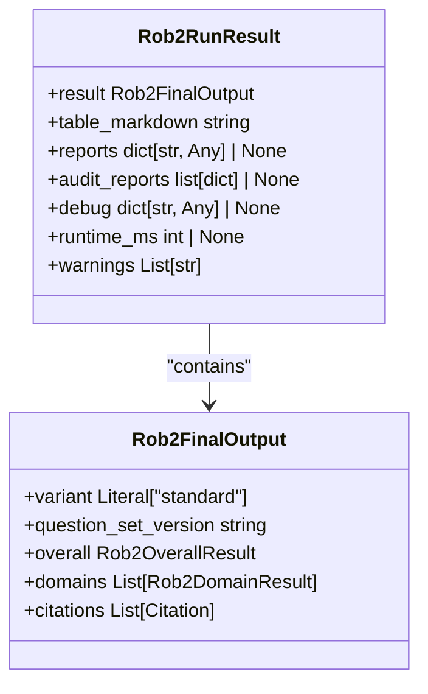
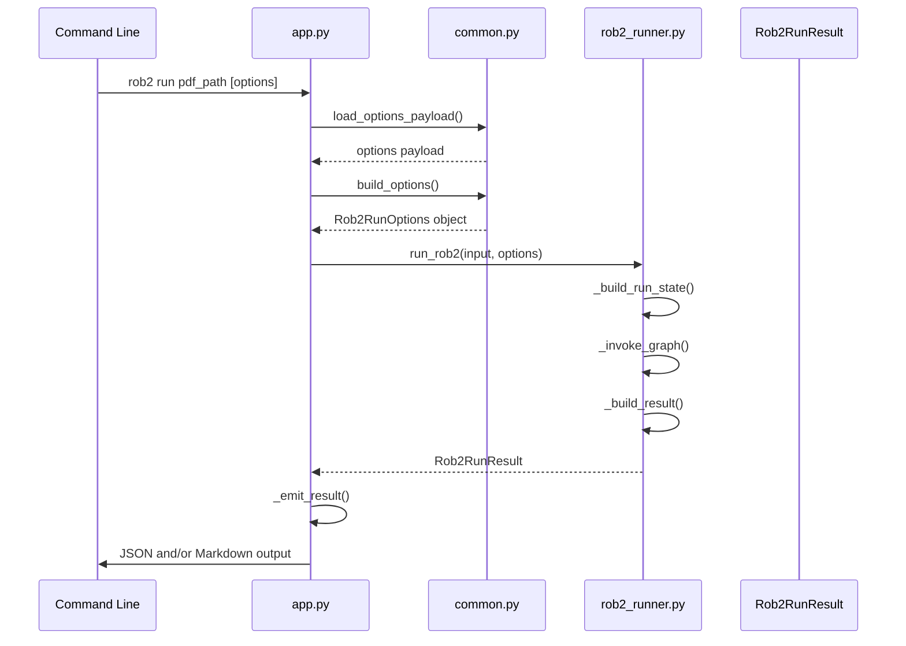

# Run Command

<cite>
**Referenced Files in This Document**   
- [app.py](file://src/cli/app.py#L71-L130)
- [rob2_runner.py](file://src/services/rob2_runner.py#L41-L65)
- [requests.py](file://src/schemas/requests.py#L10-L163)
- [responses.py](file://src/schemas/responses.py#L12-L21)
- [common.py](file://src/cli/common.py#L15-L91)
</cite>

## Table of Contents
1. [Introduction](#introduction)
2. [Command Syntax](#command-syntax)
3. [Parameter Reference](#parameter-reference)
4. [Input Requirements](#input-requirements)
5. [Output Formats](#output-formats)
6. [Configuration Options](#configuration-options)
7. [Practical Examples](#practical-examples)
8. [Integration with Core Services](#integration-with-core-services)
9. [Error Handling](#error-handling)
10. [Performance Considerations](#performance-considerations)

## Introduction
The `rob2 run` command executes the complete ROB2 assessment workflow for evaluating risk of bias in clinical studies. This command processes a PDF document through a comprehensive pipeline that includes document parsing, evidence retrieval, validation, domain reasoning, and final risk assessment. The command provides extensive configuration options to customize the assessment process and supports multiple output formats for different use cases.

**Section sources**
- [app.py](file://src/cli/app.py#L71-L130)

## Command Syntax
The basic syntax for the run command follows the pattern:
```
rob2 run <pdf_path> [OPTIONS]
```

The command requires a single positional argument `<pdf_path>` representing the path to the PDF file to be assessed. All other parameters are optional and provided as flags. Multiple configuration methods can be combined, with later specifications taking precedence over earlier ones.



**Diagram sources**
- [app.py](file://src/cli/app.py#L121-L130)
- [rob2_runner.py](file://src/services/rob2_runner.py#L41-L65)

## Parameter Reference
The run command supports several parameters for controlling the assessment workflow:

- `--options`: Accepts a JSON string containing configuration values for `Rob2RunOptions`
- `--options-file`: Specifies a JSON or YAML file path containing configuration options
- `--set`: Allows individual configuration values to be set using key=value syntax (can be repeated)
- `--debug`: Sets the debugging level (none|min|full)
- `--include-reports`: Controls whether validation reports are included in JSON output
- `--include-audit-reports`: Determines if audit reports are included in JSON output
- `--json`: Outputs results in JSON format
- `--table`: Controls output of Markdown tables (enabled by default)

**Section sources**
- [app.py](file://src/cli/app.py#L80-L120)

## Input Requirements
The command requires a valid PDF file path as input. The system performs existence and readability checks on the specified file before processing. The PDF must be accessible and readable by the application. Input validation is handled through Typer's built-in validation, ensuring that the provided path exists, is not a directory, and is readable.



**Diagram sources**
- [app.py](file://src/cli/app.py#L74-L78)

## Output Formats
The command supports two primary output formats:

- **JSON output**: Enabled with the `--json` flag, this format provides structured data that includes the complete assessment result, table markdown, reports, debug information, runtime metrics, and warnings
- **Markdown table output**: Enabled by default (can be disabled with `--no-table`), this format presents the ROB2 assessment results in a human-readable Markdown table

The JSON output follows the `Rob2RunResult` schema, which includes the final assessment result, table representation, optional reports, debug information, and performance metrics.



**Diagram sources**
- [responses.py](file://src/schemas/responses.py#L12-L21)
- [results.py](file://src/schemas/internal/results.py#L63-L81)

## Configuration Options
Configuration can be provided through multiple methods, processed in the following order of precedence:

1. `--options` JSON string
2. `--options-file` JSON/YAML file
3. `--set` key=value pairs
4. `--debug`, `--include-reports`, and `--include-audit-reports` direct flags

The configuration options are defined in the `Rob2RunOptions` Pydantic model, which includes settings for preprocessing, retrieval, validation, domain reasoning, and output controls. Default values are resolved from environment variables and internal constants when not explicitly specified.

**Section sources**
- [common.py](file://src/cli/common.py#L15-L91)
- [requests.py](file://src/schemas/requests.py#L24-L163)

## Practical Examples
Basic execution with default settings:
```bash
rob2 run ./path/to/study.pdf
```

Using a configuration file with JSON output:
```bash
rob2 run ./path/to/study.pdf --options-file config.json --json
```

Overriding specific options with debug output:
```bash
rob2 run ./path/to/study.pdf --set top_k=10 --set relevance_mode=llm --debug full --json
```

Combining configuration file with overrides:
```bash
rob2 run ./path/to/study.pdf --options-file base-config.yaml --set d2_effect_type=adherence --include-reports
```

**Section sources**
- [app.py](file://src/cli/app.py#L121-L130)
- [common.py](file://src/cli/common.py#L15-L91)

## Integration with Core Services
The run command integrates with the `run_rob2` service function through the following workflow:

1. Parse and validate command-line arguments
2. Load and merge configuration from various sources
3. Build `Rob2RunOptions` object from the merged configuration
4. Create `Rob2Input` object with the PDF path
5. Call `run_rob2` service function with input and options
6. Format and emit the result based on output preferences

The `run_rob2` function serves as the entry point to the core assessment workflow, orchestrating the execution of the ROB2 graph and returning a typed result.



**Diagram sources**
- [app.py](file://src/cli/app.py#L121-L130)
- [rob2_runner.py](file://src/services/rob2_runner.py#L41-L65)

## Error Handling
The command implements comprehensive error handling for various failure scenarios:

- **Invalid PDF input**: Files that don't exist, aren't readable, or are directories trigger appropriate validation errors
- **Configuration errors**: Invalid JSON in `--options` or `--options-file` parameters raise parsing errors
- **Processing failures**: Errors during the assessment workflow are captured and reported in the result's warnings field
- **Schema validation**: Input and configuration data are validated against Pydantic models, ensuring type safety and data integrity

Error messages are designed to be informative and actionable, helping users diagnose and resolve issues with their inputs or configurations.

**Section sources**
- [app.py](file://src/cli/app.py#L121-L130)
- [common.py](file://src/cli/common.py#L54-L78)
- [rob2_runner.py](file://src/services/rob2_runner.py#L41-L65)

## Performance Considerations
The assessment of large PDFs may require significant memory and processing time. The workflow involves multiple stages that can be resource-intensive:

- Document parsing and layout analysis
- Text chunking and embedding
- Multiple retrieval and validation operations
- Domain reasoning with language models

Performance can be optimized by adjusting configuration parameters such as `top_k`, `per_query_top_n`, and `rerank_top_n` to balance thoroughness with efficiency. The `debug` parameter can help identify performance bottlenecks by providing detailed execution information.

**Section sources**
- [rob2_runner.py](file://src/services/rob2_runner.py#L51-L64)
- [requests.py](file://src/schemas/requests.py#L34-L36)