# Validate Command

<cite>
**Referenced Files in This Document**   
- [validate.py](file://src/cli/commands/validate.py)
- [relevance.py](file://src/evidence/validators/relevance.py)
- [consistency.py](file://src/evidence/validators/consistency.py)
- [existence.py](file://src/evidence/validators/existence.py)
- [completeness.py](file://src/evidence/validators/completeness.py)
- [shared.py](file://src/cli/commands/shared.py)
- [evidence.py](file://src/schemas/internal/evidence.py)
- [question_bank.py](file://src/rob2/question_bank.py)
- [rob2_questions.yaml](file://src/rob2/rob2_questions.yaml)
</cite>

## Table of Contents
1. [Introduction](#introduction)
2. [Project Structure](#project-structure)
3. [Core Components](#core-components)
4. [Architecture Overview](#architecture-overview)
5. [Detailed Component Analysis](#detailed-component-analysis)
6. [Dependency Analysis](#dependency-analysis)
7. [Performance Considerations](#performance-considerations)
8. [Troubleshooting Guide](#troubleshooting-guide)
9. [Conclusion](#conclusion)

## Introduction
The 'validate' command provides a comprehensive testing framework for evidence validation components in the ROB2 (Risk of Bias 2) assessment system. This command enables users to test and debug various validation aspects including existence, relevance, consistency, and completeness of evidence. The validation system is designed to ensure that evidence used in ROB2 assessments is properly grounded in the source document, relevant to the research question, consistent across multiple sources, and complete in addressing all required signaling questions.

## Project Structure
The validation functionality is organized within the CLI commands and evidence validators modules. The command-line interface is implemented in the `src/cli/commands/validate.py` file, while the core validation logic resides in the `src/evidence/validators/` directory. The project follows a modular structure with clear separation between command-line interface, validation logic, and data schemas.

```mermaid
graph TD
src[Source Directory]
cli[CLI Commands]
validators[Evidence Validators]
schemas[Data Schemas]
src --> cli
src --> validators
src --> schemas
cli --> validate[validate.py]
validators --> relevance[relevance.py]
validators --> consistency[consistency.py]
validators --> existence[existence.py]
validators --> completeness[completeness.py]
schemas --> evidence[evidence.py]
validate --> validators
validate --> shared[shared.py]
validators --> evidence
```

**Diagram sources**
- [validate.py](file://src/cli/commands/validate.py)
- [relevance.py](file://src/evidence/validators/relevance.py)
- [consistency.py](file://src/evidence/validators/consistency.py)
- [existence.py](file://src/evidence/validators/existence.py)
- [completeness.py](file://src/evidence/validators/completeness.py)
- [evidence.py](file://src/schemas/internal/evidence.py)

**Section sources**
- [validate.py](file://src/cli/commands/validate.py)
- [relevance.py](file://src/evidence/validators/relevance.py)
- [consistency.py](file://src/evidence/validators/consistency.py)
- [existence.py](file://src/evidence/validators/existence.py)
- [completeness.py](file://src/evidence/validators/completeness.py)

## Core Components
The validation system consists of four main validator components: relevance, consistency, existence, and completeness. Each validator performs a specific type of validation on evidence candidates. The system also includes a full validation command that runs all validators in sequence. The validators work with fused evidence candidates that have been processed through retrieval and fusion stages.

**Section sources**
- [validate.py](file://src/cli/commands/validate.py#L103-L445)
- [relevance.py](file://src/evidence/validators/relevance.py#L58-L93)
- [consistency.py](file://src/evidence/validators/consistency.py#L69-L100)
- [existence.py](file://src/evidence/validators/existence.py#L26-L42)
- [completeness.py](file://src/evidence/validators/completeness.py#L19-L58)

## Architecture Overview
The validation architecture follows a pipeline pattern where evidence candidates are processed through multiple validation stages. The system starts with document parsing and question loading, followed by evidence retrieval and fusion, and finally validation through the four validator components. Each validator adds its assessment to the evidence candidate, building a comprehensive validation profile.

**Diagram sources**
- [validate.py](file://src/cli/commands/validate.py#L95-L100)
- [shared.py](file://src/cli/commands/shared.py#L23-L31)

## Detailed Component Analysis

### Relevance Validator
The relevance validator assesses whether a candidate paragraph contains direct evidence to answer a ROB2 signaling question. It uses an LLM-based approach to determine relevance, with options for confidence thresholds and quote requirements.

**Diagram sources**
- [relevance.py](file://src/evidence/validators/relevance.py#L39-L53)
- [relevance.py](file://src/evidence/validators/relevance.py#L58-L93)

**Section sources**
- [relevance.py](file://src/evidence/validators/relevance.py#L1-L232)

### Consistency Validator
The consistency validator checks for contradictions between multiple candidate paragraphs for the same question. It identifies conflicting pairs of paragraphs and provides reasons for the conflicts.

**Diagram sources**
- [consistency.py](file://src/evidence/validators/consistency.py#L50-L64)
- [consistency.py](file://src/evidence/validators/consistency.py#L69-L100)

**Section sources**
- [consistency.py](file://src/evidence/validators/consistency.py#L1-L266)

### Existence Validator
The existence validator ensures that candidate paragraph references are grounded in the parsed document structure. It verifies that paragraph IDs exist and that text matches the source span.

**Diagram sources**
- [existence.py](file://src/evidence/validators/existence.py#L20-L24)
- [existence.py](file://src/evidence/validators/existence.py#L26-L42)

**Section sources**
- [existence.py](file://src/evidence/validators/existence.py#L1-L106)

### Completeness Validator
The completeness validator checks whether all required questions have been addressed with validated evidence. It computes completeness items and pass/fail status based on required questions.

**Diagram sources**
- [completeness.py](file://src/evidence/validators/completeness.py#L12-L17)
- [completeness.py](file://src/evidence/validators/completeness.py#L19-L58)

**Section sources**
- [completeness.py](file://src/evidence/validators/completeness.py#L1-L63)

## Dependency Analysis
The validation system has dependencies on several components including document parsing, question loading, and evidence fusion. The validators depend on the evidence candidates produced by the fusion process and the document structure from parsing.

**Diagram sources**
- [validate.py](file://src/cli/commands/validate.py#L9-L18)
- [shared.py](file://src/cli/commands/shared.py#L11-L14)

**Section sources**
- [validate.py](file://src/cli/commands/validate.py)
- [shared.py](file://src/cli/commands/shared.py)

## Performance Considerations
The validation system can be resource-intensive when processing large evidence sets. The LLM-based validators (relevance and consistency) are particularly computationally expensive. For batch validation tests, consider using the 'none' mode for LLM validators to reduce processing time. The system supports configuration of top-k results and per-query top-n candidates to control memory usage.

**Section sources**
- [validate.py](file://src/cli/commands/validate.py#L112-L137)
- [relevance.py](file://src/evidence/validators/relevance.py#L39-L47)
- [consistency.py](file://src/evidence/validators/consistency.py#L51-L58)

## Troubleshooting Guide
When validations fail, check the validation output for specific failure reasons. For existence validation failures, verify that paragraph IDs exist in the document and that text matches the source. For relevance validation failures, ensure that the supporting quote is an exact substring of the paragraph text. For consistency validation failures, review the conflicting paragraphs and their quotes. For completeness validation failures, confirm that all required questions have been addressed.

**Section sources**
- [existence.py](file://src/evidence/validators/existence.py#L50-L99)
- [relevance.py](file://src/evidence/validators/relevance.py#L192-L217)
- [consistency.py](file://src/evidence/validators/consistency.py#L240-L248)
- [completeness.py](file://src/evidence/validators/completeness.py#L51-L53)

## Conclusion
The 'validate' command provides a comprehensive framework for testing evidence validation components in the ROB2 assessment system. By combining multiple validation types (relevance, consistency, existence, and completeness), the system ensures high-quality evidence assessment. The modular design allows for flexible configuration and integration with the broader evidence processing pipeline.