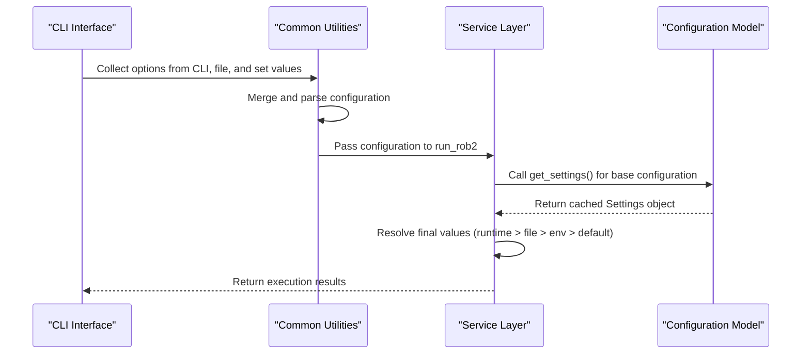
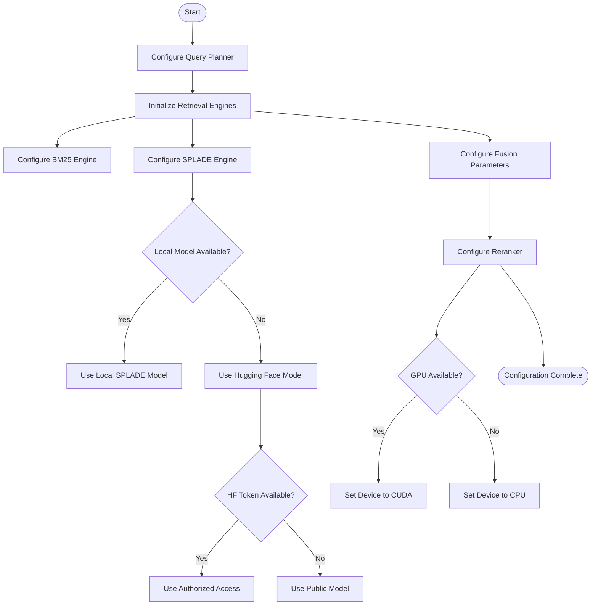
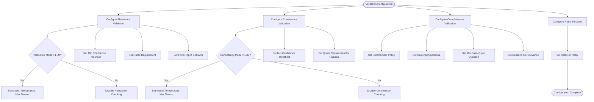

# Configuration Guide

<cite>
**Referenced Files in This Document**   
- [src/core/config.py](file://src/core/config.py)
- [.env.example](file://.env.example)
- [src/cli/commands/config.py](file://src/cli/commands/config.py)
- [src/schemas/requests.py](file://src/schemas/requests.py)
- [src/services/rob2_runner.py](file://src/services/rob2_runner.py)
- [src/pipelines/graphs/nodes/preprocess.py](file://src/pipelines/graphs/nodes/preprocess.py)
- [src/cli/app.py](file://src/cli/app.py)
- [docs/adr/0003-validation-mode-and-completeness-relaxation.md](file://docs/adr/0003-validation-mode-and-completeness-relaxation.md)
</cite>

## Table of Contents
1. [Introduction](#introduction)
2. [Configuration Model Overview](#configuration-model-overview)
3. [Configuration Hierarchy and Precedence](#configuration-hierarchy-and-precedence)
4. [Preprocessing Configuration](#preprocessing-configuration)
5. [Retrieval and Fusion Settings](#retrieval-and-fusion-settings)
6. [Validation Thresholds](#validation-thresholds)
7. [Domain Reasoning Configurations](#domain-reasoning-configurations)
8. [Domain Audit Settings](#domain-audit-settings)
9. [Output Controls](#output-controls)
10. [Configuration Management Best Practices](#configuration-management-best-practices)
11. [Common Configuration Issues and Debugging](#common-configuration-issues-and-debugging)
12. [Example Configuration Files](#example-configuration-files)

## Introduction
The application's configuration system is built on Pydantic's settings management with environment variable integration. This guide provides comprehensive documentation on all configurable parameters, their relationships, and how they flow through the system from CLI to service layer. The configuration system supports multiple layers of override, allowing for flexible deployment across different environments while maintaining sensible defaults.

**Section sources**
- [src/core/config.py](file://src/core/config.py#L1-L200)
- [.env.example](file://.env.example#L1-L112)

## Configuration Model Overview
The configuration system is centered around the `Settings` class in `src/core/config.py`, which inherits from Pydantic's `BaseSettings`. This class defines all configurable parameters with appropriate types, defaults, and validation rules. The configuration model is designed to be extensible and type-safe, with environment variable binding through the `validation_alias` parameter.

The `Settings` class uses `SettingsConfigDict` to specify that configuration should be loaded from a `.env` file with UTF-8 encoding. The `extra="ignore"` setting ensures that undefined environment variables are ignored rather than causing validation errors. A cached `get_settings()` function ensures that configuration is loaded only once during application runtime, improving performance and consistency.

Configuration parameters are organized into logical groups including preprocessing, retrieval, validation, domain reasoning, and output controls. Each parameter has a corresponding environment variable name specified in uppercase, following the convention of using `DOCLING_`, `QUERY_`, `RERANKER_`, `SPLADE_`, `RELEVANCE_`, `CONSISTENCY_`, `D1_`, `D2_`, `D3_`, `D4_`, `D5_`, and `DOMAIN_AUDIT_` prefixes for their respective domains.

```mermaid
classDiagram
class Settings {
+str docling_layout_model
+str docling_artifacts_path
+str docling_chunker_model
+int docling_chunker_max_tokens
+str query_planner_model
+str query_planner_model_provider
+float query_planner_temperature
+float query_planner_timeout
+int query_planner_max_tokens
+int query_planner_max_retries
+str reranker_model_id
+str reranker_device
+int reranker_max_length
+int reranker_batch_size
+int reranker_top_n
+str splade_model_id
+str splade_device
+str splade_hf_token
+int splade_query_max_length
+int splade_doc_max_length
+int splade_batch_size
+str relevance_model
+str relevance_model_provider
+float relevance_temperature
+float relevance_timeout
+int relevance_max_tokens
+int relevance_max_retries
+str consistency_model
+str consistency_model_provider
+float consistency_temperature
+float consistency_timeout
+int consistency_max_tokens
+int consistency_max_retries
+str d1_model
+str d1_model_provider
+float d1_temperature
+float d1_timeout
+int d1_max_tokens
+int d1_max_retries
+str d2_model
+str d2_model_provider
+float d2_temperature
+float d2_timeout
+int d2_max_tokens
+int d2_max_retries
+str d3_model
+str d3_model_provider
+float d3_temperature
+float d3_timeout
+int d3_max_tokens
+int d3_max_retries
+str d4_model
+str d4_model_provider
+float d4_temperature
+float d4_timeout
+int d4_max_tokens
+int d4_max_retries
+str d5_model
+str d5_model_provider
+float d5_temperature
+float d5_timeout
+int d5_max_tokens
+int d5_max_retries
+str domain_audit_mode
+str domain_audit_model
+str domain_audit_model_provider
+float domain_audit_temperature
+float domain_audit_timeout
+int domain_audit_max_tokens
+int domain_audit_max_retries
+int domain_audit_patch_window
+int domain_audit_max_patches_per_question
+bool domain_audit_rerun_domains
+bool domain_audit_final
}
class SettingsConfigDict {
+str env_file
+str env_file_encoding
+str extra
}
Settings --> SettingsConfigDict : "has"
```



**Diagram sources**
- [src/core/config.py](file://src/core/config.py#L11-L190)

**Section sources**
- [src/core/config.py](file://src/core/config.py#L1-L200)

## Configuration Hierarchy and Precedence
The configuration system follows a hierarchical precedence model where more specific configuration sources override more general ones. The precedence order from highest to lowest is: CLI/API runtime overrides, configuration files, environment variables, and finally default values defined in the code.

Runtime overrides can be specified through the CLI using the `--set` option with key=value syntax, or through API calls with JSON payloads. These overrides have the highest precedence and are applied last in the configuration resolution process. Configuration files in JSON or YAML format can be loaded using the `--options-file` parameter and contain multiple settings in a structured format.

Environment variables defined in the `.env` file or system environment provide a way to set configuration for all runs in a specific environment. These are loaded by the Pydantic settings system and serve as the baseline configuration. Default values are defined in the `Settings` class and are used when no other configuration is provided.

The configuration flow begins at the CLI layer in `src/cli/app.py`, where command-line arguments are collected and merged with configuration file content. This merged configuration is then passed to the `build_options` function in `src/cli/common.py`, which validates the configuration against the `Rob2RunOptions` schema. Finally, in the service layer (`src/services/rob2_runner.py`), the runtime configuration is merged with the base settings using resolution functions like `_resolve_str`, `_resolve_int`, and `_resolve_bool`.



**Diagram sources**
- [src/cli/app.py](file://src/cli/app.py#L70-L130)
- [src/cli/common.py](file://src/cli/common.py#L14-L38)
- [src/services/rob2_runner.py](file://src/services/rob2_runner.py#L80-L269)

**Section sources**
- [src/cli/app.py](file://src/cli/app.py#L70-L130)
- [src/cli/common.py](file://src/cli/common.py#L14-L91)
- [src/services/rob2_runner.py](file://src/services/rob2_runner.py#L80-L269)

## Preprocessing Configuration
Preprocessing configuration controls the document parsing and chunking process through the Docling library. These settings determine how PDF documents are converted into structured text that can be used for retrieval and analysis.

The `docling_layout_model` parameter specifies which layout detection model to use when parsing PDFs. This can be set to a specific model identifier or left as None to use the default. The `docling_artifacts_path` setting defines where temporary artifacts from the parsing process should be stored, which can be useful for debugging or when processing large numbers of documents.

For text chunking, the `docling_chunker_model` parameter determines which tokenizer model is used to split text into manageable chunks. The application defaults to "sentence-transformers/all-MiniLM-L6-v2" if no model is specified. The `docling_chunker_max_tokens` setting controls the maximum number of tokens in each chunk, which affects both the granularity of retrieval and the context available for analysis.

These preprocessing settings are first accessed in the `parse_docling_pdf` function in `src/pipelines/graphs/nodes/preprocess.py`, where they are used to configure the DocumentConverter and HybridChunker instances. The settings can be overridden at runtime through the state object, allowing different preprocessing configurations for different documents within the same application session.

**Section sources**
- [src/core/config.py](file://src/core/config.py#L14-L25)
- [src/pipelines/graphs/nodes/preprocess.py](file://src/pipelines/graphs/nodes/preprocess.py#L114-L205)

## Retrieval and Fusion Settings
Retrieval and fusion settings control how evidence is retrieved from documents and combined from multiple sources. These parameters are critical for determining the quality and comprehensiveness of the evidence gathered for analysis.

The query planning system is configured with parameters like `query_planner_model`, `query_planner_temperature`, and `query_planner_max_retries`, which control the LLM used to generate search queries when the query planner is set to "llm" mode. The `query_planner_max_keywords` parameter limits the number of keywords generated, preventing overly broad searches.

For SPLADE retrieval, the `splade_model_id` parameter specifies the model to use for sparse vector search. This can point to a local model path or a Hugging Face model identifier. The `splade_hf_token` is required when accessing gated models on Hugging Face. Performance parameters like `splade_query_max_length`, `splade_doc_max_length`, and `splade_batch_size` control resource usage and search quality.

The reranking system is configured with `reranker_model_id`, `reranker_device`, and performance parameters like `reranker_max_length` and `reranker_batch_size`. The `rerank_top_n` parameter determines how many results are preserved after reranking. Fusion parameters like `fusion_top_k` and `fusion_rrf_k` control how results from multiple retrieval engines are combined using Reciprocal Rank Fusion.



**Diagram sources**
- [src/core/config.py](file://src/core/config.py#L27-L72)
- [.env.example](file://.env.example#L21-L35)
- [src/services/rob2_runner.py](file://src/services/rob2_runner.py#L114-L186)

**Section sources**
- [src/core/config.py](file://src/core/config.py#L27-L72)
- [.env.example](file://.env.example#L13-L35)
- [src/services/rob2_runner.py](file://src/services/rob2_runner.py#L114-L186)

## Validation Thresholds
Validation thresholds control the evidence validation process, determining how strictly evidence is evaluated for relevance, consistency, and completeness. These settings are crucial for ensuring the quality and reliability of the analysis results.

Relevance validation is controlled by the `relevance_mode` parameter, which can be set to "none" to disable LLM-based relevance checking or "llm" to enable it. When enabled, the `relevance_model` parameter specifies which LLM to use, while `relevance_temperature` controls the creativity of the relevance assessment. The `relevance_min_confidence` threshold determines the minimum confidence score for evidence to be considered relevant.

Consistency validation follows a similar pattern with `consistency_mode`, `consistency_model`, and `consistency_temperature` parameters. The `consistency_min_confidence` threshold works in conjunction with `consistency_require_quotes_for_fail` to determine when inconsistent evidence should cause a validation failure.

Completeness validation is configured with `completeness_enforce`, which determines whether completeness checking is mandatory, and `completeness_required_questions`, which specifies which questions must be answered. The `completeness_min_passed_per_question` parameter sets the minimum number of valid evidence pieces required per question.

A key feature documented in ADR-0003 is the `validation_relax_on_retry` parameter, which when enabled, automatically relaxes validation thresholds during retry attempts by lowering confidence requirements and disabling strict quote matching.



**Diagram sources**
- [src/core/config.py](file://src/core/config.py#L73-L153)
- [docs/adr/0003-validation-mode-and-completeness-relaxation.md](file://docs/adr/0003-validation-mode-and-completeness-relaxation.md#L1-L20)
- [src/services/rob2_runner.py](file://src/services/rob2_runner.py#L190-L240)

**Section sources**
- [src/core/config.py](file://src/core/config.py#L73-L153)
- [src/schemas/requests.py](file://src/schemas/requests.py#L67-L104)
- [docs/adr/0003-validation-mode-and-completeness-relaxation.md](file://docs/adr/0003-validation-mode-and-completeness-relaxation.md#L1-L20)

## Domain Reasoning Configurations
Domain reasoning configurations control the LLM-based analysis for each of the five ROB2 domains (D1-D5). Each domain has its own set of model parameters, allowing different models or configurations to be used for different types of bias assessment.

Each domain (D1-D5) has corresponding parameters for the model (`d1_model`, `d2_model`, etc.), model provider, temperature, timeout, maximum tokens, and maximum retries. The temperature parameter controls the randomness of the model's output, with lower values producing more deterministic results suitable for analytical tasks. The timeout parameter prevents hanging requests, while maximum retries ensures resilience against transient failures.

The `d2_effect_type` parameter is a special configuration that determines whether D2 reasoning focuses on "assignment" or "adherence" aspects of allocation concealment. This allows the same domain reasoning engine to be adapted to different study designs.

The `domain_evidence_top_k` parameter controls how many evidence pieces are provided to the domain reasoning models, balancing comprehensiveness with context window limitations. This is particularly important for domains that require synthesizing information from multiple evidence pieces.

These configurations are used in the domain-specific nodes in `src/pipelines/graphs/nodes/domains/` where they are passed to the LLM invocation functions. The configuration ensures that each domain can be independently tuned for optimal performance based on the specific requirements of that bias assessment.

**Section sources**
- [src/core/config.py](file://src/core/config.py#L109-L153)
- [src/schemas/requests.py](file://src/schemas/requests.py#L106-L143)
- [src/services/rob2_runner.py](file://src/services/rob2_runner.py#L247-L269)

## Domain Audit Settings
Domain audit settings control the optional full-text audit process that can patch missing evidence and re-run domain analyses. This feature provides a safety net to catch evidence that might have been missed by the initial retrieval process.

The `domain_audit_mode` parameter controls whether auditing is enabled, with options for "none" (disabled) or "llm" (enabled). When enabled, the `domain_audit_model` parameter specifies which LLM to use for the audit process, with corresponding configuration for provider, temperature, timeout, and maximum tokens.

The `domain_audit_patch_window` parameter determines how many surrounding paragraphs are included when patching evidence, ensuring context is preserved. The `domain_audit_max_patches_per_question` limit prevents excessive evidence patching that could overwhelm the analysis process.

Two important boolean flags control the audit workflow: `domain_audit_rerun_domains` determines whether domains should be re-analyzed after evidence patching, and `domain_audit_final` enables a final audit after all domains have been processed. These flags allow for different audit strategies depending on the required thoroughness and available computational resources.

The audit process is designed to be resource-intensive, so these settings provide levers to balance thoroughness with performance. The default configuration disables auditing to ensure reasonable performance for routine analyses, with the option to enable it for high-stakes evaluations.

**Section sources**
- [src/core/config.py](file://src/core/config.py#L154-L184)
- [src/schemas/requests.py](file://src/schemas/requests.py#L145-L156)
- [src/services/rob2_runner.py](file://src/services/rob2_runner.py#L271-L289)

## Output Controls
Output controls determine what information is included in the results and how detailed the output is. These settings allow users to balance between comprehensive debugging information and clean, focused results.

The `debug_level` parameter is a key output control with three options: "none" (minimal output), "min" (essential debugging information), and "full" (complete state information). This setting controls the amount of internal state that is included in the output, which can be crucial for troubleshooting but may be excessive for production use.

The `include_reports` and `include_audit_reports` boolean flags control whether detailed validation and audit reports are included in the JSON output. These reports contain detailed information about why evidence was accepted or rejected, which can be valuable for understanding the analysis process but increases output size.

These output controls are processed in the `_build_debug_payload` and `_collect_reports` functions in `src/services/rob2_runner.py`, where they determine which portions of the internal state are included in the final result. The CLI interface in `src/cli/app.py` provides direct options for these settings, allowing them to be easily adjusted without modifying configuration files.

The output controls follow the general precedence rules, allowing them to be set at any level from environment variables to runtime overrides. This flexibility enables different output verbosity for different use cases, such as detailed output for development and minimal output for automated pipelines.

**Section sources**
- [src/core/config.py](file://src/core/config.py#L154-L184)
- [src/schemas/requests.py](file://src/schemas/requests.py#L158-L161)
- [src/services/rob2_runner.py](file://src/services/rob2_runner.py#L371-L388)
- [src/cli/app.py](file://src/cli/app.py#L95-L108)

## Configuration Management Best Practices
Effective configuration management is essential for maintaining reliable and reproducible analyses. This section outlines best practices for managing configuration in different environments and use cases.

For sensitive credentials like API keys, use environment variables rather than hardcoding them in configuration files. The `.env.example` file provides a template with placeholder values, while the actual `.env` file containing real credentials should be excluded from version control via `.gitignore`.

Organize configuration by environment, using different `.env` files for development, testing, and production. This allows appropriate resource allocation and security settings for each environment. For example, development environments might use smaller models or local instances to reduce costs.

Use configuration files for complex settings that are shared across multiple runs, while reserving CLI overrides for one-off adjustments. The `rob2.options.yaml` example generated by the `config example` command provides a starting point for creating custom configuration files.

Leverage the configuration precedence system to create flexible deployment patterns. Set baseline configuration in environment variables, apply project-specific settings in configuration files, and use runtime overrides for experiment variations. This approach enables consistent baselines while allowing targeted experimentation.

Regularly review and update configuration settings as models and requirements evolve. The `config diff` command is particularly useful for identifying which settings deviate from defaults, helping to maintain configuration hygiene and understand the impact of changes.

**Section sources**
- [.env.example](file://.env.example#L1-L10)
- [src/cli/commands/config.py](file://src/cli/commands/config.py#L89-L102)
- [src/cli/commands/config.py](file://src/cli/commands/config.py#L54-L64)

## Common Configuration Issues and Debugging
Several common configuration issues can arise when setting up and running the application. Understanding these issues and their solutions can significantly reduce troubleshooting time.

One common issue is missing or incorrect API keys for LLM providers. When `OPENAI_API_KEY` or `ANTHROPIC_API_KEY` are not properly set, LLM-based components will fail. Use the `config show` command to verify that sensitive environment variables are being loaded correctly (they will appear in the output unless specifically filtered).

Another frequent problem is model availability, particularly for SPLADE retrieval. If `SPLADE_MODEL_ID` points to a gated Hugging Face model without a valid `SPLADE_HF_TOKEN`, the application will fail to load the model. The system attempts to fall back to a local model path or default model, but this can be avoided by ensuring proper configuration.

Validation failures due to overly strict thresholds are common when adapting the system to new document types. The `validation_relax_on_retry` feature can help mitigate this by automatically relaxing thresholds on retry, but it's better to adjust the initial thresholds (`relevance_min_confidence`, `consistency_min_confidence`) based on observed performance.

Configuration precedence confusion can lead to settings not being applied as expected. Use the `config diff` command to see which settings differ from defaults, helping to identify where configuration is being overridden. Remember that CLI parameters take precedence over configuration files, which in turn take precedence over environment variables.

For debugging, start with the `config show` command to see the effective configuration, then use `--debug min` or `--debug full` to get increasingly detailed output about the processing pipeline. The validation reports included when `include_reports` is true can provide specific insights into why evidence was accepted or rejected.

**Section sources**
- [.env.example](file://.env.example#L1-L10)
- [src/cli/commands/config.py](file://src/cli/commands/config.py#L25-L53)
- [src/cli/commands/config.py](file://src/cli/commands/config.py#L54-L64)
- [src/services/rob2_runner.py](file://src/services/rob2_runner.py#L371-L388)

## Example Configuration Files
The configuration system supports multiple formats for configuration files, including JSON and YAML. The `config example` command generates a YAML template that can be customized for specific use cases.

For high-precision analysis, a configuration might emphasize thorough retrieval and strict validation:

```yaml
# High-precision configuration
query_planner: llm
query_planner_model: openai:gpt-4o
reranker: cross_encoder
reranker_model_id: ncbi/MedCPT-Cross-Encoder
relevance_mode: llm
relevance_min_confidence: 0.8
consistency_mode: llm
consistency_min_confidence: 0.8
validation_relax_on_retry: false
debug_level: min
include_reports: true
```

For rapid prototyping or development, a lighter configuration might be appropriate:

```yaml
# Development configuration
query_planner: deterministic
reranker: none
relevance_mode: none
consistency_mode: none
domain_audit_mode: none
debug_level: full
include_reports: true
```

For production deployment with cost considerations, a balanced configuration could be used:

```yaml
# Production configuration
query_planner: deterministic
reranker: cross_encoder
reranker_model_id: ncbi/MedCPT-Cross-Encoder
relevance_mode: llm
relevance_model: openai:gpt-4o-mini
consistency_mode: llm
consistency_model: openai:gpt-4o-mini
domain_audit_mode: none
debug_level: none
include_reports: false
```

These example configurations can be saved as YAML files and loaded using the `--options-file` parameter, providing a convenient way to switch between different operational modes.

**Section sources**
- [src/cli/commands/config.py](file://src/cli/commands/config.py#L89-L102)
- [src/cli/commands/config.py](file://src/cli/commands/config.py#L307-L351)