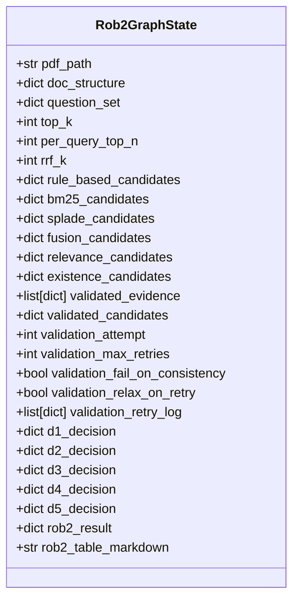
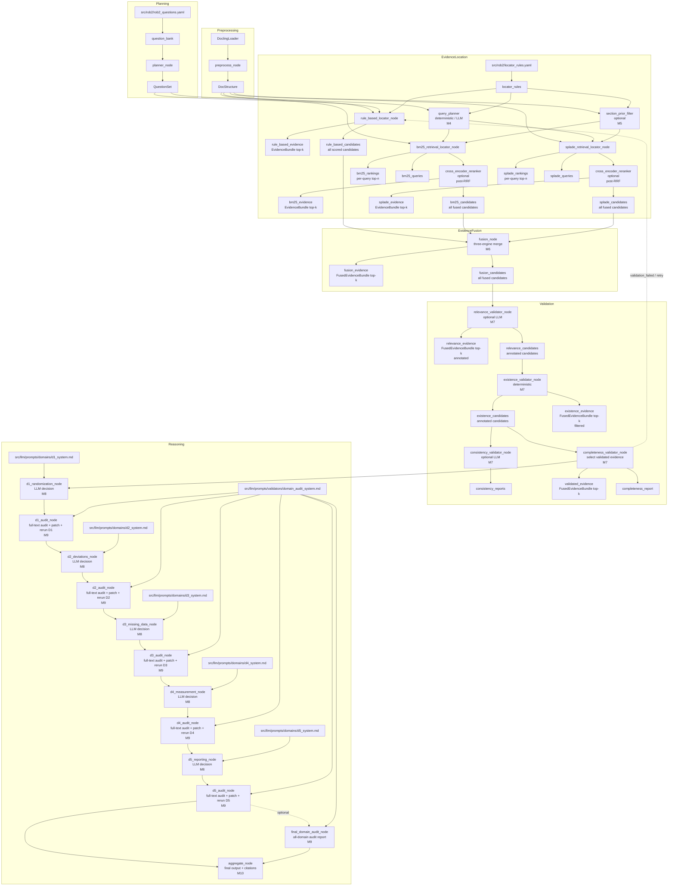
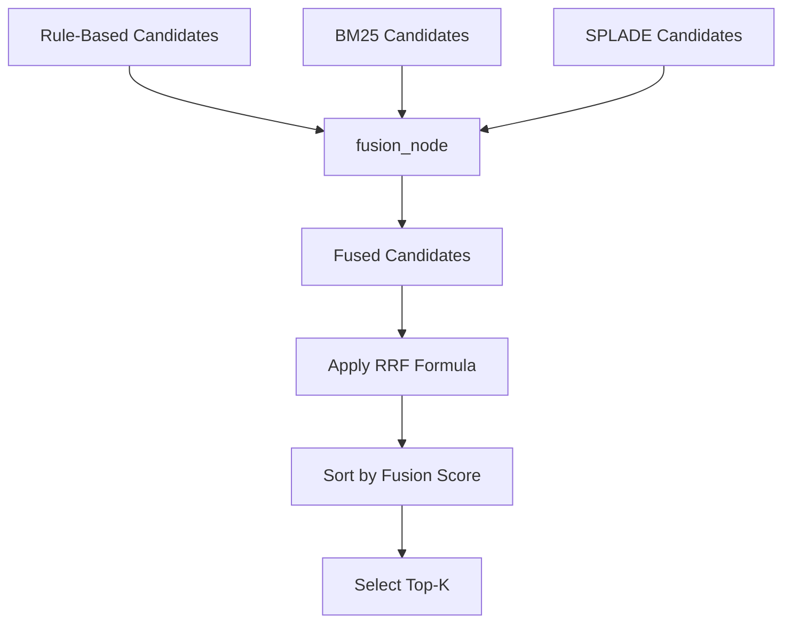
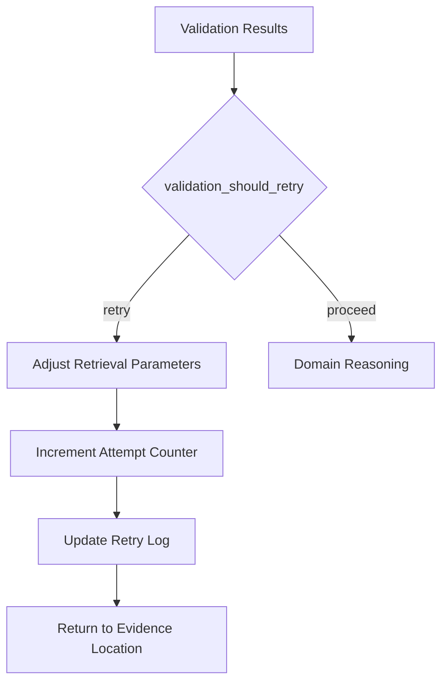

# Core Concepts

<cite>
**Referenced Files in This Document**   
- [rob2_graph.py](file://src/pipelines/graphs/rob2_graph.py)
- [system-uml.md](file://docs/system-uml.md)
- [routing.py](file://src/pipelines/graphs/routing.py)
- [fusion.py](file://src/evidence/fusion.py)
- [relevance.py](file://src/evidence/validators/relevance.py)
- [existence.py](file://src/evidence/validators/existence.py)
- [completeness.py](file://src/evidence/validators/completeness.py)
- [decision_rules.py](file://src/rob2/decision_rules.py)
- [preprocess.py](file://src/pipelines/graphs/nodes/preprocess.py)
- [planner.py](file://src/pipelines/graphs/nodes/planner.py)
- [rob2.py](file://src/schemas/internal/rob2.py)
</cite>

## Table of Contents
1. [LangGraph Workflow Orchestration](#langgraph-workflow-orchestration)
2. [State Machine Design with Rob2GraphState](#state-machine-design-with-rob2graphstate)
3. [Component Interaction Model](#component-interaction-model)
4. [Data Flow Through the System](#data-flow-through-the-system)
5. [Evidence Validation Pipeline Stages](#evidence-validation-pipeline-stages)
6. [Retrieval Fusion Techniques (RRF)](#retrieval-fusion-techniques-rrf)
7. [Domain Reasoning for ROB2's Five Domains](#domain-reasoning-for-rob2s-five-domains)
8. [Validation Retry Mechanism](#validation-retry-mechanism)
9. [Performance Considerations and Optimization Opportunities](#performance-considerations-and-optimization-opportunities)

## LangGraph Workflow Orchestration

The ROB2 assessment pipeline is orchestrated using LangGraph, a stateful workflow engine that manages the complex sequence of operations required for risk of bias assessment. The workflow is defined as a directed acyclic graph (DAG) with conditional routing, where each node represents a specific processing stage. The graph begins with preprocessing and planning, moves through evidence location and fusion, proceeds to validation, and finally executes domain reasoning and aggregation.

The workflow is implemented in the `build_rob2_graph` function within `rob2_graph.py`, which constructs a `StateGraph` using LangGraph's API. The graph includes both linear and conditional edges, allowing for retry mechanisms when validation fails. This orchestration pattern enables the system to maintain context across processing stages while providing flexibility for different execution paths based on intermediate results.

**Section sources**
- [rob2_graph.py](file://src/pipelines/graphs/rob2_graph.py#L288-L425)

## State Machine Design with Rob2GraphState

The state machine design centers around the `Rob2GraphState` class, a TypedDict that maintains context across all processing stages of the ROB2 assessment pipeline. This state object serves as the central data structure that flows through the workflow, accumulating information at each step while preserving the ability to modify parameters for retry attempts.

The state includes configuration parameters for various components (retrieval, validation, reasoning), intermediate data structures (candidates from different locators, validated evidence), and control flow variables (validation attempt counter, retry configuration). This comprehensive state management enables the workflow to maintain context across the entire assessment process, from document preprocessing to final risk aggregation.

The state machine design follows a progressive enrichment pattern, where each node adds specific information to the state without removing existing data. This allows downstream nodes to access both raw inputs and processed results from previous stages, facilitating complex validation and reasoning tasks that require access to multiple data points.

**Diagram sources **
- [rob2_graph.py](file://src/pipelines/graphs/rob2_graph.py#L46-L210)

**Section sources**
- [rob2_graph.py](file://src/pipelines/graphs/rob2_graph.py#L46-L210)

## Component Interaction Model

The ROB2 assessment pipeline employs a modular component interaction model where specialized nodes perform distinct tasks in the workflow. Each node is responsible for a specific aspect of the assessment process, from document preprocessing to final risk aggregation. The nodes interact through the shared `Rob2GraphState`, passing data and control flow between stages.

The component model follows a pipeline architecture with specialized nodes for:
- Preprocessing: Extracts structured content from PDF documents
- Planning: Determines the set of ROB2 signaling questions to address
- Evidence location: Retrieves relevant evidence using multiple strategies
- Fusion: Combines evidence from different locators
- Validation: Ensures evidence quality and completeness
- Domain reasoning: Makes risk assessments for each ROB2 domain
- Aggregation: Produces the final assessment output

This component interaction model enables clear separation of concerns, making the system easier to maintain and extend. Each node can be developed and tested independently while contributing to the overall assessment workflow.

**Section sources**
- [rob2_graph.py](file://src/pipelines/graphs/rob2_graph.py#L293-L378)

## Data Flow Through the System

The data flow through the ROB2 assessment system follows a structured progression from raw document input to final risk assessment output. The flow is visualized in the system UML diagram, which shows the sequence of processing stages and data transformations.

**Diagram sources **
- [system-uml.md](file://docs/system-uml.md#L4-L121)

**Section sources**
- [system-uml.md](file://docs/system-uml.md#L4-L121)

## Evidence Validation Pipeline Stages

The evidence validation pipeline consists of four sequential stages that ensure the quality and reliability of evidence used in the ROB2 assessment. These stages are implemented as nodes in the workflow and operate on the fused evidence candidates.

The first stage is relevance validation, which uses an LLM to determine whether each candidate contains direct evidence to answer the corresponding ROB2 signaling question. The validator annotates candidates with a relevance verdict, confidence score, and supporting quote when applicable.

The second stage is existence validation, which performs deterministic checks to ensure that candidate references are grounded in the parsed document structure. This includes verifying that paragraph IDs exist, candidate text matches the source span, and supporting quotes are present in the source paragraph.

The third stage is consistency validation, which optionally checks for contradictions between multiple evidence pieces for the same question. This helps identify conflicting information that could impact the assessment.

The final stage is completeness validation, which determines whether sufficient validated evidence exists for each question. This stage selects the final validated evidence set and determines whether the validation process should proceed or retry.

**Section sources**
- [relevance.py](file://src/evidence/validators/relevance.py#L58-L93)
- [existence.py](file://src/evidence/validators/existence.py#L26-L42)
- [completeness.py](file://src/evidence/validators/completeness.py#L19-L58)

## Retrieval Fusion Techniques (RRF)

The ROB2 assessment pipeline employs Reciprocal Rank Fusion (RRF) as the primary technique for combining evidence from multiple retrieval engines. This fusion approach is implemented in the `fuse_candidates_for_question` function within the fusion module.

RRF works by combining rankings from different retrieval engines using the formula: score = sum(1/(k + rank)), where k is a parameter that controls the influence of lower-ranked items. This approach gives higher weight to items that appear early in multiple rankings while still considering items that rank highly in just one engine.

The fusion process begins by collecting candidates from rule-based, BM25, and SPLADE retrieval engines. For each question, candidates from all engines are merged, with duplicate paragraph IDs consolidated. Each candidate is assigned a fusion score based on its rank in each engine's results, weighted by engine-specific coefficients.

The fusion algorithm also tracks the number of engines that support each candidate, providing a measure of consensus across retrieval methods. This support count is used as a secondary sorting criterion, ensuring that candidates supported by multiple engines are ranked higher.

**Diagram sources **
- [fusion.py](file://src/evidence/fusion.py#L18-L107)

**Section sources**
- [fusion.py](file://src/evidence/fusion.py#L18-L107)

## Domain Reasoning for ROB2's Five Domains

The ROB2 assessment pipeline performs domain reasoning for the five ROB2 domains: D1 (Randomization), D2 (Deviations from Intended Interventions), D3 (Missing Outcome Data), D4 (Measurement of the Outcome), and D5 (Selection of the Reported Result). Each domain is processed by a dedicated reasoning node that applies domain-specific logic to determine the risk of bias.

The reasoning process combines LLM-based analysis with rule-based decision trees. The LLM evaluates the evidence and provides an initial assessment, while the rule-based system applies predefined decision logic based on the signaling question answers. This hybrid approach ensures both flexibility in interpreting evidence and consistency in applying assessment criteria.

For D2, the system distinguishes between assignment and adherence effect types, applying different decision rules for each. The decision rules are implemented in the `evaluate_domain_risk` function, which maps signaling question answers to domain risk levels (low, some concerns, high).

The domain reasoning nodes are designed to be independent but follow a consistent pattern: they receive validated evidence, generate LLM prompts with domain-specific instructions, process the LLM output, and apply decision rules to produce a final risk assessment.

**Section sources**
- [decision_rules.py](file://src/rob2/decision_rules.py#L22-L194)
- [rob2_graph.py](file://src/pipelines/graphs/rob2_graph.py#L332-L349)

## Validation Retry Mechanism

The validation retry mechanism is a critical feature that ensures assessment quality by allowing the system to improve evidence retrieval when initial validation fails. This mechanism is implemented through conditional routing in the LangGraph workflow, where the completeness validator determines whether to proceed with domain reasoning or retry evidence location.

When validation fails, the system triggers a retry that rolls back to the evidence location stage. Before retrying, the system adjusts retrieval parameters to improve results. The retry strategy includes:
- Disabling structure-aware filtering on the first retry
- Doubling the per-query top-n candidates (capped at 200)
- Increasing the top-k results (capped at 10)
- Relaxing validation requirements when configured

The retry mechanism is controlled by the `validation_should_retry` routing function, which evaluates the validation results and current attempt count. The function considers both completeness and consistency failures, with configurable behavior for whether consistency failures should block progression.

The state machine maintains a validation attempt counter and retry log, allowing the system to track retry history and prevent infinite loops. The recursion limit is set to 100 to accommodate multiple retry attempts within the workflow.

**Diagram sources **
- [routing.py](file://src/pipelines/graphs/routing.py#L28-L43)
- [rob2_graph.py](file://src/pipelines/graphs/rob2_graph.py#L395-L399)

**Section sources**
- [routing.py](file://src/pipelines/graphs/routing.py#L28-L43)
- [rob2_graph.py](file://src/pipelines/graphs/rob2_graph.py#L248-L285)

## Performance Considerations and Optimization Opportunities

The ROB2 assessment pipeline presents several performance considerations and optimization opportunities. The workflow's sequential nature and reliance on LLM calls create potential bottlenecks that can impact processing time.

Key performance considerations include:
- The preprocessing stage, which involves parsing PDF documents with Docling, can be computationally intensive
- Multiple LLM calls in the validation and reasoning stages contribute significantly to overall processing time
- The evidence fusion process, particularly with RRF, requires sorting and merging large candidate sets
- The retry mechanism can multiply processing time when multiple attempts are needed

Optimization opportunities include:
- Caching frequently accessed resources like the question bank and locator rules
- Parallelizing independent retrieval operations (BM25 and SPLADE)
- Implementing more efficient data structures for candidate storage and retrieval
- Optimizing LLM prompts to reduce token usage and improve response quality
- Adding early termination conditions for retrieval when sufficient high-quality evidence is found
- Implementing adaptive retrieval strategies that focus on promising document sections

The system already incorporates some optimizations, such as caching document converters and chunkers in the preprocessing stage, and using efficient data validation with Pydantic models throughout the pipeline.

**Section sources**
- [preprocess.py](file://src/pipelines/graphs/nodes/preprocess.py#L24-L25)
- [question_bank.py](file://src/rob2/question_bank.py#L36-L40)
- [locator_rules.py](file://src/rob2/locator_rules.py#L28-L32)