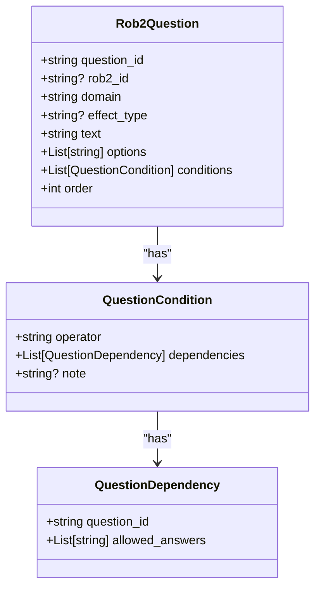
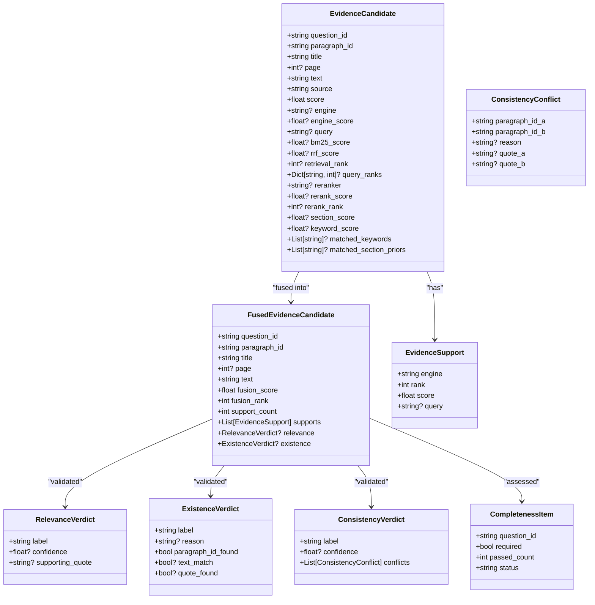
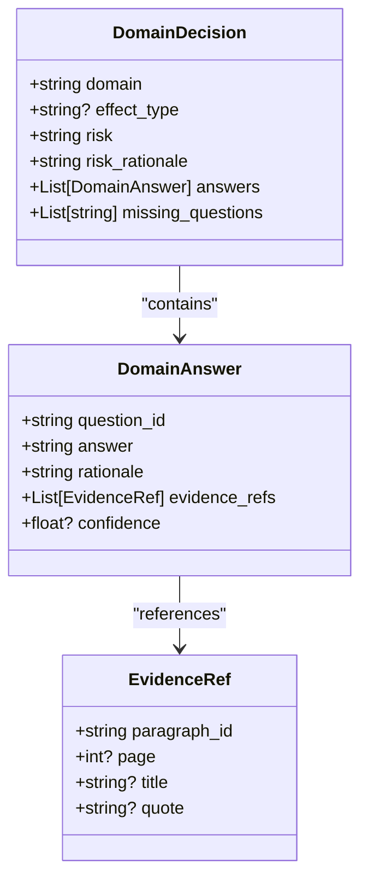
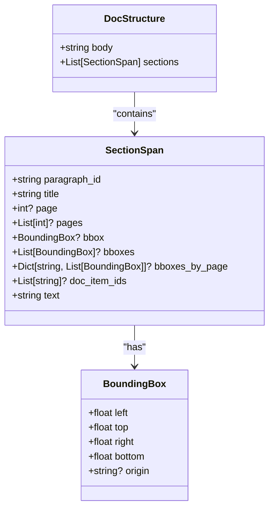
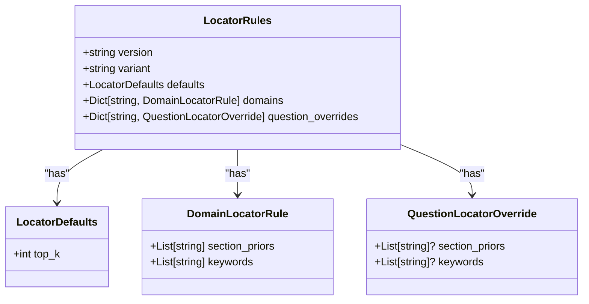
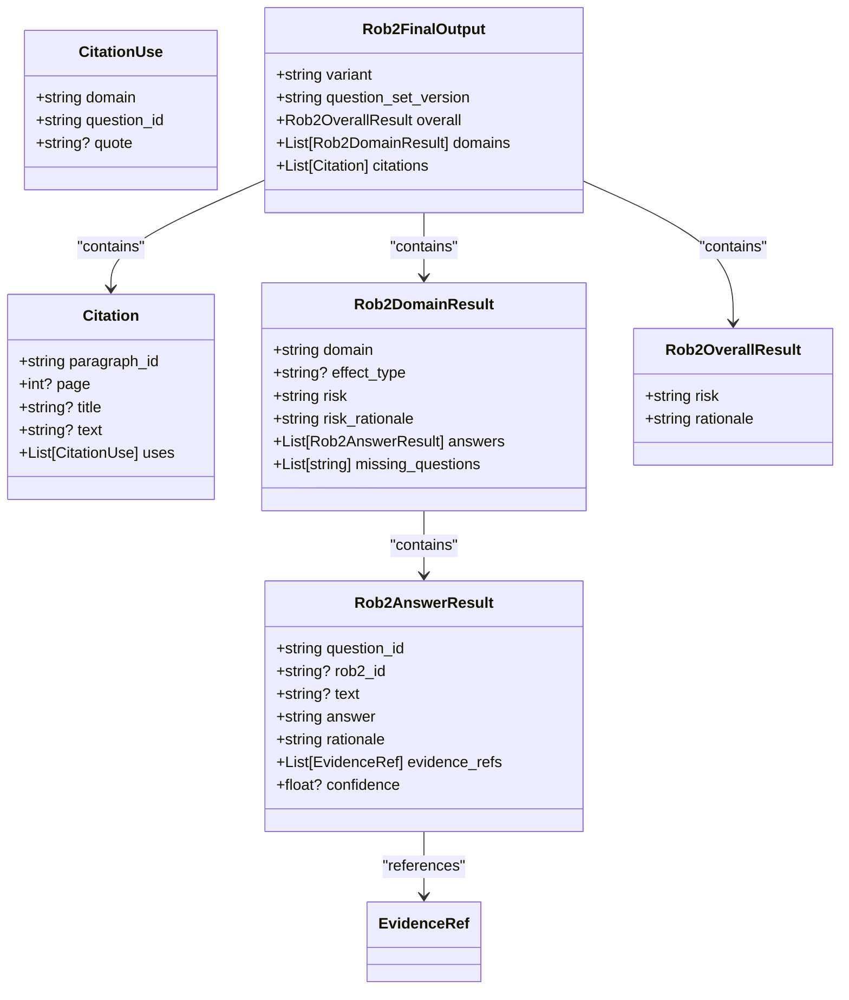
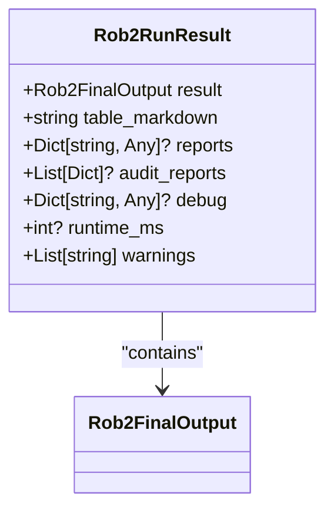
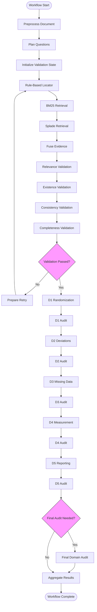
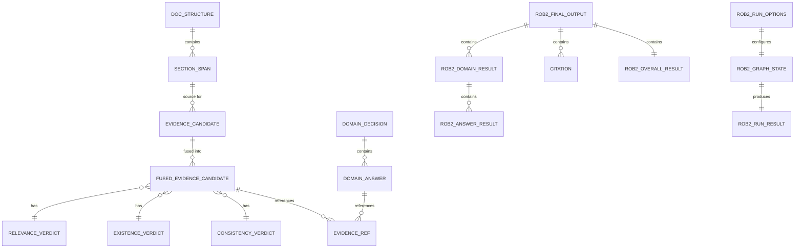

# Data Models and Schemas

<cite>
**Referenced Files in This Document**   
- [requests.py](file://src/schemas/requests.py)
- [responses.py](file://src/schemas/responses.py)
- [rob2.py](file://src/schemas/internal/rob2.py)
- [decisions.py](file://src/schemas/internal/decisions.py)
- [evidence.py](file://src/schemas/internal/evidence.py)
- [locator.py](file://src/schemas/internal/locator.py)
- [results.py](file://src/schemas/internal/results.py)
- [documents.py](file://src/schemas/internal/documents.py)
- [rob2_graph.py](file://src/pipelines/graphs/rob2_graph.py)
</cite>

## Table of Contents
1. [Introduction](#introduction)
2. [Core Data Models](#core-data-models)
3. [Request and Response Schemas](#request-and-response-schemas)
4. [Workflow State Management](#workflow-state-management)
5. [Entity Relationships](#entity-relationships)
6. [Data Lifecycle and Performance](#data-lifecycle-and-performance)
7. [Schema Extension Guidance](#schema-extension-guidance)
8. [Data Payload Examples](#data-payload-examples)
9. [Conclusion](#conclusion)

## Introduction
This document provides comprehensive documentation for the application's data structures, focusing on the Rob2GraphState TypedDict with its extensive field set that maintains workflow state throughout the ROB2 assessment process. The documentation covers the request and response schemas defined in src/schemas/, including Rob2Input, Rob2RunOptions, and Rob2RunResult, which form the external interface of the system. It explains the entity relationships between different data models and their role in the workflow, providing detailed field definitions, data types, validation rules, and business logic. The document also addresses data lifecycle considerations and performance implications of the data model design, offering guidance on extending the schemas for custom use cases. The system implements a sophisticated evidence-based assessment workflow that integrates document preprocessing, evidence location, validation, domain reasoning, and final aggregation.

**Section sources**
- [rob2_graph.py](file://src/pipelines/graphs/rob2_graph.py#L46-L425)
- [requests.py](file://src/schemas/requests.py#L10-L166)
- [responses.py](file://src/schemas/responses.py#L12-L24)

## Core Data Models

The application's data model is organized around several key components that represent different stages of the ROB2 assessment workflow. The core data models are defined in the src/schemas/internal/ directory and include specialized schemas for different aspects of the assessment process.

### ROB2 Question Model
The Rob2Question model defines the structure of signaling questions used in the assessment process. Each question has a unique identifier, domain association, text content, answer options, and conditional logic that determines when the question should be evaluated. The model includes validation to ensure that only allowed answer options are used and that domain-specific requirements are met, particularly for D2 questions which require an effect type specification.



**Diagram sources**
- [rob2.py](file://src/schemas/internal/rob2.py#L47-L80)

### Evidence and Validation Models
The evidence models represent the core of the assessment workflow, capturing evidence candidates, their validation status, and fusion results. The EvidenceCandidate model contains information about evidence retrieved from various sources, including retrieval scores, metadata, and provenance. The validation models (RelevanceVerdict, ExistenceVerdict, ConsistencyVerdict) represent the results of different validation checks performed on the evidence.



**Diagram sources**
- [evidence.py](file://src/schemas/internal/evidence.py#L21-L147)

### Domain Decision Models
The domain decision models capture the results of domain-specific reasoning for each of the five ROB2 domains (D1-D5). The DomainAnswer model represents an answer to a specific signaling question, including the answer itself, rationale, evidence references, and confidence score. The DomainDecision model aggregates answers for a domain, providing a risk assessment and rationale for the overall domain judgment.



**Diagram sources**
- [decisions.py](file://src/schemas/internal/decisions.py#L26-L48)

### Document Structure Model
The document structure model represents the preprocessed document content after parsing with Docling. It captures the document's hierarchical structure, including section spans with metadata such as paragraph identifiers, titles, page numbers, bounding boxes, and text content. This model enables section-aware retrieval and provides spatial context for evidence location.



**Diagram sources**
- [documents.py](file://src/schemas/internal/documents.py#L10-L38)

### Locator Rules Model
The locator rules model defines configuration for rule-based evidence location, including default settings, domain-specific rules, and question-level overrides. This model enables customization of the evidence location process based on domain knowledge and specific question requirements.



**Diagram sources**
- [locator.py](file://src/schemas/internal/locator.py#L12-L57)

### Final Results Model
The final results model represents the complete output of the ROB2 assessment process, aggregating domain decisions into an overall risk assessment. It includes citation information that links evidence to specific questions and domains, enabling traceability of the assessment conclusions.



**Diagram sources**
- [results.py](file://src/schemas/internal/results.py#L33-L70)

## Request and Response Schemas

### Request Schemas
The request schemas define the external interface for initiating a ROB2 assessment. The Rob2Input schema specifies the document source, which can be provided either as a file path or as raw bytes. The Rob2RunOptions schema contains extensive configuration options that control various aspects of the assessment workflow, including preprocessing, retrieval, validation, and domain reasoning parameters.

```mermaid
classDiagram
class Rob2Input {
+string? pdf_path
+bytes? pdf_bytes
+string? filename
}
class Rob2RunOptions {
+string? docling_layout_model
+string? docling_artifacts_path
+string? docling_chunker_model
+int? docling_chunker_max_tokens
+int? top_k
+int? per_query_top_n
+int? rrf_k
+string? query_planner
+string? query_planner_model
+string? query_planner_model_provider
+float? query_planner_temperature
+float? query_planner_timeout
+int? query_planner_max_tokens
+int? query_planner_max_retries
+int? query_planner_max_keywords
+string? reranker
+string? reranker_model_id
+string? reranker_device
+int? reranker_max_length
+int? reranker_batch_size
+int? rerank_top_n
+bool? use_structure
+float? section_bonus_weight
+string? splade_model_id
+string? splade_device
+string? splade_hf_token
+int? splade_query_max_length
+int? splade_doc_max_length
+int? splade_batch_size
+int? fusion_top_k
+int? fusion_rrf_k
+Dict[string, float]? fusion_engine_weights
+string? relevance_mode
+string? relevance_model
+string? relevance_model_provider
+float? relevance_temperature
+float? relevance_timeout
+int? relevance_max_tokens
+int? relevance_max_retries
+float? relevance_min_confidence
+bool? relevance_require_quote
+bool? relevance_fill_to_top_k
+int? relevance_top_k
+int? relevance_top_n
+bool? existence_require_text_match
+bool? existence_require_quote_in_source
+int? existence_top_k
+string? consistency_mode
+string? consistency_model
+string? consistency_model_provider
+float? consistency_temperature
+float? consistency_timeout
+int? consistency_max_tokens
+int? consistency_max_retries
+float? consistency_min_confidence
+bool? consistency_require_quotes_for_fail
+int? consistency_top_n
+bool? completeness_enforce
+List[string]? completeness_required_questions
+int? completeness_min_passed_per_question
+bool? completeness_require_relevance
+int? validated_top_k
+int? validation_max_retries
+bool? validation_fail_on_consistency
+bool? validation_relax_on_retry
+string? d2_effect_type
+int? domain_evidence_top_k
+string? d1_model
+string? d1_model_provider
+float? d1_temperature
+float? d1_timeout
+int? d1_max_tokens
+int? d1_max_retries
+string? d2_model
+string? d2_model_provider
+float? d2_temperature
+float? d2_timeout
+int? d2_max_tokens
+int? d2_max_retries
+string? d3_model
+string? d3_model_provider
+float? d3_temperature
+float? d3_timeout
+int? d3_max_tokens
+int? d3_max_retries
+string? d4_model
+string? d4_model_provider
+float? d4_temperature
+float? d4_timeout
+int? d4_max_tokens
+int? d4_max_retries
+string? d5_model
+string? d5_model_provider
+float? d5_temperature
+float? d5_timeout
+int? d5_max_tokens
+int? d5_max_retries
+string? domain_audit_mode
+string? domain_audit_model
+string? domain_audit_model_provider
+float? domain_audit_temperature
+float? domain_audit_timeout
+int? domain_audit_max_tokens
+int? domain_audit_max_retries
+int? domain_audit_patch_window
+int? domain_audit_max_patches_per_question
+bool? domain_audit_rerun_domains
+bool? domain_audit_final
+string? debug_level
+bool? include_reports
+bool? include_audit_reports
}
Rob2Input : +validate_source()
```



**Diagram sources**
- [requests.py](file://src/schemas/requests.py#L10-L163)

### Response Schema
The response schema defines the structure of the complete ROB2 assessment result returned to the client. It includes the final assessment output, formatted table representation, optional reports, audit information, debug data, runtime metrics, and warnings.



**Diagram sources**
- [responses.py](file://src/schemas/responses.py#L12-L21)

## Workflow State Management

### Rob2GraphState TypedDict
The Rob2GraphState TypedDict is the central data structure that maintains the workflow state throughout the ROB2 assessment process. With over 200 fields, it serves as a comprehensive state container that passes data between different stages of the workflow. The state includes configuration parameters, intermediate results, and final outputs, enabling the complex orchestration of the assessment pipeline.

The state structure is organized into logical groups that correspond to different phases of the workflow:

- **Document Processing**: Fields related to document preprocessing, including pdf_path, doc_structure, and Docling configuration options
- **Retrieval Configuration**: Parameters controlling evidence location, such as top_k, rrf_k, query_planner settings, and retrieval engine configurations
- **Validation Configuration**: Settings for the validation phase, including relevance, existence, consistency, and completeness validation parameters
- **Domain Reasoning**: Configuration for domain-specific reasoning, with model settings and parameters for each of the five domains (D1-D5)
- **Audit Configuration**: Parameters for the domain audit phase, including audit mode, model settings, and patching behavior
- **Evidence Storage**: Fields that store intermediate evidence candidates from different sources (rule_based_candidates, bm25_candidates, splade_candidates, fusion_candidates)
- **Validation Results**: Fields that capture validation outcomes, including relevance_candidates, existence_candidates, validated_evidence, and completeness reports
- **Domain Decisions**: Fields that store domain-level decisions (d1_decision, d2_decision, etc.)
- **Workflow Control**: Fields that manage workflow execution, such as validation_attempt, validation_max_retries, and validation_retry_log
- **Final Output**: Fields that contain the final assessment results (rob2_result, rob2_table_markdown)

The state management design follows a progressive enrichment pattern, where each workflow node adds to or modifies the state without removing existing information. This approach enables debugging and auditability by preserving the complete history of the assessment process. The state also supports retry and rollback functionality through the validation_retry_log and domain_audit_reports fields, which accumulate information across multiple attempts.



**Diagram sources**
- [rob2_graph.py](file://src/pipelines/graphs/rob2_graph.py#L288-L422)

**Section sources**
- [rob2_graph.py](file://src/pipelines/graphs/rob2_graph.py#L46-L425)

## Entity Relationships

The data models in the application are interconnected through a series of relationships that reflect the workflow of the ROB2 assessment process. These relationships form a hierarchical structure that progresses from raw document content to final assessment results.

### Data Flow Hierarchy
The primary data flow follows a hierarchical progression from document content to evidence candidates, validation results, domain decisions, and finally the overall assessment:

Document Structure → Evidence Candidates → Validated Evidence → Domain Decisions → Overall Result

Each stage builds upon the previous one, adding layers of analysis and interpretation. The document structure provides the foundation, with evidence candidates extracted based on the structured content. These candidates are then validated through multiple checks (relevance, existence, consistency, completeness) before being used as the basis for domain-specific reasoning. The domain decisions are aggregated into the final overall assessment.

### Relationship Types
The relationships between entities can be categorized into several types:

- **Composition**: Strong "has-a" relationships where one entity contains multiple instances of another (e.g., DomainDecision has multiple DomainAnswer instances)
- **Reference**: Links between entities that maintain traceability (e.g., DomainAnswer references EvidenceRef instances)
- **Aggregation**: Collection of related entities that form a complete result (e.g., Rob2FinalOutput aggregates multiple Rob2DomainResult instances)
- **Dependency**: Conditional relationships where the existence or value of one entity depends on another (e.g., QuestionCondition depends on other questions through QuestionDependency)

### Cross-Model Relationships
Several key cross-model relationships enable the integration of different workflow components:

- **Evidence to Citation**: Validated evidence candidates are linked to citations in the final output, providing traceability from source content to assessment conclusions
- **Validation to Evidence**: Validation results (relevance, existence, consistency) are attached to evidence candidates, enabling assessment of evidence quality
- **Domain to Question**: Domain decisions are based on answers to specific signaling questions, with missing_questions tracking unanswered questions
- **Configuration to Execution**: Run options and configuration parameters influence the behavior of workflow nodes, with state fields reflecting both input configuration and runtime adjustments



**Diagram sources**
- [rob2.py](file://src/schemas/internal/rob2.py#L47-L80)
- [evidence.py](file://src/schemas/internal/evidence.py#L21-L147)
- [decisions.py](file://src/schemas/internal/decisions.py#L26-L48)
- [results.py](file://src/schemas/internal/results.py#L33-L70)

**Section sources**
- [rob2.py](file://src/schemas/internal/rob2.py#L1-L129)
- [evidence.py](file://src/schemas/internal/evidence.py#L1-L170)
- [decisions.py](file://src/schemas/internal/decisions.py#L1-L57)
- [results.py](file://src/schemas/internal/results.py#L1-L81)

## Data Lifecycle and Performance

### Data Lifecycle
The data in the application follows a well-defined lifecycle that corresponds to the workflow stages:

1. **Initialization**: The process begins with the Rob2Input request, which provides the document source and optional configuration
2. **Preprocessing**: The document is parsed into a structured format (DocStructure) that enables section-aware processing
3. **Question Planning**: The standardized ROB2 question set is loaded, establishing the assessment framework
4. **Evidence Location**: Evidence candidates are retrieved from multiple sources (rule-based, BM25, Splade) and stored in the state
5. **Evidence Fusion**: Candidates from different sources are merged into a unified ranking with source attribution
6. **Validation**: The fused evidence undergoes multiple validation checks (relevance, existence, consistency, completeness)
7. **Domain Reasoning**: Domain-specific reasoning is performed for each of the five ROB2 domains
8. **Audit**: An optional audit phase may be performed to verify and potentially correct domain decisions
9. **Aggregation**: All results are compiled into the final assessment output
10. **Response**: The Rob2RunResult is returned to the client

Throughout this lifecycle, data is progressively enriched and transformed, with intermediate results preserved in the workflow state to support debugging and auditability.

### Performance Considerations
The data model design incorporates several performance optimizations:

- **State Management**: The use of a single, comprehensive state object (Rob2GraphState) reduces the overhead of passing data between workflow nodes
- **Lazy Validation**: Validation parameters are only initialized when needed, reducing memory usage for simple assessments
- **Configurable Top-K**: The top_k parameter allows control over the amount of evidence processed, enabling performance tuning based on requirements
- **Retry Optimization**: The validation retry mechanism adjusts retrieval parameters (increasing per_query_top_n and top_k) to improve results on subsequent attempts
- **Caching**: Document preprocessing results are cached to avoid redundant parsing when the same document is processed multiple times
- **Parallel Processing**: Evidence location from different sources (BM25, Splade) can be performed in parallel to reduce overall processing time

The extensive configuration options in Rob2RunOptions allow fine-grained control over performance characteristics, enabling users to balance accuracy and speed based on their specific needs.

**Section sources**
- [rob2_graph.py](file://src/pipelines/graphs/rob2_graph.py#L46-L425)
- [requests.py](file://src/schemas/requests.py#L10-L163)
- [responses.py](file://src/schemas/responses.py#L12-L21)

## Schema Extension Guidance

The application's schema design supports extension for custom use cases through several mechanisms:

### Custom Validation Rules
The validation framework can be extended by adding new validation types or modifying existing ones. Custom validation rules can be implemented by creating new validator nodes that follow the same interface as the existing validators (relevance_validator_node, existence_validator_node, etc.). These custom validators can access the workflow state and add their results to appropriate state fields.

### Domain-Specific Extensions
The domain reasoning components can be extended to support additional domains or modified assessment criteria. This can be achieved by:
- Adding new domain-specific question sets in the question bank
- Implementing new domain reasoning nodes that follow the same pattern as the existing D1-D5 nodes
- Extending the DomainDecision model to include domain-specific fields

### Evidence Source Integration
New evidence sources can be integrated by:
- Implementing a new locator node that follows the same interface as the existing locator nodes
- Adding configuration options for the new source in Rob2RunOptions
- Modifying the fusion logic to incorporate results from the new source

### Custom Output Formats
The final output can be extended to support additional formats or enriched content by:
- Adding new fields to the Rob2FinalOutput model
- Implementing custom aggregation logic in the aggregate_node
- Extending the response schema to include additional output types

When extending the schemas, it is important to maintain backward compatibility and follow the existing design patterns. The use of Pydantic models with strict validation ensures data integrity, while the TypedDict-based state management provides flexibility for adding new fields.

**Section sources**
- [requests.py](file://src/schemas/requests.py#L10-L163)
- [rob2_graph.py](file://src/pipelines/graphs/rob2_graph.py#L46-L425)

## Data Payload Examples

### Request Payload
```json
{
  "pdf_path": "/path/to/document.pdf",
  "options": {
    "top_k": 5,
    "per_query_top_n": 50,
    "relevance_mode": "llm",
    "relevance_model": "gpt-4",
    "consistency_mode": "llm",
    "completeness_enforce": true,
    "d2_effect_type": "assignment",
    "debug_level": "full"
  }
}
```

### Intermediate State (After Evidence Fusion)
```json
{
  "pdf_path": "/path/to/document.pdf",
  "doc_structure": { /* Document structure */ },
  "question_set": { /* Question set */ },
  "top_k": 5,
  "fusion_candidates": {
    "q1": [
      {
        "question_id": "q1",
        "paragraph_id": "dl-abc123",
        "title": "Methods > Randomization",
        "page": 3,
        "text": "Participants were randomly assigned to treatment groups...",
        "source": "rule_based",
        "score": 0.95,
        "engine": "rule_based",
        "query": "randomization method"
      }
    ]
  },
  "relevance_candidates": {
    "q1": [
      {
        "question_id": "q1",
        "paragraph_id": "dl-abc123",
        "title": "Methods > Randomization",
        "page": 3,
        "text": "Participants were randomly assigned to treatment groups...",
        "source": "rule_based",
        "score": 0.95,
        "relevance": {
          "label": "relevant",
          "confidence": 0.98,
          "supporting_quote": "randomly assigned"
        }
      }
    ]
  }
}
```

### Final Response Payload
```json
{
  "result": {
    "variant": "standard",
    "question_set_version": "1.0",
    "overall": {
      "risk": "some_concerns",
      "rationale": "Some concerns about randomization and missing data"
    },
    "domains": [
      {
        "domain": "D1",
        "risk": "low",
        "risk_rationale": "Clear description of randomization method",
        "answers": [
          {
            "question_id": "q1",
            "answer": "Y",
            "rationale": "Document states participants were randomly assigned",
            "evidence_refs": [
              {
                "paragraph_id": "dl-abc123",
                "page": 3,
                "title": "Methods > Randomization",
                "quote": "Participants were randomly assigned to treatment groups"
              }
            ],
            "confidence": 0.95
          }
        ]
      }
    ],
    "citations": [
      {
        "paragraph_id": "dl-abc123",
        "page": 3,
        "title": "Methods > Randomization",
        "uses": [
          {
            "domain": "D1",
            "question_id": "q1",
            "quote": "randomly assigned"
          }
        ]
      }
    ]
  },
  "table_markdown": "| Domain | Risk | Rationale |\n|--------|------|-----------|\n| D1 | low | Clear description of randomization method |",
  "reports": { /* Optional debug reports */ },
  "audit_reports": [ /* Optional audit reports */ ],
  "debug": { /* Optional debug information */ },
  "runtime_ms": 12345,
  "warnings": []
}
```

**Section sources**
- [requests.py](file://src/schemas/requests.py#L10-L163)
- [responses.py](file://src/schemas/responses.py#L12-L21)
- [rob2_graph.py](file://src/pipelines/graphs/rob2_graph.py#L46-L425)

## Conclusion
The application's data model is a comprehensive and well-structured system that supports the complex workflow of ROB2 assessment. The Rob2GraphState TypedDict serves as the central state container, maintaining over 200 fields that track configuration, intermediate results, and final outputs throughout the assessment process. The request and response schemas provide a clear external interface, while the internal data models represent different stages of the workflow with appropriate validation and relationships. The entity relationships form a hierarchical structure that progresses from document content to final assessment results, with strong traceability between evidence and conclusions. The data lifecycle is well-defined, with performance considerations built into the design through configurable parameters and optimization strategies. The schema design supports extension for custom use cases while maintaining data integrity through Pydantic validation. Overall, the data model effectively supports the application's goal of providing rigorous, evidence-based assessment of study quality.

**Section sources**
- [rob2_graph.py](file://src/pipelines/graphs/rob2_graph.py#L46-L425)
- [requests.py](file://src/schemas/requests.py#L10-L163)
- [responses.py](file://src/schemas/responses.py#L12-L21)