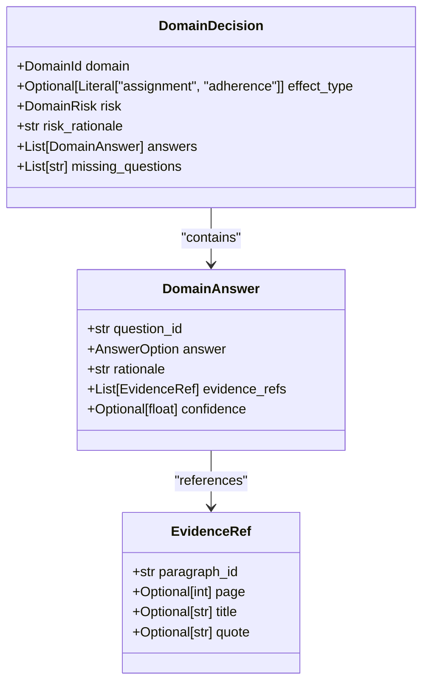
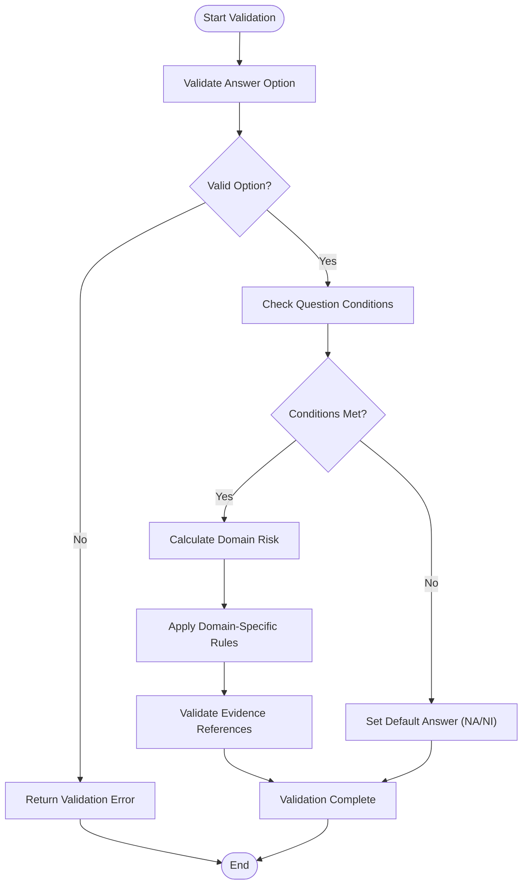
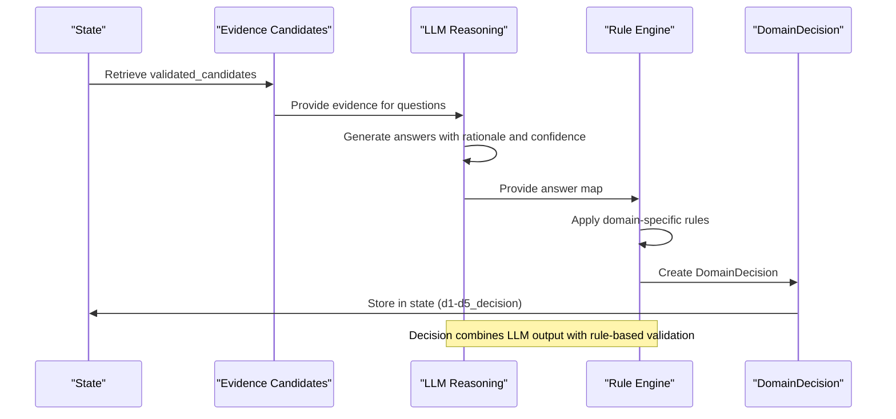
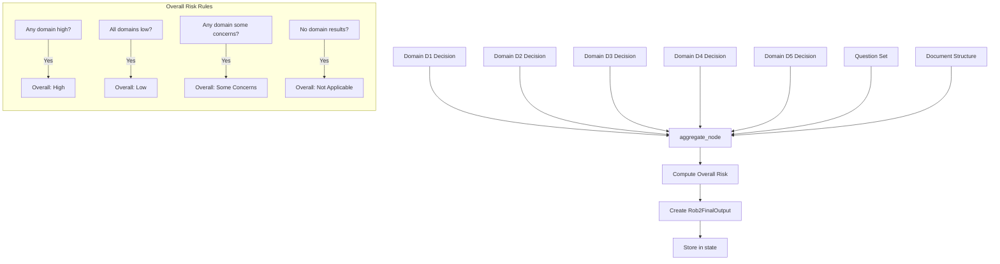
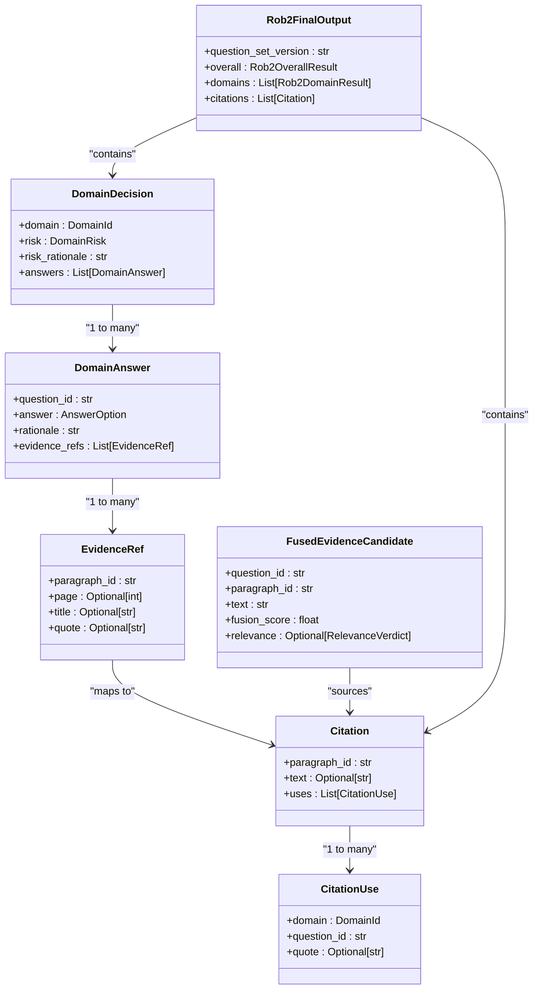

# Decision Record Model

<cite>
**Referenced Files in This Document**   
- [decisions.py](file://src/schemas/internal/decisions.py)
- [rob2.py](file://src/schemas/internal/rob2.py)
- [decision_rules.py](file://src/rob2/decision_rules.py)
- [aggregate.py](file://src/pipelines/graphs/nodes/aggregate.py)
- [domain_audit.py](file://src/pipelines/graphs/nodes/domain_audit.py)
- [common.py](file://src/pipelines/graphs/nodes/domains/common.py)
- [evidence.py](file://src/schemas/internal/evidence.py)
- [results.py](file://src/schemas/internal/results.py)
</cite>

## Table of Contents
1. [Introduction](#introduction)
2. [Decision Record Structure](#decision-record-structure)
3. [Validation Rules and Business Logic](#validation-rules-and-business-logic)
4. [Domain Reasoning Process](#domain-reasoning-process)
5. [Decision Aggregation and Final Assessment](#decision-aggregation-and-final-assessment)
6. [Relationship with Evidence and Final Output](#relationship-with-evidence-and-final-output)
7. [Performance and Storage Considerations](#performance-and-storage-considerations)
8. [Model Extension and Customization](#model-extension-and-customization)
9. [Conclusion](#conclusion)

## Introduction
The DecisionRecord model captures domain-level judgments in the ROB2 (Risk Of Bias 2) assessment process for clinical trials. This model serves as the central component for storing risk assessments across five domains (D1-D5), providing a structured representation of risk judgments, rationales, supporting evidence, and confidence levels. The model ensures assessment integrity through validation rules and business logic constraints, while supporting auditability and traceability of decisions. This documentation provides a comprehensive overview of the DecisionRecord model, its implementation, and its role in the overall assessment workflow.

## Decision Record Structure
The DecisionRecord model is implemented through the `DomainDecision` class in the `decisions.py` file, which captures the complete decision-making process for each ROB2 domain. The structure includes domain identification, risk judgment, rationale, supporting evidence references, and confidence levels.

**Diagram sources**
- [decisions.py](file://src/schemas/internal/decisions.py#L38-L48)

**Section sources**
- [decisions.py](file://src/schemas/internal/decisions.py#L1-L58)

## Validation Rules and Business Logic
The DecisionRecord model enforces assessment integrity through a comprehensive set of validation rules and business logic constraints. These rules ensure that decisions are consistent, evidence-based, and follow the ROB2 framework guidelines.

The validation process includes:
- Answer option validation against allowed values (Y, PY, PN, N, NI, NA)
- Conditional question logic enforcement based on dependencies
- Domain-specific risk calculation rules
- Evidence reference validation and grounding
- Confidence level constraints (0-1 range)

**Diagram sources**
- [rob2.py](file://src/schemas/internal/rob2.py#L47-L129)
- [decision_rules.py](file://src/rob2/decision_rules.py#L22-L194)

**Section sources**
- [rob2.py](file://src/schemas/internal/rob2.py#L1-L130)
- [decision_rules.py](file://src/rob2/decision_rules.py#L1-L195)

## Domain Reasoning Process
The DecisionRecord instances are created during domain reasoning through a structured process that combines evidence retrieval, LLM-based reasoning, and rule-based validation. Each domain (D1-D5) follows a similar reasoning pattern but with domain-specific considerations.

The domain reasoning process is implemented in the `run_domain_reasoning` function in `common.py`, which orchestrates the creation of DecisionRecord instances. This function:
1. Selects relevant questions for the domain
2. Retrieves and ranks supporting evidence
3. Invokes the LLM with structured prompts
4. Normalizes and validates the LLM output
5. Applies rule-based risk assessment
6. Creates the final DomainDecision object

**Diagram sources**
- [common.py](file://src/pipelines/graphs/nodes/domains/common.py#L100-L129)
- [d1_randomization.py](file://src/pipelines/graphs/nodes/domains/d1_randomization.py#L15-L47)

**Section sources**
- [common.py](file://src/pipelines/graphs/nodes/domains/common.py#L1-L516)
- [d1_randomization.py](file://src/pipelines/graphs/nodes/domains/d1_randomization.py#L1-L48)
- [d2_deviations.py](file://src/pipelines/graphs/nodes/domains/d2_deviations.py#L1-L58)
- [d3_missing_data.py](file://src/pipelines/graphs/nodes/domains/d3_missing_data.py#L1-L48)
- [d4_measurement.py](file://src/pipelines/graphs/nodes/domains/d4_measurement.py#L1-L48)
- [d5_reporting.py](file://src/pipelines/graphs/nodes/domains/d5_reporting.py#L1-L48)

## Decision Aggregation and Final Assessment
DecisionRecord instances are aggregated into final assessments through the `aggregate_node` function in `aggregate.py`. This process combines domain-level decisions into a comprehensive ROB2 assessment with an overall risk judgment.

The aggregation process follows the ROB2 standard rules:
1. If any domain is high → overall high
2. If all domains are low → overall low
3. Else if any domain has some concerns → overall some concerns
4. If no domain results → not applicable

**Diagram sources**
- [aggregate.py](file://src/pipelines/graphs/nodes/aggregate.py#L32-L188)

**Section sources**
- [aggregate.py](file://src/pipelines/graphs/nodes/aggregate.py#L1-L189)

## Relationship with Evidence and Final Output
The DecisionRecord model is closely integrated with the EvidenceCandidate and Rob2FinalOutput models, forming a complete assessment pipeline with strong auditability requirements. This relationship ensures that all decisions are grounded in evidence and can be traced back to source material.

The audit process in `domain_audit.py` further strengthens this relationship by validating decisions against the full document text and patching evidence when mismatches are found. This ensures that decisions remain consistent with the source evidence.

**Diagram sources**
- [decisions.py](file://src/schemas/internal/decisions.py#L38-L48)
- [evidence.py](file://src/schemas/internal/evidence.py#L126-L147)
- [results.py](file://src/schemas/internal/results.py#L63-L70)
- [domain_audit.py](file://src/pipelines/graphs/nodes/domain_audit.py#L119-L243)

**Section sources**
- [evidence.py](file://src/schemas/internal/evidence.py#L1-L171)
- [results.py](file://src/schemas/internal/results.py#L1-L82)
- [domain_audit.py](file://src/pipelines/graphs/nodes/domain_audit.py#L1-L789)

## Performance and Storage Considerations
The DecisionRecord model is designed with performance and storage efficiency in mind, particularly for storing decision provenance and enabling efficient retrieval during reporting.

Key performance considerations include:
- **Storage Optimization**: Decision records are stored in a structured format that minimizes redundancy while preserving all necessary information
- **Retrieval Efficiency**: The model supports efficient querying through indexed fields like domain, question_id, and risk level
- **Provenance Tracking**: Decision provenance is stored in a way that balances completeness with storage requirements
- **Caching Strategy**: Frequently accessed decision data is cached to improve retrieval performance

The implementation uses Pydantic models with strict validation, ensuring data integrity while maintaining serialization efficiency. The evidence references are stored as lightweight pointers to the full text, reducing storage overhead while maintaining traceability.

**Section sources**
- [decisions.py](file://src/schemas/internal/decisions.py#L1-L58)
- [evidence.py](file://src/schemas/internal/evidence.py#L1-L171)
- [results.py](file://src/schemas/internal/results.py#L1-L82)

## Model Extension and Customization
The DecisionRecord model is designed to be extensible, supporting additional decision metadata and custom risk categories. This flexibility allows the model to adapt to evolving assessment requirements and specialized use cases.

Extension points include:
- **Custom Risk Categories**: The model can be extended to support additional risk levels beyond the standard low, some_concerns, and high
- **Additional Metadata**: Custom fields can be added to capture domain-specific information or additional confidence metrics
- **Enhanced Evidence Types**: Support for new evidence types or validation methods can be incorporated
- **Alternative Aggregation Rules**: Custom rules for combining domain assessments can be implemented

The extension mechanism leverages the Pydantic model system, allowing for inheritance and composition patterns to create specialized decision models while maintaining compatibility with the core assessment workflow.

**Section sources**
- [decisions.py](file://src/schemas/internal/decisions.py#L1-L58)
- [common.py](file://src/pipelines/graphs/nodes/domains/common.py#L1-L516)

## Conclusion
The DecisionRecord model provides a robust foundation for capturing and managing domain-level judgments in the ROB2 assessment process. By combining structured data modeling with rule-based validation and LLM-powered reasoning, the model ensures assessment integrity while maintaining flexibility and auditability. The integration with evidence management and final output generation creates a comprehensive assessment pipeline that supports both automated processing and human review. The model's design considerations for performance, storage, and extensibility ensure its effectiveness in real-world applications.