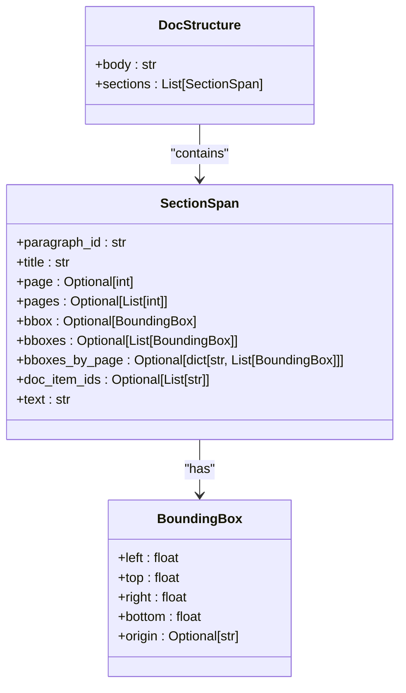
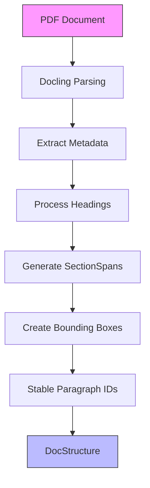
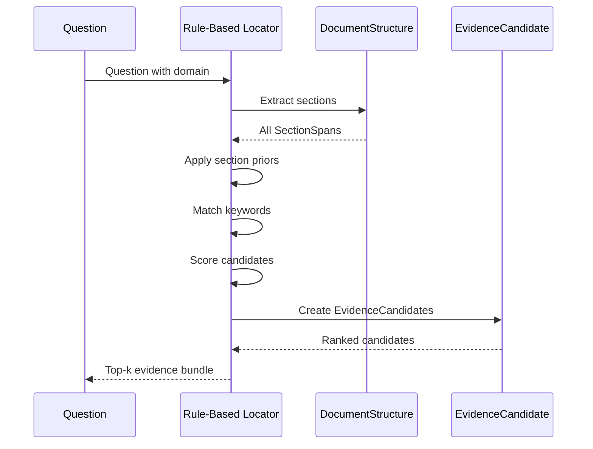
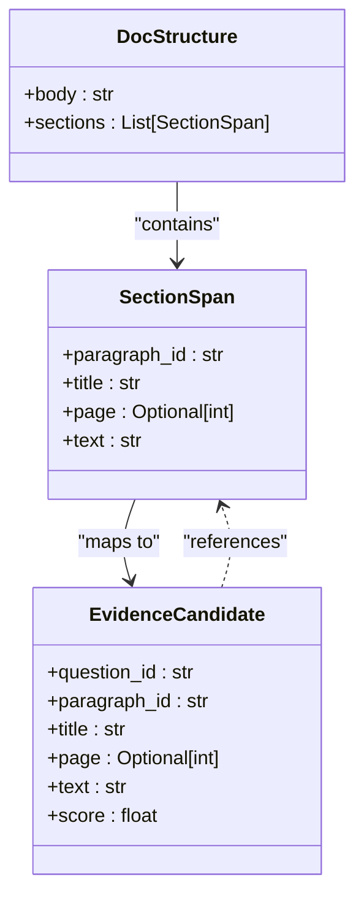

# Document Structure Model

<cite>
**Referenced Files in This Document**   
- [documents.py](file://src/schemas/internal/documents.py)
- [preprocess.py](file://src/pipelines/graphs/nodes/preprocess.py)
- [rule_based.py](file://src/pipelines/graphs/nodes/locators/rule_based.py)
- [retrieval_bm25.py](file://src/pipelines/graphs/nodes/locators/retrieval_bm25.py)
- [filters.py](file://src/retrieval/structure/filters.py)
- [section_prior.py](file://src/retrieval/structure/section_prior.py)
- [evidence.py](file://src/schemas/internal/evidence.py)
- [locator.py](file://src/schemas/internal/locator.py)
</cite>

## Table of Contents
1. [Introduction](#introduction)
2. [Document Structure Model](#document-structure-model)
3. [Hierarchical Organization](#hierarchical-organization)
4. [Field Types and Validation Constraints](#field-types-and-validation-constraints)
5. [Parsing Logic from Docling Output](#parsing-logic-from-docling-output)
6. [Section-Aware Retrieval and Evidence Localization](#section-aware-retrieval-and-evidence-localization)
7. [DocumentStructure and LocatorResult Relationship](#documentstructure-and-locatorresult-relationship)
8. [Performance Implications and Traversal Strategies](#performance-implications-and-traversal-strategies)
9. [Model Extension and Specialized Analysis](#model-extension-and-specialized-analysis)
10. [Conclusion](#conclusion)

## Introduction
The DocumentStructure model serves as the foundational representation of parsed clinical trial documents within the system. This model captures the hierarchical organization of document content, including sections, subsections, and metadata such as title, authors, and publication information. The model is designed to enable section-aware retrieval and precise evidence localization, which are critical for accurate risk of bias assessment in clinical trials. This documentation provides a comprehensive overview of the DocumentStructure model, its implementation, and its role in the evidence retrieval pipeline.

**Section sources**
- [documents.py](file://src/schemas/internal/documents.py#L1-L43)

## Document Structure Model
The DocumentStructure model is implemented as a Pydantic BaseModel that represents the normalized structure of a clinical trial document after preprocessing. The model consists of two primary components: the complete document body text and a list of SectionSpan objects that provide paragraph-level segmentation with rich metadata. This dual representation allows for both holistic document analysis and granular paragraph-level processing. The model is designed to be extensible, with the `model_config = ConfigDict(extra="allow")` configuration enabling the addition of custom fields during processing without validation errors.



**Diagram sources**
- [documents.py](file://src/schemas/internal/documents.py#L34-L39)

**Section sources**
- [documents.py](file://src/schemas/internal/documents.py#L34-L43)

## Hierarchical Organization
The DocumentStructure model captures the hierarchical organization of clinical trial documents through the SectionSpan objects, which represent paragraph-level content with section context. Each SectionSpan includes a title field that contains the section heading path, preserving the document's hierarchical structure. The model supports multi-level section nesting through the title field, which can contain hierarchical paths separated by " > " (e.g., "Methods > Study Design > Randomization"). This hierarchical representation enables precise localization of evidence within the document structure and supports section-aware retrieval operations that prioritize content from specific sections based on domain-specific rules.

**Section sources**
- [documents.py](file://src/schemas/internal/documents.py#L20-L32)
- [preprocess.py](file://src/pipelines/graphs/nodes/preprocess.py#L307-L316)

## Field Types and Validation Constraints
The DocumentStructure model employs specific field types and validation constraints to ensure data integrity and consistency. The SectionSpan model includes a paragraph_id field with a description indicating it serves as a stable paragraph identifier, ensuring consistent referencing across processing stages. The title field is constrained to string type with a clear description of its purpose as a section heading path. Optional fields such as page, pages, bbox, bboxes, bboxes_by_page, and doc_item_ids accommodate variable metadata availability across different document sources. The BoundingBox model enforces float type constraints for coordinate values, ensuring geometric consistency in spatial representations of document elements.

```mermaid
erDiagram
DOC_STRUCTURE {
string body
List[SectionSpan] sections
}
SECTION_SPAN {
string paragraph_id
string title
int? page
List[int]? pages
BoundingBox? bbox
List[BoundingBox]? bboxes
dict? bboxes_by_page
List[string]? doc_item_ids
string text
}
BOUNDING_BOX {
float left
float top
float right
float bottom
string? origin
}
DOC_STRUCTURE ||--o{ SECTION_SPAN : "contains"
SECTION_SPAN }o--|| BOUNDING_BOX : "has"
```

**Diagram sources**
- [documents.py](file://src/schemas/internal/documents.py#L10-L32)

**Section sources**
- [documents.py](file://src/schemas/internal/documents.py#L23-L31)

## Parsing Logic from Docling Output
The DocumentStructure model is populated through a parsing pipeline that processes PDF documents using the Docling document converter. The parsing logic extracts structured metadata from Docling's output, including headings, document items, and provenance information. The _documents_to_spans function in the preprocessing node converts LangChain Document objects to SectionSpan instances, extracting section titles through the _coalesce_heading function, which handles both string and iterable heading inputs. Paragraph identifiers are generated stably using Docling's doc_item_ids when available, falling back to page-based identifiers when necessary. Bounding boxes are reconstructed from Docling's provenance data, with unions computed for multi-page spans to provide comprehensive spatial representation.



**Diagram sources**
- [preprocess.py](file://src/pipelines/graphs/nodes/preprocess.py#L261-L304)

**Section sources**
- [preprocess.py](file://src/pipelines/graphs/nodes/preprocess.py#L261-L443)

## Section-Aware Retrieval and Evidence Localization
The DocumentStructure model enables section-aware retrieval and evidence localization through its hierarchical organization and metadata enrichment. The rule-based locator uses section priors and keywords to identify relevant paragraphs, scoring matches based on section importance and keyword frequency. The retrieval_bm25 locator implements structure-aware retrieval by filtering the corpus based on section title matches and applying section-weighted ranking as a tie-breaker. This approach prioritizes evidence from domain-relevant sections while maintaining recall through fallback to full-text search. The model's rich metadata, including page numbers and bounding boxes, enables precise localization of evidence within the document, supporting both textual and spatial analysis of clinical trial content.



**Diagram sources**
- [rule_based.py](file://src/pipelines/graphs/nodes/locators/rule_based.py#L73-L115)
- [retrieval_bm25.py](file://src/pipelines/graphs/nodes/locators/retrieval_bm25.py#L219-L270)

**Section sources**
- [rule_based.py](file://src/pipelines/graphs/nodes/locators/rule_based.py#L73-L115)
- [retrieval_bm25.py](file://src/pipelines/graphs/nodes/locators/retrieval_bm25.py#L190-L213)

## DocumentStructure and LocatorResult Relationship
The DocumentStructure model serves as the foundation for LocatorResult generation, with evidence candidates directly referencing elements within the document hierarchy. Each EvidenceCandidate includes a paragraph_id that corresponds to a SectionSpan in the DocumentStructure, enabling precise mapping between evidence and source content. The title field in both models ensures consistency in section identification, while page numbers and bounding boxes provide spatial context for evidence localization. The relationship is further strengthened by the doc_item_ids field, which maintains provenance information from the original document structure, allowing for robust back-tracing of evidence to its source. This tight coupling ensures that evidence localization is both accurate and verifiable, with all retrieved evidence anchored to specific positions within the document hierarchy.



**Diagram sources**
- [documents.py](file://src/schemas/internal/documents.py#L20-L32)
- [evidence.py](file://src/schemas/internal/evidence.py#L21-L43)

**Section sources**
- [evidence.py](file://src/schemas/internal/evidence.py#L21-L43)
- [rule_based.py](file://src/pipelines/graphs/nodes/locators/rule_based.py#L92-L104)

## Performance Implications and Traversal Strategies
The DocumentStructure model's comprehensive representation of document content has significant performance implications, particularly regarding memory usage and traversal efficiency. Storing full document structures in memory enables rapid access to any document portion but requires careful management of memory resources, especially for large documents or high-volume processing. The model supports efficient traversal through sequential access to the sections list, with O(1) access to individual paragraphs by index. For large documents, the system implements structure-aware retrieval that filters the corpus based on section priors, reducing the search space and improving retrieval performance. The use of stable paragraph identifiers enables efficient indexing and caching strategies, while the hierarchical title structure supports targeted traversal of specific document sections without processing the entire document.

**Section sources**
- [preprocess.py](file://src/pipelines/graphs/nodes/preprocess.py#L84-L86)
- [filters.py](file://src/retrieval/structure/filters.py#L20-L38)

## Model Extension and Specialized Analysis
The DocumentStructure model is designed to support extension for specialized analysis through its flexible schema and extensible architecture. The `extra="allow"` configuration in the model_config enables the addition of custom fields during processing without requiring schema modifications. This flexibility allows for the incorporation of domain-specific metadata, such as risk of bias indicators or quality assessment scores, directly within the document structure. The model can be extended to support additional document types by enhancing the parsing logic to extract type-specific metadata, while maintaining compatibility with the core structure. For specialized analysis, the model supports the addition of analytical annotations, such as sentiment scores or entity recognition results, as supplementary fields on SectionSpan objects, enabling rich, multi-dimensional analysis of clinical trial content.

**Section sources**
- [documents.py](file://src/schemas/internal/documents.py#L40-L41)
- [preprocess.py](file://src/pipelines/graphs/nodes/preprocess.py#L58-L60)

## Conclusion
The DocumentStructure model provides a robust foundation for representing and analyzing clinical trial documents within the system. Its hierarchical organization, comprehensive metadata, and flexible schema enable precise evidence localization and section-aware retrieval, which are essential for accurate risk of bias assessment. The model's integration with the evidence retrieval pipeline ensures that all evidence is properly contextualized within the document hierarchy, supporting both automated analysis and human verification. By balancing comprehensive representation with efficient traversal strategies, the model supports scalable processing of clinical trial documents while maintaining the precision required for high-stakes medical research evaluation.