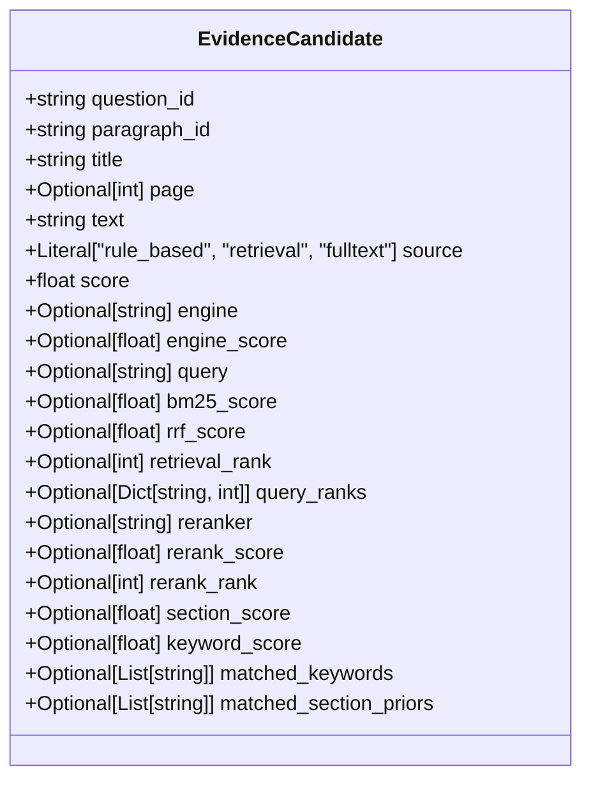
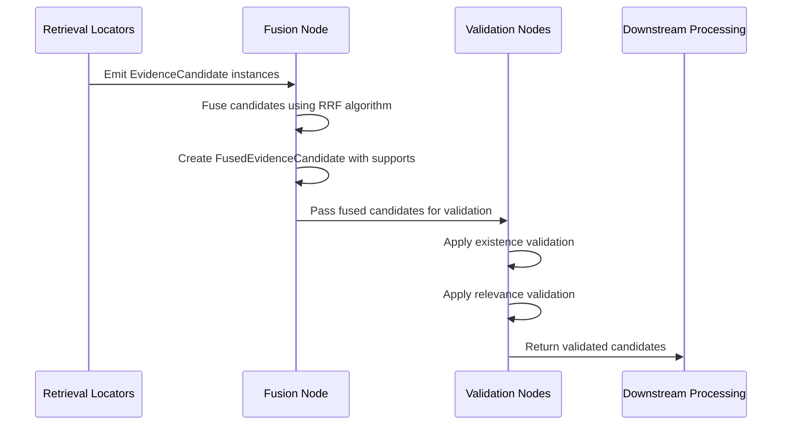
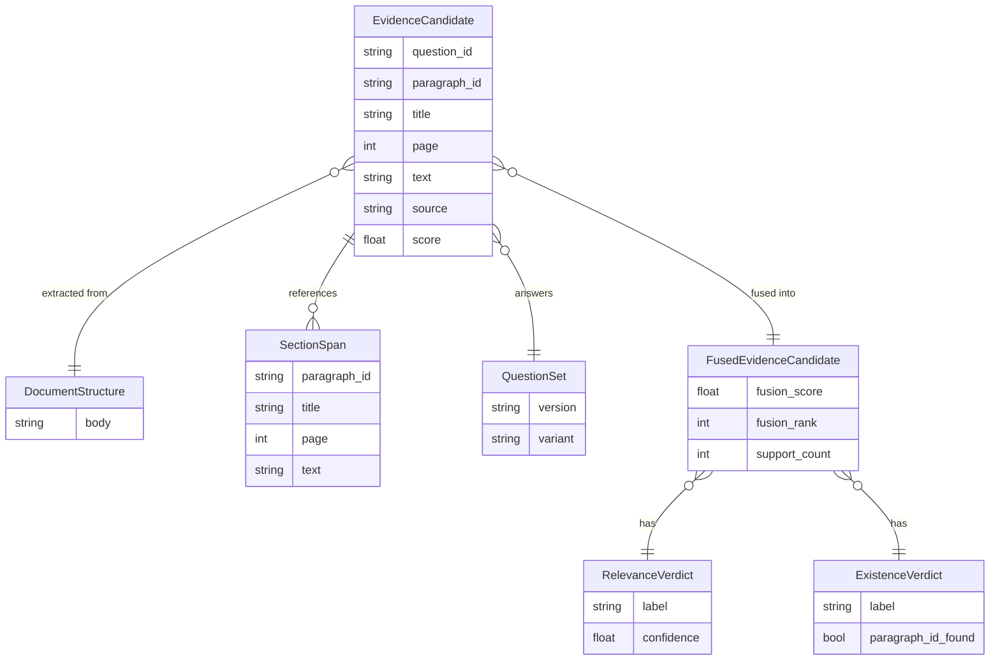

# Evidence Candidate Model

<cite>
**Referenced Files in This Document**   
- [evidence.py](file://src/schemas/internal/evidence.py)
- [retrieval_bm25.py](file://src/pipelines/graphs/nodes/locators/retrieval_bm25.py)
- [retrieval_splade.py](file://src/pipelines/graphs/nodes/locators/retrieval_splade.py)
- [rule_based.py](file://src/pipelines/graphs/nodes/locators/rule_based.py)
- [fusion.py](file://src/evidence/fusion.py)
- [fusion.py](file://src/pipelines/graphs/nodes/fusion.py)
- [selectors.py](file://src/evidence/validators/selectors.py)
- [existence.py](file://src/pipelines/graphs/nodes/validators/existence.py)
- [completeness.py](file://src/pipelines/graphs/nodes/validators/completeness.py)
- [documents.py](file://src/schemas/internal/documents.py)
</cite>

## Table of Contents
1. [Introduction](#introduction)
2. [Evidence Candidate Structure](#evidence-candidate-structure)
3. [Validation and Fusion Process](#validation-and-fusion-process)
4. [Relationship with Other Entities](#relationship-with-other-entities)
5. [Performance Considerations](#performance-considerations)
6. [Extension and Customization](#extension-and-customization)
7. [Conclusion](#conclusion)

## Introduction

The EvidenceCandidate model serves as a fundamental component in the evidence retrieval and validation system, representing paragraph-level evidence fragments associated with specific questions. This model captures not only the textual content but also rich metadata about the source, confidence, and retrieval context. The system employs multiple retrieval strategies including rule-based, BM25, and SPLADE-based approaches, which are then fused and validated through a multi-stage pipeline. The EvidenceCandidate model plays a central role throughout this process, evolving from initial retrieval through fusion and validation stages.

**Section sources**
- [evidence.py](file://src/schemas/internal/evidence.py#L21-L50)

## Evidence Candidate Structure

The EvidenceCandidate model is defined as a Pydantic BaseModel that encapsulates various attributes of retrieved evidence fragments. At its core, each candidate is associated with a specific question through the `question_id` field and identifies the source paragraph via `paragraph_id`. The model includes the actual text content in the `text` field and the section title in the `title` field, providing context for the evidence.

Source attribution is a critical aspect of the model, captured through the `source` field which can take values of "rule_based", "retrieval", or "fulltext", indicating the origin of the evidence. The primary confidence metric is stored in the `score` field, constrained to non-negative values through Pydantic's Field validator with `ge=0`.

The model incorporates multiple scoring mechanisms from different retrieval engines. The `engine` field identifies the specific retrieval engine (e.g., "bm25" or "splade"), while `engine_score` stores the native score from that engine. For retrieval-based approaches, additional metrics include `bm25_score`, `rrf_score`, and `retrieval_rank`, which capture the BM25-specific score, Reciprocal Rank Fusion score, and positional rank respectively.

Ranking refinement is supported through reranking capabilities, with fields like `reranker`, `rerank_score`, and `rerank_rank` capturing information from secondary ranking models such as cross-encoders. Contextual scoring is enhanced through `section_score` and `keyword_score`, which reflect the relevance of section priors and keyword matches. The `matched_keywords` and `matched_section_priors` fields provide transparency into which specific keywords and section titles contributed to the evidence selection.

**Diagram sources**
- [evidence.py](file://src/schemas/internal/evidence.py#L21-L50)

**Section sources**
- [evidence.py](file://src/schemas/internal/evidence.py#L21-L50)

## Validation and Fusion Process

The lifecycle of an EvidenceCandidate involves multiple stages of processing, beginning with retrieval and culminating in validation. The retrieval phase generates candidates through various locators, each implementing different strategies. The rule-based locator creates candidates by matching section titles and keywords against predefined rules, assigning scores based on section priors and keyword matches. The BM25 and SPLADE-based locators employ information retrieval techniques to identify relevant paragraphs, with the BM25 approach using traditional term frequency-inverse document frequency scoring and SPLADE leveraging sparse vector representations from transformer models.

After retrieval, candidates from multiple engines are fused using Reciprocal Rank Fusion (RRF) in the fusion stage. The `fuse_candidates_for_question` function in the evidence fusion module combines candidates from different engines, creating FusedEvidenceCandidate instances that maintain provenance through the `supports` field, which tracks the contribution from each engine. This fusion process considers the rank of each candidate in its respective engine's results, with higher-ranked candidates receiving greater weight in the final fusion score.

Validation occurs in a multi-stage process where candidates are progressively filtered based on quality criteria. The existence validator checks whether the paragraph actually exists in the document structure and whether the text content matches expectations. The relevance validator assesses whether the candidate is genuinely relevant to the question, potentially using LLM-based judgment. The `select_passed_candidates` function in the validators selectors module implements the final filtering logic, retaining only candidates that have passed both existence and relevance checks with sufficient confidence.

**Diagram sources**
- [fusion.py](file://src/evidence/fusion.py#L18-L107)
- [fusion.py](file://src/pipelines/graphs/nodes/fusion.py#L16-L112)
- [selectors.py](file://src/evidence/validators/selectors.py#L10-L27)

**Section sources**
- [retrieval_bm25.py](file://src/pipelines/graphs/nodes/locators/retrieval_bm25.py#L48-L403)
- [retrieval_splade.py](file://src/pipelines/graphs/nodes/locators/retrieval_splade.py#L49-L487)
- [rule_based.py](file://src/pipelines/graphs/nodes/locators/rule_based.py#L18-L218)
- [fusion.py](file://src/evidence/fusion.py#L18-L107)
- [fusion.py](file://src/pipelines/graphs/nodes/fusion.py#L16-L112)
- [existence.py](file://src/pipelines/graphs/nodes/validators/existence.py#L13-L106)
- [completeness.py](file://src/pipelines/graphs/nodes/validators/completeness.py#L20-L82)

## Relationship with Other Entities

The EvidenceCandidate model interacts with several other key entities in the system, forming a cohesive architecture for evidence processing. Its primary relationship is with the DocumentStructure model, which provides the source content from which evidence fragments are extracted. The DocumentStructure contains a collection of SectionSpan objects, each representing a paragraph with metadata such as title, page number, and bounding box coordinates. When a candidate is created, it references a specific SectionSpan through its paragraph_id, establishing a direct link to the source document structure.

The EvidenceCandidate is also closely tied to the QuestionSet entity, which defines the questions for which evidence is being retrieved. Each candidate is associated with a specific question_id that corresponds to an entry in the QuestionSet. This relationship ensures that evidence is always contextualized within the specific question it aims to answer, supporting targeted retrieval and validation.

During the fusion process, EvidenceCandidate instances are transformed into FusedEvidenceCandidate objects, which represent the merged results from multiple retrieval engines. The FusedEvidenceCandidate maintains a reference to the original EvidenceCandidate while adding fusion-specific metadata such as fusion_score, fusion_rank, and support_count. This hierarchical relationship allows the system to preserve the provenance of each piece of evidence while presenting a unified, ranked result set.

The validation process introduces additional relationships with verdict models such as RelevanceVerdict and ExistenceVerdict. These verdicts are attached to FusedEvidenceCandidate instances as optional fields, providing quality assessments that inform downstream decision-making. The CompletenessItem model further extends this relationship by tracking the status of evidence collection across multiple questions, ensuring comprehensive coverage.

**Diagram sources**
- [evidence.py](file://src/schemas/internal/evidence.py#L21-L147)
- [documents.py](file://src/schemas/internal/documents.py#L20-L43)

**Section sources**
- [evidence.py](file://src/schemas/internal/evidence.py#L21-L147)
- [documents.py](file://src/schemas/internal/documents.py#L20-L43)

## Performance Considerations

Handling large numbers of EvidenceCandidate instances efficiently requires careful consideration of memory usage and processing time. The model's design incorporates several features to optimize performance. The use of Pydantic's ConfigDict with extra="forbid" prevents the accidental addition of unstructured data, ensuring predictable memory footprint. Optional fields are used extensively, allowing the system to omit unnecessary data in memory-constrained scenarios.

When processing large document collections, the system employs batching strategies to manage memory consumption. Retrieval engines like BM25 and SPLADE process documents in batches, with configurable batch_size parameters that balance memory usage and processing speed. The fusion process is optimized to handle multiple retrieval results efficiently, using dictionary-based lookups to merge candidates from different engines without excessive memory allocation.

Filtering and ranking strategies are designed to minimize computational overhead. The system implements early filtering through the validation pipeline, where candidates are progressively eliminated based on quality criteria. This reduces the number of candidates that need to be processed in later stages. The select_passed_candidates function implements efficient filtering logic that can be customized based on confidence thresholds, allowing users to balance precision and recall according to their requirements.

For large-scale deployments, the system supports configuration options that control the number of candidates retained at each stage. The top_k parameter limits the number of candidates returned for each question, while per_query_top_n controls the number of candidates considered during retrieval. These parameters help prevent memory exhaustion when processing documents with many paragraphs or when handling complex queries that generate numerous potential matches.

**Section sources**
- [retrieval_bm25.py](file://src/pipelines/graphs/nodes/locators/retrieval_bm25.py#L178-L185)
- [retrieval_splade.py](file://src/pipelines/graphs/nodes/locators/retrieval_splade.py#L179-L185)
- [fusion.py](file://src/pipelines/graphs/nodes/fusion.py#L37-L39)
- [selectors.py](file://src/evidence/validators/selectors.py#L10-L27)

## Extension and Customization

The EvidenceCandidate model is designed to be extensible, allowing for customization to meet specialized validation or domain requirements. The model's structure supports the addition of custom metadata fields through inheritance or composition patterns. For domain-specific validation, developers can extend the validation pipeline by implementing custom validator classes that attach additional verdicts to the FusedEvidenceCandidate.

The system's modular architecture facilitates the integration of new retrieval engines. Developers can create custom locator nodes that generate EvidenceCandidate instances using domain-specific algorithms, which are then automatically incorporated into the fusion process. The fusion algorithm is engine-agnostic, accepting candidates from any source as long as they conform to the EvidenceCandidate schema.

Custom scoring strategies can be implemented by extending the existing scoring framework. While the model includes fields for various scores (bm25_score, rrf_score, etc.), additional score types can be added to support novel retrieval methods. The section_score and keyword_score fields provide a foundation for domain-specific weighting schemes, which can be enhanced with custom logic in the locator nodes.

The validation pipeline is particularly extensible, allowing for the addition of new validation criteria. Developers can create custom validator nodes that assess evidence quality based on domain-specific rules, attaching their verdicts to the FusedEvidenceCandidate. These custom validators can leverage the existing infrastructure for configuration management and error handling, ensuring consistency with the rest of the system.

**Section sources**
- [evidence.py](file://src/schemas/internal/evidence.py#L21-L50)
- [fusion.py](file://src/evidence/fusion.py#L18-L107)
- [selectors.py](file://src/evidence/validators/selectors.py#L10-L27)

## Conclusion

The EvidenceCandidate model serves as a comprehensive representation of retrieved evidence fragments, capturing not only the textual content but also rich metadata about source, confidence, and retrieval context. Its design supports a multi-stage processing pipeline that begins with retrieval from multiple engines, proceeds through fusion using RRF, and concludes with validation based on existence and relevance criteria. The model's relationships with DocumentStructure, QuestionSet, and other entities create a cohesive architecture for evidence-based reasoning. Performance optimizations ensure efficient handling of large document collections, while the extensible design allows for customization to meet specialized domain requirements. This robust foundation enables reliable and transparent evidence processing for complex decision-making tasks.