# Internal Data Entities

<cite>
**Referenced Files in This Document**   
- [evidence.py](file://src/schemas/internal/evidence.py)
- [documents.py](file://src/schemas/internal/documents.py)
- [locator.py](file://src/schemas/internal/locator.py)
- [decisions.py](file://src/schemas/internal/decisions.py)
- [results.py](file://src/schemas/internal/results.py)
- [rob2.py](file://src/schemas/internal/rob2.py)
- [preprocess.py](file://src/pipelines/graphs/nodes/preprocess.py)
- [retrieval_bm25.py](file://src/pipelines/graphs/nodes/locators/retrieval_bm25.py)
- [retrieval_splade.py](file://src/pipelines/graphs/nodes/locators/retrieval_splade.py)
- [rule_based.py](file://src/pipelines/graphs/nodes/locators/rule_based.py)
- [fusion.py](file://src/evidence/fusion.py)
- [domain_audit.py](file://src/pipelines/graphs/nodes/domain_audit.py)
- [aggregate.py](file://src/pipelines/graphs/nodes/aggregate.py)
</cite>

## Table of Contents
1. [Introduction](#introduction)
2. [Core Entity Models](#core-entity-models)
3. [Entity Relationships and Data Flow](#entity-relationships-and-data-flow)
4. [EvidenceCandidate: Source Attribution and Confidence Scoring](#evidencecandidate-source-attribution-and-confidence-scoring)
5. [DocumentStructure: Section Hierarchy and Metadata](#documentstructure-section-hierarchy-and-metadata)
6. [LocatorResult: Evidence Positioning](#locatorresult-evidence-positioning)
7. [DecisionRecord: Domain Judgments](#decisionrecord-domain-judgments)
8. [Performance Implications and Design Trade-offs](#performance-implications-and-design-trade-offs)
9. [Extensibility and Customization](#extensibility-and-customization)
10. [Entity Lifecycle and Processing Stages](#entity-lifecycle-and-processing-stages)

## Introduction
This document provides comprehensive documentation for the internal data entity models that represent domain-specific concepts within the ROB2 (Risk of Bias 2) assessment system. The system is designed to evaluate the methodological quality of randomized clinical trials through a structured framework of signaling questions across five domains. The core data entities—EvidenceCandidate, DocumentStructure, LocatorResult, and DecisionRecord—form the backbone of this assessment pipeline, enabling systematic evidence retrieval, validation, and judgment aggregation.

The entities are implemented using Pydantic models to ensure data integrity, validation, and type safety. They flow through a multi-stage processing pipeline that begins with document preprocessing and ends with final risk aggregation. Each entity serves a specific purpose: EvidenceCandidate represents potential evidence fragments with confidence scores, DocumentStructure captures the hierarchical organization of source documents, LocatorResult positions evidence within the document context, and DecisionRecord encapsulates domain-level judgments with supporting rationale.

This documentation explains the field semantics, validation constraints, and business rules governing these entities, illustrates their relationships and interactions, and provides guidance on performance optimization and extensibility. The goal is to provide a clear understanding of how these entities work together to support robust, transparent, and reproducible risk of bias assessments.

## Core Entity Models

The system's data model is organized into several key modules, each focusing on a specific aspect of the assessment process. The core entities are defined in the `src/schemas/internal/` directory and are used throughout the processing pipeline.

```mermaid
classDiagram
class EvidenceCandidate {
+question_id : str
+paragraph_id : str
+title : str
+page : Optional[int]
+text : str
+source : Literal["rule_based", "retrieval", "fulltext"]
+score : float
+engine : Optional[str]
+engine_score : Optional[float]
+query : Optional[str]
+bm25_score : Optional[float]
+rrf_score : Optional[float]
+retrieval_rank : Optional[int]
+query_ranks : Optional[Dict[str, int]]
+reranker : Optional[str]
+rerank_score : Optional[float]
+rerank_rank : Optional[int]
+section_score : Optional[float]
+keyword_score : Optional[float]
+matched_keywords : Optional[List[str]]
+matched_section_priors : Optional[List[str]]
}
class FusedEvidenceCandidate {
+question_id : str
+paragraph_id : str
+title : str
+page : Optional[int]
+text : str
+fusion_score : float
+fusion_rank : int
+support_count : int
+supports : List[EvidenceSupport]
+relevance : Optional[RelevanceVerdict]
+existence : Optional[ExistenceVerdict]
}
class EvidenceSupport {
+engine : str
+rank : int
+score : float
+query : Optional[str]
}
class RelevanceVerdict {
+label : Literal["relevant", "irrelevant", "unknown"]
+confidence : Optional[float]
+supporting_quote : Optional[str]
}
class ExistenceVerdict {
+label : Literal["pass", "fail"]
+reason : Optional[str]
+paragraph_id_found : bool
+text_match : Optional[bool]
+quote_found : Optional[bool]
}
class DocStructure {
+body : str
+sections : List[SectionSpan]
}
class SectionSpan {
+paragraph_id : str
+title : str
+page : Optional[int]
+pages : Optional[List[int]]
+bbox : Optional[BoundingBox]
+bboxes : Optional[List[BoundingBox]]
+bboxes_by_page : Optional[dict[str, List[BoundingBox]]]
+doc_item_ids : Optional[List[str]]
+text : str
}
class BoundingBox {
+left : float
+top : float
+right : float
+bottom : float
+origin : Optional[str]
}
class LocatorRules {
+version : str
+variant : Literal["standard"]
+defaults : LocatorDefaults
+domains : Dict[DomainId, DomainLocatorRule]
+question_overrides : Dict[str, QuestionLocatorOverride]
}
class DomainLocatorRule {
+section_priors : List[str]
+keywords : List[str]
}
class QuestionLocatorOverride {
+section_priors : Optional[List[str]]
+keywords : Optional[List[str]]
}
class DomainDecision {
+domain : DomainId
+effect_type : Optional[Literal["assignment", "adherence"]]
+risk : DomainRisk
+risk_rationale : str
+answers : List[DomainAnswer]
+missing_questions : List[str]
}
class DomainAnswer {
+question_id : str
+answer : AnswerOption
+rationale : str
+evidence_refs : List[EvidenceRef]
+confidence : Optional[float]
}
class EvidenceRef {
+paragraph_id : str
+page : Optional[int]
+title : Optional[str]
+quote : Optional[str]
}
class Rob2FinalOutput {
+variant : Literal["standard"]
+question_set_version : str
+overall : Rob2OverallResult
+domains : List[Rob2DomainResult]
+citations : List[Citation]
}
class Rob2DomainResult {
+domain : DomainId
+effect_type : Optional[Literal["assignment", "adherence"]]
+risk : DomainRisk
+risk_rationale : str
+answers : List[Rob2AnswerResult]
+missing_questions : List[str]
}
class Rob2AnswerResult {
+question_id : str
+rob2_id : Optional[str]
+text : Optional[str]
+answer : AnswerOption
+rationale : str
+evidence_refs : List[EvidenceRef]
+confidence : Optional[float]
}
class Citation {
+paragraph_id : str
+page : Optional[int]
+title : Optional[str]
+text : Optional[str]
+uses : List[CitationUse]
}
class CitationUse {
+domain : DomainId
+question_id : str
+quote : Optional[str]
}
class Rob2Question {
+question_id : str
+rob2_id : Optional[str]
+domain : Literal["D1", "D2", "D3", "D4", "D5"]
+effect_type : Optional[Literal["assignment", "adherence"]]
+text : str
+options : List[str]
+conditions : List[QuestionCondition]
+order : int
}
class QuestionCondition {
+operator : Literal["any", "all"]
+dependencies : List[QuestionDependency]
+note : Optional[str]
}
class QuestionDependency {
+question_id : str
+allowed_answers : List[str]
}
class QuestionSet {
+version : str
+variant : Literal["standard"]
+questions : List[Rob2Question]
}
EvidenceCandidate --> EvidenceSupport : "has"
FusedEvidenceCandidate --> EvidenceSupport : "has multiple"
FusedEvidenceCandidate --> RelevanceVerdict : "has optional"
FusedEvidenceCandidate --> ExistenceVerdict : "has optional"
DocStructure --> SectionSpan : "contains multiple"
SectionSpan --> BoundingBox : "has optional"
LocatorRules --> DomainLocatorRule : "has per domain"
LocatorRules --> QuestionLocatorOverride : "has per question"
DomainDecision --> DomainAnswer : "contains multiple"
DomainAnswer --> EvidenceRef : "references"
Rob2FinalOutput --> Rob2DomainResult : "contains multiple"
Rob2DomainResult --> Rob2AnswerResult : "contains multiple"
Rob2AnswerResult --> EvidenceRef : "references"
Rob2FinalOutput --> Citation : "contains multiple"
Citation --> CitationUse : "contains multiple"
QuestionSet --> Rob2Question : "contains multiple"
Rob2Question --> QuestionCondition : "has optional"
QuestionCondition --> QuestionDependency : "contains multiple"
```

**Diagram sources**
- [evidence.py](file://src/schemas/internal/evidence.py#L10-L170)
- [documents.py](file://src/schemas/internal/documents.py#L10-L43)
- [locator.py](file://src/schemas/internal/locator.py#L12-L66)
- [decisions.py](file://src/schemas/internal/decisions.py#L15-L57)
- [results.py](file://src/schemas/internal/results.py#L15-L81)
- [rob2.py](file://src/schemas/internal/rob2.py#L12-L129)

**Section sources**
- [evidence.py](file://src/schemas/internal/evidence.py#L1-L170)
- [documents.py](file://src/schemas/internal/documents.py#L1-L43)
- [locator.py](file://src/schemas/internal/locator.py#L1-L66)
- [decisions.py](file://src/schemas/internal/decisions.py#L1-L57)
- [results.py](file://src/schemas/internal/results.py#L1-L81)
- [rob2.py](file://src/schemas/internal/rob2.py#L1-L129)

## Entity Relationships and Data Flow

The internal data entities flow through a well-defined processing pipeline that transforms raw documents into structured risk assessments. The data flow begins with document preprocessing, proceeds through evidence retrieval and fusion, continues with validation and domain reasoning, and concludes with aggregation and final output generation.

**Diagram sources**
- [preprocess.py](file://src/pipelines/graphs/nodes/preprocess.py#L28-L36)
- [rule_based.py](file://src/pipelines/graphs/nodes/locators/rule_based.py#L18-L46)
- [retrieval_bm25.py](file://src/pipelines/graphs/nodes/locators/retrieval_bm25.py#L48-L367)
- [retrieval_splade.py](file://src/pipelines/graphs/nodes/locators/retrieval_splade.py#L49-L390)
- [fusion.py](file://src/evidence/fusion.py#L18-L107)
- [relevance.py](file://src/pipelines/graphs/nodes/validators/relevance.py#L24-L174)
- [existence.py](file://src/pipelines/graphs/nodes/validators/existence.py#L13-L82)
- [domain_audit.py](file://src/pipelines/graphs/nodes/domain_audit.py#L119-L243)
- [aggregate.py](file://src/pipelines/graphs/nodes/aggregate.py#L32-L109)

**Section sources**
- [preprocess.py](file://src/pipelines/graphs/nodes/preprocess.py#L1-L444)
- [rule_based.py](file://src/pipelines/graphs/nodes/locators/rule_based.py#L1-L219)
- [retrieval_bm25.py](file://src/pipelines/graphs/nodes/locators/retrieval_bm25.py#L1-L404)
- [retrieval_splade.py](file://src/pipelines/graphs/nodes/locators/retrieval_splade.py#L1-L488)
- [fusion.py](file://src/evidence/fusion.py#L1-L112)
- [relevance.py](file://src/pipelines/graphs/nodes/validators/relevance.py#L1-L207)
- [existence.py](file://src/pipelines/graphs/nodes/validators/existence.py#L1-L107)
- [domain_audit.py](file://src/pipelines/graphs/nodes/domain_audit.py#L1-L789)
- [aggregate.py](file://src/pipelines/graphs/nodes/aggregate.py#L1-L189)

## EvidenceCandidate: Source Attribution and Confidence Scoring

The `EvidenceCandidate` entity represents a paragraph-level evidence fragment that may be relevant to a specific ROB2 signaling question. It serves as the primary unit of evidence throughout the retrieval and fusion stages of the pipeline. Each candidate is attributed to a specific source (rule-based, retrieval, or fulltext) and carries multiple confidence scores that reflect its relevance and quality.

The entity includes several key fields for source attribution:
- `source`: Indicates the origin of the candidate (rule_based, retrieval, or fulltext)
- `engine`: Specifies the retrieval engine used (e.g., bm25, splade)
- `query`: The search query that retrieved this candidate
- `matched_keywords` and `matched_section_priors`: Keywords and section hierarchies that matched during rule-based retrieval

Confidence scoring is implemented through multiple complementary metrics:
- `score`: The primary relevance score, which may be a fusion of multiple signals
- `bm25_score` and `rrf_score`: Scores from BM25 retrieval and Reciprocal Rank Fusion
- `rerank_score`: Score from cross-encoder re-ranking
- `section_score` and `keyword_score`: Scores from structural and keyword matching

The `EvidenceCandidate` model includes validation constraints to ensure data integrity:
- All numeric scores are constrained to be non-negative (`ge=0`)
- Ranks are constrained to be positive integers (`ge=1`)
- The `extra="forbid"` configuration prevents the addition of unexpected fields

During the fusion process, multiple `EvidenceCandidate` instances from different retrieval engines are merged into `FusedEvidenceCandidate` objects that preserve the provenance of each source through the `supports` field, which contains a list of `EvidenceSupport` objects. This design enables transparent attribution of evidence quality to specific retrieval strategies.

**Section sources**
- [evidence.py](file://src/schemas/internal/evidence.py#L21-L50)
- [rule_based.py](file://src/pipelines/graphs/nodes/locators/rule_based.py#L73-L115)
- [retrieval_bm25.py](file://src/pipelines/graphs/nodes/locators/retrieval_bm25.py#L275-L293)
- [retrieval_splade.py](file://src/pipelines/graphs/nodes/locators/retrieval_splade.py#L347-L364)

## DocumentStructure: Section Hierarchy and Metadata

The `DocumentStructure` entity represents the normalized structure of a source document after preprocessing. It captures the hierarchical organization of the document through section spans and provides rich metadata for evidence positioning and context preservation.

The core component is the `DocStructure` model, which contains:
- `body`: The complete text content of the document
- `sections`: A list of `SectionSpan` objects representing paragraph-level segments

Each `SectionSpan` includes comprehensive metadata:
- `paragraph_id`: A stable identifier for the paragraph
- `title`: The section heading path (e.g., "Methods > Participants")
- `page`: The page number where the paragraph appears
- `bbox`: Bounding box coordinates from Docling provenance
- `doc_item_ids`: Document item identifiers for strong backtracing

The preprocessing pipeline uses Docling to extract this structured information from PDF documents. The `preprocess_node` function in `preprocess.py` orchestrates this process, using Docling's layout analysis and chunking capabilities to create the `DocStructure`. The preprocessing ensures that each paragraph maintains its positional context within the document, which is critical for evidence validation and citation generation.

The `SectionSpan` model supports multiple representations of positional metadata:
- Single-page documents use the `page` field
- Multi-page spans use the `pages` field
- Visual positioning is captured through `bbox` and `bboxes` fields
- Hierarchical context is preserved in the `title` field as a path-like string

This rich metadata enables sophisticated evidence positioning strategies, such as filtering retrieval results by section priors or validating that cited evidence appears in the expected document location.

**Section sources**
- [documents.py](file://src/schemas/internal/documents.py#L34-L43)
- [preprocess.py](file://src/pipelines/graphs/nodes/preprocess.py#L28-L36)
- [preprocess.py](file://src/pipelines/graphs/nodes/preprocess.py#L261-L303)

## LocatorResult: Evidence Positioning

The `LocatorResult` concept is implemented through the evidence retrieval components of the system, which position evidence candidates relative to specific ROB2 signaling questions. The locator subsystem uses multiple strategies—rule-based, BM25 retrieval, and SPLADE retrieval—to identify relevant evidence fragments and position them within the assessment framework.

The rule-based locator uses domain-specific heuristics defined in `LocatorRules`:
- `section_priors`: Section title patterns that indicate relevance
- `keywords`: Domain-specific keywords that signal relevant content
- `question_overrides`: Per-question customizations of the default rules

The retrieval-based locators (BM25 and SPLADE) use query planning and ranking to position evidence:
- Multi-query planning generates multiple search queries per question
- Structure-aware retrieval filters and boosts results based on section priors
- Reciprocal Rank Fusion (RRF) combines results from multiple queries
- Cross-encoder re-ranking improves relevance scoring

The `EvidenceCandidate` entity captures the positioning information through several fields:
- `retrieval_rank`: The rank position in the retrieval results
- `query_ranks`: Ranks from individual queries in the query plan
- `section_score`: Score from section prior matching
- `matched_section_priors`: Specific section titles that matched

The locator components are designed to be configurable and extensible. Parameters such as `top_k`, `rrf_k`, `section_bonus_weight`, and reranking options can be adjusted to optimize performance for different document types or assessment requirements. The system supports both deterministic and LLM-driven query planning, allowing for a trade-off between consistency and adaptability.

**Section sources**
- [locator.py](file://src/schemas/internal/locator.py#L12-L66)
- [rule_based.py](file://src/pipelines/graphs/nodes/locators/rule_based.py#L18-L219)
- [retrieval_bm25.py](file://src/pipelines/graphs/nodes/locators/retrieval_bm25.py#L48-L367)
- [retrieval_splade.py](file://src/pipelines/graphs/nodes/locators/retrieval_splade.py#L49-L443)

## DecisionRecord: Domain Judgments

The `DecisionRecord` concept is implemented through the `DomainDecision` and `Rob2FinalOutput` entities, which capture domain-level judgments and their aggregation into an overall risk assessment. These entities represent the culmination of the evidence evaluation process, transforming retrieved and validated evidence into structured judgments.

The `DomainDecision` model contains:
- `domain`: The ROB2 domain (D1-D5)
- `effect_type`: Assignment or adherence effect (for D2)
- `risk`: The risk judgment (low, some_concerns, high)
- `risk_rationale`: Explanation for the risk judgment
- `answers`: Individual signaling question responses
- `missing_questions`: Questions not addressed

Each `DomainAnswer` includes:
- `question_id`: Reference to the signaling question
- `answer`: Response option (Y, PY, PN, N, NI, NA)
- `rationale`: Reasoning for the answer
- `evidence_refs`: Citations to supporting evidence
- `confidence`: Confidence level in the judgment

The final output is structured as `Rob2FinalOutput`, which aggregates domain decisions and generates citations. The `aggregate_node` function processes domain decisions, computes the overall risk according to ROB2 rules, and formats the results for presentation. The citation system tracks how each piece of evidence is used across domains and questions, enabling transparent traceability from judgment to source.

The decision records are designed to support audit and validation workflows. The domain audit system can compare automated decisions with human-like judgments and patch the evidence set when discrepancies are found. This creates a feedback loop that improves the quality of subsequent decisions.

**Section sources**
- [decisions.py](file://src/schemas/internal/decisions.py#L38-L48)
- [results.py](file://src/schemas/internal/results.py#L56-L70)
- [domain_audit.py](file://src/pipelines/graphs/nodes/domain_audit.py#L119-L243)
- [aggregate.py](file://src/pipelines/graphs/nodes/aggregate.py#L32-L109)

## Performance Implications and Design Trade-offs

The entity design choices in this system reflect careful consideration of performance implications and trade-offs between different optimization goals. The primary design decisions involve denormalization for faster access versus storage efficiency, and the balance between rich metadata and processing overhead.

The most significant denormalization occurs in the `EvidenceCandidate` and `FusedEvidenceCandidate` entities, which store redundant information from multiple sources:
- Text content is duplicated across candidates rather than referenced
- Section titles and page numbers are copied rather than linked
- Multiple scoring metrics are stored alongside the primary score

This denormalization improves access performance by eliminating joins and lookups during processing. When validators and domain agents access evidence candidates, all required information is available in a single object, reducing database queries or file reads. However, this comes at the cost of increased memory usage and storage requirements.

The system employs several strategies to mitigate the performance costs of rich metadata:
- Optional fields are used extensively to avoid storing null values
- The `extra="forbid"` configuration prevents schema drift and unexpected data
- Validation is performed at the model level to catch errors early
- Caching is used in preprocessing components to avoid redundant computation

The fusion process represents a key performance trade-off. The `fuse_candidates_for_question` function combines results from multiple retrieval engines using Reciprocal Rank Fusion, which requires sorting and merging operations. While this increases processing time, it produces higher-quality evidence bundles that improve downstream decision accuracy.

The validation components introduce additional performance considerations:
- LLM-based relevance validation has high computational cost but improves precision
- Deterministic existence validation is fast but less flexible
- The system allows configuration of validation depth through parameters like `top_n` and `min_confidence`

Overall, the design prioritizes processing speed and simplicity over storage efficiency, recognizing that the primary bottleneck in the assessment workflow is human review time rather than computational resources.

**Section sources**
- [evidence.py](file://src/schemas/internal/evidence.py#L21-L147)
- [fusion.py](file://src/evidence/fusion.py#L18-L107)
- [relevance.py](file://src/pipelines/graphs/nodes/validators/relevance.py#L24-L174)
- [existence.py](file://src/pipelines/graphs/nodes/validators/existence.py#L13-L82)
- [preprocess.py](file://src/pipelines/graphs/nodes/preprocess.py#L24-L26)

## Extensibility and Customization

The entity models are designed to be extensible and customizable for different assessment requirements and metadata needs. The system provides several mechanisms for extending the models without modifying their core structure.

The primary extension mechanism is the use of Pydantic's `extra="forbid"` configuration, which can be selectively relaxed in subclasses or through configuration. While the core models prevent unexpected fields to ensure data integrity, the system allows for controlled extensibility through:
- Optional fields that can be populated with custom metadata
- Dictionary fields like `bboxes_by_page` that can accommodate additional data
- Configuration parameters that modify behavior without changing the schema

The locator rules system demonstrates a flexible approach to customization:
- Domain-specific rules can be defined for each ROB2 domain
- Per-question overrides allow fine-grained control
- The rules are loaded from external configuration, enabling updates without code changes

The processing pipeline supports extension through its modular design:
- New retrieval engines can be added by implementing the same interface
- Additional validation steps can be inserted into the pipeline
- Custom domain agents can be developed for specialized assessment needs

For extending the models with additional metadata, the recommended approach is to:
1. Use existing optional fields when possible
2. Add new optional fields to the relevant model with clear documentation
3. Create extension models that inherit from the core models when substantial changes are needed
4. Update the processing components to populate and use the new fields

The system's configuration system allows for runtime customization of behavior:
- Scoring weights can be adjusted for different retrieval engines
- Validation thresholds can be tuned for precision/recall trade-offs
- Processing depth can be controlled through parameters like `top_k` and `top_n`

This extensibility ensures that the system can adapt to new assessment frameworks, document types, and organizational requirements while maintaining the integrity of its core data models.

**Section sources**
- [locator.py](file://src/schemas/internal/locator.py#L12-L66)
- [evidence.py](file://src/schemas/internal/evidence.py#L10-L170)
- [documents.py](file://src/schemas/internal/documents.py#L10-L43)
- [preprocess.py](file://src/pipelines/graphs/nodes/preprocess.py#L208-L216)

## Entity Lifecycle and Processing Stages

The internal data entities progress through a well-defined lifecycle that corresponds to the stages of the ROB2 assessment pipeline. Each entity type appears at specific points in the processing flow, with transformations and enrichments occurring at each stage.

**Diagram sources**
- [preprocess.py](file://src/pipelines/graphs/nodes/preprocess.py#L28-L36)
- [rule_based.py](file://src/pipelines/graphs/nodes/locators/rule_based.py#L18-L46)
- [retrieval_bm25.py](file://src/pipelines/graphs/nodes/locators/retrieval_bm25.py#L48-L367)
- [retrieval_splade.py](file://src/pipelines/graphs/nodes/locators/retrieval_splade.py#L49-L443)
- [fusion.py](file://src/evidence/fusion.py#L18-L107)
- [relevance.py](file://src/pipelines/graphs/nodes/validators/relevance.py#L24-L174)
- [existence.py](file://src/pipelines/graphs/nodes/validators/existence.py#L13-L82)
- [domain_audit.py](file://src/pipelines/graphs/nodes/domain_audit.py#L119-L243)
- [aggregate.py](file://src/pipelines/graphs/nodes/aggregate.py#L32-L109)

**Section sources**
- [preprocess.py](file://src/pipelines/graphs/nodes/preprocess.py#L1-L444)
- [rule_based.py](file://src/pipelines/graphs/nodes/locators/rule_based.py#L1-L219)
- [retrieval_bm25.py](file://src/pipelines/graphs/nodes/locators/retrieval_bm25.py#L1-L404)
- [retrieval_splade.py](file://src/pipelines/graphs/nodes/locators/retrieval_splade.py#L1-L488)
- [fusion.py](file://src/evidence/fusion.py#L1-L112)
- [relevance.py](file://src/pipelines/graphs/nodes/validators/relevance.py#L1-L207)
- [existence.py](file://src/pipelines/graphs/nodes/validators/existence.py#L1-L107)
- [domain_audit.py](file://src/pipelines/graphs/nodes/domain_audit.py#L1-L789)
- [aggregate.py](file://src/pipelines/graphs/nodes/aggregate.py#L1-L189)

At each processing stage, entities are transformed and enriched:
1. **Preprocessing**: Raw PDFs are converted to `DocumentStructure` with section hierarchy and metadata
2. **Retrieval**: Multiple locator strategies generate `EvidenceCandidate` instances with source attribution
3. **Fusion**: Candidates from different engines are merged into `FusedEvidenceCandidate` objects with multi-engine support
4. **Validation**: Candidates are annotated with relevance and existence verdicts
5. **Reasoning**: Domain agents generate `DomainDecision` records based on validated evidence
6. **Aggregation**: Domain decisions are combined into `Rob2FinalOutput` with citations and overall risk

This staged lifecycle ensures that each entity type serves a specific purpose in the assessment workflow, with clear interfaces between processing stages and opportunities for quality control and intervention.