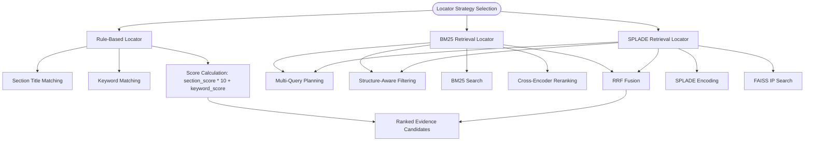
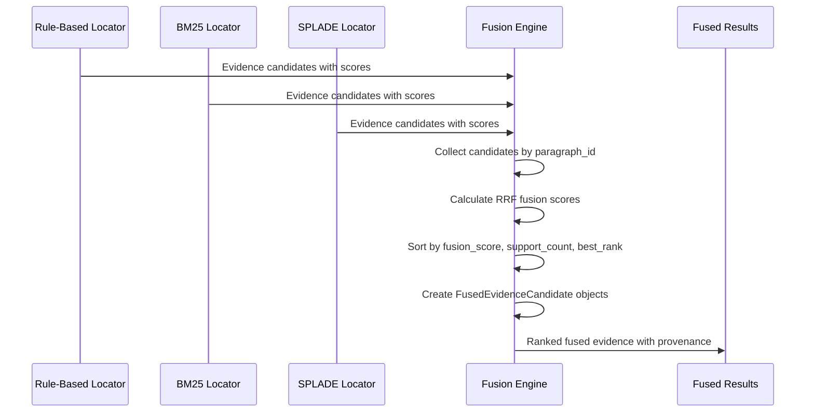
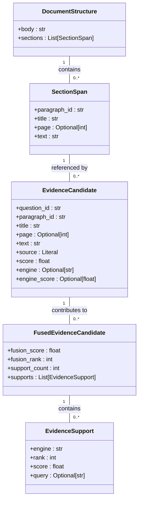

# Locator Result Model

<cite>
**Referenced Files in This Document**   
- [evidence.py](file://src/schemas/internal/evidence.py)
- [documents.py](file://src/schemas/internal/documents.py)
- [locator.py](file://src/schemas/internal/locator.py)
- [rule_based.py](file://src/pipelines/graphs/nodes/locators/rule_based.py)
- [retrieval_bm25.py](file://src/pipelines/graphs/nodes/locators/retrieval_bm25.py)
- [retrieval_splade.py](file://src/pipelines/graphs/nodes/locators/retrieval_splade.py)
- [fusion.py](file://src/evidence/fusion.py)
- [locator_rules.yaml](file://src/rob2/locator_rules.yaml)
</cite>

## Table of Contents
1. [Introduction](#introduction)
2. [Core Components](#core-components)
3. [Locator Strategies](#locator-strategies)
4. [Evidence Fusion Process](#evidence-fusion-process)
5. [Validation and Data Integrity](#validation-and-data-integrity)
6. [Relationships and Traceability](#relationships-and-traceability)
7. [Performance Considerations](#performance-considerations)
8. [Extensibility and Best Practices](#extensibility-and-best-practices)

## Introduction
The Locator Result Model represents the positioning and provenance of evidence within source documents in systematic review workflows. This model captures critical metadata about evidence location, confidence metrics, and retrieval methodology to ensure traceability and auditability. The system implements multiple locator strategies that generate evidence candidates with detailed positioning information, which are then fused and validated through a comprehensive pipeline. This documentation details the model's components, generation process, validation rules, and integration with the broader evidence processing system.

## Core Components

The Locator Result Model is primarily implemented through the `EvidenceCandidate` class, which captures comprehensive information about evidence location and retrieval. Each candidate includes positioning data such as section paths, page numbers, and paragraph identifiers, along with confidence metrics and provenance information. The model supports multiple retrieval strategies, each contributing different types of scoring and metadata to the evidence candidates.

The `SectionSpan` class in the document structure schema provides the foundation for evidence positioning, containing paragraph identifiers, section titles (representing section paths), page numbers, and text content. These spans are extracted during document preprocessing and serve as the atomic units for evidence retrieval. The `EvidenceCandidate` inherits positioning attributes from `SectionSpan` while adding retrieval-specific metadata.

Confidence metrics in the model include various score types depending on the retrieval strategy: rule-based scoring combines section and keyword matching scores, BM25 retrieval uses term frequency-inverse document frequency scoring, and SPLADE employs sparse lexical matching with deep learning. The fusion process combines these disparate scoring mechanisms into a unified confidence metric.

**Section sources**
- [evidence.py](file://src/schemas/internal/evidence.py#L21-L50)
- [documents.py](file://src/schemas/internal/documents.py#L20-L32)

## Locator Strategies

### Rule-Based Locator
The rule-based locator strategy uses domain-specific heuristics to identify relevant evidence. It employs section priors and keywords defined in the locator rules configuration to score document sections. The strategy first matches section titles against predefined section priors, assigning higher scores to exact or partial matches. It then searches paragraph text for keyword matches, with special handling for short tokens (≤4 alphanumeric characters) that require word boundaries to prevent false positives.

The rule-based scoring system combines section and keyword scores, with section matches weighted more heavily (multiplied by 10.0). Results are sorted by composite score, then by page number, and finally by position within the document. This approach ensures that evidence from relevant sections is prioritized while still considering keyword relevance.

### BM25 Retrieval Locator
The BM25-based locator implements a probabilistic information retrieval model with multi-query planning and Reciprocal Rank Fusion (RRF). It supports both deterministic and LLM-generated query planning, allowing for sophisticated query expansion based on the question context. The retrieval process can be enhanced with structure awareness, filtering the search space by section priors before applying BM25 scoring.

The BM25 implementation includes optional reranking with cross-encoders to improve relevance scoring. It also supports section-weighted ranking as a tie-breaker, applying a configurable bonus weight to results from sections matching the priors. The RRF fusion combines results from multiple queries, providing robust ranking that mitigates the limitations of individual queries.

### SPLADE Retrieval Locator
The SPLADE (SParse LexicAL Dense) locator uses deep learning to create sparse representations of text, enabling both lexical matching and semantic understanding. Like the BM25 locator, it supports multi-query planning and RRF fusion. The SPLADE model generates term-weighted document representations that allow for interpretable retrieval based on important terms in the query and document.

The SPLADE implementation uses FAISS for efficient similarity search with inner product scoring. It incorporates the same structure-aware retrieval capabilities as the BM25 locator, allowing for section-based filtering and scoring bonuses. The model parameters, including query and document maximum lengths, are configurable to balance performance and accuracy.

**Diagram sources**
- [rule_based.py](file://src/pipelines/graphs/nodes/locators/rule_based.py#L73-L115)
- [retrieval_bm25.py](file://src/pipelines/graphs/nodes/locators/retrieval_bm25.py#L219-L308)
- [retrieval_splade.py](file://src/pipelines/graphs/nodes/locators/retrieval_splade.py#L287-L377)

**Section sources**
- [rule_based.py](file://src/pipelines/graphs/nodes/locators/rule_based.py#L49-L115)
- [retrieval_bm25.py](file://src/pipelines/graphs/nodes/locators/retrieval_bm25.py#L48-L367)
- [retrieval_splade.py](file://src/pipelines/graphs/nodes/locators/retrieval_splade.py#L49-L390)

## Evidence Fusion Process

The evidence fusion process combines candidates from multiple locator strategies into a unified ranking using Reciprocal Rank Fusion (RRF). This approach leverages the strengths of different retrieval methods while providing a principled way to combine their results. The fusion algorithm processes candidates from each engine, tracking their individual rankings and scores, then computes a combined fusion score based on the RRF formula.

The fusion process begins by collecting evidence candidates from all available locator strategies (rule-based, BM25, SPLADE). For each paragraph ID, it maintains a record of the best candidate from each engine along with its rank. The fusion score is calculated as the weighted sum of reciprocal ranks across engines, with configurable weights allowing certain locators to be prioritized over others.

After computing fusion scores, candidates are ranked by their composite score, support count (number of engines that identified the candidate), and best individual rank. This multi-factor ranking ensures that candidates supported by multiple independent methods are prioritized, enhancing result reliability. The final output includes attribution information showing which engines contributed to each candidate's ranking.

**Diagram sources**
- [fusion.py](file://src/evidence/fusion.py#L18-L107)

**Section sources**
- [fusion.py](file://src/evidence/fusion.py#L18-L107)

## Validation and Data Integrity

The Locator Result Model incorporates comprehensive validation rules and data integrity constraints to ensure reliability and consistency. The system validates locator rules configuration, ensuring all required domains (D1-D5) are present and properly configured. The `LocatorRules` model includes a post-validation method that checks for missing domain rules, preventing incomplete configurations from being used.

Evidence candidates are validated through multiple stages of the processing pipeline. The fusion process includes validation of RRF parameters and engine weights, ensuring they fall within acceptable ranges. The system also validates document structure integrity, confirming that section spans have valid paragraph identifiers and text content before processing.

Data integrity is maintained through strict type definitions and constraints in the Pydantic models. The `EvidenceCandidate` model enforces non-negative scores and valid source types, while the `FusedEvidenceCandidate` ensures proper ranking and support counts. The system uses frozen dataclasses for internal structures to prevent unintended modifications during processing.

Configuration parameters are validated at runtime, with checks for minimum values (e.g., top_k ≥ 1, rrf_k ≥ 1) and valid ranges (e.g., confidence scores between 0 and 1). Error handling is implemented to gracefully degrade when optional components (like rerankers) fail, falling back to deterministic methods rather than failing the entire process.

**Section sources**
- [locator.py](file://src/schemas/internal/locator.py#L51-L56)
- [fusion.py](file://src/evidence/fusion.py#L26-L33)
- [retrieval_bm25.py](file://src/pipelines/graphs/nodes/locators/retrieval_bm25.py#L162-L167)

## Relationships and Traceability

The Locator Result Model maintains strong relationships between `LocatorResult`, `EvidenceCandidate`, and `DocumentStructure` to ensure complete traceability for systematic reviews. The `DocumentStructure` provides the foundational document representation, with `SectionSpan` objects serving as the atomic units of evidence. Each `EvidenceCandidate` references a specific `SectionSpan` through its paragraph_id, creating a direct link between evidence and its source location.

Traceability is further enhanced through multiple levels of provenance tracking. The `source` field in `EvidenceCandidate` identifies the originating locator strategy (rule_based, retrieval, or fulltext), while engine-specific fields track the retrieval method (bm25, splade). The fusion process preserves this provenance information in the `EvidenceSupport` objects within `FusedEvidenceCandidate`, showing exactly which engines contributed to each candidate's ranking.

The model supports audit trails through comprehensive metadata capture. Each locator strategy records its configuration, rules version, and processing parameters, allowing complete reproduction of results. The system also captures debugging information about structure-aware retrieval, including whether fallback to full-text search was required and which section priors were applied.

**Diagram sources**
- [evidence.py](file://src/schemas/internal/evidence.py#L21-L147)
- [documents.py](file://src/schemas/internal/documents.py#L34-L38)

**Section sources**
- [evidence.py](file://src/schemas/internal/evidence.py#L21-L147)
- [documents.py](file://src/schemas/internal/documents.py#L20-L38)

## Performance Considerations

The Locator Result Model addresses performance challenges in storing and querying large volumes of location data through several optimization strategies. The system uses efficient data structures and indexing to minimize memory footprint and maximize retrieval speed. The BM25 and SPLADE implementations leverage specialized libraries (custom BM25 index and FAISS) for high-performance text search at scale.

For storage optimization, the model uses a normalized representation where document structure is processed once and referenced by multiple evidence candidates. This approach reduces redundancy and memory usage, particularly important when processing large systematic reviews with extensive evidence requirements. The system also implements caching for frequently accessed components, such as locator rules, to avoid repeated file I/O operations.

Query performance is enhanced through structure-aware retrieval, which filters the search space by section priors before applying computationally intensive ranking algorithms. This two-stage approach significantly reduces the number of documents that require full scoring, improving response times. The system also supports batch processing of queries and candidates, leveraging vectorized operations where possible.

Indexing strategies vary by locator type: BM25 uses an inverted index for term-based retrieval, SPLADE employs dense vector indexing with FAISS, and rule-based matching uses simple text search with optimized keyword matching. The fusion process is designed to be incremental, allowing results to be combined as they become available rather than requiring all inputs before processing begins.

Best practices for normalization include using stable paragraph identifiers derived from document item IDs or page/index combinations, ensuring consistent referencing across processing runs. The system also normalizes text for matching by converting to lowercase, standardizing whitespace, and handling special characters consistently.

**Section sources**
- [retrieval_bm25.py](file://src/pipelines/graphs/nodes/locators/retrieval_bm25.py#L187-L188)
- [retrieval_splade.py](file://src/pipelines/graphs/nodes/locators/retrieval_splade.py#L255-L256)
- [preprocess.py](file://src/pipelines/graphs/nodes/preprocess.py#L421-L427)

## Extensibility and Best Practices

The Locator Result Model is designed for extensibility, allowing new locator types and enhanced provenance tracking to be integrated with minimal changes to the core system. The modular architecture separates locator implementations from the fusion and validation components, enabling new retrieval strategies to be added by implementing the same interface as existing locators.

To extend the model with additional locator types, developers should create new locator nodes that produce `EvidenceCandidate` objects with appropriate source identifiers. The fusion process automatically incorporates candidates from any source, requiring no changes to the fusion logic. New locators can introduce custom scoring methods and metadata fields while maintaining compatibility with the existing model.

For enhanced provenance tracking, the model supports adding custom fields to `EvidenceCandidate` and `EvidenceSupport` objects. Developers can extend these classes to include additional metadata such as processing timestamps, confidence intervals, or external references. The system's use of Pydantic models with `extra="forbid"` ensures backward compatibility while allowing controlled extension.

Best practices for implementing new locators include:
- Using consistent scoring ranges to facilitate fusion
- Providing clear source identifiers for traceability
- Implementing proper error handling and fallback mechanisms
- Including comprehensive configuration options
- Supporting both synchronous and asynchronous processing patterns
- Providing detailed debugging information for audit purposes

The system's configuration-driven approach, exemplified by the YAML-based locator rules, enables domain experts to tune retrieval behavior without code changes. This separation of configuration from implementation allows for rapid iteration and optimization of evidence retrieval strategies based on domain-specific requirements.

**Section sources**
- [locator.py](file://src/schemas/internal/locator.py)
- [locator_rules.yaml](file://src/rob2/locator_rules.yaml)
- [retrieval_bm25.py](file://src/pipelines/graphs/nodes/locators/retrieval_bm25.py#L60-L65)