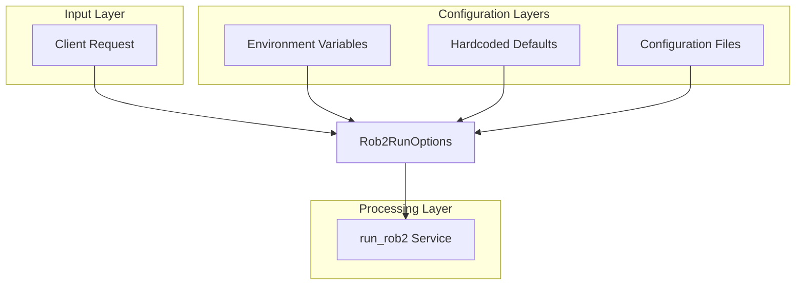
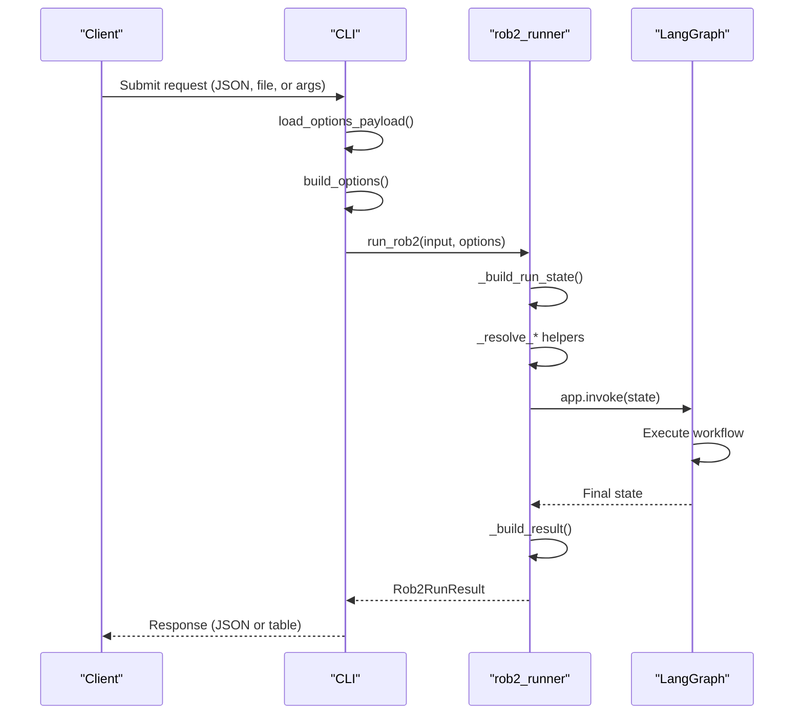

# Request Schemas

<cite>
**Referenced Files in This Document**   
- [Rob2Input](file://src/schemas/requests.py#L10-L21)
- [Rob2RunOptions](file://src/schemas/requests.py#L24-L163)
- [Rob2RunResult](file://src/schemas/responses.py#L12-L21)
- [get_settings](file://src/core/config.py#L194-L196)
- [Settings](file://src/core/config.py#L11-L185)
- [run_rob2](file://src/services/rob2_runner.py#L41-L65)
- [build_options](file://src/cli/common.py#L34-L39)
- [load_options_payload](file://src/cli/common.py#L15-L31)
- [rob2_questions.yaml](file://src/rob2/rob2_questions.yaml)
- [locator_rules.yaml](file://src/rob2/locator_rules.yaml)
- [.env.example](file://.env.example)
</cite>

## Table of Contents
1. [Introduction](#introduction)
2. [Core Request Models](#core-request-models)
3. [Rob2Input Schema](#rob2input-schema)
4. [Rob2RunOptions Schema](#rob2runoptions-schema)
5. [Configuration and Environment Variables](#configuration-and-environment-variables)
6. [Request Processing Flow](#request-processing-flow)
7. [Practical Examples](#practical-examples)
8. [Common Configuration Errors](#common-configuration-errors)
9. [Schema Extension Guidelines](#schema-extension-guidelines)
10. [Conclusion](#conclusion)

## Introduction
This document provides comprehensive documentation for the request data models used in the ROB2 assessment system. The system utilizes Pydantic models to define and validate input parameters for risk of bias assessments in clinical trials. The primary request models are Rob2Input and Rob2RunOptions, which work together to specify document sources and configuration parameters for the assessment process. These models are consumed by both the CLI and service layers to initialize and execute ROB2 evaluations. The documentation covers field-by-field specifications, validation rules, default values, environment variable bindings, practical usage examples, and guidelines for extending the request schemas.

**Section sources**
- [requests.py](file://src/schemas/requests.py#L1-L167)

## Core Request Models
The system's request interface is built around two primary Pydantic models: Rob2Input and Rob2RunOptions. These models define the contract between external clients and the ROB2 assessment service. Rob2Input specifies the document source (PDF path or bytes), while Rob2RunOptions contains all configurable parameters for the assessment process. Together, they provide a comprehensive interface for controlling the behavior of the ROB2 evaluation pipeline, from document preprocessing to domain-specific reasoning and final risk aggregation. The models are designed with strict validation rules to ensure data integrity and prevent invalid configurations.

```mermaid
classDiagram
class Rob2Input {
+str pdf_path
+bytes pdf_bytes
+str filename
+validate_source() bool
}
class Rob2RunOptions {
+str docling_layout_model
+str docling_artifacts_path
+str docling_chunker_model
+int docling_chunker_max_tokens
+int top_k
+int per_query_top_n
+int rrf_k
+str query_planner
+str query_planner_model
+str query_planner_model_provider
+float query_planner_temperature
+float query_planner_timeout
+int query_planner_max_tokens
+int query_planner_max_retries
+int query_planner_max_keywords
+str reranker
+str reranker_model_id
+str reranker_device
+int reranker_max_length
+int reranker_batch_size
+int rerank_top_n
+bool use_structure
+float section_bonus_weight
+str splade_model_id
+str splade_device
+str splade_hf_token
+int splade_query_max_length
+int splade_doc_max_length
+int splade_batch_size
+int fusion_top_k
+int fusion_rrf_k
+dict[str, float] fusion_engine_weights
+str relevance_mode
+str relevance_model
+str relevance_model_provider
+float relevance_temperature
+float relevance_timeout
+int relevance_max_tokens
+int relevance_max_retries
+float relevance_min_confidence
+bool relevance_require_quote
+bool relevance_fill_to_top_k
+int relevance_top_k
+int relevance_top_n
+bool existence_require_text_match
+bool existence_require_quote_in_source
+int existence_top_k
+str consistency_mode
+str consistency_model
+str consistency_model_provider
+float consistency_temperature
+float consistency_timeout
+int consistency_max_tokens
+int consistency_max_retries
+float consistency_min_confidence
+bool consistency_require_quotes_for_fail
+int consistency_top_n
+bool completeness_enforce
+list[str] completeness_required_questions
+int completeness_min_passed_per_question
+bool completeness_require_relevance
+int validated_top_k
+int validation_max_retries
+bool validation_fail_on_consistency
+bool validation_relax_on_retry
+str d2_effect_type
+int domain_evidence_top_k
+str d1_model
+str d1_model_provider
+float d1_temperature
+float d1_timeout
+int d1_max_tokens
+int d1_max_retries
+str d2_model
+str d2_model_provider
+float d2_temperature
+float d2_timeout
+int d2_max_tokens
+int d2_max_retries
+str d3_model
+str d3_model_provider
+float d3_temperature
+float d3_timeout
+int d3_max_tokens
+int d3_max_retries
+str d4_model
+str d4_model_provider
+float d4_temperature
+float d4_timeout
+int d4_max_tokens
+int d4_max_retries
+str d5_model
+str d5_model_provider
+float d5_temperature
+float d5_timeout
+int d5_max_tokens
+int d5_max_retries
+str domain_audit_mode
+str domain_audit_model
+str domain_audit_model_provider
+float domain_audit_temperature
+float domain_audit_timeout
+int domain_audit_max_tokens
+int domain_audit_max_retries
+int domain_audit_patch_window
+int domain_audit_max_patches_per_question
+bool domain_audit_rerun_domains
+bool domain_audit_final
+str debug_level
+bool include_reports
+bool include_audit_reports
}
Rob2Input --> Rob2RunOptions : "used with"
```



**Diagram sources**
- [requests.py](file://src/schemas/requests.py#L10-L163)

**Section sources**
- [requests.py](file://src/schemas/requests.py#L1-L167)

## Rob2Input Schema
The Rob2Input model defines the document source for the ROB2 assessment. It provides two mutually exclusive options for specifying the input document: a file path (pdf_path) or raw bytes (pdf_bytes). The model includes a filename field that can be used to provide a meaningful name for the document when bytes are provided. A custom validator ensures that exactly one of pdf_path or pdf_bytes is provided, preventing ambiguous input configurations. The model uses ConfigDict with extra="forbid" to prevent additional fields from being added, ensuring a strict contract between client and server.

**Section sources**
- [requests.py](file://src/schemas/requests.py#L10-L21)

## Rob2RunOptions Schema
The Rob2RunOptions model contains all configurable parameters for the ROB2 assessment process, organized into logical groups based on functionality. Each field is optional and can be omitted to use default values. The model uses Pydantic's Field construct with validation constraints (ge=1 for positive integers, ge=0 for non-negative floats, le=1 for confidence values between 0 and 1) to ensure valid configurations. The model also uses ConfigDict with extra="forbid" to prevent invalid field additions.

### Preprocessing Configuration
The preprocessing section controls document parsing and chunking behavior:
- **docling_layout_model**: Specifies the layout detection model for document parsing
- **docling_artifacts_path**: Path to store intermediate parsing artifacts
- **docling_chunker_model**: Model used for text chunking
- **docling_chunker_max_tokens**: Maximum tokens per text chunk (≥1)

### Retrieval and Fusion Configuration
These parameters control document retrieval and result fusion:
- **top_k**: Number of top results to retrieve (≥1)
- **per_query_top_n**: Results per query before fusion (≥1)
- **rrf_k**: Reciprocal Rank Fusion parameter (≥1)
- **query_planner**: Strategy for query generation ("deterministic" or "llm")
- **query_planner_model**: LLM model for query planning
- **query_planner_temperature**: Creativity parameter for query generation
- **query_planner_timeout**: Timeout for query planning operations
- **query_planner_max_tokens**: Maximum tokens for query planning
- **query_planner_max_retries**: Retry attempts for query planning
- **query_planner_max_keywords**: Maximum keywords to extract
- **reranker**: Type of reranking to apply ("none" or "cross_encoder")
- **reranker_model_id**: Model ID for reranking
- **reranker_device**: Device for reranking computation
- **reranker_max_length**: Maximum sequence length for reranking
- **reranker_batch_size**: Batch size for reranking operations
- **rerank_top_n**: Number of results to rerank
- **use_structure**: Whether to use document structure in retrieval
- **section_bonus_weight**: Weight for section-based scoring
- **splade_model_id**: Model ID for SPLADE retrieval
- **splade_device**: Device for SPLADE computation
- **splade_hf_token**: Hugging Face token for gated models
- **splade_query_max_length**: Maximum query length for SPLADE
- **splade_doc_max_length**: Maximum document length for SPLADE
- **splade_batch_size**: Batch size for SPLADE operations
- **fusion_top_k**: Top results after fusion
- **fusion_rrf_k**: RRF parameter for fusion
- **fusion_engine_weights**: Custom weights for fusion engines

### Validation Configuration
These parameters control evidence validation:
- **relevance_mode**: Relevance validation strategy ("none" or "llm")
- **relevance_model**: LLM model for relevance validation
- **relevance_model_provider**: Provider for relevance model
- **relevance_temperature**: Creativity parameter for relevance validation
- **relevance_timeout**: Timeout for relevance validation
- **relevance_max_tokens**: Maximum tokens for relevance validation
- **relevance_max_retries**: Retry attempts for relevance validation
- **relevance_min_confidence**: Minimum confidence threshold (0-1)
- **relevance_require_quote**: Whether quotes are required
- **relevance_fill_to_top_k**: Whether to fill results to top_k
- **relevance_top_k**: Top results for relevance validation
- **relevance_top_n**: Results to validate for relevance
- **existence_require_text_match**: Whether text matching is required
- **existence_require_quote_in_source**: Whether quotes must be in source
- **existence_top_k**: Top results for existence validation
- **consistency_mode**: Consistency validation strategy ("none" or "llm")
- **consistency_model**: LLM model for consistency validation
- **consistency_model_provider**: Provider for consistency model
- **consistency_temperature**: Creativity parameter for consistency validation
- **consistency_timeout**: Timeout for consistency validation
- **consistency_max_tokens**: Maximum tokens for consistency validation
- **consistency_max_retries**: Retry attempts for consistency validation
- **consistency_min_confidence**: Minimum confidence threshold (0-1)
- **consistency_require_quotes_for_fail**: Whether quotes are required for failures
- **consistency_top_n**: Results to validate for consistency (≥2)
- **completeness_enforce**: Whether to enforce completeness
- **completeness_required_questions**: Specific questions that must be answered
- **completeness_min_passed_per_question**: Minimum passes per question (≥1)
- **completeness_require_relevance**: Whether relevance is required for completeness
- **validated_top_k**: Top results after validation
- **validation_max_retries**: Maximum retry attempts for validation
- **validation_fail_on_consistency**: Whether consistency failures cause validation failure
- **validation_relax_on_retry**: Whether to relax validation on retry

### Domain Reasoning Configuration
These parameters control domain-specific reasoning:
- **d2_effect_type**: Effect type for D2 domain ("assignment" or "adherence")
- **domain_evidence_top_k**: Top evidence for domain reasoning (≥1)
- **d1_model**: LLM model for D1 reasoning
- **d1_model_provider**: Provider for D1 model
- **d1_temperature**: Creativity parameter for D1 reasoning
- **d1_timeout**: Timeout for D1 reasoning
- **d1_max_tokens**: Maximum tokens for D1 reasoning
- **d1_max_retries**: Retry attempts for D1 reasoning
- **d2_model**: LLM model for D2 reasoning
- **d2_model_provider**: Provider for D2 model
- **d2_temperature**: Creativity parameter for D2 reasoning
- **d2_timeout**: Timeout for D2 reasoning
- **d2_max_tokens**: Maximum tokens for D2 reasoning
- **d2_max_retries**: Retry attempts for D2 reasoning
- **d3_model**: LLM model for D3 reasoning
- **d3_model_provider**: Provider for D3 model
- **d3_temperature**: Creativity parameter for D3 reasoning
- **d3_timeout**: Timeout for D3 reasoning
- **d3_max_tokens**: Maximum tokens for D3 reasoning
- **d3_max_retries**: Retry attempts for D3 reasoning
- **d4_model**: LLM model for D4 reasoning
- **d4_model_provider**: Provider for D4 model
- **d4_temperature**: Creativity parameter for D4 reasoning
- **d4_timeout**: Timeout for D4 reasoning
- **d4_max_tokens**: Maximum tokens for D4 reasoning
- **d4_max_retries**: Retry attempts for D4 reasoning
- **d5_model**: LLM model for D5 reasoning
- **d5_model_provider**: Provider for D5 model
- **d5_temperature**: Creativity parameter for D5 reasoning
- **d5_timeout**: Timeout for D5 reasoning
- **d5_max_tokens**: Maximum tokens for D5 reasoning
- **d5_max_retries**: Retry attempts for D5 reasoning

### Domain Audit Configuration
These parameters control domain auditing:
- **domain_audit_mode**: Audit mode ("none" or "llm")
- **domain_audit_model**: LLM model for domain auditing
- **domain_audit_model_provider**: Provider for audit model
- **domain_audit_temperature**: Creativity parameter for auditing
- **domain_audit_timeout**: Timeout for auditing
- **domain_audit_max_tokens**: Maximum tokens for auditing
- **domain_audit_max_retries**: Retry attempts for auditing
- **domain_audit_patch_window**: Evidence patch window size (≥0)
- **domain_audit_max_patches_per_question**: Maximum patches per question (≥1)
- **domain_audit_rerun_domains**: Whether to re-run domains after auditing
- **domain_audit_final**: Whether to perform final domain audit

### Output Configuration
These parameters control output generation:
- **debug_level**: Debug information level ("none", "min", "full")
- **include_reports**: Whether to include detailed reports
- **include_audit_reports**: Whether to include audit reports

**Section sources**
- [requests.py](file://src/schemas/requests.py#L24-L163)

## Configuration and Environment Variables
The system supports configuration through both request parameters and environment variables. Default values for many options are defined in the Settings class in core/config.py, which loads values from environment variables or a .env file. When a parameter is not specified in the request, the system falls back to the environment variable value, and if that is not set, uses hardcoded defaults. This layered approach allows for flexible configuration management across different deployment environments.

The environment variables follow a consistent naming convention, typically uppercase versions of the parameter names with underscores (e.g., SPLADE_MODEL_ID for splade_model_id). The .env.example file provides a comprehensive list of available environment variables with example values. Some key environment variables include:

- **SPLADE_MODEL_ID**: Default model for SPLADE retrieval
- **RERANKER_MODEL_ID**: Default model for reranking
- **QUERY_PLANNER_MODEL**: Default model for query planning
- **RELEVANCE_MODEL**: Default model for relevance validation
- **CONSISTENCY_MODEL**: Default model for consistency validation
- **D1_MODEL** to **D5_MODEL**: Default models for domain reasoning
- **DOMAIN_AUDIT_MODE**: Default audit mode
- **DOCLING_LAYOUT_MODEL**: Default layout model for document parsing

The system also includes domain-specific configuration files (rob2_questions.yaml and locator_rules.yaml) that define the assessment framework and retrieval rules. These files are loaded at runtime and can be customized to adapt the system to different assessment protocols or document types.



**Diagram sources**
- [config.py](file://src/core/config.py#L11-L185)
- [rob2_runner.py](file://src/services/rob2_runner.py#L41-L65)
- [.env.example](file://.env.example)
- [rob2_questions.yaml](file://src/rob2/rob2_questions.yaml)
- [locator_rules.yaml](file://src/rob2/locator_rules.yaml)

**Section sources**
- [config.py](file://src/core/config.py#L11-L185)
- [.env.example](file://.env.example)
- [rob2_questions.yaml](file://src/rob2/rob2_questions.yaml)
- [locator_rules.yaml](file://src/rob2/locator_rules.yaml)

## Request Processing Flow
The request processing flow begins with the client submitting a Rob2Input and optional Rob2RunOptions. In the CLI, these options can be provided as JSON strings, loaded from files, or specified via command-line arguments. The load_options_payload function in cli/common.py aggregates options from multiple sources (command-line, files, environment) into a single payload, which is then validated and converted to a Rob2RunOptions object using the build_options function.

The run_rob2 function in services/rob2_runner.py serves as the main entry point for processing requests. It normalizes the input and options, then builds a comprehensive run state that combines request parameters, environment variables, and hardcoded defaults. The _resolve_* helper functions handle type conversion and default value application for each parameter type (boolean, choice, string, integer, float). This ensures consistent parameter handling regardless of input format.

The run state is then passed to the LangGraph application via the _invoke_graph function, which executes the assessment workflow. The workflow includes document parsing, evidence retrieval, validation, domain reasoning, and final risk aggregation. After processing, the _build_result function constructs a Rob2RunResult containing the final assessment, reports, debug information, and metadata.



**Diagram sources**
- [common.py](file://src/cli/common.py#L15-L39)
- [rob2_runner.py](file://src/services/rob2_runner.py#L41-L65)

**Section sources**
- [common.py](file://src/cli/common.py#L15-L39)
- [rob2_runner.py](file://src/services/rob2_runner.py#L41-L65)

## Practical Examples
This section provides practical examples of JSON payloads for different use cases, demonstrating how to configure the ROB2 assessment for various scenarios.

### Minimal Configuration
The minimal configuration uses default values for all optional parameters, specifying only the required document source:

```json
{
  "pdf_path": "/path/to/document.pdf"
}
```

This configuration will use all default settings from environment variables or hardcoded defaults, making it suitable for quick assessments with standard parameters.

### Full Custom Configuration
The full custom configuration demonstrates how to override all major parameters for a comprehensive assessment:

```json
{
  "pdf_path": "/path/to/document.pdf",
  "options": {
    "docling_layout_model": "custom_layout_model",
    "top_k": 10,
    "per_query_top_n": 100,
    "rrf_k": 100,
    "query_planner": "llm",
    "query_planner_model": "openai:gpt-4o",
    "query_planner_temperature": 0.3,
    "reranker": "cross_encoder",
    "reranker_model_id": "custom/reranker-model",
    "reranker_max_length": 1024,
    "rerank_top_n": 100,
    "use_structure": true,
    "section_bonus_weight": 0.5,
    "splade_model_id": "./models/custom-splade",
    "splade_query_max_length": 128,
    "splade_doc_max_length": 512,
    "relevance_mode": "llm",
    "relevance_model": "openai:gpt-4o",
    "relevance_temperature": 0.2,
    "relevance_min_confidence": 0.8,
    "relevance_require_quote": true,
    "relevance_top_k": 10,
    "consistency_mode": "llm",
    "consistency_model": "openai:gpt-4o",
    "consistency_temperature": 0.1,
    "consistency_min_confidence": 0.7,
    "consistency_top_n": 5,
    "completeness_enforce": true,
    "completeness_required_questions": ["q1_1", "q2a_1", "q3_1"],
    "completeness_min_passed_per_question": 2,
    "d1_model": "openai:gpt-4o",
    "d1_temperature": 0.1,
    "d2_model": "openai:gpt-4o",
    "d2_temperature": 0.1,
    "d3_model": "openai:gpt-4o",
    "d3_temperature": 0.1,
    "d4_model": "openai:gpt-4o",
    "d4_temperature": 0.1,
    "d5_model": "openai:gpt-4o",
    "d5_temperature": 0.1,
    "domain_audit_mode": "llm",
    "domain_audit_model": "openai:gpt-4o",
    "domain_audit_patch_window": 2,
    "domain_audit_max_patches_per_question": 5,
    "domain_audit_rerun_domains": true,
    "debug_level": "full",
    "include_reports": true,
    "include_audit_reports": true
  }
}
```

### Edge Cases
This section demonstrates handling of edge cases and special scenarios:

**PDF from Bytes:**
```json
{
  "pdf_bytes": "base64_encoded_pdf_content",
  "filename": "document.pdf"
}
```

**Domain-Specific Configuration:**
```json
{
  "pdf_path": "/path/to/document.pdf",
  "options": {
    "d2_effect_type": "adherence",
    "domain_evidence_top_k": 10,
    "d1_model": "anthropic:claude-3-opus-20240229",
    "d1_temperature": 0.5,
    "d2_model": "anthropic:claude-3-opus-20240229",
    "d2_temperature": 0.5
  }
}
```

**Validation-Only Mode:**
```json
{
  "pdf_path": "/path/to/document.pdf",
  "options": {
    "top_k": 5,
    "relevance_mode": "llm",
    "relevance_min_confidence": 0.9,
    "consistency_mode": "llm",
    "consistency_min_confidence": 0.8,
    "completeness_enforce": true,
    "validation_max_retries": 3,
    "validation_relax_on_retry": false
  }
}
```

**Audit-Only Mode:**
```json
{
  "pdf_path": "/path/to/document.pdf",
  "options": {
    "domain_audit_mode": "llm",
    "domain_audit_model": "openai:gpt-4o",
    "domain_audit_patch_window": 3,
    "domain_audit_max_patches_per_question": 10,
    "domain_audit_rerun_domains": true,
    "domain_audit_final": true,
    "debug_level": "min"
  }
}
```

**Section sources**
- [requests.py](file://src/schemas/requests.py#L10-L163)
- [rob2_runner.py](file://src/services/rob2_runner.py#L41-L65)

## Common Configuration Errors
This section addresses common configuration errors and how to resolve them.

### Mutual Exclusion Violation
**Error:** Providing both pdf_path and pdf_bytes in Rob2Input
**Solution:** Use exactly one of pdf_path or pdf_bytes. If providing raw PDF bytes, use pdf_bytes and optionally specify a filename.

### Invalid Enum Values
**Error:** Using values not in allowed choices (e.g., "llm_invalid" for relevance_mode)
**Solution:** Use only allowed values: "none" or "llm" for relevance_mode, consistency_mode, and domain_audit_mode; "deterministic" or "llm" for query_planner; "assignment" or "adherence" for d2_effect_type.

### Out-of-Range Values
**Error:** Specifying values outside valid ranges (e.g., top_k=0 or relevance_min_confidence=1.5)
**Solution:** Ensure integer parameters are ≥1 where required, and confidence values are between 0 and 1 inclusive.

### Type Mismatch
**Error:** Providing string values where integers are expected
**Solution:** Ensure numeric parameters are provided as numbers, not strings. The system will attempt to convert strings to appropriate types, but explicit numeric values are recommended.

### Missing Required Dependencies
**Error:** Setting d2_effect_type without being in D2 domain
**Solution:** d2_effect_type is only valid for D2 questions. Ensure domain is D2 when specifying this parameter.

### Circular Dependencies in Questions
**Error:** Creating circular dependencies in question conditions
**Solution:** Review the rob2_questions.yaml file to ensure question dependencies form a directed acyclic graph.

### Invalid Fusion Engine Weights
**Error:** Providing invalid weights in fusion_engine_weights
**Solution:** Ensure weights are positive numbers and engine names match available retrieval engines.

### Resolution Strategy
When encountering configuration errors, follow this resolution strategy:
1. Validate the JSON structure using a JSON validator
2. Check for typos in field names
3. Verify values against allowed choices and ranges
4. Consult the .env.example file for correct parameter names
5. Use the CLI's config options command to list available parameters
6. Start with minimal configuration and gradually add parameters

**Section sources**
- [requests.py](file://src/schemas/requests.py#L10-L163)
- [rob2_runner.py](file://src/services/rob2_runner.py#L41-L65)
- [.env.example](file://.env.example)

## Schema Extension Guidelines
When extending the request schemas for additional parameters, follow these guidelines to maintain backward compatibility and system integrity.

### Backward Compatibility
- Add new fields as optional with appropriate default values
- Never remove or rename existing fields
- Use versioning for breaking changes
- Maintain validation rules for existing fields

### Field Naming
- Use snake_case for field names
- Be descriptive but concise
- Follow existing naming patterns
- Use consistent terminology across related fields

### Validation
- Apply appropriate validation constraints (min, max, allowed values)
- Use Pydantic's Field construct for documentation and validation
- Implement custom validators for complex validation logic
- Ensure validation errors are clear and actionable

### Documentation
- Add comprehensive field descriptions
- Specify default values and allowed ranges
- Document interactions with other fields
- Provide usage examples

### Testing
- Add unit tests for new fields and validation rules
- Test edge cases and error conditions
- Verify backward compatibility with existing configurations
- Test integration with the processing pipeline

### Example Extension
To add a new parameter for controlling citation formatting:

```python
class Rob2RunOptions(BaseModel):
    # ... existing fields ...
    
    # New field for citation formatting
    citation_format: Literal["vancouver", "apa", "mla"] = Field(
        default="vancouver",
        description="Citation style for references"
    )
    
    # New field for maximum citations
    max_citations: int = Field(
        default=50,
        ge=1,
        le=1000,
        description="Maximum number of citations to include"
    )
```

This extension maintains backward compatibility by making the new fields optional with sensible defaults, follows naming conventions, applies appropriate validation, and includes clear documentation.

**Section sources**
- [requests.py](file://src/schemas/requests.py#L24-L163)

## Conclusion
The request schemas for the ROB2 assessment system provide a comprehensive and flexible interface for configuring document analysis and risk of bias evaluation. The Rob2Input and Rob2RunOptions models work together to define document sources and processing parameters, with extensive validation to ensure data integrity. The system supports configuration through multiple layers, including request parameters, environment variables, and configuration files, allowing for flexible deployment across different environments. By understanding the field-by-field specifications, validation rules, and default values, users can effectively configure assessments for various use cases. The provided examples demonstrate practical applications, while the error handling guidance helps troubleshoot common issues. When extending the schemas, following the outlined guidelines ensures backward compatibility and system stability.

**Section sources**
- [requests.py](file://src/schemas/requests.py#L1-L167)
- [config.py](file://src/core/config.py#L11-L185)
- [rob2_runner.py](file://src/services/rob2_runner.py#L41-L65)