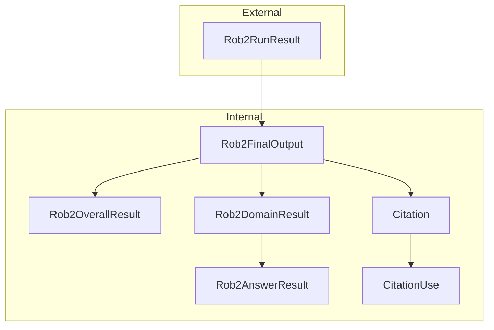
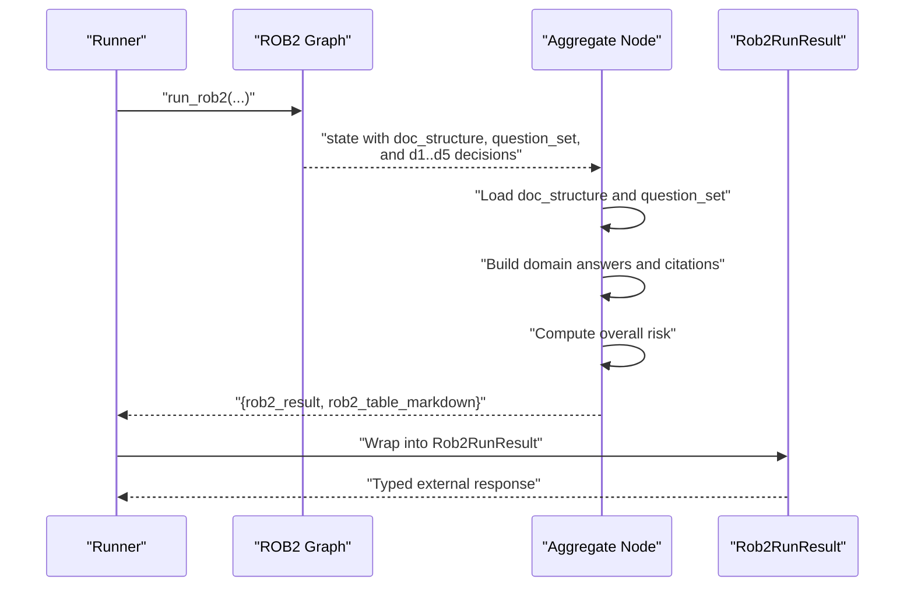
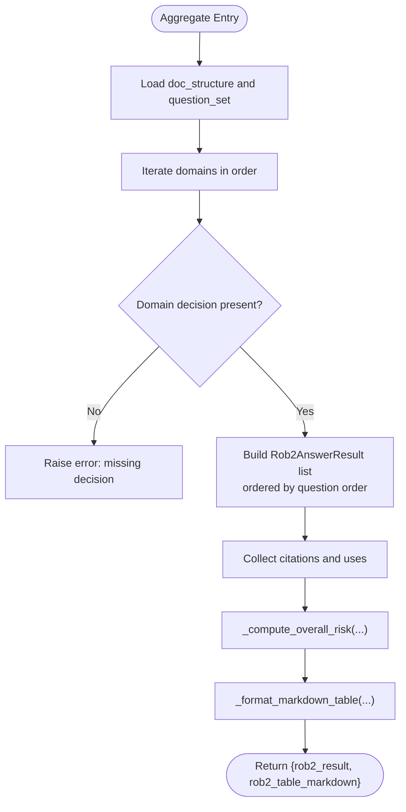
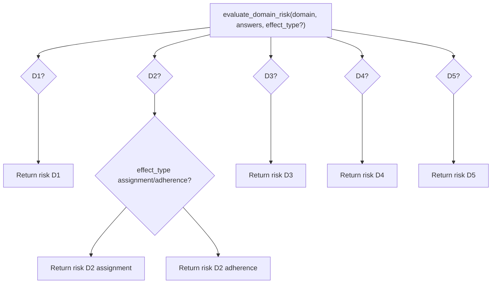
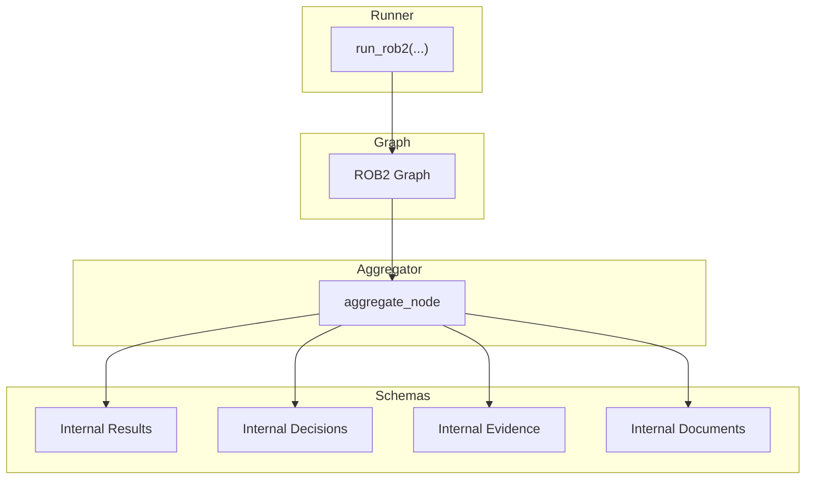

# Response Schemas

<cite>
**Referenced Files in This Document**
- [responses.py](file://src/schemas/responses.py)
- [results.py](file://src/schemas/internal/results.py)
- [decisions.py](file://src/schemas/internal/decisions.py)
- [evidence.py](file://src/schemas/internal/evidence.py)
- [documents.py](file://src/schemas/internal/documents.py)
- [aggregate.py](file://src/pipelines/graphs/nodes/aggregate.py)
- [decision_rules.py](file://src/rob2/decision_rules.py)
- [rob2_runner.py](file://src/services/rob2_runner.py)
- [architecture.md](file://docs/architecture.md)
- [requirements.md](file://docs/requirements.md)
- [system-uml.md](file://docs/system-uml.md)
- [test_rob2_aggregate.py](file://tests/unit/test_rob2_aggregate.py)
</cite>

## Table of Contents
1. [Introduction](#introduction)
2. [Project Structure](#project-structure)
3. [Core Components](#core-components)
4. [Architecture Overview](#architecture-overview)
5. [Detailed Component Analysis](#detailed-component-analysis)
6. [Dependency Analysis](#dependency-analysis)
7. [Performance Considerations](#performance-considerations)
8. [Troubleshooting Guide](#troubleshooting-guide)
9. [Conclusion](#conclusion)
10. [Appendices](#appendices)

## Introduction
This document defines the final response data models for the ROB2 assessment pipeline. It describes the external and internal schemas that represent the structured output, including domain-level assessments, evidence bundles, confidence scores, and audit metadata. It also explains how intermediate results are transformed into the final response, including aggregation logic and risk judgment formulation. Guidance is provided for parsing and post-processing the output for integration with downstream systems such as systematic review databases or visualization tools. Versioning considerations and backward compatibility are addressed for API consumers.

## Project Structure
The response schemas are organized into two layers:
- External response schema: Rob2RunResult, which wraps the internal final output and adds auxiliary fields for reporting and debugging.
- Internal final output schema: Rob2FinalOutput and its nested components, which define the canonical JSON structure of the assessment results.

**Diagram sources**
- [responses.py](file://src/schemas/responses.py#L12-L21)
- [results.py](file://src/schemas/internal/results.py#L56-L81)

**Section sources**
- [responses.py](file://src/schemas/responses.py#L12-L21)
- [results.py](file://src/schemas/internal/results.py#L56-L81)

## Core Components
This section documents the primary response data models and their nested components.

- Rob2RunResult (external): The top-level external response containing the final output plus auxiliary fields for reports, audit reports, debug payloads, runtime metrics, and warnings.
- Rob2FinalOutput (internal): The canonical final JSON structure, including overall risk, domain-level results, and citations.
- Rob2OverallResult: Overall risk and rationale derived from domain-level risks.
- Rob2DomainResult: Per-domain risk, rationale, ordered answers, and missing questions.
- Rob2AnswerResult: Individual answer to a signaling question, including normalized answer, rationale, evidence references, and optional confidence.
- Citation and CitationUse: Paragraph-level evidence references with domain and question linkage.
- EvidenceRef: Lightweight evidence reference used in domain answers and citations.
- Evidence bundles and validation artifacts: Supporting structures for evidence and validation used during aggregation and auditing.

Key characteristics:
- Strong typing with Pydantic models and explicit validation rules.
- Controlled extra fields to prevent schema drift.
- Confidence scores are optional floating-point values constrained to [0, 1].
- Evidence references are normalized and linked to document spans.

**Section sources**
- [responses.py](file://src/schemas/responses.py#L12-L21)
- [results.py](file://src/schemas/internal/results.py#L15-L81)
- [decisions.py](file://src/schemas/internal/decisions.py#L15-L57)
- [evidence.py](file://src/schemas/internal/evidence.py#L10-L171)
- [documents.py](file://src/schemas/internal/documents.py#L10-L41)

## Architecture Overview
The final output is produced by the aggregation node, which consumes domain decisions and document structure to construct the final JSON and a human-readable Markdown table.

**Diagram sources**
- [rob2_runner.py](file://src/services/rob2_runner.py#L319-L353)
- [aggregate.py](file://src/pipelines/graphs/nodes/aggregate.py#L32-L109)
- [architecture.md](file://docs/architecture.md#L1-L94)

**Section sources**
- [rob2_runner.py](file://src/services/rob2_runner.py#L319-L353)
- [aggregate.py](file://src/pipelines/graphs/nodes/aggregate.py#L32-L109)
- [architecture.md](file://docs/architecture.md#L1-L94)

## Detailed Component Analysis

### Rob2RunResult (External Response)
Rob2RunResult is the external contract returned by the service. It includes:
- result: The internal Rob2FinalOutput object.
- table_markdown: Human-readable Markdown table summarizing domain risks.
- reports: Optional structured reports (e.g., relevance/consistency/completeness configurations and logs).
- audit_reports: Optional audit report payloads generated by domain audits.
- debug: Optional debug payload controlled by run options.
- runtime_ms: Optional timing metric.
- warnings: Optional list of warnings.

Behavioral notes:
- The service constructs this object from the final state produced by the graph.
- Reports and audit reports are included based on run options and debug level.

**Section sources**
- [responses.py](file://src/schemas/responses.py#L12-L21)
- [rob2_runner.py](file://src/services/rob2_runner.py#L319-L353)

### Rob2FinalOutput and Nested Components
Rob2FinalOutput is the canonical JSON structure of the final assessment. Its nested components include:

- Rob2OverallResult
  - risk: Overall risk category.
  - rationale: Explanation for the overall risk determination.
- Rob2DomainResult
  - domain: Domain identifier.
  - effect_type: Optional effect type for domain D2.
  - risk: Domain risk category.
  - risk_rationale: Explanation for the domain risk.
  - answers: Ordered list of Rob2AnswerResult.
  - missing_questions: List of question IDs that were not answered.
- Rob2AnswerResult
  - question_id: Unique signaling question identifier.
  - rob2_id: Original ROB2 question ID (optional).
  - text: Question text (optional).
  - answer: Normalized answer option.
  - rationale: Rationale for the answer.
  - evidence_refs: List of EvidenceRef.
  - confidence: Optional confidence score in [0, 1].
- Citation and CitationUse
  - Citation: Paragraph-level evidence with page/title/text and a list of CitationUse entries.
  - CitationUse: Links a citation to a specific domain and question, optionally with a quote.
- EvidenceRef
  - paragraph_id: Stable paragraph identifier.
  - page/title/quote: Optional metadata for traceability.

Validation and constraints:
- Strict typing and validation enforced by Pydantic models.
- Confidence scores are optional and bounded.
- Evidence references are normalized and linked to document spans.

**Section sources**
- [results.py](file://src/schemas/internal/results.py#L15-L81)
- [decisions.py](file://src/schemas/internal/decisions.py#L15-L57)
- [evidence.py](file://src/schemas/internal/evidence.py#L10-L171)
- [documents.py](file://src/schemas/internal/documents.py#L10-L41)

### Evidence Bundles and Validation Artifacts
Evidence-related schemas support the aggregation and auditing stages:
- EvidenceCandidate and EvidenceBundle: Candidate paragraphs and top-k bundles for a question.
- FusedEvidenceCandidate and FusedEvidenceBundle: Merged candidates with multi-engine support annotations.
- RelevanceVerdict, ExistenceVerdict, ConsistencyVerdict, ConsistencyConflict: Validation outputs used during aggregation and auditing.
- EvidenceSupport: Engine-level support metadata for fused candidates.

These artifacts inform the final output’s evidence references and help produce robust citations.

**Section sources**
- [evidence.py](file://src/schemas/internal/evidence.py#L10-L171)

### Aggregation Logic and Risk Judgment Formulation
The aggregation node transforms domain decisions into the final output:
- Loads document structure and question set.
- Iterates domains in a fixed order and builds domain results from domain decisions.
- Normalizes answers to Rob2AnswerResult, preserving ordering from the question set.
- Builds citations by mapping paragraph IDs to document spans and recording domain/question usage.
- Computes overall risk using the Standard ROB2 rule:
  - If any domain is high → overall high.
  - Else if all domains are low → overall low.
  - Else if any domain is some concerns → overall some concerns.
  - If no domain results → not_applicable.

Markdown table formatting:
- Generates a human-readable table with domain labels, effect types, and risks, plus an overall row.

**Diagram sources**
- [aggregate.py](file://src/pipelines/graphs/nodes/aggregate.py#L32-L109)
- [aggregate.py](file://src/pipelines/graphs/nodes/aggregate.py#L140-L165)
- [aggregate.py](file://src/pipelines/graphs/nodes/aggregate.py#L175-L186)

**Section sources**
- [aggregate.py](file://src/pipelines/graphs/nodes/aggregate.py#L32-L109)
- [aggregate.py](file://src/pipelines/graphs/nodes/aggregate.py#L140-L165)
- [aggregate.py](file://src/pipelines/graphs/nodes/aggregate.py#L175-L186)
- [decision_rules.py](file://src/rob2/decision_rules.py#L22-L44)

### Domain Risk Decision Trees
Domain risk is computed by rule-based decision trees. The module evaluates answers mapped by question ID and returns a domain risk category. The decision rules are domain-specific and include special handling for D2 effect types.

**Diagram sources**
- [decision_rules.py](file://src/rob2/decision_rules.py#L22-L44)
- [decision_rules.py](file://src/rob2/decision_rules.py#L50-L123)
- [decision_rules.py](file://src/rob2/decision_rules.py#L125-L174)
- [decision_rules.py](file://src/rob2/decision_rules.py#L176-L191)

**Section sources**
- [decision_rules.py](file://src/rob2/decision_rules.py#L22-L44)
- [decision_rules.py](file://src/rob2/decision_rules.py#L50-L123)
- [decision_rules.py](file://src/rob2/decision_rules.py#L125-L174)
- [decision_rules.py](file://src/rob2/decision_rules.py#L176-L191)

### Markdown Table Generation
The aggregation node formats a Markdown table summarizing domain risks and overall risk. The table includes domain identifiers, labels, effect types, and risk categories.

**Section sources**
- [aggregate.py](file://src/pipelines/graphs/nodes/aggregate.py#L175-L186)

## Dependency Analysis
The final output depends on internal schemas and is produced by the aggregation node. The runner composes the external Rob2RunResult around the internal final output.

**Diagram sources**
- [rob2_runner.py](file://src/services/rob2_runner.py#L319-L353)
- [aggregate.py](file://src/pipelines/graphs/nodes/aggregate.py#L32-L109)
- [results.py](file://src/schemas/internal/results.py#L56-L81)
- [decisions.py](file://src/schemas/internal/decisions.py#L15-L57)
- [evidence.py](file://src/schemas/internal/evidence.py#L10-L171)
- [documents.py](file://src/schemas/internal/documents.py#L10-L41)

**Section sources**
- [rob2_runner.py](file://src/services/rob2_runner.py#L319-L353)
- [aggregate.py](file://src/pipelines/graphs/nodes/aggregate.py#L32-L109)
- [results.py](file://src/schemas/internal/results.py#L56-L81)
- [decisions.py](file://src/schemas/internal/decisions.py#L15-L57)
- [evidence.py](file://src/schemas/internal/evidence.py#L10-L171)
- [documents.py](file://src/schemas/internal/documents.py#L10-L41)

## Performance Considerations
- Aggregation complexity is linear in the number of questions and evidence items per domain.
- Citation building uses dictionary lookups keyed by paragraph IDs for O(1) updates.
- Markdown table generation is O(D) where D is the number of domains (fixed five for ROB2).
- Confidence scores and optional fields reduce overhead when absent.

[No sources needed since this section provides general guidance]

## Troubleshooting Guide
Common issues and resolutions:
- Missing domain decision during aggregation: The aggregator raises an error if a domain decision is absent. Ensure all five domain decisions are present in the state.
- Missing doc_structure or question_set: The aggregator validates these inputs and raises descriptive errors if missing.
- Citation index mismatch: Verify that evidence paragraph IDs correspond to document spans; otherwise, citations may lack page/title metadata.
- Overall risk unexpected: Confirm domain risks and missing questions; the overall rule is strict and deterministic.

Validation and tests:
- Unit tests demonstrate overall risk computation under various scenarios and citation indexing behavior.

**Section sources**
- [aggregate.py](file://src/pipelines/graphs/nodes/aggregate.py#L32-L53)
- [test_rob2_aggregate.py](file://tests/unit/test_rob2_aggregate.py#L46-L76)
- [test_rob2_aggregate.py](file://tests/unit/test_rob2_aggregate.py#L78-L111)

## Conclusion
The ROB2 final response schema provides a structured, auditable JSON representation of the assessment with explicit domain-level results, evidence citations, and overall risk. The aggregation logic enforces a clear, deterministic rule for overall risk and produces a human-readable Markdown summary. Optional fields enable reporting and debugging while maintaining strong validation and type safety.

[No sources needed since this section summarizes without analyzing specific files]

## Appendices

### JSON Schema Definition
Below is a concise JSON schema outline for the final output. Replace placeholders with actual values from the models.

- Rob2RunResult
  - result: Rob2FinalOutput
  - table_markdown: string
  - reports: object|null
  - audit_reports: array|null
  - debug: object|null
  - runtime_ms: integer|null
  - warnings: array<string>

- Rob2FinalOutput
  - variant: "standard"
  - question_set_version: string
  - overall: Rob2OverallResult
  - domains: array<Rob2DomainResult>
  - citations: array<Citation>

- Rob2OverallResult
  - risk: "low"|"some_concerns"|"high"|"not_applicable"
  - rationale: string

- Rob2DomainResult
  - domain: "D1"|"D2"|"D3"|"D4"|"D5"
  - effect_type: "assignment"|"adherence"|null
  - risk: "low"|"some_concerns"|"high"
  - risk_rationale: string
  - answers: array<Rob2AnswerResult>
  - missing_questions: array<string>

- Rob2AnswerResult
  - question_id: string
  - rob2_id: string|null
  - text: string|null
  - answer: "Y"|"PY"|"PN"|"N"|"NI"|"NA"
  - rationale: string
  - evidence_refs: array<EvidenceRef>
  - confidence: number|null

- EvidenceRef
  - paragraph_id: string
  - page: integer|null
  - title: string|null
  - quote: string|null

- Citation
  - paragraph_id: string
  - page: integer|null
  - title: string|null
  - text: string|null
  - uses: array<CitationUse>

- CitationUse
  - domain: "D1"|"D2"|"D3"|"D4"|"D5"
  - question_id: string
  - quote: string|null

**Section sources**
- [responses.py](file://src/schemas/responses.py#L12-L21)
- [results.py](file://src/schemas/internal/results.py#L56-L81)
- [decisions.py](file://src/schemas/internal/decisions.py#L15-L57)
- [evidence.py](file://src/schemas/internal/evidence.py#L10-L171)

### Markdown Table Schema
The Markdown table includes:
- Headers: Domain, Effect type, Risk
- Rows: One per domain and one overall row
- Values: Domain label, effect type (or "-"), and risk category

**Section sources**
- [aggregate.py](file://src/pipelines/graphs/nodes/aggregate.py#L175-L186)

### Sample Responses and Edge Cases
- Overall risk high when any domain is high: Demonstrated by tests.
- Overall risk some concerns when multiple domains are some concerns: Demonstrated by tests.
- Citation index built from evidence references: Demonstrated by tests.

**Section sources**
- [test_rob2_aggregate.py](file://tests/unit/test_rob2_aggregate.py#L46-L76)
- [test_rob2_aggregate.py](file://tests/unit/test_rob2_aggregate.py#L78-L111)

### Schema Versioning and Backward Compatibility
- question_set_version: Included in Rob2FinalOutput to track the question set used for the assessment.
- Variant: Fixed to "standard" for the current implementation.
- Backward compatibility: New fields can be added to internal schemas as optional without breaking external consumers who rely on known fields. Consumers should ignore unknown fields and handle optional fields gracefully.

Guidance for API consumers:
- Always parse with strict validation to catch schema mismatches early.
- Treat optional fields as nullable and provide defaults when needed.
- Track question_set_version to interpret answer normalization and domain effects consistently.

**Section sources**
- [results.py](file://src/schemas/internal/results.py#L63-L71)
- [requirements.md](file://docs/requirements.md#L46-L89)

### Parsing and Post-Processing Guidance
- Parse Rob2RunResult with the external schema to obtain Rob2FinalOutput.
- For downstream systems:
  - Use domains and overall risk for stratified summaries.
  - Use citations to link risk judgments to original text.
  - Use table_markdown for quick human review.
- For systematic review databases:
  - Normalize domain identifiers and effect types.
  - Export evidence_refs as references with paragraph IDs and quotes.
- For visualization tools:
  - Render the Markdown table or convert to CSV/HTML.
  - Plot domain risks and highlight missing questions.

**Section sources**
- [responses.py](file://src/schemas/responses.py#L12-L21)
- [aggregate.py](file://src/pipelines/graphs/nodes/aggregate.py#L175-L186)
- [system-uml.md](file://docs/system-uml.md#L105-L121)