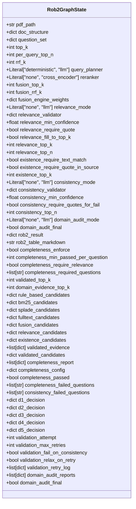
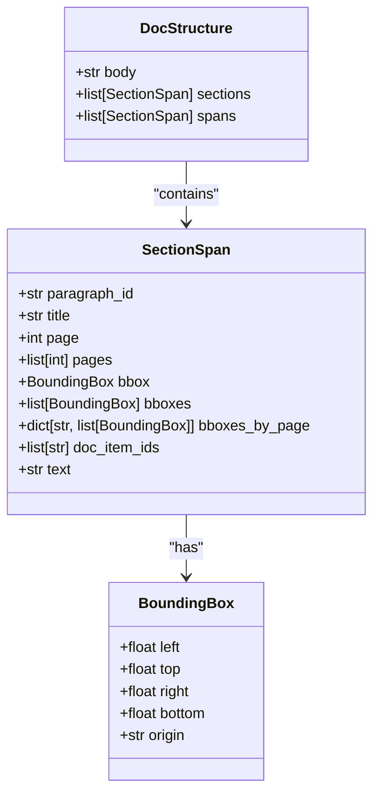
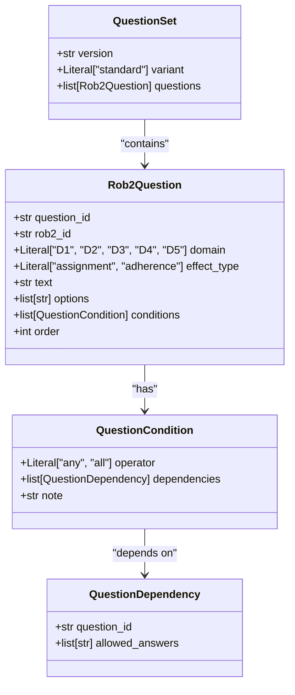
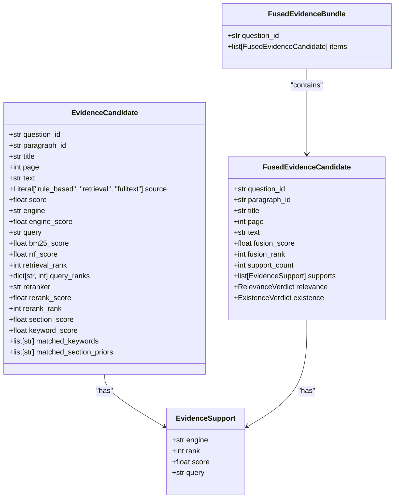
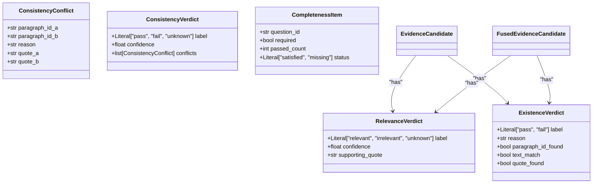
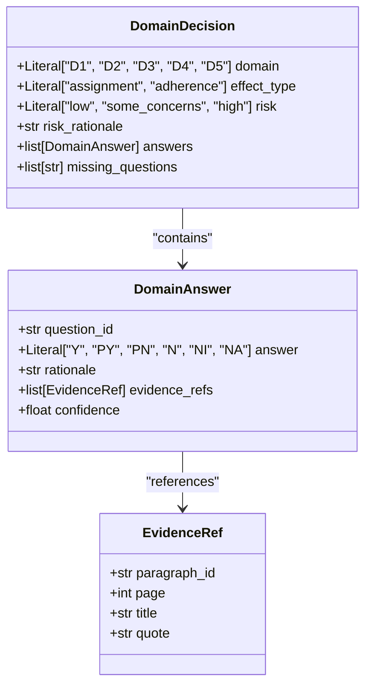
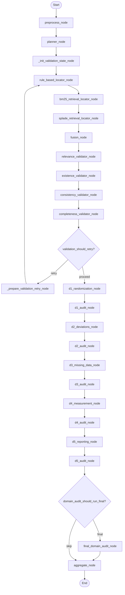
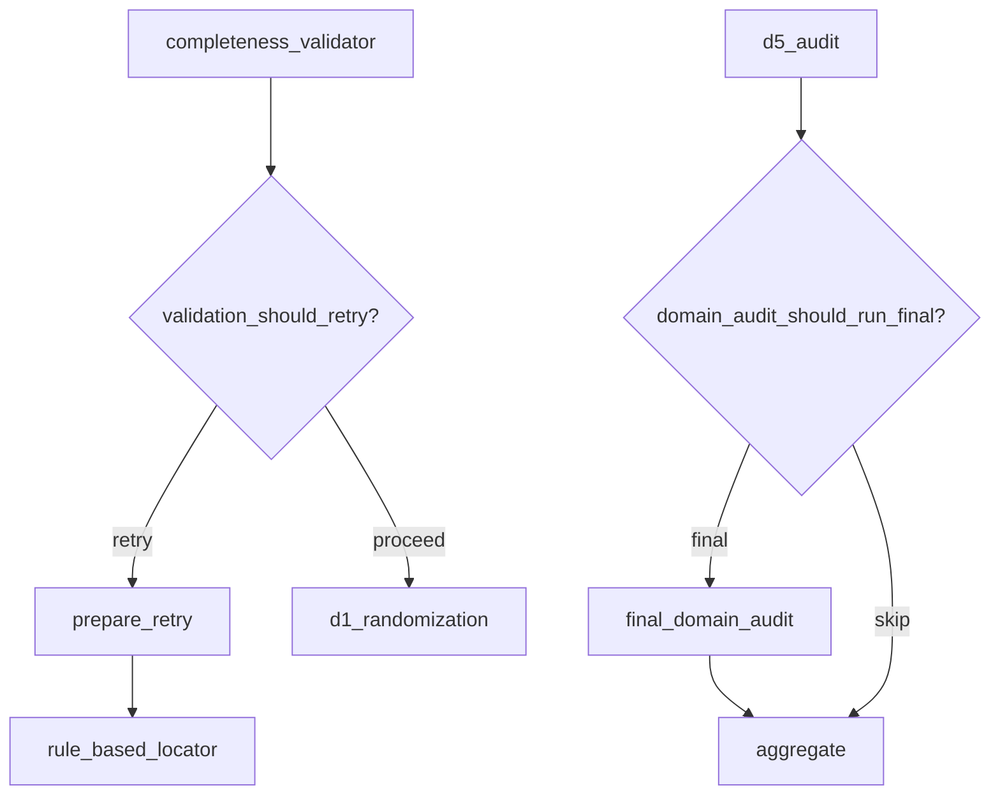

# Workflow State Model

<cite>
**Referenced Files in This Document**   
- [rob2_graph.py](file://src/pipelines/graphs/rob2_graph.py)
- [rob2.py](file://src/schemas/internal/rob2.py)
- [decisions.py](file://src/schemas/internal/decisions.py)
- [evidence.py](file://src/schemas/internal/evidence.py)
- [documents.py](file://src/schemas/internal/documents.py)
- [preprocess.py](file://src/pipelines/graphs/nodes/preprocess.py)
- [planner.py](file://src/pipelines/graphs/nodes/planner.py)
- [fusion.py](file://src/pipelines/graphs/nodes/fusion.py)
- [completeness.py](file://src/pipelines/graphs/nodes/validators/completeness.py)
- [d1_randomization.py](file://src/pipelines/graphs/nodes/domains/d1_randomization.py)
- [routing.py](file://src/pipelines/graphs/routing.py)
- [question_bank.py](file://src/rob2/question_bank.py)
- [rob2_runner.py](file://src/services/rob2_runner.py)
</cite>

## Table of Contents
1. [Introduction](#introduction)
2. [Rob2GraphState Structure](#rob2graphstate-structure)
3. [Document Metadata](#document-metadata)
4. [Question Bank and Configuration](#question-bank-and-configuration)
5. [Evidence Candidates](#evidence-candidates)
6. [Validation Results](#validation-results)
7. [Domain Decisions](#domain-decisions)
8. [Audit Trails](#audit-trails)
9. [State Evolution Through Graph Nodes](#state-evolution-through-graph-nodes)
10. [Conditional Routing](#conditional-routing)
11. [Performance Considerations](#performance-considerations)
12. [Extending the State](#extending-the-state)

## Introduction
The Rob2GraphState is the central TypedDict that maintains the complete workflow state throughout the LangGraph execution for ROB2 (Risk Of Bias 2) assessment. This state object serves as the single source of truth that flows through each node in the graph, carrying document metadata, question banks, evidence candidates, validation results, domain decisions, and audit trails. The state is designed to support a complex workflow that includes preprocessing, evidence location, fusion, validation, domain reasoning, and optional audit steps. With over 200 fields, this state model enables comprehensive tracking of the assessment process while maintaining the necessary data for decision-making and debugging.

**Section sources**
- [rob2_graph.py](file://src/pipelines/graphs/rob2_graph.py#L46-L212)

## Rob2GraphState Structure
The Rob2GraphState is defined as a TypedDict with over 200 fields that are organized into logical groups. The structure is designed to be extensible while maintaining type safety through Python's typing system. The state includes configuration parameters, intermediate results, and final outputs that flow through the graph. Key structural characteristics include:

- **Configuration Fields**: Parameters for various components like retrieval, reranking, validation, and domain reasoning
- **Evidence Fields**: Candidates from multiple locator engines and fused results
- **Validation Fields**: Results from relevance, existence, consistency, and completeness validation
- **Decision Fields**: Domain-level risk assessments and final outputs
- **Audit Fields**: Records of audit processes and debugging information

The state uses optional typing (total=False) to allow incremental population of fields as the workflow progresses. This design enables nodes to read required inputs and write their outputs without needing to handle the entire state structure.

**Diagram sources **
- [rob2_graph.py](file://src/pipelines/graphs/rob2_graph.py#L46-L212)

**Section sources**
- [rob2_graph.py](file://src/pipelines/graphs/rob2_graph.py#L46-L212)

## Document Metadata
The document metadata section of Rob2GraphState contains information about the input document and its processed structure. These fields are populated during the preprocessing phase and serve as the foundation for subsequent analysis.

- **pdf_path**: The file path to the input PDF document
- **doc_structure**: The normalized document structure extracted by Docling, containing body text, sections, and spans with rich metadata
- **docling_layout_model**: The layout model name used by Docling for document parsing
- **docling_artifacts_path**: Local model artifacts directory for Docling
- **docling_chunker_model**: The tokenizer model used for chunking
- **docling_chunker_max_tokens**: Maximum tokens per chunk for the chunker

The doc_structure field contains a hierarchical representation of the document with paragraph-level spans that include title, page number, bounding boxes, and text content. This structured representation enables section-aware retrieval and evidence location.

**Diagram sources **
- [documents.py](file://src/schemas/internal/documents.py#L34-L43)
- [preprocess.py](file://src/pipelines/graphs/nodes/preprocess.py#L28-L36)

**Section sources**
- [preprocess.py](file://src/pipelines/graphs/nodes/preprocess.py#L28-L36)
- [documents.py](file://src/schemas/internal/documents.py#L34-L43)

## Question Bank and Configuration
The question bank and configuration section contains the ROB2 signaling questions and related configuration parameters that guide the assessment process.

- **question_set**: The standardized ROB2 question set loaded from YAML, containing all signaling questions with their dependencies and conditions
- **ALLOWED_ANSWERS**: The set of allowed answer options {"Y", "PY", "PN", "N", "NI", "NA"}
- **QuestionDependency**: Dependencies on other signaling questions' answers
- **QuestionCondition**: Logical conditions gating a question with operators "any" or "all"
- **Rob2Question**: Individual ROB2 signaling question definition with question_id, rob2_id, domain, effect_type, text, options, conditions, and order

The question bank is loaded from rob2_questions.yaml and validated using Pydantic models to ensure structural integrity. Each question has a unique question_id, belongs to one of the five domains (D1-D5), and may have conditional dependencies on other questions. The effect_type field is required for D2 questions and indicates whether the assessment is for "assignment" or "adherence".

**Diagram sources **
- [rob2.py](file://src/schemas/internal/rob2.py#L82-L129)
- [question_bank.py](file://src/rob2/question_bank.py#L37-L40)

**Section sources**
- [rob2.py](file://src/schemas/internal/rob2.py#L82-L129)
- [question_bank.py](file://src/rob2/question_bank.py#L37-L40)

## Evidence Candidates
The evidence candidates section contains results from multiple locator engines and their fused representations. This hierarchical structure enables comprehensive evidence gathering from diverse sources.

- **rule_based_candidates**: Candidates identified through rule-based location using predefined patterns and heuristics
- **bm25_candidates**: Candidates retrieved using BM25 keyword search
- **splade_candidates**: Candidates retrieved using SPLADE sparse embedding model
- **fulltext_candidates**: Candidates from full-text search
- **fusion_candidates**: Merged candidates from multiple engines using Reciprocal Rank Fusion (RRF)
- **relevance_candidates**: Candidates that passed relevance validation
- **existence_candidates**: Candidates that passed existence validation

Each candidate includes detailed metadata such as question_id, paragraph_id, title, page, text, source, scores from various engines, and additional features like section_score, keyword_score, and matched_keywords. The fusion process combines candidates from multiple engines, assigning fusion_score, fusion_rank, and support_count based on their performance across engines.

**Diagram sources **
- [evidence.py](file://src/schemas/internal/evidence.py#L21-L157)
- [fusion.py](file://src/pipelines/graphs/nodes/fusion.py#L16-L83)

**Section sources**
- [evidence.py](file://src/schemas/internal/evidence.py#L21-L157)
- [fusion.py](file://src/pipelines/graphs/nodes/fusion.py#L16-L83)

## Validation Results
The validation results section contains the outcomes of multiple validation steps that ensure the quality and reliability of evidence candidates. These validations form a multi-stage filtering process that progressively refines the evidence set.

- **relevance_candidates**: Candidates annotated with relevance judgments (relevant, irrelevant, unknown) and confidence scores
- **existence_candidates**: Candidates annotated with existence judgments (pass, fail) and supporting evidence
- **consistency_failed_questions**: Questions with inconsistent evidence across candidates
- **completeness_report**: Detailed report on completeness validation for each question
- **completeness_passed**: Boolean indicating whether completeness validation passed
- **completeness_failed_questions**: List of questions that failed completeness validation

The validation process follows a pipeline: relevance → existence → consistency → completeness. Each stage builds on the previous one, with completeness being the final gate before domain reasoning. The relevance validator determines whether a candidate is relevant to the question, the existence validator checks if the candidate contains evidence for the answer, the consistency validator identifies conflicts between candidates, and the completeness validator ensures sufficient evidence is available.

**Diagram sources **
- [evidence.py](file://src/schemas/internal/evidence.py#L71-L124)
- [completeness.py](file://src/pipelines/graphs/nodes/validators/completeness.py#L20-L140)

**Section sources**
- [evidence.py](file://src/schemas/internal/evidence.py#L71-L124)
- [completeness.py](file://src/pipelines/graphs/nodes/validators/completeness.py#L20-L140)

## Domain Decisions
The domain decisions section contains the final risk assessments for each of the five ROB2 domains. These decisions are the culmination of the evidence gathering and validation process.

- **d1_decision**: Decision for Domain 1 (Randomization)
- **d2_decision**: Decision for Domain 2 (Deviations from Intended Interventions)
- **d3_decision**: Decision for Domain 3 (Missing Outcome Data)
- **d4_decision**: Decision for Domain 4 (Measurement of the Outcome)
- **d5_decision**: Decision for Domain 5 (Selection of the Reported Result)

Each domain decision includes the risk level (low, some_concerns, high), rationale, confidence, and detailed answers to signaling questions with supporting evidence. The DomainDecision model also tracks missing questions that could not be answered due to insufficient evidence.

**Diagram sources **
- [decisions.py](file://src/schemas/internal/decisions.py#L38-L57)
- [d1_randomization.py](file://src/pipelines/graphs/nodes/domains/d1_randomization.py#L15-L47)

**Section sources**
- [decisions.py](file://src/schemas/internal/decisions.py#L38-L57)
- [d1_randomization.py](file://src/pipelines/graphs/nodes/domains/d1_randomization.py#L15-L47)

## Audit Trails
The audit trails section contains records of the audit process and debugging information that enable transparency and reproducibility.

- **domain_audit_mode**: The audit mode (none, llm)
- **domain_audit_model**: The LLM model used for auditing
- **domain_audit_temperature**: The temperature setting for the audit LLM
- **domain_audit_timeout**: The timeout for audit operations
- **domain_audit_max_tokens**: The maximum tokens for audit responses
- **domain_audit_max_retries**: The maximum retries for audit operations
- **domain_audit_patch_window**: The window size for patching audit results
- **domain_audit_max_patches_per_question**: Maximum patches per question
- **domain_audit_rerun_domains**: Whether to rerun domain reasoning after audit
- **domain_audit_final**: Whether this is the final audit
- **domain_audit_llm**: The LLM instance for auditing
- **domain_audit_report**: The audit report for the current domain
- **domain_audit_reports**: Aggregated audit reports across all domains
- **validation_retry_log**: Log of validation retry attempts
- **completeness_config**: Configuration used for completeness validation
- **consistency_config**: Configuration used for consistency validation
- **relevance_config**: Configuration used for relevance validation

The audit process can be configured to run after each domain or as a final comprehensive audit. The audit reports capture the reasoning process and any modifications made to previous decisions, providing a complete audit trail.

**Section sources**
- [rob2_graph.py](file://src/pipelines/graphs/rob2_graph.py#L160-L173)
- [routing.py](file://src/pipelines/graphs/routing.py#L46-L54)
- [rob2_runner.py](file://src/services/rob2_runner.py#L319-L343)

## State Evolution Through Graph Nodes
The Rob2GraphState evolves through a series of nodes in the LangGraph workflow, with each node reading from and updating specific fields. The state transitions follow a well-defined sequence:

1. **preprocess**: Reads pdf_path and writes doc_structure
2. **planner**: Writes question_set by loading the standardized ROB2 question bank
3. **init_validation**: Initializes validation state with default values
4. **rule_based_locator**, **bm25_locator**, **splade_locator**: Populate their respective candidate fields
5. **fusion**: Combines candidates from multiple locators into fusion_candidates
6. **relevance_validator**: Annotates candidates with relevance judgments
7. **existence_validator**: Annotates candidates with existence judgments
8. **consistency_validator**: Identifies consistency conflicts
9. **completeness_validator**: Produces validated_evidence and determines if validation passes
10. **prepare_retry**: Updates configuration for retry attempts if validation fails
11. **d1_randomization** to **d5_reporting**: Perform domain reasoning and write domain decisions
12. **d1_audit** to **d5_audit**: Perform per-domain audits
13. **final_domain_audit**: Performs final comprehensive audit if enabled
14. **aggregate**: Combines results into the final rob2_result

Each node follows the pattern of reading required inputs, performing its operation, and writing outputs while preserving existing state. The state evolves from raw document data to structured evidence, validated candidates, domain decisions, and finally aggregated results.

**Diagram sources **
- [rob2_graph.py](file://src/pipelines/graphs/rob2_graph.py#L288-L425)
- [routing.py](file://src/pipelines/graphs/routing.py#L28-L43)

**Section sources**
- [rob2_graph.py](file://src/pipelines/graphs/rob2_graph.py#L288-L425)
- [routing.py](file://src/pipelines/graphs/routing.py#L28-L43)

## Conditional Routing
Conditional routing in the Rob2GraphState enables dynamic workflow behavior based on state values. Two key routing functions determine the graph's control flow:

- **validation_should_retry**: Routes to retry or proceed based on validation outcomes
- **domain_audit_should_run_final**: Routes to final audit or skip based on audit configuration

The validation_should_retry function evaluates completeness_passed, consistency_failed_questions, validation_attempt, and validation_max_retries to determine whether to retry the evidence location process. If validation fails and retries remain, the workflow rolls back to the evidence location phase with updated parameters (increased top-k values, relaxed constraints).

The domain_audit_should_run_final function checks domain_audit_mode and domain_audit_final to determine whether to run a final comprehensive audit after individual domain audits. This enables optional thorough auditing when needed.

**Diagram sources **
- [routing.py](file://src/pipelines/graphs/routing.py#L28-L54)
- [rob2_graph.py](file://src/pipelines/graphs/rob2_graph.py#L395-L416)

**Section sources**
- [routing.py](file://src/pipelines/graphs/routing.py#L28-L54)

## Performance Considerations
The Rob2GraphState contains over 200 fields, which presents performance considerations around state serialization and memory usage. Key strategies to manage performance include:

- **Selective Serialization**: Only serialize essential fields in final outputs, using options like include_audit_reports and debug_level to control payload size
- **State Pruning**: Remove intermediate fields that are no longer needed as the workflow progresses
- **Efficient Data Structures**: Use appropriate data types and structures to minimize memory footprint
- **Lazy Loading**: Load large data structures only when needed
- **Caching**: Cache expensive computations and reusable data

The state_overrides parameter in run_rob2 allows for custom state modifications without affecting the core workflow. The debug_level parameter controls the amount of debugging information included in outputs, with options for "none", "minimal", and "full" to balance detail with performance.

When extending the state for custom nodes, consider using nested dictionaries or lists to group related fields, and follow the existing naming conventions and type annotations to maintain consistency.

**Section sources**
- [rob2_runner.py](file://src/services/rob2_runner.py#L372-L378)
- [rob2_graph.py](file://src/pipelines/graphs/rob2_graph.py#L213-L214)

## Extending the State
The Rob2GraphState can be safely extended for custom nodes or debugging purposes by following these guidelines:

1. **Use Descriptive Names**: Follow the existing naming convention (snake_case) and use descriptive names that clearly indicate the field's purpose
2. **Add Type Annotations**: Include appropriate type annotations to maintain type safety
3. **Document New Fields**: Add comments explaining the purpose and usage of new fields
4. **Consider Memory Impact**: Be mindful of the memory footprint when adding large data structures
5. **Use State Overrides**: For temporary extensions, use the state_overrides parameter rather than modifying the core state definition
6. **Follow Existing Patterns**: Structure new fields similarly to existing ones (e.g., grouping related configuration parameters)

When debugging, leverage the existing debug infrastructure by setting debug_level to "minimal" or "full" rather than adding custom debugging fields. For custom nodes, consider using nested dictionaries to organize related fields and avoid polluting the top-level namespace.

**Section sources**
- [rob2_graph.py](file://src/pipelines/graphs/rob2_graph.py#L46-L212)
- [rob2_runner.py](file://src/services/rob2_runner.py#L45-L46)