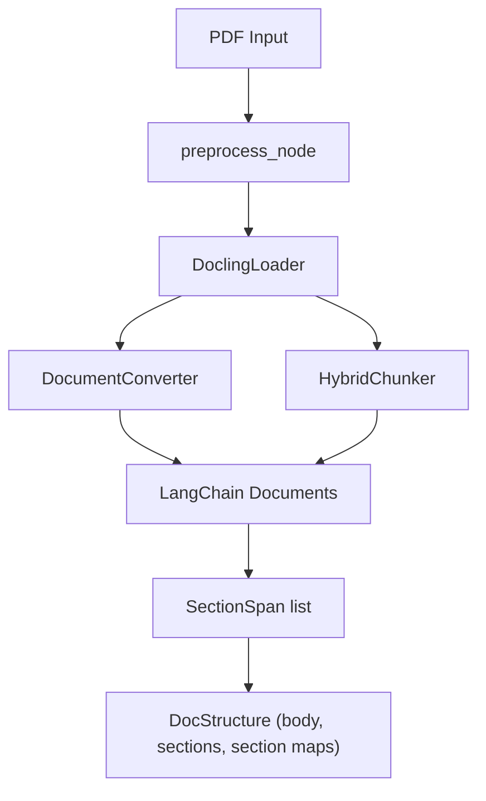
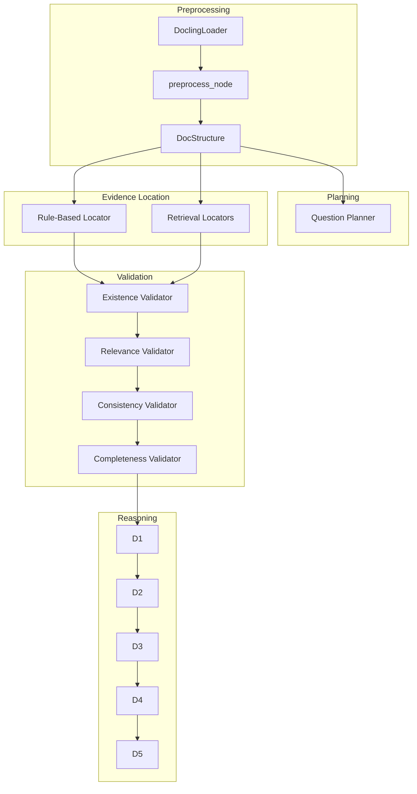
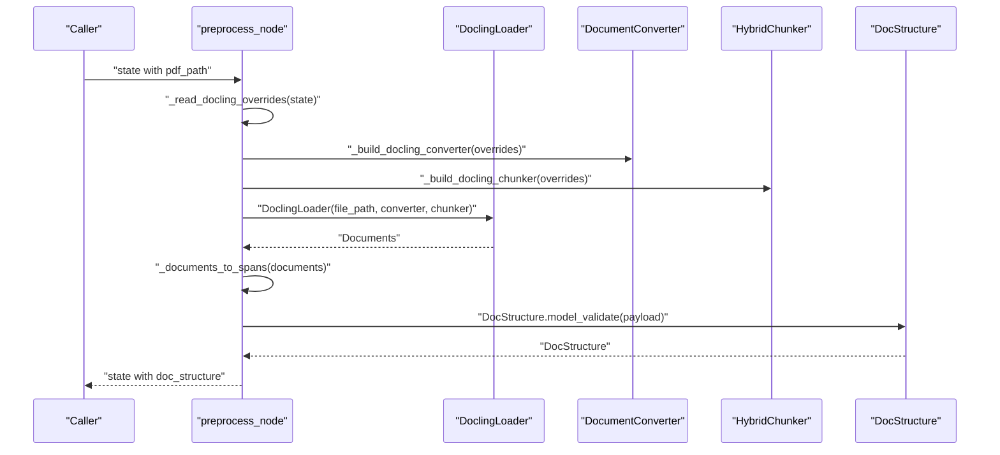
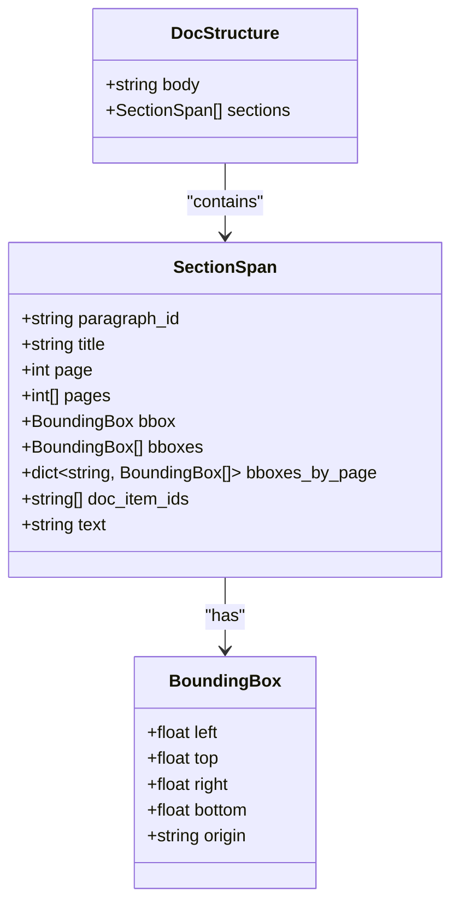
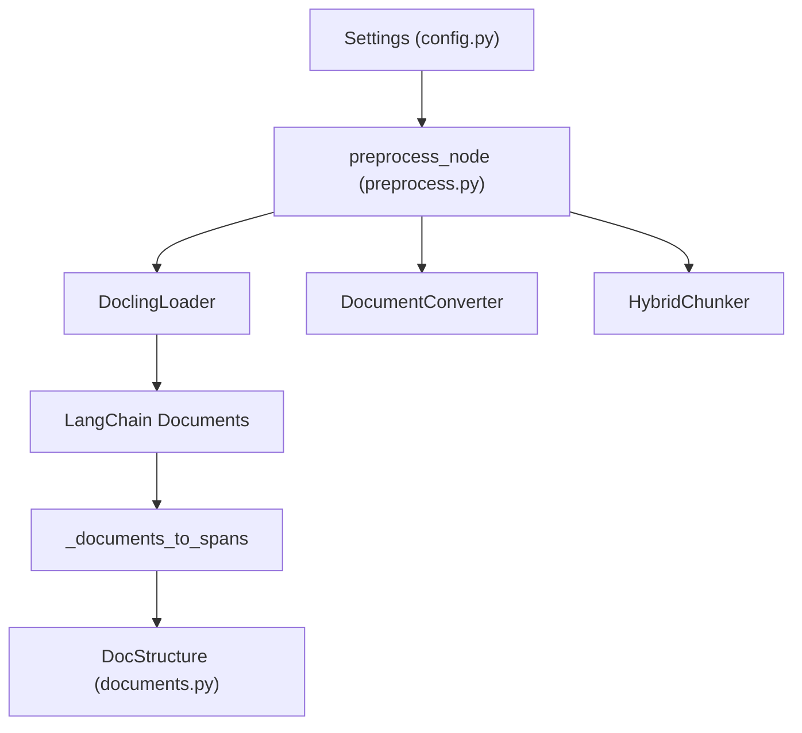

# Document Processing

<cite>
**Referenced Files in This Document**
- [config.py](file://src/core/config.py)
- [preprocess.py](file://src/pipelines/graphs/nodes/preprocess.py)
- [documents.py](file://src/schemas/internal/documents.py)
- [system-uml.md](file://docs/system-uml.md)
- [architecture.md](file://docs/architecture.md)
- [validate.py](file://src/cli/commands/validate.py)
- [check_fusion.py](file://scripts/check_fusion.py)
- [check_validation.py](file://scripts/check_validation.py)
- [0001-docling-chunker-model.md](file://docs/adr/0001-docling-chunker-model.md)
</cite>

## Table of Contents
1. [Introduction](#introduction)
2. [Project Structure](#project-structure)
3. [Core Components](#core-components)
4. [Architecture Overview](#architecture-overview)
5. [Detailed Component Analysis](#detailed-component-analysis)
6. [Dependency Analysis](#dependency-analysis)
7. [Performance Considerations](#performance-considerations)
8. [Troubleshooting Guide](#troubleshooting-guide)
9. [Conclusion](#conclusion)
10. [Appendices](#appendices)

## Introduction
This document explains the document processing sub-feature that parses PDFs into a structured document representation using Docling. It covers the end-to-end pipeline from PDF ingestion to normalized document structure, the data models used throughout the workflow, configuration options for Docling models and chunking parameters, input/output formats, and how the parsed structure enables downstream tasks such as evidence location and validation. It also addresses performance considerations for large and complex PDFs and provides troubleshooting guidance for common parsing issues.

## Project Structure
The document processing feature is implemented as a LangGraph node that integrates Docling via the LangChain DoclingLoader. The node loads a PDF, runs layout analysis and content extraction, converts the results into a normalized structure, and emits a DocStructure payload for downstream stages.

**Diagram sources**
- [preprocess.py](file://src/pipelines/graphs/nodes/preprocess.py#L28-L60)
- [preprocess.py](file://src/pipelines/graphs/nodes/preprocess.py#L63-L92)
- [preprocess.py](file://src/pipelines/graphs/nodes/preprocess.py#L94-L156)
- [preprocess.py](file://src/pipelines/graphs/nodes/preprocess.py#L159-L205)

**Section sources**
- [preprocess.py](file://src/pipelines/graphs/nodes/preprocess.py#L28-L60)
- [architecture.md](file://docs/architecture.md#L241-L249)

## Core Components
- Docling integration: The node uses Docling’s DocumentConverter and HybridChunker to perform layout analysis and content extraction, then converts LangChain Documents into a normalized structure.
- Normalized document structure: The DocStructure model defines the canonical output shape consumed by downstream components.
- Configuration: Settings are loaded centrally and can override Docling model choices and chunking parameters at runtime.

Key responsibilities:
- Parse PDFs from local paths or URLs.
- Build converter and chunker with configurable models and parameters.
- Convert extracted content into SectionSpan entries enriched with metadata (titles, pages, bounding boxes).
- Aggregate sections by title and produce a unified body text.

**Section sources**
- [preprocess.py](file://src/pipelines/graphs/nodes/preprocess.py#L28-L60)
- [preprocess.py](file://src/pipelines/graphs/nodes/preprocess.py#L94-L156)
- [preprocess.py](file://src/pipelines/graphs/nodes/preprocess.py#L159-L205)
- [documents.py](file://src/schemas/internal/documents.py#L10-L43)
- [config.py](file://src/core/config.py#L11-L26)

## Architecture Overview
The document processing pipeline is part of the preprocessing layer and feeds into planning, evidence location, fusion, validation, and reasoning stages.

**Diagram sources**
- [system-uml.md](file://docs/system-uml.md#L3-L102)
- [architecture.md](file://docs/architecture.md#L241-L249)
- [preprocess.py](file://src/pipelines/graphs/nodes/preprocess.py#L28-L60)

## Detailed Component Analysis

### Docling Pipeline and Normalized Output
The preprocess_node orchestrates the Docling pipeline:
- Validates the input source (local path or URL).
- Builds a DocumentConverter with optional layout model and artifacts path.
- Builds a HybridChunker with configurable tokenizer and max tokens.
- Loads documents via DoclingLoader and converts them to SectionSpan entries.
- Produces a DocStructure containing body text, a list of SectionSpan entries, and aggregated section texts.

**Diagram sources**
- [preprocess.py](file://src/pipelines/graphs/nodes/preprocess.py#L28-L60)
- [preprocess.py](file://src/pipelines/graphs/nodes/preprocess.py#L63-L92)
- [preprocess.py](file://src/pipelines/graphs/nodes/preprocess.py#L94-L156)
- [preprocess.py](file://src/pipelines/graphs/nodes/preprocess.py#L159-L205)

**Section sources**
- [preprocess.py](file://src/pipelines/graphs/nodes/preprocess.py#L28-L60)
- [preprocess.py](file://src/pipelines/graphs/nodes/preprocess.py#L63-L92)
- [preprocess.py](file://src/pipelines/graphs/nodes/preprocess.py#L94-L156)
- [preprocess.py](file://src/pipelines/graphs/nodes/preprocess.py#L159-L205)

### Document Structure Representation
The normalized document structure consists of:
- Body: A normalized string of the entire document text.
- Sections: A list of SectionSpan entries, each representing a paragraph-level span with metadata such as paragraph_id, title, page(s), bounding boxes, and text.
- Section maps: Aggregated text grouped by section title for quick access.

**Diagram sources**
- [documents.py](file://src/schemas/internal/documents.py#L10-L43)

**Section sources**
- [documents.py](file://src/schemas/internal/documents.py#L10-L43)
- [preprocess.py](file://src/pipelines/graphs/nodes/preprocess.py#L430-L441)

### Configuration Options for Docling Models and Processing Parameters
Configuration is centralized in Settings and can be overridden per invocation:
- Layout model selection and artifacts path for the DocumentConverter.
- Chunker model and max tokens for the HybridChunker.
- Overrides can be passed via the node state to dynamically adjust behavior.

Environment variables and fields:
- docling_layout_model: Name of the layout model to use.
- docling_artifacts_path: Local directory for model artifacts.
- docling_chunker_model: Tokenizer model identifier for chunking.
- docling_chunker_max_tokens: Maximum tokens per chunk.

These are read from Settings and applied when building the converter and chunker.

**Section sources**
- [config.py](file://src/core/config.py#L11-L26)
- [preprocess.py](file://src/pipelines/graphs/nodes/preprocess.py#L115-L156)
- [preprocess.py](file://src/pipelines/graphs/nodes/preprocess.py#L179-L205)
- [preprocess.py](file://src/pipelines/graphs/nodes/preprocess.py#L208-L216)
- [0001-docling-chunker-model.md](file://docs/adr/0001-docling-chunker-model.md#L1-L16)

### Input/Output Formats for Document Processing
- Input: A PDF path or URL. The node validates the source and proceeds with parsing.
- Output: A DocStructure payload containing:
  - body: Normalized full-text.
  - sections: List of SectionSpan entries.
  - Additional fields: spans (alias to sections), and section-title-to-text maps.

Downstream usage examples:
- CLI commands and scripts demonstrate passing doc_structure into later stages.
- The validate command constructs a base state that includes doc_structure and question_set.

**Section sources**
- [preprocess.py](file://src/pipelines/graphs/nodes/preprocess.py#L28-L60)
- [validate.py](file://src/cli/commands/validate.py#L31-L72)
- [check_fusion.py](file://scripts/check_fusion.py#L189-L194)
- [check_validation.py](file://scripts/check_validation.py#L157-L172)

### How Parsed Structure Enables Downstream Tasks
- Evidence location: The presence of paragraph_id, page(s), and bounding boxes allows precise backtracking to original document regions. Section titles enable structure-aware retrieval and filtering.
- Evidence fusion and validation: The normalized body and section maps facilitate fast access to relevant content during ranking and validation.
- Reasoning and auditing: Paragraph-level alignment and citation-ready metadata support full-text audits and patches.

**Section sources**
- [preprocess.py](file://src/pipelines/graphs/nodes/preprocess.py#L261-L305)
- [preprocess.py](file://src/pipelines/graphs/nodes/preprocess.py#L320-L343)
- [preprocess.py](file://src/pipelines/graphs/nodes/preprocess.py#L396-L428)
- [system-uml.md](file://docs/system-uml.md#L3-L102)

## Dependency Analysis
The preprocess node depends on:
- Settings for configuration.
- LangChain DoclingLoader for PDF ingestion.
- Docling DocumentConverter and HybridChunker for layout analysis and chunking.
- Internal schemas for normalized output.

**Diagram sources**
- [config.py](file://src/core/config.py#L11-L26)
- [preprocess.py](file://src/pipelines/graphs/nodes/preprocess.py#L11-L15)
- [preprocess.py](file://src/pipelines/graphs/nodes/preprocess.py#L63-L92)
- [preprocess.py](file://src/pipelines/graphs/nodes/preprocess.py#L94-L156)
- [preprocess.py](file://src/pipelines/graphs/nodes/preprocess.py#L159-L205)
- [documents.py](file://src/schemas/internal/documents.py#L10-L43)

**Section sources**
- [preprocess.py](file://src/pipelines/graphs/nodes/preprocess.py#L11-L15)
- [preprocess.py](file://src/pipelines/graphs/nodes/preprocess.py#L63-L92)
- [preprocess.py](file://src/pipelines/graphs/nodes/preprocess.py#L94-L156)
- [preprocess.py](file://src/pipelines/graphs/nodes/preprocess.py#L159-L205)
- [documents.py](file://src/schemas/internal/documents.py#L10-L43)

## Performance Considerations
- Converter and chunker caching: The node caches the DocumentConverter and HybridChunker instances globally to avoid repeated initialization overhead.
- Chunker configuration: Adjusting docling_chunker_max_tokens controls memory usage and processing speed; smaller chunks reduce memory pressure but increase overhead.
- Layout model choice: Using appropriate layout models improves accuracy and reduces retries; artifacts path can be configured for offline or cached models.
- Large PDFs and complex layouts:
  - Prefer chunker_max_tokens tuned to available memory.
  - Consider limiting concurrent processing or batching to manage resource usage.
  - For extremely large documents, consider splitting into chapters or sections upstream.
- Logging and diagnostics: The node logs parsing outcomes and warnings to aid performance tuning and debugging.

**Section sources**
- [preprocess.py](file://src/pipelines/graphs/nodes/preprocess.py#L24-L26)
- [preprocess.py](file://src/pipelines/graphs/nodes/preprocess.py#L159-L205)
- [preprocess.py](file://src/pipelines/graphs/nodes/preprocess.py#L94-L156)

## Troubleshooting Guide
Common issues and resolutions:
- Missing or invalid PDF path:
  - Ensure the input is a valid local path ending with .pdf or an http(s) URL.
  - The resolver checks existence, file type, and extension.
- No documents returned:
  - Verify that the PDF is readable and not password-protected.
  - Confirm that Docling dependencies are installed and models are accessible.
- Empty body text:
  - Check that the PDF contains extractable text and that normalization did not strip everything.
- Unknown layout model:
  - The node warns on unknown model names; confirm the model name and artifacts path.
- Chunker dependencies missing:
  - HybridChunker requires docling-core[chunking]; install the extra to enable chunking.
- Downstream failures:
  - Validate that doc_structure is present and contains sections and body before invoking later stages.

Operational tips:
- Use overrides to adjust models and parameters per run.
- Inspect the emitted docling_config payload for debugging model and artifact paths.
- For repeated runs, rely on cached converter/chunker to reduce startup time.

**Section sources**
- [preprocess.py](file://src/pipelines/graphs/nodes/preprocess.py#L239-L252)
- [preprocess.py](file://src/pipelines/graphs/nodes/preprocess.py#L130-L133)
- [preprocess.py](file://src/pipelines/graphs/nodes/preprocess.py#L175-L177)
- [preprocess.py](file://src/pipelines/graphs/nodes/preprocess.py#L82-L88)

## Conclusion
The document processing sub-feature provides a robust, configurable pipeline for extracting structured content from PDFs using Docling. By normalizing layout analysis and chunking into a consistent DocStructure, it enables efficient downstream tasks such as evidence location, fusion, and validation. Centralized configuration and caching improve performance, while rich metadata supports precise citation and auditing.

## Appendices

### Appendix A: Configuration Reference
- docling_layout_model: Layout model name for DocumentConverter.
- docling_artifacts_path: Directory for model artifacts.
- docling_chunker_model: Tokenizer model for HybridChunker.
- docling_chunker_max_tokens: Maximum tokens per chunk.

**Section sources**
- [config.py](file://src/core/config.py#L11-L26)
- [preprocess.py](file://src/pipelines/graphs/nodes/preprocess.py#L115-L156)
- [preprocess.py](file://src/pipelines/graphs/nodes/preprocess.py#L179-L205)

### Appendix B: Example Workflows
- CLI validation workflow constructs a base state including doc_structure and question_set, then runs downstream nodes.
- Scripts demonstrate parsing a PDF and using the resulting DocStructure for fusion and validation.

**Section sources**
- [validate.py](file://src/cli/commands/validate.py#L31-L72)
- [check_fusion.py](file://scripts/check_fusion.py#L189-L194)
- [check_validation.py](file://scripts/check_validation.py#L157-L172)