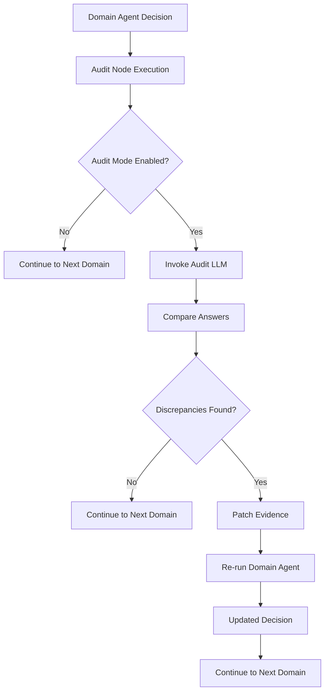
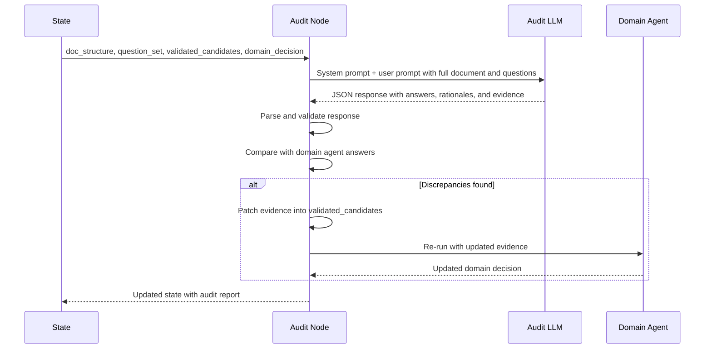
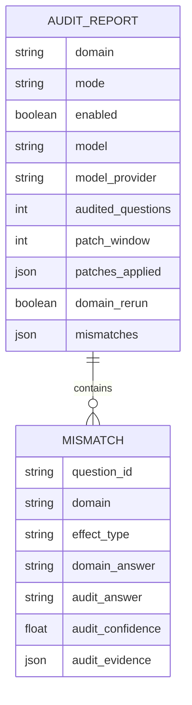

# Domain Audit

<cite>
**Referenced Files in This Document**   
- [domain_audit.py](file://src/pipelines/graphs/nodes/domain_audit.py)
- [domain_audit_system.md](file://src/llm/prompts/validators/domain_audit_system.md)
- [audit.py](file://src/cli/commands/audit.py)
- [rob2_runner.py](file://src/services/rob2_runner.py)
- [config.py](file://src/core/config.py)
- [rob2_graph.py](file://src/pipelines/graphs/rob2_graph.py)
- [requests.py](file://src/schemas/requests.py)
- [responses.py](file://src/schemas/responses.py)
- [0005-domain-fulltext-audit-and-evidence-patching.md](file://docs/adr/0005-domain-fulltext-audit-and-evidence-patching.md)
</cite>

## Table of Contents
1. [Introduction](#introduction)
2. [Audit Process Overview](#audit-process-overview)
3. [LLM-Based Audit Mechanism](#llm-based-audit-mechanism)
4. [Configuration Options](#configuration-options)
5. [Audit Workflow](#audit-workflow)
6. [Audit Reports](#audit-reports)
7. [Impact on Final Assessments](#impact-on-final-assessments)
8. [Performance Considerations](#performance-considerations)
9. [Use Case Guidance](#use-case-guidance)
10. [Conclusion](#conclusion)

## Introduction

The Domain Audit sub-feature provides a comprehensive verification mechanism for domain-level decisions in the ROB2 assessment system. This feature operates as an optional validation layer that can identify and correct potential errors in domain reasoning by leveraging a dedicated LLM-based audit process. The audit system is designed to enhance assessment reliability through evidence patching and optional re-running of domain reasoning, ensuring that final risk judgments are based on complete and accurate evidence.

The audit process was introduced as part of Milestone 9 to address limitations in evidence recall and potential misjudgments that could occur when domain agents operate with filtered evidence. Rather than introducing additional hard rules, the audit system uses a separate LLM call to perform a full-text review of the document, comparing its findings with the domain agent's conclusions and patching any missing evidence when discrepancies are found.

**Section sources**
- [0005-domain-fulltext-audit-and-evidence-patching.md](file://docs/adr/0005-domain-fulltext-audit-and-evidence-patching.md)

## Audit Process Overview

The domain audit process verifies and potentially corrects domain-level decisions through a systematic comparison between the domain agent's conclusions and an independent full-text analysis. This process operates on a per-domain basis, with dedicated audit nodes for each of the five ROB2 domains (D1-D5).

The audit workflow begins after a domain agent has completed its reasoning process. The audit node receives the full document structure, the domain-specific questions, and the domain agent's decision. It then invokes a specialized LLM (the audit model) to independently assess each signaling question using the complete document text. The audit model's answers are compared against the domain agent's answers, and any discrepancies trigger the evidence patching mechanism.

When the audit identifies a missing or incorrect answer, it extracts evidence citations (paragraph ID and exact quote) from its analysis and patches these into the validated evidence pool. This patched evidence is then used to re-run the domain reasoning process, allowing the domain agent to potentially revise its decision based on the newly available information.



**Diagram sources**
- [domain_audit.py](file://src/pipelines/graphs/nodes/domain_audit.py)
- [0005-domain-fulltext-audit-and-evidence-patching.md](file://docs/adr/0005-domain-fulltext-audit-and-evidence-patching.md)

**Section sources**
- [domain_audit.py](file://src/pipelines/graphs/nodes/domain_audit.py)
- [0005-domain-fulltext-audit-and-evidence-patching.md](file://docs/adr/0005-domain-fulltext-audit-and-evidence-patching.md)

## LLM-Based Audit Mechanism

The LLM-based audit mechanism is the core component of the domain audit system, responsible for performing independent verification of domain-level decisions. This mechanism uses a specialized prompt template and a dedicated LLM to analyze the full document text and answer ROB2 signaling questions without the constraints of pre-filtered evidence.

The audit LLM receives two primary inputs: the complete set of document spans (paragraphs with IDs, titles, and text) and the signaling questions for a specific domain. It processes these inputs to generate answers grounded in the document, following strict rules to ensure reliability and consistency. The audit model must choose answers from predefined options, provide rationales for its selections, and cite evidence with exact paragraph IDs and quotes from the text.

The audit system employs a robust response parsing mechanism to handle potential formatting issues. It first attempts to parse the LLM's output as structured JSON, but if this fails, it uses regular expressions to extract JSON objects from code blocks or find the first complete JSON object in the response. This ensures resilience against common LLM formatting errors while maintaining the integrity of the audit process.



**Diagram sources**
- [domain_audit.py](file://src/pipelines/graphs/nodes/domain_audit.py)
- [domain_audit_system.md](file://src/llm/prompts/validators/domain_audit_system.md)

**Section sources**
- [domain_audit.py](file://src/pipelines/graphs/nodes/domain_audit.py)
- [domain_audit_system.md](file://src/llm/prompts/validators/domain_audit_system.md)

## Configuration Options

The domain audit system provides several configuration options that control its behavior and performance characteristics. These options can be set through environment variables, configuration files, or command-line parameters, allowing for flexible deployment in different use cases.

The primary configuration option is `domain_audit_mode`, which determines whether the audit process is enabled. When set to "none" (the default), the audit nodes are bypassed entirely. When set to "llm", the full audit process is activated. This binary switch allows users to control the trade-off between assessment accuracy and processing cost.

Additional configuration options include:
- `domain_audit_model`: Specifies the LLM model to use for auditing
- `domain_audit_model_provider`: Identifies the provider of the audit model
- `domain_audit_temperature`: Controls the randomness of the audit LLM's responses
- `domain_audit_timeout`: Sets the maximum time to wait for audit LLM responses
- `domain_audit_max_tokens`: Limits the response length from the audit LLM
- `domain_audit_max_retries`: Determines how many times to retry failed audit LLM calls

The evidence patching behavior is controlled by `domain_audit_patch_window`, which specifies how many adjacent paragraphs to include when patching evidence (0 means only the cited paragraph). The `domain_audit_max_patches_per_question` parameter limits the number of evidence patches applied per question to prevent excessive modifications.

```mermaid
graph TD
A[Audit Configuration] --> B[Mode Settings]
A --> C[Model Settings]
A --> D[Patching Settings]
A --> E[Execution Settings]
B --> B1[domain_audit_mode: "none"|"llm"]
C --> C1[domain_audit_model: string]
C --> C2[domain_audit_model_provider: string]
C --> C3[domain_audit_temperature: float]
C --> C4[domain_audit_timeout: float]
C --> C5[domain_audit_max_tokens: int]
C --> C6[domain_audit_max_retries: int]
D --> D1[domain_audit_patch_window: int]
D --> D2[domain_audit_max_patches_per_question: int]
E --> E1[domain_audit_rerun_domains: bool]
E --> E2[domain_audit_final: bool]
```

**Diagram sources**
- [config.py](file://src/core/config.py)
- [requests.py](file://src/schemas/requests.py)

**Section sources**
- [config.py](file://src/core/config.py)
- [requests.py](file://src/schemas/requests.py)
- [audit.py](file://src/cli/commands/audit.py)

## Audit Workflow

The audit workflow consists of several sequential steps that verify domain decisions and potentially correct them through evidence patching and re-processing. This workflow is implemented as a series of nodes in the ROB2 graph, with each domain having its own audit node that executes after the corresponding domain agent.

The workflow begins with the audit node validating its required inputs: the document structure, question set, and validated candidates. It then checks the audit mode configuration to determine whether to proceed with the audit process. If audit mode is disabled, the node returns a simple report indicating that auditing was not performed.

When audit mode is enabled, the node constructs a prompt containing the full document spans and the domain-specific questions. This prompt is sent to the audit LLM, which generates answers for each question with supporting evidence. The node parses and validates the LLM's response, normalizing the answers to ensure they conform to the expected format and options.

The audit results are then compared with the domain agent's answers to identify any discrepancies. For each mismatch, the node attempts to patch the audit evidence into the validated candidates pool. This involves verifying that the cited paragraph IDs exist in the document and that the quoted text matches the document content. The patching process respects the configured patch window, potentially including adjacent paragraphs to provide context.

If evidence patching occurs and the `domain_audit_rerun_domains` flag is enabled, the node re-invokes the corresponding domain agent with the updated evidence pool. This allows the domain agent to reconsider its decision based on the newly available information. The final output includes both the audit report and the potentially updated domain decision.

```mermaid
flowchart TD
A[Start Audit] --> B[Validate Inputs]
B --> C{Audit Mode = "llm"?}
C --> |No| D[Return Disabled Report]
C --> |Yes| E[Build Audit Prompt]
E --> F[Invoke Audit LLM]
F --> G[Parse LLM Response]
G --> H[Normalize Answers]
H --> I[Compare with Domain Answers]
I --> J{Discrepancies Found?}
J --> |No| K[Return Audit Report]
J --> |Yes| L[Patch Evidence]
L --> M{Re-run Domain Enabled?}
M --> |No| N[Return Audit Report]
M --> |Yes| O[Re-run Domain Agent]
O --> P[Update Domain Decision]
P --> K
```

**Diagram sources**
- [domain_audit.py](file://src/pipelines/graphs/nodes/domain_audit.py)
- [rob2_graph.py](file://src/pipelines/graphs/rob2_graph.py)

**Section sources**
- [domain_audit.py](file://src/pipelines/graphs/nodes/domain_audit.py)
- [rob2_graph.py](file://src/pipelines/graphs/rob2_graph.py)

## Audit Reports

Audit reports provide detailed information about the audit process and its outcomes, serving as a transparent record of the verification and correction activities. These reports are included in the final output when audit mode is enabled and can be accessed through the audit_reports field in the response.

Each audit report contains several key pieces of information:
- The domain being audited
- The audit mode that was used
- Whether the audit was enabled
- The model used for auditing
- The number of questions audited
- A list of any answer mismatches found
- Details about evidence patches applied
- Whether the domain was re-run after patching

The report also includes configuration details about the audit LLM, such as the model ID and provider, allowing for traceability and reproducibility. When evidence patching occurs, the report specifies how many patches were applied for each question, providing insight into the extent of the corrections made.

For the optional final audit (when `domain_audit_final` is enabled), a separate report is generated that covers all domains. This comprehensive audit does not trigger re-processing but provides a final consistency check across the entire assessment.

The audit reports are designed to be machine-readable while also providing human-understandable information. They are structured as JSON objects that can be easily parsed and analyzed, making them suitable for integration into reporting systems and quality assurance processes.



**Diagram sources**
- [domain_audit.py](file://src/pipelines/graphs/nodes/domain_audit.py)
- [responses.py](file://src/schemas/responses.py)

**Section sources**
- [domain_audit.py](file://src/pipelines/graphs/nodes/domain_audit.py)
- [responses.py](file://src/schemas/responses.py)

## Impact on Final Assessments

The domain audit process significantly enhances the reliability and accuracy of final assessments by addressing two key limitations in the standard ROB2 workflow: evidence recall gaps and potential reasoning errors. By providing a second, independent review of the document, the audit system acts as a quality assurance mechanism that can identify and correct issues that might otherwise go undetected.

When the audit identifies missing evidence that supports a different answer than the one provided by the domain agent, it patches this evidence into the validated pool and triggers a re-run of the domain reasoning. This ensures that the final decision is based on the most complete set of evidence available, rather than being constrained by the initial retrieval and filtering process. This is particularly valuable in cases where the initial evidence retrieval may have missed relevant passages due to semantic gaps or document structure complexities.

The audit process also contributes to assessment consistency by identifying discrepancies between the domain agent's conclusions and what can be directly supported by the document text. This helps prevent situations where domain agents might make inferences that are not fully grounded in the evidence, maintaining the principle that risk judgments should be evidence-driven.

For the final assessment, the presence of audit reports provides transparency into the verification process, allowing users to understand how decisions were validated and whether any corrections were made. This documentation supports the defensibility of the assessment and provides a clear audit trail for quality control purposes.

**Section sources**
- [domain_audit.py](file://src/pipelines/graphs/nodes/domain_audit.py)
- [0005-domain-fulltext-audit-and-evidence-patching.md](file://docs/adr/0005-domain-fulltext-audit-and-evidence-patching.md)

## Performance Considerations

The domain audit process introduces additional computational overhead that must be considered when deploying the system. Each audit operation requires at least one additional LLM call per domain, and potentially a second call if the domain reasoning is re-run after evidence patching. This increases both processing time and API costs compared to the standard workflow.

The performance impact is primarily determined by the audit mode setting. When audit mode is disabled ("none"), there is minimal overhead as the audit nodes simply pass through the state without invoking any LLMs. When audit mode is enabled ("llm"), the system must process the full document text through the audit LLM, which can be resource-intensive for longer documents.

To optimize audit effectiveness while managing performance, several strategies can be employed:
- Use audit mode selectively for domains where evidence recall is most critical
- Configure appropriate timeout and retry settings to balance reliability with efficiency
- Monitor the frequency of evidence patching to assess the value of the audit process
- Consider document length when enabling audit mode, as longer documents require more processing

The evidence patching window parameter (`domain_audit_patch_window`) also affects performance. A larger window increases the amount of evidence added to the validated pool, which may improve reasoning quality but also increases the input size for subsequent LLM calls. Setting this parameter to 0 (cited paragraph only) provides the most conservative patching behavior.

**Section sources**
- [domain_audit.py](file://src/pipelines/graphs/nodes/domain_audit.py)
- [rob2_runner.py](file://src/services/rob2_runner.py)

## Use Case Guidance

The domain audit feature should be enabled based on specific use case requirements and risk tolerance. The default configuration disables audit mode ("none") to prioritize efficiency, but enabling it ("llm") provides enhanced verification for critical applications.

Audit mode is recommended for use cases where:
- Assessment accuracy is paramount and the cost of errors is high
- Documents are complex or have non-standard structures that may challenge evidence retrieval
- Regulatory or compliance requirements demand thorough verification processes
- The assessment is being used for high-stakes decisions

For routine assessments or when processing large volumes of documents, audit mode may be selectively enabled for specific domains rather than across all domains. Domains with more subjective judgments or where evidence is typically scattered throughout the document (such as D4: Measurement of the outcome) may benefit more from auditing than domains with more structured reporting (such as D1: Randomization).

The final all-domain audit (`domain_audit_final`) is particularly useful as a quality control measure for completed assessments, providing a comprehensive consistency check without the cost of re-processing. This option is recommended for final validation before delivering assessment results.

Organizations should monitor audit reports to understand how frequently evidence patching occurs and which domains most commonly require correction. This information can inform decisions about whether to keep audit mode enabled and help identify areas where the primary evidence retrieval system might be improved.

**Section sources**
- [audit.py](file://src/cli/commands/audit.py)
- [config.py](file://src/core/config.py)
- [0005-domain-fulltext-audit-and-evidence-patching.md](file://docs/adr/0005-domain-fulltext-audit-and-evidence-patching.md)

## Conclusion

The Domain Audit sub-feature provides a sophisticated mechanism for verifying and enhancing the reliability of ROB2 assessments. By implementing a dedicated LLM-based audit process that operates on the full document text, the system can identify and correct potential gaps in evidence recall and reasoning errors that might occur in the standard workflow.

The audit process is designed to be non-intrusive and evidence-driven, patching missing evidence into the validated pool rather than directly overriding domain agent decisions. This approach maintains the integrity of the primary reasoning process while providing a safety net that improves overall assessment quality.

With configurable options for audit mode, model selection, evidence patching, and re-processing, the system offers flexibility to balance accuracy and efficiency based on specific use case requirements. The comprehensive audit reports provide transparency into the verification process, supporting the defensibility and reliability of final assessments.

Organizations should consider enabling audit mode for high-stakes assessments or when processing complex documents, while using the final all-domain audit as a quality control measure for completed assessments. By leveraging this feature appropriately, users can significantly enhance the trustworthiness of their ROB2 evaluations.

[No sources needed since this section summarizes without analyzing specific files]