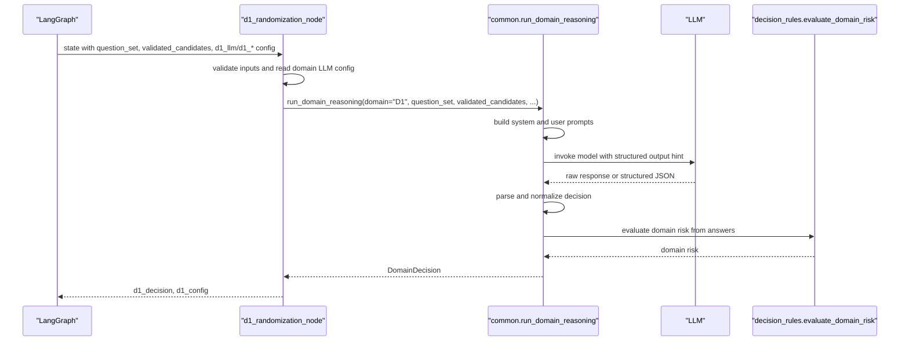
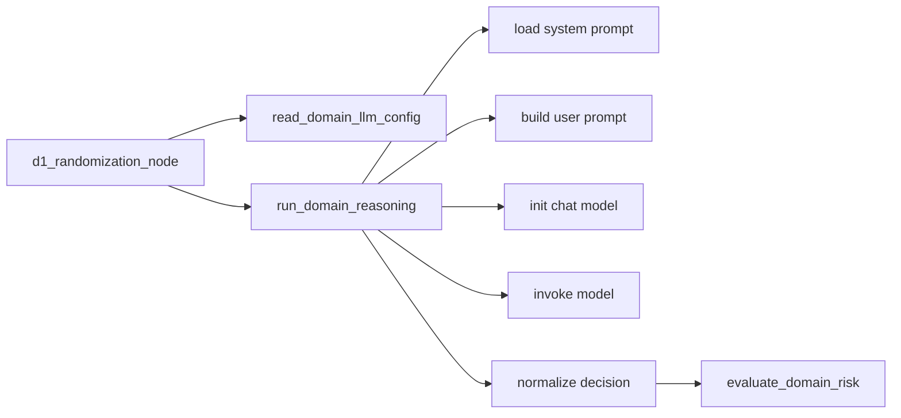

# D1: Randomization

<cite>
**Referenced Files in This Document**
- [d1_randomization.py](file://src/pipelines/graphs/nodes/domains/d1_randomization.py)
- [common.py](file://src/pipelines/graphs/nodes/domains/common.py)
- [d1_system.md](file://src/llm/prompts/domains/d1_system.md)
- [rob2_graph.py](file://src/pipelines/graphs/rob2_graph.py)
- [decisions.py](file://src/schemas/internal/decisions.py)
- [evidence.py](file://src/schemas/internal/evidence.py)
- [rob2_questions.yaml](file://src/rob2/rob2_questions.yaml)
- [decision_rules.py](file://src/rob2/decision_rules.py)
- [domain_playground.py](file://src/playground/domain_playground.py)
- [test_domain_reasoning.py](file://tests/unit/test_domain_reasoning.py)
</cite>

## Table of Contents
1. [Introduction](#introduction)
2. [Project Structure](#project-structure)
3. [Core Components](#core-components)
4. [Architecture Overview](#architecture-overview)
5. [Detailed Component Analysis](#detailed-component-analysis)
6. [Dependency Analysis](#dependency-analysis)
7. [Performance Considerations](#performance-considerations)
8. [Troubleshooting Guide](#troubleshooting-guide)
9. [Conclusion](#conclusion)
10. [Appendices](#appendices)

## Introduction
This document explains the D1: Randomization domain reasoning component that evaluates risk of bias related to randomization in clinical trials. It focuses on two core aspects:
- Sequence generation: whether the allocation sequence was random.
- Allocation concealment: whether the allocation sequence was concealed until enrollment and assignment.

The component integrates into the LangGraph workflow as a dedicated node, consuming validated evidence from prior stages (locator, fusion, and validators) and producing a structured decision with domain-level risk and per-question answers.

## Project Structure
The D1 reasoning is implemented as a LangGraph node that delegates to shared reasoning helpers. The workflow orchestrates evidence location and validation before invoking domain reasoning.

```mermaid
graph TB
subgraph "LangGraph Workflow"
PRE["preprocess"]
PLN["planner"]
RBL["rule_based_locator"]
BM25["bm25_locator"]
SPL["splade_locator"]
FUS["fusion"]
REL["relevance_validator"]
EXI["existence_validator"]
CON["consistency_validator"]
COM["completeness_validator"]
D1["d1_randomization"]
AUD["d1_audit"]
NEXT["d2_deviations"]
end
PRE --> PLN --> RBL --> BM25 --> SPL --> FUS --> REL --> EXI --> CON --> COM --> D1 --> AUD --> NEXT
```

**Diagram sources**
- [rob2_graph.py](file://src/pipelines/graphs/rob2_graph.py#L288-L417)

**Section sources**
- [rob2_graph.py](file://src/pipelines/graphs/rob2_graph.py#L288-L417)

## Core Components
- D1 node: Validates inputs, reads domain LLM configuration, and runs domain reasoning with validated evidence.
- Shared reasoning helpers: Build prompts, initialize the LLM, invoke the model, parse and normalize outputs, and compute domain risk.
- D1-specific system prompt: Defines strict instructions for the LLM, including conditional logic and required JSON schema.
- Decision schema: Enforces answer options, evidence references, and domain risk categories.
- Evidence schema: Defines the shape of validated evidence candidates consumed by the reasoning node.
- Question bank: Provides the D1 signaling questions used to drive reasoning.

Key responsibilities:
- Input validation and configuration resolution.
- Evidence selection and formatting.
- Structured output parsing and normalization.
- Risk aggregation via rule tree.

**Section sources**
- [d1_randomization.py](file://src/pipelines/graphs/nodes/domains/d1_randomization.py#L15-L44)
- [common.py](file://src/pipelines/graphs/nodes/domains/common.py#L100-L129)
- [d1_system.md](file://src/llm/prompts/domains/d1_system.md#L1-L11)
- [decisions.py](file://src/schemas/internal/decisions.py#L15-L58)
- [evidence.py](file://src/schemas/internal/evidence.py#L21-L61)
- [rob2_questions.yaml](file://src/rob2/rob2_questions.yaml#L1-L20)

## Architecture Overview
The D1 reasoning node sits after the validation stage and before the domain audit stage. It receives:
- question_set: The full set of ROB2 signaling questions.
- validated_candidates: Paragraph-level evidence bundles mapped by question_id.
- d1_llm or d1_* configuration fields for model selection and tuning.

It produces:
- d1_decision: A structured decision containing domain risk, per-question answers, and missing questions.
- d1_config: A report of the resolved LLM configuration.

**Diagram sources**
- [d1_randomization.py](file://src/pipelines/graphs/nodes/domains/d1_randomization.py#L15-L44)
- [common.py](file://src/pipelines/graphs/nodes/domains/common.py#L100-L129)
- [decision_rules.py](file://src/rob2/decision_rules.py#L22-L44)

**Section sources**
- [d1_randomization.py](file://src/pipelines/graphs/nodes/domains/d1_randomization.py#L15-L44)
- [rob2_graph.py](file://src/pipelines/graphs/rob2_graph.py#L395-L401)

## Detailed Component Analysis

### D1 Node: d1_randomization_node
Responsibilities:
- Validates presence of required state keys: question_set and validated_candidates.
- Reads domain LLM configuration using a shared helper, supporting both explicit llm object and config.
- Invokes the shared reasoning runner with evidence_top_k derived from state.
- Emits d1_decision and d1_config for downstream steps.

Behavioral notes:
- Requires validated_candidates to be a mapping keyed by question_id.
- If neither llm nor model is provided, raises an error indicating missing configuration.

Outputs:
- d1_decision: DomainDecision object.
- d1_config: Report of resolved LLM configuration.

**Section sources**
- [d1_randomization.py](file://src/pipelines/graphs/nodes/domains/d1_randomization.py#L15-L44)

### Shared Reasoning Helpers: run_domain_reasoning and Prompt Building
Core logic:
- Select questions for domain D1 from the provided QuestionSet.
- Build evidence mapping by question_id from validated_candidates, limiting to top_k.
- Load D1 system prompt template and inject effect note if present.
- Construct user prompt payload with questions and evidence.
- Initialize LLM either from provided llm or constructed from LLMReasoningConfig.
- Invoke model with structured output hint; fallback to raw text parsing with JSON extraction.
- Normalize answers to allowed options, enforce NA when conditions are not met, and collect evidence references.
- Compute domain risk using rule tree; if no rule applies, fall back to LLM-provided risk.

Configuration:
- LLMReasoningConfig supports model, provider, temperature, timeout, max_tokens, and max_retries.
- read_domain_llm_config resolves d1_* state fields into a config and a human-readable report.

Parsing and normalization:
- Strict JSON schema enforced for domain-level decision and per-question answers.
- Risk normalization maps variants to canonical values.
- Evidence references are matched to provided candidates by paragraph_id.

**Section sources**
- [common.py](file://src/pipelines/graphs/nodes/domains/common.py#L100-L129)
- [common.py](file://src/pipelines/graphs/nodes/domains/common.py#L132-L147)
- [common.py](file://src/pipelines/graphs/nodes/domains/common.py#L149-L220)
- [common.py](file://src/pipelines/graphs/nodes/domains/common.py#L241-L257)
- [common.py](file://src/pipelines/graphs/nodes/domains/common.py#L265-L279)
- [common.py](file://src/pipelines/graphs/nodes/domains/common.py#L281-L302)
- [common.py](file://src/pipelines/graphs/nodes/domains/common.py#L304-L368)
- [common.py](file://src/pipelines/graphs/nodes/domains/common.py#L425-L474)

### D1 System Prompt Template (d1_system.md)
Purpose:
- Instructs the LLM to answer only from provided evidence.
- Requires strict JSON output with domain_risk, domain_rationale, and answers.
- Enforces conditional logic: if a question’s conditions are not met, answer NA (or NI if NA not allowed).
- Specifies allowed domain_risk values and required answer fields.

Expected input format:
- User prompt payload includes:
  - domain_questions: list of D1 signaling questions with text, options, and conditions.
  - evidence: mapping of question_id to a list of evidence items (paragraph_id, title, page, text).
  - effect_type: optional, injected into system prompt if present.

Output parsing logic:
- The shared helper expects a JSON object with:
  - domain_risk ∈ {"low","some_concerns","high"}
  - domain_rationale: string
  - answers: list of items with question_id, answer, rationale, evidence (with paragraph_id and optional quote), and optional confidence

**Section sources**
- [d1_system.md](file://src/llm/prompts/domains/d1_system.md#L1-L11)
- [common.py](file://src/pipelines/graphs/nodes/domains/common.py#L190-L219)
- [common.py](file://src/pipelines/graphs/nodes/domains/common.py#L281-L302)

### Decision Schema and Evidence Schema
Decision schema enforces:
- DomainAnswer: question_id, answer ∈ {"Y","PY","PN","N","NI","NA"}, rationale, evidence_refs, optional confidence.
- DomainDecision: domain, optional effect_type, risk ∈ {"low","some_concerns","high"}, risk_rationale, answers, missing_questions.

Evidence schema defines:
- FusedEvidenceCandidate: paragraph_id, title, page, text, plus scores and provenance metadata.
- EvidenceBundle and FusedEvidenceBundle: containers for top-k evidence per question.

These schemas ensure robust parsing and consistent downstream processing.

**Section sources**
- [decisions.py](file://src/schemas/internal/decisions.py#L15-L58)
- [evidence.py](file://src/schemas/internal/evidence.py#L21-L61)
- [evidence.py](file://src/schemas/internal/evidence.py#L126-L170)

### Question Bank and D1 Signaling Questions
The D1 signaling questions define the scope of the reasoning:
- q1_1: Was the allocation sequence random?
- q1_2: Was the allocation sequence concealed until participants were enrolled and assigned to interventions?
- q1_3: Did baseline differences between intervention groups suggest a problem with the randomization process?

These are loaded from the question bank and filtered by domain.

**Section sources**
- [rob2_questions.yaml](file://src/rob2/rob2_questions.yaml#L1-L20)

### Domain Risk Rules for D1
The rule tree computes domain risk from answers to D1 questions:
- High risk if allocation concealment is not performed.
- Low risk if allocation concealment is performed and baseline differences are not a concern and sequence generation is adequate.
- Some concerns otherwise, with nuanced thresholds based on combinations of answers.

**Section sources**
- [decision_rules.py](file://src/rob2/decision_rules.py#L50-L68)

### Playground Integration
The playground demonstrates:
- How to construct validated_candidates from processed evidence.
- How to build system and user prompts for D1.
- How to run the D1 reasoning with default or custom system prompts.
- How to visualize evidence highlights on PDF pages.

This is useful for testing and debugging the D1 reasoning pipeline.

**Section sources**
- [domain_playground.py](file://src/playground/domain_playground.py#L303-L357)
- [domain_playground.py](file://src/playground/domain_playground.py#L359-L432)
- [domain_playground.py](file://src/playground/domain_playground.py#L457-L482)
- [domain_playground.py](file://src/playground/domain_playground.py#L484-L542)

## Dependency Analysis
High-level dependencies:
- d1_randomization_node depends on:
  - read_domain_llm_config and run_domain_reasoning from common.
  - QuestionSet and DomainDecision schemas.
- run_domain_reasoning depends on:
  - System prompt template loading and user prompt construction.
  - LLM initialization and invocation.
  - Decision normalization and rule-based risk computation.
- Decision rules depend on answer sets for D1.

**Diagram sources**
- [d1_randomization.py](file://src/pipelines/graphs/nodes/domains/d1_randomization.py#L15-L44)
- [common.py](file://src/pipelines/graphs/nodes/domains/common.py#L100-L129)
- [decision_rules.py](file://src/rob2/decision_rules.py#L22-L44)

**Section sources**
- [d1_randomization.py](file://src/pipelines/graphs/nodes/domains/d1_randomization.py#L15-L44)
- [common.py](file://src/pipelines/graphs/nodes/domains/common.py#L100-L129)
- [decision_rules.py](file://src/rob2/decision_rules.py#L22-L44)

## Performance Considerations
- Evidence top_k: The node passes domain_evidence_top_k from state to limit the number of evidence items considered per question. Increasing top_k improves recall but raises prompt length and cost.
- Model configuration: Temperature, timeout, max_tokens, and retries influence latency and reliability. Lower temperature reduces variability; retries improve robustness at the cost of throughput.
- Retry loop: The workflow includes a validation retry loop; ensure recursion limits are sufficient for multi-stage pipelines.
- Prompt size: Large validated_candidates increase message size; consider capping top_k and filtering noisy candidates.

[No sources needed since this section provides general guidance]

## Troubleshooting Guide
Common failure modes and mitigations:
- Missing model configuration:
  - Symptom: Error indicating missing D1 model.
  - Mitigation: Set D1_MODEL or provide d1_llm in state; ensure d1_model_provider if needed.
- Invalid inputs:
  - Symptom: ValueError for missing question_set or validated_candidates, or non-mapping candidates.
  - Mitigation: Ensure prior stages populated state correctly; validated_candidates must be a mapping keyed by question_id.
- JSON parsing errors:
  - Symptom: LLM response not valid JSON or not matching schema.
  - Mitigation: Use default system prompt; ensure LLM returns JSON as instructed; verify answer normalization and evidence references.
- Misinterpreted randomization methods:
  - Symptom: Incorrect answer to q1_1 or q1_2 despite evidence.
  - Mitigation: Provide high-quality, relevant evidence; ensure evidence includes exact quotes; adjust top_k and validation settings to improve evidence quality.
- Conditional logic not applied:
  - Symptom: Question answered instead of NA/NI when conditions are not met.
  - Mitigation: Verify question conditions in the question bank; ensure prior answers are correct so conditions evaluate as expected.

**Section sources**
- [d1_randomization.py](file://src/pipelines/graphs/nodes/domains/d1_randomization.py#L15-L44)
- [common.py](file://src/pipelines/graphs/nodes/domains/common.py#L265-L302)
- [common.py](file://src/pipelines/graphs/nodes/domains/common.py#L384-L402)
- [test_domain_reasoning.py](file://tests/unit/test_domain_reasoning.py#L43-L121)

## Conclusion
The D1: Randomization component provides a robust, configurable, and auditable pathway to assess risk of bias related to sequence generation and allocation concealment. By integrating tightly with the LangGraph workflow and leveraging shared reasoning helpers, it ensures consistent prompt construction, structured output parsing, and rule-based risk aggregation. Proper configuration of LLM parameters and careful curation of validated evidence are essential for reliable outcomes.

[No sources needed since this section summarizes without analyzing specific files]

## Appendices

### Example: Input Evidence and Expected Output
- Input evidence (conceptual):
  - q1_1: Evidence paragraph citing “allocation generated using a random number table.”
  - q1_2: Evidence paragraph citing “allocation sequence concealed until enrollment.”
  - q1_3: Evidence paragraph citing “baseline characteristics balanced across groups.”

- Expected reasoning output (conceptual):
  - Domain risk: low
  - Answers:
    - q1_1: Y with rationale “random number table used” and evidence reference to paragraph p1.
    - q1_2: Y with rationale “sequence concealed” and evidence reference to paragraph p2.
    - q1_3: N with rationale “baseline balanced” and evidence reference to paragraph p3.
  - Risk rationale: “Sequence generation and concealment were adequate; baseline differences were not problematic.”

[No sources needed since this section provides conceptual examples]

### Configuration Options
- LLM model and provider: d1_model, d1_model_provider
- Temperature: d1_temperature
- Timeout: d1_timeout
- Max tokens: d1_max_tokens
- Max retries: d1_max_retries
- Evidence top_k: domain_evidence_top_k

These are resolved into LLMReasoningConfig and surfaced in d1_config for auditability.

**Section sources**
- [rob2_graph.py](file://src/pipelines/graphs/rob2_graph.py#L90-L110)
- [common.py](file://src/pipelines/graphs/nodes/domains/common.py#L444-L474)