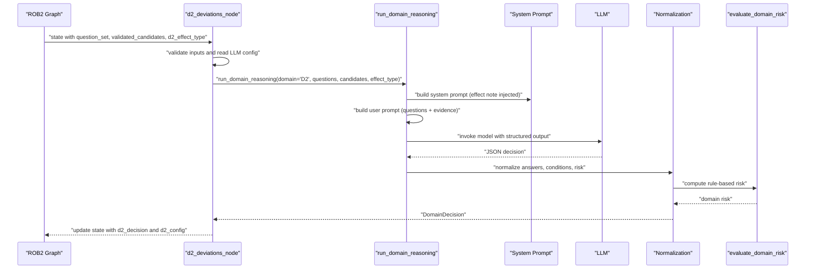
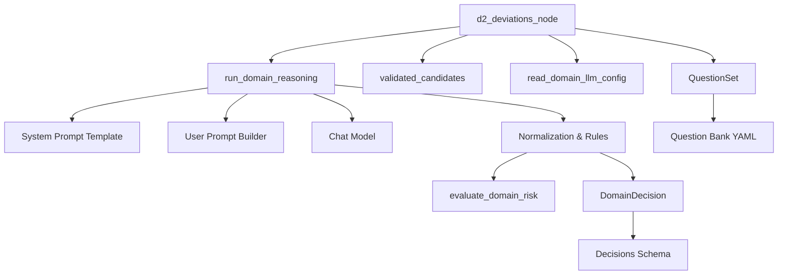
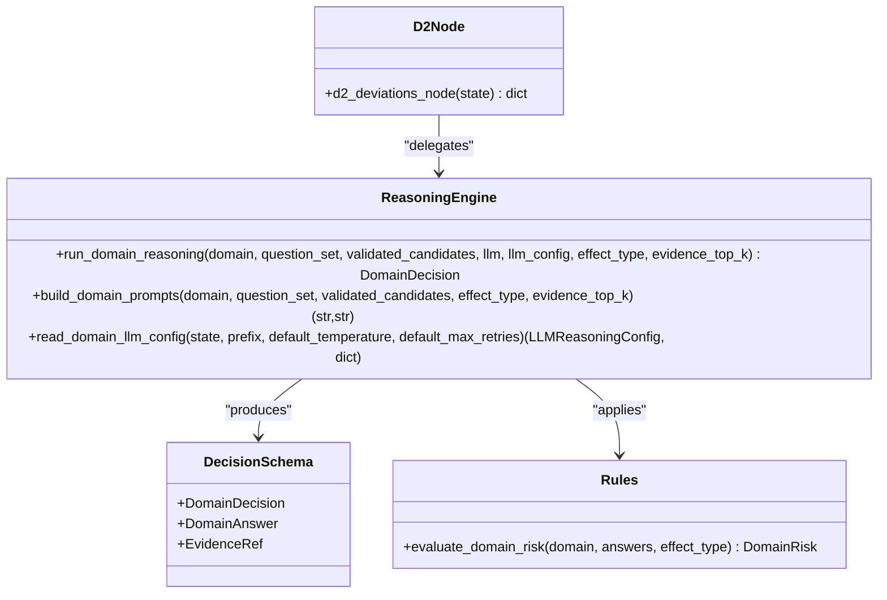

# D2: Deviations from Intended Interventions

<cite>
**Referenced Files in This Document**
- [d2_deviations.py](file://src/pipelines/graphs/nodes/domains/d2_deviations.py)
- [common.py](file://src/pipelines/graphs/nodes/domains/common.py)
- [d2_system.md](file://src/llm/prompts/domains/d2_system.md)
- [rob2_graph.py](file://src/pipelines/graphs/rob2_graph.py)
- [rob2.py](file://src/schemas/internal/rob2.py)
- [decisions.py](file://src/schemas/internal/decisions.py)
- [decision_rules.py](file://src/rob2/decision_rules.py)
- [question_bank.py](file://src/rob2/question_bank.py)
- [rob2_questions.yaml](file://src/rob2/rob2_questions.yaml)
- [test_domain_reasoning.py](file://tests/unit/test_domain_reasoning.py)
</cite>

## Table of Contents
1. [Introduction](#introduction)
2. [Project Structure](#project-structure)
3. [Core Components](#core-components)
4. [Architecture Overview](#architecture-overview)
5. [Detailed Component Analysis](#detailed-component-analysis)
6. [Dependency Analysis](#dependency-analysis)
7. [Performance Considerations](#performance-considerations)
8. [Troubleshooting Guide](#troubleshooting-guide)
9. [Conclusion](#conclusion)
10. [Appendices](#appendices)

## Introduction
This document explains the D2 domain reasoning component that evaluates bias arising from deviations from intended interventions. It focuses on how the system assesses deviations in treatment protocols, non-adherence, and intervention modifications, and how D2 integrates into the overall ROB2 workflow. It also documents the D2-specific LLM prompt, configuration parameters, and practical examples, along with accuracy challenges and performance tips.

## Project Structure
The D2 reasoning node participates in the ROB2 LangGraph workflow. The workflow orchestrates evidence retrieval, validation, and domain reasoning across D1–D5. D2 sits between D1 and D3, after validation and before missing data (D3). The node reads the question set, validated evidence candidates, and effect type, then delegates to a shared reasoning engine that builds prompts, invokes the LLM, and applies domain rules.

```mermaid
graph TB
subgraph "ROB2 Graph"
Pre["preprocess"]
Pl["planner"]
InitV["init_validation"]
RB["rule_based_locator"]
BM["bm25_locator"]
SP["splade_locator"]
Fu["fusion"]
RV["relevance_validator"]
EV["existence_validator"]
CV["consistency_validator"]
Cm["completeness_validator"]
D1["d1_randomization"]
D2["d2_deviations"]
D2A["d2_audit"]
D3["d3_missing_data"]
D3A["d3_audit"]
D4["d4_measurement"]
D4A["d4_audit"]
D5["d5_reporting"]
D5A["d5_audit"]
Agg["aggregate"]
end
Pre --> Pl --> InitV
InitV --> RB --> BM --> SP --> Fu
Fu --> RV --> EV --> CV --> Cm
Cm --> |"proceed"| D1 --> D2 --> D2A --> D3 --> D3A --> D4 --> D4A --> D5 --> D5A --> Agg
Cm --> |"retry"| InitV
```

**Diagram sources**
- [rob2_graph.py](file://src/pipelines/graphs/rob2_graph.py#L288-L423)

**Section sources**
- [rob2_graph.py](file://src/pipelines/graphs/rob2_graph.py#L288-L423)

## Core Components
- D2 reasoning node: Validates inputs, selects questions by domain and effect type, constructs prompts, and runs reasoning.
- Shared reasoning engine: Builds system and user prompts, initializes the LLM, parses and normalizes outputs, and applies domain rules.
- Decision schema: Defines the shape of domain-level decisions, including answers, evidence references, and risk.
- Question bank and rules: Provides the canonical question set and rule trees for computing domain risk.

Key responsibilities:
- Input validation and effect-type enforcement
- Evidence selection and top-k curation
- Prompt construction with effect note injection
- Structured output parsing and normalization
- Risk computation via domain rules

**Section sources**
- [d2_deviations.py](file://src/pipelines/graphs/nodes/domains/d2_deviations.py#L16-L55)
- [common.py](file://src/pipelines/graphs/nodes/domains/common.py#L100-L129)
- [decisions.py](file://src/schemas/internal/decisions.py#L15-L58)
- [rob2.py](file://src/schemas/internal/rob2.py#L47-L80)
- [decision_rules.py](file://src/rob2/decision_rules.py#L22-L44)

## Architecture Overview
The D2 node is part of the ROB2 LangGraph pipeline. It receives validated evidence candidates keyed by question ID and a question set, then computes answers and domain risk. The graph enforces a retry loop for validation and ensures robustness before D2 executes.

**Diagram sources**
- [d2_deviations.py](file://src/pipelines/graphs/nodes/domains/d2_deviations.py#L16-L55)
- [common.py](file://src/pipelines/graphs/nodes/domains/common.py#L100-L129)
- [decision_rules.py](file://src/rob2/decision_rules.py#L22-L44)

## Detailed Component Analysis

### D2 Reasoning Node
The D2 node validates required inputs, checks the effect type, and delegates to the shared reasoning engine. It supports two effect types:
- Assignment: Focuses on deviations from protocol due to trial context and whether they impacted outcomes or were balanced across groups.
- Adherence: Focuses on awareness, non-protocol interventions, implementation failures, non-adherence, and appropriate analysis given observed deviations.

Behavior highlights:
- Requires a valid question set and validated candidates mapping.
- Enforces effect type to be either "assignment" or "adherence".
- Reads LLM configuration from state or explicit LLM object.
- Uses a configurable evidence top-k to constrain evidence per question.

Outputs:
- Stores the domain decision and a config report including effect type and model metadata.

**Section sources**
- [d2_deviations.py](file://src/pipelines/graphs/nodes/domains/d2_deviations.py#L16-L55)

### Shared Reasoning Engine
The reasoning engine performs:
- Question selection filtered by domain and effect type.
- Evidence aggregation by question using validated candidates and top-k.
- System prompt loading and effect note insertion.
- User prompt construction with questions, conditions, and evidence.
- Model initialization from configuration or provided LLM.
- Structured output parsing and fallback to JSON extraction.
- Answer normalization, condition enforcement, and evidence reference collection.
- Domain risk computation via decision rules.

Key mechanisms:
- System prompt template selection and effect note substitution.
- User prompt JSON payload with evidence paragraphs and question conditions.
- Structured output binding and robust fallback parsing.
- Risk normalization and rule-based override.

**Section sources**
- [common.py](file://src/pipelines/graphs/nodes/domains/common.py#L100-L129)
- [common.py](file://src/pipelines/graphs/nodes/domains/common.py#L178-L187)
- [common.py](file://src/pipelines/graphs/nodes/domains/common.py#L189-L219)
- [common.py](file://src/pipelines/graphs/nodes/domains/common.py#L241-L257)
- [common.py](file://src/pipelines/graphs/nodes/domains/common.py#L265-L279)
- [common.py](file://src/pipelines/graphs/nodes/domains/common.py#L281-L302)
- [common.py](file://src/pipelines/graphs/nodes/domains/common.py#L304-L368)
- [common.py](file://src/pipelines/graphs/nodes/domains/common.py#L370-L373)
- [common.py](file://src/pipelines/graphs/nodes/domains/common.py#L375-L382)
- [common.py](file://src/pipelines/graphs/nodes/domains/common.py#L384-L402)
- [common.py](file://src/pipelines/graphs/nodes/domains/common.py#L404-L423)
- [common.py](file://src/pipelines/graphs/nodes/domains/common.py#L425-L442)
- [common.py](file://src/pipelines/graphs/nodes/domains/common.py#L444-L474)

### D2-Specific LLM Prompt
The D2 system prompt instructs the model to:
- Use only provided evidence to answer signaling questions.
- Return NI when evidence is insufficient.
- Return NA when question conditions are not met.
- Output strictly valid JSON with keys: domain_risk, domain_rationale, answers.
- Limit domain_risk to low, some_concerns, or high.
- Include question_id, answer, rationale, and evidence per answer.
- Use paragraph_id from provided evidence and include exact quotes when possible.
- Insert an effect note when present.

The prompt template injects an effect note indicating the effect type ("assignment" or "adherence") into the system message.

**Section sources**
- [d2_system.md](file://src/llm/prompts/domains/d2_system.md#L1-L11)
- [common.py](file://src/pipelines/graphs/nodes/domains/common.py#L178-L187)

### Question Bank and Rules
The question bank defines D2 signaling questions with:
- Domain D2 and effect type (assignment/adherence).
- Options including NA when conditions do not apply.
- Conditions that gate downstream questions based on prior answers.

Decision rules compute domain risk for D2:
- Assignment pathway: Evaluates protocol deviations and their impact and balance across groups.
- Adherence pathway: Evaluates awareness, non-protocol interventions, implementation failures, non-adherence, and appropriate analysis.

**Section sources**
- [rob2_questions.yaml](file://src/rob2/rob2_questions.yaml#L20-L88)
- [rob2_questions.yaml](file://src/rob2/rob2_questions.yaml#L89-L143)
- [rob2.py](file://src/schemas/internal/rob2.py#L47-L80)
- [decision_rules.py](file://src/rob2/decision_rules.py#L70-L123)

### Practical Example: Evidence Input and Reasoning Output
Inputs:
- Question set: D2 assignment or adherence questions.
- Validated candidates: Evidence paragraphs for each question, including paragraph_id, title, page, and text.
- Effect type: "assignment" or "adherence".

Outputs:
- DomainDecision containing:
  - Domain: "D2"
  - Effect type: "assignment" or "adherence"
  - Risk: "low", "some_concerns", or "high"
  - Risk rationale
  - Answers with question_id, answer, rationale, evidence_refs, and optional confidence
  - Missing questions when insufficient evidence

Validation and tests demonstrate:
- Condition enforcement sets downstream questions to NA when conditions are not met.
- Rule-based risk computed from answers, overriding LLM risk when applicable.
- Evidence references mapped precisely to candidate paragraph_ids.

**Section sources**
- [test_domain_reasoning.py](file://tests/unit/test_domain_reasoning.py#L122-L251)
- [test_domain_reasoning.py](file://tests/unit/test_domain_reasoning.py#L252-L414)
- [decisions.py](file://src/schemas/internal/decisions.py#L26-L58)

### Accuracy Challenges and Tuning Strategies
Common challenges:
- Distinguishing minor versus major deviations: The prompt emphasizes using only provided evidence and returning NI when insufficient. Ensure evidence candidates include precise quotes to support nuanced answers.
- Conditional gating: Downstream questions may become NA when upstream conditions are not met. Verify that evidence supports the triggering conditions.
- Risk override: Rule-based risk may override LLM risk. Align prompt expectations with rule outcomes to reduce conflicts.

Tuning strategies:
- Increase domain_evidence_top_k to surface stronger supporting evidence for nuanced judgments.
- Adjust d2_temperature to encourage deterministic responses for structured tasks.
- Provide a pre-configured d2_llm object to bypass model selection when stability is desired.
- Use domain audit mode to iteratively refine answers and evidence references.

**Section sources**
- [d2_deviations.py](file://src/pipelines/graphs/nodes/domains/d2_deviations.py#L33-L55)
- [common.py](file://src/pipelines/graphs/nodes/domains/common.py#L100-L129)
- [decision_rules.py](file://src/rob2/decision_rules.py#L22-L44)

## Dependency Analysis
D2 reasoning depends on:
- Question schema and question bank for canonical signaling questions.
- Decision schema for structured outputs.
- Decision rules for risk computation.
- Graph state for configuration and evidence inputs.
- Shared reasoning utilities for prompt building, model invocation, and normalization.

**Diagram sources**
- [d2_deviations.py](file://src/pipelines/graphs/nodes/domains/d2_deviations.py#L16-L55)
- [common.py](file://src/pipelines/graphs/nodes/domains/common.py#L100-L129)
- [rob2.py](file://src/schemas/internal/rob2.py#L82-L121)
- [decision_rules.py](file://src/rob2/decision_rules.py#L22-L44)
- [decisions.py](file://src/schemas/internal/decisions.py#L26-L58)
- [question_bank.py](file://src/rob2/question_bank.py#L15-L41)
- [rob2_questions.yaml](file://src/rob2/rob2_questions.yaml#L1-L200)

**Section sources**
- [rob2.py](file://src/schemas/internal/rob2.py#L47-L80)
- [decision_rules.py](file://src/rob2/decision_rules.py#L22-L44)
- [decisions.py](file://src/schemas/internal/decisions.py#L26-L58)
- [question_bank.py](file://src/rob2/question_bank.py#L15-L41)

## Performance Considerations
Handling large volumes of intervention data:
- Reduce evidence top-k per question to keep prompt sizes manageable while retaining the most relevant paragraphs.
- Use a pre-initialized d2_llm object to avoid repeated model initialization overhead.
- Leverage domain audit mode to iteratively patch answers and evidence references, reducing retries and re-runs.
- Monitor recursion limits in the graph; the workflow sets a higher recursion limit to accommodate retry loops and downstream nodes.

[No sources needed since this section provides general guidance]

## Troubleshooting Guide
Common issues and resolutions:
- Missing inputs: The D2 node raises errors if question_set or validated_candidates are absent or invalid. Ensure preprocessing and validation stages populate these fields.
- Invalid effect type: Only "assignment" or "adherence" are accepted. Verify state configuration for d2_effect_type.
- Missing model configuration: If neither d2_llm nor d2_model is provided, the node raises an error. Set D2_MODEL or state["d2_model"].
- Insufficient evidence: The prompt expects NI when evidence is lacking. Expand retrieval or adjust filters to include relevant paragraphs.
- Conditional NA answers: Downstream questions may become NA when conditions are not met. Confirm upstream answers satisfy dependencies.

**Section sources**
- [d2_deviations.py](file://src/pipelines/graphs/nodes/domains/d2_deviations.py#L16-L55)
- [d2_system.md](file://src/llm/prompts/domains/d2_system.md#L1-L11)
- [test_domain_reasoning.py](file://tests/unit/test_domain_reasoning.py#L122-L251)

## Conclusion
The D2 domain reasoning component systematically evaluates deviations from intended interventions by leveraging structured questions, evidence, and rule-based risk computation. Its integration into the ROB2 workflow ensures robust validation and auditing before proceeding to subsequent domains. Proper configuration of effect type, model parameters, and evidence top-k enables accurate and efficient assessments of bias due to protocol deviations and non-adherence.

## Appendices

### Configuration Parameters
- Model selection:
  - d2_model: Model identifier
  - d2_model_provider: Provider identifier
  - d2_llm: Pre-initialized chat model object (optional)
- Generation parameters:
  - d2_temperature: Sampling temperature
  - d2_timeout: Request timeout
  - d2_max_tokens: Maximum tokens
  - d2_max_retries: Number of retries
- Workflow parameters:
  - d2_effect_type: "assignment" or "adherence"
  - domain_evidence_top_k: Evidence paragraphs per question

**Section sources**
- [rob2_graph.py](file://src/pipelines/graphs/rob2_graph.py#L109-L134)
- [common.py](file://src/pipelines/graphs/nodes/domains/common.py#L444-L474)

### D2 Class and Method Relationships

**Diagram sources**
- [d2_deviations.py](file://src/pipelines/graphs/nodes/domains/d2_deviations.py#L16-L55)
- [common.py](file://src/pipelines/graphs/nodes/domains/common.py#L100-L129)
- [decisions.py](file://src/schemas/internal/decisions.py#L26-L58)
- [decision_rules.py](file://src/rob2/decision_rules.py#L22-L44)