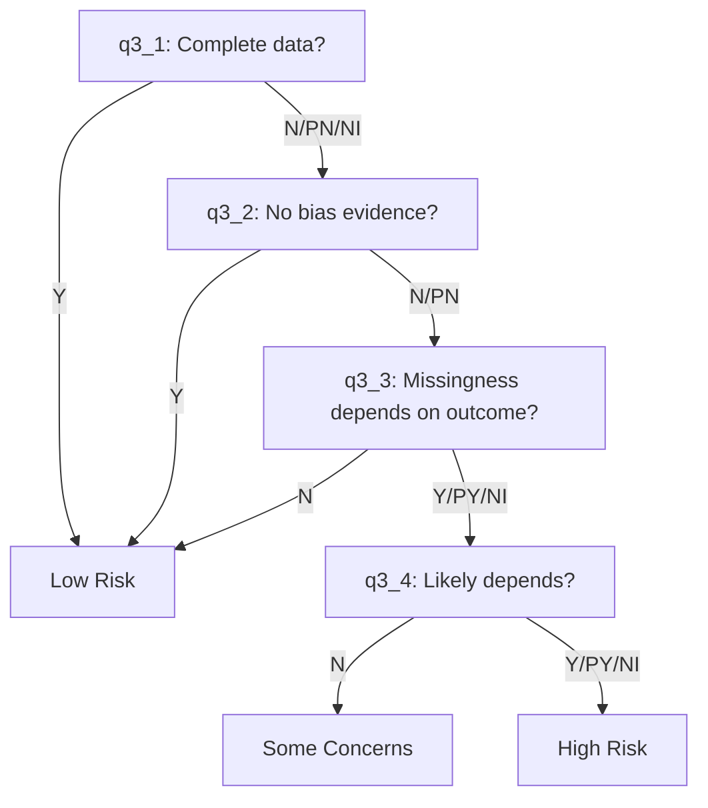
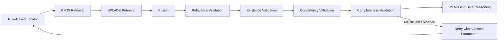
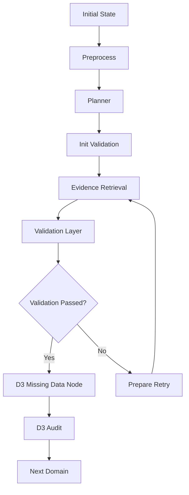
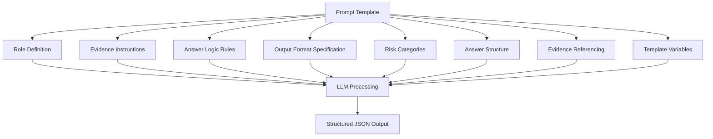
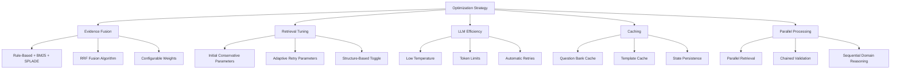

# D3: Missing Outcome Data

<cite>
**Referenced Files in This Document**   
- [d3_missing_data.py](file://src/pipelines/graphs/nodes/domains/d3_missing_data.py)
- [d3_system.md](file://src/llm/prompts/domains/d3_system.md)
- [common.py](file://src/pipelines/graphs/nodes/domains/common.py)
- [rob2_questions.yaml](file://src/rob2/rob2_questions.yaml)
- [decision_rules.py](file://src/rob2/decision_rules.py)
- [rob2_graph.py](file://src/pipelines/graphs/rob2_graph.py)
- [evidence.py](file://src/schemas/internal/evidence.py)
- [decisions.py](file://src/schemas/internal/decisions.py)
- [rob2.py](file://src/schemas/internal/rob2.py)
- [config.py](file://src/core/config.py)
- [routing.py](file://src/pipelines/graphs/routing.py)
- [test_domain_reasoning.py](file://tests/unit/test_domain_reasoning.py)
</cite>

## Table of Contents
1. [Introduction](#introduction)
2. [D3 Domain Structure and Logic](#d3-domain-structure-and-logic)
3. [Integration with Evidence Validation Pipeline](#integration-with-evidence-validation-pipeline)
4. [State Management in LangGraph](#state-management-in-langgraph)
5. [D3-Specific LLM Prompt Structure](#d3-specific-llm-prompt-structure)
6. [Configuration Options](#configuration-options)
7. [Real-World Example](#real-world-example)
8. [Common Issues and Mitigation Approaches](#common-issues-and-mitigation-approaches)
9. [Performance Optimization](#performance-optimization)
10. [Conclusion](#conclusion)

## Introduction

The D3: Missing Outcome Data domain reasoning component evaluates the risk of bias due to incomplete outcome reporting, participant dropout, and missing data handling methods in clinical studies. This document provides a comprehensive analysis of the implementation in d3_missing_data.py, focusing on its integration with the evidence validation pipeline and state management in LangGraph. The system assesses attrition rates, reasons for missingness, and statistical handling methods through a structured approach that combines rule-based logic with LLM-powered reasoning. The component is designed to handle complex longitudinal studies with sophisticated missing data patterns while maintaining high accuracy and reliability in bias assessment.

**Section sources**
- [d3_missing_data.py](file://src/pipelines/graphs/nodes/domains/d3_missing_data.py#L1-L47)
- [rob2_questions.yaml](file://src/rob2/rob2_questions.yaml#L144-L182)

## D3 Domain Structure and Logic

The D3 domain reasoning component follows a hierarchical structure of signaling questions that systematically evaluate missing outcome data. The core logic is implemented in the d3_missing_data_node function, which processes evidence and generates domain decisions. The component evaluates four key signaling questions that form a conditional chain:

1. **q3_1**: Assesses whether data for the outcome were available for all or nearly all participants randomized
2. **q3_2**: Evaluates whether missing outcome data could bias the result when data are incomplete
3. **q3_3**: Determines if missingness could depend on the true outcome value
4. **q3_4**: Assesses the likelihood that missingness depended on the true outcome value

The decision logic follows a rule-based approach defined in the _risk_d3 function in decision_rules.py. The risk assessment follows a hierarchical pattern: if complete outcome data are available (q3_1 = Y), the risk is "low". If data are incomplete but evidence shows no bias (q3_2 = Y), the risk remains "low". The risk escalates to "high" only when missingness is likely to depend on the true outcome value (q3_3 and q3_4 = Y/PY/NI). This structured approach ensures consistent evaluation of missing data bias across studies.

**Diagram sources**
- [rob2_questions.yaml](file://src/rob2/rob2_questions.yaml#L144-L182)
- [decision_rules.py](file://src/rob2/decision_rules.py#L125-L147)

**Section sources**
- [d3_missing_data.py](file://src/pipelines/graphs/nodes/domains/d3_missing_data.py#L15-L47)
- [decision_rules.py](file://src/rob2/decision_rules.py#L125-L147)

## Integration with Evidence Validation Pipeline

The D3 component integrates seamlessly with the evidence validation pipeline through a multi-stage process that ensures high-quality evidence is used for reasoning. The integration occurs after the validation layer (Milestone 7) has processed evidence through relevance, existence, consistency, and completeness validation. The d3_missing_data_node requires validated_candidates as input, which contains evidence that has passed through all validation stages.

The pipeline flow for D3 reasoning follows this sequence: rule-based locator → BM25 retrieval → SPLADE retrieval → fusion → relevance validation → existence validation → consistency validation → completeness validation → D3 reasoning. This ensures that only high-confidence, relevant, and complete evidence is used for missing data assessment. The system uses the validated_candidates mapping to access evidence for each signaling question, with each candidate containing metadata about its source, score, and validation status.

The integration also includes error handling and retry mechanisms. If the validation layer fails to provide sufficient evidence, the system can trigger a retry loop that adjusts retrieval parameters and reprocesses evidence. This ensures robustness in cases where initial evidence retrieval is insufficient for confident D3 assessment.

**Diagram sources**
- [rob2_graph.py](file://src/pipelines/graphs/rob2_graph.py#L386-L399)
- [routing.py](file://src/pipelines/graphs/routing.py#L28-L43)

**Section sources**
- [d3_missing_data.py](file://src/pipelines/graphs/nodes/domains/d3_missing_data.py#L21-L26)
- [rob2_graph.py](file://src/pipelines/graphs/rob2_graph.py#L386-L399)

## State Management in LangGraph

The D3 component operates within the LangGraph framework, which provides a robust state management system for the ROB2 workflow. The state is defined by the Rob2GraphState TypedDict, which includes all necessary configuration and data for D3 reasoning. The state management system ensures that all required inputs are available and properly validated before executing the D3 node.

Key state variables for D3 reasoning include:
- **d3_model**: Specifies the LLM to use for D3 reasoning
- **d3_temperature**: Controls the randomness of the LLM output
- **d3_timeout**: Sets the maximum time for LLM requests
- **d3_max_tokens**: Limits the response length
- **d3_max_retries**: Specifies retry attempts for failed LLM calls
- **domain_evidence_top_k**: Controls the number of evidence items used for reasoning

The state management system also handles conditional execution through routing functions. The validation_should_retry function determines whether to proceed to D3 reasoning or retry evidence retrieval based on validation outcomes. This ensures that D3 reasoning only occurs when sufficient high-quality evidence is available, maintaining the integrity of the bias assessment process.

**Diagram sources**
- [rob2_graph.py](file://src/pipelines/graphs/rob2_graph.py#L46-L213)
- [routing.py](file://src/pipelines/graphs/routing.py#L28-L43)

**Section sources**
- [rob2_graph.py](file://src/pipelines/graphs/rob2_graph.py#L136-L142)
- [routing.py](file://src/pipelines/graphs/routing.py#L28-L43)

## D3-Specific LLM Prompt Structure

The D3-specific LLM prompt (d3_system.md) is designed to guide the model in assessing missing outcome data bias with precision and consistency. The prompt structure enforces strict output requirements to ensure reliable and parseable responses. Key elements of the prompt include:

- **Role Definition**: "You are a ROB2 domain reasoning assistant for D3 (Missing outcome data)"
- **Evidence Usage**: "Use ONLY the provided evidence to answer each signaling question"
- **Insufficient Evidence Handling**: "If evidence is insufficient, answer NI"
- **Conditional Logic**: "Follow conditional logic: if a question's conditions are not met, answer NA"
- **Output Format**: "Return ONLY valid JSON with keys: domain_risk, domain_rationale, answers"
- **Risk Categories**: "domain_risk must be one of: low, some_concerns, high"
- **Answer Structure**: Each answer must include question_id, answer, rationale, and evidence
- **Evidence Referencing**: Evidence items must use paragraph_id and include exact quotes when possible

The prompt also includes a template variable {{effect_note}} that can be replaced with domain-specific notes, though D3 does not currently use effect types. This structured prompt ensures that the LLM focuses on the specific aspects of missing data assessment, including attrition rates, reasons for missingness, and statistical handling methods, while maintaining consistency with ROB2 guidelines.

**Diagram sources**
- [d3_system.md](file://src/llm/prompts/domains/d3_system.md#L1-L11)
- [common.py](file://src/pipelines/graphs/nodes/domains/common.py#L178-L186)

**Section sources**
- [d3_system.md](file://src/llm/prompts/domains/d3_system.md#L1-L11)
- [common.py](file://src/pipelines/graphs/nodes/domains/common.py#L178-L186)

## Configuration Options

The D3 component offers several configuration options that allow fine-tuning of the reasoning process. These options are accessible through environment variables, configuration files, or runtime parameters. The key configuration options include:

**Model Configuration**
- **D3_MODEL**: Specifies the LLM to use for D3 reasoning (required)
- **D3_MODEL_PROVIDER**: Specifies the provider for the LLM (optional)
- **D3_TEMPERATURE**: Controls the randomness of the LLM (default: 0.0)
- **D3_TIMEOUT**: Sets the maximum time for LLM requests (optional)
- **D3_MAX_TOKENS**: Limits the response length (optional)
- **D3_MAX_RETRIES**: Specifies retry attempts for failed LLM calls (default: 2)

**Evidence Configuration**
- **domain_evidence_top_k**: Controls the number of evidence items used for reasoning (default: 5)
- **validated_top_k**: Controls the number of validated candidates used (default: 5)

**Validation Configuration**
- **validation_max_retries**: Maximum number of retry attempts for validation (default: 1)
- **validation_relax_on_retry**: Whether to relax validation thresholds on retry (default: True)
- **completeness_require_relevance**: Whether relevance validation is required for completeness (default: True)

These configuration options allow users to balance accuracy, performance, and resource usage based on their specific needs. For example, increasing D3_TEMPERATURE can generate more diverse reasoning paths, while increasing domain_evidence_top_k can improve accuracy at the cost of higher computational requirements.

**Section sources**
- [config.py](file://src/core/config.py#L127-L134)
- [rob2_graph.py](file://src/pipelines/graphs/rob2_graph.py#L136-L142)
- [cli/commands/config.py](file://src/cli/commands/config.py#L235-L236)

## Real-World Example

Consider a longitudinal clinical trial assessing the effectiveness of a new diabetes medication. The study reports a 15% dropout rate over 12 months, with higher dropout in the intervention group (20%) compared to the control group (10%). The published report states: "Missing data were handled using multiple imputation methods, and sensitivity analyses showed similar results to the primary analysis."

The D3 component would process this evidence as follows:

1. **q3_1**: "Were data for this outcome available for all, or nearly all, participants randomized?" 
   - Answer: N (15% dropout exceeds "nearly all")
   - Rationale: Significant participant dropout occurred during the study
   - Evidence: "15% dropout rate over 12 months"

2. **q3_2**: "Is there evidence that the result was not biased by missing outcome data?"
   - Answer: Y (multiple imputation and sensitivity analyses reported)
   - Rationale: Appropriate statistical methods were used to address missing data
   - Evidence: "Missing data were handled using multiple imputation methods"

3. **q3_3**: "Could missingness in the outcome depend on its true value?"
   - Answer: NA (q3_2 = Y, so this question is not applicable)
   - Rationale: Not applicable due to positive answer to q3_2
   - Evidence: None

4. **q3_4**: "Is it likely that missingness in the outcome depended on its true value?"
   - Answer: NA (q3_3 = NA, so this question is not applicable)
   - Rationale: Not applicable due to NA answer to q3_3
   - Evidence: None

The final risk assessment would be "low" because although data were incomplete (q3_1 = N), there is evidence that the result was not biased by missing data (q3_2 = Y). This demonstrates how the D3 component can accurately assess missing data bias even in studies with substantial dropout, provided appropriate handling methods are reported.

**Section sources**
- [test_domain_reasoning.py](file://tests/unit/test_domain_reasoning.py#L515-L544)
- [rob2_questions.yaml](file://src/rob2/rob2_questions.yaml#L144-L182)

## Common Issues and Mitigation Approaches

The D3 component addresses several common issues in missing outcome data assessment:

**Ambiguous Dropout Rate Reporting**
- Issue: Studies often report dropout rates without specifying which group had higher dropout
- Mitigation: The system uses multiple evidence sources (rule-based, BM25, SPLADE) to find specific mentions of group differences. If insufficient evidence is found, the answer defaults to NI (no information)

**Incomplete Missing Data Handling Description**
- Issue: Many studies mention "intention-to-treat analysis" without details on missing data methods
- Mitigation: The system specifically looks for terms like "multiple imputation," "last observation carried forward," or "sensitivity analysis" to determine appropriate handling. If these are not mentioned, the system may answer PN (probably no) for q3_2

**Selective Outcome Reporting**
- Issue: Studies may report complete data for primary outcomes but incomplete data for secondary outcomes
- Mitigation: The D3 component evaluates each outcome domain separately, ensuring that missing data assessment is specific to each outcome

**Longitudinal Data Complexity**
- Issue: Long-term studies often have complex missing data patterns with multiple reasons for dropout
- Mitigation: The system uses the fusion layer to combine evidence from different retrieval methods, increasing the likelihood of finding relevant information about missing data reasons

The system also includes a retry mechanism that automatically adjusts retrieval parameters when initial evidence is insufficient. This includes expanding the search scope, relaxing relevance thresholds, and disabling structure-based retrieval to find more evidence for challenging cases.

**Section sources**
- [common.py](file://src/pipelines/graphs/nodes/domains/common.py#L116-L117)
- [routing.py](file://src/pipelines/graphs/routing.py#L28-L43)
- [test_domain_reasoning.py](file://tests/unit/test_domain_reasoning.py#L515-L544)

## Performance Optimization

The D3 component includes several performance optimizations for handling longitudinal studies with complex missing data patterns:

**Evidence Fusion Optimization**
- The system combines rule-based, BM25, and SPLADE retrieval methods to maximize evidence coverage
- Fusion scoring weights can be configured to prioritize certain evidence sources
- The RRF (Reciprocal Rank Fusion) algorithm combines results from multiple retrieval methods

**Retrieval Parameter Tuning**
- Initial retrieval uses conservative parameters (top_k=5, per_query_top_n=50)
- On validation retry, parameters are automatically adjusted (top_k+3, per_query_top_n*2)
- Structure-based retrieval can be disabled on retry to expand search scope

**LLM Efficiency Features**
- The system uses temperature=0.0 by default for consistent, deterministic outputs
- Response length is limited by max_tokens to prevent excessive processing
- Failed LLM calls are automatically retried up to max_retries times

**Caching and Reuse**
- Question bank is cached using @lru_cache to avoid repeated YAML parsing
- System prompt templates are cached to reduce file I/O
- Validation results are stored in state to avoid redundant processing

**Parallel Processing**
- Multiple retrieval methods (BM25, SPLADE) run in parallel
- Evidence validation steps are chained but optimized for throughput
- Domain reasoning nodes execute sequentially but with optimized state management

These optimizations ensure that the D3 component can efficiently process complex longitudinal studies while maintaining high accuracy in missing data assessment.

**Diagram sources**
- [rob2_graph.py](file://src/pipelines/graphs/rob2_graph.py#L304-L309)
- [routing.py](file://src/pipelines/graphs/routing.py#L249-L269)
- [common.py](file://src/pipelines/graphs/nodes/domains/common.py#L164-L175)

**Section sources**
- [rob2_graph.py](file://src/pipelines/graphs/rob2_graph.py#L249-L269)
- [routing.py](file://src/pipelines/graphs/routing.py#L249-L269)

## Conclusion

The D3: Missing Outcome Data domain reasoning component provides a robust and systematic approach to evaluating bias from incomplete outcome reporting, participant dropout, and missing data handling methods. By integrating rule-based logic with LLM-powered reasoning within the LangGraph framework, the system delivers consistent and reliable assessments of missing data bias. The component's structured approach, following the ROB2 signaling questions, ensures comprehensive evaluation of all aspects of missing outcome data.

Key strengths of the implementation include its seamless integration with the evidence validation pipeline, sophisticated state management, and performance optimizations for handling complex longitudinal studies. The configurable nature of the system allows users to adapt it to different research contexts and resource constraints. The retry mechanism and evidence fusion strategies enhance robustness, ensuring reliable assessments even when evidence is initially insufficient.

Future enhancements could include more sophisticated modeling of missing data mechanisms (MCAR, MAR, MNAR) and integration with statistical analysis of reported sensitivity analyses. However, the current implementation provides a solid foundation for automated assessment of missing outcome data bias in clinical research.

**Section sources**
- [d3_missing_data.py](file://src/pipelines/graphs/nodes/domains/d3_missing_data.py#L1-L47)
- [decision_rules.py](file://src/rob2/decision_rules.py#L125-L147)
- [rob2_graph.py](file://src/pipelines/graphs/rob2_graph.py#L288-L422)