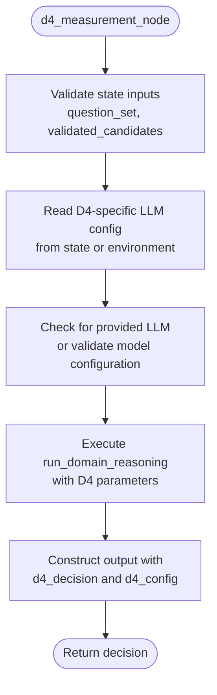
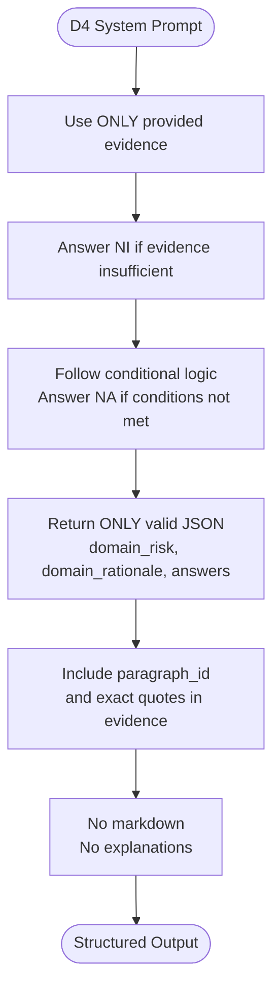
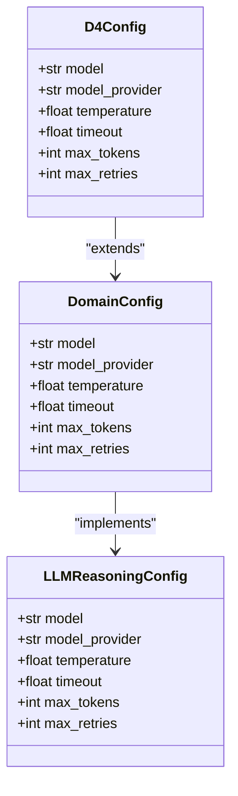
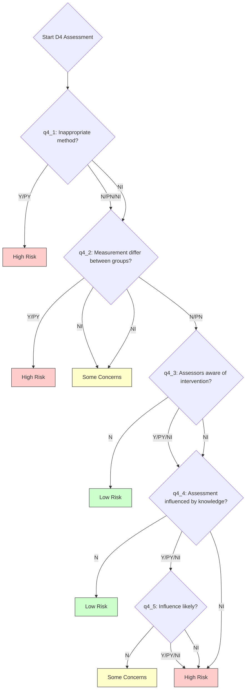

# D4: Measurement of the Outcome

<cite>
**Referenced Files in This Document**   
- [d4_measurement.py](file://src/pipelines/graphs/nodes/domains/d4_measurement.py)
- [d4_system.md](file://src/llm/prompts/domains/d4_system.md)
- [rob2_questions.yaml](file://src/rob2/rob2_questions.yaml)
- [decision_rules.py](file://src/rob2/decision_rules.py)
- [common.py](file://src/pipelines/graphs/nodes/domains/common.py)
- [config.py](file://src/core/config.py)
</cite>

## Table of Contents
1. [Introduction](#introduction)
2. [D4 Measurement Node Implementation](#d4-measurement-node-implementation)
3. [D4 LLM Prompt Structure](#d4-llm-prompt-structure)
4. [Configuration Parameters](#configuration-parameters)
5. [Reasoning Process and Validation Rules](#reasoning-process-and-validation-rules)
6. [Example Evidence and Reasoning Output](#example-evidence-and-reasoning-output)
7. [Accuracy Considerations and Prompt Engineering](#accuracy-considerations-and-prompt-engineering)
8. [Performance Guidance for Multiple Outcomes](#performance-guidance-for-multiple-outcomes)

## Introduction
The D4: Measurement of the Outcome domain reasoning component evaluates the risk of bias arising from how outcomes were measured in a clinical study. This assessment focuses on three key aspects: the appropriateness of measurement methods, potential differences in outcome assessment between intervention groups, and the impact of blinding on outcome assessment. The system uses a structured LLM-based reasoning approach to analyze evidence and generate domain-specific judgments according to the ROB2 framework.

**Section sources**
- [d4_measurement.py](file://src/pipelines/graphs/nodes/domains/d4_measurement.py#L1-L48)
- [d4_system.md](file://src/llm/prompts/domains/d4_system.md#L1-L11)

## D4 Measurement Node Implementation
The D4 measurement node is implemented in `d4_measurement.py` as a stateful function that processes evidence for outcome measurement bias. The node requires a question set and validated candidates as input, and optionally accepts a domain-specific LLM or configuration parameters. It orchestrates the reasoning process by invoking the common `run_domain_reasoning` function with domain-specific parameters.

The implementation follows a structured workflow:
1. Validate input state for required fields (question_set and validated_candidates)
2. Extract or construct LLM configuration using the `read_domain_llm_config` utility
3. Execute domain reasoning through the shared `run_domain_reasoning` function
4. Return structured decision output with risk assessment and supporting evidence

The node is integrated into the overall ROB2 graph workflow and is responsible for generating the D4-specific risk judgment based on evidence gathered from the study text.



**Diagram sources**
- [d4_measurement.py](file://src/pipelines/graphs/nodes/domains/d4_measurement.py#L15-L44)

**Section sources**
- [d4_measurement.py](file://src/pipelines/graphs/nodes/domains/d4_measurement.py#L1-L48)
- [common.py](file://src/pipelines/graphs/nodes/domains/common.py#L100-L129)

## D4 LLM Prompt Structure
The D4-specific LLM prompt defined in `d4_system.md` structures the reasoning process around key aspects of outcome measurement bias. The prompt enforces strict output formatting requirements, mandating JSON output with specific fields: domain_risk, domain_rationale, and answers.

The prompt design incorporates several critical constraints:
- Use ONLY the provided evidence to answer each signaling question
- Answer NI (No Information) when evidence is insufficient
- Follow conditional logic: if a question's conditions are not met, answer NA (Not Applicable)
- Return ONLY valid JSON with specified keys
- Include evidence with paragraph_id and exact quotes when possible
- Prohibit markdown and explanations in the response

The prompt specifically guides the LLM to assess blinding procedures, differentiate between objective and subjective outcomes, and identify potential measurement bias. For subjective outcomes, the prompt emphasizes evaluating whether outcome assessors were aware of the intervention received and whether this knowledge could have influenced assessment.



**Diagram sources**
- [d4_system.md](file://src/llm/prompts/domains/d4_system.md#L1-L11)

**Section sources**
- [d4_system.md](file://src/llm/prompts/domains/d4_system.md#L1-L11)
- [rob2_questions.yaml](file://src/rob2/rob2_questions.yaml#L183-L219)

## Configuration Parameters
The D4 measurement component supports several configurable parameters that control the LLM behavior and reasoning process. These parameters can be set through environment variables or passed directly in the state object.

Key configuration parameters include:
- **d4_model**: Specifies the LLM model ID to use for D4 reasoning
- **d4_model_provider**: Indicates the provider for the LLM service
- **d4_temperature**: Controls the randomness of the LLM output (default: 0.0 for deterministic responses)
- **d4_timeout**: Sets the maximum time to wait for LLM response
- **d4_max_tokens**: Limits the maximum number of tokens in the LLM response
- **d4_max_retries**: Defines the number of retry attempts for failed LLM calls (default: 2)
- **domain_evidence_top_k**: Controls the number of top evidence candidates used in reasoning (default: 5)

The system reads these parameters through the `read_domain_llm_config` function, which provides default values when specific parameters are not set. The temperature parameter is particularly important for D4 reasoning, as a low value (0.0-0.2) ensures consistent and deterministic judgments that are critical for scientific evaluation.



**Diagram sources**
- [config.py](file://src/core/config.py#L136-L143)
- [common.py](file://src/pipelines/graphs/nodes/domains/common.py#L444-L473)

**Section sources**
- [config.py](file://src/core/config.py#L136-L143)
- [common.py](file://src/pipelines/graphs/nodes/domains/common.py#L444-L473)
- [rob2_runner.py](file://src/services/rob2_runner.py#L248-L255)

## Reasoning Process and Validation Rules
The D4 reasoning process follows the ROB2 decision tree logic as implemented in the `decision_rules.py` file. The system evaluates five signaling questions related to outcome measurement bias:

1. Was the method of measuring the outcome inappropriate?
2. Could measurement or ascertainment of the outcome have differed between intervention groups?
3. Were outcome assessors aware of the intervention received?
4. Could assessment have been influenced by knowledge of the intervention?
5. Is it likely that assessment was influenced by knowledge of the intervention?

The decision rules implement a hierarchical evaluation:
- If the measurement method is inappropriate (q4_1 = Y/PY) → High risk
- If measurement could differ between groups (q4_2 = Y/PY) → High risk
- If measurement differences are unclear (q4_2 = NI) → Some concerns
- If measurement is appropriate and consistent (q4_1 = N/PN, q4_2 = N/PN):
  - If assessors were blinded (q4_3 = N) → Low risk
  - If assessors were aware (q4_3 = Y/PY/NI):
    - If influence was unlikely (q4_4 = N) → Low risk
    - If influence was likely (q4_4 = Y/PY/NI):
      - If influence is unlikely (q4_5 = N) → Some concerns
      - If influence is likely (q4_5 = Y/PY/NI) → High risk

Evidence validation follows a multi-stage process including relevance, consistency, and completeness checks. The system ensures that only high-confidence, directly relevant evidence is used in the final assessment.



**Diagram sources**
- [decision_rules.py](file://src/rob2/decision_rules.py#L149-L173)
- [rob2_questions.yaml](file://src/rob2/rob2_questions.yaml#L183-L219)

**Section sources**
- [decision_rules.py](file://src/rob2/decision_rules.py#L149-L173)
- [rob2_questions.yaml](file://src/rob2/rob2_questions.yaml#L183-L219)
- [relevance.py](file://src/evidence/validators/relevance.py#L58-L93)

## Example Evidence and Reasoning Output
The system processes evidence for both objective and subjective outcomes using the same structured approach. For objective outcomes (e.g., mortality, laboratory values), the focus is on the appropriateness of measurement methods and consistency across groups. For subjective outcomes (e.g., pain scores, quality of life), additional emphasis is placed on blinding procedures and potential assessment bias.

Example input evidence for an objective outcome might include:
- "All laboratory samples were analyzed using standardized protocols at a central laboratory"
- "Outcome assessors were blinded to treatment allocation throughout the study"

Example input evidence for a subjective outcome might include:
- "Pain scores were self-reported by participants using a visual analog scale"
- "Clinicians assessing functional outcomes were aware of the treatment allocation"

The corresponding reasoning output follows the required JSON structure:
```json
{
  "domain_risk": "low",
  "domain_rationale": "Outcome measurement methods were appropriate and standardized. Assessors were blinded to intervention allocation, minimizing potential bias.",
  "answers": [
    {
      "question_id": "q4_1",
      "answer": "N",
      "rationale": "Measurement methods were appropriate for the outcome.",
      "evidence": [
        {
          "paragraph_id": "p12",
          "quote": "All laboratory samples were analyzed using standardized protocols"
        }
      ]
    },
    {
      "question_id": "q4_2",
      "answer": "N",
      "rationale": "Measurement procedures were consistent across intervention groups.",
      "evidence": [
        {
          "paragraph_id": "p12",
          "quote": "standardized protocols at a central laboratory"
        }
      ]
    },
    {
      "question_id": "q4_3",
      "answer": "N",
      "rationale": "Outcome assessors were blinded to treatment allocation.",
      "evidence": [
        {
          "paragraph_id": "p15",
          "quote": "Outcome assessors were blinded to treatment allocation"
        }
      ]
    },
    {
      "question_id": "q4_4",
      "answer": "NA",
      "rationale": "Not applicable as assessors were blinded.",
      "evidence": []
    },
    {
      "question_id": "q4_5",
      "answer": "NA",
      "rationale": "Not applicable as assessors were blinded.",
      "evidence": []
    }
  ]
}
```

**Section sources**
- [d4_system.md](file://src/llm/prompts/domains/d4_system.md#L1-L11)
- [test_domain_reasoning.py](file://tests/unit/test_domain_reasoning.py#L609-L646)
- [rob2_questions.yaml](file://src/rob2/rob2_questions.yaml#L183-L219)

## Accuracy Considerations and Prompt Engineering
The D4 assessment faces several accuracy challenges, particularly in detecting inadequate blinding descriptions and distinguishing between objective and subjective outcomes. Key considerations include:

1. **Blinding Detection**: The system must identify both explicit statements about blinding and implicit indicators. When blinding is not mentioned, the default assumption is that assessors were aware of the intervention (NI response).

2. **Outcome Type Classification**: The prompt should guide the LLM to recognize subjective outcomes that require blinding (e.g., patient-reported outcomes, clinician assessments) versus objective outcomes that are less susceptible to bias (e.g., mortality, lab values).

3. **Measurement Method Appropriateness**: The system evaluates whether the chosen measurement method is valid and reliable for the specific outcome, considering established standards in the clinical domain.

Prompt engineering improvements could include:
- Adding explicit examples of appropriate vs. inappropriate measurement methods
- Providing guidance on recognizing partial or incomplete blinding descriptions
- Including domain-specific knowledge about validated measurement instruments
- Enhancing the conditional logic instructions to handle edge cases

The current prompt design prioritizes conservative judgments, erring toward "some concerns" when evidence is ambiguous. This aligns with the ROB2 framework's emphasis on identifying potential sources of bias rather than assuming their absence.

```mermaid
flowchart TD
A[Accuracy Challenges] --> B[Blinding Detection]
A --> C[Outcome Type Classification]
A --> D[Measurement Method Appropriateness]
A --> E[Evidence Ambiguity]
B --> B1["Detect explicit blinding statements"]
B --> B2["Identify implicit blinding indicators"]
B --> B3["Handle missing blinding information"]
C --> C1["Distinguish subjective vs objective outcomes"]
C --> C2["Recognize patient-reported outcomes"]
C --> C3["Identify clinician assessments"]
D --> D1["Evaluate method validity"]
D --> D2["Assess reliability of measurement"]
D --> D3["Compare to domain standards"]
E --> E1["Apply conservative default"]
E --> E2["Prefer 'some concerns' over 'low risk'"]
E --> E3["Require explicit evidence for 'low risk'"]
style B1 fill:#e6f3ff,stroke:#333
style B2 fill:#e6f3ff,stroke:#333
style B3 fill:#e6f3ff,stroke:#333
style C1 fill:#e6f3ff,stroke:#333
style C2 fill:#e6f3ff,stroke:#333
style C3 fill:#e6f3ff,stroke:#333
style D1 fill:#e6f3ff,stroke:#333
style D2 fill:#e6f3ff,stroke:#333
style D3 fill:#e6f3ff,stroke:#333
style E1 fill:#e6f3ff,stroke:#333
style E2 fill:#e6f3ff,stroke:#333
style E3 fill:#e6f3ff,stroke:#333
```



**Diagram sources**
- [d4_system.md](file://src/llm/prompts/domains/d4_system.md#L1-L11)
- [decision_rules.py](file://src/rob2/decision_rules.py#L149-L173)

**Section sources**
- [d4_system.md](file://src/llm/prompts/domains/d4_system.md#L1-L11)
- [decision_rules.py](file://src/rob2/decision_rules.py#L149-L173)
- [relevance.py](file://src/evidence/validators/relevance.py#L114-L129)

## Performance Guidance for Multiple Outcomes
When handling multiple outcome measures, the system processes each outcome domain independently while maintaining consistency in the assessment approach. Performance optimization strategies include:

1. **Parallel Processing**: The system can process multiple outcomes concurrently when resources permit, reducing overall processing time.

2. **Evidence Caching**: Common evidence (e.g., blinding procedures, measurement methods) can be cached and reused across related outcomes, minimizing redundant LLM calls.

3. **Batched Reasoning**: When appropriate, similar outcomes can be grouped and processed together to leverage shared context.

4. **Configurable Top-K**: The `domain_evidence_top_k` parameter allows tuning the number of evidence candidates considered, balancing thoroughness with computational efficiency.

5. **Model Selection**: Using faster, less resource-intensive models for straightforward assessments while reserving more capable models for complex cases.

The system maintains a consistent evidence threshold across outcomes, ensuring that the same standards are applied regardless of the number of outcomes being assessed. This prevents performance optimizations from compromising assessment quality.

**Section sources**
- [common.py](file://src/pipelines/graphs/nodes/domains/common.py#L164-L175)
- [config.py](file://src/core/config.py#L136-L143)
- [rob2_runner.py](file://src/services/rob2_runner.py#L248-L255)