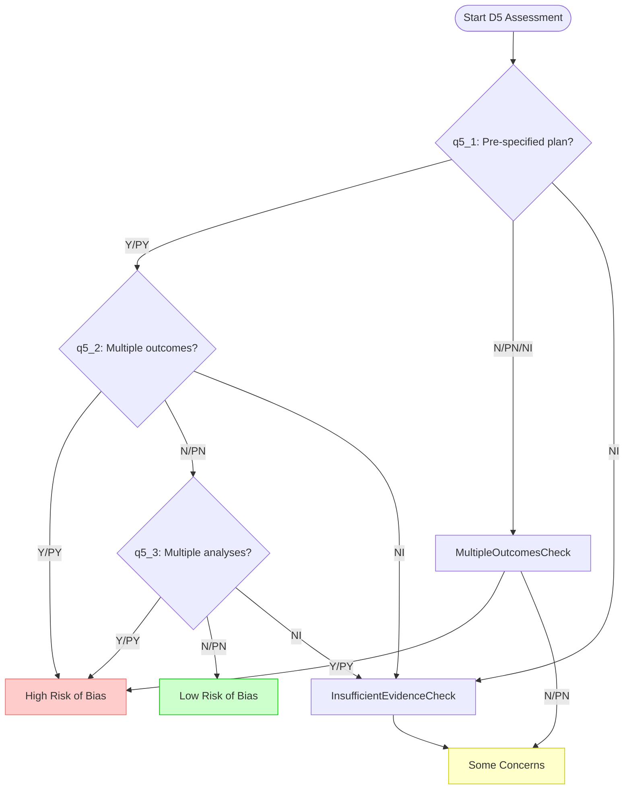
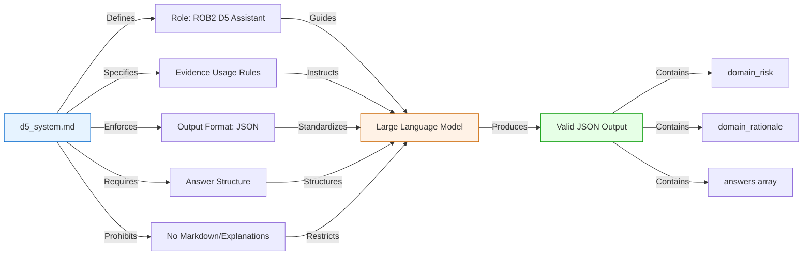

# D5: Selection of the Reported Result

<cite>
**Referenced Files in This Document**   
- [d5_reporting.py](file://src/pipelines/graphs/nodes/domains/d5_reporting.py)
- [d5_system.md](file://src/llm/prompts/domains/d5_system.md)
- [rob2_questions.yaml](file://src/rob2/rob2_questions.yaml)
- [decision_rules.py](file://src/rob2/decision_rules.py)
- [common.py](file://src/pipelines/graphs/nodes/domains/common.py)
</cite>

## Table of Contents
1. [Introduction](#introduction)
2. [Core Components](#core-components)
3. [D5 Domain Questions and Decision Logic](#d5-domain-questions-and-decision-logic)
4. [D5-Specific LLM Prompt Structure](#d5-specific-llm-prompt-structure)
5. [Configuration Options](#configuration-options)
6. [Practical Example](#practical-example)
7. [Common Challenges and Workarounds](#common-challenges-and-workarounds)
8. [Performance Considerations](#performance-considerations)

## Introduction
The D5: Selection of the Reported Result domain reasoning component evaluates bias arising from selective outcome reporting, data dredging, and result manipulation in clinical studies. This system analyzes statistical reporting patterns and compares them against study protocols to detect inconsistencies. The implementation leverages a combination of rule-based decision logic and large language model (LLM) reasoning to assess whether reported results were selected from multiple eligible outcomes or analyses, and whether the analysis followed a pre-specified plan. This documentation details the architecture, implementation, and operational characteristics of the D5 component, focusing on its analysis of reporting bias and the mechanisms it employs to ensure robust evaluation of study integrity.

## Core Components

The D5 reporting analysis system consists of several interconnected components that work together to evaluate selection bias in reported results. The primary component is the `d5_reporting_node` function, which serves as the entry point for the D5 domain reasoning process. This node orchestrates the evaluation by coordinating between the LLM reasoning engine and the rule-based decision system. The node requires two key inputs: the `question_set` containing the D5-specific signaling questions, and `validated_candidates` which are the evidence snippets validated for relevance and existence. The system integrates with the common domain reasoning utilities through the `run_domain_reasoning` function, which handles the standardized processing pipeline for all ROB2 domains. The D5 component also relies on configuration parameters that can be set through the state object or environment variables, allowing for flexible deployment and tuning of the analysis process. The output of the D5 node includes both the decision result and configuration report, providing transparency into the analysis process.

**Section sources**
- [d5_reporting.py](file://src/pipelines/graphs/nodes/domains/d5_reporting.py#L1-L47)
- [common.py](file://src/pipelines/graphs/nodes/domains/common.py#L100-L129)

## D5 Domain Questions and Decision Logic

The D5 domain assessment is based on three core signaling questions that evaluate different aspects of selective reporting bias. The first question (q5_1) examines whether the data was analyzed according to a pre-specified analysis plan finalized before unblinded outcome data was available. The second question (q5_2) assesses whether the reported result was selected from multiple eligible outcome measurements within the outcome domain, such as different scales, definitions, or time points. The third question (q5_3) evaluates whether the result was selected from multiple eligible analyses of the data, which could indicate p-hacking or data dredging. The decision logic for D5 follows a hierarchical rule system where a "Yes" or "Probably Yes" answer to either q5_2 or q5_3 automatically results in a "high" risk of bias rating. A "low" risk rating requires a "Yes" or "Probably Yes" answer to q5_1 combined with "No" or "Probably No" answers to both q5_2 and q5_3. All other combinations result in "some concerns" about bias, including cases where evidence is insufficient (NI) for q5_2 or q5_3.

**Diagram sources**
- [rob2_questions.yaml](file://src/rob2/rob2_questions.yaml#L229-L243)
- [decision_rules.py](file://src/rob2/decision_rules.py#L176-L191)

## D5-Specific LLM Prompt Structure

The D5 system prompt (d5_system.md) provides specific instructions to the LLM to ensure consistent and accurate evaluation of selective reporting bias. The prompt establishes the LLM's role as a ROB2 domain reasoning assistant for D5 (Selection of the reported result) and emphasizes the use of only provided evidence to answer each signaling question. It explicitly instructs the model to answer "NI" (No Information) when evidence is insufficient and "NA" (Not Applicable) when a question's conditions are not met. The prompt requires the LLM to return only valid JSON with specific keys: domain_risk, domain_rationale, and answers. The domain_risk must be one of three values: "low", "some_concerns", or "high". Each answer must include the question_id, answer, rationale, and evidence, with evidence items required to use the paragraph_id from the provided evidence and include an exact quote when possible. The prompt strictly prohibits markdown formatting and additional explanations, ensuring a standardized output format that can be reliably parsed by the system.

**Diagram sources**
- [d5_system.md](file://src/llm/prompts/domains/d5_system.md#L1-L11)
- [common.py](file://src/pipelines/graphs/nodes/domains/common.py#L55-L59)

## Configuration Options

The D5 reporting analysis component supports several configuration options that allow for customization of the evaluation process. These configuration parameters can be set either through the application state or via environment variables prefixed with "d5_". The primary configuration options include the LLM model selection (d5_model), which specifies the large language model to be used for reasoning, and the model provider (d5_model_provider), which identifies the service hosting the model. Additional parameters control the model's behavior, including temperature (d5_temperature) which affects response randomness, timeout (d5_timeout) for API calls, maximum tokens (d5_max_tokens) for response length, and maximum retries (d5_max_retries) for handling transient failures. The system also allows configuration of the number of evidence items to consider through the domain_evidence_top_k parameter, which defaults to 5 but can be adjusted based on performance requirements and evidence availability. These configuration options provide flexibility in balancing accuracy, performance, and cost when deploying the D5 analysis component.

**Section sources**
- [d5_reporting.py](file://src/pipelines/graphs/nodes/domains/d5_reporting.py#L28-L30)
- [common.py](file://src/pipelines/graphs/nodes/domains/common.py#L444-L473)

## Practical Example

A practical example of the D5 analysis process demonstrates how the system evaluates selective reporting bias. Consider a study where the protocol specified a primary outcome measured at 12 weeks, but the published report presents results from multiple time points (4, 8, and 12 weeks) and selects the 8-week time point as the primary result because it showed the most significant effect. The input evidence would include the study protocol mentioning the 12-week primary outcome and the published report highlighting the 8-week results. The D5 system would analyze this evidence and generate responses to the three signaling questions: q5_1 would be answered "Y" (Yes) if the analysis followed a pre-specified plan, q5_2 would be answered "PY" (Probably Yes) since the result was selected from multiple eligible outcome measurements (different time points), and q5_3 would be answered "PN" (Probably No) if no multiple analyses were conducted. Based on the decision rules, the presence of a "PY" answer to q5_2 would trigger a "high" risk of bias rating, indicating substantial concerns about selective outcome reporting in the study. The system would provide a rationale explaining that the result appears to have been selected from multiple eligible outcome measurements within the outcome domain, which increases the risk of false positive findings.

**Section sources**
- [test_domain_reasoning.py](file://tests/unit/test_domain_reasoning.py#L730-L774)
- [d5_system.md](file://src/llm/prompts/domains/d5_system.md#L1-L11)

## Common Challenges and Workarounds

The D5 reporting analysis faces several common challenges in real-world applications, particularly related to incomplete or unavailable study protocols. One major challenge is the frequent absence of pre-specified analysis plans, which makes it difficult to assess whether reported results were selected from multiple eligible outcomes or analyses. When protocols are unavailable, the system must rely on other sources such as trial registry entries or supplementary materials, but these may not contain sufficient detail for a definitive assessment. Another challenge is the ambiguity in determining what constitutes "multiple eligible outcome measurements" when studies use composite endpoints or multiple related measures. To address these challenges, the system employs several workarounds: it uses a conservative approach by defaulting to "some concerns" when evidence is insufficient (NI), it leverages cross-referencing between different document sections to find relevant information, and it allows for manual override of automated decisions in the audit phase. Additionally, the system can analyze patterns across multiple outcomes within a study to identify potential selective reporting, even when direct protocol comparisons are not possible. These workarounds help maintain the system's effectiveness despite the limitations of available evidence.

**Section sources**
- [d5_reporting.py](file://src/pipelines/graphs/nodes/domains/d5_reporting.py#L15-L47)
- [decision_rules.py](file://src/rob2/decision_rules.py#L176-L191)

## Performance Considerations

When analyzing large numbers of reported results and statistical tests, the D5 reporting component must balance thoroughness with computational efficiency. The system's performance is primarily influenced by the LLM inference time, which scales with the number of questions, evidence items, and model complexity. To optimize performance, the system implements several strategies: it limits the number of evidence items considered per question through the evidence_top_k parameter, batches multiple questions into a single LLM request when possible, and caches prompt templates to avoid repeated file I/O operations. The system also supports parallel processing of multiple studies or domains, allowing for horizontal scaling across multiple compute resources. For large-scale analyses, the system can be configured to use faster, less expensive models for preliminary screening, reserving more powerful models for cases requiring deeper analysis. Additionally, the system monitors and reports on processing time and resource usage, enabling administrators to identify bottlenecks and optimize configurations. These performance considerations ensure that the D5 analysis can be applied efficiently to large collections of studies while maintaining the quality of the bias assessment.

**Section sources**
- [common.py](file://src/pipelines/graphs/nodes/domains/common.py#L164-L175)
- [d5_reporting.py](file://src/pipelines/graphs/nodes/domains/d5_reporting.py#L38-L39)