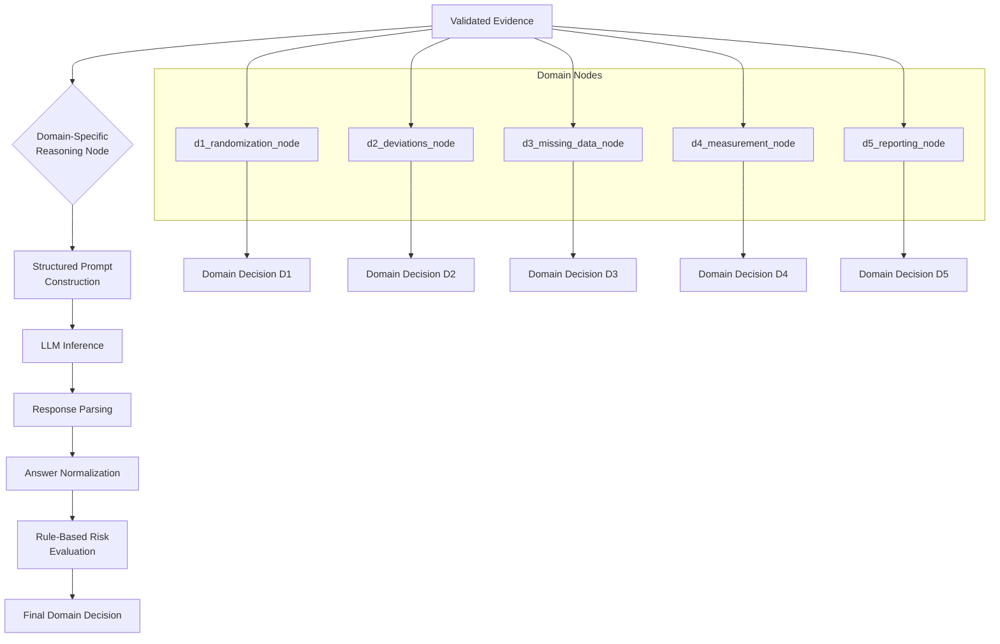
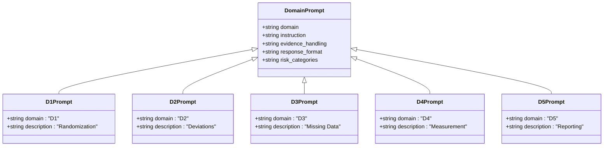
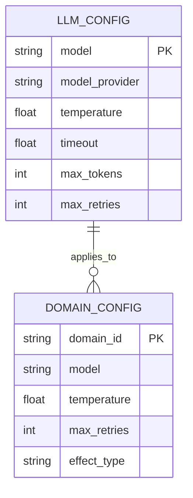
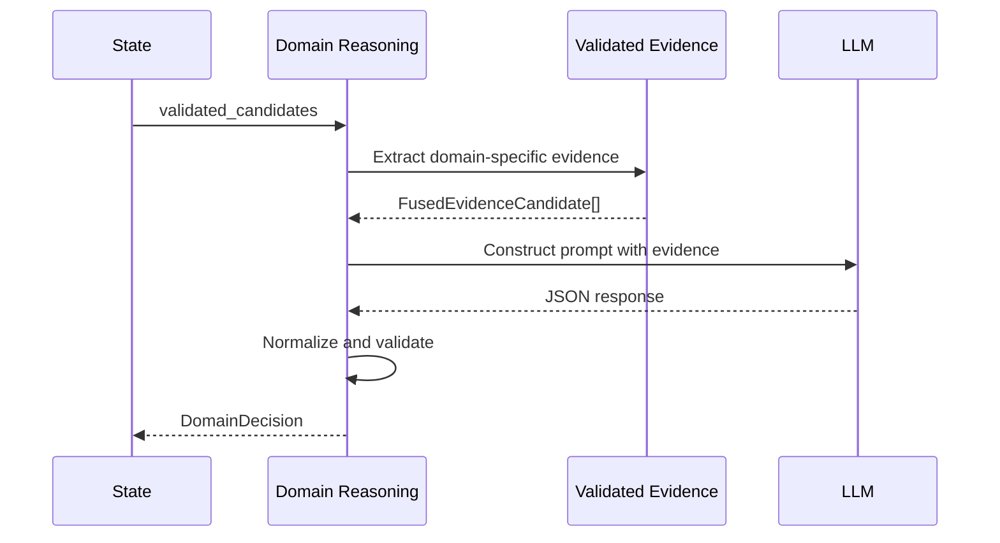
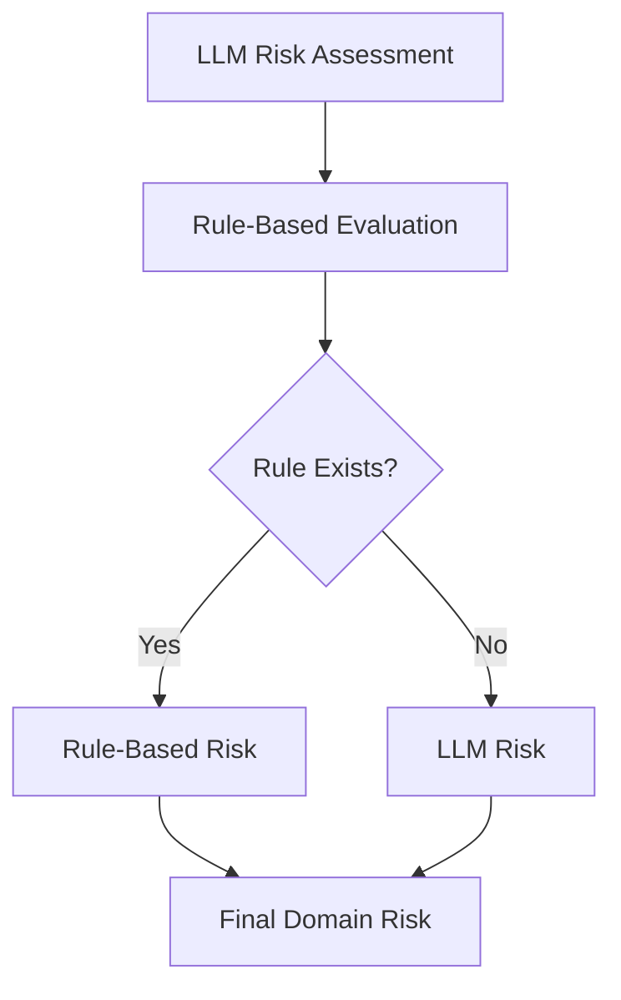
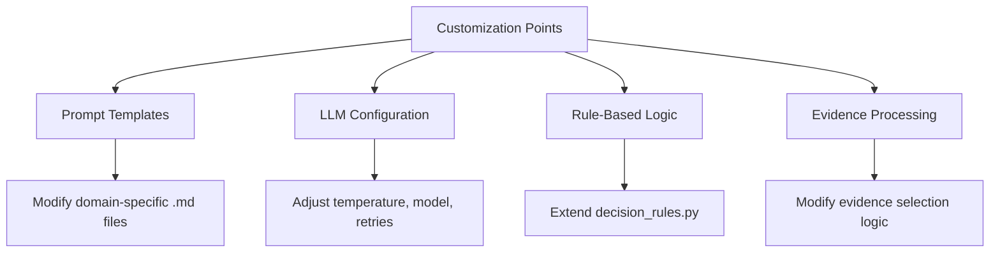

# Domain Reasoning

<cite>
**Referenced Files in This Document**   
- [d1_randomization.py](file://src/pipelines/graphs/nodes/domains/d1_randomization.py)
- [d2_deviations.py](file://src/pipelines/graphs/nodes/domains/d2_deviations.py)
- [d3_missing_data.py](file://src/pipelines/graphs/nodes/domains/d3_missing_data.py)
- [d4_measurement.py](file://src/pipelines/graphs/nodes/domains/d4_measurement.py)
- [d5_reporting.py](file://src/pipelines/graphs/nodes/domains/d5_reporting.py)
- [common.py](file://src/pipelines/graphs/nodes/domains/common.py)
- [d1_system.md](file://src/llm/prompts/domains/d1_system.md)
- [d2_system.md](file://src/llm/prompts/domains/d2_system.md)
- [d3_system.md](file://src/llm/prompts/domains/d3_system.md)
- [d4_system.md](file://src/llm/prompts/domains/d4_system.md)
- [d5_system.md](file://src/llm/prompts/domains/d5_system.md)
- [rob2_domain_system.md](file://src/llm/prompts/domains/rob2_domain_system.md)
- [decision_rules.py](file://src/rob2/decision_rules.py)
- [question_bank.py](file://src/rob2/question_bank.py)
- [rob2_questions.yaml](file://src/rob2/rob2_questions.yaml)
- [rob2.py](file://src/schemas/internal/rob2.py)
</cite>

## Table of Contents
1. [Introduction](#introduction)
2. [Domain Reasoning Process](#domain-reasoning-process)
3. [ROB2 Domain-Specific Reasoning](#rob2-domain-specific-reasoning)
4. [Domain-Specific Prompts](#domain-specific-prompts)
5. [Configuration Options](#configuration-options)
6. [Reasoning Output Examples](#reasoning-output-examples)
7. [Evidence Integration](#evidence-integration)
8. [Accuracy Considerations](#accuracy-considerations)
9. [Customization Guidance](#customization-guidance)
10. [Conclusion](#conclusion)

## Introduction
The domain reasoning system implements a specialized approach for assessing risk of bias in clinical studies across five domains defined by the ROB2 (Risk Of Bias 2) framework. This system leverages large language models (LLMs) guided by domain-specific prompts to analyze validated evidence and produce structured assessments for each domain: randomization (D1), deviations from intended interventions (D2), missing outcome data (D3), measurement of the outcome (D4), and selection of the reported result (D5). The reasoning process combines LLM-based analysis with rule-based decision trees to ensure consistent and evidence-based risk assessments.

## Domain Reasoning Process

The domain reasoning system follows a structured workflow that begins with validated evidence and produces domain-specific risk assessments. Each domain has a dedicated reasoning node that processes evidence according to domain-specific logic and prompts.



**Diagram sources**
- [common.py](file://src/pipelines/graphs/nodes/domains/common.py#L100-L129)
- [d1_randomization.py](file://src/pipelines/graphs/nodes/domains/d1_randomization.py#L15-L45)

**Section sources**
- [common.py](file://src/pipelines/graphs/nodes/domains/common.py#L1-L516)
- [d1_randomization.py](file://src/pipelines/graphs/nodes/domains/d1_randomization.py#L1-L48)

## ROB2 Domain-Specific Reasoning

### D1: Randomization
The randomization domain reasoning assesses the risk of bias related to the randomization process in clinical trials. The system evaluates whether proper random sequence generation and allocation concealment were implemented. The reasoning process examines evidence for descriptions of randomization methods and protection against foreknowledge of upcoming allocations.

**Section sources**
- [d1_randomization.py](file://src/pipelines/graphs/nodes/domains/d1_randomization.py#L1-L48)
- [decision_rules.py](file://src/rob2/decision_rules.py#L50-L67)

### D2: Deviations from Intended Interventions
The deviations domain reasoning evaluates bias risk from departures from intended interventions, considering both assignment and adherence effect types. For assignment, the system assesses whether deviations were balanced between groups and whether outcome analysis accounted for these deviations. For adherence, it evaluates participant awareness, intervention delivery, and analytical approaches to non-adherence.

**Section sources**
- [d2_deviations.py](file://src/pipelines/graphs/nodes/domains/d2_deviations.py#L1-L58)
- [decision_rules.py](file://src/rob2/decision_rules.py#L70-L122)

### D3: Missing Outcome Data
The missing data domain reasoning evaluates the risk of bias due to incomplete outcome data. The system assesses whether missing data were addressed appropriately, including the extent and reasons for missingness, and whether analytical methods adequately accounted for missing data patterns. The reasoning considers whether missingness was balanced across groups and unrelated to outcome.

**Section sources**
- [d3_missing_data.py](file://src/pipelines/graphs/nodes/domains/d3_missing_data.py#L1-L48)
- [decision_rules.py](file://src/rob2/decision_rules.py#L125-L146)

### D4: Measurement of the Outcome
The measurement domain reasoning evaluates the risk of bias from outcome measurement methods. The system assesses whether outcome assessors were blinded to intervention status and whether outcome measurement methods were appropriate and reliable. The reasoning considers potential sources of measurement bias and the adequacy of methods to prevent differential outcome assessment.

**Section sources**
- [d4_measurement.py](file://src/pipelines/graphs/nodes/domains/d4_measurement.py#L1-L48)
- [decision_rules.py](file://src/rob2/decision_rules.py#L149-L173)

### D5: Selection of the Reported Result
The reporting domain reasoning evaluates the risk of bias from selective reporting of results. The system assesses whether all pre-specified outcomes were reported and whether the reported results appear to be selected based on statistical significance or other factors. The reasoning considers protocol adherence and consistency between planned and reported analyses.

**Section sources**
- [d5_reporting.py](file://src/pipelines/graphs/nodes/domains/d5_reporting.py#L1-L48)
- [decision_rules.py](file://src/rob2/decision_rules.py#L176-L191)

## Domain-Specific Prompts

### Prompt Structure and Function
Domain-specific prompts in the `llm/prompts/domains/` directory guide the LLM-based reasoning process by providing consistent instructions and constraints for each domain. These prompts ensure that the LLM focuses exclusively on the provided evidence and follows standardized response formats.



**Diagram sources**
- [d1_system.md](file://src/llm/prompts/domains/d1_system.md#L1-L11)
- [d2_system.md](file://src/llm/prompts/domains/d2_system.md#L1-L11)
- [d3_system.md](file://src/llm/prompts/domains/d3_system.md#L1-L11)
- [d4_system.md](file://src/llm/prompts/domains/d4_system.md#L1-L11)
- [d5_system.md](file://src/llm/prompts/domains/d5_system.md#L1-L11)

**Section sources**
- [common.py](file://src/pipelines/graphs/nodes/domains/common.py#L86-L97)
- [rob2_domain_system.md](file://src/llm/prompts/domains/rob2_domain_system.md#L1-L11)

### Prompt Content Analysis
Each domain-specific prompt follows a consistent structure with domain-specific identification, evidence usage instructions, handling of insufficient evidence (NI), conditional logic for not applicable (NA) responses, and strict JSON output requirements. The prompts enforce the use of paragraph IDs and exact quotes from evidence, ensuring traceability of all claims.

## Configuration Options

### LLM Configuration Parameters
The domain reasoning system supports configurable LLM parameters that can be set globally or on a per-domain basis. These configuration options allow users to fine-tune the reasoning process for different requirements and constraints.



**Diagram sources**
- [common.py](file://src/pipelines/graphs/nodes/domains/common.py#L64-L71)
- [common.py](file://src/pipelines/graphs/nodes/domains/common.py#L425-L442)

**Section sources**
- [common.py](file://src/pipelines/graphs/nodes/domains/common.py#L425-L473)

### Configuration Implementation
The system uses the `LLMReasoningConfig` dataclass to encapsulate configuration parameters including model identifier, temperature, timeout, maximum tokens, and maximum retries. Configuration can be read from the state with domain-specific prefixes (d1_, d2_, etc.) using the `read_domain_llm_config` function, which provides default values for optional parameters.

## Reasoning Output Examples

### Expected Output Structure
The domain reasoning system produces structured JSON output with consistent fields across all domains. This standardized format enables downstream processing and aggregation of domain-level assessments.

```mermaid
json
{
"domain_risk": "low | some_concerns | high",
"domain_rationale": "string",
"answers": [
{
"question_id": "string",
"answer": "Y | PY | PN | N | NI | NA",
"rationale": "string",
"evidence": [
{
"paragraph_id": "string",
"quote": "string"
}
],
"confidence": "float"
}
]
}
```

**Diagram sources**
- [common.py](file://src/pipelines/graphs/nodes/domains/common.py#L38-L59)
- [common.py](file://src/pipelines/graphs/nodes/domains/common.py#L55-L59)

**Section sources**
- [common.py](file://src/pipelines/graphs/nodes/domains/common.py#L38-L59)

### Output Processing Pipeline
The system normalizes LLM responses to ensure compliance with the expected schema, handling cases where the LLM may produce non-standard output. The normalization process includes risk category mapping, answer validation against allowed options, and evidence reference validation.

## Evidence Integration

### Validated Evidence as Input
The domain reasoning process uses validated evidence as its primary input, ensuring that assessments are based on reliable and relevant information. The evidence is structured with paragraph IDs, titles, page numbers, and text content, allowing precise referencing in the reasoning output.



**Diagram sources**
- [common.py](file://src/pipelines/graphs/nodes/domains/common.py#L116-L129)
- [common.py](file://src/pipelines/graphs/nodes/domains/common.py#L164-L175)

**Section sources**
- [common.py](file://src/pipelines/graphs/nodes/domains/common.py#L164-L175)
- [rob2.py](file://src/schemas/internal/rob2.py#L1-L130)

### Evidence Selection and Top-K Filtering
The system implements evidence selection by question ID, retrieving only evidence relevant to the signaling questions in the current domain. A configurable top-k parameter (default: 5) limits the amount of evidence provided to the LLM, preventing information overload while maintaining sufficient context for reasoning.

## Accuracy Considerations

### Dual Assessment Approach
The system enhances accuracy by combining LLM-based reasoning with rule-based decision trees. The final domain risk is determined by the rule-based evaluation when available, falling back to the LLM-assessed risk otherwise. This hybrid approach leverages the strengths of both methods: LLMs for nuanced interpretation and rules for consistent application of established criteria.



**Diagram sources**
- [common.py](file://src/pipelines/graphs/nodes/domains/common.py#L352-L358)
- [decision_rules.py](file://src/rob2/decision_rules.py#L22-L43)

**Section sources**
- [common.py](file://src/pipelines/graphs/nodes/domains/common.py#L352-L358)
- [decision_rules.py](file://src/rob2/decision_rules.py#L22-L43)

### Response Validation and Error Handling
The system implements robust validation of LLM responses, including JSON parsing, schema validation, and content normalization. When responses fail to meet requirements, the system applies fallback strategies such as extracting JSON from code blocks or providing default values for missing information.

## Customization Guidance

### Domain-Specific Customization
Users can customize the domain reasoning process by modifying prompt templates, adjusting configuration parameters, or extending the rule-based decision logic. The modular design allows for domain-specific adjustments without affecting other domains.



**Diagram sources**
- [common.py](file://src/pipelines/graphs/nodes/domains/common.py#L86-L97)
- [decision_rules.py](file://src/rob2/decision_rules.py#L22-L43)

**Section sources**
- [common.py](file://src/pipelines/graphs/nodes/domains/common.py#L86-L97)
- [decision_rules.py](file://src/rob2/decision_rules.py#L22-L43)

### Implementation Recommendations
For optimal results, users should ensure that prompt modifications maintain the required JSON output format and evidence referencing requirements. When extending rule-based logic, new rules should be thoroughly tested against representative cases to ensure consistency with ROB2 guidelines.

## Conclusion
The domain reasoning system provides a comprehensive framework for assessing risk of bias across the five ROB2 domains. By combining LLM-based analysis with rule-based decision trees, the system delivers accurate, consistent, and evidence-based assessments. The modular design with configurable parameters and domain-specific prompts enables adaptation to various research needs while maintaining methodological rigor. Proper configuration and understanding of the evidence integration process are key to maximizing the system's effectiveness in producing reliable bias assessments.