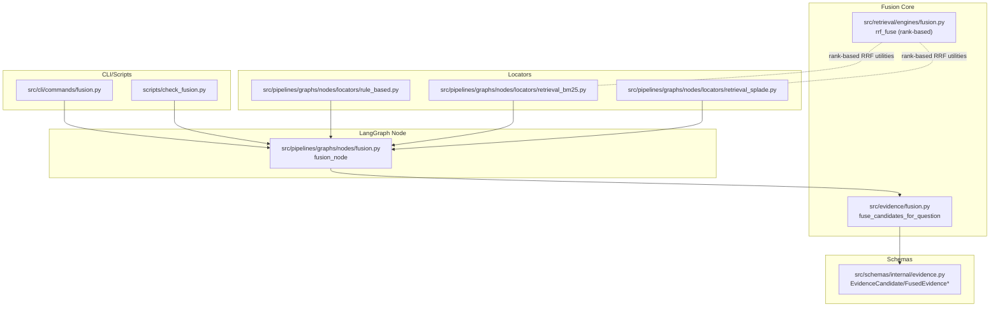
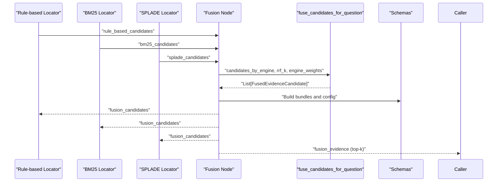
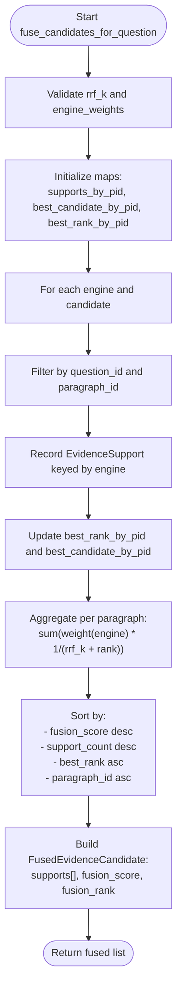
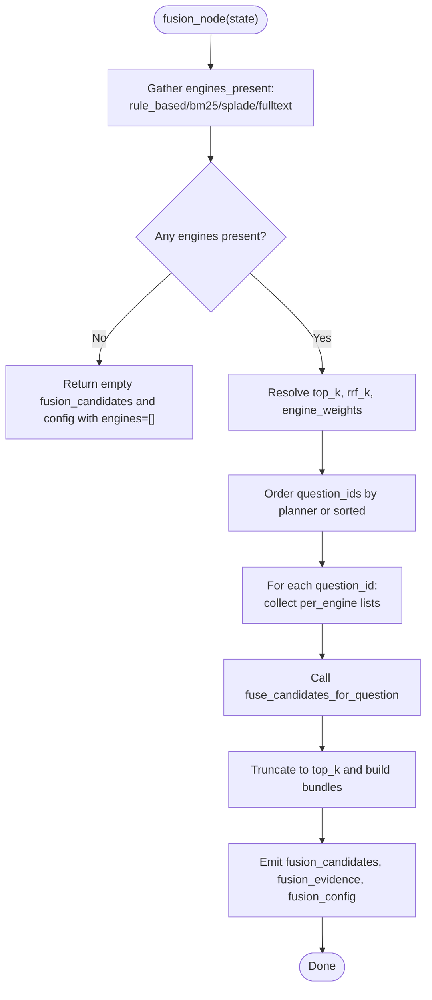
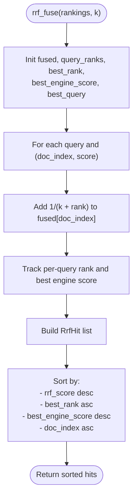
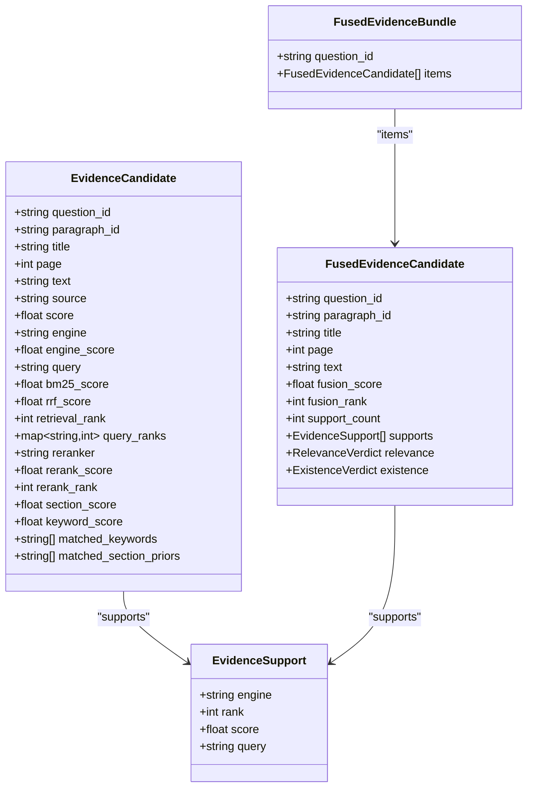
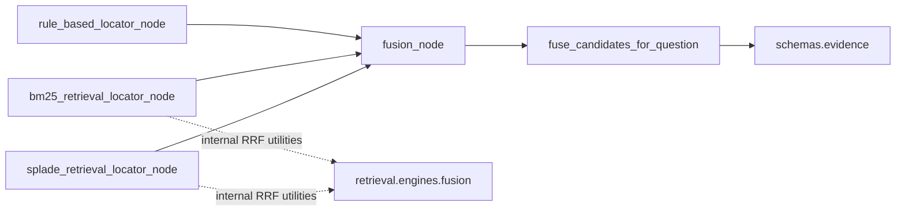

# Evidence Fusion

<cite>
**Referenced Files in This Document**
- [src/evidence/fusion.py](file://src/evidence/fusion.py)
- [src/pipelines/graphs/nodes/fusion.py](file://src/pipelines/graphs/nodes/fusion.py)
- [src/retrieval/engines/fusion.py](file://src/retrieval/engines/fusion.py)
- [src/schemas/internal/evidence.py](file://src/schemas/internal/evidence.py)
- [src/cli/commands/fusion.py](file://src/cli/commands/fusion.py)
- [scripts/check_fusion.py](file://scripts/check_fusion.py)
- [docs/adr/0002-evidence-fusion-rrf.md](file://docs/adr/0002-evidence-fusion-rrf.md)
- [tests/unit/test_evidence_fusion.py](file://tests/unit/test_evidence_fusion.py)
- [src/pipelines/graphs/nodes/locators/rule_based.py](file://src/pipelines/graphs/nodes/locators/rule_based.py)
- [src/pipelines/graphs/nodes/locators/retrieval_bm25.py](file://src/pipelines/graphs/nodes/locators/retrieval_bm25.py)
- [src/pipelines/graphs/nodes/locators/retrieval_splade.py](file://src/pipelines/graphs/nodes/locators/retrieval_splade.py)
</cite>

## Table of Contents
1. [Introduction](#introduction)
2. [Project Structure](#project-structure)
3. [Core Components](#core-components)
4. [Architecture Overview](#architecture-overview)
5. [Detailed Component Analysis](#detailed-component-analysis)
6. [Dependency Analysis](#dependency-analysis)
7. [Performance Considerations](#performance-considerations)
8. [Troubleshooting Guide](#troubleshooting-guide)
9. [Conclusion](#conclusion)
10. [Appendices](#appendices)

## Introduction
This document explains the evidence fusion sub-feature that combines results from multiple retrieval strategies using Reciprocal Rank Fusion (RRF). It covers the fusion node’s role in the workflow, configuration options (top_k, rrf_k, engine weights), example outcomes, accuracy and robustness impacts, performance considerations, and tuning guidance.

## Project Structure
The fusion feature spans several modules:
- Core fusion algorithm: rank-based RRF that aggregates multi-engine ranked lists into fused evidence candidates.
- LangGraph fusion node: orchestrates per-question fusion and produces top-k bundles.
- Retrieval engines: provide rank-based utilities for RRF.
- Schemas: define typed contracts for evidence and fused outputs.
- CLI and scripts: expose command-line tools to run fusion and inspect results.
- Tests: validate correctness and expected behavior.

**Diagram sources**
- [src/evidence/fusion.py](file://src/evidence/fusion.py#L1-L112)
- [src/retrieval/engines/fusion.py](file://src/retrieval/engines/fusion.py#L1-L78)
- [src/pipelines/graphs/nodes/fusion.py](file://src/pipelines/graphs/nodes/fusion.py#L1-L113)
- [src/pipelines/graphs/nodes/locators/rule_based.py](file://src/pipelines/graphs/nodes/locators/rule_based.py#L1-L200)
- [src/pipelines/graphs/nodes/locators/retrieval_bm25.py](file://src/pipelines/graphs/nodes/locators/retrieval_bm25.py#L1-L200)
- [src/pipelines/graphs/nodes/locators/retrieval_splade.py](file://src/pipelines/graphs/nodes/locators/retrieval_splade.py#L1-L200)
- [src/schemas/internal/evidence.py](file://src/schemas/internal/evidence.py#L1-L171)
- [src/cli/commands/fusion.py](file://src/cli/commands/fusion.py#L1-L124)
- [scripts/check_fusion.py](file://scripts/check_fusion.py#L1-L296)

**Section sources**
- [src/evidence/fusion.py](file://src/evidence/fusion.py#L1-L112)
- [src/pipelines/graphs/nodes/fusion.py](file://src/pipelines/graphs/nodes/fusion.py#L1-L113)
- [src/retrieval/engines/fusion.py](file://src/retrieval/engines/fusion.py#L1-L78)
- [src/schemas/internal/evidence.py](file://src/schemas/internal/evidence.py#L1-L171)
- [src/cli/commands/fusion.py](file://src/cli/commands/fusion.py#L1-L124)
- [scripts/check_fusion.py](file://scripts/check_fusion.py#L1-L296)

## Core Components
- Rank-based RRF fusion algorithm: Aggregates multi-engine ranked lists into a single score per paragraph, with support attribution and multi-engine boost when a paragraph appears across engines.
- LangGraph fusion node: Reads per-question candidate lists from rule-based and retrieval engines, applies fusion, and emits top-k bundles plus full candidate sets.
- Schemas: Define typed contracts for EvidenceCandidate, EvidenceSupport, and FusedEvidenceCandidate/Bundles.

Key responsibilities:
- Paragraph deduplication by paragraph_id.
- Multi-source support tracking (engine, rank, score, query).
- Deterministic tie-breaking via support_count and best_rank.
- Optional engine weights to favor certain engines.

**Section sources**
- [src/evidence/fusion.py](file://src/evidence/fusion.py#L18-L108)
- [src/pipelines/graphs/nodes/fusion.py](file://src/pipelines/graphs/nodes/fusion.py#L16-L111)
- [src/schemas/internal/evidence.py](file://src/schemas/internal/evidence.py#L10-171)

## Architecture Overview
The fusion workflow integrates outputs from rule-based and retrieval engines into a unified, ranked set of evidence per question.

**Diagram sources**
- [src/pipelines/graphs/nodes/fusion.py](file://src/pipelines/graphs/nodes/fusion.py#L16-L111)
- [src/evidence/fusion.py](file://src/evidence/fusion.py#L18-L108)
- [src/schemas/internal/evidence.py](file://src/schemas/internal/evidence.py#L105-L171)
- [src/pipelines/graphs/nodes/locators/rule_based.py](file://src/pipelines/graphs/nodes/locators/rule_based.py#L18-L47)
- [src/pipelines/graphs/nodes/locators/retrieval_bm25.py](file://src/pipelines/graphs/nodes/locators/retrieval_bm25.py#L48-L120)
- [src/pipelines/graphs/nodes/locators/retrieval_splade.py](file://src/pipelines/graphs/nodes/locators/retrieval_splade.py#L49-L120)

## Detailed Component Analysis

### Rank-based RRF Fusion Algorithm
The core algorithm computes a fused score per paragraph by summing weighted reciprocal ranks across engines. It also tracks the best rank and support per paragraph, and builds a list of EvidenceSupport entries for provenance.

**Diagram sources**
- [src/evidence/fusion.py](file://src/evidence/fusion.py#L18-L108)

**Section sources**
- [src/evidence/fusion.py](file://src/evidence/fusion.py#L18-L108)

### LangGraph Fusion Node
The fusion node:
- Collects per-question candidate lists from rule-based and retrieval engines.
- Validates and normalizes configuration (top_k, rrf_k, engine_weights).
- Orders questions deterministically by planner-provided question_set when available.
- Calls the fusion algorithm per question and truncates to top_k bundles.

**Diagram sources**
- [src/pipelines/graphs/nodes/fusion.py](file://src/pipelines/graphs/nodes/fusion.py#L16-L111)

**Section sources**
- [src/pipelines/graphs/nodes/fusion.py](file://src/pipelines/graphs/nodes/fusion.py#L16-L111)

### Retrieval Engines’ Rank-based RRF Utilities
While the primary fusion uses EvidenceCandidate lists, retrieval engines also provide rank-based RRF utilities for internal use (e.g., per-query ranking before reranking). These utilities compute a reciprocal rank score per document index and track best rank and best engine score.

**Diagram sources**
- [src/retrieval/engines/fusion.py](file://src/retrieval/engines/fusion.py#L1-L78)

**Section sources**
- [src/retrieval/engines/fusion.py](file://src/retrieval/engines/fusion.py#L1-L78)

### Data Contracts and Outputs
Typed schemas define the shape of evidence and fused outputs, including support attribution and optional validation annotations.

**Diagram sources**
- [src/schemas/internal/evidence.py](file://src/schemas/internal/evidence.py#L10-L171)

**Section sources**
- [src/schemas/internal/evidence.py](file://src/schemas/internal/evidence.py#L10-L171)

### Example Scenarios and Expected Outcomes
- Multi-engine agreement: When a paragraph appears in multiple engines (e.g., rule-based and BM25), the fused score increases due to contributions from both engines, and the fused candidate includes supports from both engines.
- Single-engine hits: Paragraphs appearing in only one engine receive a lower boost but still appear in the fused list.
- Tie-breaking: When scores are equal, the algorithm prefers higher support counts and better best ranks, then sorts by paragraph_id.

Validation references:
- Unit tests demonstrate multi-engine boosting and top-k bundle construction.

**Section sources**
- [tests/unit/test_evidence_fusion.py](file://tests/unit/test_evidence_fusion.py#L1-L100)

## Dependency Analysis
- fusion_node depends on fuse_candidates_for_question and schemas for typed outputs.
- fuse_candidates_for_question depends on schemas for EvidenceCandidate and FusedEvidenceCandidate.
- Locators produce per-question candidate lists consumed by fusion_node.
- Retrieval engines provide rank-based utilities used internally by BM25/SPLADE nodes.

**Diagram sources**
- [src/pipelines/graphs/nodes/fusion.py](file://src/pipelines/graphs/nodes/fusion.py#L16-L111)
- [src/evidence/fusion.py](file://src/evidence/fusion.py#L18-L108)
- [src/schemas/internal/evidence.py](file://src/schemas/internal/evidence.py#L10-L171)
- [src/retrieval/engines/fusion.py](file://src/retrieval/engines/fusion.py#L1-L78)
- [src/pipelines/graphs/nodes/locators/rule_based.py](file://src/pipelines/graphs/nodes/locators/rule_based.py#L18-L47)
- [src/pipelines/graphs/nodes/locators/retrieval_bm25.py](file://src/pipelines/graphs/nodes/locators/retrieval_bm25.py#L48-L120)
- [src/pipelines/graphs/nodes/locators/retrieval_splade.py](file://src/pipelines/graphs/nodes/locators/retrieval_splade.py#L49-L120)

**Section sources**
- [src/pipelines/graphs/nodes/fusion.py](file://src/pipelines/graphs/nodes/fusion.py#L16-L111)
- [src/evidence/fusion.py](file://src/evidence/fusion.py#L18-L108)
- [src/schemas/internal/evidence.py](file://src/schemas/internal/evidence.py#L10-L171)
- [src/retrieval/engines/fusion.py](file://src/retrieval/engines/fusion.py#L1-L78)

## Performance Considerations
- Complexity:
  - Per question: O(C) to collect and de-duplicate candidates by paragraph_id, where C is total number of candidates across engines.
  - Aggregation: O(P) to sum reciprocal ranks per paragraph P.
  - Sorting: O(P log P) for final sort by fusion_score, support_count, best_rank, paragraph_id.
- Memory:
  - Storage of per-paragraph support maps and best-rank tracking scales linearly with unique paragraphs.
- Practical tips:
  - Limit per-query top-N upstream to reduce P and keep fusion cost manageable.
  - Tune rrf_k to balance contribution from distant ranks; larger k reduces influence of low ranks.
  - Use engine weights to emphasize reliable engines and reduce noise from weaker ones.
  - Prefer deterministic ordering via planner-provided question_set to avoid repeated recomputation.

[No sources needed since this section provides general guidance]

## Troubleshooting Guide
Common issues and resolutions:
- Invalid configuration:
  - top_k must be ≥ 1; rrf_k must be ≥ 1; engine_weights must be non-negative mappings.
- Missing inputs:
  - fusion_node returns empty outputs when no engines are present; ensure rule-based and retrieval nodes are executed before fusion.
- Unexpected ordering:
  - fusion_node orders question_ids by planner-provided question_set when available; otherwise falls back to sorted order.
- Debugging:
  - Use CLI command to run fusion and print full candidate sets or top-k bundles.
  - Use scripts/check_fusion.py to preview results and tune parameters.

**Section sources**
- [src/pipelines/graphs/nodes/fusion.py](file://src/pipelines/graphs/nodes/fusion.py#L37-L83)
- [src/cli/commands/fusion.py](file://src/cli/commands/fusion.py#L1-L124)
- [scripts/check_fusion.py](file://scripts/check_fusion.py#L180-L296)

## Conclusion
The evidence fusion sub-feature uses rank-based RRF to combine multi-engine candidates into a single, interpretable, and robust evidence set per question. It preserves provenance via support attribution, offers configurable top_k and engine weights, and maintains simplicity and explainability. Proper tuning of rrf_k and engine weights improves accuracy and robustness while keeping computational costs reasonable.

[No sources needed since this section summarizes without analyzing specific files]

## Appendices

### Configuration Options
- top_k: Number of top fused candidates per question in bundles.
- fusion_top_k: Overrides top_k for fusion stage.
- fusion_rrf_k: RRF k constant controlling contribution decay by rank.
- fusion_engine_weights: Optional mapping of engine name to weight for boosting or downweighting engines.
- per_query_top_n: Upper bound of candidates retained per query before fusion (used by retrieval nodes).
- rerank_* options: Optional post-RRF reranking for BM25/SPLADE candidates.

Operational parameters:
- fusion_top_k, fusion_rrf_k, and fusion_engine_weights are read by the fusion node and passed to the fusion algorithm.

**Section sources**
- [src/pipelines/graphs/nodes/fusion.py](file://src/pipelines/graphs/nodes/fusion.py#L37-L83)
- [src/cli/commands/fusion.py](file://src/cli/commands/fusion.py#L27-L124)
- [scripts/check_fusion.py](file://scripts/check_fusion.py#L173-L231)

### How Fusion Improves Accuracy and Robustness
- Multi-engine agreement naturally increases fused scores, improving confidence.
- Rank-based aggregation avoids score scale issues across engines.
- Engine weights enable biasing toward more reliable engines.
- Provenance tracking supports validation and debugging.

**Section sources**
- [docs/adr/0002-evidence-fusion-rrf.md](file://docs/adr/0002-evidence-fusion-rrf.md#L1-L22)

### Tuning Guidance
- rrf_k:
  - Larger k: Downplays differences among ranks; favors stability across engines.
  - Smaller k: Emphasizes top ranks; sensitive to small differences.
- engine_weights:
  - Increase weights for highly reliable engines (e.g., rule-based or BM25 with strong reranking).
  - Decrease weights for noisy engines.
- top_k:
  - Increase to gather more diverse evidence; decrease to tighten bundles.
- per_query_top_n:
  - Reduce to cut noise and improve runtime; increase to capture rare but relevant hits.

**Section sources**
- [src/pipelines/graphs/nodes/fusion.py](file://src/pipelines/graphs/nodes/fusion.py#L37-L83)
- [src/retrieval/engines/fusion.py](file://src/retrieval/engines/fusion.py#L1-L78)
- [docs/adr/0002-evidence-fusion-rrf.md](file://docs/adr/0002-evidence-fusion-rrf.md#L1-L22)