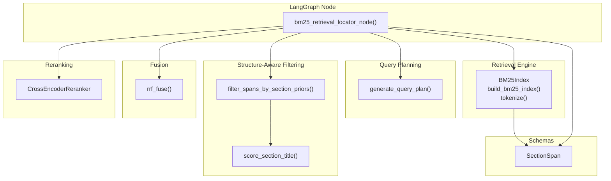
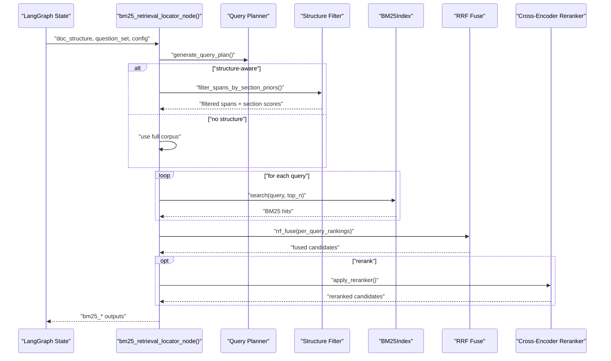
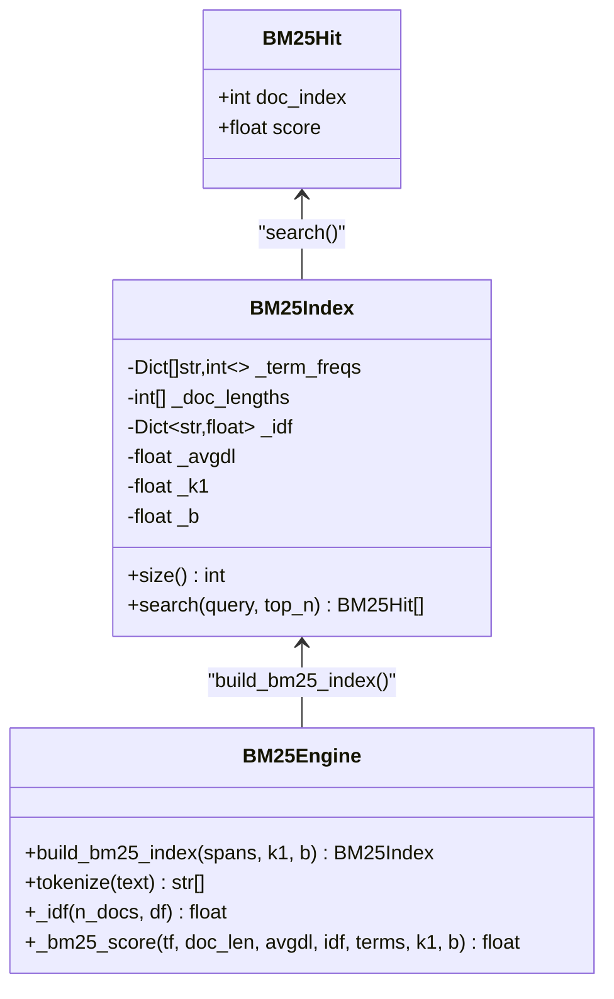
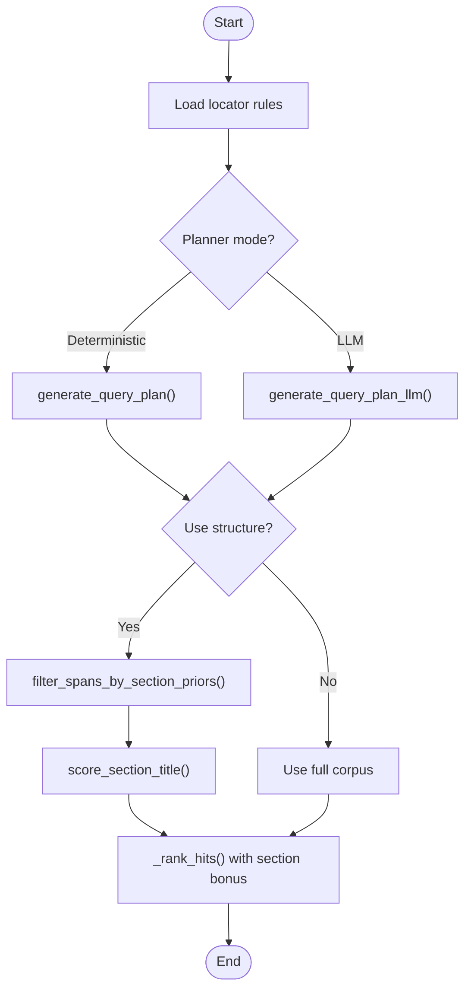
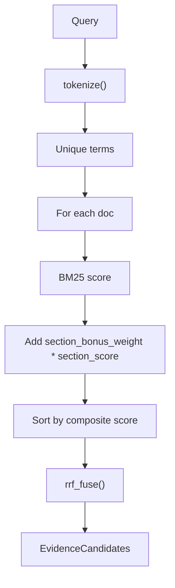
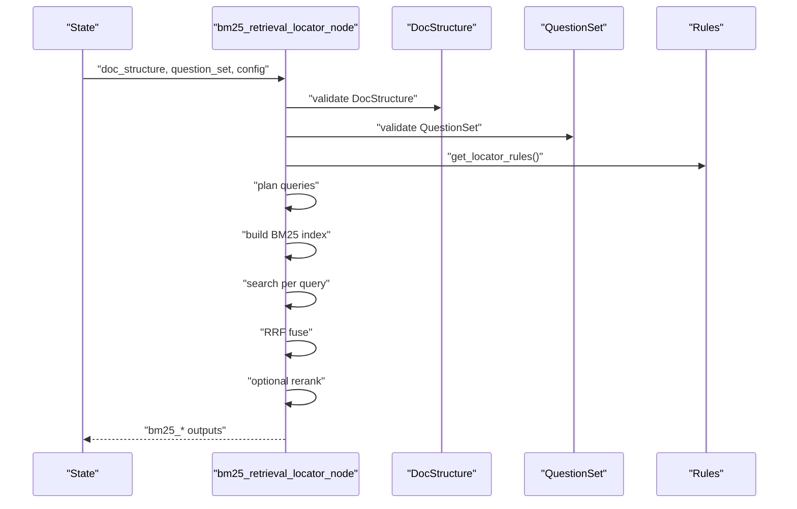
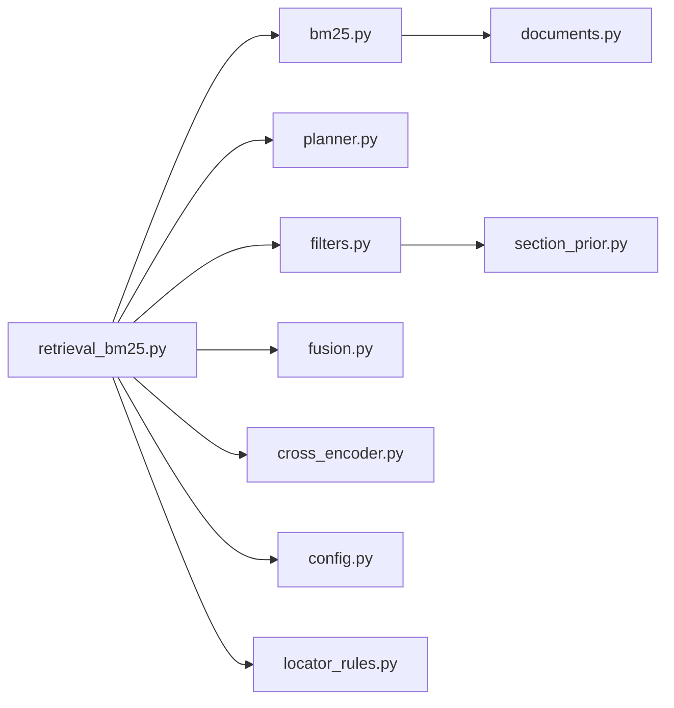

# BM25 Retrieval

<cite>
**Referenced Files in This Document**
- [bm25.py](file://src/retrieval/engines/bm25.py)
- [retrieval_bm25.py](file://src/pipelines/graphs/nodes/locators/retrieval_bm25.py)
- [fusion.py](file://src/retrieval/engines/fusion.py)
- [filters.py](file://src/retrieval/structure/filters.py)
- [section_prior.py](file://src/retrieval/structure/section_prior.py)
- [planner.py](file://src/retrieval/query_planning/planner.py)
- [cross_encoder.py](file://src/retrieval/rerankers/cross_encoder.py)
- [documents.py](file://src/schemas/internal/documents.py)
- [check_bm25_retrieval.py](file://scripts/check_bm25_retrieval.py)
- [test_retrieval_bm25.py](file://tests/unit/test_retrieval_bm25.py)
- [config.py](file://src/core/config.py)
- [locator_rules.py](file://src/rob2/locator_rules.py)
</cite>

## Table of Contents
1. [Introduction](#introduction)
2. [Project Structure](#project-structure)
3. [Core Components](#core-components)
4. [Architecture Overview](#architecture-overview)
5. [Detailed Component Analysis](#detailed-component-analysis)
6. [Dependency Analysis](#dependency-analysis)
7. [Performance Considerations](#performance-considerations)
8. [Troubleshooting Guide](#troubleshooting-guide)
9. [Conclusion](#conclusion)
10. [Appendices](#appendices)

## Introduction
This document explains the BM25 retrieval strategy implemented in the codebase and how it integrates with the LangGraph workflow for the ROB2 assessment. It covers text preprocessing, indexing, query execution, structure-aware retrieval, multi-query planning, reciprocal rank fusion (RRF), optional cross-encoder reranking, and configuration parameters such as k1, b, and tokenization settings. It also provides guidance on tuning BM25 for optimal performance in the ROB2 context, discusses trade-offs between speed and accuracy, and addresses common issues like vocabulary mismatch.

## Project Structure
The BM25 retrieval pipeline is composed of:
- A lightweight BM25 engine that builds an index over paragraph spans and performs fast scoring.
- A LangGraph node that orchestrates multi-query planning, structure-aware filtering, BM25 scoring, RRF fusion, optional reranking, and emits structured evidence bundles.
- Supporting modules for query planning, structure-aware filtering, section scoring, fusion, and reranking.

**Diagram sources**
- [bm25.py](file://src/retrieval/engines/bm25.py#L1-L149)
- [retrieval_bm25.py](file://src/pipelines/graphs/nodes/locators/retrieval_bm25.py#L1-L404)
- [planner.py](file://src/retrieval/query_planning/planner.py#L1-L93)
- [filters.py](file://src/retrieval/structure/filters.py#L1-L43)
- [section_prior.py](file://src/retrieval/structure/section_prior.py#L1-L42)
- [fusion.py](file://src/retrieval/engines/fusion.py#L1-L78)
- [cross_encoder.py](file://src/retrieval/rerankers/cross_encoder.py#L1-L125)
- [documents.py](file://src/schemas/internal/documents.py#L1-L44)

**Section sources**
- [bm25.py](file://src/retrieval/engines/bm25.py#L1-L149)
- [retrieval_bm25.py](file://src/pipelines/graphs/nodes/locators/retrieval_bm25.py#L1-L404)
- [planner.py](file://src/retrieval/query_planning/planner.py#L1-L93)
- [filters.py](file://src/retrieval/structure/filters.py#L1-L43)
- [section_prior.py](file://src/retrieval/structure/section_prior.py#L1-L42)
- [fusion.py](file://src/retrieval/engines/fusion.py#L1-L78)
- [cross_encoder.py](file://src/retrieval/rerankers/cross_encoder.py#L1-L125)
- [documents.py](file://src/schemas/internal/documents.py#L1-L44)

## Core Components
- BM25Index: Builds and stores term frequencies, document lengths, inverse document frequencies, and average document length. Provides a search method that computes BM25 scores for a query and returns top-k hits.
- Tokenization: Lowercases text, normalizes hyphens, removes non-word characters, splits by whitespace, and filters empty tokens.
- Scoring: Implements standard BM25 with IDF calculation and a document length normalization factor controlled by k1 and b.
- Index building: Aggregates per-document term counts, document frequencies, average document length, and IDF values.

Key implementation references:
- BM25Index and BM25Hit: [bm25.py](file://src/retrieval/engines/bm25.py#L15-L70)
- build_bm25_index: [bm25.py](file://src/retrieval/engines/bm25.py#L72-L106)
- tokenize: [bm25.py](file://src/retrieval/engines/bm25.py#L109-L115)
- _idf and _bm25_score: [bm25.py](file://src/retrieval/engines/bm25.py#L117-L145)

**Section sources**
- [bm25.py](file://src/retrieval/engines/bm25.py#L1-L149)

## Architecture Overview
The BM25 retrieval node integrates with the LangGraph workflow as follows:
- Validates inputs (document structure and question set).
- Generates multi-query plans (deterministic or LLM-based).
- Optionally filters the corpus by section priors and applies section bonuses.
- Runs BM25 search per query, ranks hits, fuses with RRF, optionally reranks with a cross-encoder, and produces evidence bundles.

**Diagram sources**
- [retrieval_bm25.py](file://src/pipelines/graphs/nodes/locators/retrieval_bm25.py#L48-L368)
- [planner.py](file://src/retrieval/query_planning/planner.py#L1-L93)
- [filters.py](file://src/retrieval/structure/filters.py#L1-L43)
- [fusion.py](file://src/retrieval/engines/fusion.py#L1-L78)
- [cross_encoder.py](file://src/retrieval/rerankers/cross_encoder.py#L1-L125)

**Section sources**
- [retrieval_bm25.py](file://src/pipelines/graphs/nodes/locators/retrieval_bm25.py#L1-L404)

## Detailed Component Analysis

### BM25 Engine Implementation
- Text preprocessing: Lowercase, hyphen normalization, removal of non-word characters, whitespace normalization, and token filtering.
- Index construction: Computes per-document term frequencies, document frequencies across the corpus, average document length, and IDF values.
- Scoring: Uses BM25 formula with document length normalization controlled by k1 and b. Scores are computed per unique term in the query and accumulated.

**Diagram sources**
- [bm25.py](file://src/retrieval/engines/bm25.py#L15-L145)

**Section sources**
- [bm25.py](file://src/retrieval/engines/bm25.py#L1-L149)

### Multi-Query Planning and Structure-Aware Filtering
- Query planning: Deterministic planner generates a small set of queries per question using domain keywords and overrides. An LLM planner can be used optionally with configurable parameters.
- Structure-aware filtering: Filters spans by section priors and assigns a section score; falls back to full corpus if no matches.
- Section scoring: Normalizes section titles and prioritizes earlier priors with higher scores.

**Diagram sources**
- [retrieval_bm25.py](file://src/pipelines/graphs/nodes/locators/retrieval_bm25.py#L48-L368)
- [planner.py](file://src/retrieval/query_planning/planner.py#L1-L93)
- [filters.py](file://src/retrieval/structure/filters.py#L1-L43)
- [section_prior.py](file://src/retrieval/structure/section_prior.py#L1-L42)

**Section sources**
- [retrieval_bm25.py](file://src/pipelines/graphs/nodes/locators/retrieval_bm25.py#L1-L404)
- [planner.py](file://src/retrieval/query_planning/planner.py#L1-L93)
- [filters.py](file://src/retrieval/structure/filters.py#L1-L43)
- [section_prior.py](file://src/retrieval/structure/section_prior.py#L1-L42)

### Query Execution and Ranking
- BM25 search: Tokenizes the query, deduplicates terms, and scores all documents using BM25 with k1 and b.
- Per-query ranking: Applies a composite score combining BM25 score and a section bonus weighted by section_bonus_weight.
- RRF fusion: Reciprocal rank fusion aggregates multiple query rankings, preserving best query and best engine score.

**Diagram sources**
- [bm25.py](file://src/retrieval/engines/bm25.py#L45-L70)
- [retrieval_bm25.py](file://src/pipelines/graphs/nodes/locators/retrieval_bm25.py#L258-L309)
- [fusion.py](file://src/retrieval/engines/fusion.py#L1-L78)

**Section sources**
- [bm25.py](file://src/retrieval/engines/bm25.py#L45-L70)
- [retrieval_bm25.py](file://src/pipelines/graphs/nodes/locators/retrieval_bm25.py#L258-L309)
- [fusion.py](file://src/retrieval/engines/fusion.py#L1-L78)

### Integration with LangGraph Workflow
- Node entry point: bm25_retrieval_locator_node validates inputs, loads rules, selects planner and reranker modes, builds indices, runs queries, fuses results, and returns structured outputs.
- Outputs include query plans, rankings, candidates, evidence bundles, and debug metadata for structure-awareness.

**Diagram sources**
- [retrieval_bm25.py](file://src/pipelines/graphs/nodes/locators/retrieval_bm25.py#L48-L368)
- [locator_rules.py](file://src/rob2/locator_rules.py#L1-L37)

**Section sources**
- [retrieval_bm25.py](file://src/pipelines/graphs/nodes/locators/retrieval_bm25.py#L1-L404)
- [locator_rules.py](file://src/rob2/locator_rules.py#L1-L37)

## Dependency Analysis
- BM25 engine depends on SectionSpan schema for input paragraphs.
- The BM25 node depends on query planning, structure filtering, fusion, and optional reranking.
- Configuration is loaded centrally and influences planner and reranker behavior.

**Diagram sources**
- [bm25.py](file://src/retrieval/engines/bm25.py#L1-L149)
- [retrieval_bm25.py](file://src/pipelines/graphs/nodes/locators/retrieval_bm25.py#L1-L404)
- [planner.py](file://src/retrieval/query_planning/planner.py#L1-L93)
- [filters.py](file://src/retrieval/structure/filters.py#L1-L43)
- [section_prior.py](file://src/retrieval/structure/section_prior.py#L1-L42)
- [fusion.py](file://src/retrieval/engines/fusion.py#L1-L78)
- [cross_encoder.py](file://src/retrieval/rerankers/cross_encoder.py#L1-L125)
- [config.py](file://src/core/config.py#L1-L200)
- [locator_rules.py](file://src/rob2/locator_rules.py#L1-L37)
- [documents.py](file://src/schemas/internal/documents.py#L1-L44)

**Section sources**
- [bm25.py](file://src/retrieval/engines/bm25.py#L1-L149)
- [retrieval_bm25.py](file://src/pipelines/graphs/nodes/locators/retrieval_bm25.py#L1-L404)
- [config.py](file://src/core/config.py#L1-L200)

## Performance Considerations
- Speed vs. accuracy trade-offs:
  - BM25 is fast and scalable, suitable for large corpora. Accuracy depends on tokenization quality and parameter tuning.
  - Structure-aware filtering reduces search space and improves precision by focusing on relevant sections.
  - RRF helps stabilize recall across multiple queries while preserving best engine scores.
  - Cross-encoder reranking improves accuracy at the cost of latency and compute resources.
- Tuning BM25 parameters for ROB2:
  - k1 controls term saturation; higher values increase impact of high-frequency terms. Typical starting values are around 1.5–2.5.
  - b controls length normalization; higher values penalize long documents more. Typical starting values are around 0.5–0.9.
  - Tokenization settings (hyphen handling, non-word character removal) influence matching robustness; adjust based on clinical terminology.
- Practical tips:
  - Increase per_query_top_n to capture more candidates before fusion; tune RRF k to balance diversity and precision.
  - Enable structure-aware filtering to reduce false positives and improve domain relevance.
  - Use cross-encoder reranking selectively (e.g., top-N) to balance latency and accuracy.

[No sources needed since this section provides general guidance]

## Troubleshooting Guide
Common issues and mitigations:
- Missing inputs: The node raises explicit errors if required keys are absent in state. Ensure doc_structure and question_set are present.
- Query planner selection: Only deterministic and LLM modes are supported; invalid values cause errors. LLM mode requires a configured model ID/provider.
- Reranker configuration: Requires valid model ID/device and positive max_length/batch_size/top_n. Misconfiguration falls back to no reranking.
- Structure-aware filtering: If no section priors match, the node falls back to the full corpus; verify priors and section titles.
- Vocabulary mismatch:
  - BM25 relies on exact token matches; hyphenated terms and punctuation are normalized. Ensure section titles and queries reflect the tokenization scheme.
  - Use structure-aware filtering to align spans with expected sections and reduce mismatches.
  - Consider enabling LLM query planning to generate more flexible query variants.

**Section sources**
- [retrieval_bm25.py](file://src/pipelines/graphs/nodes/locators/retrieval_bm25.py#L48-L178)
- [retrieval_bm25.py](file://src/pipelines/graphs/nodes/locators/retrieval_bm25.py#L179-L368)
- [bm25.py](file://src/retrieval/engines/bm25.py#L109-L115)

## Conclusion
The BM25 retrieval strategy provides a fast, scalable baseline for finding relevant evidence in clinical trial documents. Its integration with multi-query planning, structure-aware filtering, RRF fusion, and optional cross-encoder reranking yields a robust pipeline suitable for ROB2 assessment. Proper tuning of k1, b, and tokenization, along with careful configuration of structure priors and reranking, enables balancing speed and accuracy for practical deployment.

[No sources needed since this section summarizes without analyzing specific files]

## Appendices

### Configuration Parameters
- BM25 parameters:
  - k1: Term saturation control in BM25 scoring.
  - b: Length normalization factor in BM25 scoring.
- Tokenization settings:
  - Hyphens and dashes are normalized to spaces; non-word characters are removed; text is lowercased.
- Query planning:
  - Planner mode: deterministic or LLM.
  - LLM planner parameters: model, provider, temperature, timeout, max tokens, max retries, max keywords per question.
- Reranking:
  - Model ID, device, max length, batch size, top N.
- Structure-aware retrieval:
  - use_structure flag, section_bonus_weight, section priors per domain and question overrides.

**Section sources**
- [bm25.py](file://src/retrieval/engines/bm25.py#L31-L40)
- [bm25.py](file://src/retrieval/engines/bm25.py#L109-L115)
- [retrieval_bm25.py](file://src/pipelines/graphs/nodes/locators/retrieval_bm25.py#L178-L368)
- [config.py](file://src/core/config.py#L1-L200)

### Example Usage and Results
- Command-line checker script demonstrates:
  - Building BM25 index from parsed document spans.
  - Generating queries (deterministic or LLM).
  - Applying structure-aware filtering and section bonuses.
  - Running RRF fusion and optional cross-encoder reranking.
  - Printing top-k candidates with scores and matched section priors.

**Section sources**
- [check_bm25_retrieval.py](file://scripts/check_bm25_retrieval.py#L1-L358)

### Unit Tests Highlights
- BM25 search ranks the expected document for a targeted query.
- RRF fusion promotes documents appearing across multiple queries.
- Deterministic query planner produces a bounded, de-duplicated set of queries with domain keywords and overrides.

**Section sources**
- [test_retrieval_bm25.py](file://tests/unit/test_retrieval_bm25.py#L1-L83)