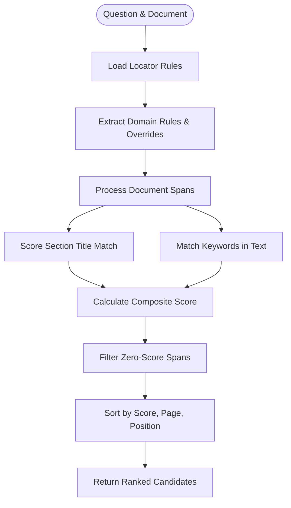
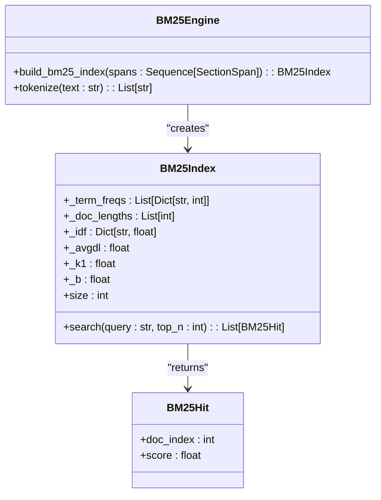
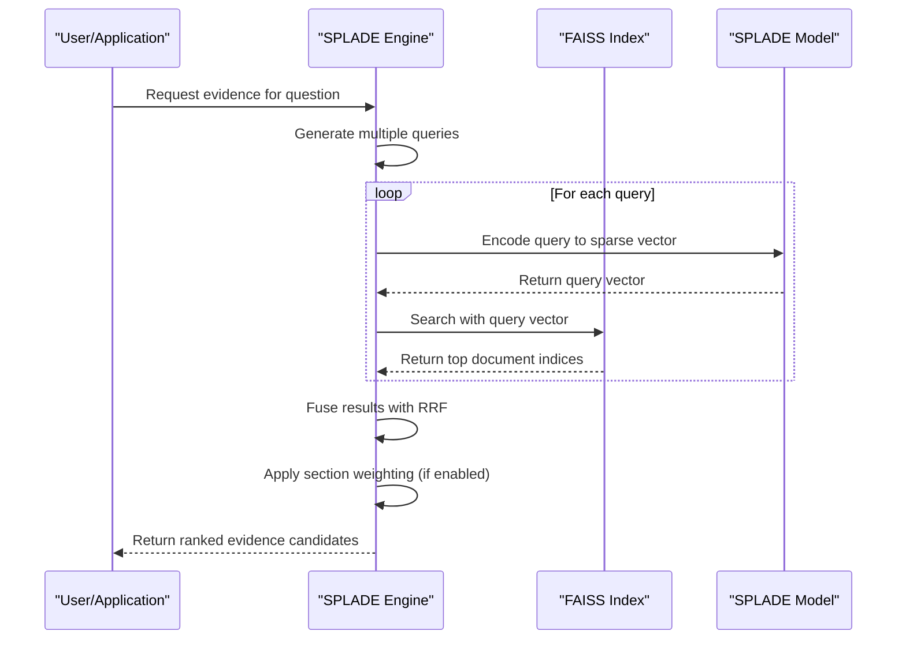
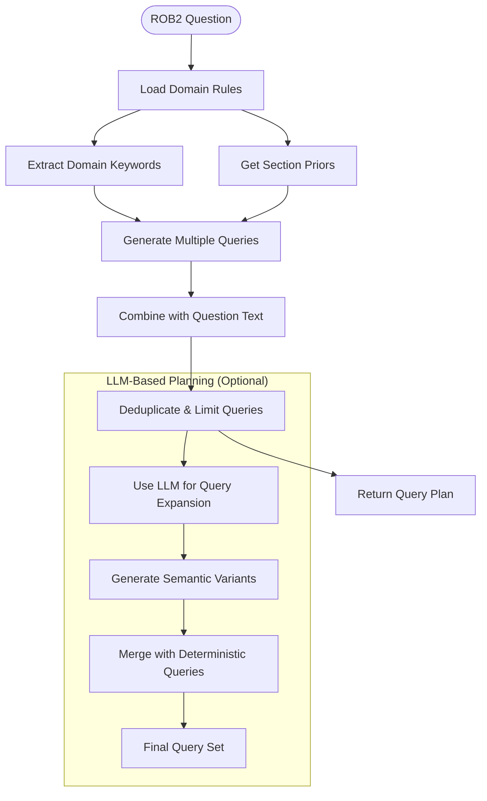
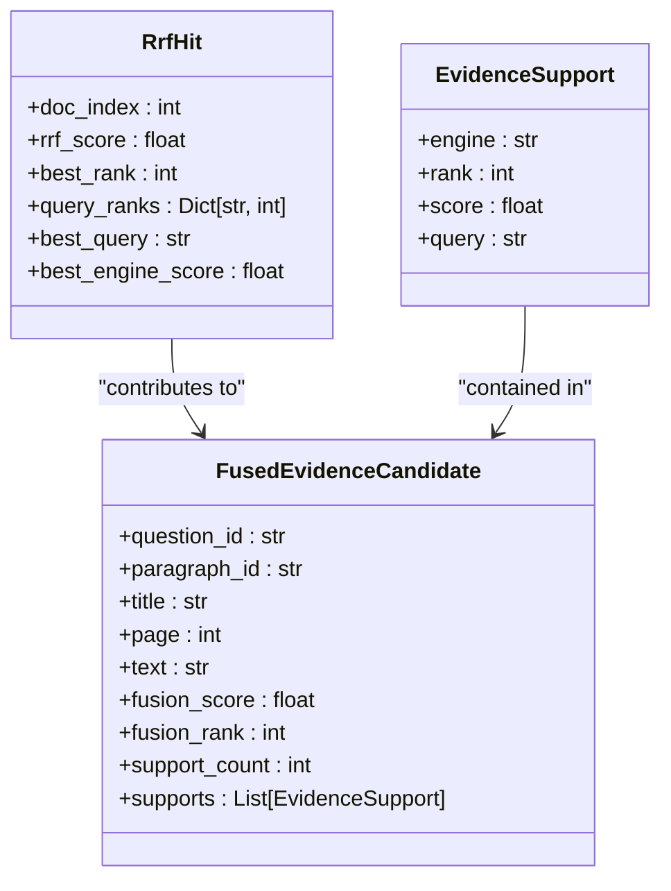

# Evidence Location

<cite>
**Referenced Files in This Document**   
- [retrieval_bm25.py](file://src/pipelines/graphs/nodes/locators/retrieval_bm25.py)
- [retrieval_splade.py](file://src/pipelines/graphs/nodes/locators/retrieval_splade.py)
- [rule_based.py](file://src/pipelines/graphs/nodes/locators/rule_based.py)
- [bm25.py](file://src/retrieval/engines/bm25.py)
- [splade.py](file://src/retrieval/engines/splade.py)
- [faiss_ip.py](file://src/retrieval/engines/faiss_ip.py)
- [fusion.py](file://src/retrieval/engines/fusion.py)
- [planner.py](file://src/retrieval/query_planning/planner.py)
- [llm.py](file://src/retrieval/query_planning/llm.py)
- [filters.py](file://src/retrieval/structure/filters.py)
- [locator_rules.py](file://src/rob2/locator_rules.py)
- [locator_rules.yaml](file://src/rob2/locator_rules.yaml)
- [fusion.py](file://src/evidence/fusion.py)
</cite>

## Table of Contents
1. [Introduction](#introduction)
2. [Multi-Strategy Evidence Location Framework](#multi-strategy-evidence-location-framework)
3. [Rule-Based Locator](#rule-based-locator)
4. [BM25 Retrieval Engine](#bm25-retrieval-engine)
5. [SPLADE Retrieval Engine](#splade-retrieval-engine)
6. [Full-Text Retrieval and Query Planning](#full-text-retrieval-and-query-planning)
7. [Retrieval Fusion and Ranking](#retrieval-fusion-and-ranking)
8. [Configuration and Performance Characteristics](#configuration-and-performance-characteristics)
9. [Accuracy Considerations and Trade-offs](#accuracy-considerations-and-trade-offs)
10. [Strategy Selection and Tuning Guidance](#strategy-selection-and-tuning-guidance)
11. [Conclusion](#conclusion)

## Introduction

The evidence location system is designed to identify relevant evidence in clinical trial documents through a multi-strategy approach that combines rule-based, BM25, SPLADE, and full-text retrieval methods. This comprehensive system leverages the strengths of different retrieval strategies to maximize both precision and recall in evidence finding. The architecture integrates multiple locator engines that work in concert, each contributing unique capabilities to the evidence discovery process. The system is specifically tailored for ROB2 (Risk of Bias 2) assessment, where accurate identification of evidence across five domains (D1-D5) is critical for evaluating the methodological quality of randomized trials. By combining deterministic rule-based approaches with advanced information retrieval techniques, the system provides a robust foundation for evidence-based assessment in clinical research.

## Multi-Strategy Evidence Location Framework

The evidence location system employs a multi-strategy framework that integrates four complementary approaches: rule-based, BM25, SPLADE, and full-text retrieval. This hybrid architecture is designed to overcome the limitations of individual retrieval methods by leveraging their respective strengths. The rule-based approach provides high precision through domain-specific heuristics and keyword matching, while BM25 offers robust statistical text retrieval based on term frequency-inverse document frequency. SPLADE, a state-of-the-art sparse retrieval model, captures semantic relationships through learned term expansions, and full-text retrieval ensures comprehensive coverage of the document corpus. These strategies operate in parallel, with their results fused through reciprocal rank fusion (RRF) to produce a unified ranking of evidence candidates. The framework supports dynamic configuration, allowing users to enable or disable specific strategies based on their requirements. Each locator engine processes the same input document structure and question set, generating evidence candidates that are later combined and ranked. This multi-strategy approach ensures that evidence is identified through multiple pathways, increasing the likelihood of finding relevant passages even when individual methods might fail.

**Section sources**
- [retrieval_bm25.py](file://src/pipelines/graphs/nodes/locators/retrieval_bm25.py)
- [retrieval_splade.py](file://src/pipelines/graphs/nodes/locators/retrieval_splade.py)
- [rule_based.py](file://src/pipelines/graphs/nodes/locators/rule_based.py)

## Rule-Based Locator

The rule-based locator implements a deterministic approach to evidence location using domain-specific heuristics and keyword matching. This strategy relies on predefined rules configured in the `locator_rules.yaml` file, which specifies section priors and keywords for each ROB2 domain (D1-D5). The locator analyzes document sections by matching section titles against domain-specific section priors and scanning text content for relevant keywords. Each match contributes to a composite score that combines section relevance (weighted by priority) and keyword frequency. The implementation in `rule_based.py` processes each question by retrieving the appropriate domain rules and any question-specific overrides, then evaluates all document spans to identify potential evidence. Section scoring prioritizes exact matches to high-priority section titles, while keyword matching employs case-insensitive comparison with normalization of punctuation and spacing. The rule-based approach excels at finding evidence in expected locations with high precision, making it particularly effective for well-structured clinical trial documents where methodology sections follow standard naming conventions. However, its recall is limited to the coverage of the predefined rules, potentially missing evidence that uses synonymous terminology or appears in unexpected sections.

**Diagram sources **
- [rule_based.py](file://src/pipelines/graphs/nodes/locators/rule_based.py#L73-L115)
- [locator_rules.py](file://src/rob2/locator_rules.py#L28-L32)

**Section sources**
- [rule_based.py](file://src/pipelines/graphs/nodes/locators/rule_based.py)
- [locator_rules.yaml](file://src/rob2/locator_rules.yaml)

## BM25 Retrieval Engine

The BM25 retrieval engine implements a probabilistic information retrieval model based on term frequency-inverse document frequency with additional parameters to control term frequency saturation and document length normalization. This engine, defined in `bm25.py`, builds an inverted index over the document spans, allowing for efficient retrieval of relevant passages. The implementation supports configurable parameters k1 (term frequency saturation) and b (document length normalization), with default values of 1.5 and 0.75 respectively. For each query, the engine calculates BM25 scores for all document spans and returns the top-k results. The retrieval process is enhanced with multi-query planning, where each ROB2 question generates multiple search queries based on domain keywords and question text. These queries are executed independently, and their results are fused using reciprocal rank fusion (RRF) to produce a final ranking. The BM25 engine also supports structure-aware retrieval, where the search space can be filtered to sections matching domain-specific section priors before applying the full-text search. This hybrid approach combines the statistical power of BM25 with domain knowledge to improve retrieval effectiveness. The engine's performance is optimized through pre-computed document statistics, including average document length and inverse document frequency for all terms in the corpus.

**Diagram sources **
- [bm25.py](file://src/retrieval/engines/bm25.py#L21-L70)
- [retrieval_bm25.py](file://src/pipelines/graphs/nodes/locators/retrieval_bm25.py#L48-L370)

**Section sources**
- [bm25.py](file://src/retrieval/engines/bm25.py)
- [retrieval_bm25.py](file://src/pipelines/graphs/nodes/locators/retrieval_bm25.py)

## SPLADE Retrieval Engine

The SPLADE retrieval engine implements a state-of-the-art sparse lexical matching approach that leverages learned term expansions from masked language models. Unlike traditional BM25, which relies on exact term matching, SPLADE captures semantic relationships by expanding queries and documents with related terms derived from the model's attention weights. The implementation in `splade.py` uses the Naver SPLADE-v3 model to encode text passages into sparse vectors in the vocabulary space, where each dimension corresponds to a vocabulary term and the value represents the importance weight. The retrieval process involves building an inner-product (IP) index using FAISS, which allows for efficient similarity search between query and document vectors. For each query, the engine encodes it into a sparse vector, searches the index for the most similar document vectors, and returns the top results. The SPLADE approach excels at finding semantically relevant passages even when there is limited lexical overlap between the query and the document text. This makes it particularly effective for finding evidence that uses different terminology than the query but conveys similar meaning. The engine supports configurable parameters including model ID, device (CPU/GPU), batch size, and maximum sequence length, allowing users to balance performance and resource requirements.

**Diagram sources **
- [splade.py](file://src/retrieval/engines/splade.py#L16-L81)
- [retrieval_splade.py](file://src/pipelines/graphs/nodes/locators/retrieval_splade.py#L49-L390)

**Section sources**
- [splade.py](file://src/retrieval/engines/splade.py)
- [faiss_ip.py](file://src/retrieval/engines/faiss_ip.py)
- [retrieval_splade.py](file://src/pipelines/graphs/nodes/locators/retrieval_splade.py)

## Full-Text Retrieval and Query Planning

The full-text retrieval system incorporates advanced query planning capabilities that enhance the effectiveness of both BM25 and SPLADE engines. The query planning framework, implemented in `planner.py` and `llm.py`, generates multiple search queries for each ROB2 question to increase the likelihood of finding relevant evidence. The deterministic planner combines the original question text with domain-specific keywords and section priors to create a diverse set of search queries. For example, a question about randomization might generate queries like "random allocation," "randomization method," and "sequence generation." The system also supports LLM-based query planning, where a language model generates additional queries based on the question context and domain knowledge. This approach can produce more sophisticated queries that capture the semantic intent of the question. The query planning process is configurable, allowing users to control the number of queries per question, the maximum number of keywords per combined query, and whether to use deterministic or LLM-based planning. The generated queries are executed in parallel, and their results are combined using reciprocal rank fusion to produce a final ranking. This multi-query approach significantly improves recall by covering different ways of expressing the same information need, while the fusion mechanism maintains precision by prioritizing passages that are retrieved by multiple queries.

**Diagram sources **
- [planner.py](file://src/retrieval/query_planning/planner.py#L11-L91)
- [llm.py](file://src/retrieval/query_planning/llm.py#L50-L106)

**Section sources**
- [planner.py](file://src/retrieval/query_planning/planner.py)
- [llm.py](file://src/retrieval/query_planning/llm.py)

## Retrieval Fusion and Ranking

The retrieval fusion system combines evidence candidates from multiple locator engines using reciprocal rank fusion (RRF) and a sophisticated evidence fusion mechanism. The RRF algorithm, implemented in `fusion.py`, merges ranked lists from different retrieval strategies by assigning scores based on the reciprocal of each document's rank position across all lists. This approach gives higher weight to documents that appear consistently at the top of multiple rankings, effectively amplifying signals from multiple retrieval methods. The fusion process begins with per-engine ranking, where each locator (rule-based, BM25, SPLADE) produces its own ranked list of evidence candidates. These lists are then combined using RRF with a configurable k parameter that controls the decay rate of the reciprocal function. The system also supports structure-aware fusion, where section priors are used to boost the scores of candidates from relevant sections. The final fusion step, implemented in `evidence/fusion.py`, creates a unified ranking of evidence candidates with explicit attribution to their source engines. Each fused candidate includes information about its rank and score from each contributing engine, enabling transparent analysis of the fusion process. This multi-stage fusion approach ensures that the final evidence ranking benefits from the complementary strengths of different retrieval strategies while maintaining interpretability.

**Diagram sources **
- [fusion.py](file://src/retrieval/engines/fusion.py#L19-L63)
- [fusion.py](file://src/evidence/fusion.py#L18-L107)

**Section sources**
- [fusion.py](file://src/retrieval/engines/fusion.py)
- [filters.py](file://src/retrieval/structure/filters.py)
- [fusion.py](file://src/evidence/fusion.py)

## Configuration and Performance Characteristics

The evidence location system offers extensive configuration options that allow users to tune the behavior of each retrieval engine and the overall fusion process. Configuration parameters are exposed through the state dictionary passed to each locator node, enabling dynamic adjustment of retrieval behavior. For the BM25 engine, configurable parameters include `top_k` (number of results to return), `per_query_top_n` (number of results per individual query), `rrf_k` (RRF decay parameter), and `section_bonus_weight` (weight for section prior boosting). The SPLADE engine adds additional parameters such as `splade_model_id`, `splade_device`, `splade_query_max_length`, and `splade_doc_max_length` to control model selection and resource usage. The query planning system supports configuration of `query_planner` (deterministic or LLM-based), `query_planner_model`, and various LLM parameters like temperature and max tokens. The reranking component can be configured with `reranker` (none or cross_encoder), `reranker_model_id`, and performance parameters like batch size and max length. Performance characteristics vary significantly between strategies: the rule-based approach is fastest but has limited recall, BM25 offers a good balance of speed and effectiveness, while SPLADE provides superior semantic matching at the cost of higher computational requirements. The system's modular design allows users to select the optimal configuration based on their specific requirements for accuracy, speed, and resource constraints.

**Section sources**
- [retrieval_bm25.py](file://src/pipelines/graphs/nodes/locators/retrieval_bm25.py)
- [retrieval_splade.py](file://src/pipelines/graphs/nodes/locators/retrieval_splade.py)
- [rule_based.py](file://src/pipelines/graphs/nodes/locators/rule_based.py)

## Accuracy Considerations and Trade-offs

The multi-strategy evidence location system involves important trade-offs between precision, recall, and computational efficiency that must be carefully considered when configuring and deploying the system. The rule-based approach offers high precision by relying on exact matches to predefined keywords and section titles, but its recall is limited by the completeness of the rule set. BM25 provides a balanced approach with good precision and recall for lexically similar content, but may miss semantically relevant passages that use different terminology. SPLADE excels at semantic matching and can find evidence with low lexical overlap, but may introduce false positives due to over-generalization. The fusion of multiple strategies mitigates these individual limitations, but introduces complexity in tuning the relative weights and parameters of each component. Precision can be improved by tightening section priors and reducing the number of queries, at the cost of lower recall. Conversely, increasing the breadth of keyword lists and using more queries improves recall but may reduce precision. The system's performance is also affected by document quality and structure, with well-organized clinical trial reports yielding better results than poorly structured documents. Users must consider their specific use case when selecting and tuning retrieval strategies, balancing the need for comprehensive evidence finding against the risk of false positives and the computational cost of more sophisticated methods.

**Section sources**
- [retrieval_bm25.py](file://src/pipelines/graphs/nodes/locators/retrieval_bm25.py)
- [retrieval_splade.py](file://src/pipelines/graphs/nodes/locators/retrieval_splade.py)
- [rule_based.py](file://src/pipelines/graphs/nodes/locators/rule_based.py)

## Strategy Selection and Tuning Guidance

Selecting and tuning retrieval strategies for specific use cases requires careful consideration of the trade-offs between precision, recall, and computational resources. For applications requiring high precision and fast response times, such as real-time evidence checking, the rule-based approach combined with BM25 retrieval provides a robust foundation. This combination leverages the exact matching capabilities of rules with the statistical power of BM25, achieving good accuracy with minimal computational overhead. When semantic understanding is critical and computational resources are available, incorporating SPLADE retrieval can significantly improve recall for conceptually relevant evidence. The LLM-based query planner should be used when domain expertise is limited or when dealing with complex questions that benefit from semantic expansion, though it requires appropriate model access and introduces additional latency. For resource-constrained environments, disabling the cross-encoder reranker and using smaller SPLADE models can reduce computational requirements with moderate impact on accuracy. Tuning should begin with the default configuration and iteratively adjust parameters based on evaluation results, focusing on key parameters like `top_k`, `rrf_k`, and `section_bonus_weight`. The system's modular design allows for A/B testing of different configurations, enabling evidence-based optimization for specific document collections and use cases.

**Section sources**
- [retrieval_bm25.py](file://src/pipelines/graphs/nodes/locators/retrieval_bm25.py)
- [retrieval_splade.py](file://src/pipelines/graphs/nodes/locators/retrieval_splade.py)
- [rule_based.py](file://src/pipelines/graphs/nodes/locators/rule_based.py)

## Conclusion

The evidence location system presents a comprehensive multi-strategy approach to finding relevant evidence in clinical trial documents, integrating rule-based, BM25, SPLADE, and full-text retrieval methods into a cohesive framework. By leveraging the complementary strengths of these approaches, the system achieves a balance of precision and recall that surpasses what any single method could accomplish alone. The rule-based locator provides high-precision matching based on domain-specific heuristics, while BM25 offers robust statistical text retrieval. SPLADE enhances semantic understanding through learned term expansions, and the multi-query planning framework ensures comprehensive coverage of potential evidence. The fusion of these strategies through reciprocal rank fusion creates a unified ranking that benefits from multiple evidence signals. The system's modular design and extensive configuration options allow for fine-tuning to specific use cases and resource constraints. This multi-strategy approach represents a significant advancement in automated evidence location for clinical research, providing a reliable foundation for risk of bias assessment and other evidence-based evaluation tasks. Future enhancements could include adaptive strategy selection based on document characteristics and continuous learning from user feedback to improve retrieval effectiveness over time.