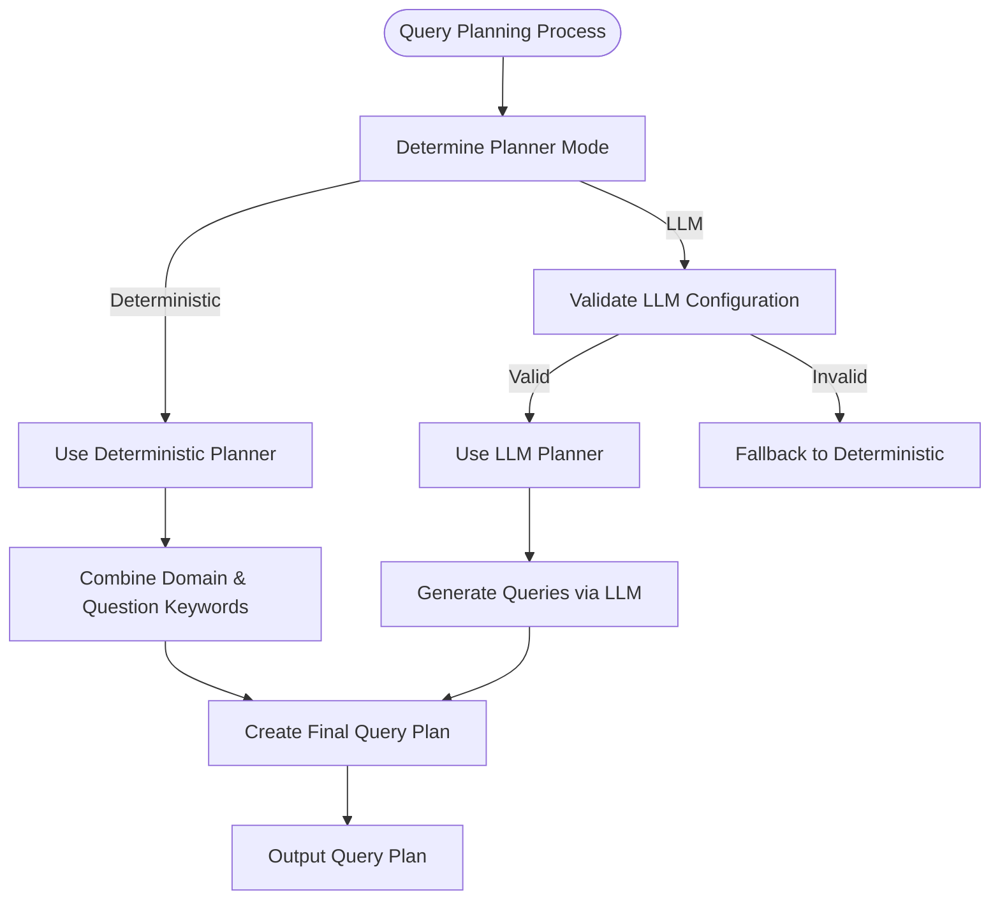
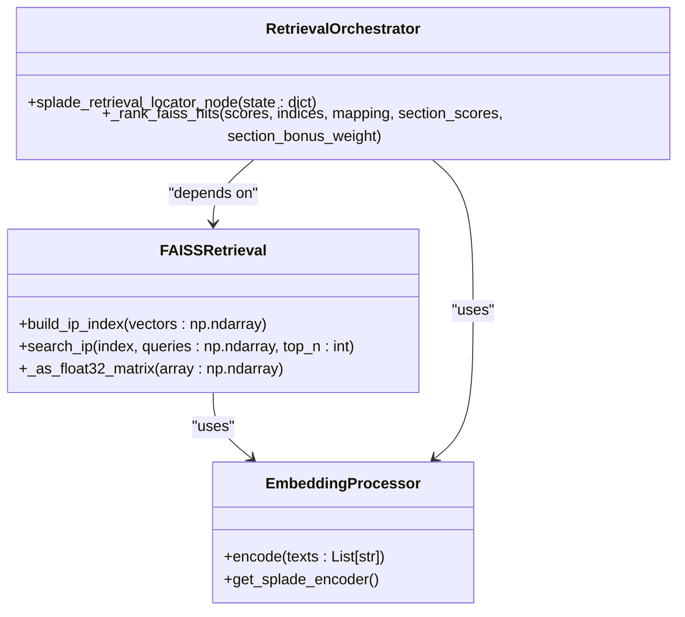
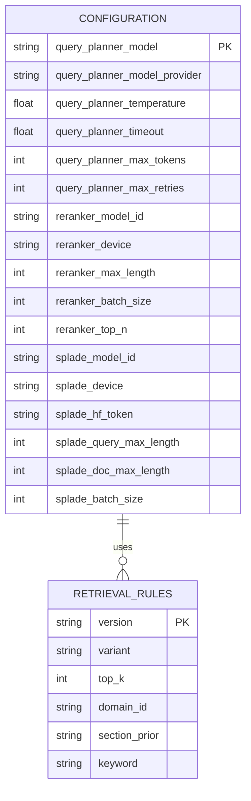
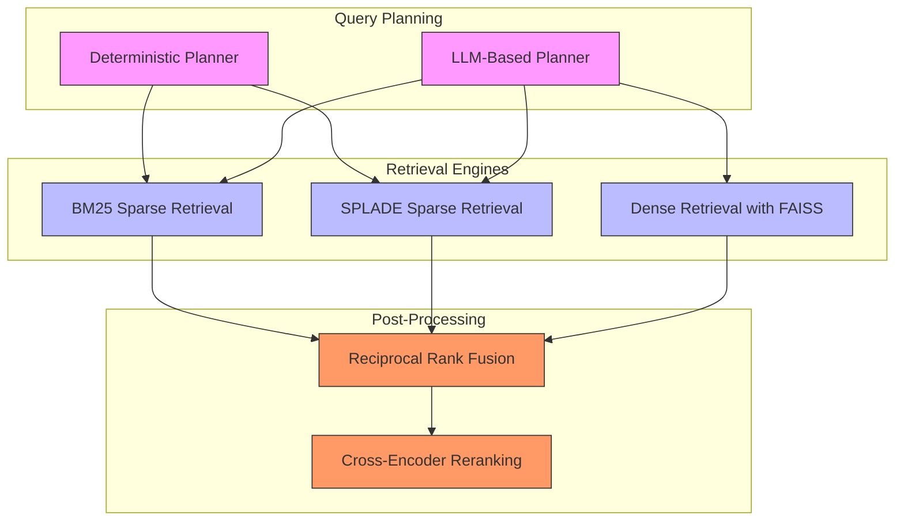

# Full-Text Locator

<cite>
**Referenced Files in This Document**   
- [planner.py](file://src/retrieval/query_planning/planner.py)
- [llm.py](file://src/retrieval/query_planning/llm.py)
- [faiss_ip.py](file://src/retrieval/engines/faiss_ip.py)
- [bm25.py](file://src/retrieval/engines/bm25.py)
- [splade.py](file://src/retrieval/engines/splade.py)
- [locator.py](file://src/schemas/internal/locator.py)
- [rob2.py](file://src/schemas/internal/rob2.py)
- [config.py](file://src/core/config.py)
- [retrieval_bm25.py](file://src/pipelines/graphs/nodes/locators/retrieval_bm25.py)
- [retrieval_splade.py](file://src/pipelines/graphs/nodes/locators/retrieval_splade.py)
- [rule_based.py](file://src/pipelines/graphs/nodes/locators/rule_based.py)
- [locator_rules.yaml](file://src/rob2/locator_rules.yaml)
</cite>

## Table of Contents
1. [Introduction](#introduction)
2. [Query Planning and LLM Integration](#query-planning-and-llm-integration)
3. [Dense Retrieval with FAISS](#dense-retrieval-with-faiss)
4. [Retrieval Engine Configuration](#retrieval-engine-configuration)
5. [Performance and Cost Considerations](#performance-and-cost-considerations)
6. [Complementary Retrieval Strategies](#complementary-retrieval-strategies)
7. [Conclusion](#conclusion)

## Introduction

The Full-Text Locator system is designed to identify relevant evidence across entire documents using advanced retrieval techniques. The system combines LLM-powered query planning with dense retrieval methods to locate evidence that may not match lexically but is semantically relevant. This documentation explains the architecture, implementation, and configuration of the full-text evidence locator, focusing on its integration of query planning, dense retrieval with FAISS, and complementary retrieval strategies.

**Section sources**
- [retrieval_bm25.py](file://src/pipelines/graphs/nodes/locators/retrieval_bm25.py#L1-L404)
- [retrieval_splade.py](file://src/pipelines/graphs/nodes/locators/retrieval_splade.py#L1-L488)
- [rule_based.py](file://src/pipelines/graphs/nodes/locators/rule_based.py#L1-L219)

## Query Planning and LLM Integration

The full-text evidence locator employs a sophisticated query planning system that combines deterministic and LLM-based approaches to generate effective search queries. The system uses two primary components for query planning: a deterministic planner and an LLM-based planner.

The deterministic query planner, implemented in `src/retrieval/query_planning/planner.py`, generates queries based on predefined rules and keyword lists. The `generate_query_plan` function creates a structured query plan by combining question text, domain-specific keywords, and question-specific overrides. This approach ensures consistent and predictable query generation based on the domain and question context.

**Diagram sources**
- [planner.py](file://src/retrieval/query_planning/planner.py#L11-L93)
- [llm.py](file://src/retrieval/query_planning/llm.py#L50-L302)

The LLM-based query planner, implemented in `src/retrieval/query_planning/llm.py`, enhances the deterministic approach by leveraging large language models to generate semantically rich queries. The `generate_query_plan_llm` function orchestrates this process by:

1. Creating a deterministic query plan as a fallback
2. Initializing an LLM with specified configuration parameters
3. Structuring a prompt with question context and constraints
4. Invoking the LLM to generate additional queries
5. Merging LLM-generated queries with deterministic queries
6. Deduplicating and normalizing the final query plan

The LLM planner uses a structured output approach with `_QueryPlanResponse` to ensure consistent JSON output format. It handles various edge cases, including invalid JSON responses and schema validation failures. The system implements a fallback mechanism that reverts to deterministic planning if the LLM service is unavailable or returns invalid responses.

Configuration for the LLM query planner is managed through the `LLMQueryPlannerConfig` dataclass, which supports parameters such as model selection, temperature, timeout, and retry settings. These configuration options are exposed through environment variables in `src/core/config.py`, allowing for flexible deployment across different environments.

**Section sources**
- [planner.py](file://src/retrieval/query_planning/planner.py#L11-L93)
- [llm.py](file://src/retrieval/query_planning/llm.py#L50-L302)
- [config.py](file://src/core/config.py#L27-L44)

## Dense Retrieval with FAISS

The full-text locator implements dense retrieval using FAISS (Facebook AI Similarity Search) with inner product similarity. The FAISS integration is handled by the `faiss_ip.py` module in the retrieval engines package.

The FAISS implementation provides two core functions: `build_ip_index` and `search_ip`. The `build_ip_index` function creates a FAISS IndexFlatIP over document embeddings, enabling efficient similarity search. This function handles platform-specific configurations, such as setting environment variables for macOS systems to avoid library conflicts.

**Diagram sources**
- [faiss_ip.py](file://src/retrieval/engines/faiss_ip.py#L12-L76)
- [splade.py](file://src/retrieval/engines/splade.py#L16-L100)
- [retrieval_splade.py](file://src/pipelines/graphs/nodes/locators/retrieval_splade.py#L49-L488)

The `search_ip` function performs similarity search on the FAISS index, returning scores and indices for the top-N most similar documents. The function includes comprehensive validation to ensure query dimensions match the index dimensions and handles edge cases such as empty vectors or zero-sized indices.

The SPLADE retrieval engine, implemented in `src/retrieval/engines/splade.py`, integrates with FAISS to provide sparse vector retrieval. The `SpladeEncoder` class encodes text into high-dimensional sparse vectors using the SPLADE model. These vectors are then indexed using FAISS for efficient similarity search. The encoder supports configurable parameters such as model ID, device selection, and batch processing.

The retrieval process follows a structured workflow:
1. Document preprocessing and section extraction
2. Vector encoding of document sections
3. FAISS index construction
4. Query encoding and similarity search
5. Result ranking and fusion

The system implements structure-aware retrieval by filtering document sections based on section priors defined in the locator rules. This approach prioritizes sections that are more likely to contain relevant evidence, improving retrieval precision.

**Section sources**
- [faiss_ip.py](file://src/retrieval/engines/faiss_ip.py#L12-L76)
- [splade.py](file://src/retrieval/engines/splade.py#L16-L100)
- [retrieval_splade.py](file://src/pipelines/graphs/nodes/locators/retrieval_splade.py#L49-L488)

## Retrieval Engine Configuration

The full-text locator system supports multiple configuration options for LLM selection, embedding models, and retrieval thresholds. These configurations are managed through environment variables and runtime parameters, providing flexibility for different deployment scenarios.

The system's configuration is defined in `src/core/config.py` using Pydantic settings. Key configuration parameters include:

**Diagram sources**
- [config.py](file://src/core/config.py#L11-L200)
- [locator.py](file://src/schemas/internal/locator.py#L12-L67)
- [locator_rules.yaml](file://src/rob2/locator_rules.yaml#L1-L161)

The locator rules, defined in `src/schemas/internal/locator.py` and instantiated in `src/rob2/locator_rules.yaml`, provide domain-specific configuration for evidence retrieval. The `LocatorRules` schema defines:
- Default retrieval parameters (top_k)
- Domain-specific section priors and keywords
- Question-specific overrides for section priors and keywords

The system supports multiple retrieval engines, each with its own configuration:
- **BM25**: Traditional sparse retrieval with configurable k1 and b parameters
- **SPLADE**: Sparse expansion via masked language models with configurable model and processing parameters
- **FAISS**: Dense retrieval with inner product similarity

Runtime configuration is passed through the state dictionary in LangGraph nodes, allowing dynamic adjustment of retrieval parameters. The `retrieval_bm25.py` and `retrieval_splade.py` modules accept parameters such as:
- `query_planner`: Selection between deterministic and LLM-based planning
- `reranker`: Selection of reranking strategy (none or cross-encoder)
- `top_k`: Number of top results to return
- `per_query_top_n`: Number of results per query before fusion
- `rrf_k`: Reciprocal Rank Fusion parameter
- `use_structure`: Flag to enable structure-aware retrieval
- `section_bonus_weight`: Weight for section prior boosting

The system implements comprehensive error handling and fallback mechanisms. If an LLM service is unavailable, the system automatically falls back to deterministic query planning. Similarly, if a reranker fails to initialize, the system continues without reranking.

**Section sources**
- [config.py](file://src/core/config.py#L11-L200)
- [locator.py](file://src/schemas/internal/locator.py#L12-L67)
- [locator_rules.yaml](file://src/rob2/locator_rules.yaml#L1-L161)
- [retrieval_bm25.py](file://src/pipelines/graphs/nodes/locators/retrieval_bm25.py#L48-L404)
- [retrieval_splade.py](file://src/pipelines/graphs/nodes/locators/retrieval_splade.py#L49-L488)

## Performance and Cost Considerations

The full-text locator system involves several performance and cost trade-offs that must be carefully managed. The system's architecture balances retrieval effectiveness with computational efficiency and operational costs.

Latency implications vary significantly between retrieval components:
- **Deterministic query planning**: Low latency, minimal computational cost
- **LLM-based query planning**: Higher latency due to LLM API calls, variable cost based on model and usage
- **BM25 retrieval**: Fast, CPU-efficient, low operational cost
- **SPLADE/FAISS retrieval**: Moderate latency, requires GPU for optimal performance, higher computational cost
- **Cross-encoder reranking**: High latency, computationally intensive, significant cost for large result sets

The system implements several optimizations to mitigate performance bottlenecks:
- Caching of SPLADE encoders using `@lru_cache`
- Batch processing of document encoding
- Efficient FAISS indexing with memory-mapped storage
- Parallel execution of multiple retrieval strategies
- Early termination in query processing when sufficient evidence is found

Cost trade-offs are particularly important when using LLM-based components. The LLM query planner incurs costs based on:
- Number of tokens processed in prompts and responses
- Model selection (larger models typically cost more)
- API provider pricing structure
- Retry attempts for failed requests

The system provides configuration options to manage these trade-offs:
- Disabling LLM query planning in cost-sensitive environments
- Adjusting LLM temperature for creativity vs. consistency
- Configuring timeout and retry parameters to balance reliability and cost
- Selecting between CPU and GPU for embedding models based on performance requirements

For high-throughput scenarios, the system can be configured to use only deterministic methods, eliminating LLM costs entirely. For maximum retrieval effectiveness, the full pipeline with LLM query planning, dense retrieval, and cross-encoder reranking can be enabled, accepting higher costs and latency.

**Section sources**
- [llm.py](file://src/retrieval/query_planning/llm.py#L50-L302)
- [splade.py](file://src/retrieval/engines/splade.py#L16-L100)
- [faiss_ip.py](file://src/retrieval/engines/faiss_ip.py#L12-L76)
- [retrieval_bm25.py](file://src/pipelines/graphs/nodes/locators/retrieval_bm25.py#L48-L404)
- [retrieval_splade.py](file://src/pipelines/graphs/nodes/locators/retrieval_splade.py#L49-L488)

## Complementary Retrieval Strategies

The full-text locator system implements a multi-strategy approach to evidence retrieval, combining multiple methods to achieve comprehensive coverage. The system employs three primary retrieval strategies that complement each other:

1. **Rule-Based Locator**: Provides stable, predictable evidence based on document structure and keyword matching
2. **Sparse Retrieval (BM25/SPLADE)**: Offers lexical matching with term frequency and inverse document frequency weighting
3. **Dense Retrieval (FAISS)**: Enables semantic similarity search through vector embeddings

**Diagram sources**
- [rule_based.py](file://src/pipelines/graphs/nodes/locators/rule_based.py#L1-L219)
- [retrieval_bm25.py](file://src/pipelines/graphs/nodes/locators/retrieval_bm25.py#L48-L404)
- [retrieval_splade.py](file://src/pipelines/graphs/nodes/locators/retrieval_splade.py#L49-L488)

The rule-based locator, implemented in `src/pipelines/graphs/nodes/locators/rule_based.py`, serves as a reliable baseline that identifies evidence based on section structure and keyword presence. This approach is particularly effective for domains with predictable evidence locations, such as clinical trial papers with standardized sections.

Sparse retrieval methods (BM25 and SPLADE) complement the rule-based approach by identifying evidence based on lexical similarity. BM25 provides traditional information retrieval capabilities, while SPLADE offers learned sparse representations that capture semantic relationships between terms.

Dense retrieval with FAISS enables the system to find evidence that may not match lexically but is semantically similar. This is particularly valuable for identifying paraphrased content or conceptually related passages that would be missed by lexical matching alone.

The system fuses results from multiple retrieval strategies using Reciprocal Rank Fusion (RRF), which combines rankings from different engines to produce a unified result list. This fusion approach leverages the strengths of each retrieval method while mitigating their individual weaknesses.

The full-text search capability should be enabled when:
- Semantic understanding of queries is critical
- Evidence may be expressed using different terminology than the query
- High recall is required to avoid missing relevant passages
- The document collection contains complex, nuanced content

The system's modular design allows for flexible configuration of retrieval strategies based on specific use cases, performance requirements, and cost constraints.

**Section sources**
- [rule_based.py](file://src/pipelines/graphs/nodes/locators/rule_based.py#L1-L219)
- [retrieval_bm25.py](file://src/pipelines/graphs/nodes/locators/retrieval_bm25.py#L48-L404)
- [retrieval_splade.py](file://src/pipelines/graphs/nodes/locators/retrieval_splade.py#L49-L488)

## Conclusion

The Full-Text Locator system represents a comprehensive approach to evidence retrieval that combines the strengths of multiple techniques. By integrating LLM-powered query planning, dense retrieval with FAISS, and complementary retrieval strategies, the system achieves high effectiveness in locating relevant evidence across entire documents.

The architecture balances advanced AI capabilities with practical considerations for performance, cost, and reliability. The modular design allows for flexible configuration and adaptation to different use cases and deployment environments. The system's fallback mechanisms ensure robust operation even when advanced components are unavailable.

Key strengths of the system include:
- Multi-strategy retrieval that combines rule-based, sparse, and dense methods
- Flexible query planning with LLM and deterministic options
- Structure-aware retrieval that leverages document organization
- Comprehensive configuration options for tuning performance and cost
- Robust error handling and fallback mechanisms

The system provides a solid foundation for evidence-based analysis, with capabilities that can be extended and refined based on specific domain requirements and evolving technology.

**Section sources**
- [retrieval_bm25.py](file://src/pipelines/graphs/nodes/locators/retrieval_bm25.py#L48-L404)
- [retrieval_splade.py](file://src/pipelines/graphs/nodes/locators/retrieval_splade.py#L49-L488)
- [rule_based.py](file://src/pipelines/graphs/nodes/locators/rule_based.py#L1-L219)
- [llm.py](file://src/retrieval/query_planning/llm.py#L50-L302)
- [faiss_ip.py](file://src/retrieval/engines/faiss_ip.py#L12-L76)