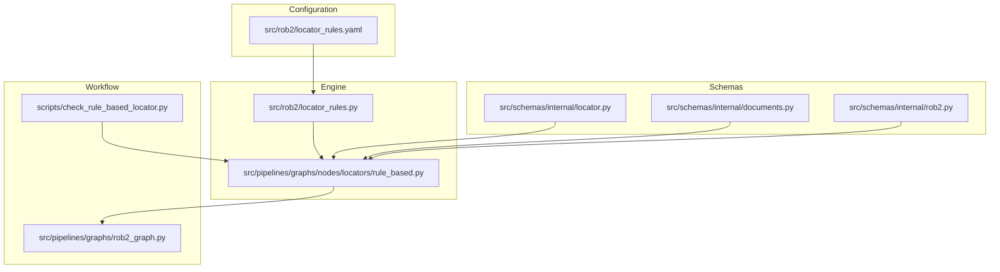
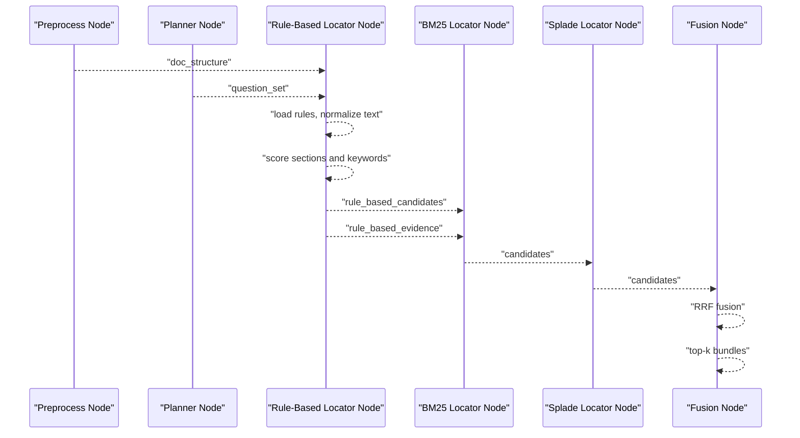
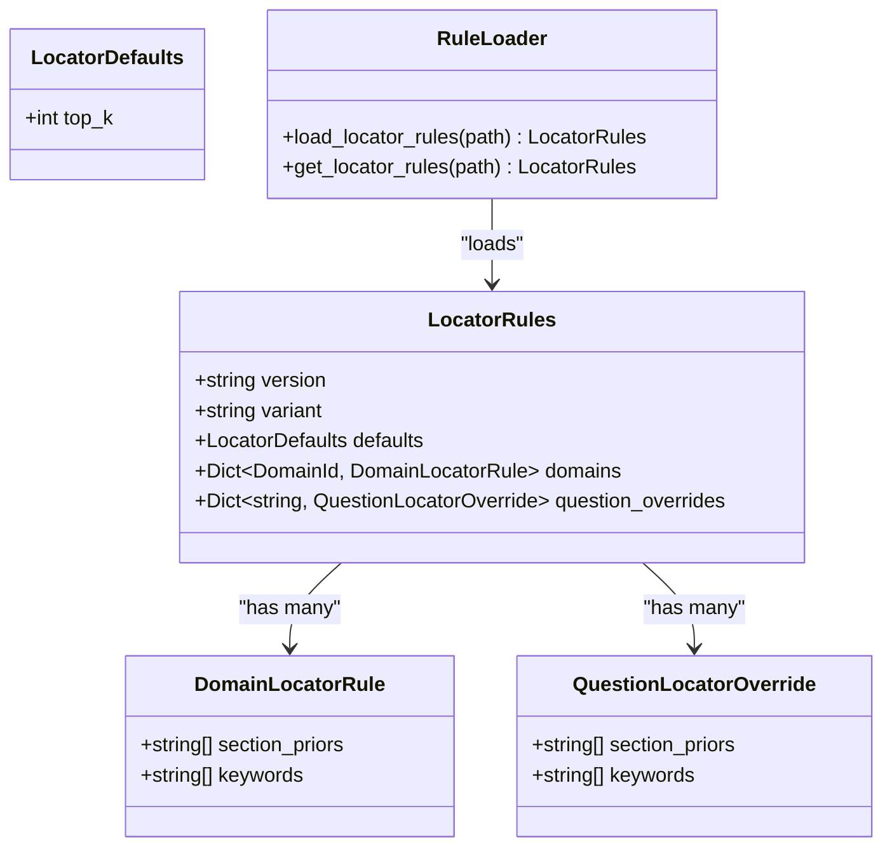
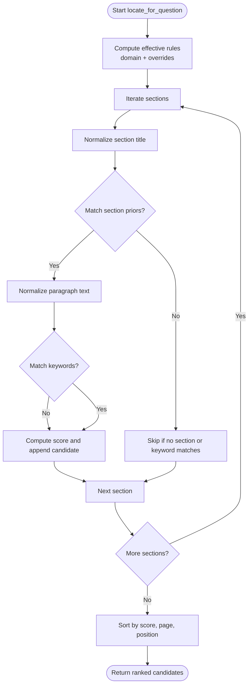
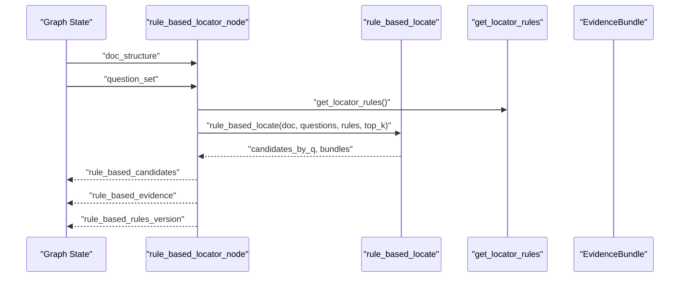
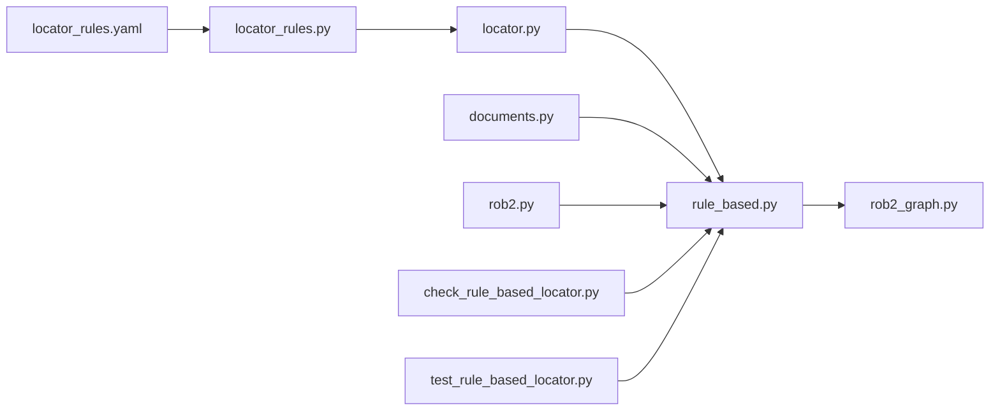

# Rule-Based Locator

<cite>
**Referenced Files in This Document**
- [locator_rules.py](file://src/rob2/locator_rules.py)
- [locator_rules.yaml](file://src/rob2/locator_rules.yaml)
- [rule_based.py](file://src/pipelines/graphs/nodes/locators/rule_based.py)
- [locator.py](file://src/schemas/internal/locator.py)
- [documents.py](file://src/schemas/internal/documents.py)
- [rob2.py](file://src/schemas/internal/rob2.py)
- [rob2_graph.py](file://src/pipelines/graphs/rob2_graph.py)
- [check_rule_based_locator.py](file://scripts/check_rule_based_locator.py)
- [test_rule_based_locator.py](file://tests/unit/test_rule_based_locator.py)
- [rob2_questions.yaml](file://src/rob2/rob2_questions.yaml)
</cite>

## Table of Contents
1. [Introduction](#introduction)
2. [Project Structure](#project-structure)
3. [Core Components](#core-components)
4. [Architecture Overview](#architecture-overview)
5. [Detailed Component Analysis](#detailed-component-analysis)
6. [Dependency Analysis](#dependency-analysis)
7. [Performance Considerations](#performance-considerations)
8. [Troubleshooting Guide](#troubleshooting-guide)
9. [Conclusion](#conclusion)
10. [Appendices](#appendices)

## Introduction
This document explains the rule-based evidence locator that identifies relevant sections in clinical trial documents for ROB2 domains. It covers how predefined rules and patterns are loaded from YAML, how the rule engine processes document sections, and how matches are produced as evidence candidates. It also describes integration with the LangGraph workflow, configuration options, performance characteristics, limitations, and guidance for extending rules to new domains or document structures.

## Project Structure
The rule-based locator spans configuration, schema definitions, the rule engine implementation, and LangGraph integration:

- Configuration: YAML-based rule definitions for domains and question-specific overrides
- Schemas: Pydantic models that validate and constrain rule configuration and runtime data
- Engine: A pure-python rule matcher that scores sections and keywords
- Graph: LangGraph node that plugs the engine into the ROB2 workflow

**Diagram sources**
- [locator_rules.yaml](file://src/rob2/locator_rules.yaml#L1-L161)
- [locator_rules.py](file://src/rob2/locator_rules.py#L1-L37)
- [rule_based.py](file://src/pipelines/graphs/nodes/locators/rule_based.py#L1-L219)
- [locator.py](file://src/schemas/internal/locator.py#L1-L67)
- [documents.py](file://src/schemas/internal/documents.py#L1-L44)
- [rob2.py](file://src/schemas/internal/rob2.py#L1-L130)
- [rob2_graph.py](file://src/pipelines/graphs/rob2_graph.py#L290-L426)
- [check_rule_based_locator.py](file://scripts/check_rule_based_locator.py#L1-L111)

**Section sources**
- [locator_rules.py](file://src/rob2/locator_rules.py#L1-L37)
- [locator_rules.yaml](file://src/rob2/locator_rules.yaml#L1-L161)
- [rule_based.py](file://src/pipelines/graphs/nodes/locators/rule_based.py#L1-L219)
- [locator.py](file://src/schemas/internal/locator.py#L1-L67)
- [documents.py](file://src/schemas/internal/documents.py#L1-L44)
- [rob2.py](file://src/schemas/internal/rob2.py#L1-L130)
- [rob2_graph.py](file://src/pipelines/graphs/rob2_graph.py#L290-L426)
- [check_rule_based_locator.py](file://scripts/check_rule_based_locator.py#L1-L111)

## Core Components
- Rule loader and cache: Loads YAML rules, validates them, and caches them for reuse
- Rule configuration schema: Defines structure and constraints for domains, defaults, and overrides
- Rule engine: Scores document sections by section priors and keyword matches, then ranks candidates
- LangGraph node: Integrates the engine into the ROB2 workflow and emits top-k bundles
- CLI checker: Demonstrates end-to-end usage from PDF to ranked candidates

Key responsibilities:
- Load and validate rules from YAML
- Normalize text for matching
- Compute section and keyword scores
- Rank candidates and produce EvidenceBundle per question
- Integrate with LangGraph state and emit structured outputs

**Section sources**
- [locator_rules.py](file://src/rob2/locator_rules.py#L1-L37)
- [locator_rules.yaml](file://src/rob2/locator_rules.yaml#L1-L161)
- [locator.py](file://src/schemas/internal/locator.py#L1-L67)
- [rule_based.py](file://src/pipelines/graphs/nodes/locators/rule_based.py#L1-L219)
- [rob2_graph.py](file://src/pipelines/graphs/rob2_graph.py#L290-L426)
- [check_rule_based_locator.py](file://scripts/check_rule_based_locator.py#L1-L111)

## Architecture Overview
The rule-based locator participates in the ROB2 workflow as a standalone node that runs before retrieval-based locators. It produces both per-question candidate lists and per-question top-k bundles.

**Diagram sources**
- [rob2_graph.py](file://src/pipelines/graphs/rob2_graph.py#L290-L426)
- [rule_based.py](file://src/pipelines/graphs/nodes/locators/rule_based.py#L1-L219)

## Detailed Component Analysis

### Rule Configuration Model and Loader
- YAML structure defines:
  - version and variant
  - defaults (e.g., top_k)
  - domains with section_priors and keywords
  - question_overrides for specific question_id entries
- Loader validates presence and type, then constructs a strongly typed model
- Cache ensures repeated loads are fast

**Diagram sources**
- [locator.py](file://src/schemas/internal/locator.py#L1-L67)
- [locator_rules.py](file://src/rob2/locator_rules.py#L1-L37)
- [locator_rules.yaml](file://src/rob2/locator_rules.yaml#L1-L161)

**Section sources**
- [locator.py](file://src/schemas/internal/locator.py#L1-L67)
- [locator_rules.py](file://src/rob2/locator_rules.py#L1-L37)
- [locator_rules.yaml](file://src/rob2/locator_rules.yaml#L1-L161)

### Rule Engine Processing Logic
The engine processes each question independently:
- Effective rules are computed by combining domain defaults with optional question-specific overrides
- For each section:
  - Section title is normalized and matched against section_priors; a score is derived from position and match
  - Paragraph text is normalized and matched against keywords; count of matches contributes to keyword_score
  - A composite score is computed and used to rank candidates
- Ranking considers:
  - Composite score (with section score weighted heavier)
  - Page number (lower page preferred)
  - Original position in the document (to preserve order for ties)

**Diagram sources**
- [rule_based.py](file://src/pipelines/graphs/nodes/locators/rule_based.py#L73-L116)

**Section sources**
- [rule_based.py](file://src/pipelines/graphs/nodes/locators/rule_based.py#L1-L219)

### LangGraph Integration
The rule-based node reads doc_structure and question_set from state, applies rules, and writes:
- rule_based_candidates: per-question list of candidates
- rule_based_evidence: per-question top-k bundles
- rule_based_rules_version: version string for provenance

It integrates into the ROB2 graph as the first locator node, preceding BM25 and Splade retrieval nodes.

**Diagram sources**
- [rule_based.py](file://src/pipelines/graphs/nodes/locators/rule_based.py#L18-L47)
- [rob2_graph.py](file://src/pipelines/graphs/rob2_graph.py#L290-L426)

**Section sources**
- [rule_based.py](file://src/pipelines/graphs/nodes/locators/rule_based.py#L1-L219)
- [rob2_graph.py](file://src/pipelines/graphs/rob2_graph.py#L290-L426)

### Example: ROB2 Domains and Matches
- D1: Randomization and allocation concealment
  - Keywords include variants of “random”, “randomization”, “allocation”, “conceal”
  - Section priors include “random”, “allocation”, “conceal”, “methods”
- D2: Deviations and adherence
  - Keywords include “blind”, “mask”, “protocol deviation”, “ITT”, “per protocol”, “as treated”
  - Section priors include “blinding”, “mask”, “intervention”, “protocol”, “methods”, “analysis”, “adherence”, “compliance”
- D3: Missing data
  - Keywords include “lost to follow-up”, “dropout”, “missing”, “imputation”
  - Section priors include “participant flow”, “follow up”, “attrition”, “results”, “methods”
- D4: Measurement and assessment
  - Keywords include “outcome”, “assessor”, “blinded”, “questionnaire”, “scale”, “instrument”
  - Section priors include “outcome”, “assessment”, “measurement”, “blinding”, “methods”
- D5: Reporting and registration
  - Keywords include “protocol”, “registered”, “registration”, “analysis plan”, “multiple outcomes”
  - Section priors include “protocol”, “registration”, “trial registration”, “analysis plan”, “statistical analysis”, “methods”, “supplement”

Examples of question-specific overrides:
- q1_1: Keywords include “computer generated”, “random number”, “block random”, “stratified”
- q1_2: Keywords include “allocation conceal”, “sealed envelope”, “opaque envelope”, “central random”
- q1_3: Keywords include “baseline”, “imbalance”, “similar at baseline”, “table 1”
- q2a_6: Keywords include “intention to treat”, “ITT”
- q2b_6: Keywords include “per protocol”, “as treated”, “adherence”, “compliance”

These demonstrate how domain defaults are augmented or overridden for specific questions.

**Section sources**
- [locator_rules.yaml](file://src/rob2/locator_rules.yaml#L1-L161)
- [test_rule_based_locator.py](file://tests/unit/test_rule_based_locator.py#L1-L140)

### CLI and Unit Tests
- CLI script demonstrates loading a PDF, question bank, and rules, then running the engine and printing top-k candidates
- Unit tests validate:
  - Rules loading and defaults
  - Correct ranking for randomization-related sections
  - Word-boundary handling for short tokens (e.g., “ITT”)

**Section sources**
- [check_rule_based_locator.py](file://scripts/check_rule_based_locator.py#L1-L111)
- [test_rule_based_locator.py](file://tests/unit/test_rule_based_locator.py#L1-L140)

## Dependency Analysis
- Rule loader depends on YAML parsing and Pydantic model validation
- Engine depends on:
  - Normalization utilities
  - Section and keyword matching
  - Candidate construction and sorting
- LangGraph node depends on:
  - Rule loader
  - Document structure and question set schemas
  - Output schemas for candidates and bundles
- Workflow depends on:
  - Node registration and edges
  - Retry loop integration

**Diagram sources**
- [locator_rules.yaml](file://src/rob2/locator_rules.yaml#L1-L161)
- [locator_rules.py](file://src/rob2/locator_rules.py#L1-L37)
- [locator.py](file://src/schemas/internal/locator.py#L1-L67)
- [rule_based.py](file://src/pipelines/graphs/nodes/locators/rule_based.py#L1-L219)
- [documents.py](file://src/schemas/internal/documents.py#L1-L44)
- [rob2.py](file://src/schemas/internal/rob2.py#L1-L130)
- [rob2_graph.py](file://src/pipelines/graphs/rob2_graph.py#L290-L426)
- [check_rule_based_locator.py](file://scripts/check_rule_based_locator.py#L1-L111)
- [test_rule_based_locator.py](file://tests/unit/test_rule_based_locator.py#L1-L140)

**Section sources**
- [rule_based.py](file://src/pipelines/graphs/nodes/locators/rule_based.py#L1-L219)
- [locator_rules.py](file://src/rob2/locator_rules.py#L1-L37)
- [locator.py](file://src/schemas/internal/locator.py#L1-L67)
- [documents.py](file://src/schemas/internal/documents.py#L1-L44)
- [rob2.py](file://src/schemas/internal/rob2.py#L1-L130)
- [rob2_graph.py](file://src/pipelines/graphs/rob2_graph.py#L290-L426)
- [check_rule_based_locator.py](file://scripts/check_rule_based_locator.py#L1-L111)
- [test_rule_based_locator.py](file://tests/unit/test_rule_based_locator.py#L1-L140)

## Performance Considerations
- Complexity:
  - For each question, scanning all sections is O(Q × S), where Q is number of questions and S is number of sections
  - Keyword matching is O(S × K) in the worst case, where K is number of keywords
  - Sorting candidates per question is O(C log C), where C is number of candidates
- Normalization:
  - Uses regex-based cleaning and whitespace normalization; overhead is linear in text length
- Caching:
  - Rules are cached to avoid repeated YAML loads and validations
- Ranking:
  - Tie-breaking by page and original position ensures deterministic ordering
- Practical tips:
  - Reduce top_k to limit output size
  - Keep keyword lists concise and prioritized
  - Consider pre-filtering sections by domain to reduce search space

[No sources needed since this section provides general guidance]

## Troubleshooting Guide
Common issues and resolutions:
- Missing or invalid YAML:
  - Ensure the YAML file exists and is a mapping
  - Validate that domains include all required keys
- Missing state inputs:
  - The LangGraph node requires both doc_structure and question_set
- Short-token matching:
  - Short tokens are matched by word boundaries; ensure keywords are meaningful and not substrings of unrelated words
- False positives:
  - Adjust section_priors and keywords to be more specific
  - Use question_overrides to tailor keywords for specific questions
- Conflicts:
  - If multiple sections match, rely on ranking; adjust weights or priors to reflect domain importance
- Version drift:
  - The node emits rule version for provenance; update YAML when changing rules

**Section sources**
- [rule_based.py](file://src/pipelines/graphs/nodes/locators/rule_based.py#L18-L47)
- [locator_rules.py](file://src/rob2/locator_rules.py#L15-L36)
- [locator.py](file://src/schemas/internal/locator.py#L38-L67)
- [test_rule_based_locator.py](file://tests/unit/test_rule_based_locator.py#L88-L140)

## Conclusion
The rule-based locator provides a fast, deterministic way to surface domain-relevant sections from clinical trial documents. It leverages curated domain knowledge and question-specific overrides to produce high-quality candidates that feed downstream retrieval and fusion. Its integration into the ROB2 workflow enables iterative validation and refinement, while its configuration model and caching support efficient operation.

[No sources needed since this section summarizes without analyzing specific files]

## Appendices

### Configuration Options
- defaults.top_k: Number of top candidates per question to include in bundles
- domains.D1/D2/D3/D4/D5:
  - section_priors: Ordered list of section title hints
  - keywords: Terms to search for in paragraph text
- question_overrides.<question_id>:
  - section_priors and keywords to augment or replace domain defaults

**Section sources**
- [locator_rules.yaml](file://src/rob2/locator_rules.yaml#L1-L161)
- [locator.py](file://src/schemas/internal/locator.py#L12-L67)

### Extending Rules for New Domains or Documents
- Add a new domain key under domains with section_priors and keywords
- Optionally add question_overrides for targeted questions
- Validate with unit tests and the CLI checker
- Consider document structure changes:
  - If sections change, update section_priors accordingly
  - If keywords vary by publication venue, add overrides

**Section sources**
- [locator_rules.yaml](file://src/rob2/locator_rules.yaml#L1-L161)
- [test_rule_based_locator.py](file://tests/unit/test_rule_based_locator.py#L1-L87)
- [check_rule_based_locator.py](file://scripts/check_rule_based_locator.py#L1-L111)

### ROB2 Question Bank Integration
- The question bank defines the set of questions and domains used by the workflow
- The rule-based locator uses question.domain to select domain rules and question_id for overrides

**Section sources**
- [rob2_questions.yaml](file://src/rob2/rob2_questions.yaml#L1-L200)
- [rob2.py](file://src/schemas/internal/rob2.py#L47-L130)