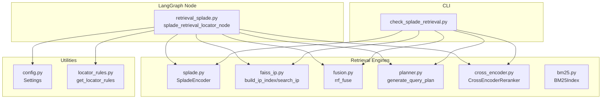
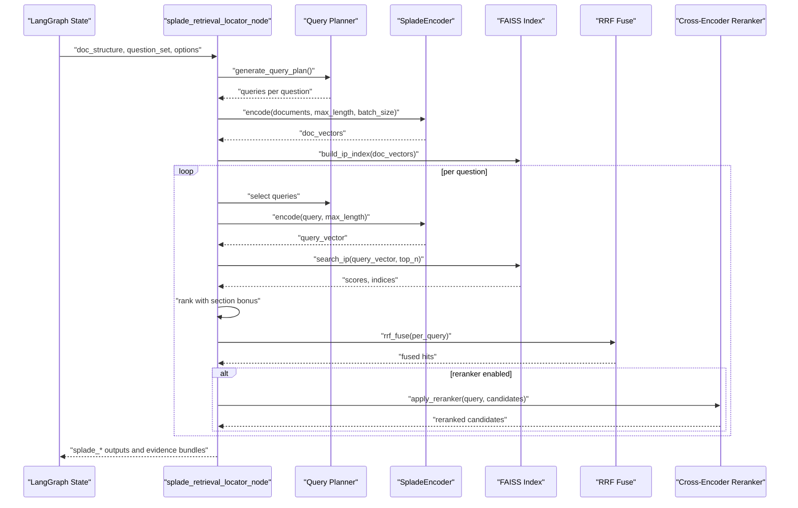
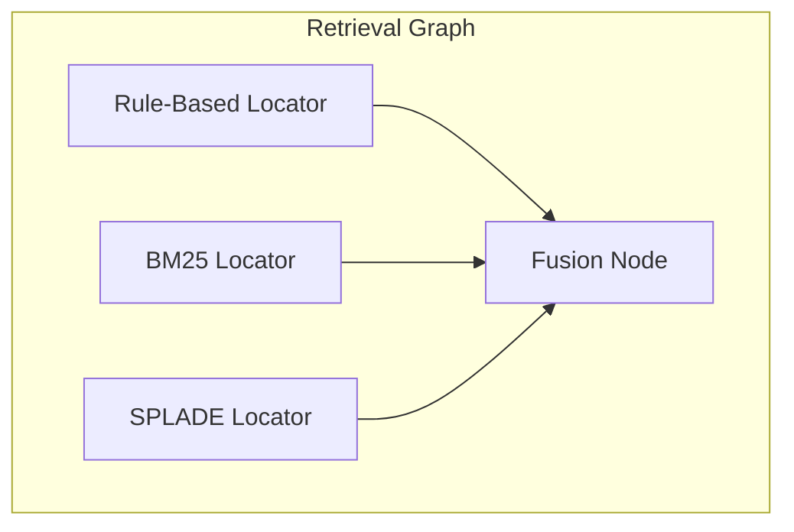
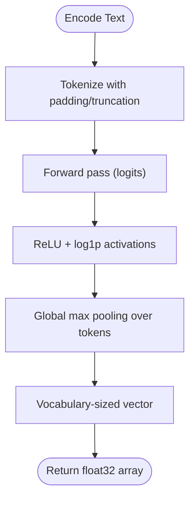
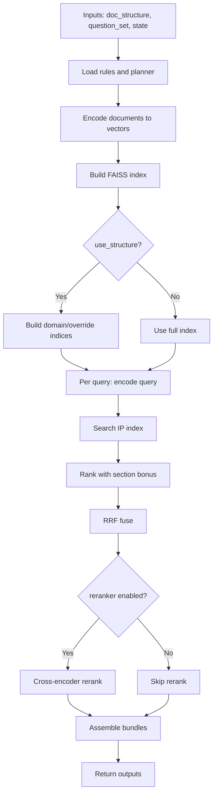
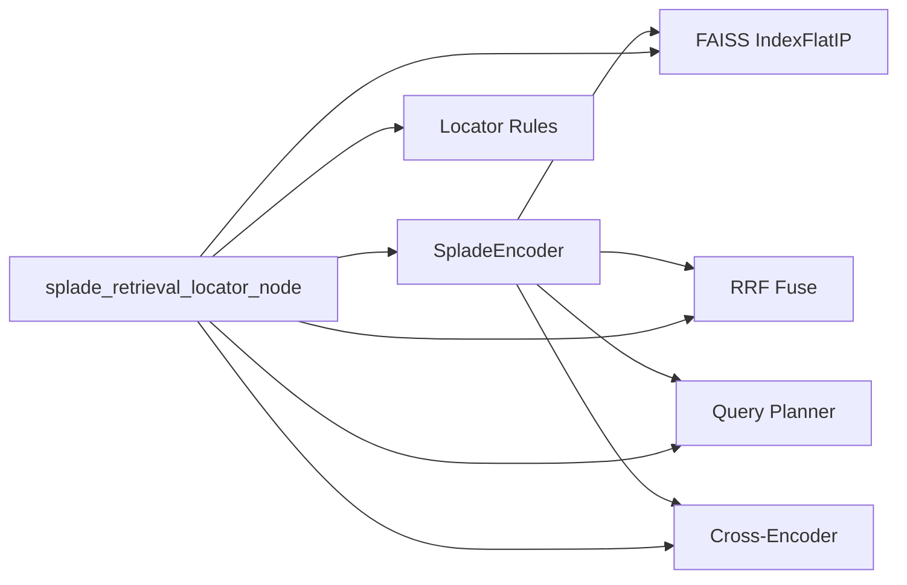

# SPLADE Retrieval

<cite>
**Referenced Files in This Document**
- [splade.py](file://src/retrieval/engines/splade.py)
- [retrieval_splade.py](file://src/pipelines/graphs/nodes/locators/retrieval_splade.py)
- [faiss_ip.py](file://src/retrieval/engines/faiss_ip.py)
- [fusion.py](file://src/retrieval/engines/fusion.py)
- [planner.py](file://src/retrieval/query_planning/planner.py)
- [cross_encoder.py](file://src/retrieval/rerankers/cross_encoder.py)
- [bm25.py](file://src/retrieval/engines/bm25.py)
- [check_splade_retrieval.py](file://scripts/check_splade_retrieval.py)
- [config.py](file://src/core/config.py)
- [rob2_runner.py](file://src/services/rob2_runner.py)
- [locator_rules.py](file://src/rob2/locator_rules.py)
</cite>

## Table of Contents
1. [Introduction](#introduction)
2. [Project Structure](#project-structure)
3. [Core Components](#core-components)
4. [Architecture Overview](#architecture-overview)
5. [Detailed Component Analysis](#detailed-component-analysis)
6. [Dependency Analysis](#dependency-analysis)
7. [Performance Considerations](#performance-considerations)
8. [Troubleshooting Guide](#troubleshooting-guide)
9. [Conclusion](#conclusion)
10. [Appendices](#appendices)

## Introduction
This document explains the SPLADE retrieval strategy in this codebase. SPLADE (SParse Lexical AnD Expansion) improves retrieval by learning term expansions from masked language modeling and representing documents and queries as sparse vectors. The implementation includes:
- A SPLADE encoder that produces sparse vectors from text
- A LangGraph node that orchestrates multi-query planning, SPLADE encoding, FAISS inner-product search, reciprocal rank fusion (RRF), optional cross-encoder reranking, and structure-aware filtering
- CLI script for standalone testing and demonstration
- Configuration via environment variables and runtime options

The SPLADE node integrates seamlessly into the broader retrieval workflow alongside BM25 and other engines, enabling hybrid retrieval and robust evidence identification.

## Project Structure
The SPLADE retrieval lives in the retrieval layer and is integrated into the LangGraph pipeline. Key files:
- Engines: SPLADE encoder, FAISS IP index, fusion, BM25, cross-encoder reranker
- Nodes: SPLADE retrieval node within the locator graph
- Utilities: query planning, configuration, and rules loader
- Scripts: CLI checker for SPLADE retrieval

**Diagram sources**
- [splade.py](file://src/retrieval/engines/splade.py#L1-L100)
- [faiss_ip.py](file://src/retrieval/engines/faiss_ip.py#L1-L76)
- [fusion.py](file://src/retrieval/engines/fusion.py#L1-L78)
- [planner.py](file://src/retrieval/query_planning/planner.py#L1-L93)
- [cross_encoder.py](file://src/retrieval/rerankers/cross_encoder.py#L1-L125)
- [bm25.py](file://src/retrieval/engines/bm25.py#L1-L149)
- [retrieval_splade.py](file://src/pipelines/graphs/nodes/locators/retrieval_splade.py#L1-L488)
- [check_splade_retrieval.py](file://scripts/check_splade_retrieval.py#L1-L420)
- [config.py](file://src/core/config.py#L1-L200)
- [locator_rules.py](file://src/rob2/locator_rules.py#L1-L37)

**Section sources**
- [splade.py](file://src/retrieval/engines/splade.py#L1-L100)
- [retrieval_splade.py](file://src/pipelines/graphs/nodes/locators/retrieval_splade.py#L1-L488)
- [faiss_ip.py](file://src/retrieval/engines/faiss_ip.py#L1-L76)
- [fusion.py](file://src/retrieval/engines/fusion.py#L1-L78)
- [planner.py](file://src/retrieval/query_planning/planner.py#L1-L93)
- [cross_encoder.py](file://src/retrieval/rerankers/cross_encoder.py#L1-L125)
- [bm25.py](file://src/retrieval/engines/bm25.py#L1-L149)
- [check_splade_retrieval.py](file://scripts/check_splade_retrieval.py#L1-L420)
- [config.py](file://src/core/config.py#L1-L200)
- [locator_rules.py](file://src/rob2/locator_rules.py#L1-L37)

## Core Components
- SpladeEncoder: Loads a pretrained masked language model and tokenizer, encodes text into sparse vectors using activation pooling, and exposes a cached factory.
- FAISS IP index: Builds and searches an inner-product index over dense vectors produced by SpladeEncoder.
- Fusion: Implements reciprocal rank fusion (RRF) to combine per-query rankings.
- Query Planner: Generates deterministic multi-query plans per question.
- Cross-Encoder Reranker: Optionally reranks candidates using a transformer pair-classifier.
- SPLADE LangGraph Node: Orchestrates the full pipeline, including structure-aware filtering, section bonuses, and optional reranking.
- CLI Checker: Demonstrates SPLADE retrieval end-to-end with configurable parameters.

**Section sources**
- [splade.py](file://src/retrieval/engines/splade.py#L1-L100)
- [faiss_ip.py](file://src/retrieval/engines/faiss_ip.py#L1-L76)
- [fusion.py](file://src/retrieval/engines/fusion.py#L1-L78)
- [planner.py](file://src/retrieval/query_planning/planner.py#L1-L93)
- [cross_encoder.py](file://src/retrieval/rerankers/cross_encoder.py#L1-L125)
- [retrieval_splade.py](file://src/pipelines/graphs/nodes/locators/retrieval_splade.py#L1-L488)
- [check_splade_retrieval.py](file://scripts/check_splade_retrieval.py#L1-L420)

## Architecture Overview
The SPLADE retrieval pipeline in the LangGraph node follows this flow:
- Load document spans and rules
- Generate multi-query plan (deterministic or LLM-driven)
- Build SPLADE encoders and encode document spans into sparse vectors
- Build FAISS inner-product index and optionally structure-aware indices
- For each query, encode query, search, rank with optional section bonus, fuse with RRF, optionally rerank with cross-encoder, and produce evidence bundles

**Diagram sources**
- [retrieval_splade.py](file://src/pipelines/graphs/nodes/locators/retrieval_splade.py#L1-L488)
- [planner.py](file://src/retrieval/query_planning/planner.py#L1-L93)
- [splade.py](file://src/retrieval/engines/splade.py#L1-L100)
- [faiss_ip.py](file://src/retrieval/engines/faiss_ip.py#L1-L76)
- [fusion.py](file://src/retrieval/engines/fusion.py#L1-L78)
- [cross_encoder.py](file://src/retrieval/rerankers/cross_encoder.py#L1-L125)

## Detailed Component Analysis

### SpladeEncoder Implementation
- Model and tokenizer are loaded from a model ID with optional Hugging Face token support.
- Encoding applies tokenization with padding/truncation, inference mode logits, ReLU activation, log1p smoothing, and global max pooling over tokens to produce a vocabulary-sized sparse vector per input text.
- Device selection prefers CUDA, MPS, otherwise CPU.
- Encodes batches for throughput and returns contiguous float32 arrays.
- Provides a cached factory to reuse encoders efficiently.

Key behaviors:
- Tokenizer and model are moved to the chosen device.
- Vocab size is derived from model config and validated.
- Batch encoding ensures memory locality and avoids repeated device transfers.

**Section sources**
- [splade.py](file://src/retrieval/engines/splade.py#L1-L100)

### FAISS Inner-Product Index
- Builds an IndexFlatIP sized to the vector dimensionality.
- Adds dense float32 vectors to the index.
- Searches with top_n and validates dimensions and index capacity.
- Returns scores and indices for nearest neighbors.

**Section sources**
- [faiss_ip.py](file://src/retrieval/engines/faiss_ip.py#L1-L76)

### Reciprocal Rank Fusion (RRF)
- Aggregates multiple ranked lists by summing reciprocal ranks with a k constant.
- Tracks best rank, best engine score, and best query per document.
- Sorts by RRF score, best rank, and best engine score.

**Section sources**
- [fusion.py](file://src/retrieval/engines/fusion.py#L1-L78)

### Query Planning
- Deterministic planner generates a small set of queries per question using domain keywords and overrides.
- Supports deduplication and ordering constraints.

**Section sources**
- [planner.py](file://src/retrieval/query_planning/planner.py#L1-L93)

### Cross-Encoder Reranker
- Loads a sequence classification model for (query, passage) pairs.
- Encodes pairs with truncation and padding, runs inference, converts logits to relevance scores, and sorts by score.
- Provides a cached factory for reuse.

**Section sources**
- [cross_encoder.py](file://src/retrieval/rerankers/cross_encoder.py#L1-L125)

### SPLADE LangGraph Node
Responsibilities:
- Validates inputs and loads rules and question sets.
- Supports deterministic or LLM query planning with configurable parameters.
- Configures reranker (optional) with model/device/length/batch/top_n.
- Resolves SPLADE configuration from state and settings (model_id, device, HF token, max lengths, batch size).
- Encodes document spans and builds FAISS index; optionally builds structure-aware indices keyed by domain and question overrides.
- For each query:
  - Encodes query
  - Searches index (structure-aware if enabled)
  - Ranks with optional section bonus
  - Fuses with RRF
  - Optionally reranks with cross-encoder
  - Produces evidence bundles and returns structured outputs

Configuration highlights:
- top_k, per_query_top_n, rrf_k
- use_structure, section_bonus_weight
- splade_model_id, splade_device, splade_hf_token
- splade_query_max_length, splade_doc_max_length, splade_batch_size

Outputs include:
- Queries, planner metadata, reranker metadata
- Rankings per query
- Candidates per question
- Evidence bundles
- Rules version and configuration snapshot
- Optional structure debug info

**Section sources**
- [retrieval_splade.py](file://src/pipelines/graphs/nodes/locators/retrieval_splade.py#L1-L488)

### CLI Checker for SPLADE Retrieval
- Demonstrates end-to-end SPLADE retrieval with optional LLM planner and cross-encoder reranking.
- Accepts arguments for model id, device, HF token, max lengths, batch size, top_k, per-query top_n, RRF k, planner mode, structure flag, and section bonus weight.
- Prints fused candidates and optionally reranked results.

**Section sources**
- [check_splade_retrieval.py](file://scripts/check_splade_retrieval.py#L1-L420)

### SPLADE vs BM25
- BM25 is a lexical, bag-of-words engine with IDF and BM25 scoring over tokenized spans.
- SPLADE learns term expansions via masked language modeling and produces sparse vectors suitable for inner-product search.
- SPLADE tends to improve recall and semantic coverage compared to BM25, while BM25 remains fast and interpretable for lexical matching.

**Section sources**
- [bm25.py](file://src/retrieval/engines/bm25.py#L1-L149)

## Architecture Overview
The SPLADE node participates in the broader retrieval workflow, alongside BM25 and rule-based locators, and feeds into a fusion stage.

**Diagram sources**
- [retrieval_splade.py](file://src/pipelines/graphs/nodes/locators/retrieval_splade.py#L1-L488)

## Detailed Component Analysis

### SPLADE Scoring Mechanism
SPLADE scoring proceeds as follows:
- Tokenize input text with padding/truncation
- Run masked language model logits
- Apply ReLU and log1p to activations
- Pool over tokens to obtain a vocabulary-sized vector
- Store as float32 on CPU for downstream FAISS search

**Diagram sources**
- [splade.py](file://src/retrieval/engines/splade.py#L1-L100)

**Section sources**
- [splade.py](file://src/retrieval/engines/splade.py#L1-L100)

### SPLADE Node Processing Logic
Key steps:
- Load rules and validate inputs
- Generate queries (deterministic or LLM)
- Encode documents and build index
- For each query:
  - Encode query
  - Search index
  - Rank with optional section bonus
  - Fuse with RRF
  - Optionally rerank with cross-encoder
  - Produce evidence bundles

**Diagram sources**
- [retrieval_splade.py](file://src/pipelines/graphs/nodes/locators/retrieval_splade.py#L1-L488)
- [faiss_ip.py](file://src/retrieval/engines/faiss_ip.py#L1-L76)
- [fusion.py](file://src/retrieval/engines/fusion.py#L1-L78)
- [cross_encoder.py](file://src/retrieval/rerankers/cross_encoder.py#L1-L125)

**Section sources**
- [retrieval_splade.py](file://src/pipelines/graphs/nodes/locators/retrieval_splade.py#L1-L488)

### Configuration Options
Runtime configuration is supported via:
- State dictionary keys (node-level)
- Application settings (environment variables)
- CLI arguments (checker script)

Key SPLADE-related options:
- splade_model_id: Model identifier or local path
- splade_device: Torch device override
- splade_hf_token: Hugging Face token for gated models
- splade_query_max_length: Max length for query tokenization
- splade_doc_max_length: Max length for document tokenization
- splade_batch_size: Batch size for encoding
- top_k: Final evidence count per question
- per_query_top_n: Hits retained per query before fusion
- rrf_k: RRF constant
- use_structure: Enable structure-aware filtering
- section_bonus_weight: Weight for section score bonus
- reranker_*: Cross-encoder configuration (model_id, device, max_length, batch_size, top_n)

Environment variables (from settings):
- SPLADE_MODEL_ID, SPLADE_DEVICE, SPLADE_HF_TOKEN
- SPLADE_QUERY_MAX_LENGTH, SPLADE_DOC_MAX_LENGTH, SPLADE_BATCH_SIZE

**Section sources**
- [retrieval_splade.py](file://src/pipelines/graphs/nodes/locators/retrieval_splade.py#L170-L203)
- [config.py](file://src/core/config.py#L1-L200)
- [check_splade_retrieval.py](file://scripts/check_splade_retrieval.py#L39-L125)
- [rob2_runner.py](file://src/services/rob2_runner.py#L115-L194)

### Integration with LangGraph Workflow
- The node expects inputs: doc_structure and question_set
- It returns structured outputs including queries, planner metadata, reranker metadata, rankings, candidates, evidence bundles, rules version, and configuration snapshot
- It can be invoked as part of a larger graph that includes rule-based and BM25 locators, followed by a fusion node

**Section sources**
- [retrieval_splade.py](file://src/pipelines/graphs/nodes/locators/retrieval_splade.py#L49-L169)
- [locator_rules.py](file://src/rob2/locator_rules.py#L1-L37)

### Example: How SPLADE Identifies Relevant Evidence
- Multi-query planning expands the semantic scope per question
- SPLADE encodes both documents and queries into sparse vectors
- FAISS inner-product search retrieves semantically similar spans
- RRF combines multiple query views to surface diverse relevant evidence
- Optional reranking refines final ordering
- Evidence bundles capture top-k candidates per question with metadata

**Section sources**
- [planner.py](file://src/retrieval/query_planning/planner.py#L1-L93)
- [splade.py](file://src/retrieval/engines/splade.py#L1-L100)
- [faiss_ip.py](file://src/retrieval/engines/faiss_ip.py#L1-L76)
- [fusion.py](file://src/retrieval/engines/fusion.py#L1-L78)
- [cross_encoder.py](file://src/retrieval/rerankers/cross_encoder.py#L1-L125)
- [retrieval_splade.py](file://src/pipelines/graphs/nodes/locators/retrieval_splade.py#L287-L378)

## Dependency Analysis
- SpladeEncoder depends on Transformers and torch; FAISS is required for indexing
- The SPLADE node depends on SpladeEncoder, FAISS, fusion, planner, cross-encoder, and rules
- CLI checker mirrors the node’s orchestration for standalone testing

**Diagram sources**
- [splade.py](file://src/retrieval/engines/splade.py#L1-L100)
- [faiss_ip.py](file://src/retrieval/engines/faiss_ip.py#L1-L76)
- [fusion.py](file://src/retrieval/engines/fusion.py#L1-L78)
- [planner.py](file://src/retrieval/query_planning/planner.py#L1-L93)
- [cross_encoder.py](file://src/retrieval/rerankers/cross_encoder.py#L1-L125)
- [retrieval_splade.py](file://src/pipelines/graphs/nodes/locators/retrieval_splade.py#L1-L488)

**Section sources**
- [splade.py](file://src/retrieval/engines/splade.py#L1-L100)
- [faiss_ip.py](file://src/retrieval/engines/faiss_ip.py#L1-L76)
- [fusion.py](file://src/retrieval/engines/fusion.py#L1-L78)
- [planner.py](file://src/retrieval/query_planning/planner.py#L1-L93)
- [cross_encoder.py](file://src/retrieval/rerankers/cross_encoder.py#L1-L125)
- [retrieval_splade.py](file://src/pipelines/graphs/nodes/locators/retrieval_splade.py#L1-L488)

## Performance Considerations
- Vector dimensionality equals the model’s vocabulary size; expect large sparse vectors
- Encoding is GPU-accelerated when available; device selection prefers CUDA, then MPS, then CPU
- Batch size controls throughput; larger batches increase speed but require more memory
- FAISS inner-product search scales with index size and top_n; structure-aware filtering reduces search space
- Cross-encoder reranking adds latency; tune top_n and batch size accordingly
- Memory footprint includes:
  - Splade vectors (float32, vocab_size × num_spans)
  - FAISS index (float32 vectors)
  - Optional cross-encoder model weights and tokenizer cache

Guidance:
- Increase splade_batch_size and per_query_top_n cautiously; monitor memory usage
- Prefer structure-aware filtering for large corpora to reduce search space
- Use reranker only when precision gain outweighs latency cost

[No sources needed since this section provides general guidance]

## Troubleshooting Guide
Common issues and resolutions:
- Missing or invalid SPLADE model id: Ensure model_id is set or available locally; provide HF token if gated
- Device errors: Verify CUDA/MPS availability; override device via splade_device
- FAISS not installed: Install FAISS package as required by the index helper
- Empty document spans: Node returns empty outputs when no spans are present
- Negative section_bonus_weight: Clamp to non-negative values
- Reranker failures: Disable reranker or adjust model/device/length/batch settings

**Section sources**
- [retrieval_splade.py](file://src/pipelines/graphs/nodes/locators/retrieval_splade.py#L170-L203)
- [faiss_ip.py](file://src/retrieval/engines/faiss_ip.py#L1-L76)
- [check_splade_retrieval.py](file://scripts/check_splade_retrieval.py#L1-L420)

## Conclusion
SPLADE retrieval in this codebase leverages learned term expansions and sparse representations to enhance semantic recall. The SPLADE node integrates multi-query planning, FAISS inner-product search, RRF fusion, optional structure-aware filtering, and cross-encoder reranking into a cohesive LangGraph workflow. Configuration is flexible via state, settings, and CLI, enabling tuning for domain-specific needs. Compared to BM25, SPLADE typically improves recall and semantic coverage, while BM25 remains efficient for lexical matching. Choose SPLADE when semantic depth matters; use BM25 or hybrid approaches depending on latency and interpretability requirements.

[No sources needed since this section summarizes without analyzing specific files]

## Appendices

### Configuration Reference
- SPLADE model and device:
  - splade_model_id, splade_device, splade_hf_token
- Tokenization and batching:
  - splade_query_max_length, splade_doc_max_length, splade_batch_size
- Ranking and fusion:
  - top_k, per_query_top_n, rrf_k
- Structure-aware filtering:
  - use_structure, section_bonus_weight
- Reranking:
  - reranker (none or cross_encoder), reranker_model_id, reranker_device, reranker_max_length, reranker_batch_size, rerank_top_n

**Section sources**
- [retrieval_splade.py](file://src/pipelines/graphs/nodes/locators/retrieval_splade.py#L170-L203)
- [config.py](file://src/core/config.py#L1-L200)
- [check_splade_retrieval.py](file://scripts/check_splade_retrieval.py#L39-L125)
- [rob2_runner.py](file://src/services/rob2_runner.py#L115-L194)