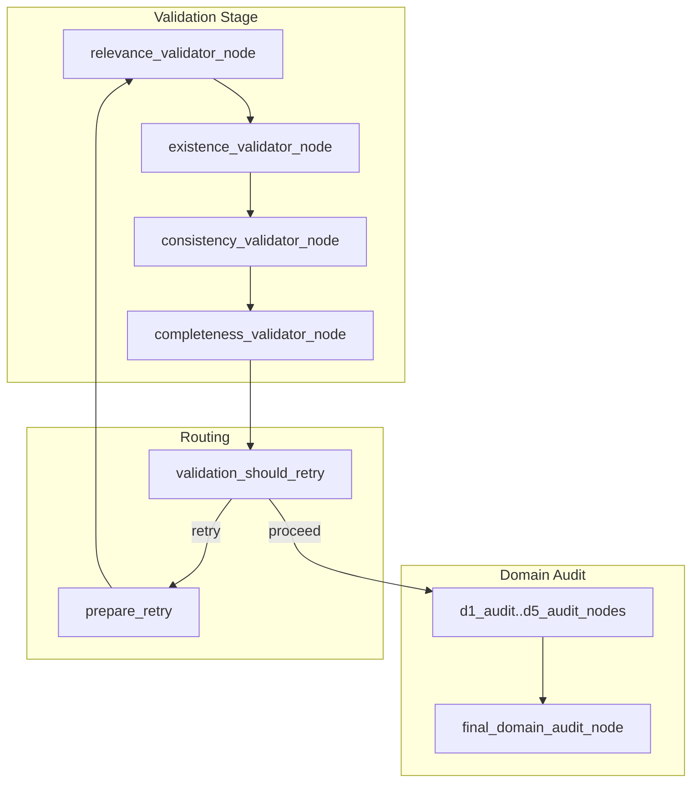
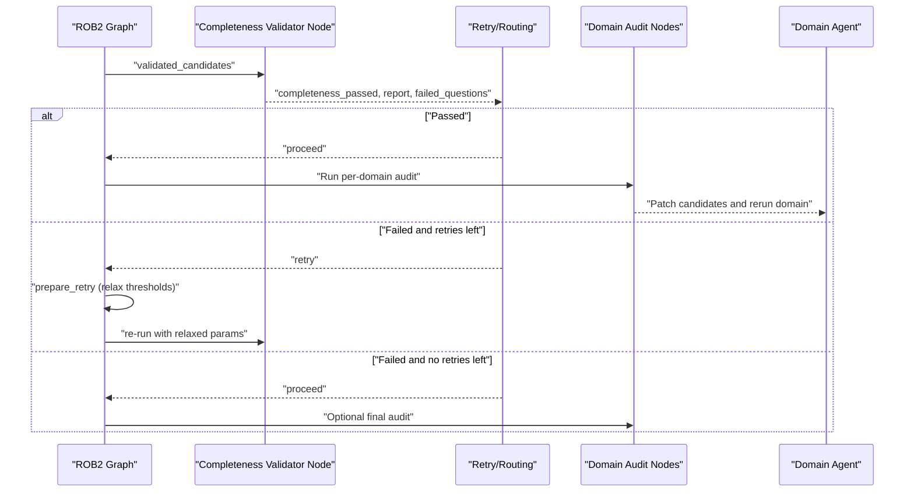
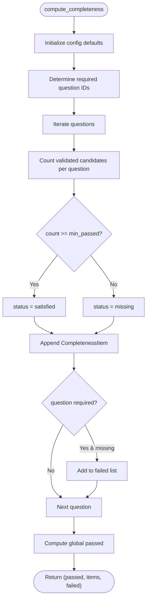
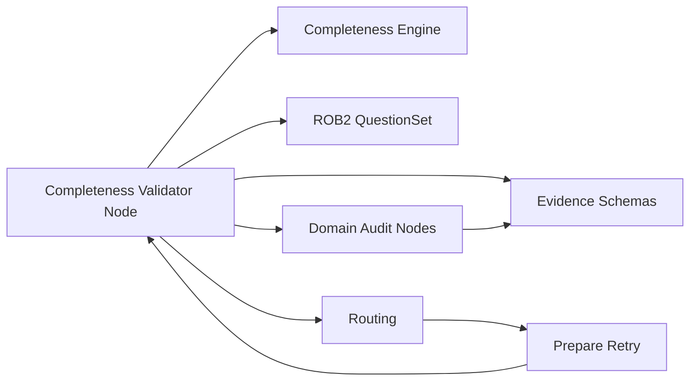

# Completeness Validation

<cite>
**Referenced Files in This Document**
- [completeness.py](file://src/evidence/validators/completeness.py)
- [completeness.py](file://src/pipelines/graphs/nodes/validators/completeness.py)
- [domain_audit.py](file://src/pipelines/graphs/nodes/domain_audit.py)
- [domain_audit_system.md](file://src/llm/prompts/validators/domain_audit_system.md)
- [rob2_graph.py](file://src/pipelines/graphs/rob2_graph.py)
- [routing.py](file://src/pipelines/graphs/routing.py)
- [evidence.py](file://src/schemas/internal/evidence.py)
- [rob2.py](file://src/schemas/internal/rob2.py)
- [0003-validation-mode-and-completeness-relaxation.md](file://docs/adr/0003-validation-mode-and-completeness-relaxation.md)
- [0005-domain-fulltext-audit-and-evidence-patching.md](file://docs/adr/0005-domain-fulltext-audit-and-evidence-patching.md)
- [system-uml.md](file://docs/system-uml.md)
- [test_completeness_validator.py](file://tests/unit/test_completeness_validator.py)
- [test_domain_audit.py](file://tests/unit/test_domain_audit.py)
- [config.py](file://src/core/config.py)
</cite>

## Table of Contents
1. [Introduction](#introduction)
2. [Project Structure](#project-structure)
3. [Core Components](#core-components)
4. [Architecture Overview](#architecture-overview)
5. [Detailed Component Analysis](#detailed-component-analysis)
6. [Dependency Analysis](#dependency-analysis)
7. [Performance Considerations](#performance-considerations)
8. [Troubleshooting Guide](#troubleshooting-guide)
9. [Conclusion](#conclusion)
10. [Appendices](#appendices)

## Introduction
This document explains the completeness validation sub-component that ensures collected evidence sufficiently addresses all aspects of a given ROB2 question. It covers how the system computes completeness using domain-specific rules and LLM reasoning, integrates with the domain audit module for evidence patching and re-running, and manages configuration options such as enforcement, required evidence types, and tolerance levels. It also addresses common issues like incomplete reporting in source documents and provides mitigation strategies, along with performance considerations around recursive validation attempts and resource usage.

## Project Structure
Completeness validation sits within the validation stage of the ROB2 workflow. The evidence pipeline produces validated candidates, and the completeness validator selects those meeting configured thresholds. When completeness fails, the workflow can retry with relaxed criteria or trigger domain audit to patch evidence and re-run the domain agent.

**Diagram sources**
- [system-uml.md](file://docs/system-uml.md#L3-L104)
- [routing.py](file://src/pipelines/graphs/routing.py#L38-L57)
- [rob2_graph.py](file://src/pipelines/graphs/rob2_graph.py#L380-L409)

**Section sources**
- [system-uml.md](file://docs/system-uml.md#L3-L104)
- [rob2_graph.py](file://src/pipelines/graphs/rob2_graph.py#L380-L409)

## Core Components
- Completeness computation engine: Computes per-question pass/fail based on counts of validated candidates and configuration.
- Completeness validator node: Orchestrates selection of validated evidence, applies enforcement and required question sets, and emits a completeness report.
- Domain audit module: Performs full-text audit per domain, compares answers, patches validated candidates with weakly grounded evidence, and optionally re-runs the domain agent.
- Routing and retry: Decides whether to retry validation with relaxed parameters or proceed to domain agents.

Key configuration options:
- Enforce completeness: Boolean to treat missing required questions as failure.
- Required question IDs: Explicit set of questions to enforce.
- Minimum passed per question: Threshold for passing a question.
- Require relevance for completeness: Whether relevance filtering is applied during selection.
- Relaxation on retry: Controls automatic relaxation of thresholds and strictness during retries.

**Section sources**
- [completeness.py](file://src/evidence/validators/completeness.py#L12-L62)
- [completeness.py](file://src/pipelines/graphs/nodes/validators/completeness.py#L1-L140)
- [domain_audit.py](file://src/pipelines/graphs/nodes/domain_audit.py#L1-L789)
- [domain_audit_system.md](file://src/llm/prompts/validators/domain_audit_system.md#L1-L37)
- [routing.py](file://src/pipelines/graphs/routing.py#L38-L57)
- [0003-validation-mode-and-completeness-relaxation.md](file://docs/adr/0003-validation-mode-and-completeness-relaxation.md#L1-L36)
- [0005-domain-fulltext-audit-and-evidence-patching.md](file://docs/adr/0005-domain-fulltext-audit-and-evidence-patching.md#L1-L37)

## Architecture Overview
The completeness validator consumes validated candidates produced by earlier validators and applies configurable thresholds. If completeness fails, the workflow may retry with relaxed parameters or route to domain audit to patch evidence and re-run the domain agent.

**Diagram sources**
- [rob2_graph.py](file://src/pipelines/graphs/rob2_graph.py#L380-L409)
- [routing.py](file://src/pipelines/graphs/routing.py#L38-L57)
- [domain_audit.py](file://src/pipelines/graphs/nodes/domain_audit.py#L1-L789)

## Detailed Component Analysis

### Completeness Computation Engine
The computation engine evaluates per-question sufficiency based on:
- Required question set (explicit or derived from enforcement and question set).
- Minimum passed per question threshold.
- Status per question: satisfied vs missing.
- Global pass/fail determined by presence of any missing required question.

It raises an error if the minimum passed threshold is below the required lower bound.

**Diagram sources**
- [completeness.py](file://src/evidence/validators/completeness.py#L12-L62)

**Section sources**
- [completeness.py](file://src/evidence/validators/completeness.py#L12-L62)

### Completeness Validator Node
The node orchestrates:
- Selecting candidates from either relevance or existence sources.
- Applying relevance filtering when required or deterministic pass/fail when relevance is not required.
- Building validated evidence bundles up to a configurable top-k.
- Computing completeness with enforcement, required question IDs, and minimum passed thresholds.
- Emitting outputs: validated candidates, validated evidence, completeness_passed, completeness_report, and completeness_failed_questions.

Configuration inputs:
- completeness_enforce: Enforce completeness globally.
- completeness_required_questions: Explicit required question IDs.
- completeness_min_passed_per_question: Minimum passed per question.
- completeness_require_relevance: Whether to require relevance filtering.
- relevance_mode: Influences require_relevance default.
- validated_top_k: Top-k selection for validated evidence.

**Section sources**
- [completeness.py](file://src/pipelines/graphs/nodes/validators/completeness.py#L1-L140)
- [rob2.py](file://src/schemas/internal/rob2.py#L1-L130)
- [evidence.py](file://src/schemas/internal/evidence.py#L115-L171)

### Domain Audit Module and Evidence Patching
The domain audit module performs full-text auditing per domain:
- Loads a domain-specific system prompt for strict ROB2 auditing.
- Compares audit answers with domain agent answers.
- Identifies mismatches and patches validated candidates using audit citations.
- Applies deterministic grounding: paragraph_id must exist; quote (when present) must match the source text.
- Optionally expands a patch window and limits patches per question.
- Updates validated candidates and can re-run the domain agent immediately.

Integration with completeness:
- When completeness fails, the workflow may route to domain audit to patch evidence and re-run the domain agent, improving chances of satisfying completeness.

**Section sources**
- [domain_audit.py](file://src/pipelines/graphs/nodes/domain_audit.py#L1-L789)
- [domain_audit_system.md](file://src/llm/prompts/validators/domain_audit_system.md#L1-L37)
- [0005-domain-fulltext-audit-and-evidence-patching.md](file://docs/adr/0005-domain-fulltext-audit-and-evidence-patching.md#L1-L37)

### Interaction with Validation Retry and Routing
The validation stage decides whether to retry or proceed:
- If completeness passes and consistency constraints are satisfied, proceed to domain agents.
- If completeness fails and retry budget remains, prepare a retry with relaxed thresholds and re-run the evidence pipeline.
- If completeness fails and no retries remain, still proceed to domain audit for optional final review.

Relaxation controls:
- Lower relevance_min_confidence.
- Disable strict quote/text matching.
- Force completeness_require_relevance=False during retries.

**Section sources**
- [routing.py](file://src/pipelines/graphs/routing.py#L38-L57)
- [rob2_graph.py](file://src/pipelines/graphs/rob2_graph.py#L248-L285)
- [0003-validation-mode-and-completeness-relaxation.md](file://docs/adr/0003-validation-mode-and-completeness-relaxation.md#L1-L36)

### Configuration Options
- Enforce completeness:
  - completeness_enforce: Boolean to treat missing required questions as failure.
- Required evidence types:
  - completeness_required_questions: List of question IDs to enforce.
- Tolerance levels:
  - completeness_min_passed_per_question: Minimum number of validated candidates per question to pass.
  - completeness_require_relevance: Whether relevance filtering is applied during selection.
  - relevance_mode: Influences require_relevance default.
- Retry and relaxation:
  - validation_max_retries: Maximum retry attempts.
  - validation_relax_on_retry: Enable automatic relaxation during retries.
  - relevance_min_confidence: Confidence threshold for relevance filtering.
  - relevance_require_quote, existence_require_text_match, existence_require_quote_in_source: Strictness toggles for grounding.
- Domain audit:
  - domain_audit_mode: "none" or "llm".
  - domain_audit_model, domain_audit_model_provider, domain_audit_temperature, domain_audit_timeout, domain_audit_max_tokens, domain_audit_max_retries.
  - domain_audit_patch_window, domain_audit_max_patches_per_question, domain_audit_rerun_domains, domain_audit_final.

Environment and settings:
- Centralized settings include domain audit and model parameters.

**Section sources**
- [completeness.py](file://src/pipelines/graphs/nodes/validators/completeness.py#L80-L125)
- [rob2_graph.py](file://src/pipelines/graphs/rob2_graph.py#L216-L245)
- [config.py](file://src/core/config.py#L1-L200)
- [0003-validation-mode-and-completeness-relaxation.md](file://docs/adr/0003-validation-mode-and-completeness-relaxation.md#L1-L36)
- [0005-domain-fulltext-audit-and-evidence-patching.md](file://docs/adr/0005-domain-fulltext-audit-and-evidence-patching.md#L1-L37)

### Examples from the Codebase
- Completeness validator node emits validated evidence and completeness report for a single question when relevance filtering is applied.
- Completeness validator node allows pass when relevance is not required even if candidates are not relevant.
- Domain audit patches evidence and triggers immediate re-run of the domain agent when mismatches are detected.

**Section sources**
- [test_completeness_validator.py](file://tests/unit/test_completeness_validator.py#L68-L127)
- [test_domain_audit.py](file://tests/unit/test_domain_audit.py#L62-L101)

## Dependency Analysis
Completeness validation depends on:
- Evidence schemas for validated candidates and bundles.
- ROB2 question schemas for question sets and conditions.
- Routing logic to decide retry vs proceed.
- Domain audit module for patching and re-running when needed.

**Diagram sources**
- [completeness.py](file://src/pipelines/graphs/nodes/validators/completeness.py#L1-L140)
- [completeness.py](file://src/evidence/validators/completeness.py#L12-L62)
- [evidence.py](file://src/schemas/internal/evidence.py#L115-L171)
- [rob2.py](file://src/schemas/internal/rob2.py#L82-L130)
- [routing.py](file://src/pipelines/graphs/routing.py#L38-L57)
- [domain_audit.py](file://src/pipelines/graphs/nodes/domain_audit.py#L1-L789)

**Section sources**
- [completeness.py](file://src/pipelines/graphs/nodes/validators/completeness.py#L1-L140)
- [completeness.py](file://src/evidence/validators/completeness.py#L12-L62)
- [evidence.py](file://src/schemas/internal/evidence.py#L115-L171)
- [rob2.py](file://src/schemas/internal/rob2.py#L82-L130)
- [routing.py](file://src/pipelines/graphs/routing.py#L38-L57)
- [domain_audit.py](file://src/pipelines/graphs/nodes/domain_audit.py#L1-L789)

## Performance Considerations
- Recursive validation attempts:
  - Retries increase computational cost; use validation_max_retries judiciously.
  - Prepare retry increases per_query_top_n and top_k gradually to reduce repeated low-quality retrievals.
- Relaxed thresholds:
  - Lowering relevance_min_confidence and disabling strict matching reduces LLM calls but may introduce noise.
- Domain audit:
  - Full-text audit adds significant LLM calls and potential re-runs; enable only when needed.
  - Patch window and max patches control expansion cost.
- Deterministic grounding:
  - Quote verification and paragraph existence checks add CPU overhead; keep enabled for safety.

Mitigation strategies:
- Start with conservative thresholds and enable relaxation only on retries.
- Limit domain audit to failing domains rather than all domains.
- Tune domain_audit_patch_window and max_patches to balance recall and cost.

[No sources needed since this section provides general guidance]

## Troubleshooting Guide
Common issues and mitigations:
- Incomplete reporting in source documents:
  - Use domain audit to expand evidence with weakly grounded candidates and re-run the domain agent.
  - Verify that audit citations pass deterministic grounding (paragraph_id exists and quote matches when provided).
- Excessive retries:
  - Reduce validation_max_retries or disable validation_relax_on_retry to avoid unnecessary expansions.
- Overly strict completeness:
  - Adjust completeness_min_passed_per_question or completeness_required_questions to reflect domain needs.
- Relevance filtering blocking evidence:
  - Temporarily set completeness_require_relevance=False during retries to allow deterministic pass-through.

**Section sources**
- [0005-domain-fulltext-audit-and-evidence-patching.md](file://docs/adr/0005-domain-fulltext-audit-and-evidence-patching.md#L1-L37)
- [domain_audit.py](file://src/pipelines/graphs/nodes/domain_audit.py#L1-L789)
- [rob2_graph.py](file://src/pipelines/graphs/rob2_graph.py#L248-L285)

## Conclusion
Completeness validation ensures that collected evidence adequately addresses ROB2 questions by applying configurable thresholds and domain-specific rules. When completeness fails, the system can relax thresholds and retry, or engage domain audit to patch evidence and re-run domain agents. Proper configuration of enforcement, required question sets, and tolerance levels, combined with careful use of domain audit, improves robustness while controlling costs.

[No sources needed since this section summarizes without analyzing specific files]

## Appendices

### Configuration Reference
- Completeness:
  - completeness_enforce
  - completeness_required_questions
  - completeness_min_passed_per_question
  - completeness_require_relevance
- Validation retry:
  - validation_max_retries
  - validation_relax_on_retry
  - relevance_min_confidence
  - relevance_require_quote
  - existence_require_text_match
  - existence_require_quote_in_source
- Domain audit:
  - domain_audit_mode
  - domain_audit_model, domain_audit_model_provider
  - domain_audit_temperature, domain_audit_timeout, domain_audit_max_tokens, domain_audit_max_retries
  - domain_audit_patch_window, domain_audit_max_patches_per_question
  - domain_audit_rerun_domains, domain_audit_final

**Section sources**
- [completeness.py](file://src/pipelines/graphs/nodes/validators/completeness.py#L80-L125)
- [rob2_graph.py](file://src/pipelines/graphs/rob2_graph.py#L216-L245)
- [config.py](file://src/core/config.py#L1-L200)
- [0003-validation-mode-and-completeness-relaxation.md](file://docs/adr/0003-validation-mode-and-completeness-relaxation.md#L1-L36)
- [0005-domain-fulltext-audit-and-evidence-patching.md](file://docs/adr/0005-domain-fulltext-audit-and-evidence-patching.md#L1-L37)