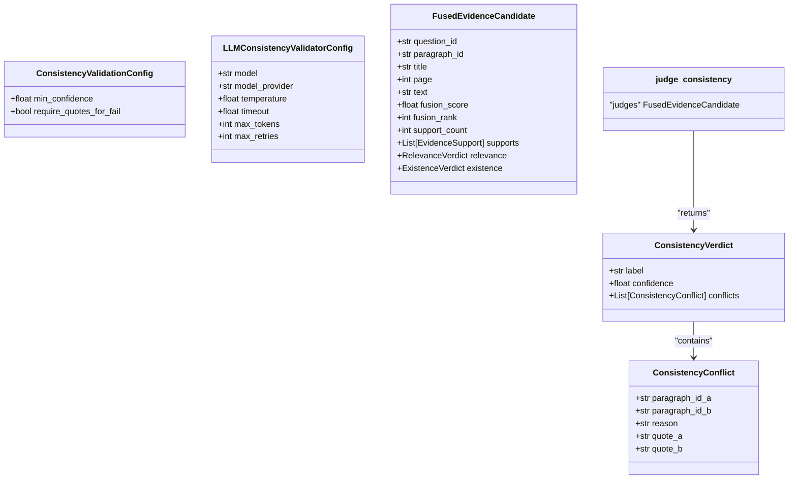
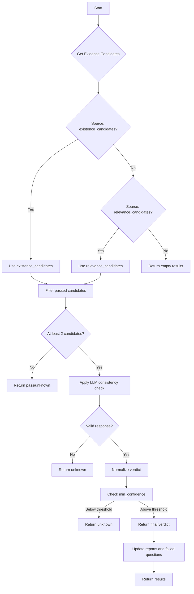
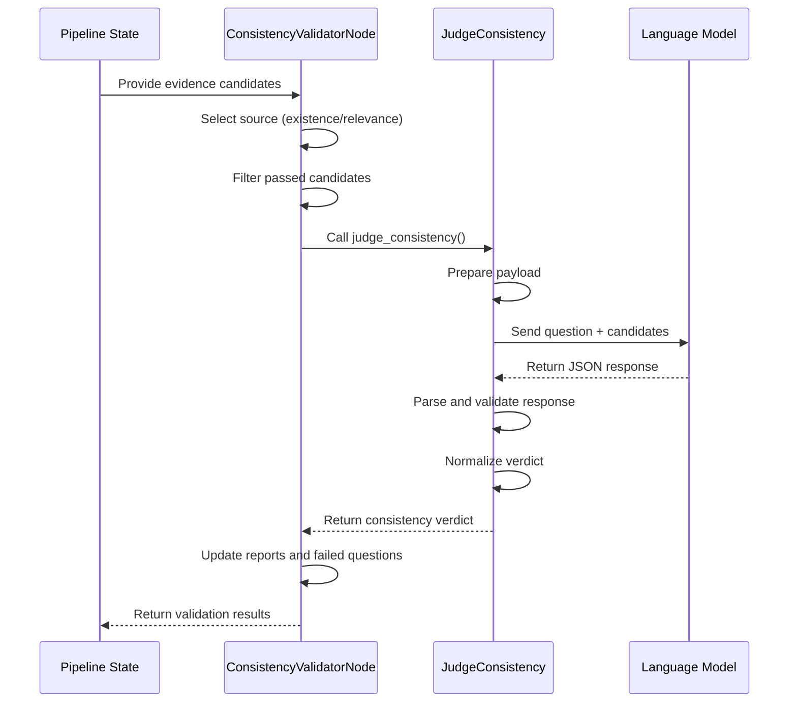
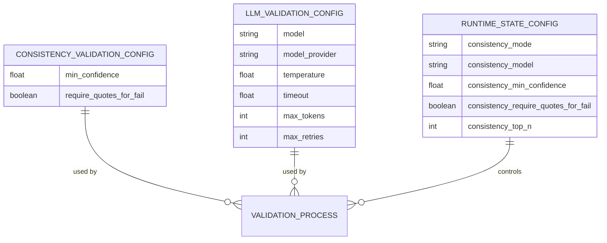
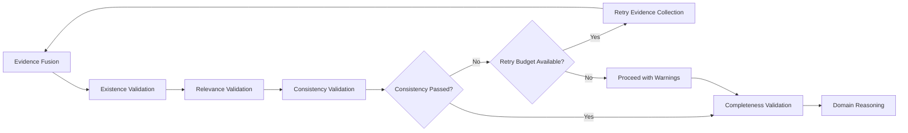

# Consistency Validation

<cite>
**Referenced Files in This Document**   
- [consistency.py](file://src/evidence/validators/consistency.py)
- [consistency.py](file://src/pipelines/graphs/nodes/validators/consistency.py)
- [evidence.py](file://src/schemas/internal/evidence.py)
- [selectors.py](file://src/evidence/validators/selectors.py)
- [rob2_graph.py](file://src/pipelines/graphs/rob2_graph.py)
- [test_validation_routing.py](file://tests/unit/test_validation_routing.py)
</cite>

## Table of Contents
1. [Introduction](#introduction)
2. [Core Components](#core-components)
3. [Consistency Validation Pipeline](#consistency-validation-pipeline)
4. [LLM-Based Contradiction Detection](#llm-based-contradiction-detection)
5. [Configuration Options](#configuration-options)
6. [Handling Apparent Inconsistencies](#handling-apparent-inconsistencies)
7. [Performance Considerations](#performance-considerations)
8. [Integration with System Workflow](#integration-with-system-workflow)

## Introduction
The consistency validation sub-component ensures logical coherence among multiple evidence candidates for the same ROB2 signaling question. This validation prevents contradictory assertions from being accepted as valid evidence, maintaining the integrity of the risk of bias assessment. The system employs LLM-based semantic analysis to detect contradictions, with configurable thresholds and fallback behaviors.

**Section sources**
- [consistency.py](file://src/evidence/validators/consistency.py#L1-L266)

## Core Components
The consistency validation system comprises two main components: the core validation logic and the pipeline integration node. The `judge_consistency` function serves as the primary interface for evaluating evidence consistency, while the `consistency_validator_node` integrates this functionality into the broader processing graph.

The validation process examines multiple evidence candidates for the same question, checking for logical contradictions in their assertions. It leverages LLMs to perform semantic similarity analysis and contradiction detection, returning structured results that identify conflicting evidence pairs and their specific discrepancies.

**Diagram sources**
- [consistency.py](file://src/evidence/validators/consistency.py#L50-L65)
- [evidence.py](file://src/schemas/internal/evidence.py#L93-L112)

**Section sources**
- [consistency.py](file://src/evidence/validators/consistency.py#L1-L266)
- [evidence.py](file://src/schemas/internal/evidence.py#L93-L112)

## Consistency Validation Pipeline
The consistency validation process follows a structured pipeline that integrates with the overall evidence processing workflow. The `consistency_validator_node` function orchestrates this process, retrieving evidence candidates and applying consistency checks according to configurable parameters.

The pipeline first determines the source of evidence candidates, prioritizing existence validation results and falling back to relevance validation results if necessary. It then filters candidates based on previous validation outcomes, selecting only those that passed existence and relevance checks with sufficient confidence.

For each question, the system processes the top N candidates (configurable via `consistency_top_n`) through the consistency evaluation. The results are aggregated into consistency reports, with failed questions tracked separately for potential reprocessing.

**Diagram sources**
- [consistency.py](file://src/pipelines/graphs/nodes/validators/consistency.py#L17-L159)

**Section sources**
- [consistency.py](file://src/pipelines/graphs/nodes/validators/consistency.py#L17-L159)

## LLM-Based Contradiction Detection
The core of the consistency validation system is the LLM-based contradiction detection mechanism. The `judge_consistency` function orchestrates this process, preparing evidence candidates for analysis and interpreting the LLM's response.

The system constructs a structured payload containing the question text and relevant information from each candidate evidence paragraph, including paragraph ID, title, page number, text content, and supporting quotes from relevance validation. This payload is sent to the LLM with a specific system prompt that instructs the model to check for contradictions and return results in a predefined JSON format.

The LLM is expected to return a response with three key elements: a label (pass, fail, or unknown), a confidence score between 0 and 1, and a list of identified conflicts. Each conflict includes the IDs of the conflicting paragraphs, a reason for the contradiction, and exact quote excerpts from each paragraph that demonstrate the inconsistency.

The system includes robust error handling and response parsing, with mechanisms to extract JSON from code blocks or raw text responses. The `_normalize_verdict` function validates and normalizes the LLM's output, ensuring that quotes are actually present in the referenced paragraphs and applying configuration-based validation rules.

**Diagram sources**
- [consistency.py](file://src/evidence/validators/consistency.py#L69-L266)
- [consistency.py](file://src/pipelines/graphs/nodes/validators/consistency.py#L17-L159)

**Section sources**
- [consistency.py](file://src/evidence/validators/consistency.py#L69-L266)

## Configuration Options
The consistency validation system provides several configurable parameters that control its behavior and sensitivity. These options are exposed through both dataclass configurations and runtime state variables, allowing for flexible adjustment based on use case requirements.

The `ConsistencyValidationConfig` class defines two primary configuration options: `min_confidence` and `require_quotes_for_fail`. The minimum confidence threshold (default: 0.6) determines how certain the LLM must be about a contradiction for it to be considered valid. This threshold helps prevent false positives from low-confidence assessments.

The `require_quotes_for_fail` option (default: True) enforces that any reported contradiction must include exact quote excerpts from both conflicting paragraphs. This ensures that contradictions are grounded in specific textual evidence rather than general assertions.

Additional configuration options are available for the LLM itself through `LLMConsistencyValidatorConfig`, including model selection, provider specification, temperature, timeout, maximum tokens, and retry attempts. These parameters allow fine-tuning of the LLM's behavior during consistency evaluation.

Runtime configuration is managed through state variables in the processing pipeline, including `consistency_mode` (none or llm), `consistency_model`, `consistency_min_confidence`, and `consistency_require_quotes_for_fail`, enabling dynamic adjustment of validation behavior without code changes.

**Diagram sources**
- [consistency.py](file://src/evidence/validators/consistency.py#L50-L65)
- [consistency.py](file://src/pipelines/graphs/nodes/validators/consistency.py#L41-L58)

**Section sources**
- [consistency.py](file://src/evidence/validators/consistency.py#L50-L65)
- [consistency.py](file://src/pipelines/graphs/nodes/validators/consistency.py#L41-L58)

## Handling Apparent Inconsistencies
The system addresses apparent inconsistencies that may arise from temporal progression in trial reporting through its evidence selection and validation methodology. By filtering evidence candidates based on prior validation results and focusing on the most relevant and existent evidence, the system reduces the likelihood of contradictory temporal assertions being evaluated together.

The validation process considers the context of trial reporting, where statements about trial design (prospective) and trial results (retrospective) may appear contradictory but are actually consistent within their temporal context. The LLM prompt is designed to recognize such temporal distinctions when evaluating evidence consistency.

When contradictions are identified, the system provides specific quote excerpts from each conflicting paragraph, enabling manual review and resolution. This transparency allows users to distinguish between genuine contradictions and contextually appropriate temporal statements.

The system also supports partial agreements through its confidence scoring mechanism. Rather than binary pass/fail assessments, the consistency validation returns a confidence score that reflects the degree of certainty in the assessment. This allows downstream processes to handle borderline cases appropriately, potentially triggering additional validation or manual review.

**Section sources**
- [consistency.py](file://src/evidence/validators/consistency.py#L199-L256)
- [selectors.py](file://src/evidence/validators/selectors.py#L10-L30)

## Performance Considerations
The consistency validation system incorporates several performance optimizations to handle large sets of evidence efficiently. The most significant optimization is the limitation of comparisons to the top N candidates (configurable via `consistency_top_n`), which prevents combinatorial explosion when many evidence candidates exist for a single question.

The system implements early termination through its validation logic, returning immediately when insufficient candidates are available for comparison or when the LLM service is unavailable. This prevents unnecessary processing when a definitive consistency assessment cannot be made.

For large evidence sets, the system processes questions sequentially but could be extended to parallelize validation across different questions. The current implementation prioritizes accuracy over speed, consistent with the project's "correctness first" design principle.

The LLM invocation includes configurable timeout and retry parameters, allowing the system to balance between thoroughness and responsiveness. When the LLM is unavailable or fails to respond, the system gracefully degrades to an "unknown" status rather than blocking the entire processing pipeline.

**Section sources**
- [consistency.py](file://src/evidence/validators/consistency.py#L82-L87)
- [consistency.py](file://src/pipelines/graphs/nodes/validators/consistency.py#L41-L43)

## Integration with System Workflow
The consistency validation component is tightly integrated into the overall ROB2 assessment workflow, forming a critical part of the evidence validation layer. It operates after existence and relevance validation, ensuring that only evidence that passes these preliminary checks is subjected to consistency analysis.

The validation results influence subsequent processing through the `validation_should_retry` routing function, which determines whether the system should proceed to domain reasoning or retry evidence collection. When `validation_fail_on_consistency` is enabled, consistency failures trigger a retry of the evidence collection and validation process, potentially with adjusted parameters.

The system maintains detailed records of consistency validation attempts and outcomes in the pipeline state, including the validation mode used, configuration parameters, and specific questions that failed consistency checks. This information supports debugging, auditing, and iterative improvement of the validation process.

**Diagram sources**
- [rob2_graph.py](file://src/pipelines/graphs/rob2_graph.py#L322-L324)
- [test_validation_routing.py](file://tests/unit/test_validation_routing.py#L51-L63)

**Section sources**
- [rob2_graph.py](file://src/pipelines/graphs/rob2_graph.py#L216-L355)
- [test_validation_routing.py](file://tests/unit/test_validation_routing.py#L51-L78)