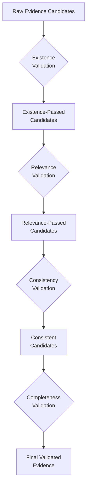
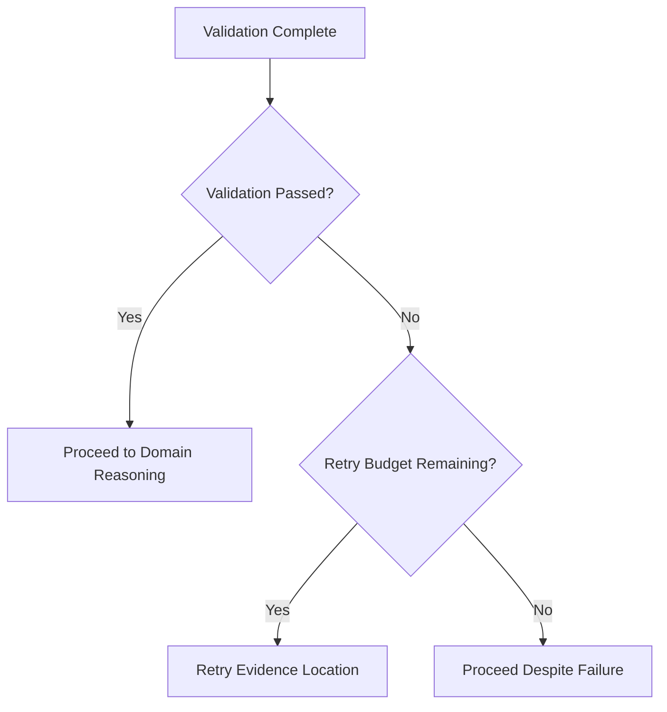
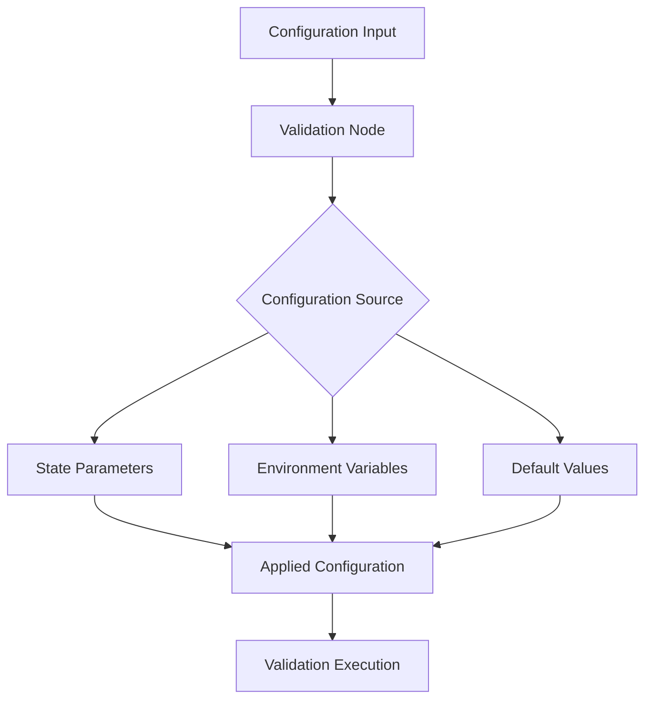
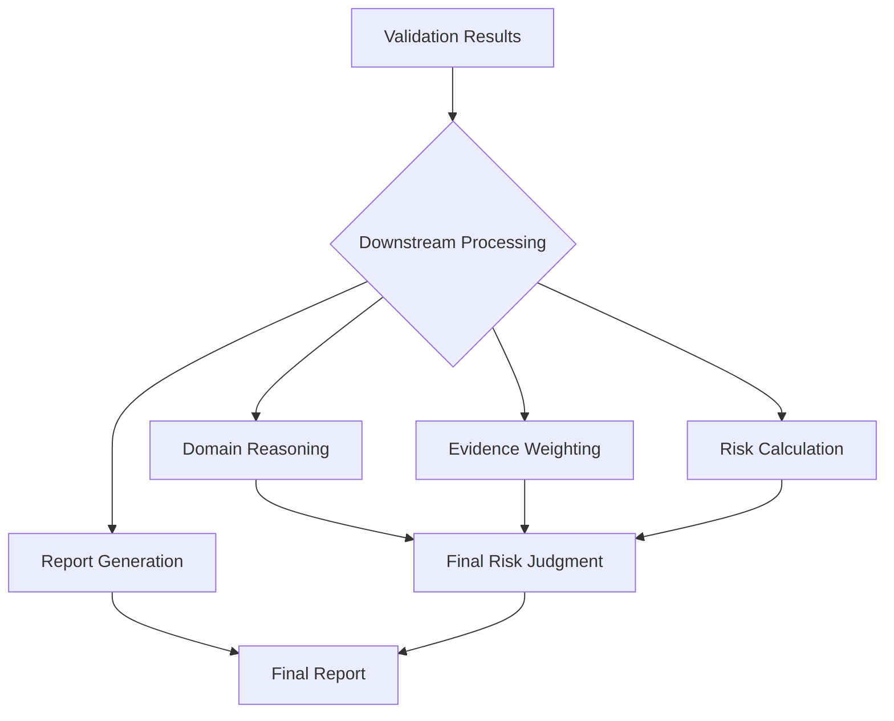

# Evidence Validation

<cite>
**Referenced Files in This Document**   
- [existence.py](file://src/evidence/validators/existence.py)
- [relevance.py](file://src/evidence/validators/relevance.py)
- [consistency.py](file://src/evidence/validators/consistency.py)
- [completeness.py](file://src/evidence/validators/completeness.py)
- [existence.py](file://src/pipelines/graphs/nodes/validators/existence.py)
- [relevance.py](file://src/pipelines/graphs/nodes/validators/relevance.py)
- [consistency.py](file://src/pipelines/graphs/nodes/validators/consistency.py)
- [completeness.py](file://src/pipelines/graphs/nodes/validators/completeness.py)
- [evidence.py](file://src/schemas/internal/evidence.py)
- [routing.py](file://src/pipelines/graphs/routing.py)
- [check_validation.py](file://scripts/check_validation.py)
- [test_validation_routing.py](file://tests/unit/test_validation_routing.py)
</cite>

## Table of Contents
1. [Introduction](#introduction)
2. [Validation Types](#validation-types)
3. [Validation Workflow](#validation-workflow)
4. [Configuration Options](#configuration-options)
5. [Validation Reports](#validation-reports)
6. [Downstream Decision Influence](#downstream-decision-influence)
7. [Performance Considerations](#performance-considerations)
8. [Troubleshooting Guide](#troubleshooting-guide)

## Introduction
The evidence validation pipeline ensures evidence quality before domain reasoning through a multi-stage validation process. This document explains the four validation types (existence, relevance, consistency, and completeness), the validation workflow with retry mechanisms, configuration options, validation reports, and how validation results influence downstream decisions.

## Validation Types

### Existence Validation
Existence validation verifies that candidate paragraph references are grounded in the parsed document structure. It checks three key aspects:
- Whether the paragraph_id exists in the document structure
- Whether the candidate text matches the source span (or is a substring)
- Whether the supporting_quote (when provided) is present in the source paragraph text

The validator is deterministic and does not require external services. Configuration options include:
- `require_text_match`: Whether to require exact text matching between candidate and source
- `require_quote_in_source`: Whether to require the supporting quote to exist in the source paragraph

**Section sources**
- [existence.py](file://src/evidence/validators/existence.py#L1-L106)

### Relevance Validation
Relevance validation uses LLM-based judgment to determine if a paragraph contains direct evidence to answer a ROB2 signaling question. The validator returns a structured response with:
- `label`: One of "relevant", "irrelevant", or "unknown"
- `confidence`: A confidence score between 0 and 1
- `supporting_quote`: An exact substring from the paragraph that supports the relevance judgment

The validation process involves sending a structured payload to an LLM with a system prompt that instructs the model to return only valid JSON. The validator handles various error conditions gracefully, returning "unknown" when the LLM fails to provide a valid response.

**Section sources**
- [relevance.py](file://src/evidence/validators/relevance.py#L1-L232)

### Consistency Validation
Consistency validation checks whether multiple candidate paragraphs for the same question contradict each other. This LLM-based validator:
- Processes multiple candidate paragraphs for the same question
- Identifies conflicts between paragraphs with contradictory information
- Returns a verdict with confidence and detailed conflict information

The validator requires at least two candidates to perform consistency checking. For each identified conflict, it provides:
- The paragraph IDs involved in the conflict
- The reason for the conflict
- Exact quote substrings from both paragraphs that demonstrate the contradiction

**Section sources**
- [consistency.py](file://src/evidence/validators/consistency.py#L1-L266)

### Completeness Validation
Completeness validation ensures that sufficient evidence has been gathered for required questions. It evaluates:
- Whether all required questions have validated evidence
- Whether the minimum number of passed candidates per question has been met
- The overall completeness status of the evidence collection

The validator can operate in two modes:
- **Enforced mode**: Completeness fails when required questions have no validated evidence
- **Relaxed mode**: Completeness passes by default unless explicitly configured otherwise

Configuration allows specifying required question IDs and minimum passed candidates per question.

**Section sources**
- [completeness.py](file://src/evidence/validators/completeness.py#L1-L63)

## Validation Workflow

### Multi-Stage Validation Process
The validation pipeline follows a sequential workflow that ensures evidence quality before domain reasoning:



**Diagram sources**
- [existence.py](file://src/evidence/validators/existence.py#L1-L106)
- [relevance.py](file://src/evidence/validators/relevance.py#L1-L232)
- [consistency.py](file://src/evidence/validators/consistency.py#L1-L266)
- [completeness.py](file://src/evidence/validators/completeness.py#L1-L63)

### Retry Mechanism
The validation pipeline includes a retry mechanism to handle validation failures. When validation fails, the system can automatically rollback to the evidence location layer and attempt to gather additional evidence.

The routing decision is determined by the `validation_should_retry` function, which evaluates:
- Current validation attempt number
- Maximum allowed retries
- Completeness status
- Consistency failure status
- Whether consistency failures should trigger retries



**Diagram sources**
- [routing.py](file://src/pipelines/graphs/routing.py#L28-L43)
- [test_validation_routing.py](file://tests/unit/test_validation_routing.py#L6-L79)

**Section sources**
- [routing.py](file://src/pipelines/graphs/routing.py#L28-L43)

## Configuration Options

### Validation Thresholds
Each validation type supports configurable thresholds and requirements:

#### Relevance Validation Configuration
- `min_confidence`: Minimum confidence threshold (0.0-1.0) for relevance judgments
- `require_supporting_quote`: Whether a supporting quote is required for "relevant" label
- `temperature`: LLM temperature parameter for relevance judgment
- `timeout`: Timeout for LLM requests
- `max_tokens`: Maximum tokens for LLM responses
- `max_retries`: Maximum retries for LLM requests

#### Consistency Validation Configuration
- `min_confidence`: Minimum confidence threshold for consistency judgments
- `require_quotes_for_fail`: Whether quotes are required when marking consistency as "fail"

#### Completeness Validation Configuration
- `enforce`: Whether to enforce completeness requirements
- `required_question_ids`: Specific question IDs that must have validated evidence
- `min_passed_per_question`: Minimum number of passed candidates required per question

### Node-Level Configuration
Validation nodes in the pipeline accept configuration through the state dictionary, allowing dynamic configuration based on runtime conditions:



**Diagram sources**
- [relevance.py](file://src/pipelines/graphs/nodes/validators/relevance.py#L1-L207)
- [consistency.py](file://src/pipelines/graphs/nodes/validators/consistency.py#L1-L159)
- [completeness.py](file://src/pipelines/graphs/nodes/validators/completeness.py#L1-L140)

**Section sources**
- [relevance.py](file://src/pipelines/graphs/nodes/validators/relevance.py#L1-L207)
- [consistency.py](file://src/pipelines/graphs/nodes/validators/consistency.py#L1-L159)
- [completeness.py](file://src/pipelines/graphs/nodes/validators/completeness.py#L1-L140)

## Validation Reports

### Report Structure
Validation reports provide detailed information about the validation process and results. Each validation type produces specific report components:

#### Existence Validation Report
- Total candidates processed
- Number of candidates that passed existence checks
- Number of candidates that failed existence checks
- Detailed failure reasons for each failed candidate

#### Relevance Validation Report
- Number of candidates validated
- Number of candidates skipped (not validated)
- Number of candidates that passed relevance checks
- Whether fallback selection was used to fill top-k results
- Individual relevance judgments with confidence scores

#### Consistency Validation Report
- Consistency verdict (pass, fail, unknown)
- Confidence in the consistency judgment
- Detailed conflict information including:
  - Conflicting paragraph IDs
  - Reason for the conflict
  - Supporting quotes from both paragraphs

#### Completeness Validation Report
- Overall completeness status (passed/failed)
- List of failed questions (if any)
- Detailed completeness items for each question showing:
  - Question ID
  - Whether the question was required
  - Number of passed candidates
  - Status (satisfied/missing)

### Example Validation Report
An example validation report might look like:

```json
{
  "completeness_passed": true,
  "completeness_failed_questions": [],
  "completeness_report": [
    {
      "question_id": "q1_1",
      "required": true,
      "passed_count": 3,
      "status": "satisfied"
    },
    {
      "question_id": "q1_2",
      "required": true,
      "passed_count": 1,
      "status": "satisfied"
    }
  ],
  "existence_debug": {
    "q1_1": {
      "total": 5,
      "passed": 4,
      "failed": 1
    }
  },
  "relevance_debug": {
    "q1_1": {
      "validated": 5,
      "skipped": 0,
      "passed": 3,
      "fallback_used": false
    }
  },
  "consistency_reports": {
    "q1_1": {
      "label": "pass",
      "confidence": 0.95,
      "conflicts": []
    }
  }
}
```

**Section sources**
- [check_validation.py](file://scripts/check_validation.py#L1-L272)

## Downstream Decision Influence

### Evidence Quality Gates
Validation results serve as quality gates that determine whether evidence can proceed to domain reasoning. The completeness validation result is particularly important as it determines whether sufficient evidence has been gathered.

When completeness validation fails, the system may:
- Trigger additional evidence retrieval attempts
- Proceed with limited evidence if retry budget is exhausted
- Flag the assessment as potentially incomplete

### Consistency-Based Decision Making
Consistency validation results influence how conflicting evidence is handled in domain reasoning. When consistency validation identifies conflicts:
- Domain reasoning may weigh evidence differently
- Additional scrutiny may be applied to conflicting claims
- The final risk judgment may reflect the uncertainty introduced by conflicting evidence

### Confidence Propagation
Validation confidence scores are propagated to downstream components, allowing domain reasoning to account for evidence quality. Higher confidence evidence may:
- Receive greater weight in risk calculations
- Require less additional verification
- Be presented with higher certainty in final reports



**Diagram sources**
- [evidence.py](file://src/schemas/internal/evidence.py#L71-L170)

## Performance Considerations

### LLM-Based Validation Optimization
Relevance and consistency validations use LLMs, which can be performance bottlenecks. The system optimizes performance through:

- **Top-N filtering**: Only the top-N candidates are validated with LLMs, while others receive default "unknown" relevance
- **Caching**: Validation results can be cached to avoid redundant LLM calls
- **Parallel processing**: Multiple candidates can be validated in parallel when possible
- **Fallback mechanisms**: When LLMs are unavailable, the system gracefully degrades to deterministic validation only

### Resource Management
The validation pipeline manages resources through configurable parameters:

- `top_k`: Limits the number of candidates passed to downstream components
- `top_n`: Controls how many candidates are validated with LLMs
- `max_retries`: Limits retry attempts to prevent infinite loops
- `timeout`: Prevents LLM calls from hanging indefinitely

### Scalability Strategies
For large-scale processing, the following strategies improve validation performance:

- **Batch processing**: Multiple documents can be processed in parallel
- **Asynchronous validation**: Non-critical validations can be performed asynchronously
- **Selective validation**: Validation intensity can be adjusted based on document importance
- **Model optimization**: Using smaller, faster models for preliminary validation

**Section sources**
- [relevance.py](file://src/evidence/validators/relevance.py#L1-L232)
- [consistency.py](file://src/evidence/validators/consistency.py#L1-L266)

## Troubleshooting Guide

### Common Validation Issues

#### LLM Connection Problems
When LLM-based validation fails due to connection issues:
- Verify that the LLM model ID and provider are correctly configured
- Check network connectivity to the LLM service
- Ensure API credentials are valid and have sufficient quota
- Verify timeout and retry settings are appropriate

#### Text Matching Failures
Existence validation may fail when text matching is too strict:
- Check if document parsing introduced formatting differences
- Verify that text normalization is working correctly
- Consider adjusting the `require_text_match` configuration
- Check for encoding or whitespace differences between sources

#### Inconsistent Relevance Judgments
Variability in LLM-based relevance judgments can occur due to:
- LLM temperature settings being too high
- Insufficient context provided to the LLM
- Ambiguous question formulations
- Overly strict confidence thresholds

#### Completeness Validation Failures
When completeness validation fails despite apparent evidence:
- Verify that required question IDs are correctly specified
- Check that the minimum passed candidates threshold is appropriate
- Ensure that evidence has passed all preceding validation stages
- Confirm that the completeness enforcement setting matches requirements

### Debugging Validation
The validation pipeline includes extensive debug information to aid troubleshooting:

- Each validation node outputs debug statistics
- Configuration settings are recorded in the output
- Attempt and retry counts are tracked
- Error messages provide specific guidance for resolution

Use the `check_validation.py` script to test the complete validation pipeline and inspect intermediate results.

**Section sources**
- [check_validation.py](file://scripts/check_validation.py#L1-L272)
- [test_validation_routing.py](file://tests/unit/test_validation_routing.py#L6-L79)