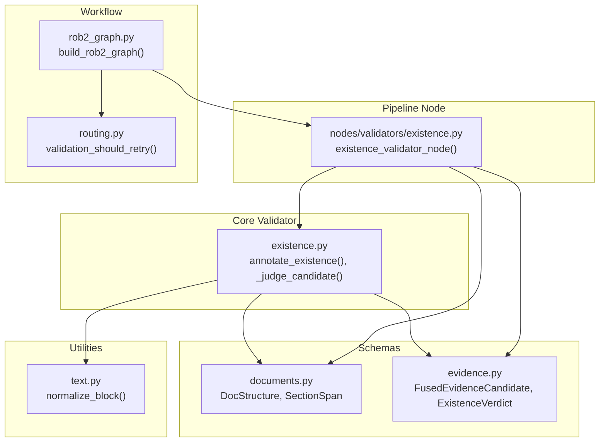
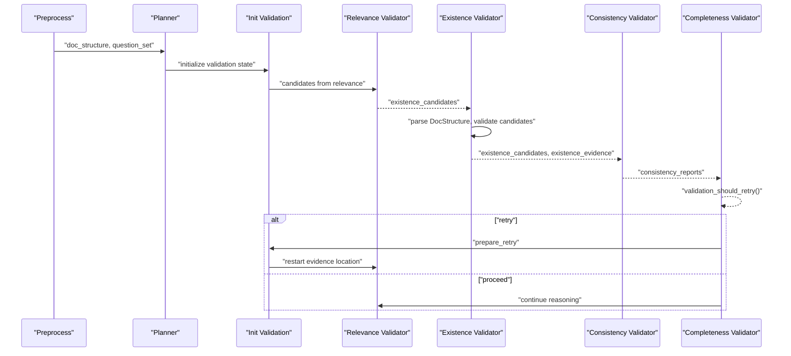
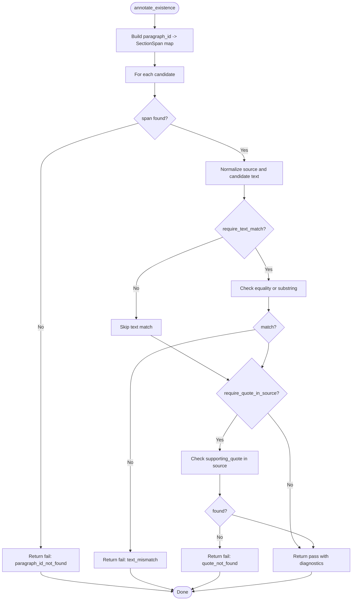
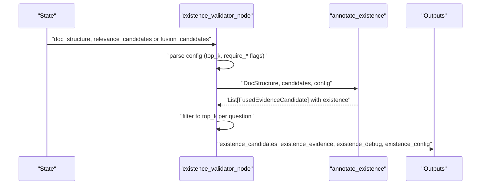
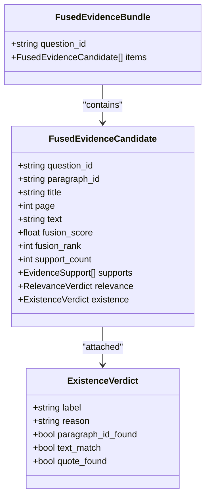
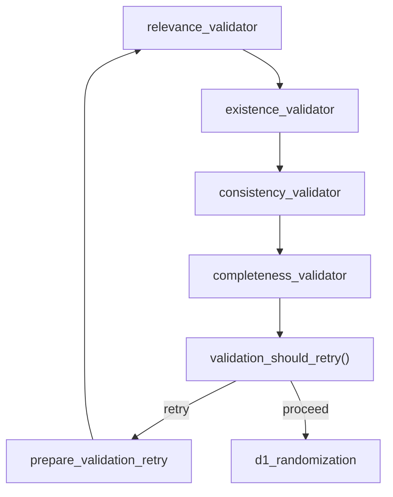
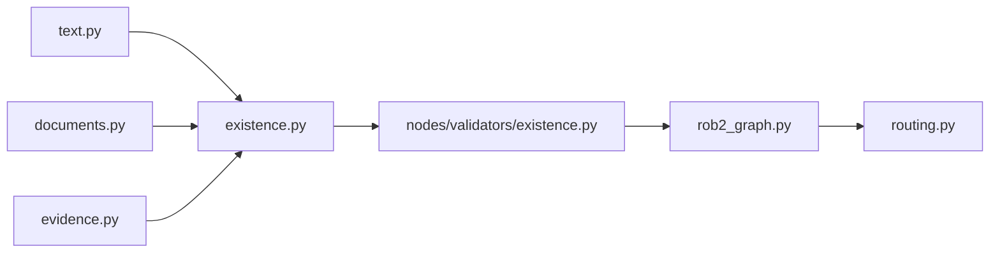

# Existence Validation

<cite>
**Referenced Files in This Document**
- [existence.py](file://src/evidence/validators/existence.py)
- [existence_node.py](file://src/pipelines/graphs/nodes/validators/existence.py)
- [evidence_schema.py](file://src/schemas/internal/evidence.py)
- [documents_schema.py](file://src/schemas/internal/documents.py)
- [text_utils.py](file://src/utils/text.py)
- [rob2_graph.py](file://src/pipelines/graphs/rob2_graph.py)
- [routing.py](file://src/pipelines/graphs/routing.py)
- [test_existence_validator.py](file://tests/unit/test_existence_validator.py)
- [check_validation.py](file://scripts/check_validation.py)
</cite>

## Table of Contents
1. [Introduction](#introduction)
2. [Project Structure](#project-structure)
3. [Core Components](#core-components)
4. [Architecture Overview](#architecture-overview)
5. [Detailed Component Analysis](#detailed-component-analysis)
6. [Dependency Analysis](#dependency-analysis)
7. [Performance Considerations](#performance-considerations)
8. [Troubleshooting Guide](#troubleshooting-guide)
9. [Conclusion](#conclusion)
10. [Appendices](#appendices)

## Introduction
This document explains the existence validation sub-component that ensures cited evidence actually exists in the parsed document. It covers how the system validates:
- Paragraph existence via paragraph_id
- Text span matching between candidate and source paragraph
- Context verification via supporting_quote presence in source text

It also documents the interface between the pipeline node and the core validator, the domain model for validation results, configuration options, invocation within the LangGraph workflow, usage patterns, failure modes, and performance considerations.

## Project Structure
The existence validation lives in a small, focused module with clear separation of concerns:
- Core validator: deterministic logic for paragraph existence, text matching, and quote verification
- Pipeline node: orchestrates input parsing, configuration, and produces structured outputs for downstream validators and completeness checks
- Schemas: typed contracts for document structure, evidence candidates, and validation results
- Utilities: text normalization used during matching
- Workflow integration: LangGraph graph wiring and retry routing

**Diagram sources**
- [existence.py](file://src/evidence/validators/existence.py#L1-L106)
- [existence_node.py](file://src/pipelines/graphs/nodes/validators/existence.py#L1-L107)
- [evidence_schema.py](file://src/schemas/internal/evidence.py#L1-L171)
- [documents_schema.py](file://src/schemas/internal/documents.py#L1-L44)
- [text_utils.py](file://src/utils/text.py#L1-L15)
- [rob2_graph.py](file://src/pipelines/graphs/rob2_graph.py#L288-L423)
- [routing.py](file://src/pipelines/graphs/routing.py#L28-L36)

**Section sources**
- [existence.py](file://src/evidence/validators/existence.py#L1-L106)
- [existence_node.py](file://src/pipelines/graphs/nodes/validators/existence.py#L1-L107)
- [evidence_schema.py](file://src/schemas/internal/evidence.py#L1-L171)
- [documents_schema.py](file://src/schemas/internal/documents.py#L1-L44)
- [text_utils.py](file://src/utils/text.py#L1-L15)
- [rob2_graph.py](file://src/pipelines/graphs/rob2_graph.py#L288-L423)
- [routing.py](file://src/pipelines/graphs/routing.py#L28-L36)

## Core Components
- ExistenceValidatorConfig: controls whether text matching and quote verification are required
- annotate_existence: applies the validator to a batch of candidates
- _judge_candidate: performs paragraph existence check, text span matching, and quote verification
- existence_validator_node: LangGraph node that parses inputs, applies configuration, and emits results
- ExistenceVerdict: typed result model with pass/fail labels and diagnostic fields
- DocStructure and SectionSpan: normalized document structure keyed by paragraph_id

Key behaviors:
- Paragraph existence: fails fast if paragraph_id is missing
- Text matching: uses normalized text to allow flexible whitespace differences
- Quote verification: optional requirement that supporting_quote appears in source paragraph text

**Section sources**
- [existence.py](file://src/evidence/validators/existence.py#L20-L106)
- [existence_node.py](file://src/pipelines/graphs/nodes/validators/existence.py#L13-L83)
- [evidence_schema.py](file://src/schemas/internal/evidence.py#L81-L91)
- [documents_schema.py](file://src/schemas/internal/documents.py#L20-L41)

## Architecture Overview
The existence validator participates in the LangGraph ROB2 workflow as a deterministic step after relevance validation and before consistency. It reads candidates from either relevance or fusion outputs, validates them against the parsed document structure, and writes results into the state for downstream steps.

**Diagram sources**
- [rob2_graph.py](file://src/pipelines/graphs/rob2_graph.py#L380-L423)
- [routing.py](file://src/pipelines/graphs/routing.py#L28-L36)
- [existence_node.py](file://src/pipelines/graphs/nodes/validators/existence.py#L13-L83)

## Detailed Component Analysis

### Core Validator: annotate_existence and _judge_candidate
The core validator operates on a list of fused evidence candidates and a document structure. It:
- Builds a paragraph_id-to-section-span index for O(1) lookup
- For each candidate:
  - Checks paragraph_id existence
  - Normalizes text and checks equality/substring containment
  - Optionally verifies supporting_quote presence in source text
  - Emits an ExistenceVerdict attached to the candidate

**Diagram sources**
- [existence.py](file://src/evidence/validators/existence.py#L26-L103)
- [text_utils.py](file://src/utils/text.py#L6-L12)

**Section sources**
- [existence.py](file://src/evidence/validators/existence.py#L26-L103)
- [text_utils.py](file://src/utils/text.py#L6-L12)

### Pipeline Node: existence_validator_node
The pipeline node:
- Validates and parses doc_structure and candidates
- Reads configuration from state (existence_top_k, existence_require_text_match, existence_require_quote_in_source)
- Orders question IDs deterministically
- Applies the core validator and prunes to top_k per question
- Emits:
  - existence_candidates: per-question annotated candidates
  - existence_evidence: per-question bundles of validated candidates
  - existence_debug: counts of total/passed/failed
  - existence_config: source and configuration used

**Diagram sources**
- [existence_node.py](file://src/pipelines/graphs/nodes/validators/existence.py#L13-L83)
- [existence.py](file://src/evidence/validators/existence.py#L26-L42)

**Section sources**
- [existence_node.py](file://src/pipelines/graphs/nodes/validators/existence.py#L13-L83)

### Domain Model: ExistenceVerdict and Candidate Types
The validator attaches a typed ExistenceVerdict to each candidate. The schema defines:
- label: pass or fail
- reason: optional reason string for failure modes
- paragraph_id_found: whether the paragraph_id was found
- text_match: whether text matched (optional, only when normalization yields non-empty strings)
- quote_found: whether supporting_quote was found (optional)

Evidence models include:
- FusedEvidenceCandidate: carries paragraph_id, text, and optional relevance supporting_quote
- FusedEvidenceBundle: top-k items per question for downstream use

**Diagram sources**
- [evidence_schema.py](file://src/schemas/internal/evidence.py#L81-L170)

**Section sources**
- [evidence_schema.py](file://src/schemas/internal/evidence.py#L81-L170)

### Invocation Within LangGraph Workflow
The existence validator is wired into the ROB2 graph as a deterministic node:
- It receives candidates from the previous relevance validator
- It writes outputs into state keys for downstream consumers
- The graph’s routing decides whether to retry or proceed based on completeness and consistency outcomes

**Diagram sources**
- [rob2_graph.py](file://src/pipelines/graphs/rob2_graph.py#L380-L423)
- [routing.py](file://src/pipelines/graphs/routing.py#L28-L36)

**Section sources**
- [rob2_graph.py](file://src/pipelines/graphs/rob2_graph.py#L380-L423)
- [routing.py](file://src/pipelines/graphs/routing.py#L28-L36)

## Dependency Analysis
- Core validator depends on:
  - Document structure schema for paragraph lookup
  - Evidence schema for candidate and verdict models
  - Text normalization utility for robust matching
- Pipeline node depends on:
  - Core validator
  - Document structure schema
  - Evidence schema
  - State configuration keys for flags and top_k
- Workflow depends on:
  - Graph wiring and routing logic for retries

**Diagram sources**
- [existence.py](file://src/evidence/validators/existence.py#L1-L106)
- [existence_node.py](file://src/pipelines/graphs/nodes/validators/existence.py#L1-L107)
- [evidence_schema.py](file://src/schemas/internal/evidence.py#L1-L171)
- [documents_schema.py](file://src/schemas/internal/documents.py#L1-L44)
- [text_utils.py](file://src/utils/text.py#L1-L15)
- [rob2_graph.py](file://src/pipelines/graphs/rob2_graph.py#L288-L423)
- [routing.py](file://src/pipelines/graphs/routing.py#L28-L36)

**Section sources**
- [existence.py](file://src/evidence/validators/existence.py#L1-L106)
- [existence_node.py](file://src/pipelines/graphs/nodes/validators/existence.py#L1-L107)
- [rob2_graph.py](file://src/pipelines/graphs/rob2_graph.py#L288-L423)

## Performance Considerations
- Lookup complexity: paragraph_id lookup is O(n) to build the index plus O(1) per candidate lookup; overall O(n + m) for n sections and m candidates
- Text normalization cost: performed per candidate; negligible overhead compared to IO
- Memory: stores per-candidate verdicts; memory footprint proportional to number of candidates
- Recommendations:
  - Keep candidates bounded by top_k to reduce per-question processing
  - Disable strict text matching when dealing with very large documents to minimize substring comparisons
  - Use supporting_quote only when necessary to avoid extra containment checks
  - Consider pre-normalizing source texts if the document structure is reused across validations

[No sources needed since this section provides general guidance]

## Troubleshooting Guide
Common failure modes and solutions:
- paragraph_id_not_found: The candidate’s paragraph_id is missing from the parsed document structure. Verify the locator layer produced valid paragraph_ids aligned with the parsed document.
- text_mismatch: The normalized candidate text does not equal or contain the source text. Check for truncation or whitespace normalization differences; adjust require_text_match if appropriate.
- quote_not_found: The supporting_quote is not present in the source paragraph. Confirm the quote is intact and not truncated; verify the quote extraction from the original text.

Debugging tips:
- Inspect existence_debug to see pass/fail counts per question
- Review existence_config to confirm source and flags used
- Use the CLI script to run the full pipeline and observe validated outputs

**Section sources**
- [existence.py](file://src/evidence/validators/existence.py#L45-L103)
- [existence_node.py](file://src/pipelines/graphs/nodes/validators/existence.py#L52-L83)
- [test_existence_validator.py](file://tests/unit/test_existence_validator.py#L48-L81)

## Conclusion
The existence validation is a deterministic, efficient step that anchors evidence candidates to the parsed document structure. It provides clear pass/fail decisions with diagnostic fields, integrates cleanly into the LangGraph workflow, and offers configurable behavior for strictness. By tuning top_k and flags, teams can balance correctness and throughput when processing large documents.

[No sources needed since this section summarizes without analyzing specific files]

## Appendices

### Configuration Options
- existence_top_k: Number of top validated candidates to keep per question
- existence_require_text_match: Require candidate text to match source paragraph text
- existence_require_quote_in_source: Require supporting_quote to be present in source paragraph text

These are read from the workflow state and passed to the validator.

**Section sources**
- [existence_node.py](file://src/pipelines/graphs/nodes/validators/existence.py#L34-L45)
- [rob2_graph.py](file://src/pipelines/graphs/rob2_graph.py#L109-L111)

### Usage Patterns
- Typical invocation: Run the full pipeline via the CLI script, which wires the existence validator into the graph and prints validated outputs
- Manual invocation: Call the pipeline node directly with a populated state containing doc_structure and candidates

**Section sources**
- [check_validation.py](file://scripts/check_validation.py#L174-L206)
- [existence_node.py](file://src/pipelines/graphs/nodes/validators/existence.py#L13-L83)

### Retry and Relaxation Behavior
The workflow supports retry loops. On subsequent attempts, certain flags may be relaxed automatically (e.g., disabling strict text and quote matching) to improve coverage.

**Section sources**
- [rob2_graph.py](file://src/pipelines/graphs/rob2_graph.py#L248-L286)
- [routing.py](file://src/pipelines/graphs/routing.py#L28-L36)