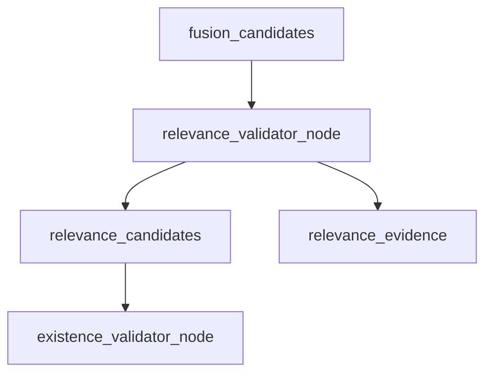
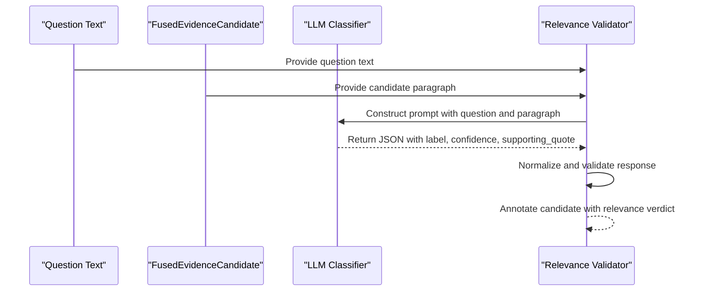
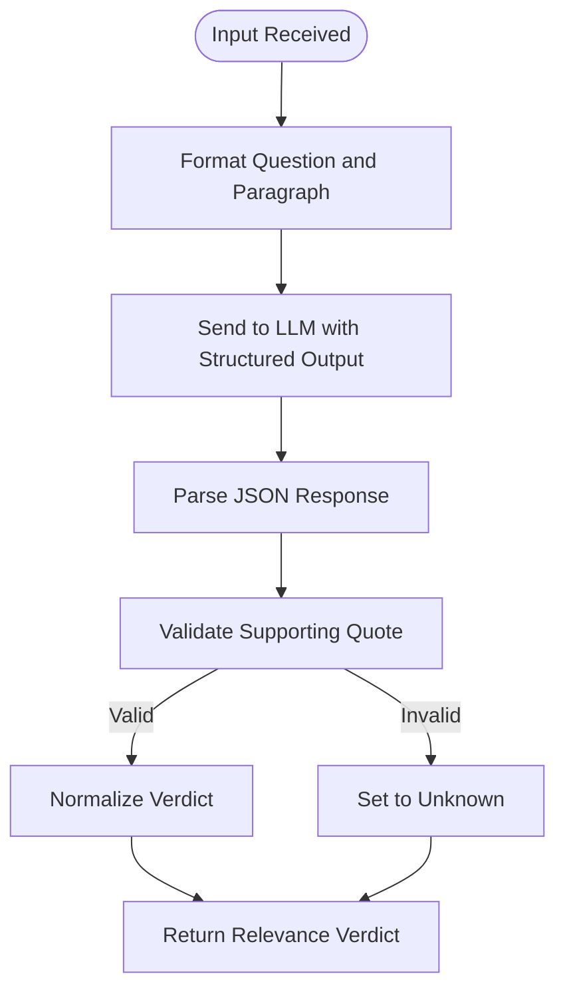
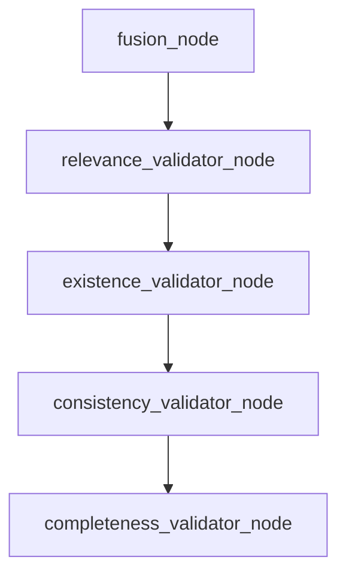
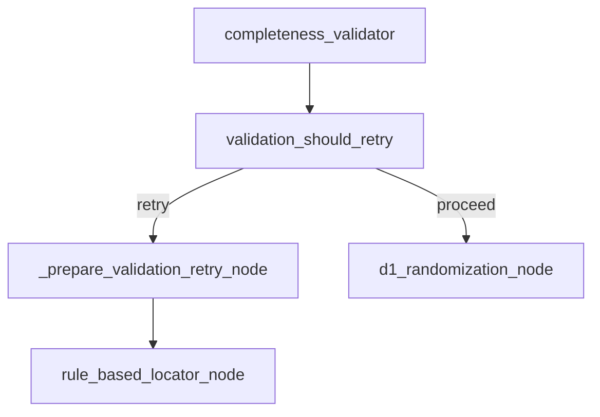

# Relevance Validation

<cite>
**Referenced Files in This Document**   
- [relevance.py](file://src/evidence/validators/relevance.py)
- [relevance.py](file://src/pipelines/graphs/nodes/validators/relevance.py)
- [domain_audit_system.md](file://src/llm/prompts/validators/domain_audit_system.md)
- [evidence.py](file://src/schemas/internal/evidence.py)
- [rob2_graph.py](file://src/pipelines/graphs/rob2_graph.py)
- [routing.py](file://src/pipelines/graphs/routing.py)
- [system-uml.md](file://docs/system-uml.md)
</cite>

## Table of Contents
1. [Introduction](#introduction)
2. [Core Components](#core-components)
3. [Architecture Overview](#architecture-overview)
4. [Detailed Component Analysis](#detailed-component-analysis)
5. [Integration with Validation Pipeline](#integration-with-validation-pipeline)
6. [Configuration Options](#configuration-options)
7. [Common Issues and Troubleshooting](#common-issues-and-troubleshooting)
8. [Performance Considerations](#performance-considerations)
9. [Conclusion](#conclusion)

## Introduction
The relevance validation sub-component is responsible for determining whether retrieved evidence is contextually relevant to the ROB2 signaling questions being assessed. This system uses LLM-based classification with prompt engineering to evaluate evidence candidates, ensuring that only high-quality, directly supportive evidence is used in downstream decision-making processes. The validation process is a critical milestone (Milestone 7) in the overall audit workflow, serving as a quality gate before evidence is used for domain reasoning and risk assessment.

**Section sources**
- [relevance.py](file://src/evidence/validators/relevance.py#L1-L232)
- [relevance.py](file://src/pipelines/graphs/nodes/validators/relevance.py#L1-L207)

## Core Components
The relevance validation system consists of two primary components: the core validation logic and the pipeline integration node. The core logic is implemented in `src/evidence/validators/relevance.py`, which provides the `annotate_relevance` function that evaluates evidence candidates against a question. This function uses an LLM to classify each candidate as "relevant," "irrelevant," or "unknown" based on whether the paragraph contains direct evidence to answer the question.

The pipeline integration is handled by `relevance_validator_node` in `src/pipelines/graphs/nodes/validators/relevance.py`, which orchestrates the validation process within the larger workflow. This node processes fused evidence candidates, applies relevance scoring, and prepares the results for downstream validation steps.

**Section sources**
- [relevance.py](file://src/evidence/validators/relevance.py#L58-L232)
- [relevance.py](file://src/pipelines/graphs/nodes/validators/relevance.py#L24-L207)

## Architecture Overview
The relevance validation system is integrated into the evidence processing pipeline as a sequential step following evidence fusion and preceding existence validation. The architecture follows a modular design where the validation logic is separated from the pipeline orchestration, allowing for flexible configuration and testing.

**Diagram sources**
- [system-uml.md](file://docs/system-uml.md#L57-L59)
- [rob2_graph.py](file://src/pipelines/graphs/rob2_graph.py#L390)

## Detailed Component Analysis

### Relevance Validation Logic
The core relevance validation logic is implemented in the `annotate_relevance` function, which takes a question text and a list of fused evidence candidates as input. For each candidate, the system constructs a prompt containing the question and paragraph information, then uses an LLM to generate a structured response with relevance judgment.

**Diagram sources**
- [relevance.py](file://src/evidence/validators/relevance.py#L58-L232)
- [domain_audit_system.md](file://src/llm/prompts/validators/domain_audit_system.md#L1-L37)

#### Input Formatting and Decision Criteria
The system formats input for the LLM using a strict prompt template that requires the model to return only valid JSON with specific keys: label, confidence, and supporting_quote. The prompt explicitly instructs the LLM to:
- Return "relevant" only if the paragraph contains direct evidence answering the question
- Return "irrelevant" if the paragraph does not contain an explicit statement answering the question
- Return "unknown" if uncertain
- Provide confidence scores between 0 and 1
- Include an exact substring from the paragraph as the supporting quote when relevant

The decision criteria are implemented in the `_judge_relevance` function, which processes the LLM's response and normalizes it into a standardized format. The system extracts JSON from the LLM response, validates it against the expected schema, and ensures the supporting quote is an exact substring of the paragraph text.

**Diagram sources**
- [relevance.py](file://src/evidence/validators/relevance.py#L114-L159)
- [relevance.py](file://src/evidence/validators/relevance.py#L192-L223)

### Relevance Scoring and Downstream Usage
The system generates relevance scores through the LLM-based classification process, where each candidate receives a confidence score between 0 and 1. These scores are used in downstream decisions to filter and rank evidence. The `relevance_validator_node` processes the annotated candidates and selects those that meet the minimum confidence threshold and other criteria.

The node implements a two-stage selection process:
1. First, it filters candidates with "relevant" label and confidence above the minimum threshold
2. Then, it applies a fallback mechanism to fill the top-k bundle if insufficient relevant candidates are found

This approach ensures that downstream components receive a consistent number of evidence items while maintaining quality control.

**Section sources**
- [relevance.py](file://src/pipelines/graphs/nodes/validators/relevance.py#L143-L163)
- [evidence.py](file://src/schemas/internal/evidence.py#L71-L78)

## Integration with Validation Pipeline
The relevance validator is tightly integrated into the validation pipeline, forming a critical link between evidence fusion and subsequent validation steps. It is connected in sequence with other validators, following the flow: fusion → relevance → existence → consistency → completeness.

**Diagram sources**
- [rob2_graph.py](file://src/pipelines/graphs/rob2_graph.py#L390-L393)
- [system-uml.md](file://docs/system-uml.md#L57-L71)

### Retry Mechanisms
When low relevance is detected, the system implements a sophisticated retry mechanism that can automatically adjust retrieval parameters and reprocess evidence. This is managed through the `validation_should_retry` routing function and the `_prepare_validation_retry_node`.

The retry logic evaluates multiple factors:
- Whether completeness validation passed
- Whether consistency validation failed (if enabled)
- The current attempt count versus maximum retries

When a retry is triggered, the system can:
- Disable structure-aware filtering
- Increase the number of candidates retrieved per query
- Increase the top-k bundle size
- Relax validation requirements (when configured)

**Diagram sources**
- [rob2_graph.py](file://src/pipelines/graphs/rob2_graph.py#L395-L400)
- [routing.py](file://src/pipelines/graphs/routing.py#L28-L43)

**Section sources**
- [rob2_graph.py](file://src/pipelines/graphs/rob2_graph.py#L248-L271)
- [routing.py](file://src/pipelines/graphs/routing.py#L28-L43)

## Configuration Options
The relevance validation system provides several configuration options to control its behavior:

### Relevance Thresholds
The system allows configuration of the minimum confidence threshold for considering a candidate relevant. This is controlled by the `relevance_min_confidence` parameter, which defaults to 0.6 but can be adjusted based on the desired precision-recall tradeoff.

### LLM Model Selection
Users can specify the LLM model to use for relevance classification through the `relevance_model` parameter. The system supports different model providers and allows configuration of model-specific parameters such as temperature, timeout, max_tokens, and max_retries.

### Prompt Customization
While the core prompt structure is fixed to ensure consistent output format, the system could be extended to support prompt customization for different domains or question types. The current implementation uses a standardized prompt that emphasizes direct evidence and exact quotes.

**Section sources**
- [relevance.py](file://src/evidence/validators/relevance.py#L39-L47)
- [relevance.py](file://src/pipelines/graphs/nodes/validators/relevance.py#L78-L105)

## Common Issues and Troubleshooting
The relevance validation system may encounter several common issues that require troubleshooting:

### False Negatives Due to Paraphrasing
When evidence is present but phrased differently from the question, the LLM may incorrectly classify it as irrelevant. This can be mitigated by:
- Adjusting the relevance threshold downward
- Using more flexible LLM models
- Implementing preprocessing to normalize text variations

### Domain-Specific Jargon
Specialized terminology may not be properly understood by the LLM, leading to incorrect relevance judgments. Solutions include:
- Fine-tuning the LLM on domain-specific text
- Adding domain-specific examples to the prompt
- Implementing a preprocessing step to expand acronyms and technical terms

### Missing Supporting Quotes
The system requires exact substring matches for supporting quotes. When the LLM generates a quote that doesn't exactly match the source text, the candidate may be downgraded to "unknown." This can be addressed by:
- Relaxing the quote requirement in configuration
- Implementing fuzzy matching for quote validation
- Improving the prompt to emphasize exact copying

**Section sources**
- [relevance.py](file://src/evidence/validators/relevance.py#L215-L217)
- [relevance.py](file://src/evidence/validators/relevance.py#L209-L213)

## Performance Considerations
The relevance validation system has several performance implications that must be considered:

### LLM Latency
Since each evidence candidate requires an LLM call, the validation process can be time-consuming, especially with large numbers of candidates. The system mitigates this by:
- Limiting validation to the top-N candidates per question
- Using efficient LLM initialization and caching
- Supporting parallel processing of candidates

### Caching Strategies
For repeated queries on the same document, the system could implement caching to avoid redundant LLM calls. Potential caching approaches include:
- Caching LLM responses by question and paragraph ID
- Using a database to store validated relevance judgments
- Implementing a time-based cache expiration policy

The current implementation does not include built-in caching but provides the necessary hooks to add caching functionality.

**Section sources**
- [relevance.py](file://src/evidence/validators/relevance.py#L76-L93)
- [relevance.py](file://src/pipelines/graphs/nodes/validators/relevance.py#L117-L127)

## Conclusion
The relevance validation sub-component plays a crucial role in ensuring the quality and reliability of evidence used in the ROB2 audit process. By leveraging LLM-based classification with carefully engineered prompts, the system effectively filters out irrelevant evidence while preserving high-quality, directly supportive content. The integration with the broader validation pipeline, including retry mechanisms and configurable thresholds, provides a robust framework for handling the complexities of evidence assessment in systematic reviews. Future enhancements could include improved handling of paraphrasing, domain-specific model tuning, and built-in caching to optimize performance.