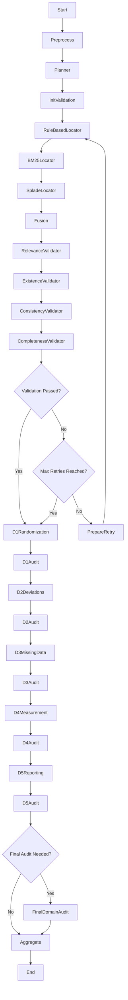
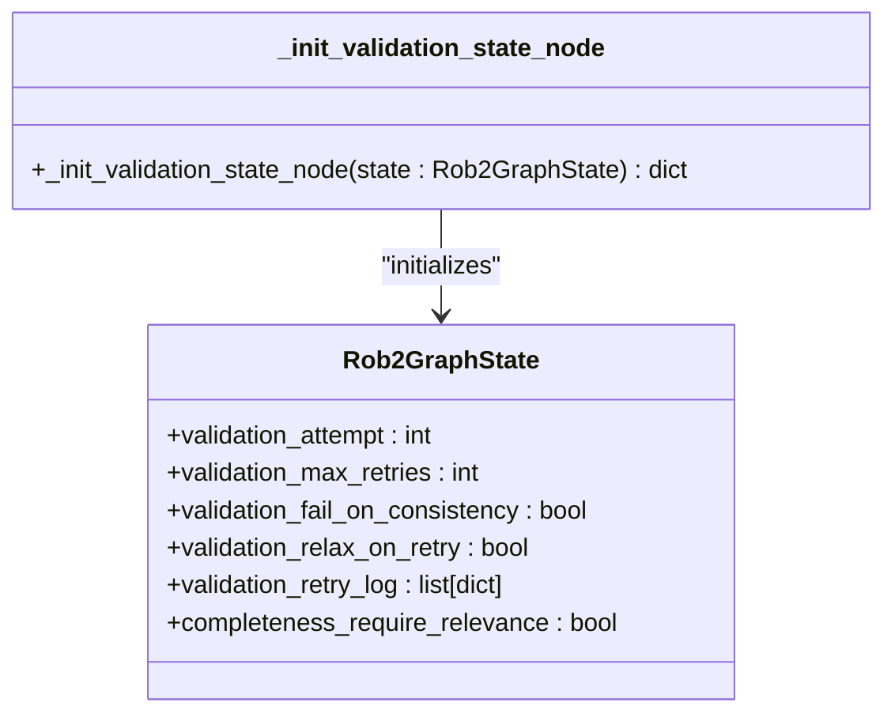
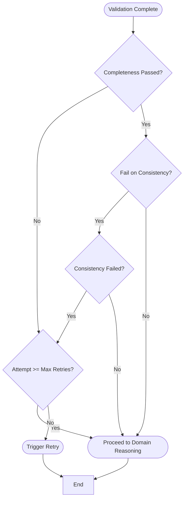
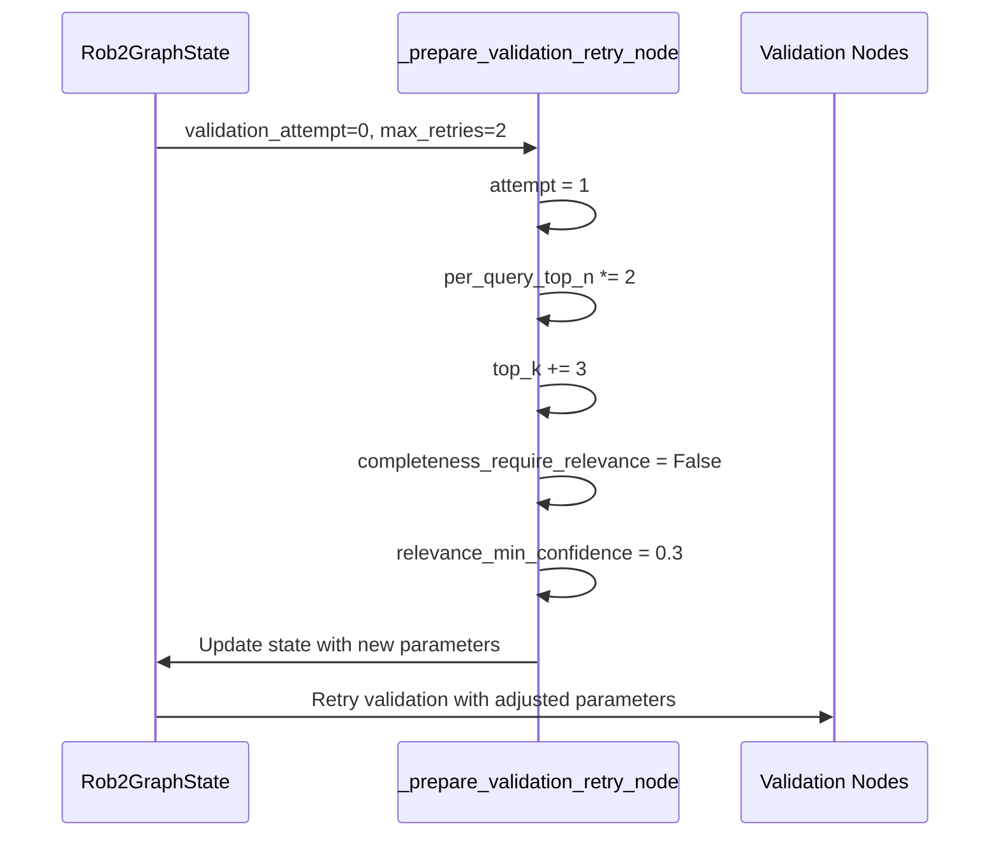
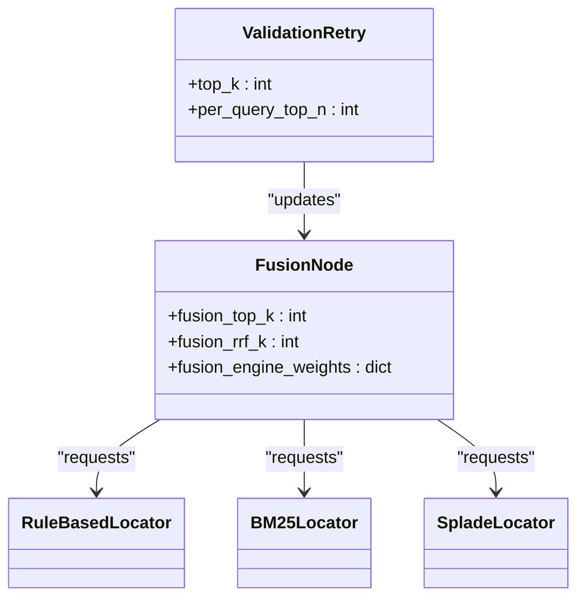

# Validation Retry Mechanism

<cite>
**Referenced Files in This Document**   
- [rob2_graph.py](file://src/pipelines/graphs/rob2_graph.py)
- [routing.py](file://src/pipelines/graphs/routing.py)
- [completeness.py](file://src/pipelines/graphs/nodes/validators/completeness.py)
- [relevance.py](file://src/pipelines/graphs/nodes/validators/relevance.py)
- [existence.py](file://src/pipelines/graphs/nodes/validators/existence.py)
- [consistency.py](file://src/pipelines/graphs/nodes/validators/consistency.py)
- [test_rob2_workflow_retry.py](file://tests/integration/test_rob2_workflow_retry.py)
- [validate.py](file://src/cli/commands/validate.py)
- [config.py](file://src/core/config.py)
- [0003-validation-mode-and-completeness-relaxation.md](file://docs/adr/0003-validation-mode-and-completeness-relaxation.md)
</cite>

## Table of Contents
1. [Introduction](#introduction)
2. [Architecture Overview](#architecture-overview)
3. [Core Components](#core-components)
4. [Retry Logic Implementation](#retry-logic-implementation)
5. [Configuration Options](#configuration-options)
6. [Interaction with Planner and Fusion Components](#interaction-with-planner-and-fusion-components)
7. [Common Issues and Troubleshooting](#common-issues-and-troubleshooting)
8. [Performance Considerations](#performance-considerations)
9. [Conclusion](#conclusion)

## Introduction
The validation retry mechanism in the ROB2 LangGraph workflow is designed to handle failed validation checks by triggering targeted retries with adjusted parameters or alternative evidence sources. This document provides a comprehensive analysis of how the system manages validation failures, including conditional routing based on validation outcomes, interaction with planner and fusion components, configuration options, and performance implications.

**Section sources**
- [rob2_graph.py](file://src/pipelines/graphs/rob2_graph.py#L1-L426)

## Architecture Overview
The validation retry mechanism is implemented within the LangGraph state machine, which orchestrates the entire ROB2 workflow. The system follows a sequential pipeline from preprocessing through evidence location, fusion, validation, and domain reasoning, with the ability to rollback to earlier stages when validation fails.

**Diagram sources**
- [rob2_graph.py](file://src/pipelines/graphs/rob2_graph.py#L288-L422)

## Core Components
The validation retry mechanism consists of several key components that work together to ensure robust evidence validation. These include the validation state initialization, validation nodes for different criteria (relevance, existence, consistency, completeness), and the routing logic that determines whether to retry or proceed.

**Section sources**
- [rob2_graph.py](file://src/pipelines/graphs/rob2_graph.py#L216-L245)
- [completeness.py](file://src/pipelines/graphs/nodes/validators/completeness.py#L20-L140)
- [relevance.py](file://src/pipelines/graphs/nodes/validators/relevance.py#L24-L207)
- [existence.py](file://src/pipelines/graphs/nodes/validators/existence.py#L13-L107)
- [consistency.py](file://src/pipelines/graphs/nodes/validators/consistency.py#L17-L159)

## Retry Logic Implementation
The retry logic is implemented through a combination of state management and conditional routing within the LangGraph framework. When validation fails, the system triggers a retry by rolling back to the evidence location phase with adjusted parameters.

### State Initialization
The validation state is initialized with default values for retry attempts, maximum retries, and other configuration parameters:

**Diagram sources**
- [rob2_graph.py](file://src/pipelines/graphs/rob2_graph.py#L216-L245)

### Conditional Routing
The routing decision is made by the `validation_should_retry` function, which evaluates the validation outcome and determines whether to retry or proceed:

**Diagram sources**
- [routing.py](file://src/pipelines/graphs/routing.py#L28-L43)

### Retry Preparation
When a retry is triggered, the `_prepare_validation_retry_node` function adjusts the validation parameters to increase the likelihood of success in subsequent attempts:

**Diagram sources**
- [rob2_graph.py](file://src/pipelines/graphs/rob2_graph.py#L248-L285)

## Configuration Options
The validation retry mechanism provides several configuration options that control its behavior, including maximum retry attempts, backoff strategies, and conditions for escalation.

### Retry Parameters
The following parameters control the retry behavior:

| Parameter | Default Value | Description |
|---------|-------------|-----------|
| `validation_max_retries` | 1 | Maximum number of retry attempts allowed |
| `validation_fail_on_consistency` | True | Whether consistency failures should trigger retries |
| `validation_relax_on_retry` | True | Whether to relax validation criteria during retries |
| `per_query_top_n` | 50 | Number of candidates to consider per query |
| `top_k` | 5 | Number of top candidates to return |

**Section sources**
- [rob2_graph.py](file://src/pipelines/graphs/rob2_graph.py#L206-L210)
- [rob2_runner.py](file://src/services/rob2_runner.py#L242-L246)

### Backoff Strategy
The system implements an adaptive backoff strategy by progressively adjusting the search and validation parameters:

1. **First retry**: Disable structure-aware filtering
2. **Subsequent retries**: 
   - Double the `per_query_top_n` value (capped at 200)
   - Increase `top_k` by 3 (capped at 10)
   - Relax validation criteria when `validation_relax_on_retry` is enabled

This approach increases the evidence pool and reduces validation strictness to improve the chances of successful validation.

**Section sources**
- [rob2_graph.py](file://src/pipelines/graphs/rob2_graph.py#L260-L271)

## Interaction with Planner and Fusion Components
The validation retry mechanism interacts closely with the planner and fusion components during the retry process, ensuring that updated parameters are propagated throughout the workflow.

### Planner Interaction
During retries, the planner component is not re-invoked as the question set remains unchanged. However, the adjusted search parameters affect how evidence is located for the existing questions.

### Fusion Component Interaction
The fusion component receives updated parameters during retries, particularly the increased `top_k` and `per_query_top_n` values. This allows the fusion process to consider a broader set of candidates from multiple evidence sources (rule-based, BM25, SPLADE).

**Diagram sources**
- [rob2_graph.py](file://src/pipelines/graphs/rob2_graph.py#L311-L311)
- [fusion.py](file://src/pipelines/graphs/nodes/fusion.py#L16-L113)

## Common Issues and Troubleshooting
The validation retry mechanism may encounter several common issues that require troubleshooting.

### Infinite Retry Loops
Infinite retry loops can occur if the validation criteria are too strict or if the evidence sources cannot provide adequate evidence. This is prevented by the `validation_max_retries` parameter, which limits the number of retry attempts.

### Diminishing Returns
After multiple retries, the marginal improvement in validation success may diminish. The system addresses this by:
- Capping parameter increases (e.g., `per_query_top_n` at 200)
- Implementing a maximum retry limit
- Logging retry attempts for analysis

### Troubleshooting Guidance
When validation retries are not resolving issues:

1. **Check the validation retry log**:
   - Examine `validation_retry_log` for patterns in failed questions
   - Verify that parameter adjustments are being applied

2. **Review evidence sources**:
   - Ensure rule-based, BM25, and SPLADE locators are functioning
   - Check that sufficient candidates are being generated

3. **Adjust configuration**:
   - Increase `validation_max_retries` if appropriate
   - Set `validation_relax_on_retry` to False for stricter validation
   - Modify initial `top_k` and `per_query_top_n` values

**Section sources**
- [test_rob2_workflow_retry.py](file://tests/integration/test_rob2_workflow_retry.py#L120-L278)
- [rob2_graph.py](file://src/pipelines/graphs/rob2_graph.py#L210-L211)

## Performance Considerations
The validation retry mechanism has several performance implications that should be considered.

### Workflow Duration
Each retry significantly increases the overall workflow duration due to:
- Re-execution of evidence location (rule-based, BM25, SPLADE)
- Re-execution of fusion and validation steps
- Additional LLM calls for relevance and consistency validation

The recursion limit is set to 100 to accommodate the extended workflow with retries, compared to the default LangGraph limit of 25.

### Resource Consumption
Retries increase resource consumption in several ways:
- **Memory**: State grows with each retry attempt (e.g., `validation_retry_log`)
- **Compute**: Additional processing for evidence location and validation
- **LLM Usage**: Increased number of LLM calls, particularly for relevance and consistency validation

### Optimization Recommendations
To optimize performance:
- Set appropriate `validation_max_retries` values based on use case
- Monitor the effectiveness of parameter adjustments
- Consider caching results from previous attempts when possible
- Use the validation CLI tools to test configurations before full execution

**Section sources**
- [rob2_graph.py](file://src/pipelines/graphs/rob2_graph.py#L418-L422)
- [validate.py](file://src/cli/commands/validate.py#L103-L446)

## Conclusion
The validation retry mechanism in the ROB2 LangGraph workflow provides a robust approach to handling failed validation checks by triggering targeted retries with adjusted parameters. The system leverages the LangGraph state machine to implement conditional routing based on validation outcomes, allowing for intelligent rollback to earlier stages when necessary. By progressively relaxing validation criteria and expanding the evidence search parameters, the mechanism increases the likelihood of successful validation while preventing infinite retry loops through configurable limits. The integration with planner and fusion components ensures that updated parameters are propagated throughout the workflow, and comprehensive logging enables effective troubleshooting and performance optimization.