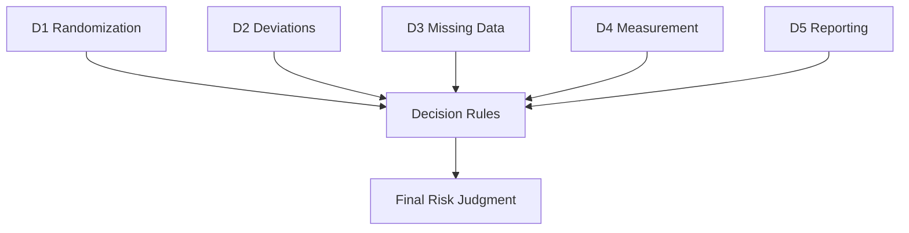

# FAQ

<cite>
**Referenced Files in This Document**   
- [pyproject.toml](file://pyproject.toml)
- [Milestones.md](file://docs/Milestones.md)
- [requirements.md](file://docs/requirements.md)
- [architecture.md](file://docs/architecture.md)
- [config.py](file://src/core/config.py)
- [app.py](file://src/cli/app.py)
- [rob2_graph.py](file://src/pipelines/graphs/rob2_graph.py)
- [bm25.py](file://src/retrieval/engines/bm25.py)
- [relevance.py](file://src/evidence/validators/relevance.py)
- [decision_rules.py](file://src/rob2/decision_rules.py)
- [completeness.py](file://src/pipelines/graphs/nodes/validators/completeness.py)
- [0003-validation-mode-and-completeness-relaxation.md](file://docs/adr/0003-validation-mode-and-completeness-relaxation.md)
- [planner.py](file://src/retrieval/query_planning/planner.py)
</cite>

## Table of Contents
1. [System Requirements](#system-requirements)
2. [Installation Issues](#installation-issues)
3. [Configuration Questions](#configuration-questions)
4. [Usage Patterns](#usage-patterns)
5. [Retrieval Methods](#retrieval-methods)
6. [Validation Settings](#validation-settings)
7. [Domain Reasoning Approaches](#domain-reasoning-approaches)
8. [Performance Expectations and Resource Requirements](#performance-expectations-and-resource-requirements)
9. [Output Interpretation and Result Reliability](#output-interpretation-and-result-reliability)
10. [Extensibility and Customization Options](#extensibility-and-customization-options)
11. [Tool Capabilities and Limitations](#tool-capabilities-and-limitations)

## System Requirements

The eAgent system has specific system requirements to ensure proper functionality. The application requires Python 3.13 or higher as specified in the `pyproject.toml` file. The system depends on several key packages including langchain (>=0.3.0), langgraph, pydantic (>=2), and faiss-cpu (>=1.13.1). For document parsing, the system uses docling (>=2.63.0) to convert PDFs into structured JSON format. The system is designed to work with various LLM providers including Anthropic and OpenAI through their respective langchain integrations. Additional optional dependencies exist for visualization capabilities, requiring gradio, pymupdf, and pillow when the visual feature set is enabled.

**Section sources**
- [pyproject.toml](file://pyproject.toml#L9-L27)
- [requirements.md](file://docs/requirements.md#L1-L309)

## Installation Issues

Common installation issues typically relate to Python version compatibility and dependency resolution. Ensure you are using Python 3.13 or higher, as specified in the project requirements. When installing dependencies, use uv (as indicated by the build system configuration) rather than pip to avoid dependency conflicts. The project uses uv_build as its build backend, so standard installation commands like `uv install` should be used. If encountering issues with optional dependencies, install them explicitly using `uv install .[visual]` for visualization components or `uv install .[test]` for testing components. Missing environment variables can also cause installation issues; copy the `.env.example` file to `.env` to ensure all required configuration variables are present.

**Section sources**
- [pyproject.toml](file://pyproject.toml#L48-L50)
- [.env.example](file://.env.example)

## Configuration Questions

Configuration is managed through environment variables and the Settings class in `src/core/config.py`. The system uses Pydantic Settings for configuration management, loading values from a `.env` file by default. Key configuration categories include document parsing (DOCLING_LAYOUT_MODEL, DOCLING_CHUNKER_MODEL), query planning (QUERY_PLANNER_MODEL, QUERY_PLANNER_TEMPERATURE), retrieval (SPLADE_MODEL_ID, RERANKER_MODEL_ID), validation (RELEVANCE_MODEL, CONSISTENCY_MODEL), and domain-specific models (D1_MODEL, D2_MODEL, etc.). The domain audit functionality can be controlled via DOMAIN_AUDIT_MODE, which defaults to "none". For LLM configuration, each component can have its own model, provider, temperature, timeout, max tokens, and retry settings, allowing fine-grained control over behavior and cost.

**Section sources**
- [config.py](file://src/core/config.py#L1-L200)
- [.env.example](file://.env.example)

## Usage Patterns

The primary usage pattern is through the CLI interface with the `rob2` command. The main entry point is the `run` command which processes a PDF and outputs ROB2 assessment results. Users can specify options via command line arguments, JSON strings, or JSON/YAML files. The system supports multiple output formats including JSON and Markdown tables. Debug levels can be set to "none", "min", or "full" for troubleshooting. Additional subcommands are available for specific tasks: `config` for configuration management, `questions` for ROB2 question handling, `graph` for workflow operations, `validate` for evidence validation, `retrieval` for retrieval testing, `fusion` for evidence fusion, `locator` for evidence location, `audit` for domain auditing, `cache` for cache operations, and `playground` for experimentation.

**Section sources**
- [app.py](file://src/cli/app.py#L71-L145)
- [rob2_graph.py](file://src/pipelines/graphs/rob2_graph.py#L288-L426)

## Retrieval Methods

The system employs three primary retrieval methods that work in parallel: Rule-Based Locator, BM25 retrieval, and SPLADE retrieval. The Rule-Based Locator uses section titles and keywords to identify relevant passages, providing a stable "anchor" for evidence location. BM25 provides traditional lexical search capabilities, implemented in `src/retrieval/engines/bm25.py` with customizable k1 and b parameters. SPLADE offers sparse transformer-based retrieval, which can capture more nuanced semantic relationships. These methods can operate in both LLM-Aware mode (generating multiple queries) and Structure-Aware mode (constraining search to relevant sections). Results from multiple retrieval engines are combined using Rank Fusion (RRF) to produce a consolidated set of candidates.

**Section sources**
- [architecture.md](file://docs/architecture.md#L22-L26)
- [bm25.py](file://src/retrieval/engines/bm25.py#L1-L149)
- [planner.py](file://src/retrieval/query_planning/planner.py#L1-L93)

## Validation Settings

Validation is a multi-stage process with four distinct validators: Existence, Relevance, Consistency, and Completeness. The Existence Validator confirms that evidence text actually exists in the source document. The Relevance Validator uses an LLM to determine if evidence directly answers the question, with configurable minimum confidence thresholds. The Consistency Validator checks for contradictions between different pieces of evidence. The Completeness Validator ensures all required questions have sufficient validated evidence. Validation settings are controlled through configuration parameters such as RELEVANCE_MIN_CONFIDENCE, and the system implements a retry mechanism that relaxes validation criteria if initial attempts fail. When relevance validation is disabled (relevance_mode=none), the completeness check automatically adjusts to not require relevance, ensuring the workflow can continue.

**Section sources**
- [relevance.py](file://src/evidence/validators/relevance.py#L1-L232)
- [completeness.py](file://src/pipelines/graphs/nodes/validators/completeness.py#L1-L140)
- [0003-validation-mode-and-completeness-relaxation.md](file://docs/adr/0003-validation-mode-and-completeness-relaxation.md#L1-L36)

## Domain Reasoning Approaches

Domain reasoning is handled by five specialized agents (D1-D5) corresponding to the five ROB2 domains. Each domain has its own decision rules implemented in `src/rob2/decision_rules.py`, which follow the official ROB2 decision trees. The reasoning process is separated from LLM inference: LLMs are used to answer sub-questions and provide reasoning, but the final risk judgment is determined by rule-based logic. This hybrid approach ensures scientific correctness while leveraging LLM capabilities. The domains are: D1 (Randomization), D2 (Deviations from Intended Interventions), D3 (Missing Outcome Data), D4 (Measurement of the Outcome), and D5 (Selection of the Reported Result). Each domain agent processes validated evidence and produces answers according to its specific decision tree.

**Diagram sources**
- [decision_rules.py](file://src/rob2/decision_rules.py#L1-L195)
- [rob2_graph.py](file://src/pipelines/graphs/rob2_graph.py#L25-L35)

**Section sources**
- [decision_rules.py](file://src/rob2/decision_rules.py#L1-L195)
- [rob2_graph.py](file://src/pipelines/graphs/rob2_graph.py#L25-L35)

## Performance Expectations and Resource Requirements

Performance varies based on configuration and document complexity. The system is designed for accuracy over speed, with multiple validation stages that can increase processing time. Resource requirements are primarily driven by LLM usage and retrieval models. The SPLADE model, in particular, has significant memory requirements. Processing time can range from several minutes to over ten minutes per document depending on settings. The system implements a retry mechanism that may increase execution time but improves result reliability. For optimal performance, ensure adequate RAM (16GB+ recommended) and a reliable internet connection for cloud-based LLMs. Local LLMs can reduce latency but require more local computational resources. The system's recursion limit is set to 100 to accommodate the retry workflow, which consumes additional memory.

**Section sources**
- [rob2_graph.py](file://src/pipelines/graphs/rob2_graph.py#L418-L422)
- [config.py](file://src/core/config.py#L1-L200)

## Output Interpretation and Result Reliability

The system outputs structured results including domain risk judgments, overall risk of bias, sub-question answers, and evidence citations. Results are available in both JSON and Markdown table formats. Each judgment is backed by validated evidence with paragraph IDs, page numbers, and text excerpts, enabling full traceability. The reliability of results is enhanced through multiple safeguards: evidence existence is verified against the source document, relevance is assessed by LLMs with confidence scoring, and completeness is checked against required questions. The system includes validation reports that detail the evidence selection process. When evidence is insufficient, the system returns "some concerns" rather than making unsupported judgments. The audit functionality can identify and correct potential oversights by re-examining the full text.

**Section sources**
- [rob2_graph.py](file://src/pipelines/graphs/rob2_graph.py#L280-L287)
- [requirements.md](file://docs/requirements.md#L74-L79)

## Extensibility and Customization Options

The system is designed with extensibility in mind, following the principle of "Correctness First" and "Evidence-Centric" design. The architecture supports replacing or upgrading individual components such as retrieval engines, validation agents, or LLM providers. Configuration is centralized in the Settings class, allowing easy modification of model choices, temperatures, and other parameters. New ROB versions (like ROBINS-I) can be incorporated by adding new domain reasoning agents. The modular design with separate nodes for each function (preprocessing, planning, retrieval, validation, reasoning) facilitates targeted improvements. The system also supports optional features like full-text domain audit that can be enabled or disabled as needed. Customization can be achieved through environment variables, configuration files, or direct code modification following the established patterns.

**Section sources**
- [requirements.md](file://docs/requirements.md#L61-L63)
- [architecture.md](file://docs/architecture.md#L239-L288)

## Tool Capabilities and Limitations

The tool is specifically designed for ROB2 assessment of randomized controlled trials and excels at evidence-based evaluation with high traceability. Its strengths include rigorous evidence validation, multiple retrieval methods, and rule-based decision making that prevents hallucination. However, it has several important limitations: it is not designed for pre-test assessment or clinical conclusion inference, it does not support Cluster/Crossover ROB2 variants, and it lacks a user interface. The system is not a "black box" - LLMs are used as tools within a controlled framework rather than as final arbiters. It cannot generate meta-analysis results or perform tasks outside the ROB2 scope. The system's reliability depends on proper configuration and appropriate LLM choices. While highly automated, it is intended to assist rather than replace human reviewers in systematic reviews.

**Section sources**
- [requirements.md](file://docs/requirements.md#L282-L289)
- [architecture.md](file://docs/architecture.md#L294-L308)