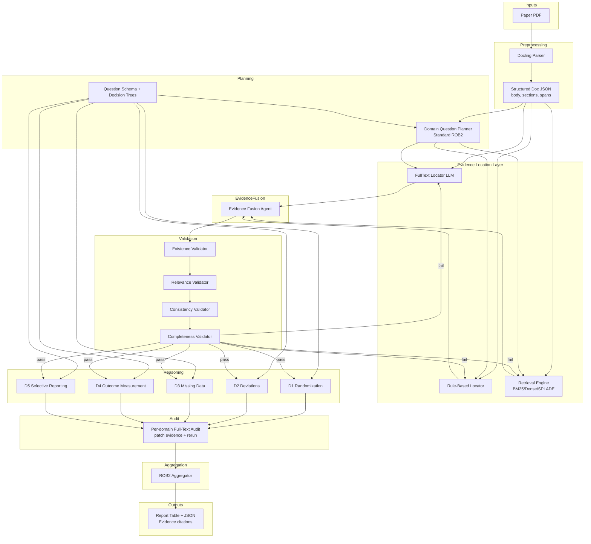
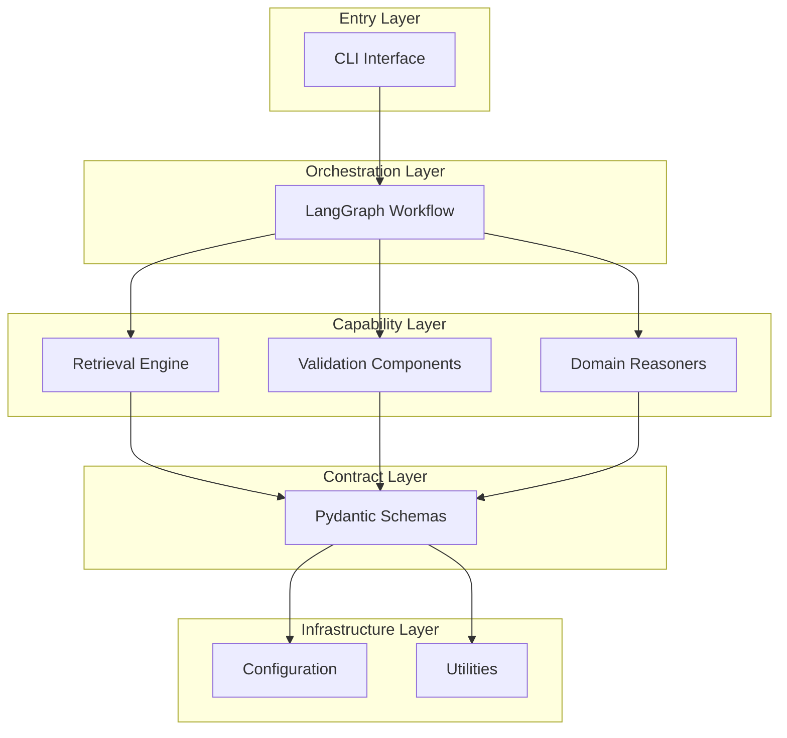

# Getting Started

<cite>
**Referenced Files in This Document**   
- [app.py](file://src/cli/app.py#L71-L145)
- [rob2_runner.py](file://src/services/rob2_runner.py#L41-L442)
- [rob2_graph.py](file://src/pipelines/graphs/rob2_graph.py#L288-L425)
- [architecture.md](file://docs/architecture.md#L6-L92)
- [interface_plan.md](file://docs/interface_plan.md#L132-L152)
- [common.py](file://src/cli/common.py#L15-L92)
- [requests.py](file://src/schemas/requests.py#L24-L166)
- [responses.py](file://src/schemas/responses.py#L12-L24)
- [config.py](file://src/core/config.py#L11-L199)
</cite>

## Table of Contents
1. [Introduction](#introduction)
2. [Prerequisites and Setup](#prerequisites-and-setup)
3. [Basic Workflow Overview](#basic-workflow-overview)
4. [Running Your First ROB2 Assessment](#running-your-first-rob2-assessment)
5. [Understanding Output Formats](#understanding-output-formats)
6. [Architecture and Interface Relationship](#architecture-and-interface-relationship)
7. [Common Usage Patterns](#common-usage-patterns)
8. [Troubleshooting Common Issues](#troubleshooting-common-issues)
9. [Learning Progression](#learning-progression)

## Introduction

This guide provides a comprehensive introduction to using the eagent tool for conducting ROB2 (Risk of Bias 2) assessments. The eagent tool is designed to automate the evaluation of scientific studies for potential biases using a sophisticated pipeline that combines document parsing, evidence retrieval, validation, and domain-specific reasoning. This document will walk you through the initial user experience, from installation to executing your first assessment, with a focus on practical usage and understanding the tool's architecture.

**Section sources**
- [interface_plan.md](file://docs/interface_plan.md#L1-L203)

## Prerequisites and Setup

Before using the eagent tool, ensure you have the following prerequisites:

- **Python 3.13 or higher**: The tool requires Python 3.13 as specified in the pyproject.toml file
- **Command-line interface (CLI) proficiency**: Basic understanding of terminal commands and navigation
- **Fundamental knowledge of LLMs**: Understanding of how large language models work and their role in evidence validation and reasoning
- **Sample PDF documents**: Have research papers in PDF format ready for assessment

To install the eagent tool, use the following command:

```bash
pip install eagent
```

The installation will automatically include all required dependencies such as langchain, langgraph, docling, and other packages specified in the pyproject.toml file. After installation, the `rob2` command will be available globally through the Typer CLI interface.

**Section sources**
- [pyproject.toml](file://pyproject.toml#L9-L27)
- [app.py](file://src/cli/app.py#L30-L39)

## Basic Workflow Overview

The eagent tool follows a structured workflow for conducting ROB2 assessments, as illustrated in the architecture diagram. The process begins with a PDF input and progresses through several stages:

1. **Preprocessing**: The PDF is parsed using Docling to extract structured content including body text, sections, and spans
2. **Planning**: A domain question planner generates the standard ROB2 question set and decision trees
3. **Evidence Location**: Three parallel engines locate candidate evidence:
   - FullText Locator LLM
   - Rule-Based Locator
   - Retrieval Engine (BM25/Dense/SPLADE)
4. **Evidence Fusion**: Candidate evidence is merged, deduplicated, and ranked
5. **Validation**: Evidence undergoes four validation checks:
   - Existence
   - Relevance
   - Consistency
   - Completeness
6. **Domain Reasoning**: Five domain-specific reasoners (D1-D5) analyze the validated evidence
7. **Audit**: Optional full-text audit with evidence patching
8. **Aggregation**: Results are compiled into the final ROB2 output

This workflow is orchestrated through LangGraph, which manages the state transitions and conditional execution paths.



**Diagram sources**
- [architecture.md](file://docs/architecture.md#L6-L92)

**Section sources**
- [architecture.md](file://docs/architecture.md#L239-L288)

## Running Your First ROB2 Assessment

To execute your first ROB2 assessment, use the `rob2 run` command followed by the path to your PDF file. Here's the basic syntax:

```bash
rob2 run /path/to/your/research_paper.pdf
```

For example, if you have a PDF file named "clinical_trial.pdf" in your current directory:

```bash
rob2 run clinical_trial.pdf
```

The command will process the PDF through the complete ROB2 assessment pipeline and output results in both Markdown table format and JSON (if requested). The tool automatically handles all intermediate steps including document parsing, evidence retrieval, validation, and domain reasoning.

The `run` command accepts several optional parameters that allow you to customize the assessment process:

- `--json`: Output results in JSON format
- `--no-table`: Suppress Markdown table output
- `--debug`: Set debug level (none, min, full)
- `--options`: Pass JSON string with run options
- `--options-file`: Specify a JSON/YAML file with run options
- `--set`: Override individual options using key=value syntax

**Section sources**
- [app.py](file://src/cli/app.py#L71-L145)
- [common.py](file://src/cli/common.py#L15-L92)

## Understanding Output Formats

The eagent tool provides results in multiple formats to accommodate different use cases. By default, it outputs a Markdown table that presents the ROB2 assessment results in a human-readable format. Additionally, you can request JSON output for programmatic processing.

### JSON Output

When using the `--json` flag, the tool outputs structured JSON data conforming to the Rob2RunResult schema. The JSON output includes:

- `result`: The final ROB2 assessment with overall and domain-level judgments
- `table_markdown`: The Markdown representation of the results
- `reports`: Validation reports (if included)
- `audit_reports`: Audit reports (if included)
- `debug`: Debug information (if debug level is not "none")
- `runtime_ms`: Execution time in milliseconds
- `warnings`: Any warnings generated during processing

Example JSON structure:
```json
{
  "result": {
    "overall": "Low",
    "domains": {
      "d1": "Low",
      "d2": "Some concerns",
      "d3": "Low",
      "d4": "Low",
      "d5": "Low"
    }
  },
  "table_markdown": "| Domain | Risk | ... |",
  "runtime_ms": 12345,
  "warnings": []
}
```

### Markdown Table Output

The default output format is a Markdown table that presents the assessment results in a clear, tabular format. This table includes columns for each domain (D1-D5) and the overall risk judgment, making it easy to interpret the results at a glance.

**Section sources**
- [responses.py](file://src/schemas/responses.py#L12-L24)
- [app.py](file://src/cli/app.py#L133-L138)

## Architecture and Interface Relationship

The eagent tool's architecture is designed with a clear separation between the core service layer and the user-facing interfaces. This design allows both the CLI and potential API endpoints to share the same underlying functionality while providing appropriate interfaces for different use cases.

The architecture follows a layered approach:

- **Infrastructure Layer**: Core configuration, logging, and utility functions
- **Contract Layer**: Pydantic schemas defining data structures
- **Capability Layer**: Individual components for retrieval, validation, and reasoning
- **Orchestration Layer**: LangGraph workflow that coordinates the assessment process
- **Entry Layer**: CLI interface that accepts user commands

The CLI interface, implemented using Typer, serves as the primary entry point for users. It maps command-line arguments to the Rob2RunOptions schema, which is then passed to the core service layer. The `run_rob2` function in the rob2_runner module serves as the central execution point, coordinating the entire assessment workflow.

This architecture enables consistent behavior across different interfaces while allowing for specialized features in each interface type. The CLI provides direct access to debugging and configuration options, making it ideal for both routine assessments and development work.



**Diagram sources**
- [interface_plan.md](file://docs/interface_plan.md#L77-L79)
- [rob2_runner.py](file://src/services/rob2_runner.py#L41-L442)

**Section sources**
- [interface_plan.md](file://docs/interface_plan.md#L39-L79)
- [rob2_graph.py](file://src/pipelines/graphs/rob2_graph.py#L288-L425)

## Common Usage Patterns

### Basic Assessment

The most common usage pattern is running a standard ROB2 assessment on a PDF file:

```bash
rob2 run my_paper.pdf --json
```

This command processes the PDF through the complete assessment pipeline and outputs results in both Markdown table format and JSON.

### Configuration Management

You can manage configuration through multiple methods, following the priority order: CLI parameters > configuration files > environment variables (.env). To override specific options:

```bash
rob2 run paper.pdf --set top_k=10 --set relevance_min_confidence=0.7
```

You can also use configuration files in JSON or YAML format:

```bash
rob2 run paper.pdf --options-file config.yaml
```

### Debugging with the --debug Flag

For troubleshooting and development, the `--debug` flag provides detailed information about the assessment process:

```bash
rob2 run paper.pdf --debug full
```

The debug levels are:
- `none`: No debug information (default)
- `min`: Minimal debug information
- `full`: Complete state information

When debug mode is enabled, additional information about validation attempts, retry logs, and internal state is included in the output, helping you understand how the tool arrived at its conclusions.

**Section sources**
- [app.py](file://src/cli/app.py#L95-L99)
- [rob2_runner.py](file://src/services/rob2_runner.py#L338-L388)
- [interface_plan.md](file://docs/interface_plan.md#L156-L158)

## Troubleshooting Common Issues

### Installation Problems

If you encounter installation issues, ensure you have Python 3.13 or higher installed. You can check your Python version with:

```bash
python --version
```

If dependencies fail to install, try upgrading pip first:

```bash
pip install --upgrade pip
```

### PDF Processing Errors

If the tool fails to process a PDF file, verify that:
- The file path is correct and accessible
- The file is a valid PDF document
- The file is not password-protected
- You have read permissions for the file

### Configuration Issues

When configuration options don't seem to be taking effect, remember the priority order:
1. CLI parameters (highest priority)
2. Configuration files
3. Environment variables (.env file)
4. Default values (lowest priority)

Check your .env file for conflicting settings that might override your CLI parameters.

### Performance Considerations

Large PDF files or complex assessments may take considerable time to process. If you experience long processing times:
- Ensure you have sufficient memory available
- Check your internet connection if using remote LLM services
- Consider using the `--debug` flag to identify bottlenecks
- Review your configuration settings for unnecessarily strict validation criteria

**Section sources**
- [config.py](file://src/core/config.py#L11-L199)
- [rob2_runner.py](file://src/services/rob2_runner.py#L124-L126)
- [app.py](file://src/cli/app.py#L73-L79)

## Learning Progression

Users typically progress through several stages when learning to use the eagent tool:

1. **Basic Usage**: Start with simple `rob2 run` commands on sample PDFs to understand the basic workflow and output formats.

2. **Configuration Exploration**: Experiment with different configuration options using the `--set` parameter to understand how they affect the assessment results.

3. **Debugging and Analysis**: Use the `--debug` flag to examine the internal processing steps and validation outcomes.

4. **Advanced Configuration**: Create configuration files to manage complex settings and share configurations across assessments.

5. **Customization and Extension**: Explore the various subcommands (`audit`, `validate`, `retrieval`) to perform targeted analyses and develop custom assessment workflows.

As you become more familiar with the tool, you can leverage its modular design to focus on specific aspects of the assessment process, such as validating evidence relevance or analyzing domain-specific reasoning patterns.

**Section sources**
- [interface_plan.md](file://docs/interface_plan.md#L139-L152)
- [app.py](file://src/cli/app.py#L41-L50)