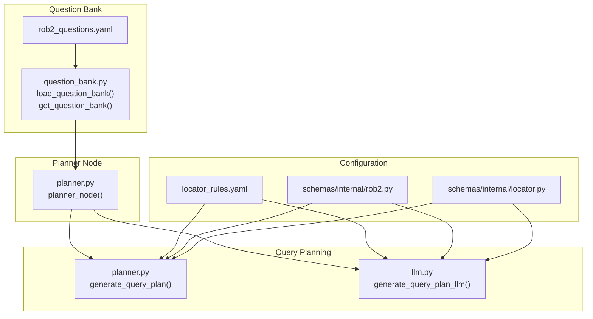
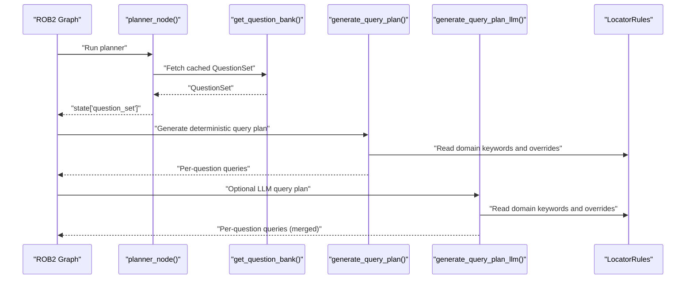
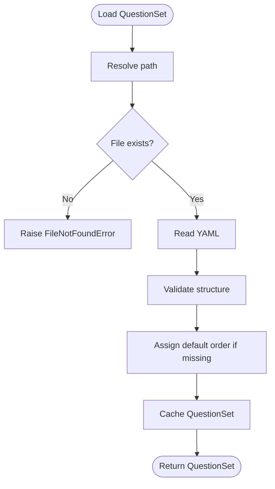
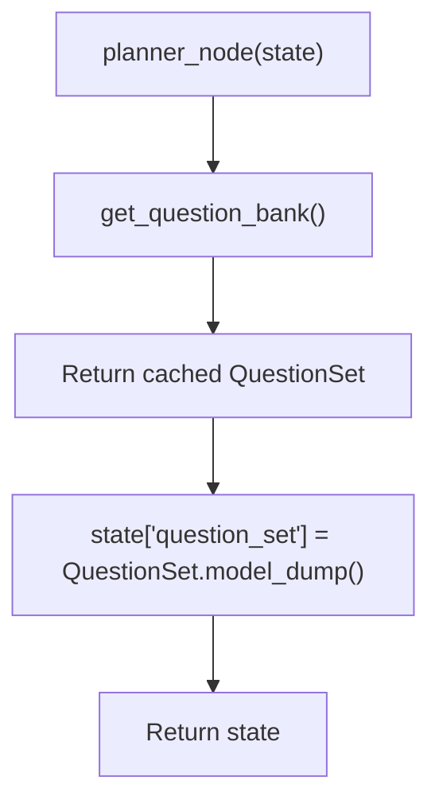
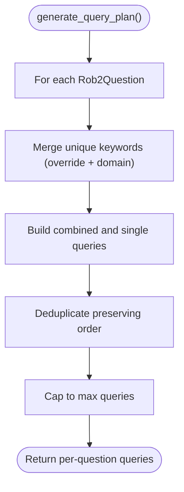
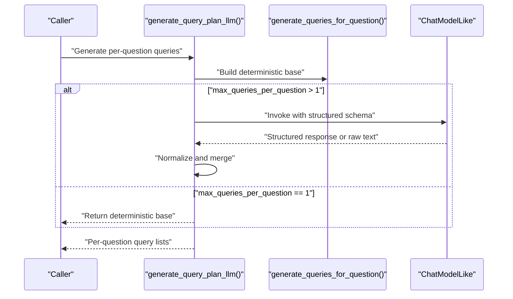
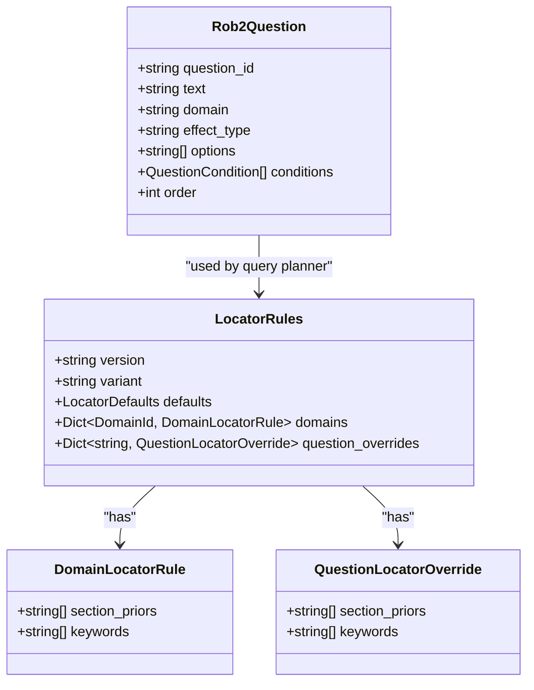
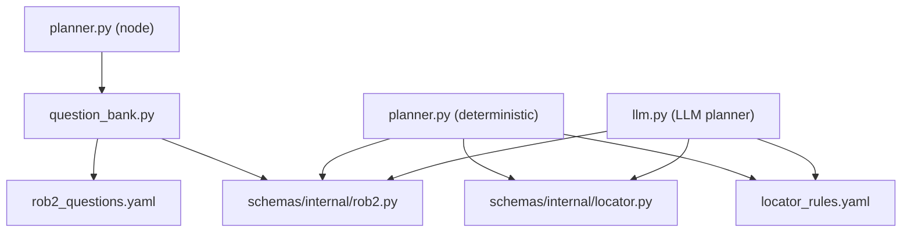

# Question Planning

<cite>
**Referenced Files in This Document**
- [question_bank.py](file://src/rob2/question_bank.py)
- [planner.py](file://src/pipelines/graphs/nodes/planner.py)
- [planner.py](file://src/retrieval/query_planning/planner.py)
- [llm.py](file://src/retrieval/query_planning/llm.py)
- [rob2_questions.yaml](file://src/rob2/rob2_questions.yaml)
- [locator_rules.yaml](file://src/rob2/locator_rules.yaml)
- [rob2_graph.py](file://src/pipelines/graphs/rob2_graph.py)
- [rob2.py](file://src/schemas/internal/rob2.py)
- [locator.py](file://src/schemas/internal/locator.py)
- [check_question_bank.py](file://scripts/check_question_bank.py)
- [test_planner.py](file://tests/unit/test_planner.py)
- [test_query_planner_llm.py](file://tests/unit/test_query_planner_llm.py)
</cite>

## Table of Contents
1. [Introduction](#introduction)
2. [Project Structure](#project-structure)
3. [Core Components](#core-components)
4. [Architecture Overview](#architecture-overview)
5. [Detailed Component Analysis](#detailed-component-analysis)
6. [Dependency Analysis](#dependency-analysis)
7. [Performance Considerations](#performance-considerations)
8. [Troubleshooting Guide](#troubleshooting-guide)
9. [Conclusion](#conclusion)
10. [Appendices](#appendices)

## Introduction
This document explains the question planning sub-feature that generates ROB2 assessment questions from the question bank and maps high-level assessment goals to specific evidence retrieval queries. It covers:
- How the question bank is loaded and validated
- Deterministic query planning using domain and question-specific keywords
- LLM-based query planning as an optional enhancement
- The planner node’s role in exposing standardized question sets
- Examples across clinical trial types (randomized controlled trials)
- Adaptation to document content and user configuration
- Performance considerations and extension guidance for specialized domains

## Project Structure
The question planning feature spans three layers:
- Question bank loading and caching
- Planner node that exposes the question set
- Query planning strategies (deterministic and LLM-based)

**Diagram sources**
- [question_bank.py](file://src/rob2/question_bank.py#L15-L41)
- [planner.py](file://src/pipelines/graphs/nodes/planner.py#L8-L11)
- [planner.py](file://src/retrieval/query_planning/planner.py#L11-L62)
- [llm.py](file://src/retrieval/query_planning/llm.py#L50-L107)
- [rob2_questions.yaml](file://src/rob2/rob2_questions.yaml#L1-L244)
- [locator_rules.yaml](file://src/rob2/locator_rules.yaml#L1-L161)
- [rob2.py](file://src/schemas/internal/rob2.py#L47-L121)
- [locator.py](file://src/schemas/internal/locator.py#L12-L67)

**Section sources**
- [question_bank.py](file://src/rob2/question_bank.py#L15-L41)
- [planner.py](file://src/pipelines/graphs/nodes/planner.py#L8-L11)
- [planner.py](file://src/retrieval/query_planning/planner.py#L11-L62)
- [llm.py](file://src/retrieval/query_planning/llm.py#L50-L107)
- [rob2_questions.yaml](file://src/rob2/rob2_questions.yaml#L1-L244)
- [locator_rules.yaml](file://src/rob2/locator_rules.yaml#L1-L161)
- [rob2.py](file://src/schemas/internal/rob2.py#L47-L121)
- [locator.py](file://src/schemas/internal/locator.py#L12-L67)

## Core Components
- Question bank loader and cache:
  - Loads YAML, validates structure, assigns default ordering, and caches the QuestionSet for reuse.
- Planner node:
  - Returns the standardized QuestionSet to downstream stages.
- Deterministic query planner:
  - Builds candidate queries per question using domain keywords and question overrides, deduplicates, and caps counts.
- LLM-based query planner:
  - Optionally augments deterministic queries with LLM-generated ones, merges and normalizes results, and enforces constraints.

Key responsibilities:
- Expose a canonical, validated question set
- Produce stable, configurable retrieval queries per question
- Allow deterministic or LLM-driven strategies depending on configuration

**Section sources**
- [question_bank.py](file://src/rob2/question_bank.py#L15-L41)
- [planner.py](file://src/pipelines/graphs/nodes/planner.py#L8-L11)
- [planner.py](file://src/retrieval/query_planning/planner.py#L11-L62)
- [llm.py](file://src/retrieval/query_planning/llm.py#L50-L107)

## Architecture Overview
The planner sits early in the ROB2 workflow, feeding standardized questions to the query planning stage. The query planner then produces a per-question list of retrieval queries informed by domain rules and question overrides.

**Diagram sources**
- [rob2_graph.py](file://src/pipelines/graphs/rob2_graph.py#L293-L384)
- [planner.py](file://src/pipelines/graphs/nodes/planner.py#L8-L11)
- [question_bank.py](file://src/rob2/question_bank.py#L36-L41)
- [planner.py](file://src/retrieval/query_planning/planner.py#L11-L62)
- [llm.py](file://src/retrieval/query_planning/llm.py#L50-L107)
- [locator_rules.yaml](file://src/rob2/locator_rules.yaml#L1-L161)

## Detailed Component Analysis

### Question Bank Loading and Validation
- Loads the YAML file, ensures it is a mapping with a questions list, assigns order indices if missing, and validates against the QuestionSet schema.
- Caches the QuestionSet to avoid repeated IO and parsing overhead.

**Diagram sources**
- [question_bank.py](file://src/rob2/question_bank.py#L15-L41)

**Section sources**
- [question_bank.py](file://src/rob2/question_bank.py#L15-L41)
- [rob2_questions.yaml](file://src/rob2/rob2_questions.yaml#L1-L244)
- [rob2.py](file://src/schemas/internal/rob2.py#L82-L121)

### Planner Node
- Retrieves the cached QuestionSet and places it into the graph state under “question_set” for downstream nodes.

**Diagram sources**
- [planner.py](file://src/pipelines/graphs/nodes/planner.py#L8-L11)
- [question_bank.py](file://src/rob2/question_bank.py#L36-L41)

**Section sources**
- [planner.py](file://src/pipelines/graphs/nodes/planner.py#L8-L11)
- [rob2_graph.py](file://src/pipelines/graphs/rob2_graph.py#L293-L384)

### Deterministic Query Planning
- For each question, collects keyword phrases from:
  - Question-specific overrides
  - Domain defaults
- Builds a combined phrase and single-keyword queries, deduplicates preserving order, and limits the total count.

**Diagram sources**
- [planner.py](file://src/retrieval/query_planning/planner.py#L11-L62)
- [locator_rules.yaml](file://src/rob2/locator_rules.yaml#L1-L161)
- [locator.py](file://src/schemas/internal/locator.py#L20-L47)

**Section sources**
- [planner.py](file://src/retrieval/query_planning/planner.py#L11-L62)
- [locator_rules.yaml](file://src/rob2/locator_rules.yaml#L1-L161)
- [locator.py](file://src/schemas/internal/locator.py#L20-L47)

### LLM-Based Query Planning
- Generates deterministic base queries, then optionally asks an LLM to produce additional queries per question.
- Merges deterministic tail with LLM suggestions, deduplicates, and enforces constraints.
- Parses structured JSON or extracts JSON from code blocks, with robust normalization.

**Diagram sources**
- [llm.py](file://src/retrieval/query_planning/llm.py#L50-L107)
- [llm.py](file://src/retrieval/query_planning/llm.py#L127-L181)
- [llm.py](file://src/retrieval/query_planning/llm.py#L216-L239)
- [llm.py](file://src/retrieval/query_planning/llm.py#L241-L264)

**Section sources**
- [llm.py](file://src/retrieval/query_planning/llm.py#L50-L107)
- [llm.py](file://src/retrieval/query_planning/llm.py#L127-L181)
- [llm.py](file://src/retrieval/query_planning/llm.py#L216-L239)
- [llm.py](file://src/retrieval/query_planning/llm.py#L241-L264)

### Mapping High-Level Goals to Queries
- The planner node exposes a standardized QuestionSet with domain and effect_type metadata.
- The query planner uses:
  - Domain rules to bias retrieval toward relevant sections and keywords
  - Question overrides to tailor queries for specific questions
  - The question text as a base query to ensure coverage

**Diagram sources**
- [rob2.py](file://src/schemas/internal/rob2.py#L47-L81)
- [locator.py](file://src/schemas/internal/locator.py#L12-L67)
- [planner.py](file://src/retrieval/query_planning/planner.py#L32-L62)
- [llm.py](file://src/retrieval/query_planning/llm.py#L189-L214)

**Section sources**
- [rob2.py](file://src/schemas/internal/rob2.py#L47-L81)
- [locator.py](file://src/schemas/internal/locator.py#L12-L67)
- [planner.py](file://src/retrieval/query_planning/planner.py#L32-L62)
- [llm.py](file://src/retrieval/query_planning/llm.py#L189-L214)

### Examples Across Clinical Trial Types
- Randomized controlled trials (RCTs) align with ROB2 domains:
  - D1: Randomization process
  - D2: Deviations from intended interventions (assignment vs adherence)
  - D3: Missing outcome data
  - D4: Measurement of outcome
  - D5: Selection of reported result
- The planner node exposes the full set of ROB2 signaling questions for RCTs, while the query planner tailors retrieval queries per question using domain and question-specific keywords.

**Section sources**
- [rob2_questions.yaml](file://src/rob2/rob2_questions.yaml#L1-L244)
- [locator_rules.yaml](file://src/rob2/locator_rules.yaml#L1-L161)

### Adapting to Document Content and User Configuration
- Domain rules influence section priors and keyword lists, guiding retrieval toward likely locations and terminology.
- Question overrides allow targeted adjustments for specific questions (e.g., D1 q1_1, q1_2, q1_3).
- The planner respects user configuration such as maximum queries per question and keyword limits.

**Section sources**
- [locator_rules.yaml](file://src/rob2/locator_rules.yaml#L1-L161)
- [planner.py](file://src/retrieval/query_planning/planner.py#L11-L29)
- [llm.py](file://src/retrieval/query_planning/llm.py#L50-L74)

## Dependency Analysis
- Question bank depends on YAML and Pydantic schemas for validation.
- Planner node depends on the cached QuestionSet.
- Query planners depend on:
  - QuestionSet schema for question metadata
  - LocatorRules schema for domain and overrides
  - Domain rules YAML for keyword and section priors

**Diagram sources**
- [question_bank.py](file://src/rob2/question_bank.py#L15-L41)
- [rob2.py](file://src/schemas/internal/rob2.py#L47-L121)
- [locator.py](file://src/schemas/internal/locator.py#L12-L67)
- [planner.py](file://src/retrieval/query_planning/planner.py#L11-L62)
- [llm.py](file://src/retrieval/query_planning/llm.py#L50-L107)
- [locator_rules.yaml](file://src/rob2/locator_rules.yaml#L1-L161)

**Section sources**
- [question_bank.py](file://src/rob2/question_bank.py#L15-L41)
- [rob2.py](file://src/schemas/internal/rob2.py#L47-L121)
- [locator.py](file://src/schemas/internal/locator.py#L12-L67)
- [planner.py](file://src/retrieval/query_planning/planner.py#L11-L62)
- [llm.py](file://src/retrieval/query_planning/llm.py#L50-L107)
- [locator_rules.yaml](file://src/rob2/locator_rules.yaml#L1-L161)

## Performance Considerations
- Caching:
  - The QuestionSet is cached to avoid repeated YAML reads and schema validation.
- Deterministic planner:
  - Uses fast set operations and list comprehensions; deduplication preserves order and reduces overhead.
- LLM planner:
  - Falls back to deterministic queries when LLM is unavailable or when max queries per question equals 1.
  - Normalization and merging minimize redundant queries.
- Configuration:
  - Limits on queries per question and keyword counts cap computational cost.
- Retry and relaxation in downstream validators can increase retrieval volume; tune query planning parameters accordingly.

[No sources needed since this section provides general guidance]

## Troubleshooting Guide
- Question bank errors:
  - Missing file or invalid YAML structure raises explicit errors during load.
  - Duplicate question IDs or invalid options cause validation errors.
- LLM planner:
  - Requires either an LLM instance or a configuration; otherwise raises an error.
  - If structured output fails, falls back to raw LLM output parsing with JSON extraction.
  - Unknown question IDs in LLM responses are ignored; deterministic queries are still used.
- Unit tests demonstrate expected behavior:
  - Counts and ordering of questions
  - Merging, deduplication, and limits for LLM planner
  - Parsing JSON code blocks and fallback behavior

**Section sources**
- [question_bank.py](file://src/rob2/question_bank.py#L15-L41)
- [rob2.py](file://src/schemas/internal/rob2.py#L47-L121)
- [llm.py](file://src/retrieval/query_planning/llm.py#L127-L181)
- [llm.py](file://src/retrieval/query_planning/llm.py#L216-L239)
- [test_planner.py](file://tests/unit/test_planner.py#L1-L36)
- [test_query_planner_llm.py](file://tests/unit/test_query_planner_llm.py#L1-L137)

## Conclusion
The question planning sub-feature standardizes ROB2 assessment questions and maps them to stable, configurable retrieval queries. The deterministic planner ensures reproducibility and low overhead, while the LLM planner enhances query diversity when configured. Together, they adapt to domain rules and question overrides, enabling robust evidence retrieval across RCT types.

[No sources needed since this section summarizes without analyzing specific files]

## Appendices

### Extending the Question Bank for Specialized Domains
- Add new questions to the YAML with required fields (question_id, domain, text, options).
- Optionally set effect_type for D2 questions and define conditions for branching logic.
- Maintain unique question IDs and consistent options.
- Update domain rules and question overrides as needed to guide retrieval.

**Section sources**
- [rob2_questions.yaml](file://src/rob2/rob2_questions.yaml#L1-L244)
- [locator_rules.yaml](file://src/rob2/locator_rules.yaml#L1-L161)
- [rob2.py](file://src/schemas/internal/rob2.py#L47-L121)

### CLI and Tests for Verification
- A script prints a summary of the question bank and validates structure.
- Unit tests verify counts, ordering, merging, deduplication, and LLM fallback behavior.

**Section sources**
- [check_question_bank.py](file://scripts/check_question_bank.py#L1-L76)
- [test_planner.py](file://tests/unit/test_planner.py#L1-L36)
- [test_query_planner_llm.py](file://tests/unit/test_query_planner_llm.py#L1-L137)