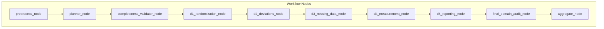
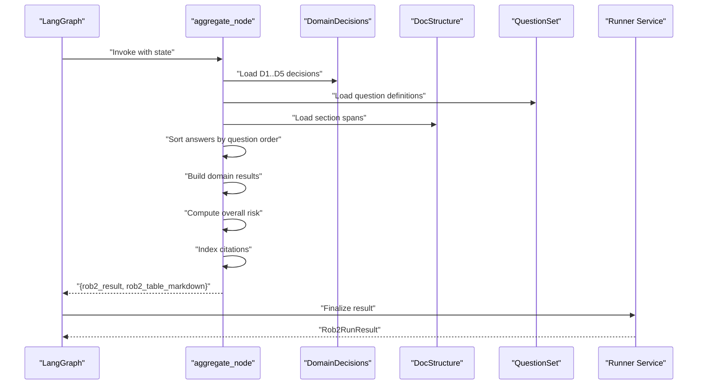
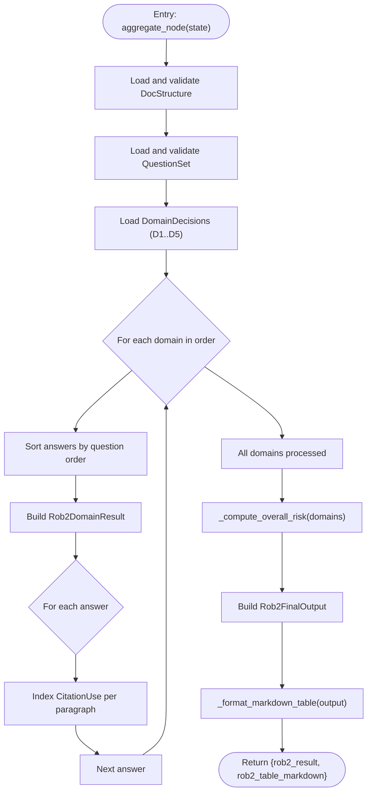
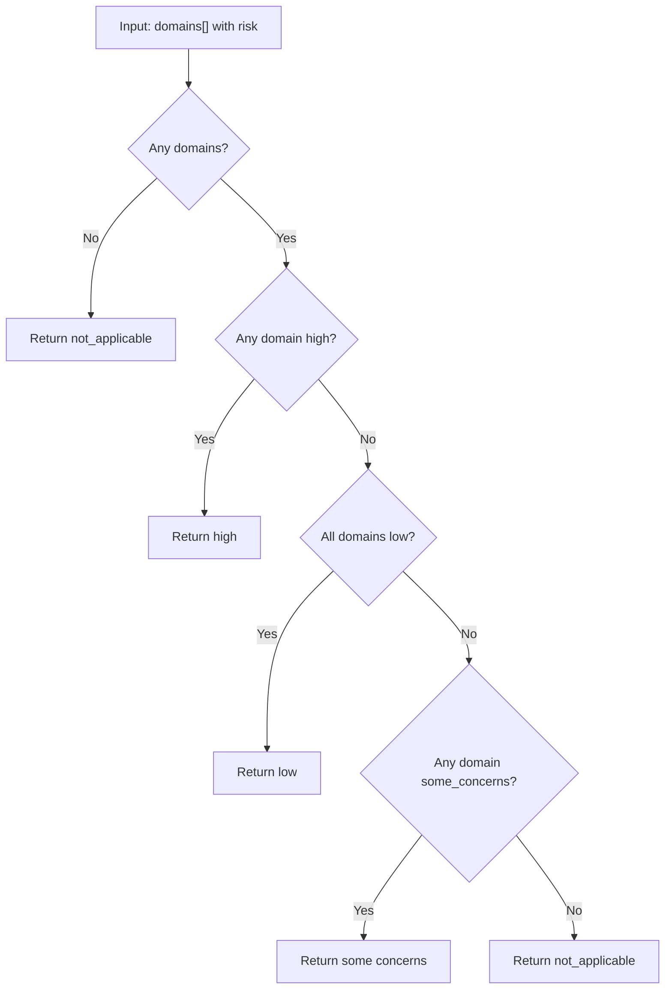
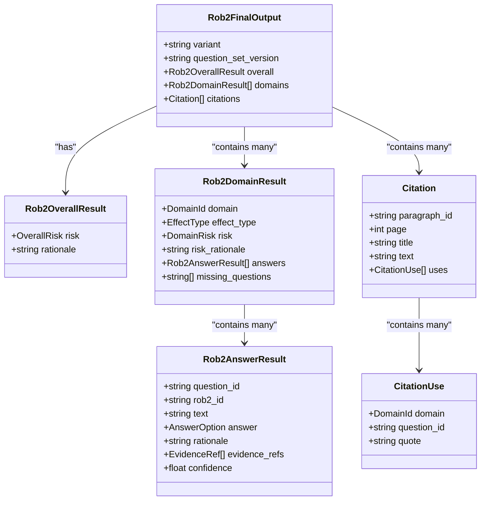
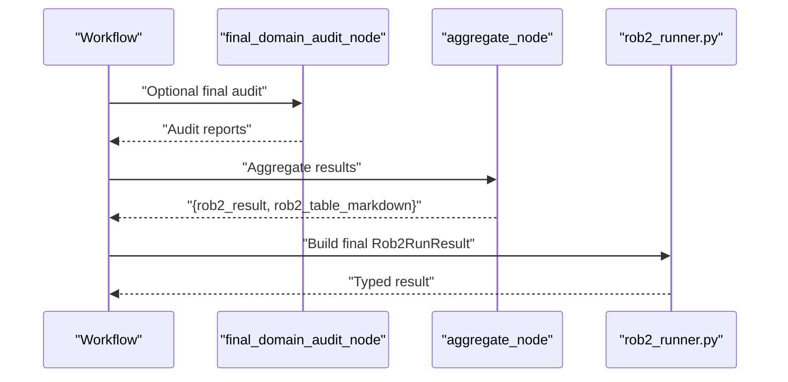
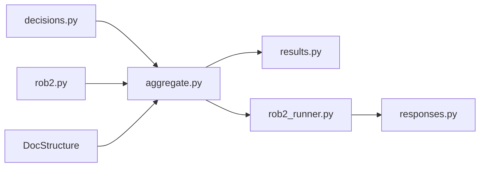

# Result Aggregation

<cite>
**Referenced Files in This Document**
- [aggregate.py](file://src/pipelines/graphs/nodes/aggregate.py)
- [results.py](file://src/schemas/internal/results.py)
- [decisions.py](file://src/schemas/internal/decisions.py)
- [rob2.py](file://src/schemas/internal/rob2.py)
- [0006-overall-risk-aggregation-rule.md](file://docs/adr/0006-overall-risk-aggregation-rule.md)
- [rob2_graph.py](file://src/pipelines/graphs/rob2_graph.py)
- [rob2_runner.py](file://src/services/rob2_runner.py)
- [responses.py](file://src/schemas/responses.py)
- [test_rob2_aggregate.py](file://tests/unit/test_rob2_aggregate.py)
- [system-uml.md](file://docs/system-uml.md)
</cite>

## Table of Contents
1. [Introduction](#introduction)
2. [Project Structure](#project-structure)
3. [Core Components](#core-components)
4. [Architecture Overview](#architecture-overview)
5. [Detailed Component Analysis](#detailed-component-analysis)
6. [Dependency Analysis](#dependency-analysis)
7. [Performance Considerations](#performance-considerations)
8. [Troubleshooting Guide](#troubleshooting-guide)
9. [Conclusion](#conclusion)
10. [Appendices](#appendices)

## Introduction
This document explains the result aggregation sub-feature that combines domain-level decisions into an overall risk of bias assessment. It describes the aggregation node’s implementation, its role in the final workflow stage, and the output formats produced, including structured JSON results and Markdown tables. It also covers how confidence levels and supporting evidence are summarized, accuracy considerations for aggregation, strategies for improving result clarity, and guidance for customizing output formats for different reporting needs.

## Project Structure
The aggregation feature is implemented as a dedicated node within the ROB2 LangGraph workflow. It consumes domain-level decisions, question definitions, and document structure to produce a final structured output and a Markdown summary table. The workflow integrates evidence validation and domain reasoning upstream, then routes to the aggregation node for final synthesis.

**Diagram sources**
- [rob2_graph.py](file://src/pipelines/graphs/rob2_graph.py#L288-L417)
- [system-uml.md](file://docs/system-uml.md#L3-L102)

**Section sources**
- [rob2_graph.py](file://src/pipelines/graphs/rob2_graph.py#L288-L417)
- [system-uml.md](file://docs/system-uml.md#L3-L102)

## Core Components
- Aggregation node: orchestrates domain decision loading, answer sorting, citation indexing, domain result construction, overall risk computation, and Markdown table formatting.
- Output schemas: define the final structured JSON and the Markdown summary table.
- Decision schemas: define domain-level answers, evidence references, and risk summaries.
- Question schemas: define the question set used to sort answers consistently.
- Runner service: builds the final external response including the structured JSON and Markdown table.

Key outputs:
- Structured JSON result: Rob2FinalOutput containing overall risk, domain results, and citations.
- Markdown table: A concise tabular summary of domain risks and overall risk.

**Section sources**
- [aggregate.py](file://src/pipelines/graphs/nodes/aggregate.py#L32-L109)
- [results.py](file://src/schemas/internal/results.py#L15-L81)
- [decisions.py](file://src/schemas/internal/decisions.py#L15-L58)
- [rob2.py](file://src/schemas/internal/rob2.py#L47-L122)
- [rob2_runner.py](file://src/services/rob2_runner.py#L319-L352)
- [responses.py](file://src/schemas/responses.py#L12-L24)

## Architecture Overview
The aggregation node sits at the end of the ROB2 workflow. It expects:
- Document structure (DocStructure) for section metadata and page ordering.
- Question set (QuestionSet) for answer ordering and question text.
- Domain decisions (D1–D5) as DomainDecision objects.
It produces:
- Final structured JSON (Rob2FinalOutput).
- Markdown table summary (rob2_table_markdown).

**Diagram sources**
- [rob2_graph.py](file://src/pipelines/graphs/rob2_graph.py#L376-L416)
- [aggregate.py](file://src/pipelines/graphs/nodes/aggregate.py#L32-L109)
- [rob2_runner.py](file://src/services/rob2_runner.py#L319-L352)

## Detailed Component Analysis

### Aggregation Node Implementation
The aggregation node performs:
- Input validation and parsing for document structure, question set, and domain decisions.
- Sorting of answers per domain according to question order.
- Building domain results with risk, effect type, answers, and missing questions.
- Indexing citations with paragraph-level metadata and usage references.
- Computing overall risk using the ROB2 Standard rule.
- Formatting a Markdown summary table.

**Diagram sources**
- [aggregate.py](file://src/pipelines/graphs/nodes/aggregate.py#L32-L109)

**Section sources**
- [aggregate.py](file://src/pipelines/graphs/nodes/aggregate.py#L32-L109)

### Overall Risk Aggregation Rule
The overall risk is computed using the ROB2 Standard rule:
- If any domain is high risk → overall high.
- Else if all domains are low risk → overall low.
- Else if any domain is some concerns → overall some concerns.
- Else not applicable.

This rule replaces earlier approximations and ensures alignment with ROB2 standards.

**Diagram sources**
- [aggregate.py](file://src/pipelines/graphs/nodes/aggregate.py#L140-L164)
- [0006-overall-risk-aggregation-rule.md](file://docs/adr/0006-overall-risk-aggregation-rule.md#L10-L21)

**Section sources**
- [aggregate.py](file://src/pipelines/graphs/nodes/aggregate.py#L140-L164)
- [0006-overall-risk-aggregation-rule.md](file://docs/adr/0006-overall-risk-aggregation-rule.md#L10-L21)

### Output Formats
- Structured JSON (Rob2FinalOutput): Contains overall risk, question set version, domain results, and citations.
- Markdown table: Summarizes domain risks and overall risk in a compact table.

**Diagram sources**
- [results.py](file://src/schemas/internal/results.py#L15-L81)

**Section sources**
- [results.py](file://src/schemas/internal/results.py#L15-L81)
- [aggregate.py](file://src/pipelines/graphs/nodes/aggregate.py#L98-L109)

### Confidence Levels and Supporting Evidence
- Confidence: Stored per answer as a float between 0 and 1.
- Evidence references: Attach paragraph-level references with optional page, title, and quote.
- Citations: Indexed by paragraph_id, aggregating all usages across domains and questions.

These fields enable traceability and transparency in the final report.

**Section sources**
- [decisions.py](file://src/schemas/internal/decisions.py#L15-L58)
- [results.py](file://src/schemas/internal/results.py#L15-L81)
- [aggregate.py](file://src/pipelines/graphs/nodes/aggregate.py#L60-L96)

### Examples of Aggregated Results and Interpretation
- Example 1: Any domain high → overall high.
- Example 2: Multiple some concerns → overall some concerns (ROB2 Standard).
- Example 3: Citation index built from evidence references.

These examples are covered by unit tests that validate the aggregation behavior and citation indexing.

**Section sources**
- [test_rob2_aggregate.py](file://tests/unit/test_rob2_aggregate.py#L46-L111)

### Role in the Final Workflow Stage
The aggregation node is the last node in the workflow. After domain audits (optional), the graph routes to the aggregation node, which produces the final structured output and Markdown table. The runner service then packages these outputs into a typed result for clients.

**Diagram sources**
- [rob2_graph.py](file://src/pipelines/graphs/rob2_graph.py#L400-L416)
- [rob2_runner.py](file://src/services/rob2_runner.py#L319-L352)

**Section sources**
- [rob2_graph.py](file://src/pipelines/graphs/rob2_graph.py#L400-L416)
- [rob2_runner.py](file://src/services/rob2_runner.py#L319-L352)

## Dependency Analysis
- The aggregation node depends on:
  - Domain decision schemas for per-question answers and risk summaries.
  - Question schemas for ordering and question text.
  - Document structure for section metadata and page ordering.
- The runner service depends on the final state produced by the aggregation node to construct the external response.

**Diagram sources**
- [aggregate.py](file://src/pipelines/graphs/nodes/aggregate.py#L10-L20)
- [decisions.py](file://src/schemas/internal/decisions.py#L15-L58)
- [rob2.py](file://src/schemas/internal/rob2.py#L47-L122)
- [results.py](file://src/schemas/internal/results.py#L15-L81)
- [rob2_runner.py](file://src/services/rob2_runner.py#L319-L352)
- [responses.py](file://src/schemas/responses.py#L12-L24)

**Section sources**
- [aggregate.py](file://src/pipelines/graphs/nodes/aggregate.py#L10-L20)
- [decisions.py](file://src/schemas/internal/decisions.py#L15-L58)
- [rob2.py](file://src/schemas/internal/rob2.py#L47-L122)
- [results.py](file://src/schemas/internal/results.py#L15-L81)
- [rob2_runner.py](file://src/services/rob2_runner.py#L319-L352)
- [responses.py](file://src/schemas/responses.py#L12-L24)

## Performance Considerations
- Aggregation is linear in the number of answers and paragraphs; overhead is minimal compared to earlier stages.
- Sorting answers by question order ensures deterministic presentation and efficient indexing.
- Citation indexing avoids duplicates by paragraph_id and aggregates usage references efficiently.

[No sources needed since this section provides general guidance]

## Troubleshooting Guide
Common issues and resolutions:
- Missing inputs: The aggregation node raises errors if doc_structure or question_set are absent.
- Missing domain decisions: The node raises errors if any domain decision is missing.
- Citation indexing: Ensure evidence_refs include paragraph_id; otherwise citations will not be indexed.

Validation and tests:
- Unit tests verify overall risk computation and citation indexing behavior.

**Section sources**
- [aggregate.py](file://src/pipelines/graphs/nodes/aggregate.py#L32-L56)
- [test_rob2_aggregate.py](file://tests/unit/test_rob2_aggregate.py#L46-L111)

## Conclusion
The aggregation sub-feature consolidates domain-level reasoning into a standardized overall risk assessment aligned with ROB2 Standards. It produces both a structured JSON result and a Markdown summary table, while preserving confidence levels and supporting evidence references for traceability. The implementation is robust, well-tested, and ready for production use.

[No sources needed since this section summarizes without analyzing specific files]

## Appendices

### Output Formats Reference
- Structured JSON (Rob2FinalOutput): overall risk, domain results, citations, and question set version.
- Markdown table: domain-level risks and overall risk summary.

**Section sources**
- [results.py](file://src/schemas/internal/results.py#L63-L81)
- [aggregate.py](file://src/pipelines/graphs/nodes/aggregate.py#L175-L186)

### Customizing Output Formats
- Structured JSON: Extend Rob2FinalOutput or add new fields in the runner service if needed.
- Markdown table: Modify the formatting function to change layout or add extra columns.
- Reports and debug payloads: Controlled by runner options and debug level.

**Section sources**
- [rob2_runner.py](file://src/services/rob2_runner.py#L319-L352)
- [responses.py](file://src/schemas/responses.py#L12-L24)